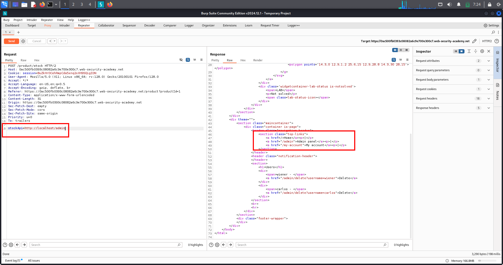
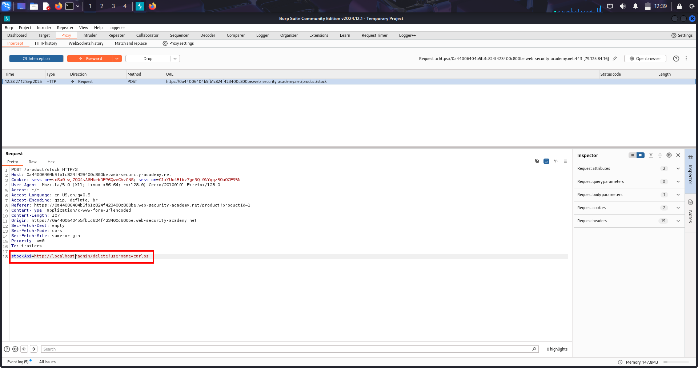

# SSRF — Server-Side Request Forgery

---

## 🔹 Overview
Server-Side Request Forgery (SSRF) occurs when an application fetches remote URLs supplied by an attacker.  
This allows attackers to make the server reach internal-only systems (localhost, internal IPs) or other services, potentially exposing sensitive data or triggering privileged actions.

---

## 🔹 Why this is dangerous
- Attackers can reach internal admin pages (localhost / 127.0.0.1) that are normally inaccessible from the outside.  
- The server’s trust in its own network can be abused to read data or perform actions (delete users, access metadata services, etc.).

---

## 🔹 Lab Description
The application exposes a stockApi parameter which the server fetches. By changing stockApi to http://localhost/admin, the server will request the admin page and return its HTML. From that response we can find a delete link (/delete?username=carlos) and then use SSRF again to trigger it.

---

## 🔹 Methodology / Steps

1. *Identify SSRF input*  
   - Intercept the request that contains stockApi (e.g., POST /product/stock).

2. *Trigger internal request*  
   - Modify stockApi to http://localhost/admin and send the request so the server fetches its own admin page.

     
   (Screenshot: modified stockApi → server fetched admin HTML showing admin links.)

3. *Find action URL*  
   - Inspect the returned HTML (Raw / Elements) and locate the delete link: /delete?username=carlos.

4. *Exploit via SSRF*  
   - Set stockApi to the discovered delete URL (e.g., http://localhost/delete?username=carlos) and send the request again.  
   - Server performs the delete action as it trusts local requests.

     
   (Screenshot: second SSRF showing delete request/response and confirmation that carlos was removed.)

5. *Verify*  
   - Confirm carlos no longer exists (site shows deletion or lab solved).

---

## 🔹 Security Impact
- Remote attackers can cause the server to access local-only services, potentially leading to data exfiltration, internal port scanning, or destructive actions (delete/modify resources).
- SSRF can be combined with other weaknesses for severe impact (e.g., metadata service access in cloud environments).

---

## 🔹 Remediation
- Implement an allowlist of allowed outbound hosts (only trusted domains).  
- Block requests to internal/private IP ranges (127.0.0.0/8, 10.0.0.0/8, 172.16.0.0/12, 192.168.0.0/16, 169.254.0.0/16).  
- Use an outbound proxy that validates/filters requested URLs.  
- Avoid directly requesting user-supplied URLs; validate and normalize inputs and disallow protocols like file:, gopher:, etc.

---
