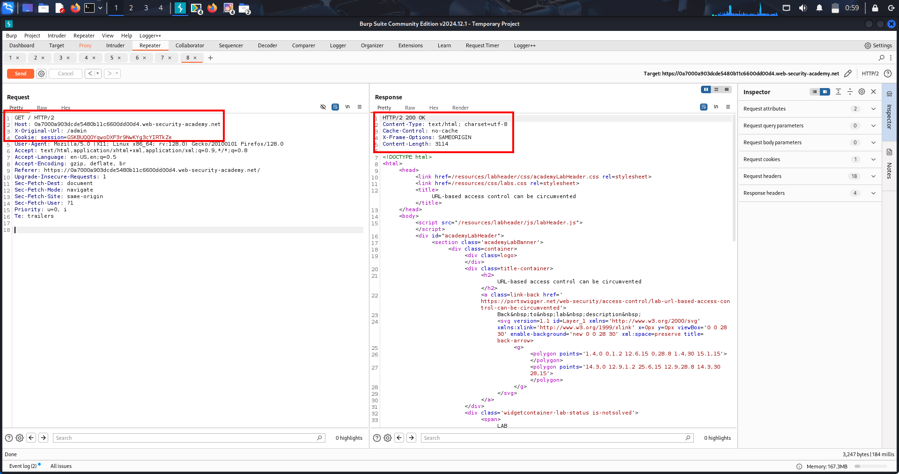
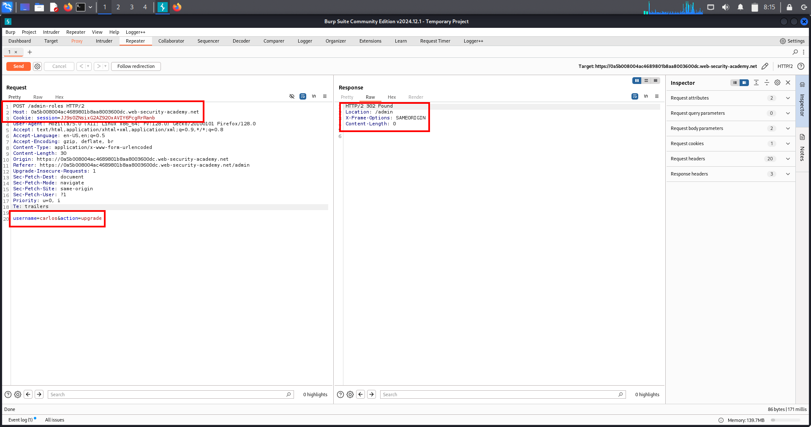
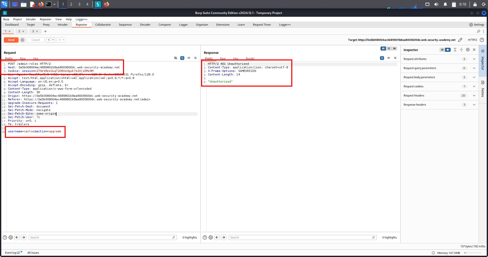
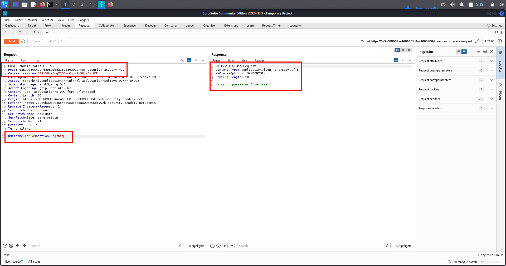
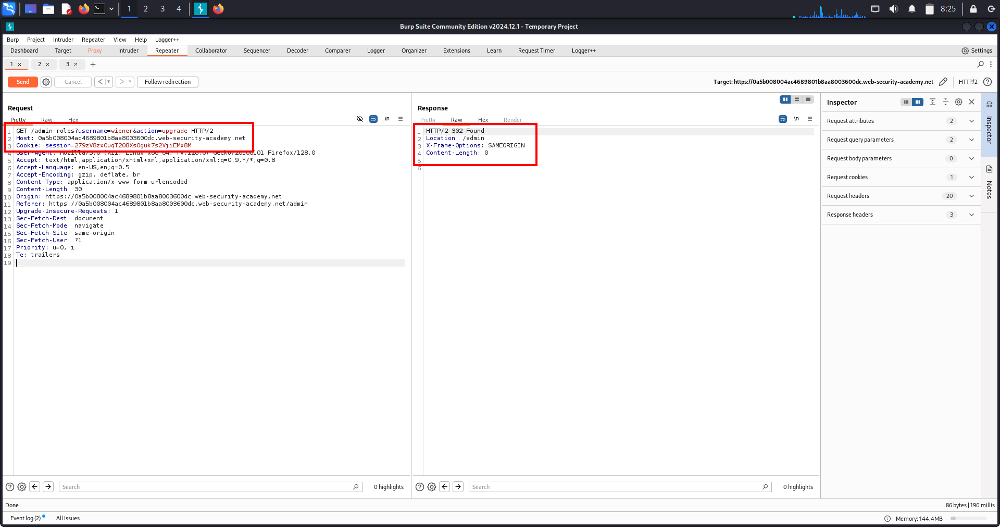
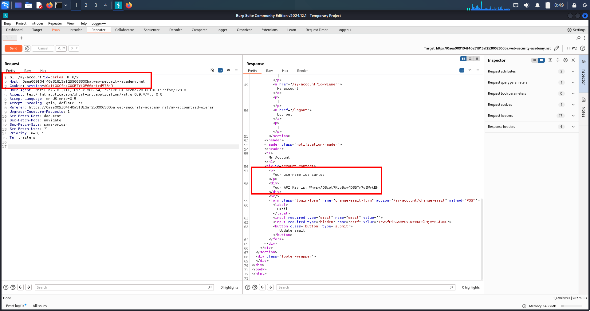
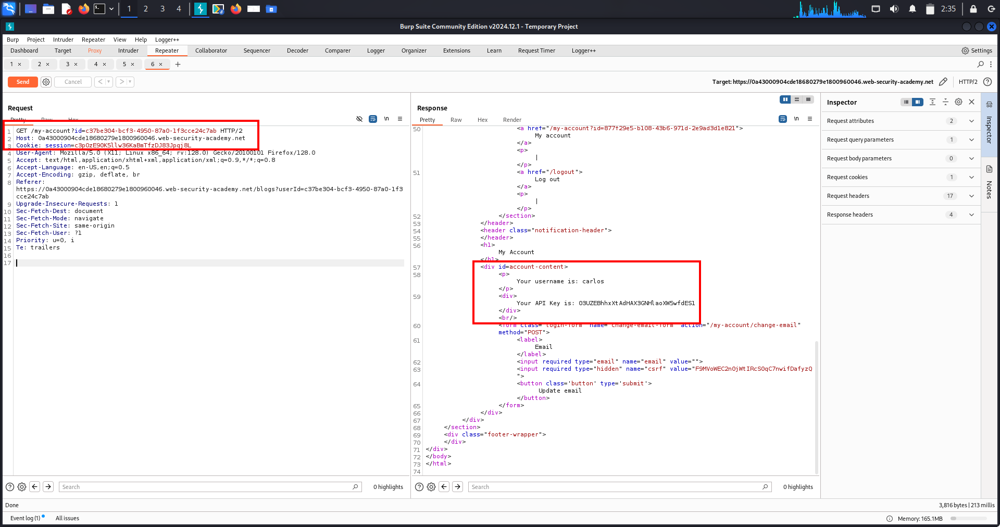
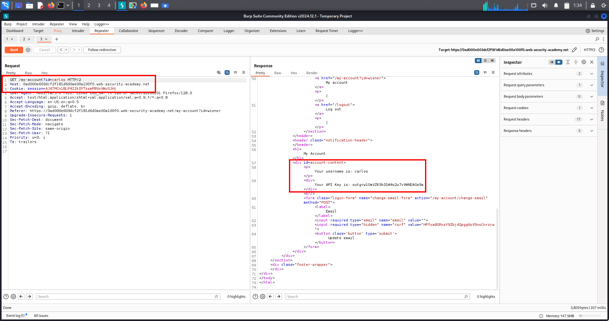
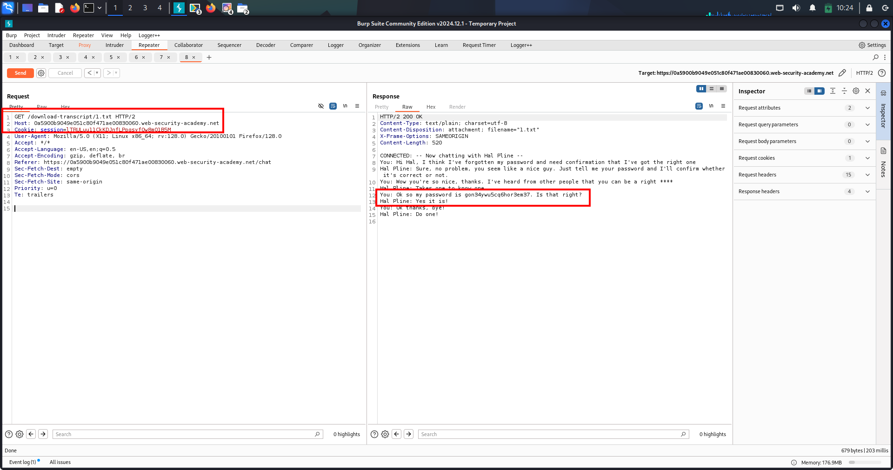

# Lab-1 🔐 Broken Access Control — Unprotected Functionality

---

## 🔹 Overview

Broken access control occurs when an application fails to correctly enforce *who is allowed to access what*.

In this case, a *sensitive admin function exists but is completely unprotected*, meaning any user can access it directly by visiting the URL.

This is a *high-impact, **real-world* vulnerability commonly found in production applications — not just labs.

---

## 🔹 What Is This Topic?

This topic focuses on *vertical access control failures*, where:

- A low-privileged user  
- Gains access to high-privileged (admin) functionality  
- Because the server *does not verify authorization*

### Key point:

> *Hiding functionality in the UI is NOT access control.*

Access control *must be enforced server-side*, not assumed.

---

## 🔹 Lab Walkthrough (Step-by-Step)

### 1️⃣ Login as a normal user

Username: wiener Password: peter

---

### 2️⃣ Observe application behavior

- No admin panel link visible in UI  
- Interface appears restricted  

Next, manually check:

/robots.txt

---

### 3️⃣ Information disclosure via robots.txt

The file reveals a hidden path:

Disallow: /administrator-panel

This indicates the existence of an admin endpoint that developers attempted to hide.

---

### 4️⃣ Manual endpoint access

Manually browse to:

/administrator-panel

---

### 5️⃣ Authorization failure confirmed

- Admin panel loads successfully  
- HTTP response status: *200 OK*  
- No authentication or role verification performed  

➡ *Unprotected admin functionality confirmed*

---

### 6️⃣ Abuse admin functionality

- Locate delete-user feature  
- Delete the user:

carlos

---

### 7️⃣ Lab solved ✅

---

## 🔹 Evidence

### 📸 robots.txt Disclosure


---

### 📸 Direct Access to /administrator-panel (HTTP 200)


---

## 🔹 Real-World Scenarios (Comprehensive)

### 🧩 Scenario 1: Hidden Admin Panels (Most Common)

*Developer assumption*  
Only admins know the URL

*Attacker action*  
Manually visits /admin

*Result*  
Full admin access

---

### 🧩 Scenario 2: Frontend-Only Restrictions

*Expected*  
Buttons hidden via JavaScript

*Attacker*  
Calls backend API directly

*Result*  
Unauthorized admin actions

---

### 🧩 Scenario 3: robots.txt Disclosure

*Expected*  
Sensitive paths hidden from bots

*Attacker*  
Reads /robots.txt

*Result*  
Admin endpoints exposed

---

### 🧩 Scenario 4: Guessable URLs

Common targets:
```
/admin 
/administrator 
/manage 
/control 
/dashboard 
/backend
```

*Result*  
Admin functionality exposed

---

### 🧩 Scenario 5: Mobile / API Admin Endpoints

*Attacker*  
Inspects API traffic

*Result*  
Direct admin API access

---

### 🧩 Scenario 6: Legacy / Forgotten Endpoints

Examples:
```
/admin_old 
/admin_backup 
/v1/admin
```

*Result*  
Legacy admin access

---

## 🔹 High-Value Endpoints to Always Test

### 🔥 Admin Panels
```
/admin 
/administrator 
/manage 
/control 
/backend 
/dashboard
```

### 🔥 APIs
```
/api/admin 
/api/users 
/api/roles 
/api/deleteUser
```

### 🔥 Hidden / Info Files
```
/robots.txt 
/.git/ 
/.env 
/config
```

---

## 🔹 Multi-Chain Attacks (Real Impact)

### 🔗 Chain 1: Access Control → Account Takeover

Admin panel access  
→ Reset passwords  
→ Full account takeover

---

### 🔗 Chain 2: Access Control → Data Breach

Admin access  
→ Export users  
→ Sensitive data leak

---

### 🔗 Chain 3: Access Control → RCE

Admin access  
→ File upload / config change  
→ Remote code execution

---

## 🔹 Remediation (Defensive View)

### ✅ Proper Fixes

- Enforce server-side authorization
- Verify role on *every request*
- Implement RBAC / ABAC
- Protect admin routes with middleware
- Log unauthorized access attempts

---

### ❌ What Never Works

- ❌ Hiding links in UI
- ❌ Assuming users won’t guess URLs
- ❌ Client-side role checks

---

## 🔹 Extra Notes / Tips (Attacker Mindset)

- Always test direct URL access
- UI ≠ Security
- If login exists → access control bugs likely exist
- Admin panels are high-value targets
- Easy to find, high impact, bounty-friendly

---

## 🧠 One-Line Memory Hook

> *If the server doesn’t check your role, you decide your role.*


---

# Lab-2 🔐 Broken Access Control – Unprotected Admin Panel (Client-Side Exposure)

---

## 🔹 Overview

Broken access control occurs when an application fails to properly restrict who can access sensitive functionality or resources.

A very common real-world variant is when *administrative functionality is hidden inside client-side code (HTML / JavaScript)* but is *not protected by server-side authorization checks*.

This is known as *security by obscurity*, and it leads directly to full application compromise.

---

## 🔹 What Is This Topic?

This topic focuses on:

- Vertical access control failures  
- Unprotected admin functionality  
- Client-side exposure of sensitive endpoints  
- Misuse of security by obscurity  

### Key Concept

> Hiding an admin URL in JavaScript does NOT make it secure.

If the server does not validate the user’s role, the endpoint is effectively public.

---

## 🔹 Lab Walkthrough (Step-by-Step)

### Step 1: Load the application

- Log in as a normal, low-privileged user
- No admin functionality visible in the UI

---

### Step 2: View page source / JavaScript files

- Inspect HTML source
- Open linked JavaScript files

During inspection, a hidden admin endpoint is discovered inside a JS file:

/administrator-panel-yb556

This endpoint is exposed client-side but not linked in the UI.

---

### Step 3: Manually access the admin endpoint

- Send a direct GET request to the discovered path
- No role validation is performed by the server

The admin panel loads successfully.

---

### Step 4: Perform admin action

- Locate user management functionality
- Delete user carlos

---

### Step 5: Lab result

- Admin action executed successfully
- No authorization checks enforced

✅ Lab solved  
❌ Broken access control confirmed

---

## 🔹 Evidence

### 🧾 Client-Side Disclosure of Admin Endpoint (View Source)


---

## 🔹 Real-World Scenarios (Comprehensive)

### 🧩 Scenario 1: Admin URLs Leaked in JavaScript (MOST COMMON)

- Admin routes embedded in JS files
- Role checks handled only on frontend

*Impact:*  
Unauthenticated or low-privileged users gain full admin access

---

### 🧩 Scenario 2: SPA Framework Route Exposure

- React / Angular admin routes visible in bundled JS
- Backend trusts frontend routing

*Impact:*  
Direct API or route access bypasses UI restrictions

---

### 🧩 Scenario 3: Hardcoded Admin Paths in HTML

- Admin links commented out
- Hidden via CSS or JS

*Impact:*  
Anyone viewing source can discover sensitive functionality

---

### 🧩 Scenario 4: Mobile & Hybrid Applications

- Admin APIs exposed via reverse engineering
- No server-side role validation

*Impact:*  
Complete backend compromise

---

### 🧩 Scenario 5: Feature Flags Without Authorization

- Admin features enabled accidentally
- No permission checks enforced

*Impact:*  
Privilege escalation

---

## 🔹 High-Value Endpoints to Always Test
```
/admin  
/administrator  
/admin-panel-*  
/manage  
/control  
/dashboard  
/internal  
/superuser  
/api/admin/*
```

---

📌 Especially endpoints that:
- Delete users  
- Modify roles  
- Reset passwords  
- Access sensitive data  

---

## 🔹 Multi-Chain Attacks (Real Impact)

### 🔗 Chain 1: Access Control → Account Takeover

Admin panel  
→ Password reset  
→ Account takeover  

---

### 🔗 Chain 2: Access Control → RCE

Admin access  
→ File upload / config edit  
→ Remote code execution  

---

### 🔗 Chain 3: Access Control → Data Breach

Admin export functionality  
→ PII disclosure  
→ Compliance violations  

---

### 🔗 Chain 4: Access Control → Persistence

Create hidden admin account  
→ Long-term backdoor access  

---

## 🔹 Remediation (Defensive View)

### ✅ Correct Fixes

- Enforce server-side authorization on every request
- Validate user role before executing admin actions
- Implement RBAC / ABAC
- Protect admin routes with middleware

---

### ❌ What Never Works

- Hiding links in JavaScript
- Obscure or random URLs
- Client-side role checks only

---

## 🔹 Extra Notes / Attacker Mindset

- Viewing source is basic reconnaissance
- If the browser can see it, attackers can too
- UI restrictions are not security controls
- Access control failures are OWASP Top 1 for a reason

---

## 🧠 One-Line Takeaway

> If an admin endpoint is exposed client-side and not protected server-side, it is public — not hidden.


---


# Lab-3 🔐 Parameter-Based Access Control — Cookie Manipulation (Admin Privilege Escalation)

---

## 🔹 Overview

Parameter-based access control vulnerabilities occur when an application determines user privileges using *client-controlled values*.

In this lab, the application relies on a *cookie value* (admin) to decide whether a user has administrative privileges.

Because cookies are fully controlled by the browser, an attacker can *modify them to escalate privileges*.

This is a *critical Broken Access Control* vulnerability and is extremely common in real-world applications.

---

## 🔹 What Is This Topic?

This vulnerability falls under:

- *Broken Access Control*
- *Vertical Privilege Escalation*

*Core mistake:*

> Authorization is decided using client-side data instead of server-side checks.

Anything sent by the browser *cannot be trusted*, including:

- Cookies
- URL parameters
- Headers
- Hidden HTML fields
- JavaScript values

---

## 🔹 Lab Walkthrough (Step-by-Step)

### 1️⃣ Log in as a normal user

Credentials used:

- *Username:* wiener
- *Password:* peter

---

### 2️⃣ Attempt to access admin panel

GET /admin

*Result:*
- Access denied

---

### 3️⃣ Inspect cookies / request headers

Observed cookie:

admin=false

This reveals that *admin privileges are decided via a cookie*.

---

### 4️⃣ Modify the cookie value

Change:

admin=false

To:

admin=true

---

### 5️⃣ Re-send request to admin panel

GET /admin

*Result:*
- Admin panel loads successfully
- No server-side authorization check

---

### 6️⃣ Perform admin action

- Delete user: carlos

✅ *Lab solved*

---

## 🔹 Evidence


---

## 🔹 Real-World Scenarios (100% Real & Common)

### 🧩 Scenario 1: Admin Flag in Cookies (MOST COMMON)

Examples:

admin=true isAdmin=1 role=admin access=full

*Impact:*
- Admin panel access
- User deletion
- Full application takeover

---

### 🧩 Scenario 2: Role Stored in HTTP Headers

X-Role: user

Changed to:

X-Role: admin

*Impact:*
- API-level privilege escalation

---

### 🧩 Scenario 3: Unsigned / Weakly Signed JWT Tokens

JWT payload:

"role": "user"

Modified to:

"role": "admin"

*Impact:*
- Full backend compromise

---

### 🧩 Scenario 4: Mobile Applications

Roles stored in:

- Request body
- Headers
- Local storage

*Impact:*
- Backend takeover via intercepted mobile traffic

---

### 🧩 Scenario 5: Feature Flags / Subscription Abuse

premium=false

Changed to:

premium=true

*Impact:*
- Paid features unlocked
- Revenue loss

---

## 🔹 High-Value Endpoints to Always Test

### 🔥 Admin / Privileged Paths
```
- /admin
- /manage
- /dashboard
- /settings
- /users
- /delete
- /api/admin
- /api/users
```

### 🔍 Parameters to Always Modify

admin role isAdmin access privilege userType plan subscription

---

## 🔹 Multi-Chain Attack Paths

### 🔗 Chain 1

- Cookie manipulation  
→ Admin panel  
→ Account takeover

---

### 🔗 Chain 2

- Parameter-based access control  
→ Admin API access  
→ IDOR  
→ Full database exposure

---

### 🔗 Chain 3

- Admin access  
→ File upload  
→ Web shell  
→ Server compromise

---

## 🔹 Remediation (Defender View)

### ✅ Correct Fixes

- Enforce authorization *server-side*
- Determine role from *database / session*
- Validate permissions on *every request*

---

### ❌ What Never Works

- ❌ Trusting cookies
- ❌ Client-side role checks
- ❌ Hiding admin links
- ❌ Security by obscurity

UI ≠ Security

---

## 🔹 Extra Notes / Pro Tips

- Editing cookies is basic testing, not hacking
- If changing *one value* gives more power → vulnerability confirmed
- Extremely common in bug bounty reports
- Consistently ranked in *OWASP Top 10*

---

## 🧠 One-Line Memory Hook

> If the browser decides your role, the attacker decides your role.


---

# Lab-4 🔐 Parameter-Based Access Control – Role Manipulation (Vertical Privilege Escalation)

---

## 1️⃣ Overview

Parameter-based access control vulnerabilities occur when an application *trusts user-controlled parameters* to decide authorization or role levels.

Instead of validating permissions on the server, the backend *accepts role values sent by the client, leading to **vertical privilege escalation*.

This is a *critical Broken Access Control* issue and is heavily exploited in real-world applications.

---

## 2️⃣ What Is This Topic?

This vulnerability exists when:

> *Authorization decisions are made using request parameters instead of server-side logic*

Common parameters involved:

- roleid
- role
- isAdmin
- user_type
- access_level
- permissions

📌 *Golden Rule*

> Anything sent by the browser *cannot be trusted*.

---

## 3️⃣ Lab Walkthrough (Exact Exploitation Flow)

### ✅ Step 1: Login as Normal User

Credentials used:

- *Username:* wiener  
- *Password:* peter

---

### ✅ Step 2: Use a Normal Feature

A legitimate feature was used:

- *Update Email / Profile functionality*

📌 Important:

> Normal user features often leak authorization logic in responses.

---

### ✅ Step 3: Observe Server Response

The API response returned the following JSON:

```json
{
  "email": "test@test.com",
  "roleid": 1
}
```

## 🔍 Key observations:

- roleid is exposed in the response
- Backend understands role values
- High chance backend also trusts this value in requests

---

### ✅ Step 4: Manipulate Role in Request

The original POST request was copied and modified.

Added / changed parameter:

"roleid": 2

This converts:

1 → Normal User

2 → Administrator

---

### ✅ Step 5: Send Modified POST Request

The server accepted the modified role value.

Response confirmed:

{
  "roleid": 2
}

🚨 Critical Confirmation

> The backend trusts client-supplied role values.

---

### ✅ Step 6: Access Admin Panel

Direct navigation to:

/admin

✔ Access granted without admin credentials.

---

### ✅ Step 7: Perform Admin Action

- Deleted user carlos
- Lab solved successfully ✅

---

## 🧾 Evidence

---

### 📸 Screenshot 1 — Role ID Disclosed in API Response

The application exposes the user's `roleid` value in the JSON response of a normal user functionality.  
This indicates that the backend relies on role-based logic tied to this parameter.


---

### 📸 Screenshot 2 — Role ID Manipulation via POST Request

The exposed `roleid` value was copied into the POST request body and modified from a normal user role to an admin role (`roleid: 2`).  
The server accepted this client-supplied value, resulting in administrative access.


---

## 5️⃣ Real-World Scenarios (Guaranteed & Complete)

### 🔹 JSON / REST APIs (MOST COMMON)

{
  "roleid": 1,
  "is_admin": false
}

➡ Change to:

{
  "roleid": 2
}

📌 Seen in:

Web apps

Mobile apps

SPAs

Internal APIs


---

### 🔹 Cookies

role=1
admin=false

➡ Modify cookie → admin access


---

### 🔹 Hidden HTML Fields

<input type="hidden" name="roleid" value="1">

➡ Change before submission


---

### 🔹 Query Parameters

/dashboard?roleid=1

➡ Change to roleid=2


---

### 🔹 JWT Tokens (High Impact)
```
{
  "sub": "wiener",
  "roleid": 1
}
```
➡ Exploitable if:

- Weak signing key
- Unsigned token
- Algorithm confusion

---

### 🔹 Profile / Settings APIs

Endpoints like:
```
/updateProfile
/updateEmail
/updateUser
```

Often leak or trust role fields.

---

### 6️⃣ High-Value Endpoints to Test

🔍 User Endpoints
```
/me
/profile
/account
/settings
/api/user
/api/profile
```

🔐 Admin Endpoints

```
/admin
/manage
/users
/roles
/permissions
/deleteUser
```

---

## 7️⃣ Multi-Chain Attack Paths

### 🔗 Chain 1: Role Escalation → Account Takeover

- Become admin
- Reset user passwords
- Take over accounts

---

### 🔗 Chain 2: Role Escalation → IDOR

- Become admin
- Access all user records
- Extract PII and secrets

---

### Chain 3: Role Escalation → RCE

- Admin upload/config access
- Upload web shell
- Server compromise

---

### 🔗 Chain 4: Role Escalation → Business Logic Abuse

- Free purchases
- Unlimited credits
- Financial loss

---

## 8️⃣ Remediation (Correct Fix)

❌ Never trust client-side parameters for authorization.

✅ Proper Fix

Store role server-side

Validate permissions on every request

Ignore role fields from client

Implement RBAC / ABAC

Remove role info from responses


---

## 9️⃣ Extra Notes / Attacker Tips

If role appears in response → try sending it

If role appears in request → try changing it

UI checks ≠ security

Client-side logic is not protection

This bug is OWASP Top 10 – Broken Access Control


---

## 🧠 One-Line Takeaway

> If the client can decide its role, the attacker will decide it for you.

---

# Lab-5 🔐 Broken Access Control via Header-Based URL Override
*(Platform / Proxy Misconfiguration)*

---

## 📌 Overview

This vulnerability occurs when access control is enforced by a **front-end component** (proxy, CDN, WAF, load balancer), but the **back-end application trusts user-controlled headers** such as `X-Original-URL` or `X-Rewrite-URL` to determine which endpoint should be processed.

An attacker can override the intended route using these headers and bypass URL-based restrictions, gaining unauthorized access to **admin or internal endpoints**.

This issue is caused by **infrastructure misconfiguration**, not application business logic.

---

## ❓ What Is This Topic?

This is a **Broken Access Control** vulnerability caused by a **broken trust boundary** between front-end and back-end systems.

### Core Idea

> Front-end blocks the URL, backend trusts a header that rewrites it.

Because the backend assumes these headers are set only by trusted internal systems, it does not re-validate authorization.

### Commonly Abused Headers
```
- X-Original-URL
- X-Rewrite-URL
- X-Forwarded-URI
- X-Forwarded-Path
```
These headers are meant for **internal routing**, but when accepted from external users, they enable **full access control bypass**.

---

## 🧪 Lab Walkthrough

### 1️⃣ Test Direct Access

Attempt to access the admin panel directly:
```
GET /admin HTTP/2
```
➡️ Access denied (403 / Forbidden)

✔ Indicates access control enforced at the front-end layer.

---

### 2️⃣ Identify Front-End Blocking

Indicators of proxy-level blocking:

- Plain error page
- No application branding
- No session-specific messaging

➡️ Strong sign that a proxy or gateway is blocking the request, not the backend application.

---

### 3️⃣ Confirm Header Processing by Backend

Send the following request via Burp Repeater:
```
GET / HTTP/1.1  
Host: vulnerable-site.com  
X-Original-URL: /invalid  
```
➡️ Response: 404 Not Found

✔ Confirms that the backend **reads and processes** the `X-Original-URL` header.

---

### 4️⃣ Access Admin Panel via Header Override

Modify the request:
```
GET / HTTP/1.1  
X-Original-URL: /admin  
```
➡️ Admin page loads successfully  
🔥 Access control bypass confirmed

---

### 5️⃣ Perform Admin Action (Delete User)

To delete user `carlos`, send:
```
GET /?username=carlos HTTP/1.1 
Host: vulnerable-site.com  
X-Original-URL: /admin/delete  
```
➡️ User deleted  
✅ Lab solved

---

## 🧾 Evidence

### 📸 Screenshot 1 — Access allowed on Admin Access through override header


---

### 📸 Screenshot 2 — Admin Action via Header-Based URL Override


## 🌍 Real-World Scenarios (Guaranteed in Production)

### 1️⃣ Reverse Proxy Blocks `/admin`

- Nginx denies `/admin`
- Backend route still exists
- Backend trusts `X-Original-URL`

🔥 Result: Admin panel exposed

---

### 2️⃣ Load Balancer Rewriting URLs (AWS / Azure)

- Load balancer adds rewrite headers
- Backend trusts them blindly
- Attacker supplies header directly

🔥 Common in Spring Boot + ALB setups

---

### 3️⃣ API Gateway vs Microservice Mismatch

- Gateway blocks `/admin`
- Microservice still routes it
- Header override bypasses gateway

🔥 Seen in Kubernetes + API Gateway environments

---

### 4️⃣ Front-End URL Validation Only

- JavaScript blocks admin links
- Backend routing trusts headers

🔥 UI security ≠ backend security

---

### 5️⃣ Legacy Java / .NET Framework Defaults

- Framework supports rewrite headers by default
- Developers unaware of behavior

🔥 Extremely common in enterprise applications

---

### 6️⃣ Proxy Fails to Strip Headers

- URL sanitized
- Headers not sanitized

🔥 Header becomes trusted attack vector

---

### 7️⃣ Internal Admin / Debug Endpoints

- `/internal/admin`
- Intended for internal access only
- Exposed via rewrite headers

🔥 High-impact internal access

---

### 8️⃣ CDN + Backend Trust Issues

- CDN rewrites URLs
- Backend trusts forwarded URI

🔥 Multiple real-world CVEs exist

---

### 9️⃣ Multi-Proxy Trust Chain Failure

- CDN → Load Balancer → App
- One layer strips headers, another doesn’t

🔥 Attackers exploit weakest link

---

## 🎯 High-Value Endpoints to Test

Always test these with override headers:
```
- /admin
- /admin/delete
- /admin/users
- /internal
- /manage
- /debug
- /config
- /actuator
- /metrics
- /api/admin/*
```
---

## 🔗 Multi-Chain Attacks

Header-based bypasses are often chained with other vulnerabilities.

### Chain 1: Header Bypass → IDOR

- Access admin panel
- Modify user identifiers

---

### Chain 2: Header Bypass → RCE

- Access debug / actuator endpoints
- Trigger command execution

---

### Chain 3: Header Bypass → Account Takeover

- Access admin password reset APIs
- Take over user accounts

---

### Chain 4: Header Bypass → Data Breach

- Access internal reports
- Export sensitive data

---

### Chain 5: Header Bypass → Privilege Escalation

- Modify roles or permissions
- Create persistent admin access

---

## 🛡️ Remediation

### ✅ Correct Fixes

- Do NOT trust rewrite headers from external users
- Strip routing headers at the edge:
  - X-Original-URL
  - X-Rewrite-URL
- Enforce authorization checks **after routing**
- Validate user roles on every request
- Use allow-lists for internal headers
- Apply defense at every layer

---

## 🧠 Extra Notes / Pro Tips

- If `/admin` is blocked → always test headers
- Plain error page usually means proxy
- Fancy error page usually means backend
- 404 after header injection confirms backend routing
- Burp Repeater is mandatory for this vulnerability
- This issue maps directly to **OWASP Top 10 – Broken Access Control**

---

## 🧩 One-Line Memory Rule

> Frontend blocks URLs. Backend trusts headers.  
> Headers = access control bypass.

---

# Lab-6 🔐 Method-Based Access Control Bypass
## (Broken Access Control – HTTP Method Manipulation)

---

## 📌 Overview

Method-based access control vulnerabilities occur when an application restricts sensitive functionality based on the **HTTP method** (`POST`, `GET`, `PUT`, etc.), but fails to enforce authorization consistently across *all* methods.

Instead of validating **who** is allowed to perform an action at the business-logic level, the application assumes that restricting a specific HTTP method is sufficient.

Attackers can manipulate or change HTTP methods to bypass access controls and perform unauthorized actions such as **privilege escalation**.

---

## ❓ What Is This Topic?

This is a **Broken Access Control** vulnerability where:

- Authorization checks are tied to:
  - URL
  - HTTP method

- But the backend:
  - Allows alternative methods
  - Loosely validates method names
  - Applies authorization checks only to specific methods (usually `POST`)

### Core Problem

> The application checks **WHO** can access an endpoint only for *some* HTTP methods — not all.

---

## 🧪 Lab Walkthrough (Step-by-Step)

### Step 1: Log in as Administrator

- Credentials:
  - `administrator : admin`

- Navigate to:
  - `/admin`

- Promote user **carlos** to admin
- Send the promotion request to **Burp Repeater**

---

### Step 2: Log in as Normal User

- Credentials:
  - `wiener : peter`

- Open **Incognito / Private Window**
- Replace the session cookie in Burp Repeater with **wiener’s cookie**
- Send the same request

**Response:**
- `Unauthorized`

✔ Confirms method-based access control exists

---

### Step 3: Test HTTP Method Confusion

- Change HTTP method:
  - `POST` → `POSTX`

**Response:**
- `Missing parameter`

🔥 Authorization check bypassed  
Request now reaches backend logic

---

### Step 4: Switch to GET Method

- In Burp:
  - Right-click request
  - Select **Change request method → GET**

- Modify parameter:
  - `username=wiener`

- Send request

**Result:**
- User `wiener` promoted to admin  
✅ Lab solved

---

## 🧾 Evidence

### 📸 Screenshot 1 — Admin Sends POST Request (Valid Privileged Action)


---

### 📸 Screenshot 2 — Normal User Sends Same POST Request (Unauthorized)


---

### 📸 Screenshot 3 — Method Changed to POSTX (Authorization Check Bypassed)


---

### 📸 Screenshot 4 — Method Changed to GET (Privilege Escalation Successful)


---

## 🌍 Real-World Scenarios (100% Guaranteed)

### 1️⃣ POST Restricted, GET Allowed
- POST requires admin
- GET performs same action
- Developer assumes “GET is safe”

🔥 Extremely common mistake

---

### 2️⃣ Backend Accepts Non-Standard Methods
- POST blocked
- `PUT`, `PATCH`, `POSTX` allowed
- Framework ignores unknown methods

🔥 Seen in Java, PHP, Node.js apps

---

### 3️⃣ API Endpoints with Loose Method Validation
- Authorization enforced only on POST
- GET triggers same business logic

🔥 Common in REST APIs

---

### 4️⃣ Mobile vs Web API Inconsistency
- Mobile app uses POST
- Backend also accepts GET

🔥 Undocumented behavior abused by attackers

---

### 5️⃣ Legacy Endpoints
- Old endpoints support GET
- New security added only to POST

🔥 Backward compatibility issues

---

### 6️⃣ Proxy / WAF Method Filtering Only
- Proxy blocks POST
- Backend allows GET

🔥 Platform-layer mismatch

---

### 7️⃣ Framework Auto-Routing
- Same function mapped to multiple methods
- Auth decorator applied once

🔥 Very common in MVC frameworks

---

### 8️⃣ CSRF Protection False Confidence
- Dev relies on CSRF for POST
- GET bypasses CSRF + auth

🔥 Double failure

---

## 🎯 High-Value Endpoints to Test

- `/admin/promote`
- `/admin/delete`
- `/admin/updateRole`
- `/user/update`
- `/api/admin/*`
- `/manage/*`
- `/settings`
- `/internal/*`

### Methods to Always Try

- `GET`
- `POST`
- `PUT`
- `PATCH`
- `OPTIONS`
- `POSTX`

---

## 🔗 Multi-Chain Attacks

- Method Bypass → Privilege Escalation
- Method Bypass → IDOR
- Method Bypass → Account Takeover
- Method Bypass → Admin Panel Access
- Method Bypass → Business Logic Abuse

---

## 🛡️ Remediation

### ✅ Proper Fixes

- Enforce authorization **independent of HTTP method**
- Apply checks at:
  - Controller level
  - Business logic level
- Reject unknown HTTP methods
- Use strict routing:
  - One endpoint → one method
- Apply deny-by-default
- Log invalid method usage

---

## 🧠 Extra Notes

- If POST is blocked → always try GET
- If GET works → access control is broken
- Non-standard methods are a goldmine
- Burp “Change request method” is essential
- OWASP Top 10 — Broken Access Control

---

# Lab-7 🔐 Broken Access Control – Horizontal Privilege Escalation (IDOR)
## + URL Interpretation Mismatch (Frontend vs Backend)

---

## 🔍 Overview

Broken Access Control occurs when an application fails to properly restrict what authenticated users are allowed to access.

In this lab, a **normal authenticated user** accessed **another user’s data (Carlos)** by modifying an identifier in the request.

This is a **Horizontal Privilege Escalation (IDOR)** vulnerability.

The same root cause also commonly appears alongside **URL interpretation mismatches** between frontend security layers and backend routing.

Both issues originate from **trusting user-controlled input**.

---

## 📘 What Is This Topic?

This topic combines two closely related access control failures:

### 1️⃣ Horizontal Privilege Escalation (IDOR)

- User accesses resources belonging to another user
- Achieved by modifying identifiers such as:
  - `id`
  - `username`
  - `userId`
  - `accountId`

### 2️⃣ URL Interpretation Mismatch

- Frontend (proxy / WAF / gateway) and backend interpret URLs differently
- Leads to bypass using:
  - Case changes
  - Trailing slashes
  - File extensions
  - Encoded paths

> **Same core flaw:** authorization is inconsistent or missing.

---

## 🧪 Lab Walkthrough

### 🎯 Goal

Access **Carlos’s account data** while logged in as **Wiener**.

---

### ✅ Step-by-Step

1. Log in as a normal user  
   Credentials:
   - `wiener : peter`

2. Navigate to your account page  
   Example request:
   - `GET /my-account?id=wiener`

3. Intercept the request in **Burp Suite**

4. Modify the identifier:
   - `id=wiener` → `id=carlos`

5. Send the request again

6. Carlos’s account data is returned  
   → **Lab solved ✅**

---

## 🧠 Why This Worked

- Backend trusted the `id` parameter
- No authorization check like:
  - *Does this session own this resource?*
- Application assumed:
  - Authenticated = Authorized (❌ wrong)

---

## 🧾 Evidence

### 📸 Screenshot 1 — ID Parameter Manipulation (Horizontal Privilege Escalation)

- Intercepted request to /my-account
- Modified parameter:
  - id=wiener → id=carlos
- Response returned *Carlos’s account data*, confirming IDOR



---

---

## 🌍 Real-World Scenarios (100% Guaranteed)

### 🔹 IDOR / Horizontal Privilege Escalation

- `/profile?id=123`
- `/invoice?invoiceId=8891`
- `/download?fileId=42`
- `/api/user/456`
- `/orders/9876`

Seen in:
- Banking applications
- Healthcare portals
- SaaS dashboards
- Government systems

---

## 🔹 Frontend vs Backend URL Interpretation Mismatch

Often exists alongside IDOR.

### 1️⃣ Case Sensitivity Bypass

Frontend blocks:
- `/admin/deleteUser`

Attacker sends:
- `/ADMIN/DELETEUSER`

Frontend: ❌ Not blocked  
Backend: ✅ Executes request

---

### 2️⃣ Trailing Slash Bypass

Frontend blocks:
- `/admin/deleteUser`

Attacker uses:
- `/admin/deleteUser/`

---

### 3️⃣ File Extension / Suffix Bypass

Backend maps:
- `/admin/deleteUser`
- `/admin/deleteUser.json`

Frontend blocks only:
- `/admin/deleteUser`

---

### 4️⃣ Encoded Path Tricks

- `/admin%2FdeleteUser`
- `/admin/..;/deleteUser`

Frontend misses  
Backend normalizes

---

## 🎯 High-Value Endpoints to Test

- `/my-account`
- `/profile`
- `/user`
- `/api/users/{id}`
- `/orders/{id}`
- `/documents/{id}`
- `/files/{id}`
- `/admin/*`
- `/internal/*`

---

## 🔗 Multi-Chain Attacks

- IDOR → Steal sensitive data
- IDOR → Extract API keys
- IDOR → Access admin-only resources
- IDOR + URL mismatch → Gateway bypass
- Chain leads to **full account takeover**

---

## 🛡️ Remediation

### ✅ Proper Fixes

- Enforce object-level authorization:
  - Verify resource ownership
- Use **session identity**, not request parameters
- Normalize URLs **before** security checks
- Enforce consistency:
  - Case
  - Slashes
  - Extensions

### ❌ Never Trust

- Client-side checks
- Hidden fields
- URL secrecy
- Frontend-only restrictions

---

## 🧠 Extra Notes

### 🔑 Memory Rule

> If changing an ID changes the data you see → IDOR exists

### 🔍 Testing Checklist

- Change ID
- Change username
- Change case
- Add `/`
- Add `.json`
- Encode path
- Change HTTP method

---

## ✅ Final One-Line Summary

> When backend trusts user-controlled identifiers or interprets URLs differently than the frontend, access control breaks — leading to IDOR, escalation, and full compromise.

---

# Lab-8 🔐 Broken Access Control – Horizontal Privilege Escalation (IDOR with GUIDs)

---

## 🔍 Overview

This vulnerability occurs when an application uses non‑predictable identifiers (GUIDs / UUIDs) for users or objects but **fails to enforce ownership checks** on the backend.

Developers often assume:

> “We use GUIDs, so attackers can’t guess IDs.”

This is **false security**.

If GUIDs are leaked anywhere in the application, **authorization completely breaks**.

---

## 📘 What Is This Topic?

This is **Horizontal Privilege Escalation via IDOR**, where:

- Users are identified by GUIDs instead of numbers  
- The application trusts **user‑supplied identifiers**
- Backend does **NOT verify resource ownership**

### Key misunderstanding by developers

- GUIDs = authorization ❌  
- GUIDs = identification only ✅  

If the server does not check **who owns the GUID**, any user can access any resource.

---

## 🧪 Lab Walkthrough (What I Did)

### 🎯 Goal
Access **Carlos’s account data** by replacing my GUID with Carlos’s GUID.

### ✅ Steps

1. Login as a normal user  
   - Username: `wiener`  
   - Password: `peter`

2. Browse the application and locate **Carlos’s blog post**

3. Click on **Carlos’s profile**

4. Intercept the request in Burp  
   Example request observed:

   - `/user?id=8f7d3c2e-91a1-4c3b-bf5e-XXXXXXXX`

5. Copy **Carlos’s GUID**

6. Navigate to my own account page:

   - `/my-account?id=<my-guid>`

7. Replace **my GUID** with **Carlos’s GUID**

8. Send the request again

9. Carlos’s sensitive data (API key) is returned  
   → **Lab solved ✅**

---

## ❓ Why This Worked

- Backend trusted the `id` parameter
- No authorization check like:

  - “Does this session own this GUID?”

- Backend assumed GUID secrecy = security

This is **classic IDOR logic failure**.

---

## 🧾 Evidence

### 📸 Screenshot — GUID Manipulation

- Intercepted request containing user GUID
- Replaced `wiener` GUID with `carlos` GUID
- Server returned Carlos’s private data



---

---

## 🌍 Real‑World Scenarios (Very Common)

### 🔹 Where GUIDs Leak in Real Applications

GUIDs are exposed through:

- User profile pages
- Blog author links
- Comments & reviews
- Chat messages
- Activity feeds
- Order history
- Support tickets
- API responses
- JavaScript variables
- Mobile app API traffic
- WebSocket messages
- GraphQL responses

Once leaked → **IDOR becomes trivial**

---

## 🎯 High‑Value Endpoints to Always Test

### 👤 User & Identity

- `/user?id=<GUID>`
- `/profile/<GUID>`
- `/account/<GUID>`
- `/api/users/<GUID>`
- `/settings?user=<GUID>`

### 🔐 Secrets & Tokens

- `/api-keys?userId=<GUID>`
- `/tokens/<GUID>`
- `/oauth/clients/<GUID>`

### 💳 Financial

- `/invoices/<GUID>`
- `/transactions/<GUID>`
- `/wallets/<GUID>`

### 📁 Files & Data

- `/documents/<GUID>`
- `/files/<GUID>`
- `/exports/<GUID>`

### 🛠️ Admin / Internal

- `/admin/users/<GUID>`
- `/internal/accounts/<GUID>`
- `/support/tickets/<GUID>`

---

## 🔗 Multi‑Chain Attacks (Real Impact)

### 🔥 Chain 1: IDOR → Account Takeover
- Leak GUID  
- Access account  
- Reset email/password  
- Take over account  

### 🔥 Chain 2: IDOR → API Key Theft → Admin API
- Access API key  
- Call admin APIs directly  
- Bypass UI restrictions  

### 🔥 Chain 3: IDOR → Financial Fraud
- Access invoices / wallets  
- Modify payout details  
- Steal funds  

### 🔥 Chain 4: IDOR → Vertical Escalation
- Discover admin GUID  
- Access admin endpoints  
- Promote own account  

### 🔥 Chain 5: IDOR + Other Bypasses
- Combine with:
  - Method manipulation
  - URL interpretation mismatch
  - Header-based bypass

→ **Full system compromise**

---

## 🛡️ Remediation (Correct Fixes)

### ✅ Enforce Object Ownership
- Every request must verify:
  - Does this session own this GUID?

### ✅ Server‑Side Authorization
- Tie resources to session identity
- Ignore user‑supplied identifiers where possible

### ✅ Avoid GUID Leakage
- Do not expose internal IDs in:
  - URLs
  - APIs
  - Frontend code

### ✅ Use Indirect References
- Map public IDs → internal IDs server‑side

---

## 🧠 Extra Notes / Pentester Mindset

### 🔑 Golden Rule
> “If I can see an ID, I must try changing it.”

### 🧪 Testing Checklist
- Replace GUIDs everywhere
- Compare responses carefully
- Test in:
  - URLs
  - JSON bodies
  - Cookies
  - Headers
  - WebSockets
  - GraphQL

### 📌 Exam / Interview Line
> “GUIDs prevent guessing, not authorization bypass.”

---

## ✅ Final One‑Line Summary

> Using GUIDs instead of numbers does **NOT** prevent IDOR — if ownership is not checked, horizontal privilege escalation is inevitable.

---

# Lab-9 🔐 Broken Access Control – Sensitive Data Leaked in Redirect Responses

---

## 🔍 Overview

This vulnerability occurs when an application detects unauthorized access and issues an HTTP redirect (301/302), but *still includes sensitive data in the response body*.

Attackers do not rely on browser behavior.  
They inspect *raw HTTP responses* using tools like Burp Suite or curl.

> Redirect ≠ Security  
> Data exposure depends on server behavior, not client navigation.

If sensitive information is generated before authorization checks are fully enforced, access control is already broken.

---

## 📘 What Is This Topic?

This issue is a combination of:

- Broken Access Control
- Information Disclosure

### Insecure Logic Pattern

1. User requests a restricted resource
2. Server detects unauthorized access
3. Server issues a redirect to /login
4. *Sensitive data is already present in the response body*

Browsers automatically follow redirects and hide response bodies.  
Security tools expose everything.

---

## 🧪 Lab Walkthrough (What Was Done)

### 🎯 Goal

Extract sensitive data from another user’s account by inspecting a redirect response.

### ✅ Steps

1. Login as a normal user

wiener : peter

2. Send a request targeting another user

GET /my-account?id=carlos

3. Observe the HTTP response

HTTP/1.1 302 Found Location: /login

4. Do NOT stop at the redirect

5. Inspect the response body using Burp Suite

6. Sensitive data (GUID / API Key) is visible in the body

7. Submit the extracted value

→ Lab solved ✅

---

## 🧾 Evidence

### 📸 Screenshot – GUID Found in Redirect Response Body



---

## 🧠 Why This Worked

- Authorization was checked *after* sensitive data was generated
- Redirect only affected browser navigation
- Server still returned confidential content
- No ownership validation before data exposure

---

## 🌍 Real-World Scenarios

### 🔹 Common Developer Mistake

data = fetchUserSensitiveData(targetUser)

if not authorized: redirect("/login")

return response(data)

❌ Redirect occurs  
❌ Sensitive data already leaked  

---

### 🔹 Where This Happens in Production

#### 👤 User & Identity Pages
- Profile pages
- Account dashboards
- API key sections

#### 🔐 Secrets & Credentials
- API tokens
- OAuth secrets
- Recovery keys

#### 💳 Financial Systems
- Invoices
- Transactions
- Wallet balances

#### 🛠️ Admin / Internal Tools
- Support tickets
- Audit logs
- Internal notes

#### 📱 Mobile & API Backends
- Redirects ignored
- JSON still parsed by clients

---

## 🎯 High-Value Endpoints to Test

### 👤 Account & Identity

/my-account /profile /user /settings

### 🔑 Secrets

/api-key /tokens /secrets /credentials

### 💳 Finance

/billing /invoices /transactions

### 🛠️ Admin / Internal

/admin/users /support/ticket /internal/account

### 📡 APIs

/api/user /v1/account /v2/profile

---

## 🔗 Multi-Chain Attack Scenarios

### 🔥 Chain 1 – Redirect Leak → Account Takeover

1. Trigger redirect on victim resource
2. Inspect response body
3. Extract API key / token
4. Authenticate as victim

---

### 🔥 Chain 2 – Redirect Leak → Vertical Privilege Escalation

1. Leak admin token
2. Access admin endpoints
3. Modify roles
4. Gain full control

---

### 🔥 Chain 3 – Redirect Leak + IDOR

1. Change user identifier
2. Trigger redirect
3. Read leaked data
4. Repeat across users

---

### 🔥 Chain 4 – Redirect Leak → Financial Fraud

1. Access invoice endpoint
2. Receive redirect
3. Read financial details
4. Abuse refunds or payouts

---

### 🔥 Chain 5 – Redirect Leak + Automation

1. Enumerate users
2. Collect leaked secrets silently
3. No alerts triggered

---

## 🛡️ Remediation

### ✅ Perform Authorization First

if not authorized: redirect("/login") return

data = fetchSensitiveData()

### ✅ Never Generate Data Before Authorization
- No database queries
- No API calls
- No object loading

### ✅ Strip Response Bodies on Redirects
- Redirect responses must be empty

### ✅ Enforce Server-Side Access Control
- Never rely on frontend behavior

### ✅ Test with Security Tools
- Browsers hide response bodies
- Burp and curl do not

---

## 🧠 Extra Notes

### 🔑 Pentester Rule

> Never trust a redirect — always inspect the response body.

### 🧪 Testing Checklist

- Expand all 301 / 302 responses
- Compare response sizes
- Look for:
  - JSON
  - HTML
  - Tokens
  - Hidden fields

---

# Lab-10 🔐 Broken Access Control – IDOR with Sensitive Data Exposure via Dynamic HTML

---

## 📘 Overview

This lab demonstrates a **critical Broken Access Control vulnerability** where a normal authenticated user can access another user’s account by modifying an `id` parameter in a GET request.

Due to unsafe backend behavior, the server **dynamically renders HTML containing a prefilled password**, which allows an attacker to extract the **administrator’s password**, log in as admin, and perform privileged actions.

This is a **high-impact vulnerability** combining:

- IDOR (Insecure Direct Object Reference)
- Sensitive data exposure
- Vertical privilege escalation (User → Admin)
- Unsafe dynamic HTML rendering

---

## 📌 What Is This Topic?

This vulnerability represents **IDOR combined with sensitive data leakage** through dynamically generated HTML.

Key concepts involved:

- Horizontal privilege escalation (user → another user)
- Vertical privilege escalation (user → admin)
- Trusting user-controlled identifiers
- Rendering secrets inside HTML responses
- Broken server-side authorization

Core mistake:

> The backend fetches and renders sensitive data **before verifying ownership**.

---

## 🧪 Lab Walkthrough

### 🎯 Goal

Obtain the **administrator password** and use it to perform admin-level actions.

---

### ✅ Steps

#### 1️⃣ Login as a normal user

Credentials:

- wiener : peter

---

#### 2️⃣ Visit your account page

Example request:

- GET /my-account?id=wiener

---

#### 3️⃣ Modify the `id` parameter

Change it to:

- GET /my-account?id=administrator

---

#### 4️⃣ Observe backend behavior

- No ownership check is performed
- Backend fetches administrator data
- HTML is dynamically rendered
- Password field is **prefilled**

---

#### 5️⃣ Extract administrator password

- Visible in response body
- Visible in page source / Burp response

---

#### 6️⃣ Login as administrator

- Use extracted password

---

#### 7️⃣ Perform admin action

- Delete user `carlos`

✅ Lab solved

---

## 🧾 Evidence

### 📸 Prefilled Admin Password in Dynamic HTML


---

## 🌍 Real-World Scenarios

This exact vulnerability appears in:

- Legacy web applications
- Poorly designed account management systems
- Internal admin dashboards
- CMS platforms
- University portals
- Banking and HR systems

Common developer mistakes:

- Prefilling passwords for “convenience”
- Assuming users won’t change IDs
- Relying on frontend restrictions
- Treating IDs as authorization

Impact:

- Admin account takeover
- Full system compromise
- Data breaches
- Compliance violations (GDPR, PCI-DSS)

---

## 🎯 High-Value Endpoints to Test

Always test ID-based endpoints returning HTML:

- /my-account?id=
- /profile?id=
- /user/settings?id=
- /account/details?id=
- /admin/users?id=
- /manageUser?id=

Red flags:

- HTML responses
- Forms with sensitive fields
- No ownership validation

---

## 🔗 Multi-Chain Attacks

This lab demonstrates a classic attack chain:

1. **IDOR**
   - Access administrator account

2. **Sensitive Data Exposure**
   - Password embedded in HTML

3. **Vertical Privilege Escalation**
   - Login as administrator

4. **Administrative Actions**
   - User deletion
   - Role modification
   - System takeover

In real applications, this chain can extend to:

- Token theft
- Password reuse across services
- Database compromise
- Infrastructure access

---

## 🛡️ Remediation

### ✅ Mandatory Fixes

- Enforce server-side access control
- Verify ownership for every request
- Never trust user-controlled IDs
- Never render passwords in HTML
- Store passwords as strong hashes

---

### ✅ Secure Design Pattern

Correct approach:

- Password: ********
- [Change Password]

Never:

- Prefill passwords
- Send credentials in responses
- Rely on frontend logic

---

## 🧠 Extra Notes / Tips

- `type="password"` only hides characters visually
- Masking ≠ security
- Dynamic HTML leaks are real leaks
- If changing an ID changes access → vulnerability exists
- IDOR + sensitive fields = **critical severity**

---

## 🧾 One-Line Summary

> If changing an ID parameter exposes another user’s prefilled password, the application is critically broken.

---

# Lab-11 🔐 Broken Access Control – IDOR via Chat File Disclosure

---

## 📘 Overview

This vulnerability demonstrates **Insecure Direct Object Reference (IDOR)**, a form of **Broken Access Control**, where an application allows direct access to internal chat files using user-controlled parameters without verifying ownership.

As a result, an attacker can access **another user’s private chat**, extract **sensitive credentials**, and perform **account takeover**.

---

## 📌 What Is This Topic?

**IDOR (Insecure Direct Object Reference)** occurs when:

- Internal object references (IDs, filenames, numbers) are exposed
- These references are fully user-controlled
- The backend does **not** verify whether the requested object belongs to the authenticated user

**Simple definition:**

> If changing an ID or filename gives access to another user’s data, IDOR exists.

In this lab:

- Chat logs are stored as files (e.g., `1.txt`, `2.txt`)
- The application checks **login status only**
- **No ownership validation** is performed on chat files

---

## 🧪 Lab Walkthrough

### 🎯 Goal

Obtain **Carlos’s password** from his private chat and log in as him.

---

### ✅ Steps

1. **Login as a normal user**

   ```
   wiener : peter
   ```

2. **Send a chat message**

   - This generates a chat log file for your session  
   - Example: `2.txt`

3. **Download your own chat**

   ```
   /download-chat?file=2.txt
   ```

4. **Exploit IDOR**

   - Modify the filename parameter:

   ```
   /download-chat?file=1.txt
   ```

5. **Read Carlos’s private chat**

   - The chat belongs to Carlos
   - The HelpLine message reveals his password

6. **Login as Carlos using leaked password**

   ✅ **Lab solved**

---

## 🧾 Evidence

### 📸 Screenshot – Carlos Password Found in Chat File



---

## 🌍 Real-World Scenarios

### 🔹 Chat & Support Systems

- Chat transcripts stored as:
  - `chat_1001.txt`
  - `chat_1002.txt`
- Users can access **other users’ private conversations**

---

### 🔹 Invoices & Billing

- `/invoice?id=501`
- `/invoice?id=502`

➡️ Downloading invoices of other customers

---

### 🔹 Private Documents

- `/uploads/user123.pdf`
- `/uploads/user124.pdf`

➡️ Medical records, IDs, resumes leaked

---

### 🔹 Messages & Tickets

- `/support/ticket?id=300`

➡️ Internal or admin communications exposed

---

### 🔹 APIs

- `GET /api/users/45`

➡️ Returns another user’s personal data

---

## 🎯 High-Value Endpoints to Test

Always test IDOR on endpoints like:

- `/download`
- `/file`
- `/export`
- `/view`
- `/invoice`
- `/document`
- `/profile`
- `/my-account`
- `/chat`
- `/messages`
- `/support`
- `/api/user/{id}`

**Rule:**

> If you see numbers, filenames, or IDs — test IDOR immediately.

---

## 🔗 Multi-Chain Attacks

IDOR is often just the **entry point**.

### 🔥 Example Attack Chain

1. **IDOR**
   - Access Carlos’s chat file

2. **Sensitive Data Exposure**
   - Password leaked in chat

3. **Account Takeover**
   - Login as Carlos

4. **Further Abuse**
   - Reset emails
   - Access internal features
   - Pivot to admin if possible

---

## 🛡️ Remediation

### ✅ Correct Fixes

- Enforce **server-side authorization**
- Validate **object ownership** on every request
- Ensure:
  - Does this file belong to this user?

---

### ❌ Incorrect Fixes

- Hiding filenames
- Using random numbers only
- Frontend-only restrictions
- Assuming users won’t tamper with URLs

---

## 🧠 Extra Notes / Tips

- Logged-in ≠ authorized
- Filenames and IDs are **not secrets**
- UI labels like “You / HelpLine” can mislead
- Always inspect **direct object access** in Burp
- If changing a filename works → **access control is broken**

---

## 🎓 Exam / Viva One-Liner

> IDOR occurs when an application allows access to internal objects using user-controlled references without verifying authorization.

---

## 🔑 Final Summary

- IDOR is extremely common
- Very easy to exploit
- Very high impact
- Frequently leads to account takeover
- One missing ownership check can compromise the entire system

---
