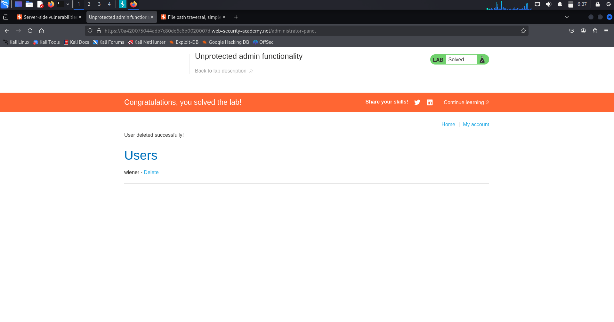
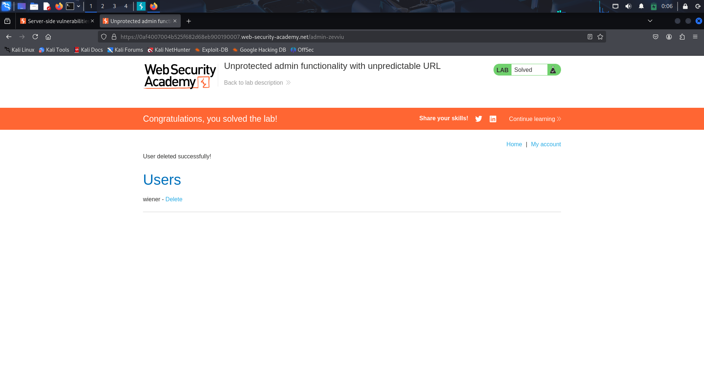

# Access Control – Lab 1: Unprotected Admin Functionality

---

## 🔹 Overview
This lab highlights a *broken access control* vulnerability where an administrative function was exposed without any authorization checks. Instead of enforcing proper access control, the application simply hid the sensitive endpoint.

---

## 🔹 Methodology

1. *Reconnaissance*
   - Inspected /robots.txt file.
   - Found a disallowed path: /administrator-panel.

2. *Exploitation*
   - Navigated directly to /administrator-panel.
   - Successfully accessed the admin interface without being an administrator.

3. *Privilege Escalation*
   - Executed an administrative action: deleted the user carlos.  
   - This confirmed the lack of authorization controls.

---

## 🔹 Proof of Exploit

(Screenshot shows successful access to the admin panel and deletion of the carlos account.)

---

## 🔹 Security Impact
- Unauthorized users could access administrative functionality.  
- Potential consequences:
  - Mass deletion of accounts.  
  - Data manipulation.  
  - Full system takeover.  

---

## 🔹 Remediation
- Enforce *server-side role-based access control (RBAC)*.  
- Never expose sensitive endpoints in robots.txt.  
- Implement authorization middleware to validate user roles.  
- Monitor and log access attempts to restricted areas.  

---

# Access Control – Lab 2: Unprotected Admin Functionality (via HTML Source)

---

## 🔹 Overview
This lab demonstrates a *broken access control* vulnerability where an administrative panel was hidden in the HTML source code but not protected with any authentication or authorization mechanism.

---

## 🔹 Methodology

1. *Reconnaissance*
   - Viewed the page source (Ctrl+U).
   - Found a hidden link pointing to /administrator-panel.

2. *Exploitation*
   - Accessed the hidden URL directly in the browser.
   - The admin panel loaded without requiring admin credentials.

3. *Privilege Escalation*
   - Deleted the user carlos via the exposed admin functionality.  
   - This confirmed that the application lacked proper access control.

---

## 🔹 Proof of Exploit
  
(Screenshot showing hidden admin link in HTML source)  

  
(Screenshot showing successful deletion of carlos account and lab completion)  

---

## 🔹 Security Impact
- Unauthorized users could access administrative interfaces.  
- Potential consequences include:
  - Account deletions or modifications.  
  - Full takeover of user data and application functionality.  
  - Compromise of business-critical operations.  

---

## 🔹 Remediation
- Enforce *server-side authentication and authorization checks*.  
- Do not rely on obscurity (hiding links in HTML or JS).  
- Restrict access to admin routes via RBAC, strong authentication, and network controls.  
- Regularly review source code and remove hardcoded sensitive URLs.  

---

# Access Control – Lab 3: Parameter-Based Access Control

---

## 🔹 Overview
This lab demonstrates an insecure access control mechanism where user roles are determined by *parameters* (such as query strings, cookies, or hidden fields) that are directly modifiable by the client.  
By tampering with these parameters, an attacker can escalate privileges and gain administrative access.

---

## 🔹 Methodology

1. *Normal Login*
   - Logged in as a regular user.  
   - Observed a parameter in the request: admin=false.

2. *Tampering the Parameter*
   - Captured the request in Burp Suite Proxy while accessing the *Admin Panel*.  
   - Modified the parameter from admin=false → admin=true.  
   - Successfully accessed the *admin interface*.

3. *Exploitation*
   - Performed an administrative action: deleted the user carlos.  
   - Lab solved ✅

---

## 🔹 Proof of Exploit

---

## 🔹 Security Impact
- Any user can escalate privileges by altering request parameters.  
- Potential consequences:
  - Full admin account takeover.  
  - Ability to delete or modify user data.  
  - Compromise of the entire application.

---

## 🔹 Remediation
- Never store authorization or role information in user-controllable parameters.  
- Implement *server-side role-based access control (RBAC)*.  
- Validate user roles on every sensitive action.  
- Use secure session handling instead of hidden fields or query strings.

---
