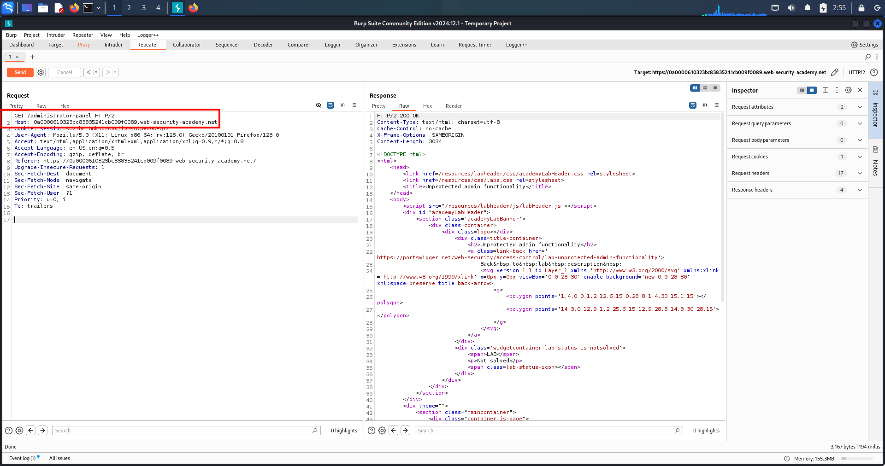
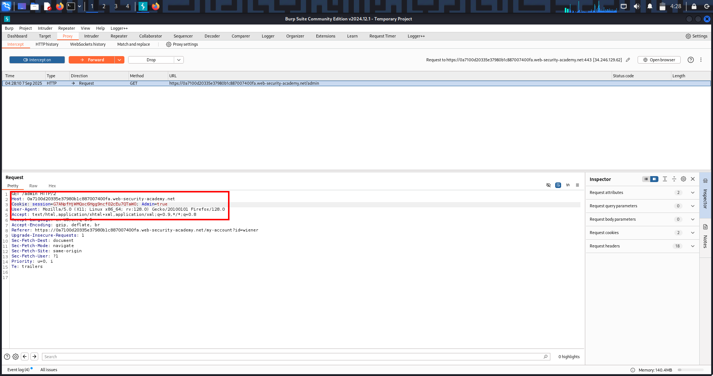
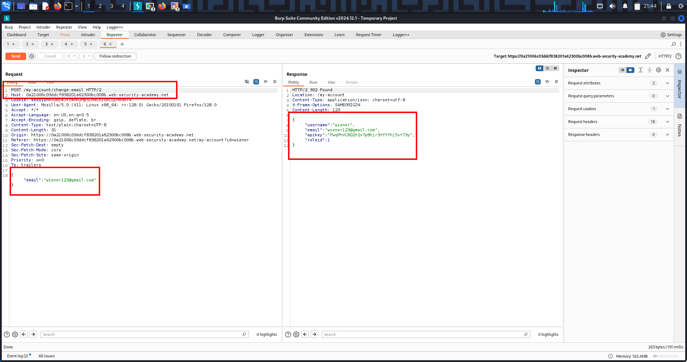
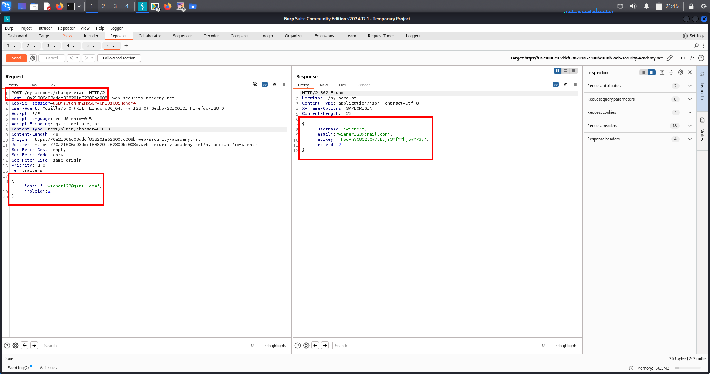
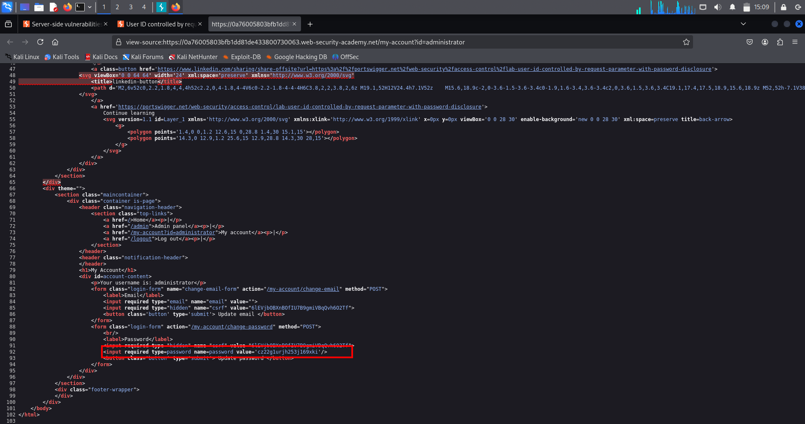
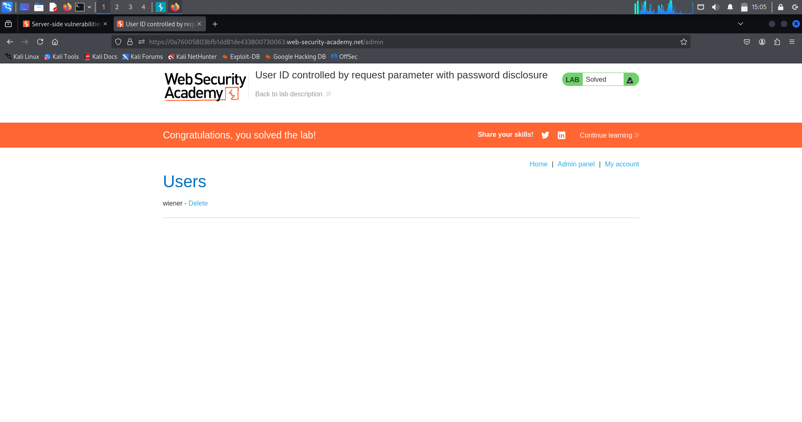

# Lab-1 🔐 Broken Access Control — Unprotected Functionality

---

## 🔹 Overview

Broken access control occurs when an application fails to correctly enforce *who is allowed to access what*.

In this case, a *sensitive admin function exists but is completely unprotected*, meaning any user can access it directly by visiting the URL.

This is a *high-impact, **real-world* vulnerability commonly found in production applications — not just labs.

---

## 🔹 What Is This Topic?

This topic focuses on *vertical access control failures*, where:

- A low-privileged user  
- Gains access to high-privileged (admin) functionality  
- Because the server *does not verify authorization*

### Key point:

> *Hiding functionality in the UI is NOT access control.*

Access control *must be enforced server-side*, not assumed.

---

## 🔹 Lab Walkthrough (Step-by-Step)

### 1️⃣ Login as a normal user

Username: wiener Password: peter

---

### 2️⃣ Observe application behavior

- No admin panel link visible in UI  
- Interface appears restricted  

Next, manually check:

/robots.txt

---

### 3️⃣ Information disclosure via robots.txt

The file reveals a hidden path:

Disallow: /administrator-panel

This indicates the existence of an admin endpoint that developers attempted to hide.

---

### 4️⃣ Manual endpoint access

Manually browse to:

/administrator-panel

---

### 5️⃣ Authorization failure confirmed

- Admin panel loads successfully  
- HTTP response status: *200 OK*  
- No authentication or role verification performed  

➡ *Unprotected admin functionality confirmed*

---

### 6️⃣ Abuse admin functionality

- Locate delete-user feature  
- Delete the user:

carlos

---

### 7️⃣ Lab solved ✅

---

## 🔹 Evidence

### 📸 robots.txt Disclosure


---

### 📸 Direct Access to /administrator-panel (HTTP 200)



---

## 🔹 Real-World Scenarios (Comprehensive)

### 🧩 Scenario 1: Hidden Admin Panels (Most Common)

*Developer assumption*  
Only admins know the URL

*Attacker action*  
Manually visits /admin

*Result*  
Full admin access

---

### 🧩 Scenario 2: Frontend-Only Restrictions

*Expected*  
Buttons hidden via JavaScript

*Attacker*  
Calls backend API directly

*Result*  
Unauthorized admin actions

---

### 🧩 Scenario 3: robots.txt Disclosure

*Expected*  
Sensitive paths hidden from bots

*Attacker*  
Reads /robots.txt

*Result*  
Admin endpoints exposed

---

### 🧩 Scenario 4: Guessable URLs

Common targets:

/admin /administrator /manage /control /dashboard /backend

*Result*  
Admin functionality exposed

---

### 🧩 Scenario 5: Mobile / API Admin Endpoints

*Attacker*  
Inspects API traffic

*Result*  
Direct admin API access

---

### 🧩 Scenario 6: Legacy / Forgotten Endpoints

Examples:

/admin_old /admin_backup /v1/admin

*Result*  
Legacy admin access

---

## 🔹 High-Value Endpoints to Always Test

### 🔥 Admin Panels
```
/admin 
/administrator 
/manage 
/control 
/backend 
/dashboard
```

### 🔥 APIs
```
/api/admin 
/api/users 
/api/roles 
/api/deleteUser
```

### 🔥 Hidden / Info Files
```
/robots.txt 
/.git/ 
/.env 
/config
```

---

## 🔹 Multi-Chain Attacks (Real Impact)

### 🔗 Chain 1: Access Control → Account Takeover

Admin panel access  
→ Reset passwords  
→ Full account takeover

---

### 🔗 Chain 2: Access Control → Data Breach

Admin access  
→ Export users  
→ Sensitive data leak

---

### 🔗 Chain 3: Access Control → RCE

Admin access  
→ File upload / config change  
→ Remote code execution

---

## 🔹 Remediation (Defensive View)

### ✅ Proper Fixes

- Enforce server-side authorization
- Verify role on *every request*
- Implement RBAC / ABAC
- Protect admin routes with middleware
- Log unauthorized access attempts

---

### ❌ What Never Works

- ❌ Hiding links in UI
- ❌ Assuming users won’t guess URLs
- ❌ Client-side role checks

---

## 🔹 Extra Notes / Tips (Attacker Mindset)

- Always test direct URL access
- UI ≠ Security
- If login exists → access control bugs likely exist
- Admin panels are high-value targets
- Easy to find, high impact, bounty-friendly

---

## 🧠 One-Line Memory Hook

> *If the server doesn’t check your role, you decide your role.*


---

# Lab-2 🔐 Broken Access Control – Unprotected Admin Panel (Client-Side Exposure)

---

## 🔹 Overview

Broken access control occurs when an application fails to properly restrict who can access sensitive functionality or resources.

A very common real-world variant is when *administrative functionality is hidden inside client-side code (HTML / JavaScript)* but is *not protected by server-side authorization checks*.

This is known as *security by obscurity*, and it leads directly to full application compromise.

---

## 🔹 What Is This Topic?

This topic focuses on:

- Vertical access control failures  
- Unprotected admin functionality  
- Client-side exposure of sensitive endpoints  
- Misuse of security by obscurity  

### Key Concept

> Hiding an admin URL in JavaScript does NOT make it secure.

If the server does not validate the user’s role, the endpoint is effectively public.

---

## 🔹 Lab Walkthrough (Step-by-Step)

### Step 1: Load the application

- Log in as a normal, low-privileged user
- No admin functionality visible in the UI

---

### Step 2: View page source / JavaScript files

- Inspect HTML source
- Open linked JavaScript files

During inspection, a hidden admin endpoint is discovered inside a JS file:

/administrator-panel-yb556

This endpoint is exposed client-side but not linked in the UI.

---

### Step 3: Manually access the admin endpoint

- Send a direct GET request to the discovered path
- No role validation is performed by the server

The admin panel loads successfully.

---

### Step 4: Perform admin action

- Locate user management functionality
- Delete user carlos

---

### Step 5: Lab result

- Admin action executed successfully
- No authorization checks enforced

✅ Lab solved  
❌ Broken access control confirmed

---

## 🔹 Evidence

### 🧾 Client-Side Disclosure of Admin Endpoint (View Source)


---

## 🔹 Real-World Scenarios (Comprehensive)

### 🧩 Scenario 1: Admin URLs Leaked in JavaScript (MOST COMMON)

- Admin routes embedded in JS files
- Role checks handled only on frontend

*Impact:*  
Unauthenticated or low-privileged users gain full admin access

---

### 🧩 Scenario 2: SPA Framework Route Exposure

- React / Angular admin routes visible in bundled JS
- Backend trusts frontend routing

*Impact:*  
Direct API or route access bypasses UI restrictions

---

### 🧩 Scenario 3: Hardcoded Admin Paths in HTML

- Admin links commented out
- Hidden via CSS or JS

*Impact:*  
Anyone viewing source can discover sensitive functionality

---

### 🧩 Scenario 4: Mobile & Hybrid Applications

- Admin APIs exposed via reverse engineering
- No server-side role validation

*Impact:*  
Complete backend compromise

---

### 🧩 Scenario 5: Feature Flags Without Authorization

- Admin features enabled accidentally
- No permission checks enforced

*Impact:*  
Privilege escalation

---

## 🔹 High-Value Endpoints to Always Test
```
/admin  
/administrator  
/admin-panel-*  
/manage  
/control  
/dashboard  
/internal  
/superuser  
/api/admin/*
```

---

📌 Especially endpoints that:
- Delete users  
- Modify roles  
- Reset passwords  
- Access sensitive data  

---

## 🔹 Multi-Chain Attacks (Real Impact)

### 🔗 Chain 1: Access Control → Account Takeover

Admin panel  
→ Password reset  
→ Account takeover  

---

### 🔗 Chain 2: Access Control → RCE

Admin access  
→ File upload / config edit  
→ Remote code execution  

---

### 🔗 Chain 3: Access Control → Data Breach

Admin export functionality  
→ PII disclosure  
→ Compliance violations  

---

### 🔗 Chain 4: Access Control → Persistence

Create hidden admin account  
→ Long-term backdoor access  

---

## 🔹 Remediation (Defensive View)

### ✅ Correct Fixes

- Enforce server-side authorization on every request
- Validate user role before executing admin actions
- Implement RBAC / ABAC
- Protect admin routes with middleware

---

### ❌ What Never Works

- Hiding links in JavaScript
- Obscure or random URLs
- Client-side role checks only

---

## 🔹 Extra Notes / Attacker Mindset

- Viewing source is basic reconnaissance
- If the browser can see it, attackers can too
- UI restrictions are not security controls
- Access control failures are OWASP Top 1 for a reason

---

## 🧠 One-Line Takeaway

> If an admin endpoint is exposed client-side and not protected server-side, it is public — not hidden.


---


# Lab-3 🔐 Parameter-Based Access Control — Cookie Manipulation (Admin Privilege Escalation)

---

## 🔹 Overview

Parameter-based access control vulnerabilities occur when an application determines user privileges using *client-controlled values*.

In this lab, the application relies on a *cookie value* (admin) to decide whether a user has administrative privileges.

Because cookies are fully controlled by the browser, an attacker can *modify them to escalate privileges*.

This is a *critical Broken Access Control* vulnerability and is extremely common in real-world applications.

---

## 🔹 What Is This Topic?

This vulnerability falls under:

- *Broken Access Control*
- *Vertical Privilege Escalation*

*Core mistake:*

> Authorization is decided using client-side data instead of server-side checks.

Anything sent by the browser *cannot be trusted*, including:

- Cookies
- URL parameters
- Headers
- Hidden HTML fields
- JavaScript values

---

## 🔹 Lab Walkthrough (Step-by-Step)

### 1️⃣ Log in as a normal user

Credentials used:

- *Username:* wiener
- *Password:* peter

---

### 2️⃣ Attempt to access admin panel

GET /admin

*Result:*
- Access denied

---

### 3️⃣ Inspect cookies / request headers

Observed cookie:

admin=false

This reveals that *admin privileges are decided via a cookie*.

---

### 4️⃣ Modify the cookie value

Change:

admin=false

To:

admin=true

---

### 5️⃣ Re-send request to admin panel

GET /admin

*Result:*
- Admin panel loads successfully
- No server-side authorization check

---

### 6️⃣ Perform admin action

- Delete user: carlos

✅ *Lab solved*

---

## 🔹 Evidence



---

## 🔹 Real-World Scenarios (100% Real & Common)

### 🧩 Scenario 1: Admin Flag in Cookies (MOST COMMON)

Examples:

admin=true isAdmin=1 role=admin access=full

*Impact:*
- Admin panel access
- User deletion
- Full application takeover

---

### 🧩 Scenario 2: Role Stored in HTTP Headers

X-Role: user

Changed to:

X-Role: admin

*Impact:*
- API-level privilege escalation

---

### 🧩 Scenario 3: Unsigned / Weakly Signed JWT Tokens

JWT payload:

"role": "user"

Modified to:

"role": "admin"

*Impact:*
- Full backend compromise

---

### 🧩 Scenario 4: Mobile Applications

Roles stored in:

- Request body
- Headers
- Local storage

*Impact:*
- Backend takeover via intercepted mobile traffic

---

### 🧩 Scenario 5: Feature Flags / Subscription Abuse

premium=false

Changed to:

premium=true

*Impact:*
- Paid features unlocked
- Revenue loss

---

## 🔹 High-Value Endpoints to Always Test

### 🔥 Admin / Privileged Paths
```
- /admin
- /manage
- /dashboard
- /settings
- /users
- /delete
- /api/admin
- /api/users
```

### 🔍 Parameters to Always Modify

admin role isAdmin access privilege userType plan subscription

---

## 🔹 Multi-Chain Attack Paths

### 🔗 Chain 1

- Cookie manipulation  
→ Admin panel  
→ Account takeover

---

### 🔗 Chain 2

- Parameter-based access control  
→ Admin API access  
→ IDOR  
→ Full database exposure

---

### 🔗 Chain 3

- Admin access  
→ File upload  
→ Web shell  
→ Server compromise

---

## 🔹 Remediation (Defender View)

### ✅ Correct Fixes

- Enforce authorization *server-side*
- Determine role from *database / session*
- Validate permissions on *every request*

---

### ❌ What Never Works

- ❌ Trusting cookies
- ❌ Client-side role checks
- ❌ Hiding admin links
- ❌ Security by obscurity

UI ≠ Security

---

## 🔹 Extra Notes / Pro Tips

- Editing cookies is basic testing, not hacking
- If changing *one value* gives more power → vulnerability confirmed
- Extremely common in bug bounty reports
- Consistently ranked in *OWASP Top 10*

---

## 🧠 One-Line Memory Hook

> If the browser decides your role, the attacker decides your role.


---

# Lab-4 🔐 Parameter-Based Access Control – Role Manipulation (Vertical Privilege Escalation)

---

## 1️⃣ Overview

Parameter-based access control vulnerabilities occur when an application *trusts user-controlled parameters* to decide authorization or role levels.

Instead of validating permissions on the server, the backend *accepts role values sent by the client, leading to **vertical privilege escalation*.

This is a *critical Broken Access Control* issue and is heavily exploited in real-world applications.

---

## 2️⃣ What Is This Topic?

This vulnerability exists when:

> *Authorization decisions are made using request parameters instead of server-side logic*

Common parameters involved:

- roleid
- role
- isAdmin
- user_type
- access_level
- permissions

📌 *Golden Rule*

> Anything sent by the browser *cannot be trusted*.

---

## 3️⃣ Lab Walkthrough (Exact Exploitation Flow)

### ✅ Step 1: Login as Normal User

Credentials used:

- *Username:* wiener  
- *Password:* peter

---

### ✅ Step 2: Use a Normal Feature

A legitimate feature was used:

- *Update Email / Profile functionality*

📌 Important:

> Normal user features often leak authorization logic in responses.

---

### ✅ Step 3: Observe Server Response

The API response returned the following JSON:

```json
{
  "email": "test@test.com",
  "roleid": 1
}
```

## 🔍 Key observations:

- roleid is exposed in the response
- Backend understands role values
- High chance backend also trusts this value in requests

---

### ✅ Step 4: Manipulate Role in Request

The original POST request was copied and modified.

Added / changed parameter:

"roleid": 2

This converts:

1 → Normal User

2 → Administrator

---

### ✅ Step 5: Send Modified POST Request

The server accepted the modified role value.

Response confirmed:

{
  "roleid": 2
}

🚨 Critical Confirmation

> The backend trusts client-supplied role values.

---

### ✅ Step 6: Access Admin Panel

Direct navigation to:

/admin

✔ Access granted without admin credentials.

---

### ✅ Step 7: Perform Admin Action

- Deleted user carlos
- Lab solved successfully ✅

---

## 🧾 Evidence

---

### 📸 Screenshot 1 — Role ID Disclosed in API Response

The application exposes the user's `roleid` value in the JSON response of a normal user functionality.  
This indicates that the backend relies on role-based logic tied to this parameter.



---

### 📸 Screenshot 2 — Role ID Manipulation via POST Request

The exposed `roleid` value was copied into the POST request body and modified from a normal user role to an admin role (`roleid: 2`).  
The server accepted this client-supplied value, resulting in administrative access.



---

## 5️⃣ Real-World Scenarios (Guaranteed & Complete)

### 🔹 JSON / REST APIs (MOST COMMON)

{
  "roleid": 1,
  "is_admin": false
}

➡ Change to:

{
  "roleid": 2
}

📌 Seen in:

Web apps

Mobile apps

SPAs

Internal APIs


---

### 🔹 Cookies

role=1
admin=false

➡ Modify cookie → admin access


---

### 🔹 Hidden HTML Fields

<input type="hidden" name="roleid" value="1">

➡ Change before submission


---

### 🔹 Query Parameters

/dashboard?roleid=1

➡ Change to roleid=2


---

### 🔹 JWT Tokens (High Impact)
```
{
  "sub": "wiener",
  "roleid": 1
}
```
➡ Exploitable if:

- Weak signing key
- Unsigned token
- Algorithm confusion

---

### 🔹 Profile / Settings APIs

Endpoints like:
```
/updateProfile
/updateEmail
/updateUser
```

Often leak or trust role fields.

---

### 6️⃣ High-Value Endpoints to Test

🔍 User Endpoints
```
/me
/profile
/account
/settings
/api/user
/api/profile
```

🔐 Admin Endpoints

```
/admin
/manage
/users
/roles
/permissions
/deleteUser
```

---

## 7️⃣ Multi-Chain Attack Paths

### 🔗 Chain 1: Role Escalation → Account Takeover

- Become admin
- Reset user passwords
- Take over accounts

---

### 🔗 Chain 2: Role Escalation → IDOR

- Become admin
- Access all user records
- Extract PII and secrets

---

### Chain 3: Role Escalation → RCE

- Admin upload/config access
- Upload web shell
- Server compromise

---

### 🔗 Chain 4: Role Escalation → Business Logic Abuse

- Free purchases
- Unlimited credits
- Financial loss

---

## 8️⃣ Remediation (Correct Fix)

❌ Never trust client-side parameters for authorization.

✅ Proper Fix

Store role server-side

Validate permissions on every request

Ignore role fields from client

Implement RBAC / ABAC

Remove role info from responses


---

## 9️⃣ Extra Notes / Attacker Tips

If role appears in response → try sending it

If role appears in request → try changing it

UI checks ≠ security

Client-side logic is not protection

This bug is OWASP Top 10 – Broken Access Control


---

## 🧠 One-Line Takeaway

> If the client can decide its role, the attacker will decide it for you.


# Access Control – Lab 4: Horizontal Privilege Escalation (IDOR with GUIDs)

---

## 🔹 Overview
This lab demonstrates an *Insecure Direct Object Reference (IDOR)* / horizontal privilege escalation where a normal user can access another user’s data by substituting identifiers (GUIDs) in requests. Even seemingly random GUIDs can be discovered elsewhere in the app (profiles, comments, links), allowing attackers to view or act on other users’ accounts.

---

## 🔹 Methodology

1. *Reconnaissance*
   - Logged in as wiener:peter.  
   - Navigated to *My Account* and observed an account request containing my GUID (id=<my_GUID>).

2. *Discovery of Target GUID*
   - Browsed public pages (e.g., blog posts, comments) and found *Carlos’ GUID* exposed in a link or request.

3. *Tampering the Request*
   - Captured the /my-account?id=<my_GUID> request in Burp Proxy.  
   - Replaced my GUID with Carlos’ GUID and resent the request.

4. *Exploitation*
   - The server returned Carlos’ account page data (API key, profile).  
   - Submitted Carlos’ API key to the lab to complete the challenge.  
   - Lab solved ✅

---

## 🔹 Proof of Exploit
  
(Screenshot showing Carlos’ account page / API key returned after substituting GUID.)

---

## 🔹 Security Impact
- Attackers can *read sensitive user data* (API keys, emails, personal info).  
- Attackers can *modify or delete other users' data* if write actions are exposed.  
- Compromise ranges from privacy breach to full account takeover and downstream escalation (API abuse, pivoting).

---

## 🔹 Remediation
- Enforce *server-side object-level authorization*: always verify resource.owner == session.user.  
- Do not trust client-supplied IDs for authorization decisions.  
- Avoid exposing internal identifiers where possible; if required, validate ownership on every access.  
- Implement logging/alerts for suspicious cross-user access patterns.

---

# Access Control – Lab 5: Horizontal → Vertical Privilege Escalation

---

## 🔹 Overview
This lab demonstrates how a *horizontal privilege escalation (IDOR)* can be chained into a *vertical escalation* by exposing admin credentials or sensitive fields.  
An attacker who can view another user’s page (via IDOR) may find admin-only data (e.g., a prefixed/hidden password) and then log in as the administrator to gain full control.

---

## 🔹 Vulnerability
The application identifies resources using a client-controllable parameter, for example:/my-account?id=wiener
By substituting another user’s identifier (e.g., id=administrator), the application returns that user’s page. If that page contains *sensitive data* (hidden fields, prefilled passwords, tokens), an attacker can extract those values and *assume the higher-privilege identity*.

---

## 🔹 Methodology / Lab Walkthrough

1. *Initial Access (Recon)*  
   - Logged in as a normal user: wiener / peter.  
   - Navigated to *My Account* and observed the account request:  
     
     GET /my-account?id=wiener
     

2. *Horizontal IDOR*  
   - Captured the request in Burp Suite Proxy and replaced the id parameter with administrator:  
     
     GET /my-account?id=administrator
     
   - The server returned the administrator’s account page.

3. *Discovery of Sensitive Data*  
   - Inspected the returned HTML source and found the admin password present in a hidden/prefilled field.

4. *Vertical Escalation (Account Takeover)*  
   - Copied the administrator password from the source.  
   - Logged out and re-authenticated as:  
     
     Username: administrator
     Password: <retrieved-password>
     
   - Successfully logged in as the administrator.

5. *Impactful Action (Proof of Compromise)*  
   - Accessed the Admin Panel and performed an administrative action: *deleted user carlos*.  
   - Lab solved ✅

---

## 🔹 Proof of Exploit
  
(Screenshot showing the admin page HTML source with the prefilled/hidden password field.)

  
(Screenshot showing successful admin login and deletion of carlos.)

---

## 🔹 Security Impact
- Exposing sensitive fields (passwords, tokens) in user-accessible pages allows attackers to *escalate privileges* from normal users to administrators.  
- Consequences include complete application compromise, data loss, and unauthorized destructive actions.

---

## 🔹 Remediation
- *Never* expose secrets in HTML (hidden fields, prefilled inputs, client-side JS).  
- Enforce *server-side authorization* for every resource and action: resource.owner == session.user.  
- Remove any sensitive values from client responses. Issue secrets only through secure, server-controlled channels.  
- Monitor and log suspicious cross-account access attempts.

---
