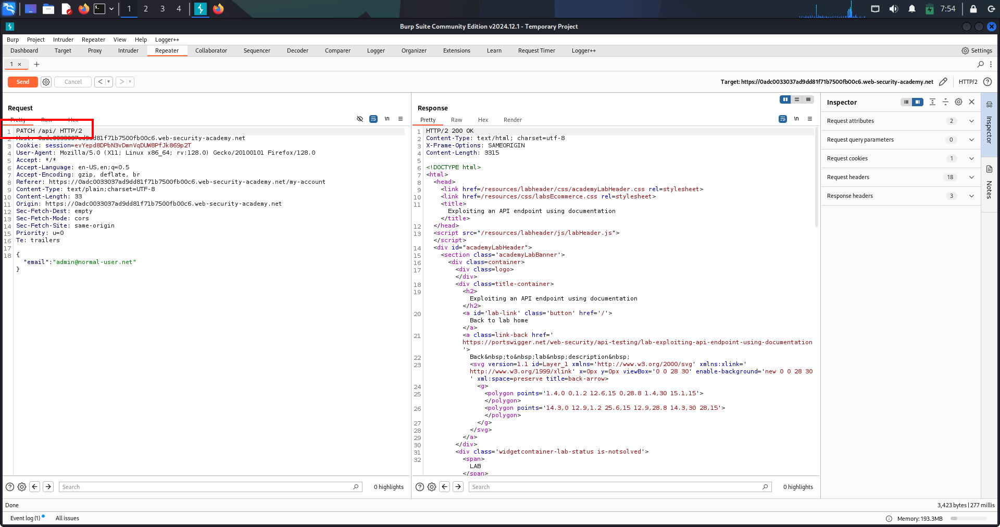
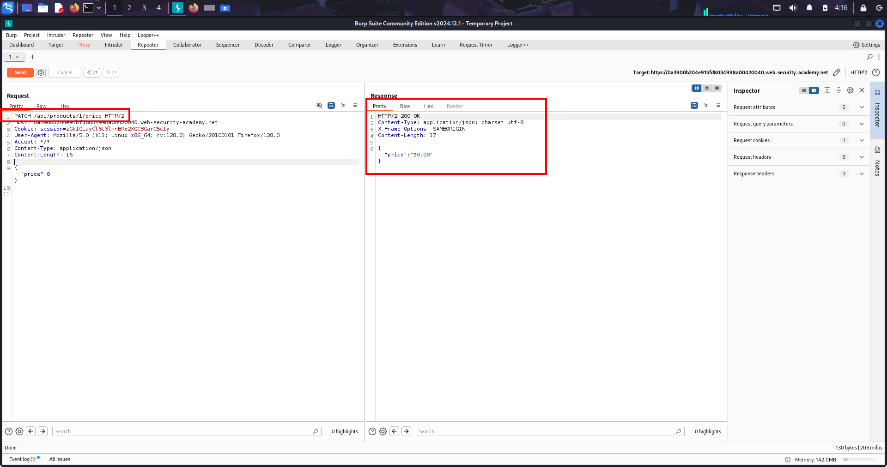

# API Documentation Exposure — Lab: Discovering OpenAPI & Exploiting PATCH/DELETE

---

## 🔹 One-line summary
Found exposed OpenAPI docs (/openapi.json) → discovered destructive PATCH/DELETE endpoints and reused an active session to perform a PATCH to /api/users/wiener (PoC attached).

---

## 🔹 Overview
Public API documentation (Swagger / OpenAPI / Redoc) often reveals exact endpoints, HTTP methods, parameters and example payloads. When reachable in production, these docs greatly accelerate recon and let an attacker craft precise destructive requests without guessing field names.

---

## 🔹 Methodology / Lab walkthrough (precise steps)
1. Open the lab and *log in* with:
   - username: wiener
   - password: peter

2. Navigate to *My account*.

3. In the account page: *update the email* field and click *Update*.

4. With Burp Proxy ON, capture the generated request:  
   PATCH /api/users/wiener HTTP/2 (request body contains modified email).

5. *Send the captured PATCH to Repeater*.

6. In Repeater, change the request path from:  
   PATCH /api/users/wiener HTTP/2  
   to:  
   PATCH /api HTTP/2  
   — then *Send*. (Observe HTTP 200 OK.)

7. Probe for API docs using the base path: check /api, /openapi.json, /swagger.json, /swagger-ui.  
   - *Found:* /openapi.json.

8. Inspect /openapi.json and identify destructive endpoints, e.g.:  
   DELETE /api/users/{username}

9. Return to the Repeater request, modify:
   - Method: PATCH → DELETE
   - Path: /api/users/wiener → /api/users/carlos
   - Ensure the captured session cookie is present.

10. *Send* the DELETE /api/users/carlos HTTP/2 request in Repeater.

11. Verify success (HTTP 200/204) and confirm the target user (carlos) is removed — lab solved.

---

## 🔹 Repeater-ready PoC (example)
DELETE /api/users/carlos HTTP/2 Host: <lab-host> Cookie: session=<SESSION> Accept: / Connection: close
---

## 🔹 Proof
  
(Screenshot: Repeater request showing the crafted PATCH/DELETE requests (modified path and method) and the successful response.)

---

## 🔹 Impact
- Direct account modification / deletion → data loss, account takeover.  
- Discovery of internal/admin endpoints → SSRF, internal API abuse, larger compromise.  
- Easy automation of mass-extraction when docs enumerate many endpoints.

---

## 🔹 Remediation (short)
- Restrict access to API docs in production (auth, IP allowlist, or VPN).  
- Remove sensitive examples / tokens and internal hostnames from docs.  
- Enforce server-side authorization for every endpoint.  
- Rate-limit and log access to docs and admin endpoints.

---

## 🔹 Pentest checklist
- [x] Login & capture session cookie.  
- [x] Trigger UI actions to reveal API base path.  
- [x] Probe /openapi.json, /swagger.json, /swagger-ui.  
- [x] Inspect docs for destructive endpoints (DELETE, PATCH).  
- [x] Reuse session cookie and craft exact Repeater requests.  
- [x] Verify impact, save raw request/response and one screenshot as PoC.

---

# API Testing — Lab-2: Price Manipulation → Buy for $0

---

## 🔹 One-line summary
Found a product price API and used a PATCH /api/products/{id}/price request to set the price to 0, then added the item to cart and completed checkout (PoC steps included).

---

## 🔹 Overview
APIs expose server-side functionality (GET/PATCH/PUT/DELETE). Hidden or poorly protected mutation endpoints (price updates, role changes, discounts) let attackers change business logic and cause real financial loss. This lab demonstrates changing a product price to 0 and completing an order.

---

## 🔹 Methodology / Lab walkthrough (concise flow)
- *Authenticate & capture* — log in (wiener:peter) with Burp Proxy ON; browse the product page to capture API calls.  
- *Discover price endpoint* — observe GET /api/products/1/price (or similar) and forward it to Repeater to inspect returned JSON (field names).  
- *Probe / switch method* — in Repeater change GET → PATCH, add header Content-Type: application/json to provoke helpful errors.  
- *Learn parameter name from errors* — use error responses (e.g., ErrorPriceParameterMissingInBody) to identify expected JSON key (e.g., price).  
- *Exploit* — send PATCH /api/products/1/price with body {"price":0} and confirm 200 OK.  
- *Verify & purchase* — GET the price to confirm {"price":0}, add product to cart in browser, then checkout → order completes at $0 → lab solved.

---

## 🔹 Repeater-ready PoC (copy / paste & edit)
PATCH /api/products/1/price HTTP/2 Host: <LAB_HOST> Cookie: session=<SESSION> Content-Type: application/json Accept: / Connection: close

{"price":0}
*Fallback (checkout discount method):*
POST /api/checkout HTTP/2 Host: <LAB_HOST> Cookie: session=<SESSION> Content-Type: application/json Connection: close

{"chosen_products":[{"product_id":"1","quantity":1}],"chosen_discount":{"percentage":100}}
---

## 🔹 Common responses & troubleshooting
- 415 → wrong Content-Type; set application/json.  
- 400 ErrorPriceParameterMissingInBody → use the indicated JSON key (price).  
- 405 Method Not Allowed → try PUT/POST.  
- 401/403 → must include valid session cookie.  
- If price updates but checkout still charges full amount, check for separate price calculations at checkout or client-side price enforcement.

---

## 🔹 Proof
  
(Screenshot: Repeater request showing PATCH /api/products/1/price with {"price":0} and the 200 OK response; follow-up screenshot of cart/checkout showing $0 order is recommended.)

---

## 🔹 Impact
- Direct financial loss / fraud (orders placed at $0).  
- Business-impact (revenue loss, accounting anomalies).  
- Potential chain to further exploitation (mass price changes, inventory corruption).

---

## 🔹 Remediation (short)
- Require server-side authorization for price changes and only allow privileged roles to mutate prices.  
- Validate and whitelist JSON fields and types; reject unexpected fields.  
- Remove or protect hidden admin endpoints in production.  
- Log and alert on unusual mutation patterns (rapid PATCHes to price endpoints).  
- Apply rate-limiting and anomaly detection for mutation endpoints.

---

## 🔹 Pentest checklist
- [x] Crawl UI & JS for /api/ paths.  
- [x] Capture product-related GETs to learn field names.  
- [x] Try GET → PATCH/PUT/POST with Content-Type: application/json.  
- [x] Use error messages to discover JSON keys.  
- [x] Modify price → verify via GET, cart, and checkout.  
- [x] Document requests/responses and include a screenshot of the successful price change and $0 checkout PoC.

---

