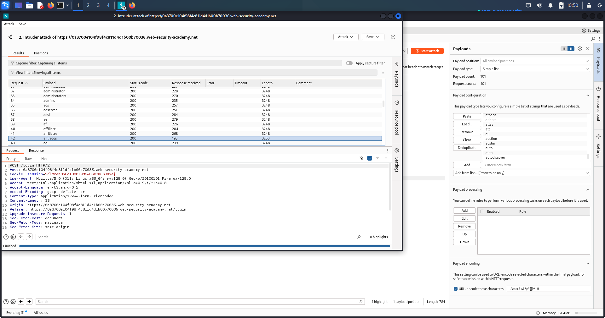
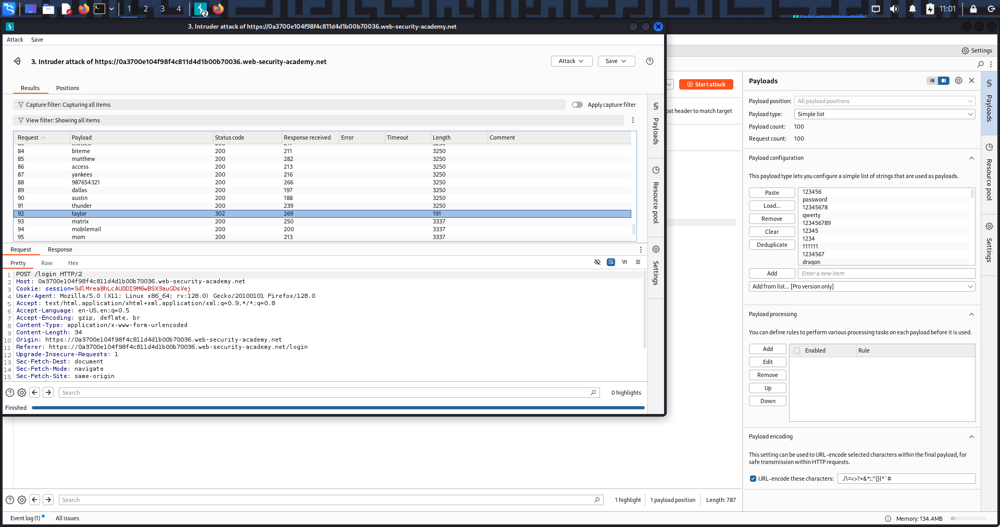
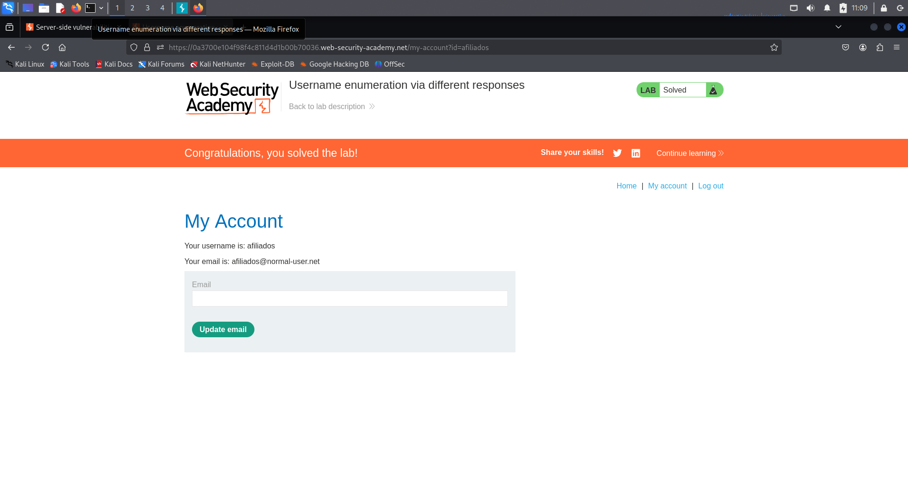
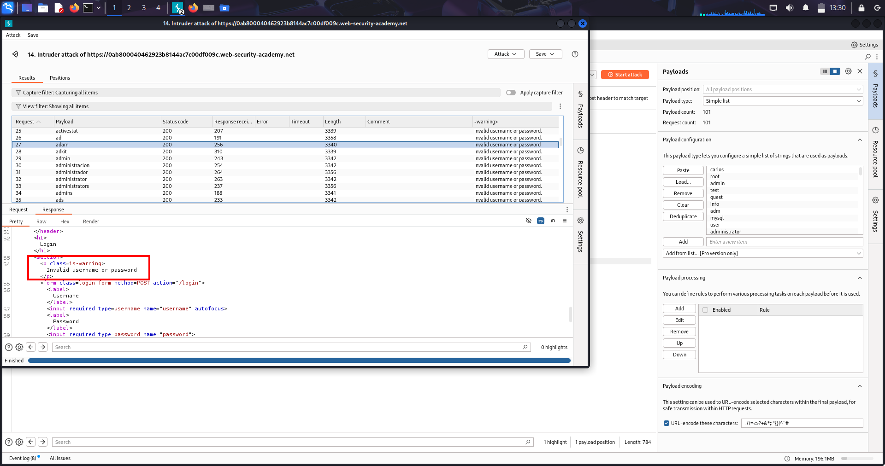
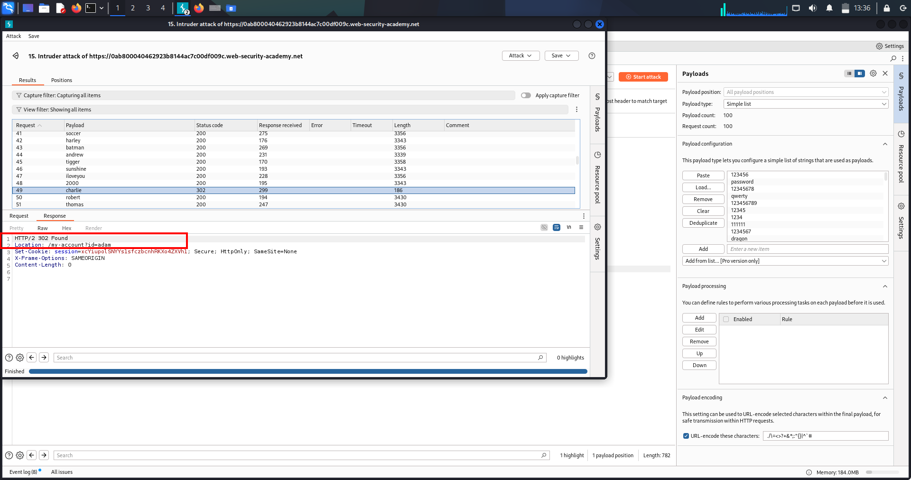
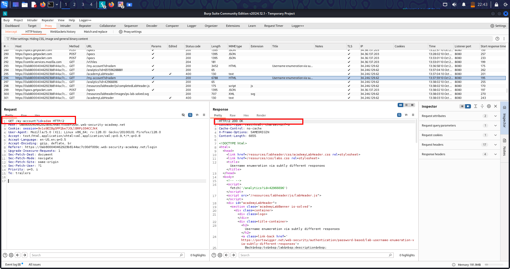
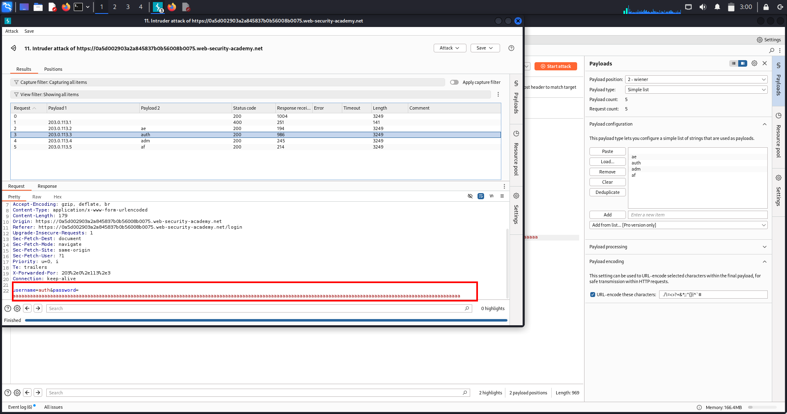
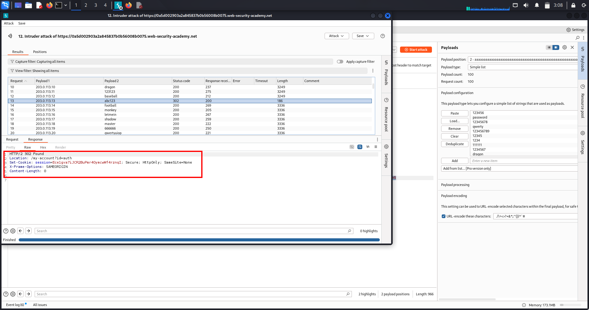
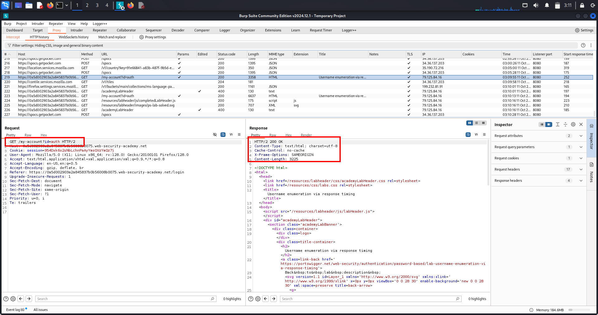
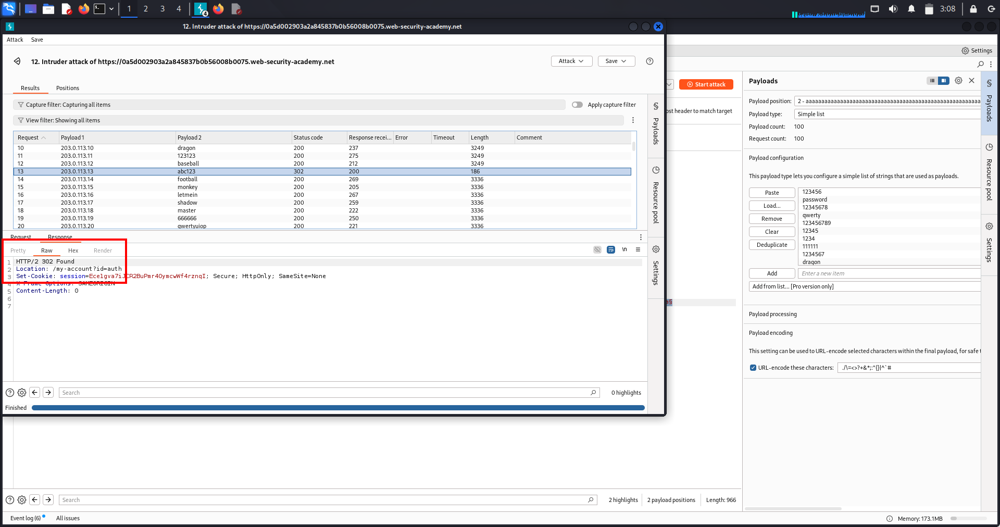

# Authentication Lab-1 — Username enumeration & Password brute-force

---

## 🔹 One-line summary
Identified username enumeration via subtle response differences, then used password brute-force against the discovered account to gain access (PoC attached).

---

## 🔹 Overview
Authentication verifies identity (username/password/MFA). Username enumeration leaks whether an account exists and drastically lowers attacker effort. Once a valid username is known, automated password guessing (brute-force / credential-stuffing) can lead to account takeover and further escalation.

---

## 🔹 Methodology / Lab walkthrough (concise flow)
- *Capture login flow* — with Burp Proxy ON, submit a normal login to capture POST /login (or equivalent).  
- *Manual enumeration check* — in Repeater, replace username with a candidate and use a known-wrong password; observe response differences (status, content-length, headers).  
- *Automated enumeration* — send the captured POST to Intruder with payloads on the username field (wordlist). Sort results by length/status to find the username that produces a different response (valid user).  
- *Password brute-force* — send the login POST to Intruder with payloads on the password field (username fixed to discovered user). Use Sniper or appropriate attack type; detect success by different status/length/redirect/Set-Cookie.  
- *Verify & document* — log in with the found credentials in the browser or Repeater, capture the successful response and screenshot the logged-in page. Save the raw request/response and screenshots as PoC.

---

## 🔹 Repeater / Intruder PoC templates
*Captured login POST (example)*
POST /login HTTP/1.1 Host: <LAB_HOST> Content-Type: application/x-www-form-urlencoded Cookie: session=<SESSION>

username=<CANDIDATE>&password=wrongpassword
*Intruder — username payload position*  
Place §username§ at the username value and load wordlist of candidate usernames.

*Intruder — password payload position*  
Fix username to discovered account, place §password§ at password value and load password list.

---

## 🔹 Proof (evidence)
1. *Username enumeration — differing response*  
     
   (Screenshot: Intruder/Repeater results showing the username entry with a different status/content-length.)

2. *Password brute-force — discovered correct password*  
     
   (Screenshot: Intruder/Repeater hit showing the request/response that indicates a successful login attempt for the discovered username.)

3. *Lab solved — logged-in view / success page*  
     
   (Screenshot: browser showing the logged-in page or lab success confirmation.)

---

## 🔹 Impact
- Fast account discovery → targeted attacks and credential stuffing.  
- Account takeover leads to data theft, abuse of user privileges, and potential vertical escalation (admin takeover).  
- Attackers can use valid accounts to bypass protections, access private features, or pivot.

---

## 🔹 Remediation (short)
- Return uniform error messages & HTTP status codes for authentication failures.  
- Normalize response lengths and avoid side-channel leaks (timing, headers, redirects).  
- Rate-limit and throttle login attempts by IP and account; enforce progressive delays and account lockouts.  
- Enforce MFA for high-value accounts and strong password policies.  
- Monitor/alert on enumeration/brute-force patterns and apply CAPTCHAs when abusive activity is detected.

---

## 🔹 Pentest checklist
- [x] Capture login requests and identify username param.  
- [x] Try manual enumeration in Repeater (wrong password).  
- [x] Automate enumeration with Intruder; sort by length/status.  
- [x] Brute-force password for confirmed username with Intruder (Sniper).  
- [x] Verify successful login, save raw request/response and screenshots.  
- [x] Recommend mitigation steps and re-test after fixes.

---

# Authentication Lab 2 — Username enumeration via subtle response differences 

---

## 🔹 One-line summary
Find a username that returns a subtly different response (status/length/whitespace), then brute-force that user’s password and log in. (Exact method — copy/paste ready.)

---

## 🔹 Overview
This lab demonstrates username enumeration using tiny response differences (content-length, whitespace, punctuation, headers or timing) and targeted password brute-force once a valid username is confirmed. Use Intruder with a Grep-Extract (Fetch Response) to reliably spot the subtle outlier.

---

## 🔹 Methodology / Lab walkthrough 
1. *Capture a fresh login POST*  
   - Proxy ON, Intercept OFF. Submit the login form to capture POST /login.  
   - Right-click the captured request → *Send to Intruder*.

2. *Set Intruder positions (username)*  
   - Positions → Clear markers → mark *only* the username field as payload: ...username=§username§&password=...  
   - Edit the password value to a long string (200–400 a chars) to amplify timing/processing differences (optional).

3. *Prime responses (small probe)*  
   - Run 2–3 requests with different usernames to let Intruder collect sample responses (helps Fetch work).

4. *Add Grep-Extract (Fetch Response)*  
   - Options → Grep - Extract → Add → choose Fetch Response.  
   - Highlight the exact standard error message in the preview (include punctuation/period/whitespace). Save extractor.

5. *Load full username list & run attack (Sniper)*  
   - Payloads → load usernames.txt.  
   - Attack type = *Sniper* (or Pitchfork if doing parallel lists).  
   - Throttle: 300–500 ms. Timeout: 10–15 s. Follow redirects: *OFF*.  
   - Start attack.

6. *Identify candidate username(s)*  
   - Sort by *Extracted* column or look for rows where Extracted is empty (i.e., response didn’t match the standard message).  
   - Inspect Raw response for the subtle difference (trailing space, missing period, slight length change). Copy the username.

7. *Password brute-force (for discovered username)*  
   - Capture a fresh login POST (to get fresh tokens), send to Intruder.  
   - Positions → mark *password* only: username=found_user&password=§payload§.  
   - Payloads → load passwords.txt. Attack type = *Sniper*.  
   - Same throttle/timeout settings. Start attack.

8. *Detect successful password*  
   - Watch for different *Status* (e.g., 302), different *Length*, or presence of Set-Cookie/Location header.  
   - Click the outlier row → open Raw → replay in Repeater or browser to verify login.

9. *Verify & capture PoC*  
   - Log in via browser or Repeater using found credentials. Capture screenshot of logged-in page / account (lab solved).  
   - Save the successful raw request + response + screenshots.

---

## 🔹 Repeater / Intruder templates 

*Baseline login POST (example)*
POST /login HTTP/1.1 Host: <LAB_HOST> Content-Type: application/x-www-form-urlencoded Cookie: session=<SESSION>

username=wiener&password=peter

*Intruder username position (amplified password)*
username=§candidate_username§&password=aaaaaaaaaaaaaaaaaaaaaaaaaaaaaaaaaaaaaaaaaaaaaaaa

*Intruder password position (for found username)*
username=found_user&password=§password_payload§

---

## 🔹 What signals to use (priority)
1. Status change (200 → 302 redirect).  
2. Content-Length difference.  
3. Presence of Set-Cookie or Location header.  
4. Slight whitespace/punctuation variation in response body.  
5. Response time (if timing is the only signal — use amplifier).

---

## 🔹 Proof (screenshots)
1. *Username discovered* — Intruder output row showing the discovered username with different Extracted/Length/Status.  
   

2. *Password found* — Intruder/Repeater showing the password guess that produced a success indicator (302/Set-Cookie).  
   

3. *Lab solved — logged-in UI* — screenshot of the target account page / lab success after using found credentials.  
   

(Place the actual screenshots at images/ with the filenames above.)

---

## 🔹 Impact
- Account takeover → data theft, impersonation, further exploitation (IDOR, privilege escalation).  
- If admin or privileged user discovered → full compromise.

---

## 🔹 Remediation (short & report-ready)
- Return identical generic error messages for login failures (no username-specific content).  
- Return same HTTP status code for all authentication failures.  
- Implement rate-limiting and progressive delays per IP & per account.  
- Enforce MFA on privileged accounts.  
- Monitor and alert on enumeration/brute-force patterns.

---

## 🔹 Pentest checklist 
- [ ] Capture login POST → send to Intruder.  
- [ ] Run username enumeration with Grep-Extract (include punctuation/whitespace).  
- [ ] Narrow candidates and confirm username.  
- [ ] Brute-force password for found username (Sniper).  
- [ ] Verify login & save raw request/response + screenshots.  
- [ ] Report with remediation steps.

---

# Authentication Lab-3 — Username enumeration via response timing (IP rotation) 

---

## 🔹 One-line summary
Enumerate a valid username using subtle response timing differences (amplified by long passwords), rotate IP via X-Forwarded-For to bypass IP lockout, then brute-force the discovered user’s password and log in. (Exact steps — copy/paste ready.)

---

## 🔹 Overview
This lab uses timing differences (and optional IP rotation via X-Forwarded-For) to detect valid usernames that return subtly different server processing times. Once a username is confirmed, rotate source IPs when brute-forcing the password to avoid IP-based lockouts. Use Intruder (Pitchfork / Cluster Bomb) with amplified requests to reliably spot timing signals.

---

## 🔹 Methodology / Lab walkthrough (exact steps)

1. *Capture a fresh login POST*  
   - Proxy ON. Submit the login form once to capture POST /login.  
   - Right-click the captured request → *Send to Repeater*.

2. *Confirm X-Forwarded-For support*  
   - In Repeater add header X-Forwarded-For: 203.0.113.55 → *Send*.  
   - If lockout behavior changes, IP rotation is possible. If not, IP lockout may be per-account — proceed with caution.

3. *Send request to Intruder*  
   - Repeater → *Send to Intruder*.

4. *Positions — prepare enumeration (Pitchfork)*  
   - Positions → Clear markers.  
   - Add marker 1 on the last octet part of X-Forwarded-For: 203.0.113.§IP§ (Payload set 1).  
   - Add marker 2 on username (Payload set 2).  
   - Set password to a long constant (≈100–400 a chars) to amplify server processing time.

5. *Payloads for enumeration*  
   - Payload set 1 (IP octets): Numbers 1..N (or a small IP list).  
   - Payload set 2 (usernames): load candidate_usernames.txt.  
   - Attack type: *Pitchfork* (pairs IP[i] with USER[i]).  
   - Options: Throttle 300–500 ms, Timeout 10–15 s, Follow redirects OFF.

6. *Run & inspect timing*  
   - Start the attack. Enable timing columns (Response completed / Time).  
   - Sort by Response Time; look for a username with consistently higher response time (or unique response size).

7. *Confirm candidate*  
   - Click the candidate row → Send to Repeater → resend 2–3× to confirm consistent timing or body difference.

8. *Prepare brute-force (Cluster Bomb — IP × password)*  
   - Get a fresh POST /login into Repeater (fresh CSRF/session). → Send to Intruder.  
   - Positions: add marker for X-Forwarded-For: §IP§ (payload set 1) and marker on password=§PASSWORD§ (payload set 2). Keep username=identified-user fixed.  
   - Payload set 1: list of IPs (ips.txt) or number range.  
   - Payload set 2: candidate_passwords.txt.  
   - Attack type: *Cluster Bomb*. Throttle 400–700 ms, Timeout 10–15 s. Run a small smoke test first.

9. *Detect success & verify*  
   - Watch for Status = 302, Set-Cookie, Location: /my-account or reduced Length.  
   - Click the hit → open Raw → replay in Repeater or browser.  
   - Verify login and capture the logged-in UI screenshot (lab solved). Save raw request/response.

---

## 🔹 Repeater / Intruder templates (paste & edit)

*Enumeration (Pitchfork — password amplifier)*

POST /login HTTP/1.1 Host: <LAB_HOST> X-Forwarded-For: 203.0.113.§IP§ Content-Type: application/x-www-form-urlencoded Cookie: session=<SESSION>

username=§USERNAME§&password=aaaaaaaaaaaaaaaaaaaaaaaaaaaaaaaaaaaaaaaaaaaaaaaa

- Payload set 1 (IP): Numbers 1..N or ips.txt  
- Payload set 2 (USERNAME): candidate_usernames.txt  
- Attack type: Pitchfork

*Brute-force (Cluster Bomb — rotate IP × password)*
POST /login HTTP/1.1 Host: <LAB_HOST> X-Forwarded-For: §IP§ Content-Type: application/x-www-form-urlencoded Cookie: session=<SESSION>

username=identified-user&password=§PASSWORD§

- Payload set 1 (IP): ips.txt  
- Payload set 2 (PASSWORD): candidate_passwords.txt  
- Attack type: Cluster Bomb

---

## 🔹 Troubleshooting & tips
- No timing signal → increase password length (400–800 `a`s) and re-test a small subset.  
- Too many timeouts/errors → increase throttle or reduce IP set.  
- CSRF/tokens rotate → always start Intruder runs from a fresh Repeater capture.  
- If IP rotation not usable, consider lower-volume brute-force with long delays and monitoring.

---

## 🔹 Proof (screenshots)
1. *Username enumeration — timing outlier*  
   

2. *Password brute-force hit (rotated IP)*  
   

3. *Lab solved — logged-in target account*  
   

---

## 🔹 Impact
- Account takeover; lateral access to user data and further escalation.  
- If repeated at scale, can lead to mass account compromise.

---

## 🔹 Remediation (short)
- Normalize login failure responses (no timing/behavior differences).  
- Reject/monitor suspicious ips / X-Forwarded-For header usage; validate proxy headers.  
- Implement per-account rate-limits and progressive delays; require MFA for sensitive accounts.  
- Log and alert on unusual IP rotation patterns.

---

## 🔹 Pentest checklist
- [ ] Confirm X-Forwarded-For behavior.  
- [ ] Run Pitchfork username enumeration (long password amplifier).  
- [ ] Confirm candidate username by replaying.  
- [ ] Run Cluster Bomb for password × IP rotation (small smoke test first).  
- [ ] Verify login & capture PoC (raw request/response + screenshots).

---

# Broken brute-force protection — Lab-4: bypass lockout by alternating successful logins

---

## 🔹 One-line summary
By interleaving successful logins for an attacker account (wiener:peter) with guesses for the victim (carlos:<wordlist>), the server’s brute-force counter never reaches the block threshold — resulting in a successful password guess for the victim (PoC attached).

---

## 🔹 Overview
Brute-force protection should limit repeated login attempts per account and/or per IP. If the protection logic resets counters incorrectly (for example, when an unrelated account logs in), an attacker can keep guessing while avoiding lockout. This lab shows how to exploit that logic flaw by alternately authenticating a safe account and guessing the target account.

---

## 🔹 High-level idea
Alternate a valid attacker login (to reset or avoid IP block) with one guess for the victim account — send the requests sequentially so the server never accumulates enough consecutive failures to block the IP.

---

## 🔹 Methodology / Lab walkthrough (exact flow)
1. *Capture a fresh login POST*  
   - Proxy ON; perform a normal login to capture POST /login (fresh CSRF/session).  
   - Right-click captured request → *Send to Intruder*.

2. *Prepare aligned payload lists*  
   - usernames_alternating.txt: lines alternate wiener, carlos, wiener, carlos, ... (start with wiener).  
   - passwords_alternating.txt: lines alternate peter, <guess1>, peter, <guess2>, ... (every wiener line corresponds to peter).

3. *Intruder positions*  
   - Positions → Clear markers.  
   - Mark username as payload position 1 and password as payload position 2:  
     username=§1§&password=§2§

4. *Load payloads & set attack type*  
   - Payload position 1 → Simple list → load usernames_alternating.txt.  
   - Payload position 2 → Simple list → load passwords_alternating.txt.  
   - Attack type → *Pitchfork* (pairs nth username with nth password).

5. *Enforce sequential requests*  
   - Resource pool / Threads = 1 (maximum concurrent requests = 1) so requests are strictly sequential.  
   - Options: Throttle ≈ 300–500 ms, Timeout 10–15 s, Follow redirects = OFF.

6. *Run attack & look for success*  
   - Start the attack. Because wiener:peter appears regularly, the server’s block counter should not reach the threshold.  
   - Filter or sort results to hide normal failures and inspect rows for carlos producing a success indicator (e.g., 302, Location: /my-account, Set-Cookie).

7. *Verify & PoC*  
   - Right-click the hit → *Send to Repeater* → *Send* once → confirm 302 + Location/Set-Cookie.  
   - Login in a browser or replay Repeater to confirm access and lab solved. Save the raw request/response and one screenshot (PoC).

---

## 🔹 Repeater / Intruder template (copy/paste & edit)

*Intruder base*

POST /login HTTP/1.1 Host: <LAB_HOST> Content-Type: application/x-www-form-urlencoded Cookie: session=<SESSION> User-Agent: ... Accept: / Connection: close

username=§1§&password=§2§

*Example small payload sample*

usernames_alternating.txt wiener carlos wiener carlos ...

passwords_alternating.txt peter 123456 peter password ...

---

## 🔹 What to look for (success signals)
- HTTP 302 redirect to account page (Location: /my-account).  
- Set-Cookie: session=... present in response.  
- Response Length / Status different compared to failures.

---

## 🔹 Proof / Evidence

*PoC — successful victim login (302 response)*  
Screenshot shows the Intruder/Repeater row where the victim account returned a 302 (Location / Set-Cookie), proving the brute-force succeeded while alternating attacker logins prevented lockout.  

## 🔹 Impact
- Account takeover of the targeted user → data theft, fraud, escalation.  
- If repeated, can lead to mass compromise of user accounts in a system with the same flawed logic.

---

## 🔹 Remediation (short)
- Scope counters correctly (per-account and/or per-IP) and *do not* reset failure counters based on unrelated successful logins.  
- Use progressive delays and exponential backoff; lockout should not be reset by unrelated events.  
- Require MFA for sensitive accounts.  
- Monitor and alert on alternating-success patterns and unusual sequences of login attempts.

---

## 🔹 Pentest checklist (copyable)
- [ ] Confirm lockout threshold (fail X times → blocked).  
- [ ] Test whether successful login for other account resets counters.  
- [ ] Build alternating lists and run Pitchfork with threads = 1.  
- [ ] Identify the 302 Hit for victim credentials.  
- [ ] Verify in browser; save PoC (raw request/response + screenshot).  
- [ ] Report with remediation.

---

# Account-lock Username Enumeration — Lab-5: repeat each username N times (Cluster Bomb + Null payloads)

---

## 🔹 One-line summary
Repeat each username exactly *N* times (the account-lock threshold) to trigger a lock response for real accounts, then brute-force the confirmed username’s password. (Copy-paste ready.)

---

## 🔹 Overview
Some applications reveal account existence via lockout behaviour: after *N* failed attempts a specific “locked” response appears. By sending every username *N* times and detecting that lock response, an attacker can enumerate valid accounts and then brute-force the confirmed account.

---

## 🔹 Methodology / Lab walkthrough (exact steps)
1. *Capture a fresh login POST*  
   - Proxy *ON*; submit an invalid login to capture POST /login (fresh CSRF/session).  
   - Right-click → *Send to Intruder*.

2. *Positions — set markers exactly*  
   - Intruder → *Positions* → Clear markers.  
   - Mark *username* as payload *pos 1* and *password* as payload *pos 2*.  
   - Add a second (null) payload marker immediately after the password so the body looks like:  
     
     username=§1§&password=example§§
     
     (the second § is the null payload used to repeat each username *N* times).

3. *Payloads — Cluster Bomb with null generator*  
   - Attack type → *Cluster Bomb*.  
   - Payload 1 → *Simple list* → load usernames.txt.  
   - Payload 2 → *Null payloads* → *Generate N payloads = 5* (set *N* to the lab threshold).  
   - Preview should show total payloads = #usernames × N.

4. *Execution options*  
   - Threads / Resource pool = *1* (strict sequential sending).  
   - Throttle ≈ *300–500 ms*.  
   - Timeout *10–15 s*.  
   - Follow redirects = *OFF*.

5. *Run attack*  
   - Each username will be sent *N* times in sequence (same password).  
   - Inspect results for outliers: responses that contain the lock message (e.g., “You have made too many incorrect login attempts.”) or show different *Length/Status*.

6. *Confirm locked username*  
   - Right-click an outlier → *Show response* → verify the lock text/indicator. Note the username.

7. *Brute-force the confirmed account (Sniper)*  
   - Capture a fresh POST /login → Send to Intruder.  
   - Positions: fix username=<confirmed> (no marker) and mark password=§1§.  
   - Payload → Simple list → candidate_passwords.txt.  
   - Attack type → *Sniper*, Threads = 1, Throttle 300–500 ms, Follow redirects = OFF.  
   - Optionally add a Grep-Extract for the lock message to highlight rows that *do not* contain it.

8. *Verify & PoC*  
   - Right-click the hit → *Send to Repeater* → *Send* once → confirm 302 / Location / Set-Cookie.  
   - Log in in browser with the found credentials (wait unlock time if required).  
   - Save the successful raw request/response and screenshots.

---

## 🔹 Repeater / Intruder templates (copy/paste & edit)

*Cluster Bomb enumeration (positions)*

POST /login HTTP/1.1 Host: <LAB_HOST> Content-Type: application/x-www-form-urlencoded Cookie: session=<SESSION>

username=§1§&password=example§§

- Payload pos 1 → usernames.txt  
- Payload pos 2 → Null payloads → Generate *N* = <lock threshold>

*Sniper (password brute-force for confirmed username)*

POST /login HTTP/1.1 Host: <LAB_HOST> Content-Type: application/x-www-form-urlencoded Cookie: session=<SESSION>

username=<confirmed-username>&password=§1§

- Payload pos 1 → candidate_passwords.txt

---

## 🔹 What to look for (signals)
- Response body text containing lock message (exact string).  
- Content-Length change for the Nth attempt.  
- Status differences or timing changes.

---

## 🔹 Remediation (short)
- Do *not* reveal lock state in response bodies/headers/timings.  
- Use identical, generic failure messages for invalid credentials and locked states.  
- Scope lockouts properly (per-account and/or per-IP) and avoid attacker-controllable reset triggers.  
- Use progressive delays, MFA for high-value users, monitoring and alerts on enumeration patterns.

---

## 🔹 Pentest checklist (copyable)
- Capture fresh login request (fresh CSRF/session).  
- Cluster Bomb: usernames × Null payloads (*N* = lock threshold).  
- Identify locked usernames from outlier responses.  
- Sniper brute-force confirmed username’s password.  
- Verify; save raw requests/responses + screenshots for PoC.

---

## 🔹 Proof / Evidence

*1) Username locked (enumeration PoC)*  
Screenshot: images/account-lock-username-found.png  
Caption: Intruder row showing the username that produced the lock response on the Nth attempt.

*2) Password found (brute-force PoC)*  
Screenshot: images/account-lock-password-found.png  
Caption: Intruder/Repeater row showing the successful password guess (302 / Set-Cookie) for the confirmed username.
