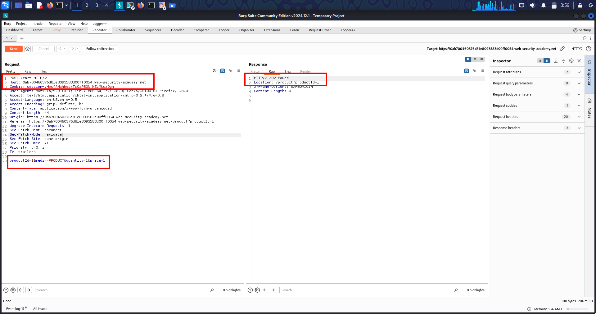
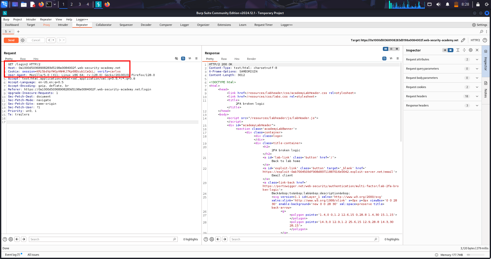
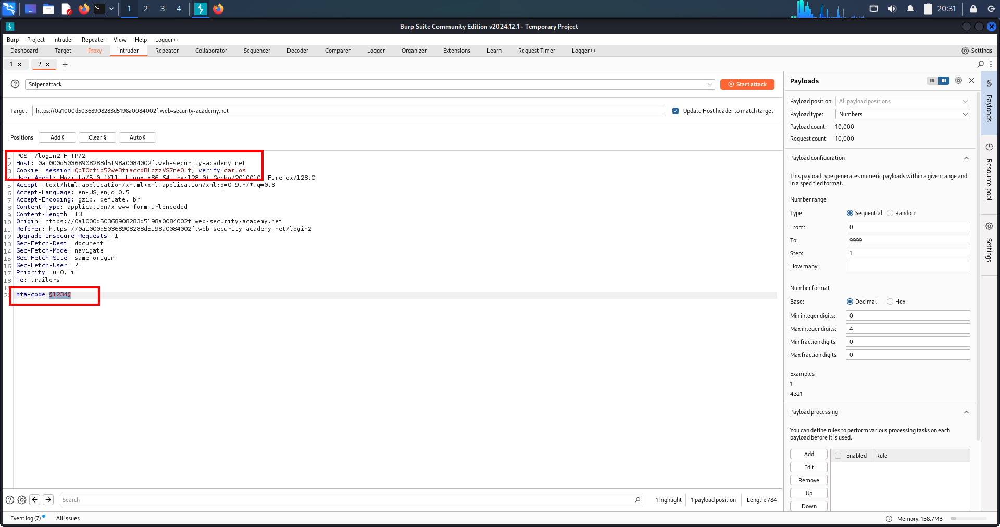
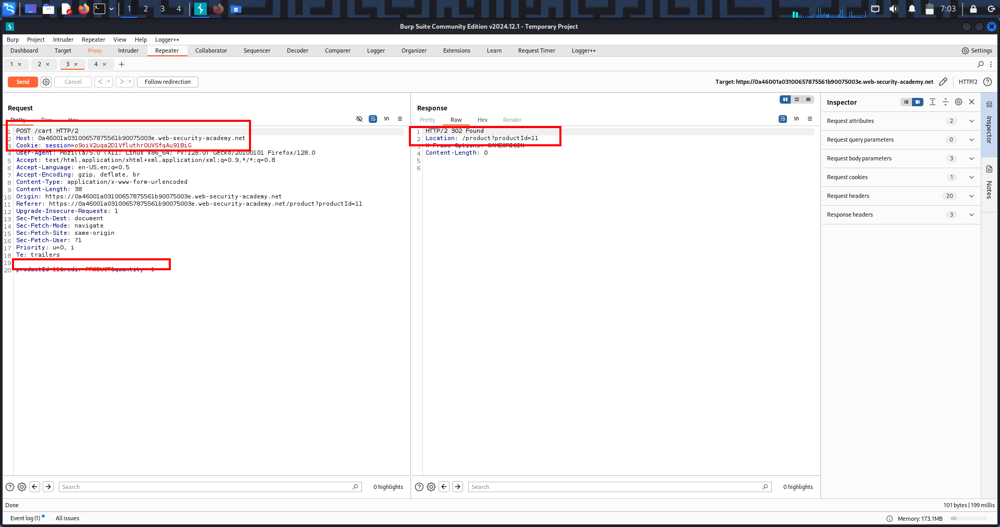
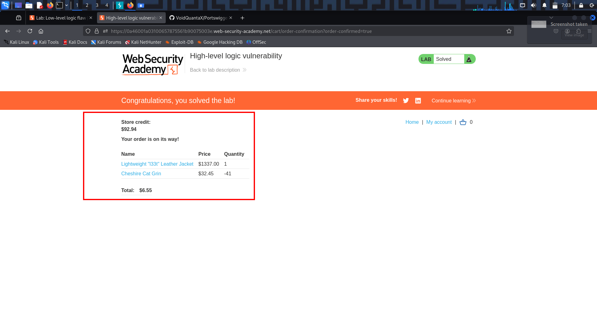
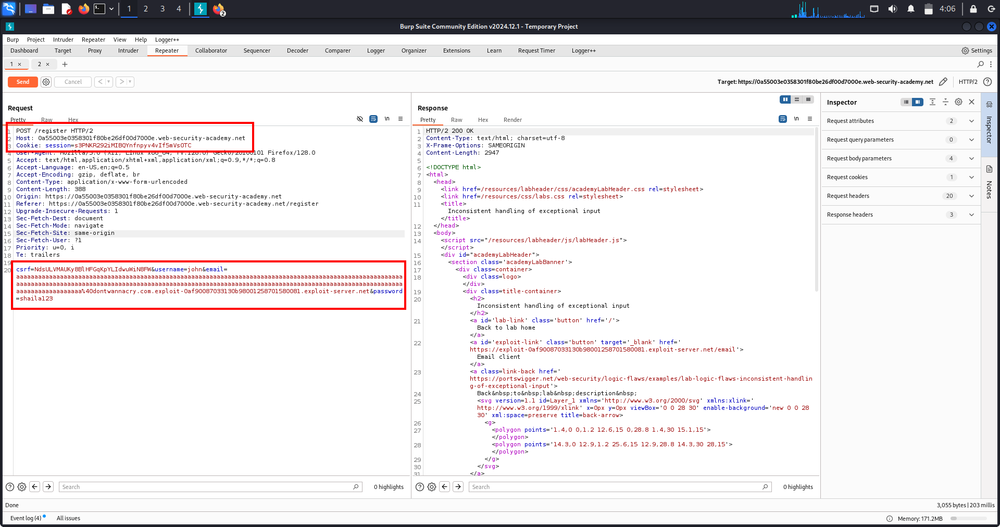
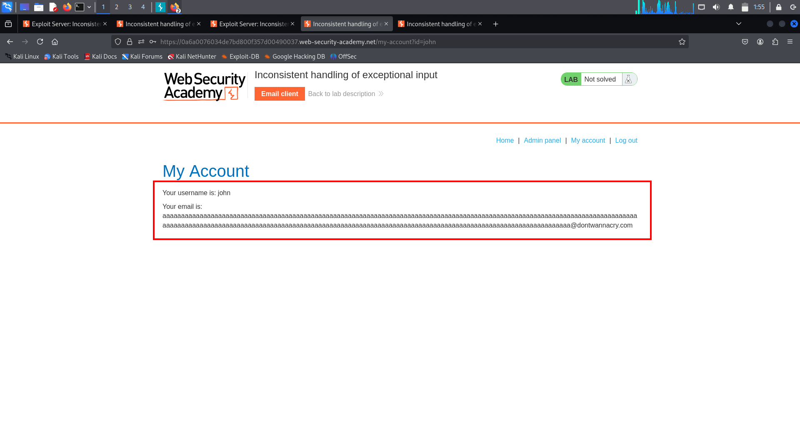
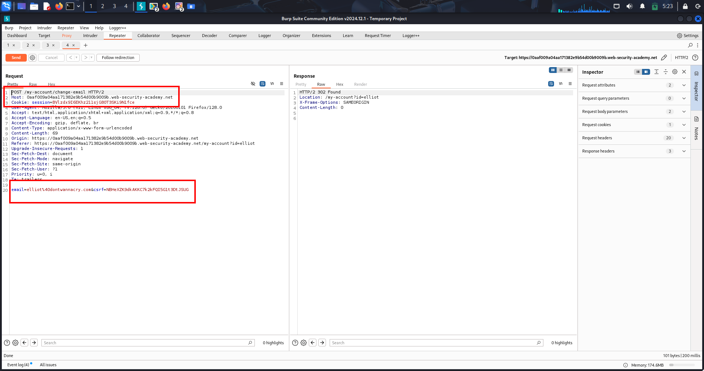
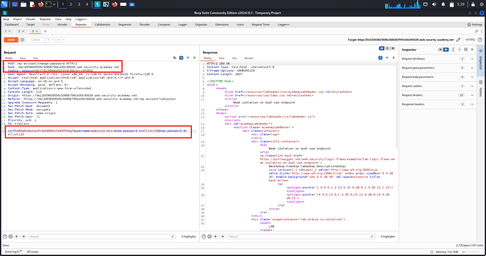

# Lab-1 💰 Business Logic Vulnerability – Price Manipulation

(Complete & Real-World Notes)

---

## 🔹 Overview

Price manipulation is a business logic vulnerability where an application allows users to control or influence the price of a product during the purchase workflow.

The application does not have a technical flaw — it behaves exactly as designed — but the design itself is insecure.

This vulnerability often results in:

- Free or discounted purchases
- Financial loss
- Refund abuse
- Unlimited balance creation

Price manipulation is one of the most common real-world causes of business loss in e-commerce systems.

---

## 🔹 What Is This Topic?

This is a **Business Logic / Insecure Design** vulnerability where:

> Critical business values are accepted from the client instead of being enforced server-side.

The server trusts:

- Client-supplied prices
- Cart values
- Order totals

Attackers simply change values — no exploitation skills required.

---

## 🔹 Lab Walkthrough (Simple & Clear)

### 1️⃣ Login as Normal User

```
Username: wiener
Password: peter
```

Check account balance:

```
Balance: $100.00
```

📌 Product price is higher than available balance.

---

### 2️⃣ View Expensive Product

- Product price shown: `$1300`
- Add product to cart
- Attempt checkout → **fails due to low balance**

---

### 3️⃣ Identify Vulnerable Flow

Cart update request:

```
POST /cart HTTP/2
```

Intercept request using Burp Suite.

---

### 4️⃣ Observe Client-Controlled Parameters

Example parameters in request:

```
productId=1
quantity=1
price=1300
```

📌 **`price` is fully client-controlled**

---

### 5️⃣ Modify the Price Parameter

Change:

```
price=1300
```

to:

```
price=1
```

---

### 6️⃣ Forward the Request

- Server accepts modified value
- No validation or recalculation performed

---

### 7️⃣ Verify Cart

- Product price now shows as `$1`
- Cart total updated accordingly

---

### 8️⃣ Complete Checkout

```
POST /cart/checkout HTTP/2
```

- Purchase succeeds
- Balance reduced by `$1`

✅ Lab solved

---

## 🔹 Evidence

### 🖼️ Screenshot

- 

---

## 🔹 Real-World Scenarios (100% COMPLETE – NO GAPS)

### 1️⃣ Client-Side Price Control (Most Common)

Prices sent via:

- `POST /cart`
- `POST /checkout`

📌 Impact:

- Free purchases
- Discount abuse
- Revenue loss

---

### 2️⃣ Mobile App API Abuse

Mobile APIs often send:

- price
- total
- discount

📌 Impact:

- API tampering
- Scalable abuse
- No UI limitations

---

### 3️⃣ Currency Manipulation

Example:

```
price=100
currency=USD → change to weaker currency
```

📌 Impact:

- Pay far less than intended
- Accounting inconsistencies

---

### 4️⃣ Quantity × Price Logic Flaws

Example:

```
quantity=999
price recalculated incorrectly
```

📌 Impact:

- Bulk items for free
- Inventory abuse

---

### 5️⃣ Coupon + Price Chain Abuse

- Price lowered manually
- Coupon applied afterward

📌 Impact:

- Negative totals
- Store credit generation

---

### 6️⃣ Refund Abuse After Price Manipulation

- Buy item cheaply
- Refund at original price

📌 Impact:

- Unlimited money creation

---

### 7️⃣ Third-Party Payment Integration Issues

Mismatch between:

- Application price
- Payment gateway price

📌 Impact:

- Partial payments
- Payment bypass

---

## 🔹 High-Value Parameters to Always Test

Critical parameters:

- price
- total
- amount
- subtotal
- discount
- coupon
- currency
- quantity
- shipping_cost
- tax

🔴 If any are client-controlled → **critical severity**

---

## 🔹 Multi-Chain Attacks (Real Hacker Paths)

### Chain 1 – Direct Loss

```
Price manipulation
→ Free purchase
→ Financial loss
```

---

### Chain 2 – Infinite Money

```
Price manipulation
→ Purchase
→ Refund
→ Balance increases
→ Repeat
```

---

### Chain 3 – Coupon + Price Abuse

```
Lower price
→ Apply coupon
→ Negative checkout total
→ Credit issued
```

---

### Chain 4 – Logic → Account Takeover

```
Free premium upgrade
→ Premium access
→ Sensitive data exposure
```

---

## 🔹 Why This Is Hard to Detect

- No errors
- No crashes
- Valid workflows
- Looks normal

Automated scanners ❌  
Manual logic testing ✅

---

## 🔹 Remediation (Developer Fix)

### ✅ Correct Fixes

- Calculate prices server-side only
- Ignore client-supplied price values
- Recalculate cart during checkout
- Validate totals against database
- Enforce strict business rules

---

### ❌ Never

- Trust frontend prices
- Accept POSTed totals
- Assume users follow UI flow
- Rely on JavaScript validation

---

## 🔹 Extra Notes / Pentest Gold

🧠 **Golden Rule**

> If the client controls money, the attacker controls the business.

🔥 **Red Flags**

- `price` parameter in requests
- `total` sent from frontend
- No server-side recalculation
- UI/backend mismatch

📌 Classification:

- OWASP A04 – Insecure Design
- Severity: High → Critical

---

## 🧠 One-Line Memory Hook

> Business logic bugs don’t break code — they break companies.

---

# Lab-2 🛡️ Business Logic Vulnerability – Flawed 2FA Logic
## (Complete & Real-World)

---

## 🔹 Overview

Flawed 2FA logic vulnerabilities occur when an application implements multi-factor authentication but fails to correctly bind the OTP to the **right user, session, or authentication flow**.

Instead of attacking cryptography, attackers exploit **logic assumptions** made by the application.

**Impact includes:**
- Account takeover
- Authentication bypass
- Privilege escalation

This vulnerability is **extremely common** in custom-built authentication systems.

---

## 🔹 What Is This Topic?

This is a **Business Logic / Insecure Design** vulnerability.

**Core mistake:**

> The application trusts client-controlled identity parameters during 2FA.

In flawed 2FA implementations:
- OTP is generated
- OTP is verified
- ❌ OTP is NOT securely bound to:
  - The correct user
  - The correct session
  - The correct authentication step

⚠️ If identity can be controlled by the client, **2FA provides zero security**.

---

## 🔹 Lab Walkthrough (Clear & Exact)

### 🎯 Objective

Authenticate as **carlos** without knowing his password by abusing flawed 2FA logic.

---

### 1️⃣ Observe Normal Authentication Flow

- Login using valid credentials:

  - **Username:** wiener  
  - **Password:** peter

- Server flow:
  - `POST /login`
  - Redirect → `/login2`

- Observe parameters used during 2FA:
  - `verify`
  - `mfa-code`

📌 Purpose: understand how OTP generation and verification works.

---

### 2️⃣ Generate OTP for Victim User

- Log out from the application
- Manually access:

  `GET /login2?verify=carlos`

**Result:**
- Server generates an OTP for **carlos**
- No authentication required ❌

📌 Critical flaw: OTP generation depends solely on a client-controlled parameter.

---

### 3️⃣ Start Legitimate Login as Attacker

- Login again as:

  - **Username:** wiener  
  - **Password:** peter

- Reach the OTP verification step
- Submit any random OTP
- Intercept the request:

  `POST /login2`

---

### 4️⃣ Brute-Force OTP for Victim

- Send the intercepted request to Intruder
- Configure payloads:

  - `verify=carlos` (fixed)
  - `mfa-code=§000000§`

- Payload range:
  - `000000` → `999999`

- Start attack

---

### 5️⃣ Identify Successful Authentication

Success indicators:
- HTTP 302 redirect
- Different response length
- Access to victim account

Open successful request → authenticated as **carlos**.

---

### 6️⃣ Complete the Lab

- Access **My Account**
- Confirm victim login

✅ **Lab solved**

---

## 🔹 Evidence (SS)

### Screenshot-1
- 

  ### Screenshot-2
- 

---

## 🔹 Real-World Scenarios (NO SKIPS)

### 1️⃣ OTP User Binding Failure
- OTP tied to `verify=username`
- Attacker modifies parameter

**Impact:** account takeover

---

### 2️⃣ OTP Brute Force (No Rate Limiting)
- Unlimited OTP attempts

**Impact:** full authentication bypass

---

### 3️⃣ OTP Reuse
- OTP remains valid after use

**Impact:** replay attacks

---

### 4️⃣ OTP Session Confusion
- OTP generated in one session
- Used in another

**Impact:** cross-session takeover

---

### 5️⃣ Password Reset OTP Misbinding
- OTP not bound to email/user

**Impact:** reset victim password

---

### 6️⃣ Debug / Test OTPs
- Static OTPs like `000000`

**Impact:** universal bypass

---

### 7️⃣ Frontend-Only OTP Validation
- Backend never validates OTP

**Impact:** direct API bypass

---

### 8️⃣ OAuth / SSO 2FA Bypass
- 2FA enforced at IdP only

**Impact:** login without second factor

---

## 🔹 High-Value Endpoints to Test

- `/login`
- `/login2`
- `/verify`
- `/otp`
- `/mfa`
- `/2fa`
- `/reset`

🔴 Any **user-controlled identity parameter** = critical risk.

---

## 🔹 Multi-Chain Attacks

### Chain 1
- OTP misbinding  
→ OTP brute force  
→ Account takeover

---

### Chain 2
- OTP bypass  
→ Password reset  
→ Permanent takeover

---

### Chain 3
- XSS  
→ OTP/session theft  
→ Privilege escalation

---

## 🔹 Remediation (Correct Fix Only)

### ✅ Proper Fixes
- Bind OTP to **user + session + step**
- Enforce strict rate limiting
- Single-use OTPs
- Regenerate session after auth
- Enforce 2FA on sensitive actions

---

### ❌ Never
- Trust `verify` parameters
- Separate OTP generation & verification
- Allow OTP reuse
- Rely on frontend validation

---

## 🔹 Extra Notes (Exam + Pentest)

**Golden Rule:**

> OTP without binding is not authentication.

**Red Flags:**
- `verify=username`
- Public OTP endpoints
- No rate limiting
- Same OTP works twice

**Severity:**
- OWASP A04 – Insecure Design
- High → Critical

---

## 🧠 One-Line Memory Hook

> 2FA fails not when OTP is weak — but when logic is weak.

---

# Lab-3 🧠 Failing to Handle Unconventional Input
## (Business Logic Vulnerability – Complete & Real-World)

---

## 🔹 Overview

Failing to handle unconventional input is a business logic vulnerability where an application does not correctly validate unexpected, edge-case, or abnormal user input.

The application behaves “as designed”, but the **design assumptions are flawed**.

Instead of exploiting technical bugs, attackers exploit:
- Math
- Assumptions
- Workflow logic

This vulnerability is extremely common in systems involving:
- Payments
- Store credit
- Orders & refunds
- Loyalty points
- Booking systems

📌 Often leads directly to **financial loss**.

---

## 🔹 What Is This Topic?

This topic focuses on **broken assumptions** about user input.

Developers assume:
- Numbers will be positive
- Values will be reasonable
- Users will follow the UI
- Frontend validation is enough

**Core mistake:**

> The server does not enforce strict boundaries on numeric or logical input.

Because business logic is custom:
- Automated scanners ❌ miss it
- Manual testing ✅ finds it
- Impact is usually **high to critical**

---

## 🔹 Lab Walkthrough
### (Negative Quantity Jacket Lab)

### 🎯 Goal

Purchase a **$1337 Leather Jacket** using **$100 store credit** by abusing unconventional numeric input.

---

### 1️⃣ Intended Workflow Recon

1. Login as:
   - `wiener : peter`

2. Browse products  
3. Attempt to buy expensive item normally  

❌ Checkout fails due to insufficient credit  
✔️ Confirms server checks **final total only**

---

### 2️⃣ Identify User-Controlled Logic Parameter

1. Intercept request:
   - `POST /cart`

2. Observe parameter:
   - `quantity`

⚠️ Quantity is **fully trusted by backend**

---

### 3️⃣ Inject Unconventional Input

Modify parameter:
- `quantity = -41`

Forward request.

✔️ Cart total becomes **negative**  
➡️ Validation missing  
➡️ Logic flaw confirmed

---

### 4️⃣ Weaponize the Math

Cheap item price:
- `$32.45`

Calculation:
- `-41 × 32.45 = -1330.45`

✔️ Cart total heavily negative

---

### 5️⃣ Add Expensive Item

1. Add **Leather Jacket ($1337)** normally

Server calculation:
- `-1330.45 + 1337 = 6.55`

✔️ Final total:
- Greater than `$0`
- Less than `$100` store credit

---

### 6️⃣ Checkout

Server validates only:
- `final_total ≤ store_credit`

✔️ Purchase succeeds  
✔️ Jacket bought for **$6.55**

✅ **Lab solved**

---

## 🔹 Evidence (SS)

### Screenshot-1
- 

### Screenshot-2  
- 

---

## 🔹 Real-World Scenarios
### (NO SCENARIOS SKIPPED)

---

### 1️⃣ Negative Quantity Purchases

**Bug:**
- Only checks `quantity ≤ stock`

**Exploit:**
- `quantity = -10`
- Total becomes negative

📌 Impact: free items / credit gain

---

### 2️⃣ Negative Funds Transfer

**Bug:**
- Only checks `amount ≤ balance`

**Exploit:**
- `amount = -1000`
- Balance increases

---

### 3️⃣ Client-Side Price Trust

**Bug:**
- Price accepted from client

**Exploit:**
- `price = 1`
- Premium item cheap

---

### 4️⃣ Quantity Overflow

**Bug:**
- No upper bounds

**Exploit:**
- `quantity = 999999999`
- Integer overflow / free items

---

### 5️⃣ Negative Discount Abuse

**Bug:**
- Discount not bounded

**Exploit:**
- `discount = -100`
- Checkout adds money

---

### 6️⃣ Refund Logic Abuse

**Bug:**
- Only checks `refund ≤ paid`

**Exploit:**
- `refund = -500`
- Merchant charged

---

### 7️⃣ Loyalty / Reward Abuse

**Bug:**
- Points not validated

**Exploit:**
- `points = -1000`
- Points credited

---

### 8️⃣ Date / Time Logic Abuse

**Bug:**
- No date comparison

**Exploit:**
- End < Start
- Negative booking cost

---

### 9️⃣ Shipping Cost Manipulation

**Bug:**
- Client-supplied shipping

**Exploit:**
- `shipping = -50`
- Total reduced

---

### 🔟 Inventory Inflation

**Bug:**
- Quantity trusted on cancel

**Exploit:**
- Cancel with `quantity = -100`
- Inventory increases

---

## 🔹 High-Value Endpoints to Test

- `POST /cart`
- `POST /checkout`
- `POST /order`
- `POST /refund`
- `POST /transfer`
- `POST /redeem`
- `POST /apply-coupon`
- `POST /booking`
- `POST /cancel`

🔴 Any endpoint that processes numbers = **high risk**

---

## 🔹 Multi-Chain Attacks

### Chain 1
Negative quantity  
→ Free purchase  
→ Refund abuse  
→ Unlimited balance

---

### Chain 2
Logic flaw  
→ IDOR on cart  
→ Financial theft

---

### Chain 3
Race condition  
→ Double spend  
→ Negative balance abuse

---

### Chain 4
Logic bug  
→ Invoice manipulation  
→ Stored XSS  
→ Account takeover

---

## 🔹 Remediation (Correct Fix Only)

### ✅ Required Defenses
- Reject negative values
- Enforce upper & lower bounds
- Recalculate totals server-side
- Validate **per item**, not just final total

### ❌ Never
- Trust frontend validation
- Trust client-supplied math
- Assume users behave normally

---

## 🔹 Extra Notes (Exam + Bug Bounty)

**Golden Rule:**

> If math is client-controlled, money is attacker-controlled.

**Always test with:**
- `-1`
- `0`
- `1`
- Very large numbers

📌 Severity:
- OWASP A04 – Insecure Design
- High → Critical

---

## 🧠 One-Line Memory Hook

> Logic bugs don’t break the app — they break the business.

---

# Lab-4 🧠 Failing to Handle Unconventional Input
## High Integer Value / Integer Overflow — Business Logic Vulnerability

---

## 🔹 Overview

Failing to handle unconventional input is a *business logic vulnerability* where an application does not correctly validate or constrain extreme numeric values supplied by the client.

Instead of crashing, the application:

- Accepts the value  
- Performs arithmetic operations  
- Triggers an integer overflow  
- Continues execution using an incorrect result  

📌 This is *not* a technical exception or crash  
📌 This is a *logic failure* that directly enables financial abuse

Integer overflow bugs frequently result in:

- Free or underpriced purchases  
- Wallet balance manipulation  
- Refund abuse  
- Loyalty point inflation  

---

## 🔹 What Is This Topic?

This vulnerability occurs when applications:

- Trust numeric input too much  
- Assume values remain within “reasonable” limits  
- Fail to enforce upper and lower bounds  
- Use unsafe integer arithmetic in business logic  

Commonly affected systems:

- Shopping carts  
- Wallets and balances  
- Refund mechanisms  
- Subscriptions  
- Loyalty and reward programs  
- Booking and reservation systems  

These bugs are:

- ❌ Hard for scanners to detect  
- ❌ Invisible in UI testing  
- ✅ Extremely high impact in real-world systems  

---

## 🔹 Lab Walkthrough
### High Integer Overflow — Cart Logic Abuse

### 🎯 Goal

Purchase an expensive item without sufficient balance by forcing the cart total to overflow into an acceptable value.

---

### Step 1: Establish Normal Behavior

*Purpose:* Confirm that business logic checks exist before attempting to break them.

1. Log in as a normal user  
2. Add an expensive product to the cart  
3. Attempt to checkout  
4. Checkout fails due to insufficient balance  

✔️ Confirms server-side balance validation exists  

---

### Step 2: Identify High-Risk Input

*Purpose:* Locate numeric parameters that influence business decisions.

1. Intercept the request using Burp Suite  
2. Observe the following request:

POST /cart

3. Identify the parameter:

quantity

✔️ Quantity is trusted by the server  
✔️ Quantity directly affects price calculation  

---

### Step 3: Test Basic Validation

*Purpose:* Determine validation boundaries.

Test the following values:

0 -1 99 999

Observed behavior:

- Large values are accepted  
- No upper bound enforced  

✔️ Indicates partial or missing validation  

---

### Step 4: Push Quantity to Extreme Values

*Purpose:* Prepare conditions required for integer overflow.

1. Send the request to Burp Repeater  
2. Increment the quantity aggressively  
3. Observe cart total growth  

📌 This mirrors real-world mobile API abuse patterns  

---

### Step 5: Trigger Integer Overflow

*Internal behavior:*

- Backend uses 32-bit signed integers  
- Maximum integer value is exceeded  
- Arithmetic wraps around  

Result:

- Cart total becomes negative or very small  
- Application continues normal execution  

✔️ Overflow successfully triggered  

---

### Step 6: Controlled Total Adjustment

*Purpose:* Bypass checkout validation logic.

1. Push total just beyond integer limit  
2. Allow overflow to occur  
3. Add or remove items to tune the total  

Target condition:

0 < cart_total ≤ user_balance

✔️ Checkout logic accepts the manipulated total  

---

### Step 7: Complete Checkout

1. Final cart total is positive  
2. Total is less than available balance  
3. Place the order successfully  

✔️ Expensive item purchased at minimal cost  
✔️ Lab successfully completed  

---

## 🌍 Real-World Scenarios

Each scenario shows: *Expected logic → Vulnerability → Exploitation*

---

### 🔹 Scenario 1: Quantity Overflow

*Expected:* Quantity has strict upper bounds  
*Bug:* No maximum enforced  

*Exploit:*
1. Set quantity to extreme value  
2. Total overflows  
3. Item purchased cheaply  

---

### 🔹 Scenario 2: Price × Quantity Overflow

*Expected:* Safe multiplication  
*Bug:* Unsafe integer arithmetic  

*Exploit:*
1. High price × high quantity  
2. Overflow occurs  
3. Total wraps  

---

### 🔹 Scenario 3: Wallet Credit Abuse

*Expected:* Total must remain positive  
*Bug:* Negative total allowed  

*Exploit:*
1. Overflow creates negative total  
2. Wallet credited instead of charged  

---

### 🔹 Scenario 4: Refund Overflow

*Expected:* Refund ≤ amount paid  
*Bug:* Overflow unchecked  

*Exploit:*
1. Submit large refund value  
2. Balance credited  

---

### 🔹 Scenario 5: Discount + Overflow Chain

*Expected:* Discounts validated  
*Bug:* Discount applied after overflow  

*Exploit:*
1. Overflow → negative total  
2. Discount applied  
3. User receives credit  

---

### 🔹 Scenario 6: Subscription Abuse

*Expected:* Fixed subscription cost  
*Bug:* Duration or quantity overflow  

*Exploit:*
1. Supply large duration  
2. Overflow  
3. Free premium access  

---

### 🔹 Scenario 7: Loyalty Points Inflation

*Expected:* Points capped  
*Bug:* No upper bound  

*Exploit:*
1. Overflow during calculation  
2. Massive points credited  

---

### 🔹 Scenario 8: Booking Cost Manipulation

*Expected:* Cost ≥ 0  
*Bug:* Duration × rate overflow  

*Exploit:*
1. Extreme duration  
2. Negative cost  
3. Free booking  

---

### 🔹 Scenario 9: Inventory Inflation

*Expected:* Stock decreases safely  
*Bug:* Overflow on quantity  

*Exploit:*
1. Cancel order with huge quantity  
2. Stock increases  

---

### 🔹 Scenario 10: Tax / Shipping Overflow

*Expected:* Calculated server-side safely  
*Bug:* Overflow not validated  

*Exploit:*
1. Overflow reduces tax or shipping  
2. Final total minimized  

---

## 🎯 High-Value Endpoints

Endpoints commonly affected by integer overflow logic:

POST /cart POST /checkout POST /refund POST /wallet POST /redeem POST /apply-discount POST /subscription POST /booking

---

## 🔗 Multi-Chain Attacks

Integer overflow frequently chains with:

- IDOR (modifying other users’ carts)  
- Race conditions (double spending)  
- CSRF (forced overflow actions)  
- Wallet abuse  
- Refund abuse  

---

## 🛡️ Remediation

### ✅ Secure Fixes

- Enforce strict upper and lower bounds  
- Use safe integer types  
- Detect and prevent overflow  
- Recalculate all totals server-side  
- Validate each item independently  

### ❌ Never Do

- Trust frontend validation  
- Trust client-supplied totals  
- Assume values remain reasonable  

---

## 🧠 Extra Notes

- Always test extreme numeric values  
- UI limits are meaningless  
- Overflow bugs are *money bugs*  
- Frequently rewarded in bug bounties  

---

## 🔑 Final Takeaway

> When large numbers influence business decisions, integer overflow becomes a security vulnerability — not a math mistake.

---

# Lab-5 🧠 Failing to Handle Unconventional Input
## Input Truncation & Inconsistent Validation — Business Logic Vulnerability

---

## 🔹 Overview

Failing to handle unconventional input occurs when an application processes user input inconsistently across different system layers, often due to silent truncation caused by backend storage limits.

In such cases, the application may:

- Accept overly long input  
- Silently truncate it at the database layer (e.g., VARCHAR limits)  
- Perform authentication or authorization using the truncated value  
- While other systems rely on the full, unmodified input  

📌 The vulnerability lies in *system disagreement*, not a single bug  
📌 Result is often *authorization bypass without owning a trusted identity*

---

## 🔹 What Is This Topic?

### Core Concept

Inconsistent input handling across system boundaries.

Specifically:

- Client submits long identifiers (email / username)  
- Backend database truncates input silently  
- Authorization logic trusts the truncated value  
- Attacker controls truncation boundaries  

This is *NOT*:

- SQL Injection  
- XSS  
- Password bypass  

This *IS*:

- Business logic flaw  
- Input length & truncation vulnerability  
- Authorization bypass via malformed identity  

---

## 🔹 Lab Walkthrough
### Input Truncation — Authorization Logic Abuse

---

### Step 1: Recon & Authorization Model Discovery

1. Locate the admin endpoint:

/admin

2. Attempt access as a normal user  

3. Access denied with message indicating:

> Only users from dontwannacry.com allowed

📌 Key observation:

- Authorization is *email-domain based*
- Not role-based
- Not permission-based  

This is a logic weakness.

---

### Step 2: Understand the Registration Architecture

Two independent systems are involved:

#### 1️⃣ Email Delivery System

- Uses full email string  
- No truncation  
- Sends confirmation email to full address  

#### 2️⃣ Application Server + Database

- Stores email in a fixed-length column  
- Truncates input silently  
- Uses stored value for authorization  

⚠️ These systems enforce *different constraints*

---

### Step 3: Why Long Input Is Required

Registering directly as:

user@dontwannacry.com

fails because:

- Attacker does not control the domain  
- Confirmation email cannot be received  

Therefore, attacker must:

- Receive email at attacker-controlled domain  
- Appear as dontwannacry.com *after truncation*

➡️ Long input is the only way to satisfy both systems.

---

### Step 4: Identify Truncation Behavior

Register using an intentionally long email:

[very-long-local-part]@attacker-domain.web-security-academy.net

Observed behavior:

- Email delivery succeeds  
- Stored email is silently truncated  

Confirms:

- Truncation exists  
- Max length enforced at storage layer  
- No validation error is thrown  

---

## 🧾 Evidence: Long Input Accepted

### Screenshot-1


### Screenshot-2


---

### Step 5: Precision Exploit Construction

Craft email as:

[padding-to-boundary]@dontwannacry.com.attacker-domain.web-security-academy.net

System interpretation:

- Email system → full address → attacker receives email  
- Database → truncates after dontwannacry.com  

Final stored value:

user@dontwannacry.com

✔️ Authorization logic now treats attacker as internal user

---

### Step 6: Exploit Result

1. Log in using confirmed account  
2. Access:

/admin

3. Perform privileged action (e.g., delete user)

✔️ Authorization bypass achieved  
✔️ Lab solved  

---

## 🌍 Real-World Scenarios

---

### 🔹 Scenario 1: Legacy Databases

- VARCHAR(255) fields  
- Old ORMs  
- Silent truncation  

📌 Extremely common in enterprise systems

---

### 🔹 Scenario 2: Email-Domain-Based Authorization

- Admin panels  
- Internal dashboards  
- Employee-only portals  

📌 Domain ≠ identity

---

### 🔹 Scenario 3: Microservices Mismatch

- Auth service validates full input  
- Application service truncates stored value  

📌 Cross-service trust failure

---

### 🔹 Scenario 4: SSO + Local User Storage

- SSO trusts full email  
- Local DB truncates  
- Authorization performed locally  

📌 Common in hybrid auth systems

---

## ❌ What Does NOT Happen in Real Applications

- Infinite cart loops  
- UI-only validation bugs  
- Completely uncontrolled storage overflow  

📌 Real vulnerabilities are subtle and assumption-based

---

## 🎯 High-Value Targets

Endpoints to prioritize:

/admin /internal /dashboard /manage /staff /ops /support

Features involving:

- Email-based roles  
- Domain allowlists  
- “Employees only” logic  

---

## 🔗 Multi-Chain Attacks

This vulnerability often escalates into:

- Admin access → account takeover  
- Admin access → stored XSS  
- Admin access → password reset abuse  
- Admin access → SSRF / RCE  

📌 Logic flaws compound rapidly

---

## 🛡️ Remediation

### ✅ Correct Defenses

- Validate length *before* storage  
- Canonicalize input prior to validation  
- Never authorize by email domain  
- Use RBAC / permission models  
- Fail hard on truncation  

### ❌ Never

- Rely on database limits as validation  
- Trust identity strings for authorization  

---

## 🧠 Extra Notes

- Precision matters more than brute force  
- Character counting is critical  
- Always test boundary lengths  

Without Burp Pro:

- Register  
- Log in  
- Inspect profile  
- Observe truncation visually  
- Adjust length iteratively  

---

## 🔑 Final Reality Check

❌ Servers do not “plan” truncation  
✅ Truncation is inherited from storage limits  

❌ Developers expect consistency  
✅ Attackers exploit mismatches  

> This vulnerability exists because systems disagree — not because code crashes.

---

# Lab-6 🧠 Business Logic Vulnerability – Inconsistent Authorization Enforcement
## (Privilege Escalation via Post-Registration Email Update)

---

## 🔐 Overview

This lab demonstrates a *business logic vulnerability* caused by inconsistent authorization enforcement.

The application performs a trust check *only once* (during registration) and then assumes the user remains trustworthy forever.  
Because of this flawed assumption, later actions that affect authorization are *not revalidated*.

As a result, a normal authenticated user can escalate privileges to *admin* without exploiting any technical vulnerability.

Root cause:  
*Authorization logic applied at the wrong time*

---

## 📘 What Is This Topic?

This issue belongs to *Business Logic / Insecure Design*, not technical vulnerabilities.

### Core Principle

> Security decisions must be enforced continuously, not just once.

### Developer Assumptions

- Registration = permanent trust  
- Logged-in users = safe  
- Profile updates = harmless  

### Attacker Reality

- Identity data is mutable  
- Trust is reused incorrectly  
- Authorization depends on user-controlled fields  

### Key Mistake

- Authorization depends on *mutable identity data*
- Checks are *not repeated* when that data changes

---

## 🧪 Lab Walkthrough (Clean & Generalized)

### Step 1️⃣ Registration

The application states:

> “If you work for DontWannaCry, use your company email.”

- Register using a *normal email* (PortSwigger email client)
- Account created successfully

*State:*
- Role: normal user
- Admin access: ❌ denied

---

### Step 2️⃣ Login

- Log in with the registered credentials
- Attempt to access:

/admin

*Result:*
- ❌ Access denied

✔️ Confirms admin access is restricted  
✔️ Authorization enforced at this stage  

---

### Step 3️⃣ Update Email (Core Logic Flaw)

On *My Account, an **Update Email* feature is available.

Change email to:

xyz@dontwannacry.com

#### ❌ Application Assumption

> “This user already passed checks during registration.”

#### ❌ What Fails

- No revalidation of domain ownership
- No authorization check on identity change
- Updated value is blindly trusted

*This is the vulnerability.*

Authorization logic is *skipped* when identity data changes.

---

### Step 4️⃣ Access Admin Panel

Revisit:

/admin

*Result:*
- ✔️ Access granted

The application now believes:

> “User belongs to trusted domain → admin allowed”

---

### Step 5️⃣ Lab Completion

- Delete user *carlos*

✔️ Admin action successful  
✔️ Lab solved  

---

## 🧾 Evidence

### Evidence 1️⃣ – Privilege Escalation via Email Update



---

## 🌍 Real-World Scenarios

### Scenario 1️⃣ Company Email Trust

- Email domain checked only at signup
- Email update allowed without validation
- Attacker switches to @company.com
- Gains internal/admin access

---

### Scenario 2️⃣ Role Upgrade via Profile Update

- Role validated at login
- Profile update endpoint allows role/identity change
- No server-side recheck
- Privilege escalation

---

### Scenario 3️⃣ Trusted Session Assumption

- User verified once
- Sensitive actions skip authorization
- Assumption: “User already proved identity”
- Leads to staff/admin access

---

## 🎯 High-Value Endpoints

Always audit carefully:

/my-account /update-email /profile /settings /user/update /change-role /admin

🔴 Especially dangerous if they:
- Modify identity data
- Influence authorization
- Are assumed safe after login

---

## 🔗 Multi-Chain Attacks

Typical attack chain:

1. Normal registration
2. Legitimate login
3. Profile update (identity change)
4. Authorization bypass
5. Admin access

### Real-World Chains

- Profile update + weak auth → privilege escalation
- IDOR + trusted user assumption
- Logic flaw → admin panel compromise

---

## 🛡️ Remediation (Correct Fixes)

### ✅ Proper Security Design

- Revalidate authorization on *every sensitive action*
- Never trust client-controlled identity fields
- Enforce server-side authorization on every request
- Separate identity from privilege

Email ≠ role Domain ≠ admin

Use RBAC / permission systems.

---

## 📝 Extra Notes / Pentest Tips

❌ Not SQL Injection  
❌ Not brute force  
❌ Not a technical bypass  

✅ Pure business logic abuse  

### Exam / Interview Line

> “Authorization must be enforced at every point where trust can change.”

### Pentester Mindset

Whenever you see:
- “Only employees can…”
- “Only admins can…”
- “Verified users can…”

Always ask:

> “Can I change something after login that affects this check?”

---

## 🔑 Final Takeaway

> Trust that is not continuously verified will always be exploited.

---

# Lab-7 🐞 Business Logic Vulnerability – Users Won’t Always Supply Mandatory Input
# (Password Change Logic Flaw – Identity Manipulation)

---

## 🔹 Overview

This business logic vulnerability occurs when an application assumes that users will always supply mandatory input fields.

In reality, attackers can intercept and manipulate HTTP requests to:

- Remove required parameters entirely
- Modify identity-related values
- Force unintended logic paths

When backend validation is weak or missing, sensitive actions may execute without proper verification.

### Impact:
- Account takeover
- Privilege escalation
- Full administrative compromise

This flaw is extremely common in real-world systems that rely on frontend enforcement.

---

## 🔹 What Is This Topic?

This is a *Business Logic vulnerability*, not a technical flaw like SQLi or XSS.

### Core mistake:

> Required fields are enforced by the UI, not the server.

Browsers enforce:
- Required inputs
- Field constraints

Attackers:
- Do not use browsers
- Send raw HTTP requests
- Remove parameters completely

If the server does not *strictly enforce mandatory input*, security controls silently fail.

---

## 🔹 Lab Walkthrough (Simple & Clear)

### 1️⃣ Login as a Normal User

Credentials:

wiener : peter

You are authenticated as a low-privileged user.

No admin access is available.

---

### 2️⃣ Navigate to Password Change Functionality

The normal password change request contains:

username=wiener current-password=peter new-password=** confirm-password=**

The application assumes current-password is mandatory.

---

### 3️⃣ Remove Mandatory Input (Logic Flaw Trigger)

Intercept the request and *remove the current-password parameter entirely*.

Modified request:

username=wiener new-password=test123 confirm-password=test123

Result:
- ✅ Password change succeeds
- ❌ No current password verification

This confirms a logic flaw.

---

### 4️⃣ Modify Identity Parameter (Privilege Escalation)

Change:

username=wiener

To:

username=administrator

Keep current-password removed.

Final malicious request:

username=administrator new-password=admin123 confirm-password=admin123

---

### 5️⃣ Send the Request

The server accepts the request.

- Administrator password is changed
- No admin authentication performed

---

### 6️⃣ Admin Login & Lab Completion

Login as:

administrator : admin123

Access:

/admin

Delete user:

carlos

✅ Lab solved

---

## 🔹 Evidence

### Screenshot-01


---

## 🔹 Real-World Scenarios

### 1️⃣ Password Change Without Current Password (MOST COMMON)

Frontend enforces current password  
Backend does not validate presence  

*Impact:*
- Account takeover
- Credential abuse

---

### 2️⃣ Client-Controlled Identity Fields

Endpoints accept:
- username
- userId
- email

*Impact:*
- Password reset for other users
- Privilege escalation

---

### 3️⃣ Mobile & API Applications

JSON requests allow missing keys  
Backend applies default logic  

*Impact:*
- Mass account takeover via automation

---

### 4️⃣ Enterprise / Internal Portals

Profile update endpoints weakly validated  

*Impact:*
- Admin account compromise
- Internal system takeover

---

### 5️⃣ Banking & FinTech Systems

UI enforces required fields  
Backend trusts request structure  

*Impact:*
- Unauthorized password resets
- Financial fraud

---

### 6️⃣ University / Education Portals

Shared logic for students and staff  

*Impact:*
- Grade manipulation
- Sensitive data exposure

---

### 7️⃣ SaaS Platforms

Single endpoint handles multiple roles  

*Impact:*
- Admin takeover
- Tenant compromise

---

## 🔹 High-Value Endpoints to Always Test
```
/my-account
/change-password 
/reset-password 
/update-profile 
/account/settings 
/user/update 
/admin/update-user
/api/user/update
```

🔴 Any endpoint modifying identity or credentials is high risk.

---

## 🔹 Multi-Chain Attacks

### Chain 1 (Classic)

Missing mandatory parameter → Identity manipulation → Password reset → Admin access → Full takeover

---

### Chain 2 (Logic + IDOR)

Missing validation → Modify userId → Change another user’s password → Account takeover

---

### Chain 3 (Logic + Automation)

API accepts missing fields → Scripted requests → Mass password resets

---

## 🔹 Remediation

✔ Enforce mandatory input server-side  
✔ Reject requests with missing required fields  
✔ Explicitly verify current password  
✔ Enforce authorization on identity changes  
✔ Restrict users to modifying only their own accounts  

---

## ❌ Never

- Rely on frontend validation
- Assume parameters will always exist
- Trust client-supplied identity values

---

## 🔹 Extra Notes (Exam + Bug Bounty)

### Golden Rule

> If a parameter is mandatory in the UI, remove it and test the backend.

### Red Flags

- Requests succeed without required fields
- Identity fields in request body
- Same endpoint works across roles

Severity:

High → Critical

Category:

Pure Business Logic

---

## 🧠 One-Line Memory Hook

> If the server doesn’t enforce mandatory input, the attacker decides what is mandatory.
