# Lab-1 💰 Business Logic Vulnerability – Price Manipulation

(Complete & Real-World Notes)

---

## 🔹 Overview

Price manipulation is a business logic vulnerability where an application allows users to control or influence the price of a product during the purchase workflow.

The application does not have a technical flaw — it behaves exactly as designed — but the design itself is insecure.

This vulnerability often results in:

- Free or discounted purchases
- Financial loss
- Refund abuse
- Unlimited balance creation

Price manipulation is one of the most common real-world causes of business loss in e-commerce systems.

---

## 🔹 What Is This Topic?

This is a **Business Logic / Insecure Design** vulnerability where:

> Critical business values are accepted from the client instead of being enforced server-side.

The server trusts:

- Client-supplied prices
- Cart values
- Order totals

Attackers simply change values — no exploitation skills required.

---

## 🔹 Lab Walkthrough (Simple & Clear)

### 1️⃣ Login as Normal User

```
Username: wiener
Password: peter
```

Check account balance:

```
Balance: $100.00
```

📌 Product price is higher than available balance.

---

### 2️⃣ View Expensive Product

- Product price shown: `$1300`
- Add product to cart
- Attempt checkout → **fails due to low balance**

---

### 3️⃣ Identify Vulnerable Flow

Cart update request:

```
POST /cart HTTP/2
```

Intercept request using Burp Suite.

---

### 4️⃣ Observe Client-Controlled Parameters

Example parameters in request:

```
productId=1
quantity=1
price=1300
```

📌 **`price` is fully client-controlled**

---

### 5️⃣ Modify the Price Parameter

Change:

```
price=1300
```

to:

```
price=1
```

---

### 6️⃣ Forward the Request

- Server accepts modified value
- No validation or recalculation performed

---

### 7️⃣ Verify Cart

- Product price now shows as `$1`
- Cart total updated accordingly

---

### 8️⃣ Complete Checkout

```
POST /cart/checkout HTTP/2
```

- Purchase succeeds
- Balance reduced by `$1`

✅ Lab solved

---

## 🔹 Evidence

### 🖼️ Screenshot

- 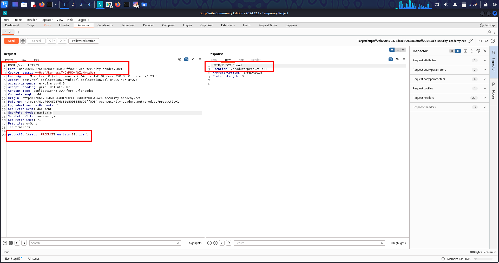

---

## 🔹 Real-World Scenarios (100% COMPLETE – NO GAPS)

### 1️⃣ Client-Side Price Control (Most Common)

Prices sent via:

- `POST /cart`
- `POST /checkout`

📌 Impact:

- Free purchases
- Discount abuse
- Revenue loss

---

### 2️⃣ Mobile App API Abuse

Mobile APIs often send:

- price
- total
- discount

📌 Impact:

- API tampering
- Scalable abuse
- No UI limitations

---

### 3️⃣ Currency Manipulation

Example:

```
price=100
currency=USD → change to weaker currency
```

📌 Impact:

- Pay far less than intended
- Accounting inconsistencies

---

### 4️⃣ Quantity × Price Logic Flaws

Example:

```
quantity=999
price recalculated incorrectly
```

📌 Impact:

- Bulk items for free
- Inventory abuse

---

### 5️⃣ Coupon + Price Chain Abuse

- Price lowered manually
- Coupon applied afterward

📌 Impact:

- Negative totals
- Store credit generation

---

### 6️⃣ Refund Abuse After Price Manipulation

- Buy item cheaply
- Refund at original price

📌 Impact:

- Unlimited money creation

---

### 7️⃣ Third-Party Payment Integration Issues

Mismatch between:

- Application price
- Payment gateway price

📌 Impact:

- Partial payments
- Payment bypass

---

## 🔹 High-Value Parameters to Always Test

Critical parameters:

- price
- total
- amount
- subtotal
- discount
- coupon
- currency
- quantity
- shipping_cost
- tax

🔴 If any are client-controlled → **critical severity**

---

## 🔹 Multi-Chain Attacks (Real Hacker Paths)

### Chain 1 – Direct Loss

```
Price manipulation
→ Free purchase
→ Financial loss
```

---

### Chain 2 – Infinite Money

```
Price manipulation
→ Purchase
→ Refund
→ Balance increases
→ Repeat
```

---

### Chain 3 – Coupon + Price Abuse

```
Lower price
→ Apply coupon
→ Negative checkout total
→ Credit issued
```

---

### Chain 4 – Logic → Account Takeover

```
Free premium upgrade
→ Premium access
→ Sensitive data exposure
```

---

## 🔹 Why This Is Hard to Detect

- No errors
- No crashes
- Valid workflows
- Looks normal

Automated scanners ❌  
Manual logic testing ✅

---

## 🔹 Remediation (Developer Fix)

### ✅ Correct Fixes

- Calculate prices server-side only
- Ignore client-supplied price values
- Recalculate cart during checkout
- Validate totals against database
- Enforce strict business rules

---

### ❌ Never

- Trust frontend prices
- Accept POSTed totals
- Assume users follow UI flow
- Rely on JavaScript validation

---

## 🔹 Extra Notes / Pentest Gold

🧠 **Golden Rule**

> If the client controls money, the attacker controls the business.

🔥 **Red Flags**

- `price` parameter in requests
- `total` sent from frontend
- No server-side recalculation
- UI/backend mismatch

📌 Classification:

- OWASP A04 – Insecure Design
- Severity: High → Critical

---

## 🧠 One-Line Memory Hook

> Business logic bugs don’t break code — they break companies.

---

# Lab-2 🛡️ Business Logic Vulnerability – Flawed 2FA Logic
## (Complete & Real-World)

---

## 🔹 Overview

Flawed 2FA logic vulnerabilities occur when an application implements multi-factor authentication but fails to correctly bind the OTP to the **right user, session, or authentication flow**.

Instead of attacking cryptography, attackers exploit **logic assumptions** made by the application.

**Impact includes:**
- Account takeover
- Authentication bypass
- Privilege escalation

This vulnerability is **extremely common** in custom-built authentication systems.

---

## 🔹 What Is This Topic?

This is a **Business Logic / Insecure Design** vulnerability.

**Core mistake:**

> The application trusts client-controlled identity parameters during 2FA.

In flawed 2FA implementations:
- OTP is generated
- OTP is verified
- ❌ OTP is NOT securely bound to:
  - The correct user
  - The correct session
  - The correct authentication step

⚠️ If identity can be controlled by the client, **2FA provides zero security**.

---

## 🔹 Lab Walkthrough (Clear & Exact)

### 🎯 Objective

Authenticate as **carlos** without knowing his password by abusing flawed 2FA logic.

---

### 1️⃣ Observe Normal Authentication Flow

- Login using valid credentials:

  - **Username:** wiener  
  - **Password:** peter

- Server flow:
  - `POST /login`
  - Redirect → `/login2`

- Observe parameters used during 2FA:
  - `verify`
  - `mfa-code`

📌 Purpose: understand how OTP generation and verification works.

---

### 2️⃣ Generate OTP for Victim User

- Log out from the application
- Manually access:

  `GET /login2?verify=carlos`

**Result:**
- Server generates an OTP for **carlos**
- No authentication required ❌

📌 Critical flaw: OTP generation depends solely on a client-controlled parameter.

---

### 3️⃣ Start Legitimate Login as Attacker

- Login again as:

  - **Username:** wiener  
  - **Password:** peter

- Reach the OTP verification step
- Submit any random OTP
- Intercept the request:

  `POST /login2`

---

### 4️⃣ Brute-Force OTP for Victim

- Send the intercepted request to Intruder
- Configure payloads:

  - `verify=carlos` (fixed)
  - `mfa-code=§000000§`

- Payload range:
  - `000000` → `999999`

- Start attack

---

### 5️⃣ Identify Successful Authentication

Success indicators:
- HTTP 302 redirect
- Different response length
- Access to victim account

Open successful request → authenticated as **carlos**.

---

### 6️⃣ Complete the Lab

- Access **My Account**
- Confirm victim login

✅ **Lab solved**

---

## 🔹 Evidence (SS)

### Screenshot-1
- 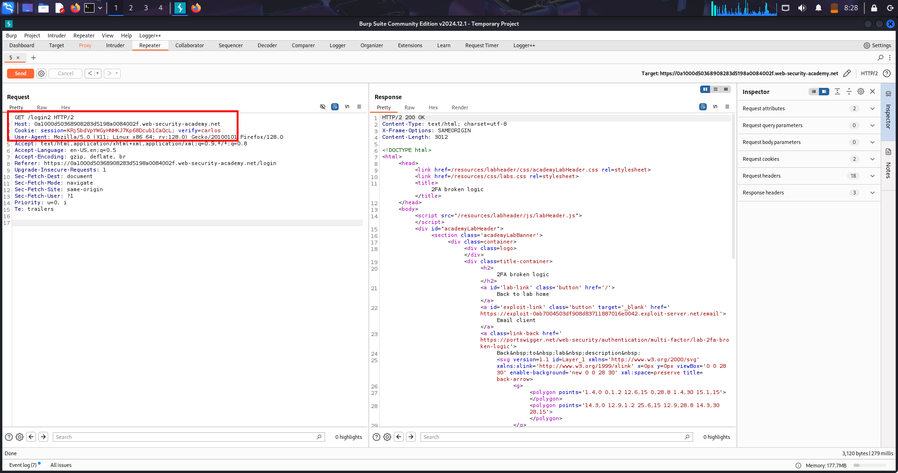

  ### Screenshot-2
- 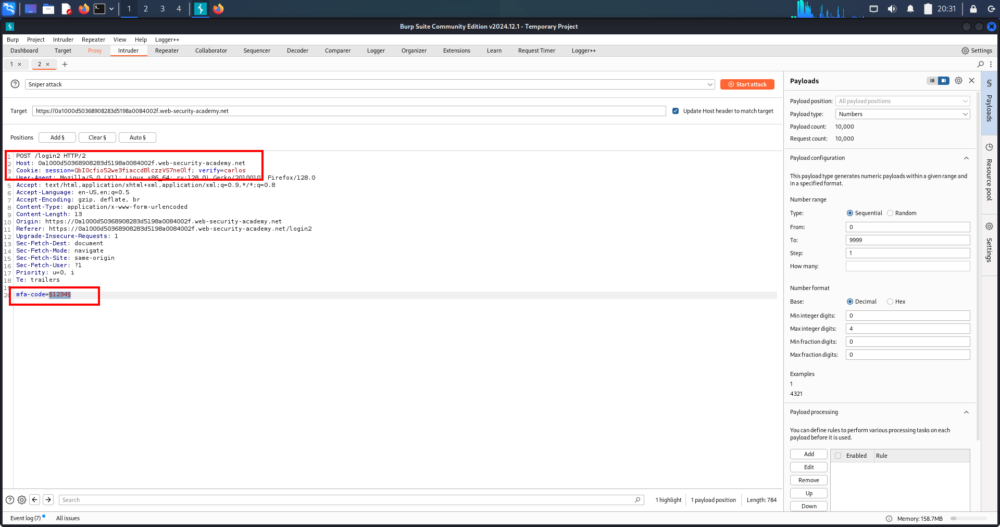

---

## 🔹 Real-World Scenarios (NO SKIPS)

### 1️⃣ OTP User Binding Failure
- OTP tied to `verify=username`
- Attacker modifies parameter

**Impact:** account takeover

---

### 2️⃣ OTP Brute Force (No Rate Limiting)
- Unlimited OTP attempts

**Impact:** full authentication bypass

---

### 3️⃣ OTP Reuse
- OTP remains valid after use

**Impact:** replay attacks

---

### 4️⃣ OTP Session Confusion
- OTP generated in one session
- Used in another

**Impact:** cross-session takeover

---

### 5️⃣ Password Reset OTP Misbinding
- OTP not bound to email/user

**Impact:** reset victim password

---

### 6️⃣ Debug / Test OTPs
- Static OTPs like `000000`

**Impact:** universal bypass

---

### 7️⃣ Frontend-Only OTP Validation
- Backend never validates OTP

**Impact:** direct API bypass

---

### 8️⃣ OAuth / SSO 2FA Bypass
- 2FA enforced at IdP only

**Impact:** login without second factor

---

## 🔹 High-Value Endpoints to Test

- `/login`
- `/login2`
- `/verify`
- `/otp`
- `/mfa`
- `/2fa`
- `/reset`

🔴 Any **user-controlled identity parameter** = critical risk.

---

## 🔹 Multi-Chain Attacks

### Chain 1
- OTP misbinding  
→ OTP brute force  
→ Account takeover

---

### Chain 2
- OTP bypass  
→ Password reset  
→ Permanent takeover

---

### Chain 3
- XSS  
→ OTP/session theft  
→ Privilege escalation

---

## 🔹 Remediation (Correct Fix Only)

### ✅ Proper Fixes
- Bind OTP to **user + session + step**
- Enforce strict rate limiting
- Single-use OTPs
- Regenerate session after auth
- Enforce 2FA on sensitive actions

---

### ❌ Never
- Trust `verify` parameters
- Separate OTP generation & verification
- Allow OTP reuse
- Rely on frontend validation

---

## 🔹 Extra Notes (Exam + Pentest)

**Golden Rule:**

> OTP without binding is not authentication.

**Red Flags:**
- `verify=username`
- Public OTP endpoints
- No rate limiting
- Same OTP works twice

**Severity:**
- OWASP A04 – Insecure Design
- High → Critical

---

## 🧠 One-Line Memory Hook

> 2FA fails not when OTP is weak — but when logic is weak.

---

# Lab-3 🧠 Failing to Handle Unconventional Input
## (Business Logic Vulnerability – Complete & Real-World)

---

## 🔹 Overview

Failing to handle unconventional input is a business logic vulnerability where an application does not correctly validate unexpected, edge-case, or abnormal user input.

The application behaves “as designed”, but the **design assumptions are flawed**.

Instead of exploiting technical bugs, attackers exploit:
- Math
- Assumptions
- Workflow logic

This vulnerability is extremely common in systems involving:
- Payments
- Store credit
- Orders & refunds
- Loyalty points
- Booking systems

📌 Often leads directly to **financial loss**.

---

## 🔹 What Is This Topic?

This topic focuses on **broken assumptions** about user input.

Developers assume:
- Numbers will be positive
- Values will be reasonable
- Users will follow the UI
- Frontend validation is enough

**Core mistake:**

> The server does not enforce strict boundaries on numeric or logical input.

Because business logic is custom:
- Automated scanners ❌ miss it
- Manual testing ✅ finds it
- Impact is usually **high to critical**

---

## 🔹 Lab Walkthrough
### (Negative Quantity Jacket Lab)

### 🎯 Goal

Purchase a **$1337 Leather Jacket** using **$100 store credit** by abusing unconventional numeric input.

---

### 1️⃣ Intended Workflow Recon

1. Login as:
   - `wiener : peter`

2. Browse products  
3. Attempt to buy expensive item normally  

❌ Checkout fails due to insufficient credit  
✔️ Confirms server checks **final total only**

---

### 2️⃣ Identify User-Controlled Logic Parameter

1. Intercept request:
   - `POST /cart`

2. Observe parameter:
   - `quantity`

⚠️ Quantity is **fully trusted by backend**

---

### 3️⃣ Inject Unconventional Input

Modify parameter:
- `quantity = -41`

Forward request.

✔️ Cart total becomes **negative**  
➡️ Validation missing  
➡️ Logic flaw confirmed

---

### 4️⃣ Weaponize the Math

Cheap item price:
- `$32.45`

Calculation:
- `-41 × 32.45 = -1330.45`

✔️ Cart total heavily negative

---

### 5️⃣ Add Expensive Item

1. Add **Leather Jacket ($1337)** normally

Server calculation:
- `-1330.45 + 1337 = 6.55`

✔️ Final total:
- Greater than `$0`
- Less than `$100` store credit

---

### 6️⃣ Checkout

Server validates only:
- `final_total ≤ store_credit`

✔️ Purchase succeeds  
✔️ Jacket bought for **$6.55**

✅ **Lab solved**

---

## 🔹 Evidence (SS)

### Screenshot-1
- 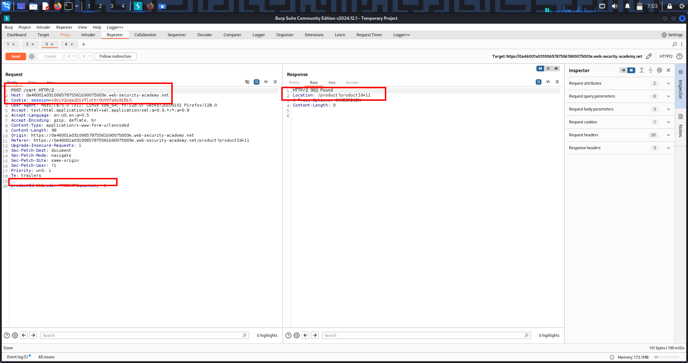

### Screenshot-2  
- 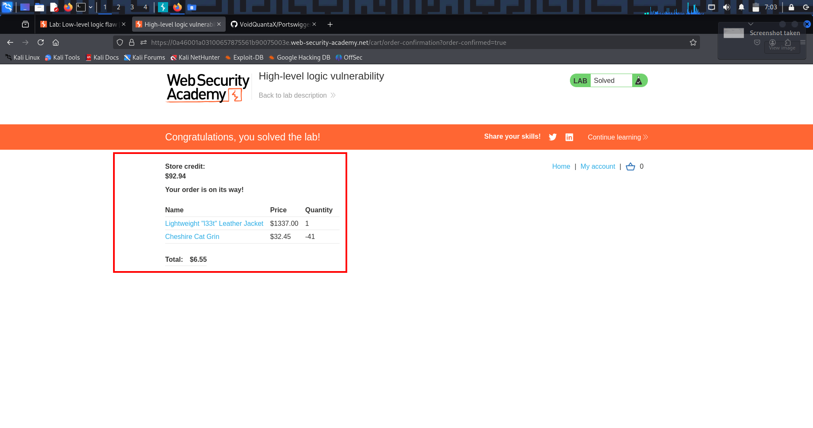

---

## 🔹 Real-World Scenarios
### (NO SCENARIOS SKIPPED)

---

### 1️⃣ Negative Quantity Purchases

**Bug:**
- Only checks `quantity ≤ stock`

**Exploit:**
- `quantity = -10`
- Total becomes negative

📌 Impact: free items / credit gain

---

### 2️⃣ Negative Funds Transfer

**Bug:**
- Only checks `amount ≤ balance`

**Exploit:**
- `amount = -1000`
- Balance increases

---

### 3️⃣ Client-Side Price Trust

**Bug:**
- Price accepted from client

**Exploit:**
- `price = 1`
- Premium item cheap

---

### 4️⃣ Quantity Overflow

**Bug:**
- No upper bounds

**Exploit:**
- `quantity = 999999999`
- Integer overflow / free items

---

### 5️⃣ Negative Discount Abuse

**Bug:**
- Discount not bounded

**Exploit:**
- `discount = -100`
- Checkout adds money

---

### 6️⃣ Refund Logic Abuse

**Bug:**
- Only checks `refund ≤ paid`

**Exploit:**
- `refund = -500`
- Merchant charged

---

### 7️⃣ Loyalty / Reward Abuse

**Bug:**
- Points not validated

**Exploit:**
- `points = -1000`
- Points credited

---

### 8️⃣ Date / Time Logic Abuse

**Bug:**
- No date comparison

**Exploit:**
- End < Start
- Negative booking cost

---

### 9️⃣ Shipping Cost Manipulation

**Bug:**
- Client-supplied shipping

**Exploit:**
- `shipping = -50`
- Total reduced

---

### 🔟 Inventory Inflation

**Bug:**
- Quantity trusted on cancel

**Exploit:**
- Cancel with `quantity = -100`
- Inventory increases

---

## 🔹 High-Value Endpoints to Test

- `POST /cart`
- `POST /checkout`
- `POST /order`
- `POST /refund`
- `POST /transfer`
- `POST /redeem`
- `POST /apply-coupon`
- `POST /booking`
- `POST /cancel`

🔴 Any endpoint that processes numbers = **high risk**

---

## 🔹 Multi-Chain Attacks

### Chain 1
Negative quantity  
→ Free purchase  
→ Refund abuse  
→ Unlimited balance

---

### Chain 2
Logic flaw  
→ IDOR on cart  
→ Financial theft

---

### Chain 3
Race condition  
→ Double spend  
→ Negative balance abuse

---

### Chain 4
Logic bug  
→ Invoice manipulation  
→ Stored XSS  
→ Account takeover

---

## 🔹 Remediation (Correct Fix Only)

### ✅ Required Defenses
- Reject negative values
- Enforce upper & lower bounds
- Recalculate totals server-side
- Validate **per item**, not just final total

### ❌ Never
- Trust frontend validation
- Trust client-supplied math
- Assume users behave normally

---

## 🔹 Extra Notes (Exam + Bug Bounty)

**Golden Rule:**

> If math is client-controlled, money is attacker-controlled.

**Always test with:**
- `-1`
- `0`
- `1`
- Very large numbers

📌 Severity:
- OWASP A04 – Insecure Design
- High → Critical

---

## 🧠 One-Line Memory Hook

> Logic bugs don’t break the app — they break the business.

---

# Lab-4 🧠 Failing to Handle Unconventional Input
## High Integer Value / Integer Overflow — Business Logic Vulnerability

---

## 🔹 Overview

Failing to handle unconventional input is a *business logic vulnerability* where an application does not correctly validate or constrain extreme numeric values supplied by the client.

Instead of crashing, the application:

- Accepts the value  
- Performs arithmetic operations  
- Triggers an integer overflow  
- Continues execution using an incorrect result  

📌 This is *not* a technical exception or crash  
📌 This is a *logic failure* that directly enables financial abuse

Integer overflow bugs frequently result in:

- Free or underpriced purchases  
- Wallet balance manipulation  
- Refund abuse  
- Loyalty point inflation  

---

## 🔹 What Is This Topic?

This vulnerability occurs when applications:

- Trust numeric input too much  
- Assume values remain within “reasonable” limits  
- Fail to enforce upper and lower bounds  
- Use unsafe integer arithmetic in business logic  

Commonly affected systems:

- Shopping carts  
- Wallets and balances  
- Refund mechanisms  
- Subscriptions  
- Loyalty and reward programs  
- Booking and reservation systems  

These bugs are:

- ❌ Hard for scanners to detect  
- ❌ Invisible in UI testing  
- ✅ Extremely high impact in real-world systems  

---

## 🔹 Lab Walkthrough
### High Integer Overflow — Cart Logic Abuse

### 🎯 Goal

Purchase an expensive item without sufficient balance by forcing the cart total to overflow into an acceptable value.

---

### Step 1: Establish Normal Behavior

*Purpose:* Confirm that business logic checks exist before attempting to break them.

1. Log in as a normal user  
2. Add an expensive product to the cart  
3. Attempt to checkout  
4. Checkout fails due to insufficient balance  

✔️ Confirms server-side balance validation exists  

---

### Step 2: Identify High-Risk Input

*Purpose:* Locate numeric parameters that influence business decisions.

1. Intercept the request using Burp Suite  
2. Observe the following request:

POST /cart

3. Identify the parameter:

quantity

✔️ Quantity is trusted by the server  
✔️ Quantity directly affects price calculation  

---

### Step 3: Test Basic Validation

*Purpose:* Determine validation boundaries.

Test the following values:

0 -1 99 999

Observed behavior:

- Large values are accepted  
- No upper bound enforced  

✔️ Indicates partial or missing validation  

---

### Step 4: Push Quantity to Extreme Values

*Purpose:* Prepare conditions required for integer overflow.

1. Send the request to Burp Repeater  
2. Increment the quantity aggressively  
3. Observe cart total growth  

📌 This mirrors real-world mobile API abuse patterns  

---

### Step 5: Trigger Integer Overflow

*Internal behavior:*

- Backend uses 32-bit signed integers  
- Maximum integer value is exceeded  
- Arithmetic wraps around  

Result:

- Cart total becomes negative or very small  
- Application continues normal execution  

✔️ Overflow successfully triggered  

---

### Step 6: Controlled Total Adjustment

*Purpose:* Bypass checkout validation logic.

1. Push total just beyond integer limit  
2. Allow overflow to occur  
3. Add or remove items to tune the total  

Target condition:

0 < cart_total ≤ user_balance

✔️ Checkout logic accepts the manipulated total  

---

### Step 7: Complete Checkout

1. Final cart total is positive  
2. Total is less than available balance  
3. Place the order successfully  

✔️ Expensive item purchased at minimal cost  
✔️ Lab successfully completed  

---

## 🌍 Real-World Scenarios

Each scenario shows: *Expected logic → Vulnerability → Exploitation*

---

### 🔹 Scenario 1: Quantity Overflow

*Expected:* Quantity has strict upper bounds  
*Bug:* No maximum enforced  

*Exploit:*
1. Set quantity to extreme value  
2. Total overflows  
3. Item purchased cheaply  

---

### 🔹 Scenario 2: Price × Quantity Overflow

*Expected:* Safe multiplication  
*Bug:* Unsafe integer arithmetic  

*Exploit:*
1. High price × high quantity  
2. Overflow occurs  
3. Total wraps  

---

### 🔹 Scenario 3: Wallet Credit Abuse

*Expected:* Total must remain positive  
*Bug:* Negative total allowed  

*Exploit:*
1. Overflow creates negative total  
2. Wallet credited instead of charged  

---

### 🔹 Scenario 4: Refund Overflow

*Expected:* Refund ≤ amount paid  
*Bug:* Overflow unchecked  

*Exploit:*
1. Submit large refund value  
2. Balance credited  

---

### 🔹 Scenario 5: Discount + Overflow Chain

*Expected:* Discounts validated  
*Bug:* Discount applied after overflow  

*Exploit:*
1. Overflow → negative total  
2. Discount applied  
3. User receives credit  

---

### 🔹 Scenario 6: Subscription Abuse

*Expected:* Fixed subscription cost  
*Bug:* Duration or quantity overflow  

*Exploit:*
1. Supply large duration  
2. Overflow  
3. Free premium access  

---

### 🔹 Scenario 7: Loyalty Points Inflation

*Expected:* Points capped  
*Bug:* No upper bound  

*Exploit:*
1. Overflow during calculation  
2. Massive points credited  

---

### 🔹 Scenario 8: Booking Cost Manipulation

*Expected:* Cost ≥ 0  
*Bug:* Duration × rate overflow  

*Exploit:*
1. Extreme duration  
2. Negative cost  
3. Free booking  

---

### 🔹 Scenario 9: Inventory Inflation

*Expected:* Stock decreases safely  
*Bug:* Overflow on quantity  

*Exploit:*
1. Cancel order with huge quantity  
2. Stock increases  

---

### 🔹 Scenario 10: Tax / Shipping Overflow

*Expected:* Calculated server-side safely  
*Bug:* Overflow not validated  

*Exploit:*
1. Overflow reduces tax or shipping  
2. Final total minimized  

---

## 🎯 High-Value Endpoints

Endpoints commonly affected by integer overflow logic:

POST /cart POST /checkout POST /refund POST /wallet POST /redeem POST /apply-discount POST /subscription POST /booking

---

## 🔗 Multi-Chain Attacks

Integer overflow frequently chains with:

- IDOR (modifying other users’ carts)  
- Race conditions (double spending)  
- CSRF (forced overflow actions)  
- Wallet abuse  
- Refund abuse  

---

## 🛡️ Remediation

### ✅ Secure Fixes

- Enforce strict upper and lower bounds  
- Use safe integer types  
- Detect and prevent overflow  
- Recalculate all totals server-side  
- Validate each item independently  

### ❌ Never Do

- Trust frontend validation  
- Trust client-supplied totals  
- Assume values remain reasonable  

---

## 🧠 Extra Notes

- Always test extreme numeric values  
- UI limits are meaningless  
- Overflow bugs are *money bugs*  
- Frequently rewarded in bug bounties  

---

## 🔑 Final Takeaway

> When large numbers influence business decisions, integer overflow becomes a security vulnerability — not a math mistake.

---

# Lab-5 🧠 Failing to Handle Unconventional Input
## Input Truncation & Inconsistent Validation — Business Logic Vulnerability

---

## 🔹 Overview

Failing to handle unconventional input occurs when an application processes user input inconsistently across different system layers, often due to silent truncation caused by backend storage limits.

In such cases, the application may:

- Accept overly long input  
- Silently truncate it at the database layer (e.g., VARCHAR limits)  
- Perform authentication or authorization using the truncated value  
- While other systems rely on the full, unmodified input  

📌 The vulnerability lies in *system disagreement*, not a single bug  
📌 Result is often *authorization bypass without owning a trusted identity*

---

## 🔹 What Is This Topic?

### Core Concept

Inconsistent input handling across system boundaries.

Specifically:

- Client submits long identifiers (email / username)  
- Backend database truncates input silently  
- Authorization logic trusts the truncated value  
- Attacker controls truncation boundaries  

This is *NOT*:

- SQL Injection  
- XSS  
- Password bypass  

This *IS*:

- Business logic flaw  
- Input length & truncation vulnerability  
- Authorization bypass via malformed identity  

---

## 🔹 Lab Walkthrough
### Input Truncation — Authorization Logic Abuse

---

### Step 1: Recon & Authorization Model Discovery

1. Locate the admin endpoint:

/admin

2. Attempt access as a normal user  

3. Access denied with message indicating:

> Only users from dontwannacry.com allowed

📌 Key observation:

- Authorization is *email-domain based*
- Not role-based
- Not permission-based  

This is a logic weakness.

---

### Step 2: Understand the Registration Architecture

Two independent systems are involved:

#### 1️⃣ Email Delivery System

- Uses full email string  
- No truncation  
- Sends confirmation email to full address  

#### 2️⃣ Application Server + Database

- Stores email in a fixed-length column  
- Truncates input silently  
- Uses stored value for authorization  

⚠️ These systems enforce *different constraints*

---

### Step 3: Why Long Input Is Required

Registering directly as:

user@dontwannacry.com

fails because:

- Attacker does not control the domain  
- Confirmation email cannot be received  

Therefore, attacker must:

- Receive email at attacker-controlled domain  
- Appear as dontwannacry.com *after truncation*

➡️ Long input is the only way to satisfy both systems.

---

### Step 4: Identify Truncation Behavior

Register using an intentionally long email:

[very-long-local-part]@attacker-domain.web-security-academy.net

Observed behavior:

- Email delivery succeeds  
- Stored email is silently truncated  

Confirms:

- Truncation exists  
- Max length enforced at storage layer  
- No validation error is thrown  

---

## 🧾 Evidence: Long Input Accepted

### Screenshot-1
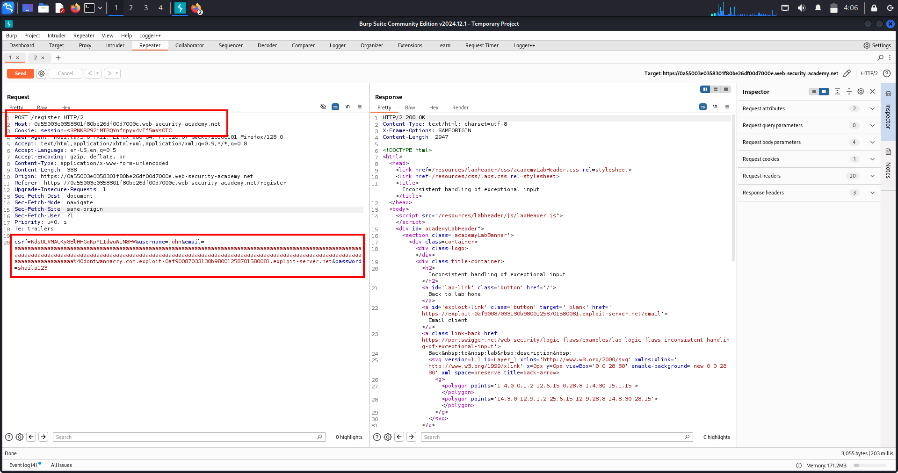

### Screenshot-2
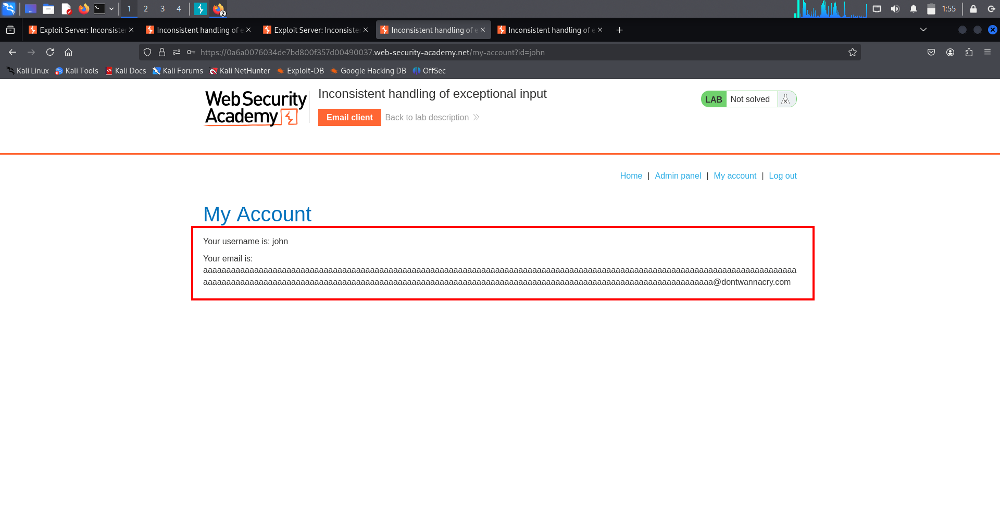

---

### Step 5: Precision Exploit Construction

Craft email as:

[padding-to-boundary]@dontwannacry.com.attacker-domain.web-security-academy.net

System interpretation:

- Email system → full address → attacker receives email  
- Database → truncates after dontwannacry.com  

Final stored value:

user@dontwannacry.com

✔️ Authorization logic now treats attacker as internal user

---

### Step 6: Exploit Result

1. Log in using confirmed account  
2. Access:

/admin

3. Perform privileged action (e.g., delete user)

✔️ Authorization bypass achieved  
✔️ Lab solved  

---

## 🌍 Real-World Scenarios

---

### 🔹 Scenario 1: Legacy Databases

- VARCHAR(255) fields  
- Old ORMs  
- Silent truncation  

📌 Extremely common in enterprise systems

---

### 🔹 Scenario 2: Email-Domain-Based Authorization

- Admin panels  
- Internal dashboards  
- Employee-only portals  

📌 Domain ≠ identity

---

### 🔹 Scenario 3: Microservices Mismatch

- Auth service validates full input  
- Application service truncates stored value  

📌 Cross-service trust failure

---

### 🔹 Scenario 4: SSO + Local User Storage

- SSO trusts full email  
- Local DB truncates  
- Authorization performed locally  

📌 Common in hybrid auth systems

---

## ❌ What Does NOT Happen in Real Applications

- Infinite cart loops  
- UI-only validation bugs  
- Completely uncontrolled storage overflow  

📌 Real vulnerabilities are subtle and assumption-based

---

## 🎯 High-Value Targets

Endpoints to prioritize:

/admin /internal /dashboard /manage /staff /ops /support

Features involving:

- Email-based roles  
- Domain allowlists  
- “Employees only” logic  

---

## 🔗 Multi-Chain Attacks

This vulnerability often escalates into:

- Admin access → account takeover  
- Admin access → stored XSS  
- Admin access → password reset abuse  
- Admin access → SSRF / RCE  

📌 Logic flaws compound rapidly

---

## 🛡️ Remediation

### ✅ Correct Defenses

- Validate length *before* storage  
- Canonicalize input prior to validation  
- Never authorize by email domain  
- Use RBAC / permission models  
- Fail hard on truncation  

### ❌ Never

- Rely on database limits as validation  
- Trust identity strings for authorization  

---

## 🧠 Extra Notes

- Precision matters more than brute force  
- Character counting is critical  
- Always test boundary lengths  

Without Burp Pro:

- Register  
- Log in  
- Inspect profile  
- Observe truncation visually  
- Adjust length iteratively  

---

## 🔑 Final Reality Check

❌ Servers do not “plan” truncation  
✅ Truncation is inherited from storage limits  

❌ Developers expect consistency  
✅ Attackers exploit mismatches  

> This vulnerability exists because systems disagree — not because code crashes.

---

# Lab-6 🧠 Business Logic Vulnerability – Inconsistent Authorization Enforcement
## (Privilege Escalation via Post-Registration Email Update)

---

## 🔐 Overview

This lab demonstrates a *business logic vulnerability* caused by inconsistent authorization enforcement.

The application performs a trust check *only once* (during registration) and then assumes the user remains trustworthy forever.  
Because of this flawed assumption, later actions that affect authorization are *not revalidated*.

As a result, a normal authenticated user can escalate privileges to *admin* without exploiting any technical vulnerability.

Root cause:  
*Authorization logic applied at the wrong time*

---

## 📘 What Is This Topic?

This issue belongs to *Business Logic / Insecure Design*, not technical vulnerabilities.

### Core Principle

> Security decisions must be enforced continuously, not just once.

### Developer Assumptions

- Registration = permanent trust  
- Logged-in users = safe  
- Profile updates = harmless  

### Attacker Reality

- Identity data is mutable  
- Trust is reused incorrectly  
- Authorization depends on user-controlled fields  

### Key Mistake

- Authorization depends on *mutable identity data*
- Checks are *not repeated* when that data changes

---

## 🧪 Lab Walkthrough (Clean & Generalized)

### Step 1️⃣ Registration

The application states:

> “If you work for DontWannaCry, use your company email.”

- Register using a *normal email* (PortSwigger email client)
- Account created successfully

*State:*
- Role: normal user
- Admin access: ❌ denied

---

### Step 2️⃣ Login

- Log in with the registered credentials
- Attempt to access:

/admin

*Result:*
- ❌ Access denied

✔️ Confirms admin access is restricted  
✔️ Authorization enforced at this stage  

---

### Step 3️⃣ Update Email (Core Logic Flaw)

On *My Account, an **Update Email* feature is available.

Change email to:

xyz@dontwannacry.com

#### ❌ Application Assumption

> “This user already passed checks during registration.”

#### ❌ What Fails

- No revalidation of domain ownership
- No authorization check on identity change
- Updated value is blindly trusted

*This is the vulnerability.*

Authorization logic is *skipped* when identity data changes.

---

### Step 4️⃣ Access Admin Panel

Revisit:

/admin

*Result:*
- ✔️ Access granted

The application now believes:

> “User belongs to trusted domain → admin allowed”

---

### Step 5️⃣ Lab Completion

- Delete user *carlos*

✔️ Admin action successful  
✔️ Lab solved  

---

## 🧾 Evidence

### Evidence 1️⃣ – Privilege Escalation via Email Update

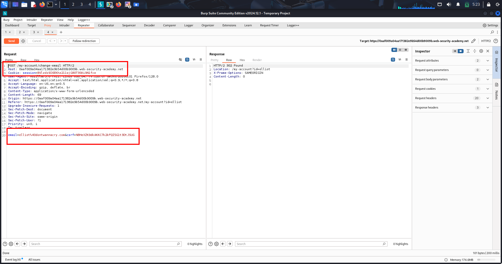

---

## 🌍 Real-World Scenarios

### Scenario 1️⃣ Company Email Trust

- Email domain checked only at signup
- Email update allowed without validation
- Attacker switches to @company.com
- Gains internal/admin access

---

### Scenario 2️⃣ Role Upgrade via Profile Update

- Role validated at login
- Profile update endpoint allows role/identity change
- No server-side recheck
- Privilege escalation

---

### Scenario 3️⃣ Trusted Session Assumption

- User verified once
- Sensitive actions skip authorization
- Assumption: “User already proved identity”
- Leads to staff/admin access

---

## 🎯 High-Value Endpoints

Always audit carefully:

/my-account /update-email /profile /settings /user/update /change-role /admin

🔴 Especially dangerous if they:
- Modify identity data
- Influence authorization
- Are assumed safe after login

---

## 🔗 Multi-Chain Attacks

Typical attack chain:

1. Normal registration
2. Legitimate login
3. Profile update (identity change)
4. Authorization bypass
5. Admin access

### Real-World Chains

- Profile update + weak auth → privilege escalation
- IDOR + trusted user assumption
- Logic flaw → admin panel compromise

---

## 🛡️ Remediation (Correct Fixes)

### ✅ Proper Security Design

- Revalidate authorization on *every sensitive action*
- Never trust client-controlled identity fields
- Enforce server-side authorization on every request
- Separate identity from privilege

Email ≠ role Domain ≠ admin

Use RBAC / permission systems.

---

## 📝 Extra Notes / Pentest Tips

❌ Not SQL Injection  
❌ Not brute force  
❌ Not a technical bypass  

✅ Pure business logic abuse  

### Exam / Interview Line

> “Authorization must be enforced at every point where trust can change.”

### Pentester Mindset

Whenever you see:
- “Only employees can…”
- “Only admins can…”
- “Verified users can…”

Always ask:

> “Can I change something after login that affects this check?”

---

## 🔑 Final Takeaway

> Trust that is not continuously verified will always be exploited.

---

# Lab-7 🐞 Business Logic Vulnerability – Users Won’t Always Supply Mandatory Input
# (Password Change Logic Flaw – Identity Manipulation)

---

## 🔹 Overview

This business logic vulnerability occurs when an application assumes that users will always supply mandatory input fields.

In reality, attackers can intercept and manipulate HTTP requests to:

- Remove required parameters entirely
- Modify identity-related values
- Force unintended logic paths

When backend validation is weak or missing, sensitive actions may execute without proper verification.

### Impact:
- Account takeover
- Privilege escalation
- Full administrative compromise

This flaw is extremely common in real-world systems that rely on frontend enforcement.

---

## 🔹 What Is This Topic?

This is a *Business Logic vulnerability*, not a technical flaw like SQLi or XSS.

### Core mistake:

> Required fields are enforced by the UI, not the server.

Browsers enforce:
- Required inputs
- Field constraints

Attackers:
- Do not use browsers
- Send raw HTTP requests
- Remove parameters completely

If the server does not *strictly enforce mandatory input*, security controls silently fail.

---

## 🔹 Lab Walkthrough (Simple & Clear)

### 1️⃣ Login as a Normal User

Credentials:

wiener : peter

You are authenticated as a low-privileged user.

No admin access is available.

---

### 2️⃣ Navigate to Password Change Functionality

The normal password change request contains:

username=wiener current-password=peter new-password=** confirm-password=**

The application assumes current-password is mandatory.

---

### 3️⃣ Remove Mandatory Input (Logic Flaw Trigger)

Intercept the request and *remove the current-password parameter entirely*.

Modified request:

username=wiener new-password=test123 confirm-password=test123

Result:
- ✅ Password change succeeds
- ❌ No current password verification

This confirms a logic flaw.

---

### 4️⃣ Modify Identity Parameter (Privilege Escalation)

Change:

username=wiener

To:

username=administrator

Keep current-password removed.

Final malicious request:

username=administrator new-password=admin123 confirm-password=admin123

---

### 5️⃣ Send the Request

The server accepts the request.

- Administrator password is changed
- No admin authentication performed

---

### 6️⃣ Admin Login & Lab Completion

Login as:

administrator : admin123

Access:

/admin

Delete user:

carlos

✅ Lab solved

---

## 🔹 Evidence

### Screenshot-01
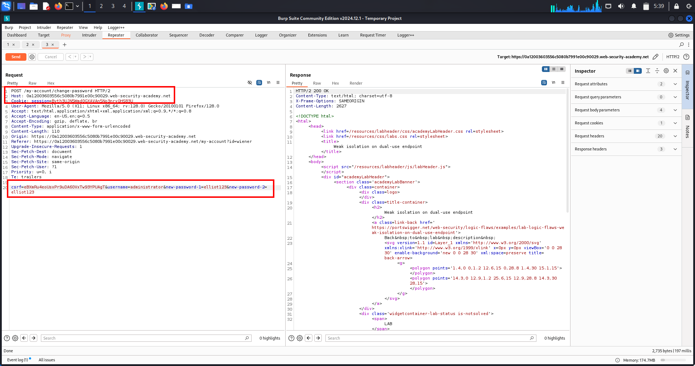

---

## 🔹 Real-World Scenarios

### 1️⃣ Password Change Without Current Password (MOST COMMON)

Frontend enforces current password  
Backend does not validate presence  

*Impact:*
- Account takeover
- Credential abuse

---

### 2️⃣ Client-Controlled Identity Fields

Endpoints accept:
- username
- userId
- email

*Impact:*
- Password reset for other users
- Privilege escalation

---

### 3️⃣ Mobile & API Applications

JSON requests allow missing keys  
Backend applies default logic  

*Impact:*
- Mass account takeover via automation

---

### 4️⃣ Enterprise / Internal Portals

Profile update endpoints weakly validated  

*Impact:*
- Admin account compromise
- Internal system takeover

---

### 5️⃣ Banking & FinTech Systems

UI enforces required fields  
Backend trusts request structure  

*Impact:*
- Unauthorized password resets
- Financial fraud

---

### 6️⃣ University / Education Portals

Shared logic for students and staff  

*Impact:*
- Grade manipulation
- Sensitive data exposure

---

### 7️⃣ SaaS Platforms

Single endpoint handles multiple roles  

*Impact:*
- Admin takeover
- Tenant compromise

---

## 🔹 High-Value Endpoints to Always Test
```
/my-account
/change-password 
/reset-password 
/update-profile 
/account/settings 
/user/update 
/admin/update-user
/api/user/update
```

🔴 Any endpoint modifying identity or credentials is high risk.

---

## 🔹 Multi-Chain Attacks

### Chain 1 (Classic)

Missing mandatory parameter → Identity manipulation → Password reset → Admin access → Full takeover

---

### Chain 2 (Logic + IDOR)

Missing validation → Modify userId → Change another user’s password → Account takeover

---

### Chain 3 (Logic + Automation)

API accepts missing fields → Scripted requests → Mass password resets

---

## 🔹 Remediation

✔ Enforce mandatory input server-side  
✔ Reject requests with missing required fields  
✔ Explicitly verify current password  
✔ Enforce authorization on identity changes  
✔ Restrict users to modifying only their own accounts  

---

## ❌ Never

- Rely on frontend validation
- Assume parameters will always exist
- Trust client-supplied identity values

---

## 🔹 Extra Notes (Exam + Bug Bounty)

### Golden Rule

> If a parameter is mandatory in the UI, remove it and test the backend.

### Red Flags

- Requests succeed without required fields
- Identity fields in request body
- Same endpoint works across roles

Severity:

High → Critical

Category:

Pure Business Logic

---

## 🧠 One-Line Memory Hook

> If the server doesn’t enforce mandatory input, the attacker decides what is mandatory.

---

# Lab-8 🐞 Password Reset Vulnerability – Token Validation Bypass
(Logic Flaw – Missing Token Enforcement)

---

## 🔐 Overview

This lab demonstrates a *password reset business logic vulnerability* where the application generates a reset token but fails to enforce its validation during password submission.

The backend assumes that if a reset request reaches the endpoint, the token must already be valid. Because of this flawed assumption, the token can be removed entirely without affecting the reset process.

As a result, an attacker can reset *any user’s password*, leading to full account takeover.

This is a *critical real-world vulnerability* and commonly exploited in production systems.

---

## 📘 What Is This Topic?

This issue falls under:

* Broken Authentication
* Business Logic Vulnerabilities

### Core Mistake

> The application assumes token presence implies token validity.

### Reality

* Tokens exist but are *not enforced*
* Server trusts *client-controlled parameters*
* Identity is determined by mutable request values

Attackers do not break encryption —  
they exploit *missing verification logic*.

---

## 🧪 Lab Walkthrough (Step-by-Step)

### Step 1: Access Password Reset

* Logged in as wiener
* Navigated to *Forgot Password*
* Requested a password reset

---

### Step 2: Open Reset Link

* Opened the email client
* Clicked the password reset link
* Redirected to password reset form

---

### Step 3: Intercept Reset Request

Intercepted the password submission request in Burp:

* Token present in URL
* Token present in request body
* Username included as a parameter

---

### Step 4: Test Token Validation (Core Flaw)

In Burp Repeater:

* Removed token value from URL
* Removed token value from request body

Result:

* Password reset still succeeds

✅ Confirms token is *not validated server-side*

---

### Step 5: Exploit Identity Control

Modified request:

* Changed:

username=wiener

to:

username=carlos

* Token values remain *empty*

Submitted request.

---

### Step 6: Account Takeover

* Logged in as carlos
* Used the new password
* Access granted

🎯 Lab solved

---

## 🧾 Evidence

* Password reset request succeeds with:
* Empty token (URL + body)
* Modified username

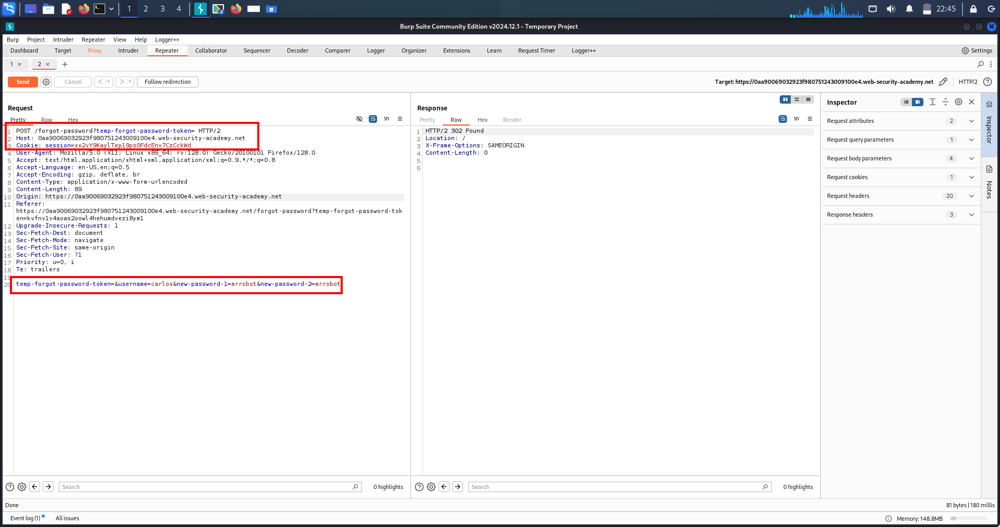

---

## 🌍 Real-World Scenarios

### 1. Token Not Validated (MOST COMMON)

* Token generated but never checked
* Reset endpoint blindly accepts request

*Impact:*
* Any account takeover
* Zero authentication required

---

### 2. Username Controlled by Client

* Username / email sent in hidden field
* Server trusts provided value

*Impact:*
* Attacker resets victim password

---

### 3. Token Checked Only on Page Load

* Token validated on GET request
* NOT validated on POST submission

*Impact:*
* Direct POST bypasses protection

---

### 4. Empty Token Accepted

* Logic checks only for parameter existence
* Empty value treated as valid

*Impact:*
* Token removal bypass

---

### 5. Email = False Security Assumption

* Developers trust email delivery
* Attackers replay requests directly

*Impact:*
* Email protection fully bypassed

---

### 6. Mass Account Takeover

* Flaw is scriptable
* No rate limiting
* No monitoring

*Impact:*
* Entire user base compromise

---

### 7. Privilege Escalation

* Victim may be admin or staff

*Impact:*
* Full system compromise

---

## 🎯 High-Value Endpoints

Always test:

* /forgot-password
* /reset-password
* /password-reset
* /account/recover
* /change-password

### Parameters to Manipulate

* username
* email
* userId
* token
* reset_token
* temp_token

---

## 🔗 Multi-Chain Attacks

### Chain 1: Account Takeover

* Token bypass
* Password reset
* User takeover

---

### Chain 2: Admin Compromise

* Guess admin username
* Reset password
* Admin panel access

---

### Chain 3: Reset + IDOR

* Identify user IDs
* Reset multiple accounts

---

## 🛡️ Remediation

* Enforce strict token validation server-side
* Bind token to:
* User
* Expiration
* Single use
* Reject empty or missing tokens
* Never accept username from client
* Apply rate limiting
* Log and alert reset attempts

---

## ❌ Never Do This

* Accept empty tokens
* Trust hidden fields
* Validate only on page load
* Assume email = authentication

---

## 🧠 One-Line Memory Hook

> A password reset without strict token validation is just an account takeover API.

---

# Lab-9 🐞 Authentication Bypass – 2FA Enforcement Failure (Workflow Bypass)
(Users Won’t Always Follow the Intended Sequence)


---

## 🔹 Overview

This lab demonstrates an authentication logic vulnerability where two-factor authentication (2FA) is enforced only through frontend workflow, not by server-side authorization state.

The application assumes that once a user submits valid credentials, they will always complete the 2FA verification step before accessing protected resources.

However, the backend does not enforce this assumption.

As a result, an attacker with valid credentials can bypass the 2FA verification step entirely by directly navigating to a protected account endpoint.

**📌 Root cause:** Authentication is treated as step-based instead of state-based.


---

## 🔹 What Is This Topic?

This is a **Business Logic / Authentication Workflow** vulnerability.

### Core mistake

> The application trusts the frontend authentication sequence instead of enforcing authentication state on the server.

### Key concepts involved

* Login is implemented as a sequence of pages
* Backend assumes previous steps were completed
* Protected endpoints do not verify full authentication state

Attackers do not follow workflows.
They directly access endpoints.


---

## 🔹 Lab Walkthrough (Simple & Clear)

### 1️⃣ Login as Attacker (Valid User)

Credentials used:

* Username: `wiener`
* Password: `peter`

Login is successful.


---

### 2️⃣ Complete Legitimate 2FA Once

* 2FA verification code is sent to the email client
* Correct code is submitted
* Full authentication is completed

This step is used only to **observe application behavior**.


---

### 3️⃣ Observe Account Endpoint

After successful authentication, the following endpoint is accessed:

`GET /my-account?id=wiener`

📌 This endpoint:
* Is accessible after login
* Uses a predictable, user-controlled parameter
* Does not include any visible 2FA state validation


---

### 4️⃣ Logout Completely

The attacker logs out to reset the session state.


---

### 5️⃣ Login as Victim (Without Completing 2FA)

Victim credentials:

* Username: `carlos`
* Password: `montoya`

Login succeeds and the application prompts for 2FA verification.


---

### 6️⃣ Bypass 2FA via Direct URL Access

Instead of submitting the 2FA code, the URL is manually changed from:

`GET /login2`

to:

`GET /my-account?id=carlos`


---

### 7️⃣ Access Granted Without 2FA

✔️ Victim account page loads  
❌ 2FA verification never completed  
❌ Server did not enforce authentication state  

**→ Lab solved**


---

## 🔹 Evidence

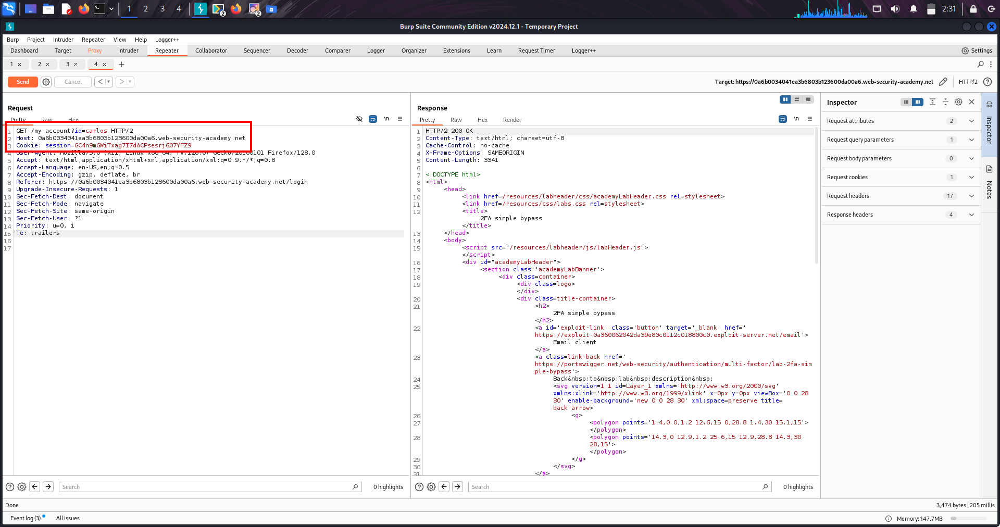


---

## 🔹 Real-World Scenarios (COMPLETE – NO SKIPS)

### 1️⃣ Direct Endpoint Access Bypassing 2FA (MOST COMMON)

* Username/password verified
* 2FA page displayed
* Backend does not restrict protected endpoints

📌 **Impact:** Full account takeover


---

### 2️⃣ ID-Based Account Pages

Examples:

* `/my-account?id=user`
* `/profile?userId=123`

📌 **Impact:** Account access without completing authentication


---

### 3️⃣ Banking & FinTech Applications

* OTP step shown
* Session already considered authenticated

📌 **Impact:** Unauthorized transactions and fraud


---

### 4️⃣ Enterprise Dashboards

* Employees required to use 2FA
* Admin dashboards accessible via direct URLs

📌 **Impact:** Internal system compromise


---

### 5️⃣ University / Student Portals

* Shared authentication logic
* ID-based access control
* Weak enforcement of OTP step

📌 **Impact:** Grade manipulation and data exposure


---

### 6️⃣ Mobile App APIs

* Session token issued before OTP verification
* API accepts token as fully authenticated

📌 **Impact:** Mass account takeover via automation


---

### 7️⃣ SaaS Platforms

* Same session before and after 2FA
* Sensitive endpoints lack revalidation

📌 **Impact:** Tenant and admin compromise


---

## 🔹 High-Value Endpoints to Always Test

### Authentication & Account Endpoints

* `/my-account`
* `/profile`
* `/dashboard`
* `/account`
* `/settings`
* `/admin`
* `/user?id=`

### 2FA / Auth Flow Endpoints

* `/login`
* `/login2`
* `/verify`
* `/otp`
* `/2fa`
* `/auth/complete`

📌 Always test direct access **before** completing all auth steps.


---

## 🔹 Multi-Chain Attacks (Real Hacker Paths)

### Chain 1 – Classic 2FA Bypass

* Valid credentials
* Skip 2FA
* Direct account access
* Account takeover


---

### Chain 2 – 2FA Bypass + IDOR

* Login
* Skip OTP
* Modify `id` parameter
* Access other users
* Data breach


---

### Chain 3 – 2FA Bypass → Privilege Escalation

* Employee login
* Skip 2FA
* Access admin endpoints
* Full system compromise


---

## 🔹 Remediation (Developer Fix)

✅ Enforce authentication **state**, not workflow  
✅ Block all protected endpoints until 2FA is verified  
✅ Tie session to authentication level  
✅ Re-check authorization on every request  
✅ Use server-side flags (e.g., `is_2fa_verified = true`)  


---

## ❌ NEVER

* Trust frontend navigation
* Assume users complete steps
* Expose predictable account URLs
* Grant access based on password alone


---

## 🔹 Extra Notes / Tips (Exam + Bug Bounty)

### 🧠 Golden Rule

> Authentication is not complete until the server enforces it.

### 🔥 Red Flags

* Account URLs with `id=` parameters
* Same session before and after 2FA
* No server-side blocking of protected pages
* Manual navigation works during login flow

📌 **Severity:** High → Critical  
📌 **Category:** Business Logic / Authentication Bypass


---

## 🔹 One-Line Memory Hook

> If you can reach it before finishing login, authentication is broken.

---

# Lab-10 🐞 Logic Flaws – Flawed Assumptions About the Sequence of Events  
(Purchasing Workflow Bypass / Users Won’t Follow Intended Flow)

---

## 🔹 Overview

This vulnerability occurs when an application assumes users will always follow a predefined workflow enforced by the UI.

In reality, attackers can:

- Skip steps  
- Replay requests  
- Reorder actions  
- Directly access “final” endpoints  

If the backend does **not strictly enforce workflow state**, attackers can complete sensitive actions such as purchases or confirmations **without completing required prior steps** like payment or checkout.

📌 This is a **high-impact business logic flaw**, extremely common in real-world e-commerce systems.

---

## 🔹 What Is This Topic?

This is a **Business Logic vulnerability**, not a technical exploit.

**Core mistake:**

> The backend trusts that “Step A already happened before Step B” because the UI normally enforces it.

Developers assume:

- If confirmation is reached → payment must be complete  
- If success endpoint is hit → checkout already happened  

Attackers **do not follow UI flows**.  
They interact directly with backend endpoints.

---

## 🔹 Lab Walkthrough  
*(Flawed Assumptions About the Sequence of Events)*

### 🎯 Lab Goal

Purchase the **Lightweight l33t leather jacket**  
**without completing checkout or payment**.

---

### 🔐 Step 1: Login

Log in with valid credentials:

- **Username:** wiener  
- **Password:** peter  

---

### 🛒 Step 2: Understand Intended Flow

The application expects:

1. View product  
2. Add to cart  
3. Checkout  
4. Payment  
5. Order confirmation  

⚠️ Backend **assumes** this order is always followed.

---

### 🧪 Step 3: Recon (Legitimate Purchase)

Purpose: identify real endpoints.

- Add a **cheap item** to cart  
- Complete full checkout  

Observe normal behavior.

---

### 🔍 Step 4: Observe Requests (Burp Proxy)

During checkout, note the final request:
```
GET /cart/order-confirmation?order-confirmed=true
```
📌 This endpoint tells the server:

> “The order is complete.”

This is the **vulnerable endpoint**.

---

### 🔁 Step 5: Send to Repeater

Send this request to Burp Repeater:
```
GET /cart/order-confirmation?order-confirmed=true
```
---

### 🧥 Step 6: Add Expensive Item

- Add **Lightweight l33t leather jacket** to cart  
- ❌ Do NOT checkout  
- ❌ Do NOT pay  

At this stage, the item is **only in the cart**.

---

### 💥 Step 7: Exploit Workflow Bypass

In Burp Repeater, resend:
```
GET /cart/order-confirmation?order-confirmed=true
```
---

### 🧠 Server-Side Behavior

Backend:

- ❌ Does NOT verify payment  
- ❌ Does NOT verify checkout state  
- ✅ Assumes workflow completed  

➡️ Marks cart items as **purchased**

---

### 🖥️ Step 8: UI Errors Are Misleading

Browser may show:

- “Invalid checkout”  
- Errors  

⚠️ UI errors ≠ exploit failed  
Backend state is already modified.

---

### ✅ Step 9: Lab Solved

Server believes the jacket was purchased.

✔️ Lab completed successfully.

---

## 🔹 Evidence

### 🖼️ Evidence – Order Confirmation Bypass

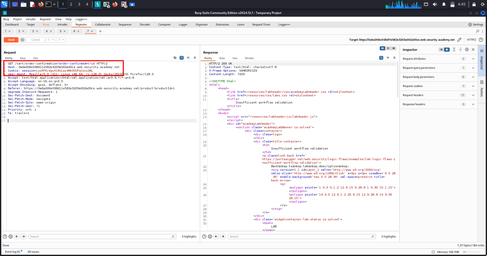

---

## 🌍 Real-World Scenarios

- **E-commerce:** Buy products for free  
- **Ticketing:** Confirm bookings without payment  
- **FinTech:** Replay payment success callbacks  
- **Subscriptions:** Activate premium plans without billing  
- **Education portals:** Unlock paid courses  

---

## 🎯 High-Value Endpoints

Always test endpoints like:

- `/cart/checkout`  
- `/order-confirmation`  
- `/payment/success`  
- `/finalize`  
- `/activate`  

🚩 Red flags:

- `confirmed=true`  
- No order-state validation  
- No payment reference  

---

## 🔗 Multi-Chain Attacks

Often chains with:

- Replay attacks  
- IDOR  
- Price manipulation  
- Auth / logic flaws  

---

## 🛡️ Remediation

✅ Enforce workflow state server-side  
✅ Use strict state machines  
✅ Validate payment on confirmation  
✅ Bind confirmation to user + order  
✅ Use one-time tokens  

❌ Never trust UI flow or query flags

---

## 🧠 Final Takeaway

> UI is guidance. Backend is security.

If a final endpoint works without re-checking earlier steps,  
**the workflow is broken.**

---

# Lab-11 🐞 Logic Flaws – Flawed Assumptions About the Login Sequence
## (Role Selection Bypass / Authentication Flow Abuse)

---

## 🔹 Overview

**This vulnerability occurs when an application makes unsafe assumptions about the order of steps during the authentication or login process.**

### Expected flow:
- **Login**
- **Select a role**
- **Access homepage**

### Attacker behavior:
- *Skip intermediate steps*
- *Drop critical requests*
- *Directly access protected endpoints*

> **If the backend does not strictly enforce login state and role assignment, users may be assigned default or unintended roles — including administrator.**

📌 **Result:** Authentication bypass + privilege escalation  
📌 **Category:** Business Logic / Auth Flow Abuse

---

## 🔹 What Is This Topic?

### ❗ This is NOT:
- ❌ Password brute-force
- ❌ Session fixation
- ❌ Token leakage

### ✅ This IS:
- **Business Logic Vulnerability**
- **Broken authentication flow**
- **Unsafe backend assumptions**

> **Core mistake:**  
> The backend assumes users will *always* follow the intended login sequence.

### Developers incorrectly trust that:
- Role selection will *always* happen  
- Every login reaches the role-selection step  
- Skipping a step is *impossible*

🧠 **Attackers exploit this trust by manipulating HTTP traffic.**

---

## 🔹 Lab Walkthrough
### 🧪 Flawed Assumptions About the Sequence of Events

---

## 🎯 Lab Goal

**Bypass authentication logic → Gain administrator access → Delete user `carlos`**

---

## 🔐 Step 1: Normal Login Observation

**Credentials used:**
- **Username:** `wiener`
- **Password:** `peter`

### After login:

GET /role-selector

User must select a role before reaching the homepage.

### 📌 Observations:
- Role is assigned **after** login  
- Role assignment is handled by a **separate endpoint**

---

## 🚫 Step 2: Direct Admin Access Test

Manually navigate to:

/admin

❌ **Access denied**

### Conclusion:
- Admin access depends on **role assignment**
- Role is not yet applied

---

## 🔁 Step 3: Intercept Login Request

**Tool:** Burp Suite – Proxy (Intercept **ON**)

### Actions:
- Log out
- Revisit login page
- Log in again as `wiener`

### Intercepted request:

POST /login

✅ Forward this request **normally**

---

## 🛑 Step 4: Drop Role Selector Request (**KEY STEP**)

### Next intercepted request:
```
GET /role-selector HTTP/2
```
### Action taken:
- ❌ **Drop the request**
- ❌ Do NOT forward

📌 This prevents backend role-selection logic from executing.

---

## 🌐 Step 5: Manual Navigation

Manually browse to:
```
/
```
(or homepage URL)

### 🧠 Backend behavior:
- Assumes role assignment already occurred
- Applies **default role**
- Default role = **administrator**

⚠️ **Missing state validation causes implicit admin assignment**

---

## 💥 Step 6: Admin Panel Access

Navigate to:
```
/admin
```
✅ **Access granted**

### Final action:
- Delete user `carlos`

🎉 **Lab solved**

---

## 🔹 Real-World Scenarios (COMPLETE)

### 1️⃣ Role-Based Login Systems
- Role chosen post-authentication
- Backend defaults role if skipped

**Impact:** Unauthorized admin access

---

### 2️⃣ SSO + Internal Role Mapping
- SSO login succeeds
- Local role mapping skipped

**Impact:** Users gain excessive privileges

---

### 3️⃣ Multi-Step Login Portals
- Login → Profile setup → Dashboard
- Attacker skips setup

**Impact:** Broken auth state

---

### 4️⃣ Enterprise Dashboards
- Permissions assigned later
- Missing step = admin

**Impact:** Internal compromise

---

### 5️⃣ Mobile App APIs
- Client enforces role logic
- Backend trusts client

**Impact:** API-level privilege escalation

---

## 🔹 High-Value Endpoints to Test

### 🔐 Authentication / Role Paths:
- `/login`
- `/role-selector`
- `/select-role`
- `/choose-role`
- `/setup`
- `/onboarding`
- `/home`
- `/dashboard`
- `/admin`

### 🚩 Red Flags:
- Role assignment **after** login
- Separate role-selection endpoints
- No role validation on homepage

---

## 🔹 Multi-Chain Attack Paths

### 🔗 Chain 1
- Login  
- → Skip role assignment  
- → Default admin  
- → Admin panel  
- → Full takeover  

---

### 🔗 Chain 2
- Auth bypass  
- → Admin  
- → IDOR  
- → Data deletion  

---

### 🔗 Chain 3
- Role bypass  
- → Admin  
- → Config access  
- → RCE / SSRF  

---

## 🔹 Remediation (Developer Fix)

### ✅ MUST:
- Enforce auth state **server-side**
- Require role assignment before session activation
- Block access if role step is skipped
- Validate role on **every request**

### ❌ NEVER:
- Assume login flow order
- Default to privileged roles
- Trust frontend navigation
- Allow partial authentication states

---

## 🔹 Extra Notes (Exam + Bug Bounty)

### 🧠 Golden Rule
> **If a step exists in the login flow, it must be enforced server-side.**

### 🔥 Red Flags
- Redirect-based role assignment
- Separate role pages
- Login success without final validation

### 📌 Severity:
- OWASP Top 10 related
- **High → Critical**
- Extremely common in real applications

---

## 🧠 One-Line Memory Hook

> **If skipping one login step gives more access, authentication is broken.**

---

# Lab-12 🐞 Business Logic Vulnerabilities – Workflow, Coupons & Tokens  
## (Token Interchange / Still Valid – Real-World Logic Failure)

---

## 🔹 Overview

*Business logic vulnerabilities arise when an application’s rules are broken due to unsafe assumptions — not technical bugs.*

The application may be technically secure, but it *assumes*:

- Users follow the intended workflow  
- Tokens are used only once  
- Tokens belong to a specific action  
- Validation done earlier never needs re-checking  

🧠 *Attackers exploit how the system *thinks, not how it’s coded.**

📌 Extremely common in:
- E-commerce  
- FinTech  
- Authentication & reset flows  
- Subscription systems  

---

## 🔹 What Is This Topic?

### ❗ This is NOT:
- ❌ SQL Injection  
- ❌ XSS  
- ❌ RCE  

### ✅ This IS:
- *Business Logic Vulnerability*
- *Token lifecycle failure*
- *State & workflow enforcement bug*

> *Core mistake:*  
> The backend trusts that a token validated once will remain valid in any context.

Attackers:
- Reuse tokens  
- Interchange tokens  
- Replay requests  
- Apply tokens outside intended flow  

---

## 🔹 Lab Walkthrough (Token Interchange – Single Screenshot Case)

### 🧪 Token Reuse & Interchange Logic Flaw

---

## 🎯 Lab Goal

*Prove that interchanging or replaying tokens still results in a valid final action.*

---

## 🔐 Step 1: Perform a Legitimate Action
-Log in as credentials `wiener:peter`
- Trigger a valid workflow (e.g., coupon apply / reset / verification)
- Server issues a token, NEWCUST5.
- Action succeeds normally
- At the bottom of the page, sign up to the newsletter. You receive another coupon code, SIGNUP30.
- Add the leather jacket to your cart.

---

## 🔁 Step 2: Interchange / Reuse Token
- Go to the checkout and apply both of the coupon codes to get a discount on your order.
- Use the *same token* again in a row twice results in coupon already used. 
- Swap the both tokens and then apply again and again by swapping results in success 
- Keep on doing it until the total value of reduces to your account balance.
- Place order confirmation true.
- Lab solved.

```
Server only compares the value of new token with previous token and as the value is different , it allows it without checking the state history that this token is expired or already use or not
```

⚠️ No new validation step is triggered.

---

## 🧪 Step 3: Final Output (📸 *ONLY SS HERE*)

✔ Action succeeds 
✔ Token accepted 
✔ Server does not reject or invalidate

📌 This confirms:
- Token is *still valid*
- Token lifecycle is *not enforced*
- Business rule is *broken*

---

## Evidence/Proof

### Screenshor-01
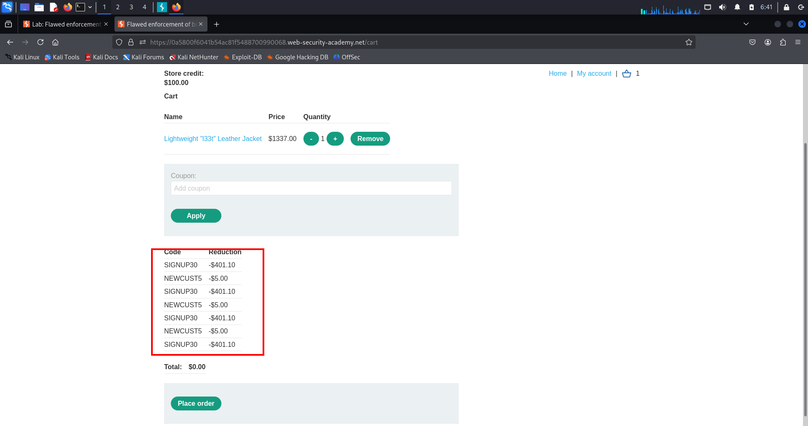

---

## 🔹 Why This Works (Backend Logic Failure)

The server:
- ❌ Does NOT invalidate token after use  
- ❌ Does NOT bind token to a single action  
- ❌ Does NOT bind token to workflow state  
- ❌ Assumes “already validated = always valid”  

➡️ *Token interchange succeeds*

---

## 🔹 Real-World Scenarios (COMPLETE)

### 1️⃣ Token Replay (MOST COMMON)
- Token validated once
- Token reused successfully

*Impact:* Account takeover / repeated actions

---

### 2️⃣ Token Interchange Between Actions
- Same token works for multiple endpoints

*Impact:* Privilege escalation

---

### 3️⃣ Token Not Bound to User
- Token valid for any account

*Impact:* Cross-account abuse

---

### 4️⃣ Token Not Bound to State
- Token valid even when workflow not completed

*Impact:* 2FA bypass / payment bypass

---

### 5️⃣ Coupon + Token Abuse
- Coupon validated
- Cart changes later
- Token reused → discount still applies

*Impact:* Free or underpriced purchases

---

## 🔹 High-Value Endpoints to Test

### 🔑 Tokens & Validation
```
- /verify
- /confirm
- /token/validate
- /reset-password
- /2fa
```

### 🛒 State-Changing
```
- /apply-coupon
- /checkout
- /order/confirm
- /success
- /finalize
```

🚩 *Red Flags*
- Reusable tokens  
- Boolean flags (valid=true)  
- No expiry  
- Same token across endpoints  

---

## 🔹 Multi-Chain Attacks

### 🔗 Chain 1 – Token Replay
Token issued  
→ Token reused  
→ Action repeated  

---

### 🔗 Chain 2 – Token + Workflow Bypass
Token validated  
→ Skip steps  
→ Final endpoint accessed  

---

### 🔗 Chain 3 – Token + IDOR
Valid token  
→ Change user reference  
→ Modify another account  

---

## 🔹 Remediation (Developer Fix)

### ✅ MUST:
- Bind tokens to *user*
- Bind tokens to *single action*
- Bind tokens to *workflow state*
- Add *strict expiry*
- Invalidate token after use
- Re-validate on final step

### ❌ NEVER:
- Reuse tokens
- Trust earlier validation
- Accept tokens without state checks
- Assume UI enforces logic

---

## 🔹 Extra Notes (Exam + Bug Bounty)

### 🧠 Golden Rule
> *If a token works twice, logic is broken.*

### 🔥 Red Flags
- Tokens without expiry  
- Tokens reused across endpoints  
- Final actions without re-validation  

📌 *Severity:* High → Critical  
📌 *Category:* Business Logic / Workflow Abuse  

---

## 🧠 One-Line Memory Hook

> *Business logic bugs exist because the server assumes — not because it verifies.

---

# Lab-13 🔐 Encryption Oracle Vulnerability — Complete Lab Write-Up

## Overview

An *Encryption Oracle vulnerability* occurs when an application:
- Accepts attacker-controlled input
- Encrypts it using a secret key
- Returns or stores the ciphertext
- Reuses the *same encryption logic* elsewhere (auth, cookies, tokens)

When combined with a *Decryption Oracle*, attackers can:
- Learn plaintext structure
- Forge valid encrypted data
- Bypass authentication

> Encryption ≠ Authorization

---

## What Is Being Exploited

This is *NOT* SQLi, XSS, or RCE.

This is a *cryptographic design + logic flaw* where:
- The backend trusts encrypted client data
- The same crypto key is reused
- State is stored client-side

---

## Lab Goal

- Abuse an encryption oracle
- Forge a valid stay-logged-in cookie
- Authenticate as administrator
- Delete user carlos

---

## High-Level Logic

Two oracles exist:

- *Encryption Oracle*
  - Endpoint: POST /post/comment
  - Input: email
  - Output: encrypted notification cookie

- *Decryption Oracle*
  - Endpoint: GET /post?postId=x
  - Input: notification cookie
  - Output: plaintext error message

Together, they allow *chosen-plaintext encryption + plaintext recovery*.

---

## Final Lab Walkthrough (Strict Order)

---

### Step 1 — Trigger Encrypted Error

- Login as wiener
- Enable *Stay logged in*
- Visit any blog post
- Post a comment with an *invalid email*

Why:
- Invalid email forces an error
- Error message is encrypted
- Ciphertext is stored in notification cookie

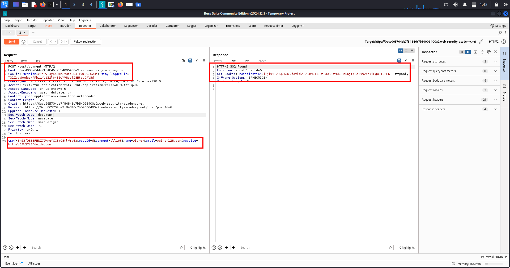

---

### Step 2 — Observe Cookies

In Burp Proxy:
- stay-logged-in → encrypted
- notification → encrypted

Browser error:

Invalid email address: your-input

Conclusion:
- Error text is produced by decrypting the cookie

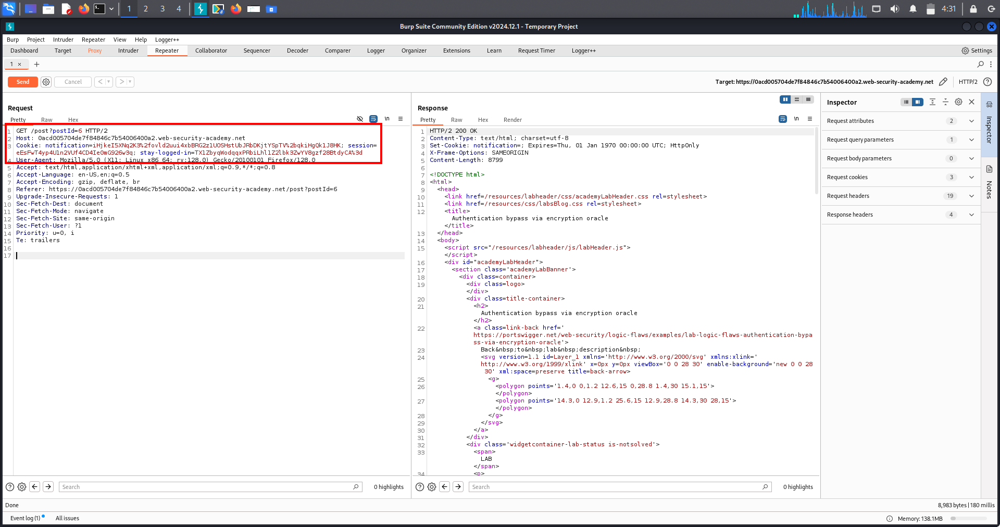

---

### Step 3 — Capture Requests

Send to Repeater:
```
1. POST /post/comment  → encrypt
2. GET /post?postId=6 → decrypt
```
Rename tabs:
- 🟢 encrypt
- 🔵 decrypt

---

### Step 4 — Identify Oracles

Encryption Oracle:
- Input: email
- Output: Set-Cookie: notification=...

Decryption Oracle:
- Input: notification
- Output: plaintext error

This is the core vulnerability.

---

### Step 5 — Decrypt Stay-Logged-In Cookie

- Copy stay-logged-in
- Paste into notification
- Send decrypt request

Response:

wiener:timestamp

Format learned:

username:timestamp

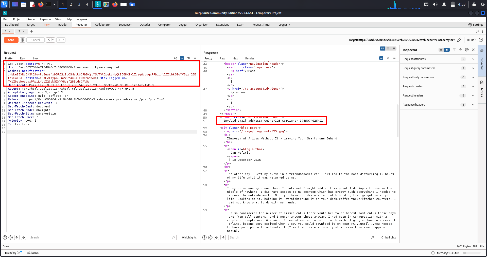

---

### Step 6 — Create Admin Payload

- Copy timestamp
- Go to encrypt request
- Change email to:

administrator:timestamp

- Send request
- Copy new notification cookie

---

### Step 7 — Prefix Problem

Decryption output:

Invalid email address: administrator:timestamp

Reason:
- App prepends:

Invalid email address:

- Length = *23 bytes*

This breaks reuse.

---

### Step 8 — Decode Ciphertext

In Decoder:
- URL decode
- Base64 decode
- Switch to Hex view

---

### Step 9 — Block Size Discovery

Removing bytes causes server error unless length is:

multiple of 16 bytes

Conclusion:
- AES block cipher in use

---

### Step 10 — Padding Alignment

Return to encrypt request:
```
xxxxxxxxxadministrator:timestamp
```
Reason:
- 23 + 9 = 32 bytes
- 32 is divisible by 16

---

### Step 11 — Strip Prefix Blocks

- Encrypt padded input
- Decode to Hex
- Remove *first 32 bytes*
- Re-encode:
  - Base64
  - URL

---

### Step 12 — Verify Clean Decryption

Paste modified cookie into decrypt request.

Response:
```
administrator:timestamp
```
Prefix successfully removed.

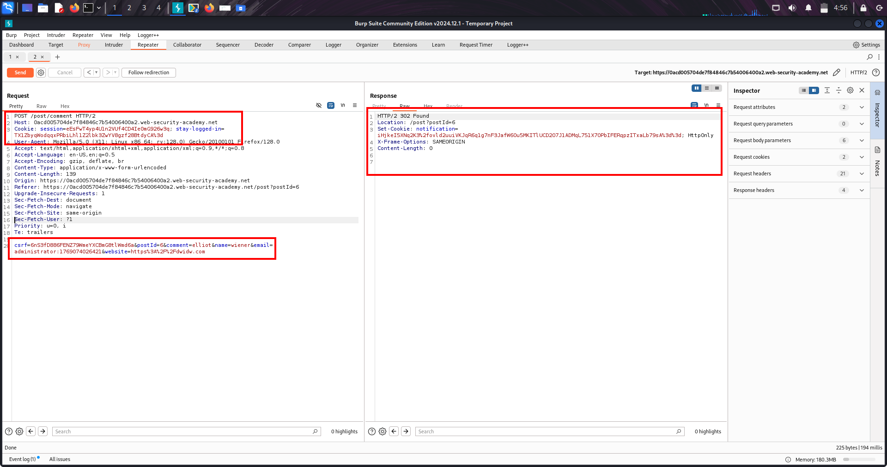

---

### Step 13 — Authenticate as Admin

- Send GET /
- Remove session cookie
- Replace stay-logged-in with forged cookie

Result:
- Logged in as administrator

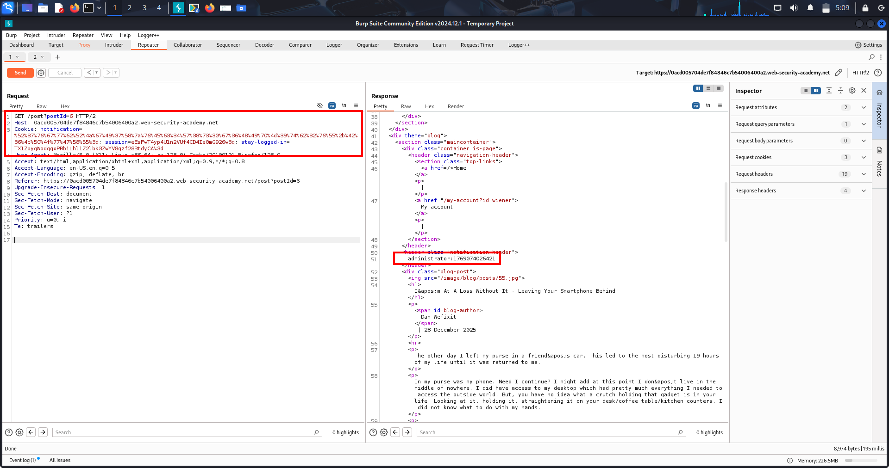

---

### Step 14 — Finish Lab

Visit:
```
/admin /admin/delete?username=carlos
```
Lab solved.

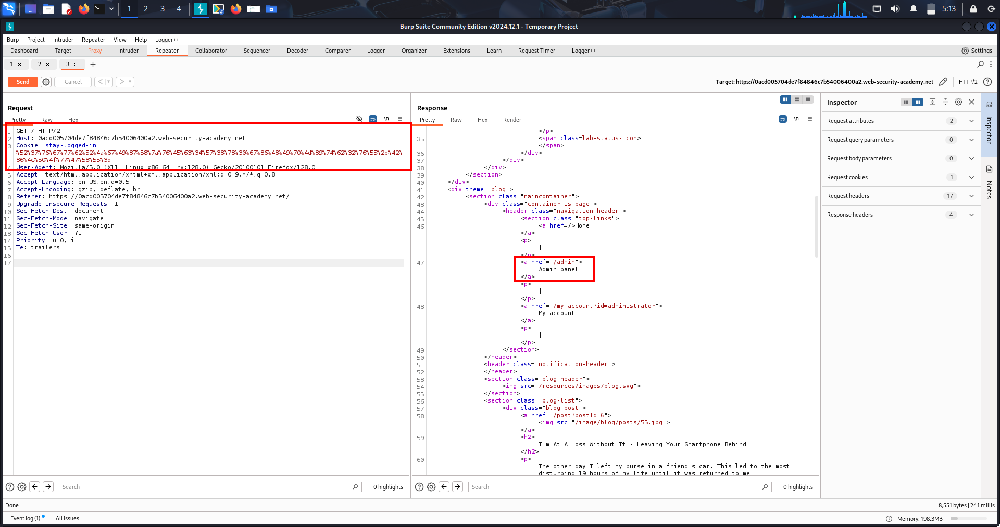

---

## Real-World Impact

Seen in:
- Remember-me cookies
- Password reset tokens
- Encrypted user blobs
- Notification cookies
- SSO implementations

---

## Multi-Chain Attacks

- Encryption Oracle + IDOR
- Encryption Oracle + Replay
- Encryption Oracle + Logic Flaw
- Encryption Oracle + Padding Oracle
- Encryption Oracle + CSRF

---

## Developer Remediation

- Never trust encrypted client data
- Use AEAD (AES-GCM)
- Bind tokens to:
  - User
  - Action
  - Time
  - State
- Store auth state server-side
- Rotate keys per feature

---

## Golden Rule

> If the server assumes, attackers abuse.

---

# 🧠Lab-14 Business Logic Vulnerability - Email Parser Discrepancy

---

## 🔵 Overview

This lab is based on:

different components interpreting the same email differently

Core issue:

parser discrepancy between validation system and mail system

---

## 🎯 Final Goal

Exploit encoding mismatch to:

bypass email domain restriction
        ↓
register account
        ↓
receive verification email on attacker domain
        ↓
login
        ↓
delete carlos

---

## 🔵 WHAT IS THE TOPIC?

| Concept | Meaning |
|---|---|
| Business Logic Vulnerability | flaw in application workflow |
| Email Parser Discrepancy | different interpretation of email |
| Encoded-Word Format | special email encoding |
| UTF-7 Encoding | hidden character encoding |
| Access Control Bypass | domain restriction bypass |

---

## 🔵 THEORY (IMPORTANT FOUNDATION)

### 1 — Business Logic Vulnerability

Occurs when:

application logic can be tricked into unintended behavior

Not code bug — but workflow flaw.

---

### 2 — Email Validation Logic

Application checks:

email must end with @ginandjuice.shop

So:

✔ allowed:

```text
user@ginandjuice.shop
```

❌ blocked:

```text
user@evil.com
```

---

### 3 — Parser Discrepancy

Two systems:

| System | Behavior |
|---|---|
| Validator | reads RAW input |
| Mail system | decodes input |

👉 mismatch = vulnerability

---

### 4 — Email Encoding

Email can contain encoded data:

```text
=?charset?q?encoded_text?=
```

Used for:

special characters

non-standard text

---

### 5 — UTF-7 Encoding (Key Concept)

Rare encoding that hides characters like:

```text
@
spaces
```

Example:

```text
&AEA- = @
```

---

## 🔥 WHY ATTACK WORKS

Because:

validator does NOT decode UTF-7

mail system DOES decode UTF-7

---

## 🔵 LAB WALKTHROUGH (STEP BY STEP)

---

### ✅ Step 1 — Open Registration Page

Go to:

```text
Register
```

---

### ✅ Step 2 — Test Domain Restriction

Try:

```text
foo@exploit-server.net
```

❌ Blocked

Reason:

only @ginandjuice.shop allowed

---

### ✅ Step 3 — Test Encoded Payloads

#### ISO-8859-1

```text
=?iso-8859-1?q?=61=62=63?=foo@ginandjuice.shop
```

❌ Blocked

---

#### UTF-8

```text
=?utf-8?q?=61=62=63?=foo@ginandjuice.shop
```

❌ Blocked

---

#### UTF-7 (IMPORTANT DISCOVERY)

```text
=?utf-7?q?&AGEAYgBj-?=foo@ginandjuice.shop
```

✔ Accepted

---

### ✅ Step 4 — Craft Final Payload

```text
=?utf-7?q?attacker&AEA-exploit-0ab500350305881683069506012f0032.exploit-server.net&ACA-?=@ginandjuice.shop
```

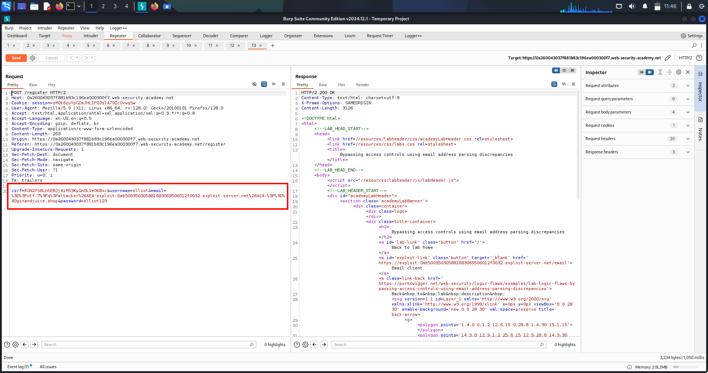

---

## 🔵 PAYLOAD BREAKDOWN

---

### Part 1

```text
=?utf-7?q?
```

→ tells system to decode UTF-7

---

### Part 2

```text
attacker
```

username part

---

### Part 3

```text
&AEA-
```

→ decoded = @

---

### Part 4

```text
exploit-server domain
```

your controlled mailbox

---

### Part 5

```text
&ACA-
```

→ space

---

### Part 6

```text
?=@ginandjuice.shop
```

fake validation suffix

---

## 🔵 EXECUTION FLOW

```text
User submits encoded email
        ↓
Validator reads RAW input
        ↓
Sees @ginandjuice.shop → PASS
        ↓
Account created
        ↓
Mail system decodes UTF-7
        ↓
Real email becomes attacker-controlled
        ↓
Verification email sent to exploit server
```

---

## 🔵 ACCOUNT USAGE FLOW

---

### ✅ Step 5 — Click Email Verification

activation email arrives at exploit server

---

### ✅ Step 6 — Activate Account

Click link → account verified

---

### ✅ Step 7 — Login

Use:

```text
username + password you created during signup
```

---

### ✅ Step 8 — Admin Access

Now account is trusted

---

### ✅ Step 9 — Delete Carlos

```text
admin → delete user → carlos
```

---

## 🔵 REAL-WORLD SCENARIOS

```text
enterprise registration portals

SaaS onboarding systems

SSO email-based login

invitation-only systems

admin auto-assignment based on domain
```

---

## 🔵 HIGH-VALUE TARGETS

| System | Impact |
|---|---|
| Admin registration | privilege escalation |
| SSO onboarding | account takeover |
| invite systems | bypass access |
| password reset flows | email hijack |

---

## 🔵 REMEDIATION

```text
normalize email before validation

reject all encoded-word formats

disable UTF-7 support

use one canonical parser everywhere

never trust raw email strings
```

---

## 🔵 IMPORTANT MENTAL MODEL

```text
Validation parser and mail parser interpret
the same email differently.

That mismatch:
creates authentication and access-control bypasses.
```

---

## 🔵 ONE-LINE SUMMARY

👉 “This vulnerability works because the application validates the raw UTF-7 encoded email while the mail system later decodes it differently, allowing attackers to bypass domain restrictions and receive emails on a controlled domain.”
