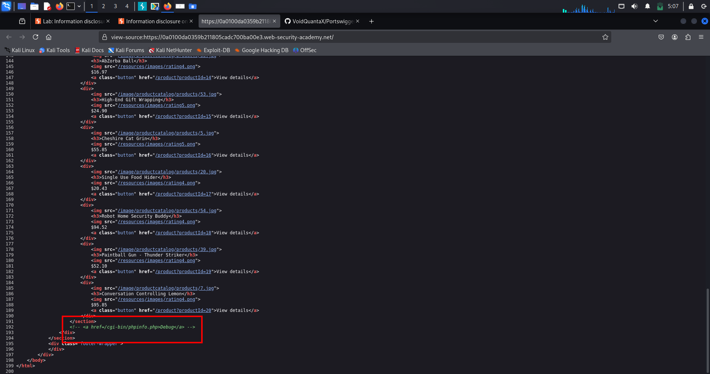
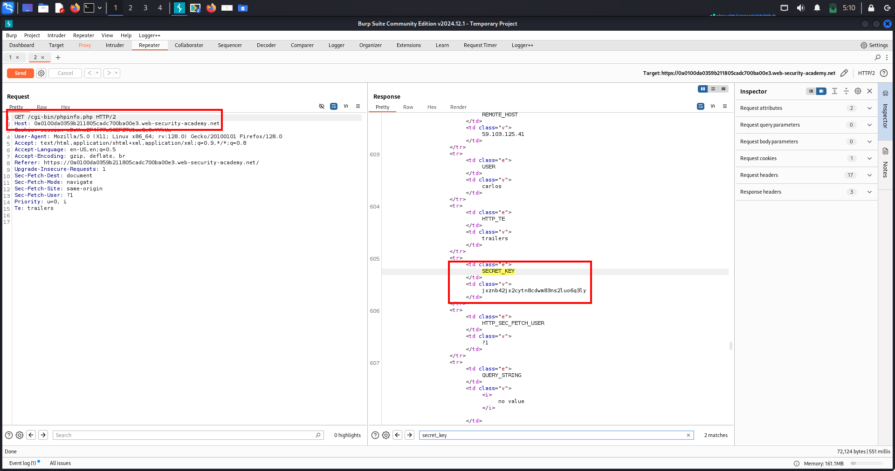
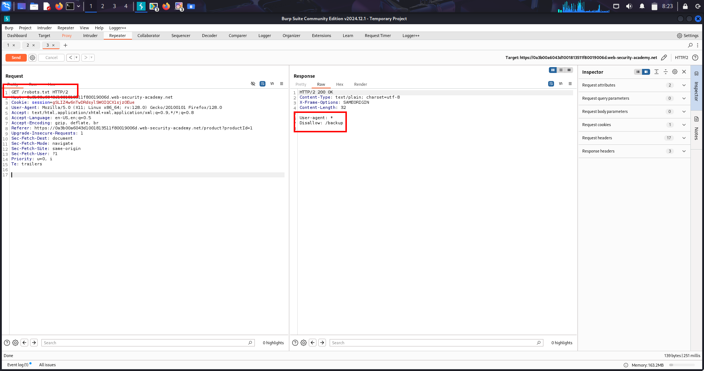
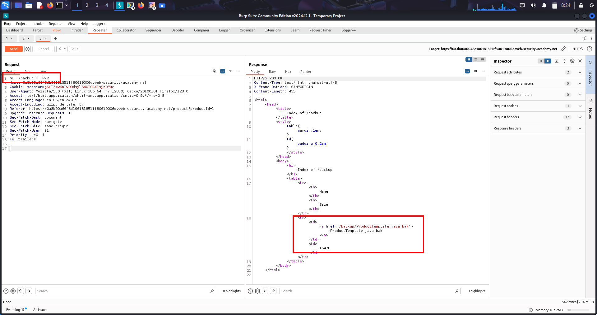
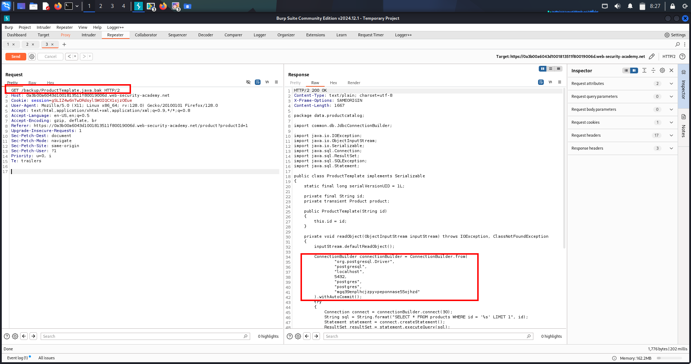
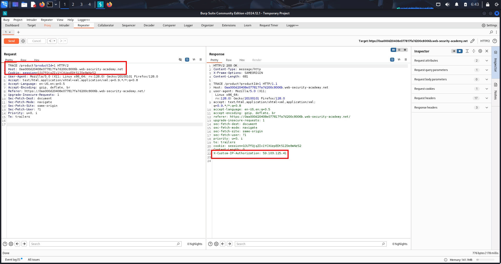
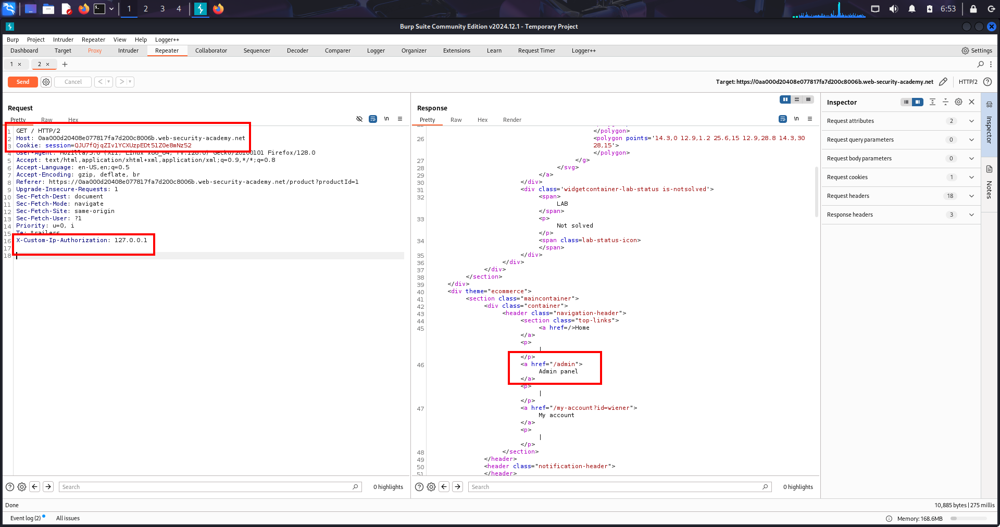

# Lab-1 ❌ Information Disclosure – Verbose Error Messages  
## Third-Party Vulnerable Framework Disclosure

---

## 1️⃣ Overview

Information disclosure via verbose error messages occurs when an application reveals internal technical details during error handling.

Instead of failing safely, the application exposes implementation details that attackers can leverage for targeted attacks.

This vulnerability is especially dangerous when *third-party frameworks and exact versions* are disclosed, as it enables precise vulnerability research and exploitation.

---

## 2️⃣ What Is This Topic?

This topic focuses on *error-based information disclosure*, where attackers intentionally trigger application errors to extract sensitive backend information.

*Core security failure:*

> The application explains why it failed instead of failing silently.

Typical leaked information includes:

- Web server type  
- Backend framework name  
- Third-party library versions  
- Programming language details  
- Deployment configuration clues  

---

## 3️⃣ Lab Walkthrough

### 🎯 Goal  
Identify a vulnerable third-party framework disclosed through a verbose error message.

---

### Step 1️⃣ Normal Application Behavior

User accesses a valid product page.

Request:
- GET /product?productId=1

Server processes request successfully.  
Product details are rendered correctly.

---

### Step 2️⃣ Triggering an Error

Attacker modifies expected input type.

Request changed to:
- GET /product?productId=abc

A string is supplied where an integer is expected.

---

### Step 3️⃣ Improper Error Handling

Backend attempts to process invalid input.

Input validation is weak or missing.

An internal exception is thrown.

---

### Step 4️⃣ Information Disclosure

Server responds with a *verbose error message*.

The error reveals:

- Third-party framework name  
- Underlying web server (Apache x.x.y.y)  
- Exact framework/server version  

This version corresponds to a *known vulnerable release*.

---

### Step 5️⃣ Lab Completion

Disclosed vulnerable framework version is submitted.

✅ Lab solved.

---

## 📸 Evidence - Screnshot of verbose error message revealing third party framework


---

## 4️⃣ Real-World Scenarios (Methodology)

### Attacker Methodology

1. Identify user-controlled input parameters  
   - IDs  
   - Numeric fields  
   - Query parameters  

2. Break input expectations  
   - Numbers → strings  
   - Missing parameters  
   - Malformed values  

3. Observe error responses carefully  
   - Response body  
   - HTTP headers  
   - Stack traces  
   - Server banners  

4. Extract disclosed technical details  

5. Correlate with known CVEs and exploits  

---

### Real-World Impact Example

- Verbose error discloses Apache framework version  
- Attacker searches vulnerability databases  
- Public CVE found for disclosed version  
- Exploit used as entry point for deeper compromise  

---

## 5️⃣ High-Value Endpoints

Endpoints where verbose errors are most useful:
```
- /product?id=  
- /view?item=  
- /api/*  
- /search?q=  
- /login  
- /checkout  
- /upload  
- /admin/*  
```
🔴 These endpoints frequently trigger backend logic and exceptions.

---

## 6️⃣ Multi-Chain Attacks

### Example Attack Chain

1️⃣ Verbose error → framework + version disclosed  
2️⃣ Version fingerprinting → vulnerable release identified  
3️⃣ CVE research → public exploit available  
4️⃣ Exploitation → RCE / file disclosure / auth bypass  
5️⃣ Privilege escalation → full system compromise  

➡️ Information disclosure acts as a *force multiplier*, not a standalone exploit.

---

## 7️⃣ Remediation

### Correct Defensive Measures

- Disable debug mode in production  
- Use generic user-facing error messages  
- Log detailed errors server-side only  
- Enforce strict input validation  
- Suppress stack traces and server banners  

---

### What Developers Must Avoid

- Returning raw exception messages  
- Exposing framework or server versions  
- Assuming attackers won’t inspect errors  

---

# Lab-2 🐞 Information Disclosure – Debug Pages & Debugging Data
*(HTML Comment → Debug Endpoint → Secret Key Disclosure)*

---

## 🔍 Overview

Debug-related information disclosure occurs when an application exposes debug pages,
diagnostic scripts, or development data to end users.

These disclosures often reveal critical secrets such as:

- Environment variables
- Application secret keys
- Internal file paths
- Backend framework versions (Apache, PHP, etc.)

Unlike minor leaks, debug disclosures frequently lead to immediate full compromise
of the application.

This vulnerability is extremely common in real-world breaches,
especially in misconfigured production servers.

---

## 📌 What Is This Topic?

This is an **Information Disclosure** vulnerability caused by development or debugging
features left enabled in production.

Core mistake:

> Debug functionality is accessible outside the trusted developer environment.

Attackers do not guess passwords — they read what the server tells them.

---

## 🧪 Lab Walkthrough

### 🎯 Goal

Extract a secret key exposed through a debug endpoint.

### Steps

1. Load the application homepage  
2. View page source (HTML)

3. Identify a developer HTML comment revealing a hidden endpoint:

<!-- Debug endpoint: /cgi-bin/phpinfo.php -->

4. Manually access the endpoint:

GET /cgi-bin/phpinfo.php

5. Server responds with a phpinfo() debug page

6. Debug page reveals:
- Server software (Apache x.x.x)
- PHP version
- Loaded modules
- Environment variables

7. Search within the response
8. Extract sensitive value:

SECRET_KEY=xxxxxxxx

9. Submit the extracted key  
✅ Lab solved

## 📸 Evidence (SS)

### 🖼️ SS‑1: HTML Comment Disclosure

- Developer HTML comment discovered in page source
- Comment revealed a hidden internal endpoint



---

### 🖼️ SS‑2: Manual Access to Hidden Debug Endpoint

- Hidden endpoint accessed directly via browser
- Debug page loaded successfully
- Sensitive information disclosed in response



---

## 🌍 Real-World Scenarios (100% COMPLETE)

### 1️⃣ Debug Pages Left in Production (MOST COMMON)

Examples:
- phpinfo.php
- debug.php
- test.php
- info.php

Impact:
- Secret keys leaked
- Session forging
- Authentication bypass

---

### 2️⃣ HTML Comments Leaking Internal Paths

Examples:
<!-- TODO: remove /internal/debug -->
<!-- Debug endpoint: /admin-test -->

Impact:
- Hidden admin/debug endpoints discovered
- Attack surface expanded instantly

---

### 3️⃣ Environment Variable Disclosure

Leaked via:
- phpinfo()
- debug dumps
- error pages

Impact:
- SECRET_KEY exposure
- JWT signing key leakage
- OAuth token compromise

---

### 4️⃣ Framework & Server Version Disclosure

Examples:
- Apache x.x.x
- PHP x.x.x
- Laravel / Django versions

Impact:
- Public CVEs identified
- Exploit selection becomes trivial

---

### 5️⃣ Debug APIs in Modern Applications

Examples:
- /debug/vars
- /status
- /metrics
- /actuator/env (Spring)

Impact:
- Cloud secrets exposed
- Internal service mapping

---

### 6️⃣ CI/CD & Development Artifacts Exposed

Examples:
- .env
- .git/
- Backup files
- Test scripts

Impact:
- Full source disclosure
- Credential reuse attacks

---

### 7️⃣ Cloud & Container Debug Endpoints

Examples:
- Kubernetes metrics
- Docker diagnostics

Impact:
- Infrastructure compromise
- Lateral movement

---

## 🎯 High-Value Endpoints to Always Test

### Debug & Diagnostic Paths
```
/cgi-bin/phpinfo.php  
/phpinfo.php  
/info.php  
/debug  
/debug.php  
/debug/vars  
/status  
/metrics  
/health  
/test  
/dev  
```
---

### Files & Configurations
```
/.env  
/.git/  
/config  
/settings  
/internal  
```
🔴 Any public access = **critical severity**

---

## 🔗 Multi-Chain Attacks (Real Hacker Paths)

### Chain 1 (Classic & Guaranteed)

HTML comment  
→ Debug endpoint  
→ SECRET_KEY leak  
→ Session forging  
→ Admin access  
→ Full takeover

---

### Chain 2 (Version → Exploit)

Debug page  
→ Apache x.x.x disclosed  
→ Public CVE identified  
→ RCE exploit  
→ Server compromise

---

### Chain 3 (Secrets → Auth Bypass)

Environment variables  
→ JWT secret leaked  
→ Token forging  
→ Authentication bypass  
→ Account takeover

---

### Chain 4 (Debug → IDOR → Data Dump)

Debug reveals internal APIs  
→ IDOR discovered  
→ User data extraction  
→ Privacy breach

---

## 🛡️ Remediation (Developer Fix)

✅ Remove all debug pages from production  
✅ Disable phpinfo and CGI scripts  
✅ Strip HTML comments before deployment  
✅ Protect environment variables  
✅ Use deny-by-default access controls  
✅ Restrict diagnostics to localhost only  

❌ NEVER:
- Leave debug endpoints accessible
- Assume “hidden” equals secure
- Trust users not to view source
- Expose secrets via diagnostics

---

# Lab-3 🛡️ Source Code Disclosure via Backup Files
**(Complete & Real‑World)**

---

## 🔹 Overview

Source code disclosure via backup files occurs when an application unintentionally exposes non‑executable copies of its own source code.

These backup files are often created during development, editing, or maintenance and are mistakenly left accessible in production environments.

Exposed source code frequently contains:

* Hard‑coded database credentials  
* API keys and secrets  
* Internal application logic  
* Hidden endpoints and admin functionality  

Once source code is disclosed, exploitation becomes trivial.  
This is a **high‑impact information disclosure vulnerability** commonly observed in real‑world applications.

---

## 🔹 What Is This Topic?

This topic covers information disclosure caused by leftover backup or temporary files that are served as plain text by the web server.

Common backup extensions include:

* `.bak`  
* `.old`  
* `.backup`  
* `.save`  
* `~`  

### Core Concept

> **The server executes real source files but serves backup files as readable text.**

Attackers exploit this behavior to directly read application source code.

---

## 🔹 Lab Walkthrough (Exact Solve Flow)

### 1️⃣ Initial Recon — `robots.txt` Discovery

Access the following endpoint:

* `/robots.txt`

The file discloses restricted or sensitive paths that are not meant for users.

This provides strong reconnaissance clues for further enumeration.

---

### 2️⃣ Manual Enumeration — Backup Directory Found

Using information from `robots.txt`, manually access:

* `/backup/`

The directory is publicly accessible and contains backup artifacts.

---

### 3️⃣ Identifying Backup Source Code

Inside the backup directory, locate a backup file such as:

* `product-template.java.bak`

The file is **not executed** by the server and is served as plain text.

---

### 4️⃣ Accessing the Backup File

Request the backup file directly:

* `/backup/product-template.java.bak`

The server responds with **raw Java source code**.

---

### 5️⃣ Source Code Analysis

Review the source code carefully.

Identify database connection logic containing:

* Hard‑coded database username  
* Hard‑coded database password  

Sensitive credentials are exposed directly in the source.

---

### 6️⃣ Extract Secret & Complete Lab

* Copy the disclosed database password  
* Submit the password as the solution  

✅ **Lab solved**

---

## 🔹 Evidence
### Screenshot-1 (robots.txt revealing restricted paths)
* 

### Screenshot-2 (exposed /backup directory listing)
* 

### Screenshot-3 ( database password found in source code)
* 

---

## 🔹 Real‑World Scenarios (**Guaranteed & Practical**)

### 1️⃣ Production Backup Files (**MOST COMMON**)

Developers often:

* Edit files directly on production servers  
* Use editors that auto‑create `.bak` files  
* Forget to remove backup artifacts  

**Impact:**

* Full source code disclosure  
* Credential leakage  
* Business logic exposure  

---

### 2️⃣ Hard‑Coded Secrets in Source Code

Frequently exposed secrets include:

* Database credentials  
* API keys  
* Cloud service secrets  

**Impact:**

* Database takeover  
* External service abuse  
* Lateral movement  

---

### 3️⃣ Forgotten Directories

Common high‑risk directories:

* `/backup`  
* `/old`  
* `/dev`  
* `/test`  
* `/tmp`  

**Impact:**

* Entire application logic exposed  
* Easier chaining of vulnerabilities  

---

## 🔹 High‑Value Files & Locations (Always Test)

### 🔴 High‑Risk Backup Targets

* `config.*`  
* `application.*`  
* `settings.*`  
* `db.*`  
* `template.*`  

### 🔴 High‑Risk Directories

* `/backup/`  
* `/old/`  
* `/dev/`  
* `/test/`  
* `/.tmp/`  

➡️ **If source code is readable → Critical Severity**

---

## 🔹 Multi‑Chain Attacks (Real Hacker Paths)

### Chain 1 — Credential Compromise

Backup file  
→ Source code disclosure  
→ Database credentials  
→ Database access  
→ User data dump  

---

### Chain 2 — Logic Abuse

Source code  
→ Hidden admin endpoints discovered  
→ Access control bypass  
→ Privilege escalation  

---

### Chain 3 — Credential Reuse

Hard‑coded password  
→ Reused elsewhere  
→ Admin panel / SSH login  
→ Full server compromise  

---

## 🔹 Remediation (**Correct Fix Only**)

### ✅ Secure Practices

* Never deploy backup or temp files  
* Block backup extensions at web‑server level  
* Store secrets in environment variables  
* Use proper `.gitignore` rules  
* Audit production directories regularly  

---

### ❌ Never

* Hard‑code credentials  
* Edit files directly on production  
* Assume hidden folders are secure  
* Ignore leftover artifacts  

---

# Lab-4 🛡️ Information Disclosure due to Insecure Configuration
## (TRACE Method + Trusted Header Abuse)

---

## 🔹 Overview

Information disclosure due to insecure configuration occurs when an application leaks
sensitive internal details because unsafe HTTP methods or trust-based headers are enabled
in production.

This vulnerability is not caused by bad code, but by dangerous configuration decisions
such as:

- Allowing diagnostic HTTP methods (TRACE)
- Trusting internal headers from the client
- Using IP-based or proxy-based authorization
- Exposing internal authentication logic

This often leads directly to **admin authentication bypass**.

---

## 🔹 What Is This Topic?

This issue falls under **Security Misconfiguration (OWASP A05)**.

The core mistake is simple:

**The backend trusts signals that the attacker fully controls.**

These signals include:
- HTTP headers
- Client IP addresses
- Reverse proxy headers
- Debug HTTP methods

If authorization depends on configuration instead of identity, it will fail.

---

## 🔹 Lab Walkthrough

### 🎯 Goal

Bypass admin authentication and delete user `carlos`.

---

### 1️⃣ Initial Admin Access Attempt

Request:
- GET /admin

Response:
- "Admin access only"
- OR "Local users only"

This indicates IP-based or internal-trust authorization logic.

---

### 2️⃣ Test for Debug HTTP Methods

Send:
- TRACE /admin

TRACE is a diagnostic method and should never be enabled in production.

---

### 3️⃣ Information Disclosure via TRACE

The TRACE response reflects the request and reveals an internal header:

- X-Custom-IP-Authorization: <your-ip>

This header:
- Is trusted by the backend
- Was intended for internal use
- Is now visible to the attacker

---

### 4️⃣ Backend Authorization Logic

The application logic behaves as:

IF X-Custom-IP-Authorization == 127.0.0.1  
THEN treat request as internal  
ALLOW admin access

The critical mistake:
- The header is attacker-controlled

---

### 5️⃣ Exploitation

Add the following header to requests:

- X-Custom-IP-Authorization: 127.0.0.1

This can be done using Burp Match & Replace.

---

### 6️⃣ Admin Panel Access

Reload /admin

Admin panel becomes accessible.

---

### 7️⃣ Impact

- Delete user `carlos`
- Lab solved successfully

---

## 🔹 Evidence

### Screenshot-1
- 

### Screenshot-2
- 

---

## 🔹 Real-World Scenarios

### 1️⃣ Reverse Proxy Trust Abuse (Very Common)

Backends trust headers like:
- X-Forwarded-For
- X-Real-IP

Attackers can send these headers directly.

Impact:
- Internal-only endpoints exposed
- Full admin bypass

---

### 2️⃣ IP-Based Authentication

Seen in:
- Corporate dashboards
- Banking admin panels
- Legacy enterprise systems

Impact:
- Anyone can impersonate localhost

---

### 3️⃣ Debug HTTP Methods Enabled

Methods such as:
- TRACE
- OPTIONS
- DEBUG

Impact:
- Header disclosure
- Authentication logic leakage

---

### 4️⃣ Cloud & Microservices

Trust-based headers between services are abused externally.

Impact:
- One misconfiguration compromises all services

---

## 🔹 High-Value Endpoints

### Endpoints
```
- /admin
- /manage
- /internal
- /debug
- /config
- /health
- /api/admin
```
### Headers to Test
```
- X-Forwarded-For
- X-Real-IP
- X-Custom-IP-Authorization
- X-Internal-IP
- X-Originating-IP
```

### Methods to Test
```
- TRACE
- OPTIONS
- PUT
- DELETE
```

---

## 🔹 Multi-Chain Attacks

### Chain 1
TRACE enabled  
→ Internal header disclosed  
→ Header forged  
→ Admin bypass  
→ User deletion

### Chain 2
Header trust bypass  
→ Admin API access  
→ IDOR  
→ Database dump

### Chain 3
Proxy header abuse  
→ Internal service access  
→ Credential leakage  
→ Server takeover

---

## 🔹 Remediation

### ✅ Correct Fixes

- Disable TRACE and debug HTTP methods
- Strip trusted headers at the edge
- Never use headers for authentication
- Enforce role checks server-side
- Use session-based authorization

---

### ❌ Never Do This

- Trust IP-based headers
- Trust Referer or proxy headers
- Leave debug features enabled
- Assume headers are internal-only

---

## 🔹 Extra Notes

**Golden Rule:**
If authentication depends on headers, it is already broken.

**Pentest Red Flags:**
- “Local users only” messages
- TRACE method enabled
- Reflected headers
- IP-based access logic

---
